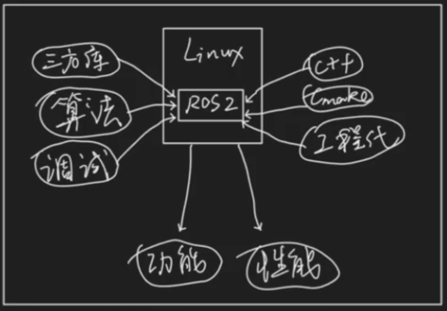
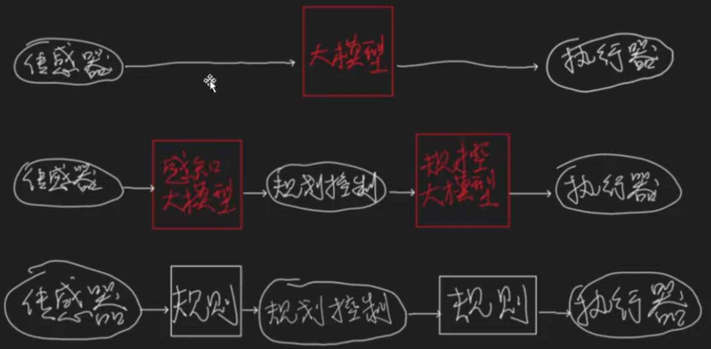
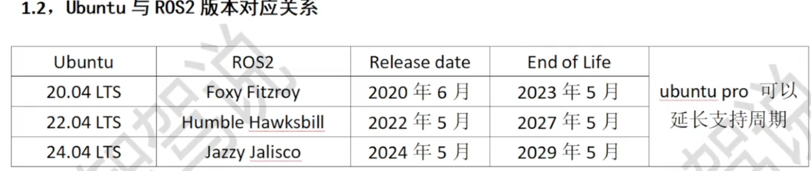
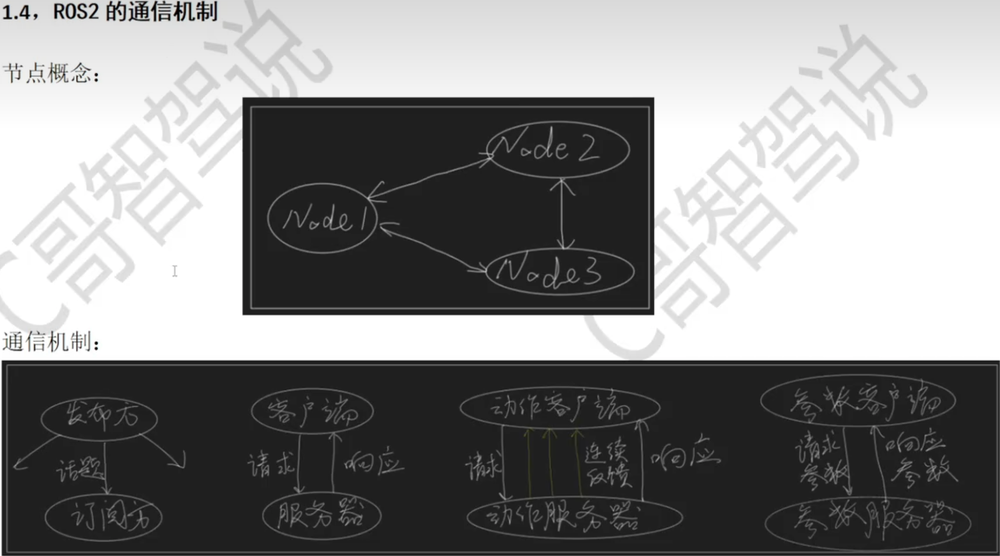

# 1.基于ROS2的自动驾驶决策规划算法实战开发 
https://www.bilibili.com/cheese/play/ep1323705?query_from=0&search_id=18184945762156305540&search_query=%E8%B7%AF%E5%BE%84%E8%A7%84%E5%88%92&csource=common_hpsearch_null_null&spm_id_from=333.337.search-card.all.click

## 1.0 视频课程目录
 

《基于ROS2的自动驾驶算法》课程发售预告片1分4秒
《基于ROS2的自动驾驶算法》课程效果实机演示1分8秒 
《基于ROS2的算法》课程最终前瞻 6分58秒 
课程介绍 10分35秒 
版权声明 1分14秒 
决策规划概述   13分5秒 
前置准备 3分26秒
 
工具链概述：为什么选择ROS2 6分18秒
 
工具链概述：ROS2的编译过程、通信机制、坐标变换 8分55秒

工具链概述：与ROS2相关的可视化与仿真工具
5分3秒

工具链的安装：Ubuntu，VScode，Cmake
9分50秒

ROS2及其配套工具的安装
10分12秒

三方库的安装1
11分24秒
 

三方库的安装2
9分3秒

 
ROS2命令行操作常用指令
6分15秒
 

程序流程与项目架构的设计
10分15秒
 
架构搭建：代码编写
9分36秒

架构搭建：base_msgs改造
6分56秒

架构搭建：data_plot改造
4分58秒

架构搭建：planning改造1：创建目录结构
7分51秒

架构搭建：planning改造2：根目录Cmake编写
9分32秒

架构搭建：planning改造3：子目录Cmake编写
5分34秒

架构搭建：planning改造4：规划流程完善
11分18秒

架构搭建：planning改造5：common和决策中心完善
9分23秒

架构搭建：planning改造6：全局规划和局部规划完善
12分8秒

架构搭建：planning改造7：运动指令和PNC地图完善
11分14秒

架构搭建：planning改造8：参考线和车辆信息完善
8分30秒

架构搭建：planning改造9：头文件与CMake文件完善
11分20秒

架构搭建：配置文件的编写
8分35秒

架构搭建：配置文件的读取
14分4秒

28
架构搭建：车辆模型的搭建原理
10分46秒

29
架构搭建：车辆模型代码实现
10分59秒

30
架构搭建：launch文件的编写
10分2秒

31
架构搭建：在rviz2中加载模型并查看坐标树
12分21秒

32
第三章小节
1分32秒

33
ROS2自带的数据接口
11分8秒

34
自定义的数据接口与代码编写
10分33秒

35
PNC地图和全局规划的作用和工作流程
10分

36
PNC地图和全局规划代码编写思路和注意事项
13分7秒

37
代码编写：pnc地图服务器头文件
8分3秒

38
代码编写：pnc地图服务器源文件
9分16秒

39
代码编写：pnc地图创建器基类
8分14秒

40
代码编写：全局规划创建器基类和服务器头文件
9分16秒

41
代码编写：全局规划服务器源文件
9分16秒

42
代码编写：总流程头文件和初始化
13分29秒

43
代码编写：服务器的连接、请求与响应
11分53秒

44
代码编写：服务器的测试与完善
5分44秒

45
代码编写：直道地图的构造函数
11分31秒

46
代码编写：直道地图的初始化
7分20秒

47
代码编写：直道地图的绘制与生成
10分16秒

48
代码编写：S弯地图的构造函数和初始化
9分28秒

49
代码编写：S弯地图的绘制
10分28秒

50
代码编写：全局规划的实现
12分22秒

51
rqt和ROS2命令行结合项目的应用
6分43秒

52
大作业一：A星算法
3分

53
第五章小节
3分11秒

54
自然坐标系概述
12分3秒

55
自然坐标系的优势和局限性
9分8秒

56
参考线的概述
14分12秒

57
代码编写的思路
9分33秒

58
代码编写：匹配点的查找
11分40秒

59
代码编写：参考线头文件
9分37秒

60
代码编写：参考线的生成
13分2秒

61
代码编写：投影点参数的计算
16分15秒

62
代码编写：车辆信息头文件
11分38秒

63
代码编写：主车构造函数
6分44秒

64
代码编写：规划总流程头文件
12分51秒

65
代码编写：规划总流程的完善
6分41秒

66
代码编写：车辆的生成与定位监听
11分25秒

67
代码编写：总流程回调函数
9分53秒

68
代码编写：在rviz中查看参考线
6分19秒

69
优化问题
10分10秒

70凸集，凸函数与凸优化
8分22秒

71
二次型与二次规划
15分6秒

72
牛顿法
11分14秒

73平滑代价：3个点的推导-方法1
9分15秒

74平滑代价：3个点的推导-方法2
7分39秒

75平滑代价：n个点的推导
11分47秒

76均匀代价的推导
13分7秒

77几何相似代价的推导
5分55秒

78总代价的推导和约束条件
11分51秒

79
代码编写：简单问题的推导
7分27秒

80
代码编写：简单问题的框架搭建
9分32秒

81代码编写：简单问题的求解
12分49秒

82
代码编写：参考线平滑-海塞矩阵的构建1
8分38秒

83代码编写：参考线平滑-海塞矩阵的构建2
8分56秒

84代码编写：参考线平滑-求解与测试
10分40秒

85大作业二、三：牛顿法、参考线拼接
5分1秒

86
第六章小节
3分49秒

87路径决策与规划概述
12分44秒

88坐标系的转换
13分43秒

## 1.1 课程概述
本课程讲述如何在Linux系统下基于**ROS2**使用C++开发一个自动驾驶汽车的决策规划算法
模块，该模块能让车辆具备基本的循迹行驶、静态绕障、动态避障等功能。该模块按照一定
的编程规范编写，具备良好的运行效率、可解释性、解耦性、可读性、可扩展性，符合行业
里很多企业工程化的要求，可以为企业开发提供依据和思路。
场景的调试等内容，按照企业实战开发的要求完成，学完后可以具备决策规划算法工程师的
基本所需技能，可提升求职时的优势，并可快速融入企业实战项目开发中。 
 
### 课程内容
一，绪论：课程整体介绍，决策规划概述，前置准备工作；
二，工具链与环境搭建：Linux，ROS2，VScode，CMake，三方库的安装;
三，项目架构设计与搭建；
四，数据接口定义；
五－十，**算法核心部分**：PNC地图与全局规划，参考线，路径决策与规划，速度决策与规划，运动的实现，轨迹合成；
十一，代码完善与综合调试；
十二，课程总结;

## 1.2 端到端还是基于规则？
这是个开放性问题，我认为作为自动驾驶算法从业者，两者都要会，至少在目前阶段，做端到端的也要懂基于规则的算法技术原理，这是基本功。而基于规则的算法岗位，现在仍然有
很多招聘需求，未来很长一段时间内将与端到端共存。
本课程所有的内容，都是基于规则的算法，目的是帮助广大从业人员强化基本功，培养良好的工程素养。

 

## 1.3 工具链与环境搭建
## 1.3.1，工具链概述
1.1，为什么选择ROS2
 
官网：[ROS:Home](https://ros.org/)
    https://www.ros.org/blog/getting-started/
    https://docs.ros.org/en/humble/Installation.html
    https://docs.ros.org/en/jazzy/Installation.html
   
Gibhub:[ROS2](https://github.com/ros2) 

横向比较（相比于其他软件框架）：开源，免费，多平台支持，应用广泛，社区生态，快速部署.....

纵向比较（相比于ROS1）：去中心化，提升通信质量，对多机编队和小型嵌入式平台支持较好，更易于商业化落地，API支持C++11及以上和Python3.5以上，且ROS1已经停止支持.....

1.2，Ubuntu与R0S2版本对应关系

1.4 R0S2的通信机制

1.5 R0S2的坐标系变换

