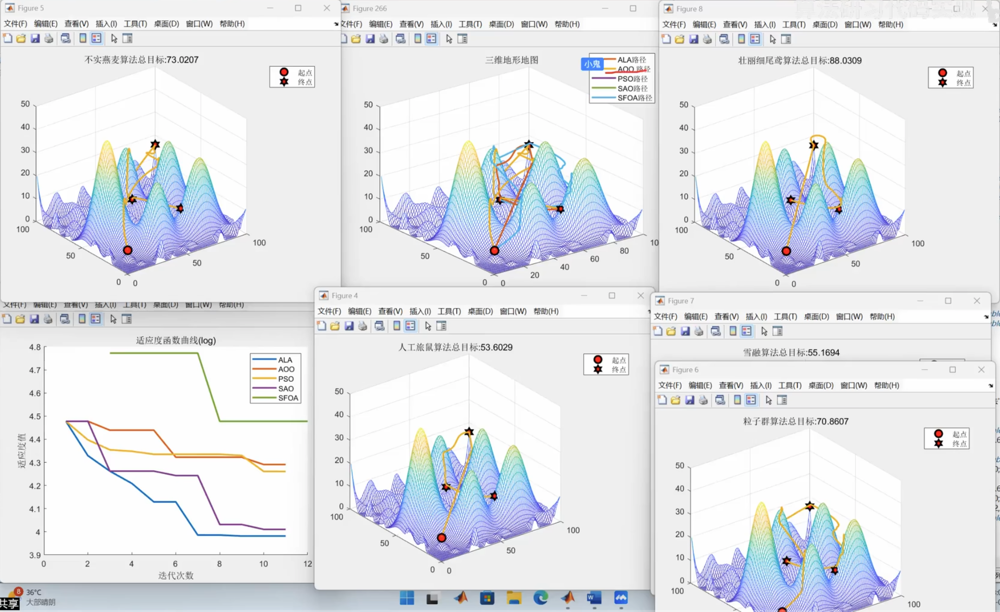

# 1.无人机巡检三维路径规划

[最新SCI路径规划对比-25年最新五种算法优化解决无人机三维巡检三维路径规划 ](https://www.bilibili.com/video/BV1P6TszmE16/?spm_id_from=333.337.search-card.all.click&vd_source=4212b105520112daf65694a1e5944e23)

 
 
ALA 2025人工旅鼠算法优化无人机巡检三维路径规划
A00 2025不实燕麦算法优化无人机巡检三维路径规划
SAO 2024 雪融化算法优化无人机巡检三维路径规划
PSO 经典粒子群算法优化无人机巡检三维路径规划 
SFOA 2025壮丽细尾鸢算法优化无人机巡检三维路径规划

====================================================
# 2.机器人路径规划前沿技术介绍
2020-08-14 01:22:35
https://www.bilibili.com/video/BV1EK411T7bJ/?spm_id_from=333.337.search-card.all.click&vd_source=4212b105520112daf65694a1e5944e23
## 2.1路径规划分类
·传统路径规划
·智能的路径规划
·机器学习的路径规划
·传统的导航
·激光雷达的导航
·视觉导航

## 2.2启发式算法(HeuristicAlgorithms)
最优算法 +  最优解 = 启发式算法

启发定义:
> * 一个基于直观或经验构造的算法
> * 解决 组合优化问题。
> * 实例的一个可行解或最优解问题
> * 解的偏离程度不一定事先可以预计

