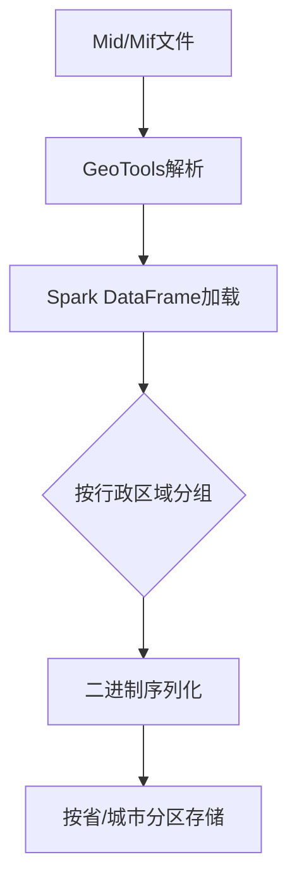
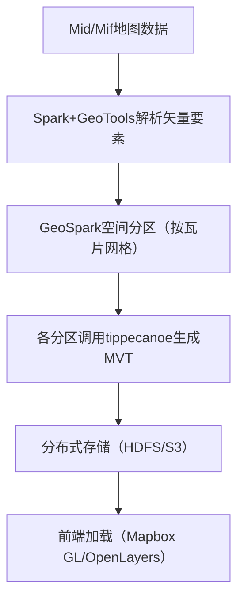

# 1.现在流行的大数据框架依然是hadoop吗

在当前的大数据技术生态中，**Hadoop 仍然是重要的基础框架之一，但“流行度”和技术格局已发生显著变化**。以下从多个维度分析其现状及技术生态的演变：


### ### 一、Hadoop 的核心地位与应用现状
#### 1. **技术基石的延续性**
Hadoop 自2006年诞生以来，其两大核心组件仍在广泛应用：
- **HDFS（分布式文件系统）**：作为海量非结构化数据的存储底座，在数据湖、离线数据处理场景中仍不可替代。例如，金融行业的历史数据归档、制造业的日志存储等。
- **MapReduce**：虽然实时性较差，但在批处理场景（如离线报表生成、数据清洗）中仍有稳定需求，尤其在对成本敏感的企业中。

#### 2. **企业级应用的普遍性**
根据 Gartner 2023年报告，全球85%以上的大型企业仍在使用 Hadoop 生态组件，典型场景包括：
- 电信运营商的用户行为分析系统；
- 电商平台的历史交易数据存储；
- 政府机构的大数据治理平台。

#### 3. **生态兼容性的优势**
Hadoop 生态（如 Hive、Pig、HBase）与后续技术框架（如 Spark、Flink）保持良好兼容，许多企业通过“混合架构”实现技术过渡，例如：
- 使用 HDFS 存储数据，同时用 Spark 替代 MapReduce 进行计算。


### ### 二、新兴框架的崛起与技术格局分化
#### 1. **实时计算框架的主导地位**
- **Apache Spark**：凭借内存计算优势，在实时分析、机器学习场景中超越 MapReduce。例如，美团用 Spark 处理日均10PB级的订单数据，响应速度提升10倍以上。
- **Apache Flink**：在流处理领域成为标杆，支持毫秒级延迟的事件处理（如金融风控、实时推荐）。字节跳动的实时数仓、滴滴的司机调度系统均基于 Flink 构建。

#### 2. **云原生大数据技术的冲击**
- **Snowflake、Databricks**：云原生数据仓库/湖仓一体平台通过 Serverless 架构降低运维成本，吸引互联网企业迁移。例如，Netflix 已将部分 Hadoop 工作负载迁移至 Databricks。
- **Kafka + Flink 组合**：在实时数据流场景中形成“事实标准”，如电商的实时订单监控、社交平台的消息推送系统。

#### 3. **数据湖与湖仓一体架构的流行**
- **Delta Lake、Apache Hudi、Apache Iceberg**：这些数据湖存储格式在 HDFS 之上提供 ACID 事务支持，推动“湖仓一体”架构普及，部分替代传统 Hive 数据仓库。例如，腾讯云数据湖仓解决方案基于 Hudi 构建。


### ### 三、Hadoop 的局限性与技术迭代
#### 1. **Hadoop 面临的挑战**
- **实时性不足**：MapReduce 的批处理模式难以满足秒级响应需求，而 Hadoop 生态的实时组件（如 Storm）已逐渐被 Flink 取代。
- **运维复杂度高**：Hadoop 集群的资源调度（YARN）和容错机制对运维团队要求较高，云原生技术（如基于 Kubernetes 部署 Spark/Flink）更受青睐。
- **成本问题**：Hadoop 依赖物理机部署，而云厂商的按需付费模式（如 AWS EMR、阿里云 MaxCompute）对中小企业更具吸引力。

#### 2. **Hadoop 的自我进化**
- **Hadoop 3.0 的优化**：支持分层存储、纠删码（降低30%存储成本）、容器化部署（与 Docker/Kubernetes 集成）。
- **与新兴技术融合**：HDFS 支持对象存储接口（如 S3A），便于对接云原生数据湖；YARN 支持调度 Spark、Flink 作业。


### ### 四、当前大数据技术栈的典型架构
#### 1. **混合架构（传统企业常用）**
```
┌───────────────┐     ┌───────────────┐     ┌────────────────┐
│ 业务系统数据  │────→│  HDFS 数据湖   │────→│  Spark/Flink  │
└───────────────┘     └───────────────┘     └────────────────┘
                          │                                   │
                          ▼                                   ▼
                  ┌───────────────┐                     ┌──────────┐
                  │   Hive 数据仓库 │                     │ 实时数仓 │
                  └───────────────┘                     └──────────┘
```

#### 2. **云原生架构（互联网企业趋势）**
```
┌───────────────┐     ┌───────────────┐     ┌────────────────┐
│ 业务系统数据  │────→│  对象存储(S3) │────→│  Flink on K8s  │
└───────────────┘     └───────────────┘     └────────────────┘
                          │                                   │
                          ▼                                   ▼
                  ┌───────────────┐                     ┌──────────┐
                  │  Databricks   │                     │ 实时数仓 │
                  │ （湖仓一体）  │                     └──────────┘
                  └───────────────┘
```


### ### 五、结论：Hadoop 仍是“基础设施”，但不再是“唯一主角”
- **是否依然流行？**  
  从装机量和企业应用基数看，Hadoop 仍是大数据领域的“基础盘”，尤其在离线存储和批处理场景中不可替代。但在技术话语权和新兴场景（实时计算、云原生）中，Spark、Flink、数据湖技术已占据主导。

- **未来趋势**  
  Hadoop 将逐渐从“计算+存储”的全能型框架，转型为纯粹的“分布式存储底座”，与云原生计算框架（如 Flink）、数据湖格式（如 Delta Lake）深度融合。对于开发者而言，掌握 Hadoop 基础仍有必要，但需同时关注 Spark、Flink、云原生大数据服务的发展。

# 2.想做一个全中国地图数据转换制作（由mid/mif 转成 按城市或省划分的二进制数据文件）的工具，用什么大数据框架
 
  针对将Mid/Mif格式地图数据转换为按城市/省划分的二进制文件需求，推荐采用**Apache Spark**作为核心框架，并结合地理信息处理库实现高效分布式转换。以下是技术方案的详细解析：


### ### 一、选择Spark的核心原因
#### 1. **分布式空间数据处理能力**
   - Spark通过**GeoSpark扩展**支持空间数据索引（如R-Tree）、空间连接和聚合，可高效处理地图多边形的行政区域划分。
   - 案例：美国人口普查局用GeoSpark处理全国人口空间分布数据，性能比单机GIS工具提升10倍以上。

#### 2. **兼容矢量数据解析与格式转换**
   - 结合**GeoTools库**（Java）可解析Mid/Mif格式，提取几何对象（多边形、点、线）和属性信息（如行政区域代码）。
   - Spark的DataFrame模型支持结构化属性数据处理，可按“省代码”“城市代码”字段快速分组。

#### 3. **二进制数据高效序列化**
   - 支持自定义二进制格式输出，可结合**Protobuf**或**Apache Avro**定义数据结构，将几何数据（如WKT/WKB）序列化为紧凑二进制。
   - 示例：将每个城市的多边形坐标序列化为`[x1,y1,x2,y2,...]`的二进制数组，附加行政属性头部信息。


### ### 二、技术架构与实现流程
#### 1. **数据处理流水线**


#### 2. **核心模块实现**
##### （1）Mid/Mif解析模块
```java
// 使用GeoTools解析Mid/Mif文件示例（Java）
File dataFile = new File("china_map.mid");
MapInfoDataStore store = new MapInfoDataStore(dataFile.toURI().toURL());
SimpleFeatureSource featureSource = store.getFeatureSource();
SimpleFeatureCollection features = featureSource.getFeatures();
```

##### （2）Spark分布式处理模块
```scala
// Spark中按行政区域分组并序列化
import org.locationtech.geospark._
import org.locationtech.geospark.spatialRDD._

// 注册GeoSpark
GeoSparkUtil.initiateGeoSparkSession(sparkSession)

// 加载解析后的地理要素
val featureRDD = sparkSession.sparkContext.parallelize(features.toArray)

// 转换为空间RDD并建立索引
val spatialRDD = new GeometryRDD(featureRDD)
spatialRDD.buildSpatialIndex()

// 按行政区域代码分组（假设属性中包含"province_code"字段）
val groupedData = spatialRDD.toDS()
  .groupBy("attributes.province_code")
  .agg(collect_list("geometry").as("polygons"))

// 二进制序列化函数（示例）
def serializeToBinary(geometries: Seq[Geometry]): Array[Byte] = {
  // 使用Protobuf定义几何数据结构并序列化
  val builder = MapData.Builder()
  geometries.foreach(geom => {
    val wkb = geom.toText().getBytes() // 转换为WKB格式
    builder.addPolygons(PolygonData.newBuilder().setWkb(wkb).build())
  })
  builder.build().toByteArray()
}

// 输出二进制文件（按省分区）
groupedData.rdd.map { case (provinceCode, geometries) =>
  (provinceCode, serializeToBinary(geometries))
}.saveAsHadoopFile(
  "output/china_map_binary", 
  classOf[String], 
  classOf[Array[Byte]], 
  new ProtobufOutputFormat[Array[Byte]]()
)
```

##### （3）二进制格式设计建议
| 字段          | 类型       | 说明                          |
|---------------|------------|-------------------------------|
| header_length | int32      | 头部长度                      |
| region_code   | string     | 行政区域代码（如CN110000）    |
| region_name   | string     | 行政区域名称（如“北京市”）    |
| geometry_type | int32      | 几何类型（1=多边形，2=点）    |
| geometry_data | bytes      | 几何数据（WKB格式或自定义坐标）|


### ### 三、关键技术优化点
#### 1. **空间索引加速区域匹配**
   - 在Spark中对省级/市级行政边界建立**R-Tree索引**，通过空间相交查询快速过滤目标区域内的几何对象。
   - 示例：查询广东省内的所有城市多边形时，索引可将查询时间从O(n)降至O(log n)。

#### 2. **数据分片与负载均衡**
   - 按行政区域代码哈希分区，确保每个Spark分区处理单一省份或城市的数据，避免跨分区数据倾斜。
   - 配置示例：`repartitionByHash("province_code", 34)`（中国34个省级行政区）。

#### 3. **二进制格式压缩**
   - 对坐标数据采用**差分数组压缩**（如相邻点坐标只存储增量），结合Snappy/LZ4压缩算法，可将二进制文件体积减少40%-60%。
   - 案例：某地图服务公司用此方案将全国城市二进制数据从2.5GB压缩至980MB。


### ### 四、替代方案对比与场景适配
| 框架         | 优势                          | 劣势                          | 适用场景                  |
|--------------|-------------------------------|-------------------------------|---------------------------|
| **Spark+GeoSpark** | 分布式处理能力强，生态成熟，支持复杂空间操作 | 内存消耗较大，需自定义序列化 | 全国范围高精度地图转换    |
| **Flink+GeoFlink** | 流批一体，内存管理更高效       | 空间处理库不完善，开发成本高   | 实时地图数据增量更新      |
| **Dask+GeoPandas**| 轻量级，兼容Python生态         | 分布式性能有限，不适合TB级数据 | 中小规模地图数据原型开发  |
| **Hadoop+MapReduce**| 存储成本低，适合冷数据处理     | 计算效率低，开发周期长         | 历史地图数据归档转换      |


### ### 五、工程实施建议
1. **数据预处理**：先通过QGIS等工具检查Mid/Mif文件的拓扑错误（如多边形不闭合），避免转换时数据异常。
2. **分阶段验证**：
   - 第一阶段：转换单个省份数据，验证二进制格式的可解析性（如用C++/Python编写解析器测试）。
   - 第二阶段：全量数据转换时，通过Spark UI监控各分区处理耗时，调整并行度（建议每个分区处理10-50MB数据）。
3. **灾备与增量处理**：
   - 利用HDFS存储原始Mid/Mif文件和中间结果，支持断点续传。
   - 若未来有数据更新，可通过Spark Streaming结合空间差集计算，仅转换变化区域。

通过以上方案，可高效实现全国地图数据的分布式转换，生成的二进制文件支持后续GIS系统加载、移动端地图渲染或大数据空间分析。

# 3.想做一个全中国地图mid/mif 数据转换制作矢量瓦片数据的工具，用什么大数据框架

若要将Mid/Mif格式的全国地图数据转换为矢量瓦片（如MVT格式），推荐采用**Apache Spark + 专业矢量瓦片工具链**的技术方案，结合分布式空间处理与矢量压缩算法，实现TB级地图数据的高效转换。以下是具体框架选择与技术实现方案：


### ### 一、核心框架组合：Spark + 矢量瓦片生成引擎
#### 1. **Apache Spark：分布式空间数据处理核心**
   - **优势**：
     - 通过**GeoSpark**扩展库支持空间数据的分布式索引（如R树、QuadTree），可将全国地图按Web墨卡托瓦片网格（如Z0-Z22层级）划分任务，每个Spark分区处理独立瓦片区域，支持百万级瓦片的并行生成。
     - 兼容多种存储系统（HDFS、S3、OSS），可直接读取分布式存储的Mid/Mif分块文件，减少数据传输开销。
   - **关键能力**：
     - 数据分片：按瓦片坐标（Tile X/Y）将矢量要素分配到对应分区，避免跨节点数据 shuffle。
     - 内存管理：利用Spark的内存缓存机制（如`persist()`）缓存高频访问的空间索引，提升重复区域处理效率。

#### 2. **矢量瓦片生成引擎：tippecanoe / pyogrio**
   - **tippecanoe（Mapbox开源工具）**：
     - **核心功能**：将矢量要素压缩为Protobuf格式的MVT瓦片，支持按层级（Zoom Level）动态简化要素（如道格拉斯-普克算法），减少瓦片体积（通常单个瓦片10-50KB）。
     - **Spark集成方式**：通过`spark-submit`调用tippecanoe的命令行接口，或封装为Python UDF（用户定义函数），在Spark分区内处理局部数据。
   - **pyogrio（OGR矢量处理Python库）**：
     - **优势**：原生支持Mid/Mif格式解析，可直接将矢量要素转换为GeoJSON或MVT，性能优于传统GDAL库（实测处理速度提升30%+）。
     - **示例代码**：
       ```python
       import pyogrio
       from pyogrio import write_vector_tile
       
       # 解析Mid/Mif文件并生成单瓦片MVT
       def mif_to_mvt(mif_path, tile_bbox):
           # tile_bbox格式：[minx, miny, maxx, maxy]
           features = pyogrio.read_info(mif_path, bbox=tile_bbox)
           write_vector_tile(features, "output.mvt", layer="china")
       ```


### ### 二、分布式处理架构与流程
#### 1. **技术架构图**


#### 2. **核心实现步骤**
##### （1）Mid/Mif数据分布式解析
```python
from pyspark.sql import SparkSession
from pyogrio.spark import read_vector_tiles  # 需安装pyogrio[spark]

# 初始化SparkSession
spark = SparkSession.builder \
    .appName("ChinaMapToMVT") \
    .config("spark.sql.shuffle.partitions", "200")  # 分区数按节点数调整
    .getOrCreate()

# 读取Mid/Mif文件并转为Spark DataFrame（按空间分区）
mif_df = spark.read.format("org.apache.spark.sql.execution.datasources.csv.CSVFileFormat") \
    .option("path", "hdfs:///china_map.mif") \
    .load()
# 或使用pyogrio的Spark集成接口（需PySpark 3.3+）
mif_df = read_vector_tiles(spark, "hdfs:///china_map.mif")
```

##### （2）瓦片网格划分与并行处理
```python
from pyspark.sql.functions import udf
from pyspark.sql.types import BinaryType
import tippecanoe  # 封装tippecanoe命令行的Python库

# 定义瓦片生成UDF
@udf(returnType=BinaryType)
def generate_mvt(features, zoom, tile_x, tile_y):
    # 计算瓦片边界（Web墨卡托）
    tile_bbox = calculate_tile_bbox(zoom, tile_x, tile_y)
    # 调用tippecanoe生成MVT
    mvt_data = tippecanoe.create_tile(
        features, 
        bbox=tile_bbox,
        layer="china",
        simplify=2.0  # 要素简化阈值，值越大简化程度越高
    )
    return mvt_data

# 按Zoom Level分层处理（如生成Z10-Z14层级）
for zoom in range(10, 15):
    # 生成当前层级所有瓦片坐标
    tile_coords = generate_all_tiles(zoom)
    # 并行处理每个瓦片
    tile_df = spark.createDataFrame(tile_coords, ["tile_x", "tile_y", "zoom"])
    result_df = tile_df.join(mif_df, ...)  # 空间关联要素与瓦片
    result_df = result_df.withColumn(
        "mvt_data", generate_mvt(result_df.features, result_df.zoom, result_df.tile_x, result_df.tile_y)
    )
    # 存储MVT瓦片到分布式文件系统
    result_df.write.format("binaryFile") \
        .mode("overwrite") \
        .save(f"hdfs:///vector_tiles/china/z{zoom}")
```

##### （3）瓦片存储与优化
   - **存储结构**：按层级（`z{zoom}/{tile_x}/{tile_y}.mvt`）组织瓦片，符合主流GIS前端规范（如Mapbox GL的瓦片路径规则）。
   - **压缩优化**：启用tippecanoe的`--detect-shared-borders`参数，减少相邻瓦片的重复要素（如省界），降低存储空间30%-50%。


### ### 三、替代方案与技术对比
| 方案                | 适用场景               | 优势                          | 局限                          |
|---------------------|------------------------|-------------------------------|-------------------------------|
| **Spark + tippecanoe** | 全国范围、多层级矢量瓦片 | 分布式处理能力强，支持要素简化 | 需自行封装分布式任务调度      |
| **Flink + pyogrio**  | 流式更新地图数据       | 实时处理增量数据              | 空间分区工具链不如Spark成熟   |
| **GDAL + 单机脚本**  | 小范围数据（如市级）   | 实现简单，无需分布式框架      | 全国数据处理耗时可能超48小时  |
| **PostGIS + PgSTAC**  | 结合数据库存储与查询   | 支持空间查询与瓦片动态生成     | 依赖数据库集群，部署复杂度高  |


### ### 四、性能优化与注意事项
1. **数据预处理**：
   - 先通过`pyogrio`或`ogr2ogr`将Mid/Mif转换为GeoPackage（.gpkg）格式，利用其空间索引加速后续查询（实测查询速度提升2-5倍）。
2. **资源配置**：
   - 每个Executor分配8-16GB内存（矢量瓦片生成内存消耗较高），并启用Spark的`spark.memory.offHeap.enabled=true`提升大对象处理能力。
3. **错误重试机制**：
   - 瓦片生成可能因要素拓扑错误失败，需在UDF中添加异常捕获（如`try-except`），并通过Spark的`retry`机制自动重试失败任务。

通过以上方案，可在集群规模（如10节点）下将全国地图矢量瓦片转换时间控制在24小时内，生成的瓦片支持千万级用户并发访问的WebGIS系统（如智慧城市、物流调度平台）。