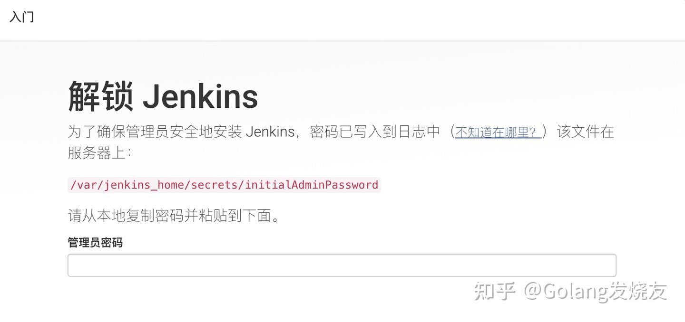
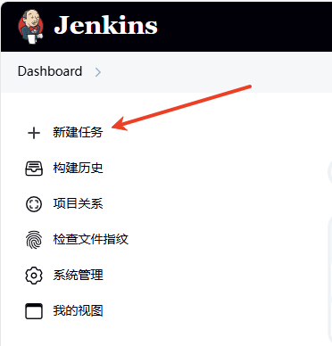
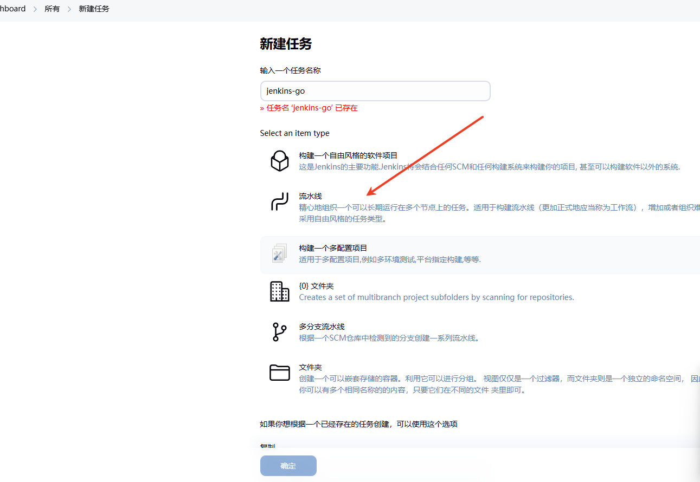
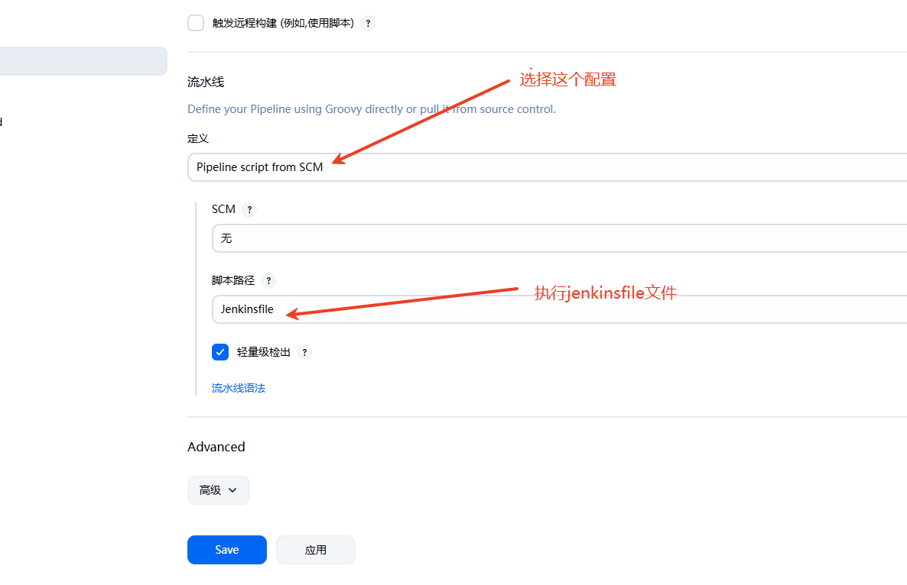
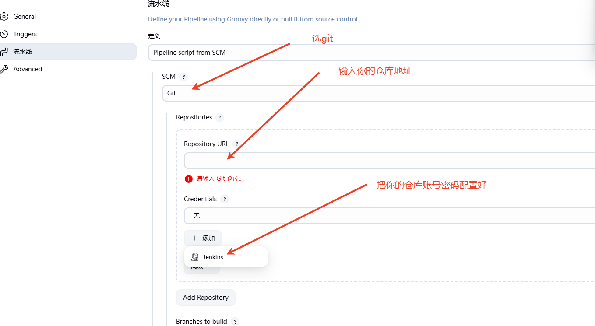
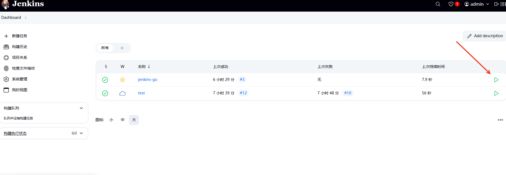
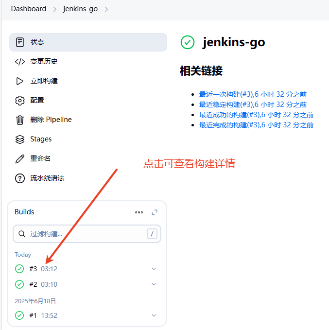
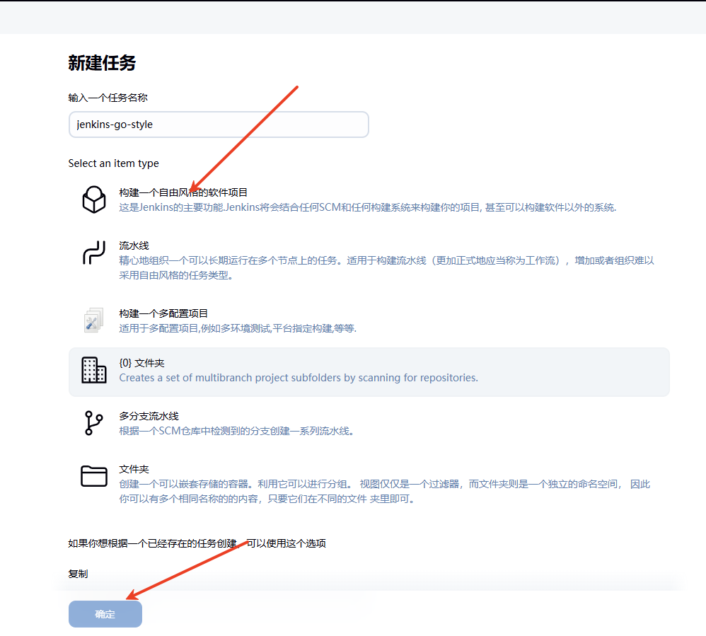
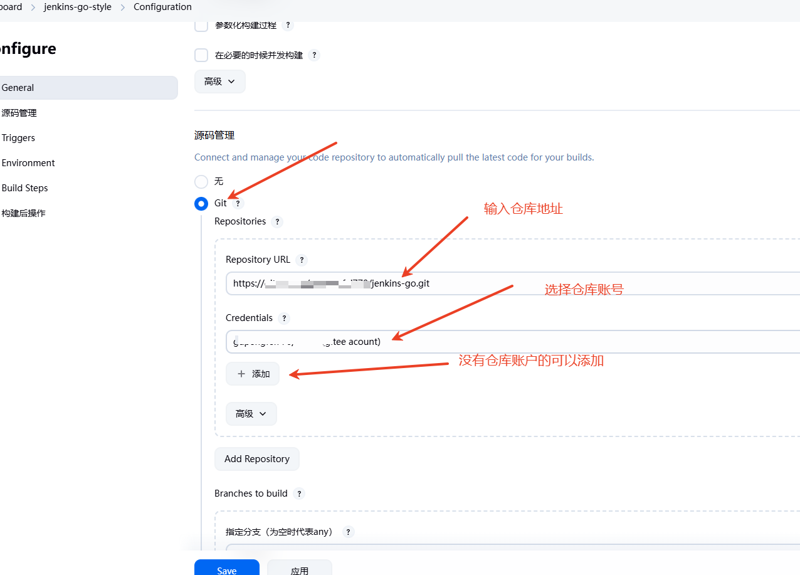
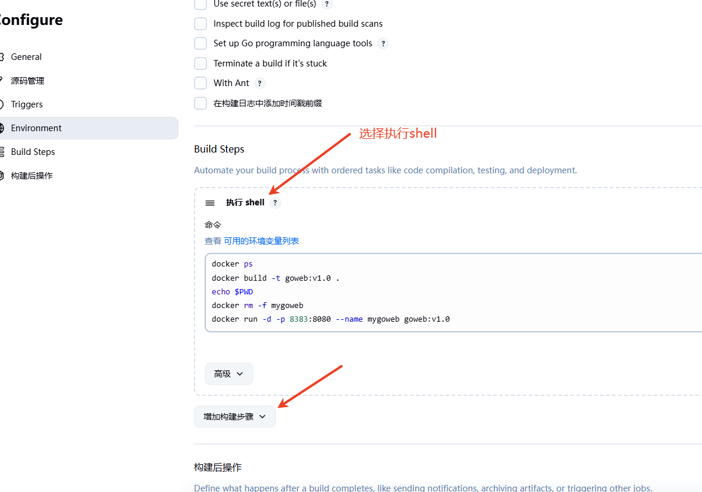

# Docker+Jenkins+git实现Golang项目自动部署
  
本文链接：[https://blog.csdn.net/u012941592/article/details/148747215] 

## 1. 安装Docker

## 2. 拉取Jenkins镜像

使用以下命令从Docker Hub拉取Jenkins的官方镜像：

```sh
# 拉取Jenkins的官方镜像
docker pull jenkins/jenkins:lts
```

## 3. 创建并运行Jenkins容器（使用root权限） 

重点！重点！重点！为了让Jenkins容器以root权限运行，并且jenkins容器可以使用宿主机上的docker命令，你可以使用以下命令：

```sh
# 创建并运行Jenkins容器，使用root权限
docker run -d -u root \
  -p 8080:8080 \
  -p 50000:50000 \
  --name jenkins \
  -v /var/run/docker.sock:/var/run/docker.sock \
  -v /usr/bin/docker:/usr/bin/docker \
  -v jenkins_home:/var/jenkins_home \
  jenkins/jenkins:lts
```

> -   --d ：让容器在后台运行。
> -   --u root ：指定容器以root用户身份运行。
> -   --p 8080:8080
>     ：将容器内的8080端口映射到主机的8080端口，用于访问Jenkins的Web界面。
> -   --p 50000:50000
>     ：将容器内的50000端口映射到主机的50000端口，用于Jenkins的代理通信。
> -   --v jenkins_home:/var/jenkins_home ：将主机的卷 jenkins_home
>     挂载到容器内的 /var/jenkins_home 目录，用于持久化存储Jenkins的数据。
> -   --v /var/run/docker.sock:/var/run/docker.sock
>     ：将主机的Docker套接字文件挂载到容器内，允许容器内的Jenkins使用主机的Docker服务
> -   -v /usr/bin/docker:/usr/bin/docker ：将宿主机的 Docker
>     命令行工具挂载到容器中，使得 Jenkins 容器可以使用 docker 命令

##  4.Go项目

项目地址：[gupengfei770/jenkins-go](  https://gitee.com/gupengfei770/jenkins-go ) 

Dockerfile，参考文档：[docker部署第一个Go项目_docker部署go项目-CSDN博客](https://blog.csdn.net/u012941592/article/details/148014147 "docker部署第一个Go项目_docker部署go项目-CSDN博客")

``` 
#这里使用Go 1.23.0版本的Alpine Linux镜像  AS  bulider 指定镜像的阶段名称
FROM golang:1.23.0-alpine AS bulider
WORKDIR /webapp
COPY . .
RUN go env -w GOPROXY=https://goproxy.cn,direct && go mod tidy
RUN go build -o web-app
 
#使用一个更小基础镜像Alpine来运行程序
#Alpine是一个极简的Linux发行版，适合部署阶段
FROM alpine:latest
 
#设置工作目录/build
WORKDIR /build
 
#从编译阶段的镜像中拷贝编译后的二进制文件到运行镜像中
#--from=bulider 是第一阶段编译的镜像
COPY --from=bulider /webapp/web-app /build/web-app
 
CMD ["/build/web-app"]
```

Jenkinsfile文件

```
pipeline {
    agent any
    stages {
      
        stage('初始化 Go 模块') {
            steps {
                sh 'echo $PATH'
                sh 'pwd'
            }
        }
        stage('构建 Docker 镜像') {
            steps {
                sh 'pwd'
                sh 'docker build -t jenkins-go:v1.0 .'
            }
        }
        stage('部署 Docker 镜像') {
            steps {
                sh 'pwd'
                sh 'docker rm -f myJenkinsGo'  
                sh 'docker run -d -p 8282:8080 --name myJenkinsGo jenkins-go:v1.0'
            }
        }
    }
}
```

## 5.jenkins配置

访问：http://<你的ip地址>:8080

 

获取密码：

通过提示输入密码，选择推荐安装插件，插件安装时间一般较长，安装失败可以点击重试，一般都会下载下来，也可以更换下载源。

## 6.创建流水线项目



 



 



 

## 7.创建自由风格项目



 

 

## 8.总结

无论是流水线还是自由风格部署。都是利用docker操作了。
