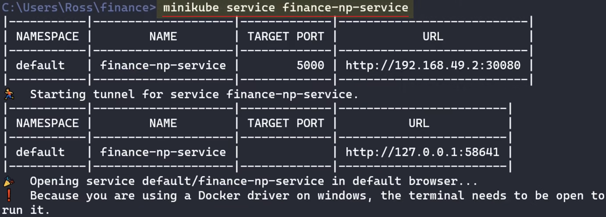

[00:00:00.880 --> 00:00:03.240]  嗨大家好,我是罗斯。
[00:00:03.240 --> 00:00:05.400]  在学习使用Kubernetes之前，我们先来了解一下它是用来解决什么样的问题。
[00:00:08.480 --> 00:00:11.680]  我们知道Docker就像是一个轻量级的虚拟机，它将应用程序的代码、工具库和运行环境，，全部都封装在了一个容器中，，因此大大降低了测试和部署的难度。
[00:00:19.680 --> 00:00:23.320]  我们要做的不过是在服务器上运行挑指令而已。

[00:00:23.320 --> 00:00:26.360]  但如果你要部署的是像购物系统这类架构复杂，规模庞大的应用，它们需要根据访问量自动分配服务器、网络资源，并且在某个容器当机之后自动进行灾难恢复、故障转移，这个时候Kubernetes就可以大显伸手了。

[00:00:38.760 --> 00:00:43.360]  这一视频我会向大家讲解Kubernetes的基本概念、安装和使用，并用它来部署一个简单的服务器应用。
[00:00:58.000 --> 00:01:02.240]  这一视频需要大家对Docker或者容器技术有基本的了解， 如果大家还不太熟悉相关概念的话，可以先去看看Docker的那一期视频。

[00:01:07.440 --> 00:01:11.400]  好的,我们先从整体上来认识一下Kubernetes的工作原理.

## 2.Kubernetes的工作原理
[00:01:11.400 --> 00:01:16.000]  我们知道Kubernetes是一个用于大规模部署分部式应用的平台, 它管理着一系列的主机或者服务器, 它被称作 Node节点。

 每个节点运行了若干个相互独立的Pod。Pod是Kubernetes中**可以部署的最小执行单元**，说白了它就**是一个或者多个容器的集合**，其中运行了我们应用的某一部分核心组件，比如数据库、Web服务器等等。
 

单这么多的Pod，它们需要相互协调才能做到负载均衡或者故障的转移，这就需要一台中心计算机来集中管理，这个中心计算机被称作Control plane控制平面。

控制平面通过专有的API与各个节点经通信，它会实施监测节点的网络状态来平衡服务器的负载，或者临时下发指令来应对突发的状况。

比如Kubernetes发现某个容器或者Pod挂掉了，它会立即启用在后台预先准备好的，随时待命的备用容器来替换它 ，这些容器被称作Replica set、副本集合。 

正是由于它们的存在，才让我们的应用能够长时间不间断的可靠运行。而以上讲到的所有节点连同控制平面，一起被称作一个Cluster集群。集群代表了Kubernetes所管理的全部主机节点。

## 3.minikube
[00:02:24.640 --> 00:02:26.720]  要配置一个Kubernetes集群，我们当然可以亲自租用服务器去搭建环境，不过步骤会稍微繁琐一点。另一种做法是使用现成的、预先配置好的云服提供商，比如谷歌的GKE、亚马逊的EKS， 阿里的ACK、腾讯的TKE等等。但如果你纯粹为了学习和测试，一种完全免费的方法是使用minikube，在本地模拟一个Kubernetes集群，这也是我接下来要用到的方法。

你这样可以使用Kubernetes的全部功能,只不过它不是一个真实的生产环境而已。
### 下载并安装最新的minikube
我们按照这里的步骤下载并安装最新的版本

https://minikube.sigs.k8s.io/docs/start/?arch=%2Flinux%2Fx86-64%2Fstable%2Fbinary+download

随后只需要一行指令 minikube Start 启动本地模拟的集群即可。

### 部署一个应用
[00:03:06.240 --> 00:03:09.640]  在有了集群之后，我们来讲一下如何在上面部署一个应用。 首先我们需要创建一个yaml文件“deployment.yaml”，里面定义了我们应用的基本信息,比如它有哪些Pod组成,里面运行了哪些容器以及网络配置等等。它和Docker中的Docker File很类似，你可以把它当作是一个自动化脚本，里面描述了应用部署的整个过程。

[00:03:29.440 --> 00:03:30.840]  另外在Vs Code中,我强力建议去安装一个Kubernetes插件。它除了提供基本的余法检测、代码提示。。在左侧的面板中。还显示了我们集群的各种信息、运行状态，整个部署的过程，也都可以通过图形界面完成。

[00:03:44.840 --> 00:03:47.840]  这里我们先创建一个Deployment.yaml文件，然后输入Deployment。让Vs Code帮我们生成一个最最基本的配置。

可以看到这里列出了相当多的属性，

我们可以将鼠标悬停在上面，找到每个属性的详细用法。接下来我们去修改其中我们关心的部分即可。
[00:04:02.440 --> 00:04:03.240]  首先第一步，我们先将所有的MyApp改成我们应用的名字。

这里的Replicas指定了 连同备用Pod在内的所有Pod数量。

然后最重要的是这里的这个Template，它里面定义了与Pod相关的所有信息，比如下面的Containers指定了Pod中运行的所有容器。

[00:04:20.640 --> 00:04:23.040]  这里我还是用上期视频中创建的,一个非常简单的Web应用来做演示. 不过我事先将它的镜像上传在了Docker Hub上,这样Kubernetes可以自动拉取到它.
,
于是这里我们直接填写镜像的名称即可.

另外我们可以通过这里的Limits, 为每个Pod设置合理的CPU和内存配额。

最下面的ContainerPort， 指定了容器需要对外暴露的端口。 比如我们Web容器使用的是5000端口。
在默认情况下，我们的Pod只能与同一个集群内的其他Pod进行通信。

虽然每一个Pod都拥有一个独立的IP，但这个IP地址对外网是不可见的。如果要从外网访问我们的应用，我们还需要用到Kubernetes中另一个重要的组件， 服务service
这里我们先讲一个最最基本的服务 NodePort ，它是一种最原始的 将应用端口暴露给外网的方式。

建立在它之上， Kubernetes还提供LoadBalancer 或者更加复杂的Ingress 来实现复杂的均衡，不过这里就不展开讨论了。

我们现在下面用三个横线隔开, 然后输入Service来添加一个服务.

接下来我们在Selectors中指定 应当将数据转发到哪一个Pod上。 这里直接填写之前的应用名称即可。

随后的Type指定了服务的类型，也就是NodePort。 后面的Port和TargetPort，我们设置成5000，和容器端口保持一致。
最后的NodePort，指定了暴露给外网的端口， 这里我设置成了3080，当然我们可以省略这一行，让Kubernetes自动进行分配。

到这里我们的配置文件就完成了，接下来到了真正应用部署的环节。
### 应用部署

[00:05:58.440 --> 00:06:01.240]  这里我们会用到一个命令行工具 kubectl ，来与Kubernetes集群进行交互。这是一个所有平台通用的工具，就好比我们之前用到的Docker命令一样，它可以操纵任何的集群，包括我们本地模拟的minikube。

通常Docker的桌面版本，都自带了 kubectl 命令。但如果你计算机中没有安装Docker，则需要去这里额外下载。

安装完毕后，我们可以使用CubeControlApply，来部署我们的应用，并且传入之前创建的这个YAML文件，可以看到这个命令成功执行，此时Kubernetes会在后台开始应用的部署。

我们可以通过 kubectl get pods 查看所有 pods的运行状态。这里显示了我们之前指定的， 其中包括备用Pod在内的三个Pod，他们目前都是正常运行的状态。

另外使用kubectl get services，可以查看所有创建的服务，比如这里是之前定义的NotePort服务。

### 访问被部署的app
[00:06:55.440]  既然应用已经被成功部署，我们自然可以去浏览器中访问它。
由于这里我们用到的是minikube模拟的集群，所以需要用到一个专门的指令 minikube service，后面跟上我们服务的名字

[00:07:08.640]  这样minikube会自动在浏览器中打开我们的应用

[00:07:14.240]  另外顺带提一下, 之前所有的操作也都可以通过VS Code中的插件完成，里面可以查看各个节点Pod服务的运行状态，停止或者删除它们，不过这个就靠大家自己探索了

### 更新应用
[00:07:29.240]  这个时候如果我们想要更新应用，比如切换容器镜像的版本，或者重新分配CPU和内存资源，我们只需要去修改之前的Deployment点按摩文件，

然后再次调用kubectl apply即可， Kubernetes会在后台无缝地更新我们的应用，确保新版本运行起来以后再取消回旧的版本,因此用户不会遇到服务停机的问题。

类似的，如果我们不再需要这个应用，那么可以通过kubectl delete命令从集群上完全移除它，后面我们传入相同的配置文件即可

[00:08:04.040]  讲到这里我们也不过是介绍了Kubernetes中一个非常简单的应用部署，通常生产环境下的应用远比这个要复杂得多

如果大家想继续深入的话,还是建议去阅读下**官方的文档**,里面可以找到各种实用的案例，包括安全配置、网络管理、故障排除甚至是GPU调度等等。如果能亲自按照上面的步骤做一遍当然是最好的。
https://kubernetes.io/zh-cn/docs/home  
https://kubernetes.io/zh-cn/docs/tutorials/kubernetes-basics/

[00:08:27.440]  那今天视频我们就暂时讲到这里，最后感谢大家观看，我是罗斯我们下期再见

