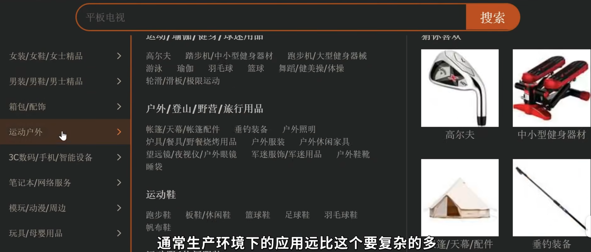

[00:00:00.880 --> 00:00:03.240]  嗨大家好,我是罗斯。
[00:00:03.240 --> 00:00:05.400]  在学习使用Kubernetes之前，我们先来了解一下它是用来解决什么样的问题。
[00:00:08.480 --> 00:00:11.680]  我们知道Docker就像是一个轻量级的虚拟机，它将应用程序的代码、工具库和运行环境，，全部都封装在了一个容器中，，因此大大降低了测试和部署的难度。
[00:00:19.680 --> 00:00:23.320]  我们要做的不过是在服务器上运行挑指令而已。

[00:00:23.320 --> 00:00:26.360]  但如果你要部署的是像购物系统这类架构复杂，规模庞大的应用，它们需要根据访问量自动分配服务器、网络资源，并且在某个容器当机之后自动进行灾难恢复、故障转移，这个时候Kubernetes就可以大显伸手了。

[00:00:38.760 --> 00:00:43.360]  这一视频我会向大家讲解Kubernetes的基本概念、安装和使用，并用它来部署一个简单的服务器应用。
[00:00:58.000 --> 00:01:02.240]  这一视频需要大家对Docker或者容器技术有基本的了解， 如果大家还不太熟悉相关概念的话，可以先去看看Docker的那一期视频。

[00:01:07.440 --> 00:01:11.400]  好的,我们先从整体上来认识一下Kubernetes的工作原理.

## 2.Kubernetes的工作原理
[00:01:11.400 --> 00:01:16.000]  我们知道Kubernetes是一个用于大规模部署分部式应用的平台, 它管理着一系列的主机或者服务器, 它被称作 Node节点。


 每个节点运行了若干个相互独立的Pod。Pod是Kubernetes中**可以部署的最小执行单元**，说白了它就**是一个或者多个容器的集合**，其中运行了我们应用的某一部分核心组件，比如数据库、Web服务器等等。
 

单这么多的Pod，它们需要相互协调才能做到负载均衡或者故障的转移，这就需要一台中心计算机来集中管理，这个中心计算机被称作Control plane控制平面。


控制平面通过专有的API与各个节点经通信，它会实施监测节点的网络状态来平衡服务器的负载，或者临时下发指令来应对突发的状况。


比如Kubernetes发现某个容器或者Pod挂掉了，它会立即启用在后台预先准备好的，随时待命的备用容器来替换它 ，这些容器被称作Replica set、副本集合。 


正是由于它们的存在，才让我们的应用能够长时间不间断的可靠运行。而以上讲到的所有节点连同控制平面，一起被称作一个Cluster集群。集群代表了Kubernetes所管理的全部主机节点。


## 3.minikube
[00:02:24.640 --> 00:02:26.720]  要配置一个Kubernetes集群，我们当然可以亲自租用服务器去搭建环境，不过步骤会稍微繁琐一点。另一种做法是使用现成的、预先配置好的云服提供商，比如谷歌的GKE、亚马逊的EKS， 阿里的ACK、腾讯的TKE等等。但如果你纯粹为了学习和测试，一种完全免费的方法是使用minikube，在本地模拟一个Kubernetes集群，这也是我接下来要用到的方法。


你这样可以使用Kubernetes的全部功能,只不过它不是一个真实的生产环境而已。
### 下载并安装最新的minikube
我们按照这里的步骤下载并安装最新的版本


https://minikube.sigs.k8s.io/docs/start/?arch=%2Flinux%2Fx86-64%2Fstable%2Fbinary+download

随后只需要一行指令 minikube Start 启动本地模拟的集群即可。

### 部署一个应用
[00:03:06.240 --> 00:03:09.640]  在有了集群之后，我们来讲一下如何在上面部署一个应用。 首先我们需要创建一个yaml文件“deployment.yaml”，里面定义了我们应用的基本信息,比如它有哪些Pod组成,里面运行了哪些容器以及网络配置等等。它和Docker中的Docker File很类似，你可以把它当作是一个自动化脚本，里面描述了应用部署的整个过程。

[00:03:29.440 --> 00:03:30.840]  另外在Vs Code中,我强力建议去安装一个Kubernetes插件。它除了提供基本的余法检测、代码提示。。在左侧的面板中。还显示了我们集群的各种信息、运行状态，整个部署的过程，也都可以通过图形界面完成。


[00:03:44.840 --> 00:03:47.840]  这里我们先创建一个Deployment.yaml文件，然后输入Deployment。让Vs Code帮我们生成一个最最基本的配置。

可以看到这里列出了相当多的属性，

我们可以将鼠标悬停在上面，找到每个属性的详细用法。接下来我们去修改其中我们关心的部分即可。
[00:04:02.440 --> 00:04:03.240]  首先第一步，我们先将所有的MyApp改成我们应用的名字。

这里的Replicas指定了 连同备用Pod在内的所有Pod数量。

然后最重要的是这里的这个Template，它里面定义了与Pod相关的所有信息，比如下面的Containers指定了Pod中运行的所有容器。


[00:04:20.640 --> 00:04:23.040]  这里我还是用上期视频中创建的,一个非常简单的Web应用来做演示. 不过我事先将它的镜像上传在了Docker Hub上,这样Kubernetes可以自动拉取到它.
,
于是这里我们直接填写镜像的名称即可.

另外我们可以通过这里的Limits, 为每个Pod设置合理的CPU和内存配额。

最下面的ContainerPort， 指定了容器需要对外暴露的端口。 比如我们Web容器使用的是5000端口。
在默认情况下，我们的Pod只能与同一个集群内的其他Pod进行通信。

虽然每一个Pod都拥有一个独立的IP，但这个IP地址对外网是不可见的。如果要从外网访问我们的应用，我们还需要用到Kubernetes中另一个重要的组件， 服务service
这里我们先讲一个最最基本的服务 NodePort ，它是一种最原始的 将应用端口暴露给外网的方式。

建立在它之上， Kubernetes还提供LoadBalancer 或者更加复杂的Ingress 来实现复杂的均衡，不过这里就不展开讨论了。


我们现在下面用三个横线隔开, 然后输入Service来添加一个服务.


接下来我们在Selectors中指定 应当将数据转发到哪一个Pod上。 这里直接填写之前的应用名称即可。


随后的Type指定了服务的类型，也就是NodePort。 后面的Port和TargetPort，我们设置成5000，和容器端口保持一致。
最后的NodePort，指定了暴露给外网的端口， 这里我设置成了3080，当然我们可以省略这一行，让Kubernetes自动进行分配。


到这里我们的配置文件就完成了，接下来到了真正应用部署的环节。
### 应用部署

[00:05:58.440 --> 00:06:01.240]  这里我们会用到一个命令行工具 kubectl ，来与Kubernetes集群进行交互。这是一个所有平台通用的工具，就好比我们之前用到的Docker命令一样，它可以操纵任何的集群，包括我们本地模拟的minikube。

通常Docker的桌面版本，都自带了 kubectl 命令。但如果你计算机中没有安装Docker，则需要去这里额外下载。


安装完毕后，我们可以使用CubeControlApply，来部署我们的应用，并且传入之前创建的这个YAML文件，可以看到这个命令成功执行，此时Kubernetes会在后台开始应用的部署。


我们可以通过 kubectl get pods 查看所有 pods的运行状态。这里显示了我们之前指定的， 其中包括备用Pod在内的三个Pod，他们目前都是正常运行的状态。


另外使用kubectl get services，可以查看所有创建的服务，比如这里是之前定义的NotePort服务。


### 访问被部署的app
[00:06:55.440]  既然应用已经被成功部署，我们自然可以去浏览器中访问它。
由于这里我们用到的是minikube模拟的集群，所以需要用到一个专门的指令 minikube service，后面跟上我们服务的名字

[00:07:08.640]  这样minikube会自动在浏览器中打开我们的应用


[00:07:14.240]  另外顺带提一下, 之前所有的操作也都可以通过VS Code中的插件完成，里面可以查看各个节点Pod服务的运行状态，停止或者删除它们，不过这个就靠大家自己探索了


### 更新应用
[00:07:29.240]  这个时候如果我们想要更新应用，比如切换容器镜像的版本，或者重新分配CPU和内存资源，我们只需要去修改之前的Deployment点按摩文件，


然后再次调用kubectl apply即可， Kubernetes会在后台无缝地更新我们的应用，确保新版本运行起来以后再取消回旧的版本,因此用户不会遇到服务停机的问题。


类似的，如果我们不再需要这个应用，那么可以通过kubectl delete命令从集群上完全移除它，后面我们传入相同的配置文件即可


[00:08:04.040]  讲到这里我们也不过是介绍了Kubernetes中一个非常简单的应用部署，通常生产环境下的应用远比这个要复杂得多


如果大家想继续深入的话,还是建议去阅读下**官方的文档**,里面可以找到各种实用的案例，包括安全配置、网络管理、故障排除甚至是GPU调度等等。如果能亲自按照上面的步骤做一遍当然是最好的。
https://kubernetes.io/zh-cn/docs/home  
https://kubernetes.io/zh-cn/docs/tutorials/kubernetes-basics/


[00:08:27.440]  那今天视频我们就暂时讲到这里，最后感谢大家观看，我是罗斯我们下期再见

=================================================================
# 2.单机模拟k8s的技术，除了minikube，还有
除了Minikube，以下技术也可用于单机模拟K8S：
- **Kind（Kubernetes in Docker）**：轻量级工具，使用Docker容器作为节点来运行Kubernetes集群。适用于CI/CD测试场景，能方便地在容器中模拟多个节点，快速创建和销毁集群，便于进行各种测试。
- **MicroK8s**：是Ubuntu优化版的Kubernetes发行版，支持插件，如Istio等。适合边缘计算、轻量级集群场景，提供了生产级别的Kubernetes体验，同时占用资源相对较少，可在资源有限的设备上运行。
- **Kwork**：由Kubernetes社区新推出，可在几秒内建立包含数千个节点的模拟集群，资源占用率低。主要用于在没有基础设施的条件下进行Kubernetes控制器大规模测试和学习，能模拟假节点、Pod和其他Kubernetes API资源的生命周期。
- **Rancher Desktop**：是一款开源的桌面版K8s和容器管理工具，支持在Windows、macOS和Linux上使用。它提供了图形化界面，方便用户进行操作，对于不熟悉命令行操作的用户来说更加友好，安装过程相对简单，可自动安装K8s环境。
- **Docker Desktop**：如果使用的是Mac或Windows系统，Docker Desktop提供了内置的Kubernetes集群管理器，只需在Docker Desktop的设置中启用Kubernetes，即可轻松启动一个单节点的Kubernetes集群，适合开发和测试用途。

=================================================================
# 3.模拟k8s的技术

### 模拟Kubernetes（K8s）技术的实现方案

模拟Kubernetes（K8s）技术在学习、测试和开发场景中非常实用，它可以帮助开发者在本地环境中体验K8s的核心功能，而无需复杂的集群部署。以下是几种主流的模拟方案及实现原理：


#### ### 一、轻量级本地模拟方案
#### 1. **Minikube**（最常用的本地K8s模拟工具）
- **核心原理**：通过虚拟机（VM）或容器（如Docker）创建单节点K8s集群，模拟完整的K8s控制平面和工作节点。
- **特点**：
  - 支持快速部署单节点集群，适合开发和测试。
  - 集成多种驱动（VirtualBox、KVM、Docker等），适配不同系统。
  - 支持K8s大部分核心功能（Pods、Services、Deployments等）。
- **部署示例**（基于Docker驱动）：
  ```bash
  # 安装Minikube
  curl -LO https://storage.googleapis.com/minikube/releases/latest/minikube-linux-amd64
  sudo install minikube-linux-amd64 /usr/local/bin/minikube
  
  # 启动单节点集群（Docker驱动）
  minikube start --driver=docker
  
  # 验证集群状态
  kubectl cluster-info
  ```

#### 2. **Kind（Kubernetes in Docker）**
- **核心原理**：使用Docker容器模拟K8s节点，每个节点都是一个Docker容器，控制平面和工作节点均运行在容器中。
- **特点**：
  - 轻量级、启动速度快，资源占用低。
  - 支持多节点集群模拟，更接近生产环境架构。
  - 常用于测试K8s组件或自定义功能。
- **部署示例**：
  ```bash
  # 安装Kind
  curl -Lo kind https://kind.sigs.k8s.io/dl/v0.20.0/kind-linux-amd64
  chmod +x kind
  sudo mv kind /usr/local/bin/
  
  # 创建多节点集群（1控制平面+2工作节点）
  cat > kind-config.yaml << EOF
  kind: Cluster
  nodes:
  - role: control-plane
  - role: worker
  - role: worker
  EOF
  kind create cluster --config=kind-config.yaml
  ```


#### ### 二、容器化模拟控制平面（轻量级核心组件模拟）
#### 1. **K3s**（轻量级K8s发行版）
- **核心原理**：简化版K8s，移除部分生产环境非必需组件（如Kubelet插件），适合边缘计算或资源受限环境。
- **特点**：
  - 单二进制文件部署，资源占用极低（内存占用<512MB）。
  - 支持ARM架构，适合树莓派等嵌入式设备。
  - 可作为轻量化K8s模拟环境，适合学习基础功能。
- **部署示例**：
  ```bash
  # 在Linux安装K3s
  curl -sfL https://get.k3s.io | sh -
  
  # 查看节点状态
  k3s kubectl get nodes
  ```

#### 2. **MicroK8s**（Ubuntu官方轻量级K8s）
- **核心原理**：基于Snap包管理的单节点K8s，集成LXD容器虚拟化。
- **特点**：
  - 专为Ubuntu设计，安装和配置简单。
  - 支持通过插件扩展功能（如Istio、Knative）。
  - 适合Ubuntu用户快速体验K8s。
- **部署示例**：
  ```bash
  # 在Ubuntu安装MicroK8s
  sudo snap install microk8s --classic
  
  # 启用常用功能
  microk8s enable dns storage ingress
  ```


#### ### 三、云原生模拟工具（适配云环境开发）
#### 1. **Docker Desktop内置K8s**
- **核心原理**：在Docker Desktop中集成轻量级K8s集群，基于HyperKit（macOS）或Hyper-V（Windows）虚拟化。
- **特点**：
  - 与Docker环境深度集成，适合开发者本地开发。
  - 一键启用，无需额外安装工具。
  - 支持基本的K8s功能，但资源限制较严格。
- **启用方式**：
  - 打开Docker Desktop设置 → 勾选"Enable Kubernetes" → 重启服务。
  - 使用`kubectl`命令验证：`kubectl get pods --all-namespaces`

#### 2. **LocalStack**（非K8s专用，但可模拟云服务）
- **核心原理**：通过Docker容器模拟AWS、Azure等云服务，间接支持K8s相关云组件（如S3存储、API网关）。
- **特点**：
  - 适合开发依赖云服务的K8s应用，无需真实云环境。
  - 支持本地调试K8s与云服务的集成逻辑。
- **部署示例**：
  ```bash
  # 安装LocalStack（Docker方式）
  docker run -p 4566:4566 -p 4510-4559:4510-4559 localstack/localstack
  
  # 模拟S3存储（K8s对象存储插件可对接）
  awslocal s3 create-bucket --bucket my-bucket
  ```


#### ### 四、进阶模拟方案（自定义组件或性能测试）
#### 1. **Kubernetes源码编译与本地运行**
- **核心原理**：下载K8s源码，编译核心组件（kube-apiserver、kube-controller-manager等），在本地单机运行。
- **适用场景**：
  - 学习K8s核心组件原理或开发自定义功能。
  - 调试K8s源码或贡献社区代码。
- **实现步骤**：
  1. 克隆K8s源码：`git clone https://github.com/kubernetes/kubernetes.git`
  2. 编译组件：`make WHAT=cmd/kube-apiserver`
  3. 本地启动单组件（以apiserver为例）：
     ```bash
     ./output/bin/kube-apiserver \
     --insecure-bind-address=127.0.0.1 \
     --insecure-port=8080 \
     --etcd-servers=http://127.0.0.1:2379 \
     --service-cluster-ip-range=10.96.0.0/12
     ```

#### 2. **Kubernetes性能测试工具（如k6s、hey-k8s）**
- **核心原理**：模拟大规模K8s集群的工作负载，测试集群性能或资源调度能力。
- **适用场景**：
  - 评估K8s集群在高负载下的稳定性。
  - 测试自定义调度策略或资源配额。
- **工具示例**：
  - **k6s**：通过脚本生成大量Pods和Services，模拟集群压力。
  - **hey-k8s**：针对K8s API服务器的性能测试工具。


#### ### 五、模拟方案对比与选择
| **方案**       | **核心优势**                | **资源占用** | **适合场景**                     |
|----------------|-----------------------------|--------------|----------------------------------|
| Minikube       | 功能完整、部署简单          | 中（VM/容器）| 开发测试、学习K8s基础            |
| Kind           | 轻量级、多节点模拟          | 低（Docker） | 组件测试、多节点架构验证        |
| K3s/MicroK8s   | 资源占用极低                | 极低         | 边缘计算、嵌入式设备、轻量化学习|
| Docker Desktop | 与Docker集成、一键启用      | 中           | 开发者本地环境、快速验证        |
| 源码编译       | 深度定制、理解核心原理      | 高           | 源码开发、组件调试              |


#### ### 六、模拟K8s的最佳实践
1. **学习路径建议**：
   - 新手优先使用Minikube或Docker Desktop，快速上手基础概念。
   - 进阶者使用Kind模拟多节点集群，学习服务发现、网络策略等。
   - 开发者可结合源码编译，理解控制器模式和API机制。

2. **资源优化技巧**：
   - 限制Minikube虚拟机内存：`minikube start --memory=2048`
   - 使用Kind的轻量化配置，减少容器资源消耗。

3. **故障模拟与调试**：
   - 通过`kubectl drain`模拟节点故障，测试Pod重新调度。
   - 使用`kubectl describe`和`kubectl logs`排查模拟环境中的问题。

通过上述方案，你可以在本地高效模拟K8s的核心功能，无论是学习原理、开发应用还是测试组件，都能找到适合的工具和方法。根据具体需求选择合适的模拟方案，可大幅降低K8s的学习和使用门槛。
===================================================
# 4.想在单机ubuntu上学习k8s，用哪个软件？
### 单机 Ubuntu 上学习 K8s 的最佳方案

在单机 Ubuntu 环境下学习 Kubernetes，推荐以下几种方案，按**易用性**和**功能完整性**排序：


#### ### 一、Minikube（最推荐）
**核心优势**：
- **部署简单**：单命令安装，自动配置 `kubectl`
- **功能完整**：支持 K8s 核心功能（Pods、Services、Deployments 等）
- **资源可控**：可通过参数调整虚拟机资源（内存、CPU）
- **内置 addons**：一键启用 Ingress、Dashboard 等扩展功能

**安装步骤**：
```bash
# 1. 安装依赖（如 Docker）
sudo apt update
sudo apt install -y docker.io
sudo usermod -aG docker $USER
newgrp docker  # 刷新用户组

# 2. 安装 Minikube
curl -LO https://storage.googleapis.com/minikube/releases/latest/minikube-linux-amd64
sudo install minikube-linux-amd64 /usr/local/bin/minikube

# 3. 启动集群（使用 Docker 驱动）
minikube start --driver=docker --cpus=2 --memory=4g

# 4. 验证安装
kubectl get nodes
```

**适合场景**：
- 初学者快速上手 K8s 基础概念
- 本地开发和测试 K8s 应用
- 学习 Pod、Service、Deployment 等核心资源


#### ### 二、K3s（轻量级首选）
**核心优势**：
- **资源占用极低**：内存 < 512MB，适合低配置机器
- **单二进制部署**：无需复杂依赖，安装包仅 40MB
- **ARM 支持**：可在树莓派等嵌入式设备上运行
- **兼容标准 K8s API**：学习体验与生产环境一致

**安装步骤**：
```bash
# 1. 安装 K3s（单节点模式）
curl -sfL https://get.k3s.io | sh -

# 2. 验证安装
sudo k3s kubectl get nodes

# 3. 配置环境变量（可选）
echo 'export KUBECONFIG=/etc/rancher/k3s/k3s.yaml' >> ~/.bashrc
source ~/.bashrc
```

**适合场景**：
- 资源受限的开发环境（如旧笔记本、VM）
- 边缘计算或嵌入式设备学习
- 轻量化集群部署和管理


#### ### 三、Kind（Kubernetes in Docker）
**核心优势**：
- **启动速度极快**：通过 Docker 容器模拟节点，秒级启动
- **多节点支持**：轻松模拟高可用集群（1控制平面 + N工作节点）
- **CI/CD 友好**：适合自动化测试和集成

**安装步骤**：
```bash
# 1. 安装依赖（如 Docker）
sudo apt update
sudo apt install -y docker.io
sudo usermod -aG docker $USER
newgrp docker

# 2. 安装 Kind
curl -Lo ./kind https://kind.sigs.k8s.io/dl/v0.20.0/kind-linux-amd64
chmod +x ./kind
sudo mv ./kind /usr/local/bin/kind

# 3. 创建集群（单节点）
kind create cluster

# 4. 验证安装
kubectl get nodes
```

**适合场景**：
- 测试 K8s 配置和 YAML 文件
- 学习多节点集群架构
- CI/CD 流水线中的 K8s 测试


#### ### 四、Docker Desktop（已安装 Docker 的用户）
**核心优势**：
- **一键启用**：在 Docker Desktop 设置中直接勾选 "Enable Kubernetes"
- **深度集成**：与 Docker 环境无缝衔接
- **自动配置**：自动安装和配置 `kubectl`

**安装步骤**：
1. 安装 Docker Desktop（如果未安装）：
   ```bash
   curl -fsSL https://get.docker.com -o get-docker.sh
   sudo sh get-docker.sh
   ```
2. 下载并安装 Docker Desktop：
   ```bash
   # Ubuntu 20.04+
   wget https://desktop.docker.com/linux/main/amd64/docker-desktop-4.17.0-amd64.deb
   sudo apt install ./docker-desktop-4.17.0-amd64.deb
   ```
3. 启动 Docker Desktop，在设置中勾选 "Enable Kubernetes"。

**适合场景**：
- 已有 Docker 使用经验的用户
- 需要快速切换 Docker 和 K8s 环境
- 轻量级开发和测试


#### ### 五、MicroK8s（Ubuntu 官方方案）
**核心优势**：
- **Ubuntu 深度集成**：通过 Snap 包管理，安装简单
- **插件系统**：一键启用 Ingress、DNS、Storage 等功能
- **资源占用低**：适合资源受限的 Ubuntu 环境

**安装步骤**：
```bash
# 1. 安装 MicroK8s
sudo snap install microk8s --classic

# 2. 验证安装
microk8s kubectl get nodes

# 3. 配置环境变量
echo 'alias kubectl="microk8s kubectl"' >> ~/.bashrc
source ~/.bashrc
```

**适合场景**：
- Ubuntu 系统用户
- 需要快速启用特定 K8s 功能（如 Istio、Knative）
- 边缘计算或物联网设备开发


#### ### 选择建议
1. **初学者推荐**：**Minikube**（功能完整 + 文档丰富）
2. **资源受限环境**：**K3s** 或 **MicroK8s**（内存 < 1GB 也能运行）
3. **多节点集群学习**：**Kind**（模拟高可用架构）
4. **Docker 用户**：**Docker Desktop**（无需额外安装）
5. **Ubuntu 重度用户**：**MicroK8s**（官方支持 + 插件丰富）


#### ### 学习资源
- **Kubernetes 官方文档**：https://kubernetes.io/docs/home/
- **Kubernetes 官方教程**：https://kubernetes.io/docs/tutorials/
- **Minikube 文档**：https://minikube.sigs.k8s.io/docs/
- **K3s 文档**：https://docs.k3s.io/

通过上述方案，你可以在单机 Ubuntu 上低成本、高效率地学习 Kubernetes 核心概念和实践。建议从 Minikube 或 K3s 入手，掌握基础后再尝试多节点配置。