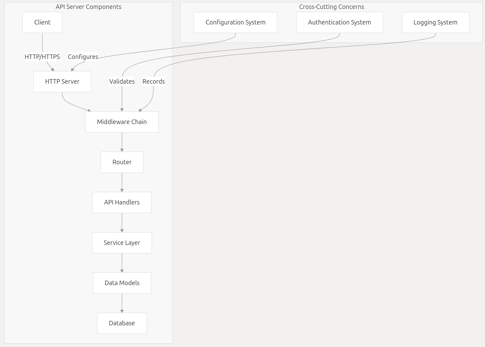
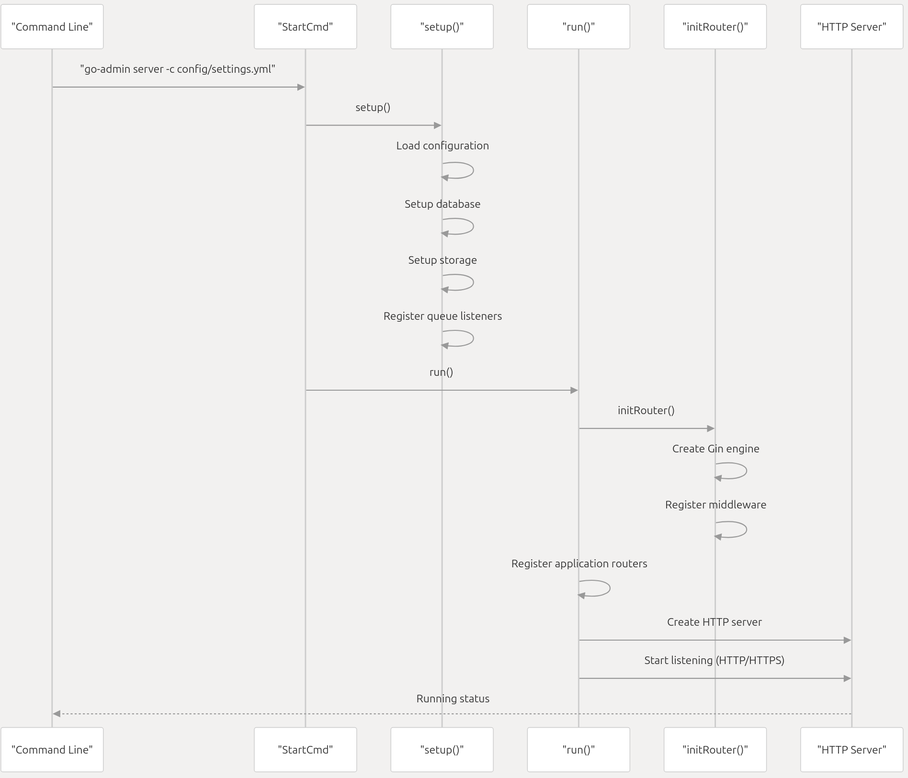
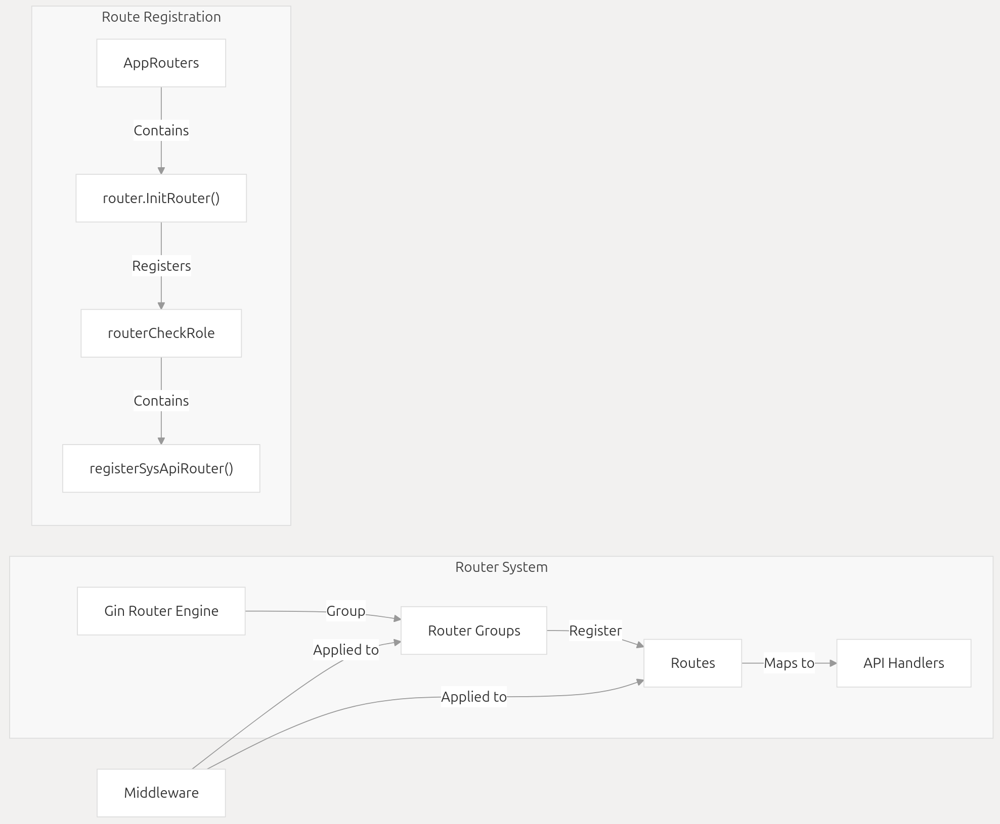
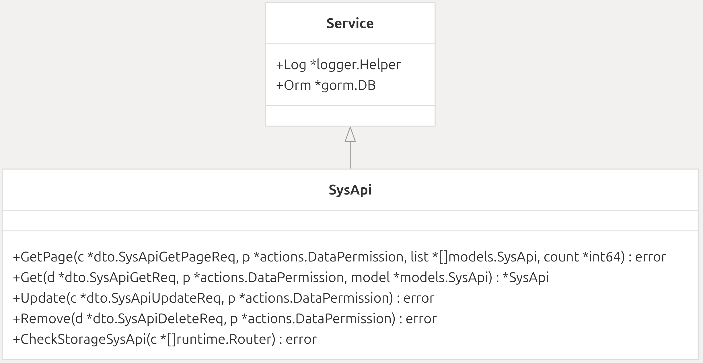
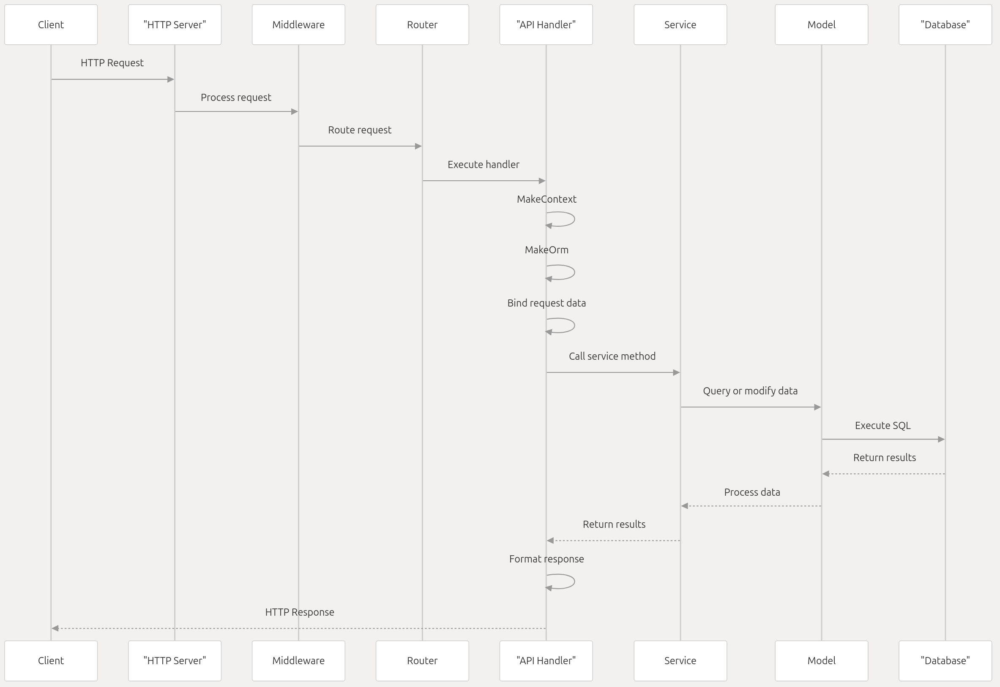
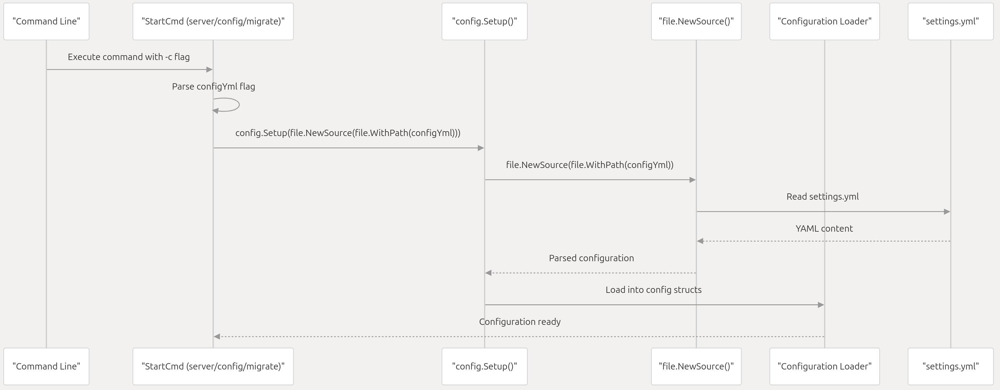

# 1.why go-admin/cmd/api/server.go do not call gin.Engine.Get or gin.Engine.POST?

why go-admin/cmd/api/server.go do not call gin.Engine.Get or gin.Engine.POST or gin.Engine.PUT or gin.Engine.DELETE ?
  
You're asking why `go-admin/cmd/api/server.go` doesn't directly call `gin.Engine.Get`, `gin.Engine.POST`, `gin.Engine.PUT`, or `gin.Engine.DELETE` methods.

## Answer

The `cmd/api/server.go` file doesn't directly call gin HTTP method functions because go-admin uses a **modular router registration pattern** instead of defining routes directly in the server startup code.
[中]`cmd/api/server.go`文件不直接调用gin HTTP方法函数，因为go-admin使用**模块化路由器注册模式**，而不是直接在服务器启动代码中定义路由。

### How go-admin Organizes Routes

The server setup follows this pattern:
> 1. **Server initialization** creates the gin engine but delegates route registration to specialized router modules [cmd/api/server.go:162-186] 
> 2. **Router modules** handle the actual route definitions using gin's HTTP methods. For example, the menu router defines routes like: [app/admin/router/sys_menu.go:18-25] 
> 3. **Registration pattern** uses function slices to collect router registration functions: [app/admin/router/router.go:10-13] 
服务器设置遵循以下模式：
> 1.**服务器初始化**创建杜松子酒引擎，但将路由注册委托给专门的路由器模块[cmd/api/Server.go:162-186]
> 2.**路由器模块**使用gin的HTTP方法处理实际的路由定义。例如，菜单router定义了如下路由：[app/admin/router/sys_menu.go:18-25]
> 3.**注册模式**使用函数切片来收集路由器注册函数：[app/admin/router/router.go:10-13]
> 

### Why This Architecture

This separation provides several benefits:
- **Modularity**: Each feature (users, roles, menus) has its own router file
- **Maintainability**: Routes are organized by domain rather than all in one place  
- **Extensibility**: New modules can register routes without modifying the main server file
- **Middleware organization**: Different route groups can have different middleware stacks

The actual gin HTTP method calls happen in the individual router files like `sys_menu.go`, `sys_dept.go`, etc., while `server.go` focuses purely on server lifecycle management.

这种分离提供了几个好处：
-**模块化**：每个功能（用户、角色、菜单）都有自己的路由器文件
-**可维护性**：路由按域组织，而不是全部在一个地方
-**可扩展性**：新模块可以在不修改主服务器文件的情况下注册路由
-**中间件组织**：不同的路由组可以有不同的中间件栈
实际的gin HTTP方法调用发生在单个路由器文件中，如`sys_menu.go`、`sys_dept.go`等，而`server.go`纯粹专注于服务器生命周期管理。

## Notes

The go-admin framework uses this pattern consistently across all modules - you'll find the same router registration approach in `app/admin/router/sys_dept.go`, `app/admin/router/sys_user.go`, and other router files. The `cmd/api/server.go` file's role is specifically server setup and lifecycle management, not route definition.

Wiki pages you might want to explore:
- [User Management (go-admin-team/go-admin)](/wiki/go-admin-team/go-admin#3.1)
- [Role and Permission Management (go-admin-team/go-admin)](/wiki/go-admin-team/go-admin#3.2)
- [Extension and Customization (go-admin-team/go-admin)](/wiki/go-admin-team/go-admin#5)

==============================================================
# 2. API Server

## 2.1 Overview
The go-admin API Server is built on the Gin web framework and follows a layered architecture approach.
 
Sources:
cmd/api/server.go 32-46
cmd/api/server.go 79-153

## 2.2 Server Initialization
The API Server is initialized through the CLI command system using Cobra. The startup process includes configuration loading, middleware setup, route registration, and HTTP server initialization.

 

## 2.3 Router System
 

## 2.4 Service Layer

Sources:
app/admin/service/sys_api.go 16-121

## 2.5 Data Transfer Objects (DTOs)
DTOs are used for transferring data between layers. They define the structure of request and response data and include validation logic.

## 2.6 API Model

The system uses a SysApi model to represent and manage API endpoints. This model is used to:

    Store API metadata (path, method, title, etc.)
    Track API changes
    Support API discovery and registration
    Provide data for API permission management

Sources:
app/admin/models/sys_api.go19-41

### API Discovery and Registration

The API Server includes a feature for automatically discovering and registering API endpoints. This process:

    Scans the router for registered routes
    Filters out certain system paths (e.g., Swagger, static files)
    Extracts metadata from API handler functions
    Creates or updates SysApi records in the database

This feature helps maintain an up-to-date catalog of available APIs for documentation and permission management.

Sources:
app/admin/models/sys_api.go43-91

cmd/api/server.go 100-115
### Request Lifecycle
The full request lifecycle in the API Server follows these steps:

 

========================================
# 3. settings.yml loading process

## 3.1 sequence

The settings.yml configuration loading process in go-admin follows this sequence:
 

## 3.2 Key Functions Involved:

    Command Flag Parsing: server.go:26
        cmd/config/server.go, 
        cmd/api/server.go, and 
        cmd/migrate/server.go all define the -c flag for configuration file path
    Configuration Setup: server.go:30
        config.Setup() function is called with a file source
    File Source Creation: server.go:30
        file.NewSource(file.WithPath(configYml)) creates a file-based configuration source
    Configuration Loading in Different Commands:
        Config Command: server.go:29-30
        Migrate Command: server.go:51-54
        API Server Command: server.go:52

## 3.3 which function do the real reading job int go-admin code
The actual file reading in go-admin is not performed by functions within the go-admin codebase itself. Instead, the real reading job is delegated to the go-admin-core library through the file.NewSource() function.

The config.Setup() function then processes the file source created by file.NewSource(), but the actual YAML file parsing and reading is handled internally by the go-admin-core configuration system.

