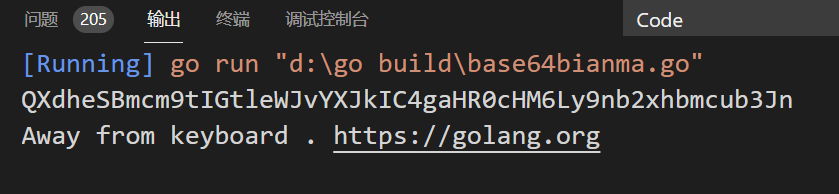

# 0.contents
[2.11 Go语言字符串](\l)
  [2.11.1定义字符串 ](\l)
  [2.11.2字符串拼接符“+”](\l)
  [2.11.3字符串实现基于 UTF-8 编码 ](\l)
  [2.11.4定义多行字符串 ](\l)

  [2.11+1 Go语言计算字符串长度——len()和RuneCountInString()](\l)
  [2.11+2 Go语言遍历字符串——获取每一个字符串元素](\l)
  [2.11+2.1遍历每一个ASCII字符](\l)
  [2.11+2.2按Unicode字符遍历字符串](\l)
  [2.11+3Go语言字符串截取（获取字符串的某一段字符）](\l)
  [2.11+4Go语言修改字符串](\l)
        [Ch1.golang怎么修改字符串](\l)
          [一、通过字符串切割和拼接](\l)
          [二、使用字节数组进行修改](\l)
        [Ch2.如何在Golang中修改字符串](\l)
        [Ch3.Go语言实现修改字符串的三种方法](\l)
  [2.11+5Go语言字符串拼接（连接）](\l)
  [2.11+6 Go语言fmt.Sprintf（格式化输出）](\l)
  [2.11+7 Base64 编码----电子邮件的基础编码格式](\l)

[2.12 Go语言字符类型（byte和rune）](\l)
    [2.12.1 UTF-8 和 Unicode 有何区别？](\l)

[2.23 Go语言字符串和数值类型的相互转换](\l)
  [2.23.1 string 与 int 类型之间的转换](\l)
  [2.23.2 Parse 系列函数 ](\l)
  [2.23.3 Format 系列函数](\l)
  [2.23.4 Append 系列函数](\l)


# 2.11 [Go语言字符串](http://c.biancheng.net/view/17.html)

一个字符串是一个不可改变的字节序列，字符串可以包含任意的数据，但是通常是用来包含可读的文本，字符串是 UTF-8 字符的一个序列（当字符为 ASCII 码表上的字符时则占用 1 个字节，其它字符根据需要占用 2-4 个字节）。  
  
UTF-8 是一种被广泛使用的编码格式，是文本文件的标准编码，其中包括 XML 和 JSON 在内也都使用该编码。由于该编码对占用字节长度的不定性，在Go语言中字符串也可能根据需要占用 1 至 4 个字节，这与其它编程语言如 C++、Java 或者 Python 不同（Java 始终使用 2 个字节）。Go语言这样做不仅减少了内存和硬盘空间占用，同时也不用像其它语言那样需要对使用 UTF-8 字符集的文本进行编码和解码。  
  
字符串是一种**值类型，且值不可变**，即创建某个文本后将无法再次修改这个文本的内容，更深入地讲，字符串**是字节的定长数组**。

### 2.11.1定义字符串

可以使用双引号""来定义字符串，字符串中可以使用转义字符来实现换行、缩进等效果，常用的转义字符包括：

- \n：换行符
- \r：回车符
- \t：tab 键
- \u 或 \U：Unicode 字符
- \\：反斜杠自身
1.  package main
2.  
3.  import (
4.  "fmt"
5.  )
6.  
7.  func main() {
8.  var str = "C语言中文网\nGo语言教程"
9.  fmt.Println(str)
10. }

运行结果为：
C语言中文网  
Go语言教程

一般的比较运算符（==、!=、<、<=、>=、>）是通过在内存中按字节比较来实现字符串比较的，因此比较的结果是字符串自然编码的顺序。
字符串所占的字节长度可以通过函数 len() 来获取，例如 len(str)。  
  
字符串的内容（纯字节）可以通过标准索引法来获取，在方括号[ ]内写入索引，索引从 0 开始计数：
- 字符串 str 的第 1 个字节：str[0]
- 第 i 个字节：str[i - 1]
- 最后 1 个字节：str[len(str)-1]

需要注意的是，这种转换方案只对纯 ASCII 码的字符串有效。
> 注意：获取字符串中某个字节的地址属于非法行为，例如 &str[i]。

### 2.11.2字符串拼接符“+”

两个字符串 s1 和 s2 可以通过 s := s1 + s2 拼接在一起。将 s2 追加到 s1 尾部并生成一个新的字符串 s。  
  
可以通过下面的方式来对代码中多行的字符串进行拼接：
1.  str := "Beginning of the string " +
2.  "second part of the string"
> 提示：因为编译器会在行尾自动补全分号，所以拼接字符串用的加号“+”必须放在第一行末尾。

也可以使用“+=”来对字符串进行拼接：
1.  s := "hel" + "lo,"
2.  s += "world!"
3.  fmt.Println(s) //输出 “hello, world!”

### 2.11.3字符串实现基于 UTF-8 编码
Go语言中字符串的内部实现使用 UTF-8 编码，通过 rune 类型，可以方便地对每个 UTF-8 字符进行访问。当然，Go语言也支持按照传统的 ASCII 码方式逐字符进行访问。    
关于字符串的 UTF-8 字符访问的详细方法，后面的章节将会详细介绍。

### 2.11.4定义多行字符串

在Go语言中，使用双引号书写字符串的方式是字符串常见表达方式之一，被称为字符串字面量（string literal），这种双引号字面量不能跨行，如果想要在源码中嵌入一个多行字符串时，就必须使用 ` 反引号，代码如下：

1.  const str = `第一行
2.  第二行
3.  第三行
4.  \r\n
5.  `
6.  fmt.Println(str)

代码运行结果：
<span id="_Toc1745073003" class="anchor"></span>第一行  
第二行  
第三行  
\r\n

反引号 ` ，是键盘上 1 键左边的键，两个反引号间的字符串将被原样赋值到 str 变量中。  
在这种方式下，反引号间换行将被作为字符串中的换行，但是所有的转义字符均无效，文本将会原样输出。  

多行字符串一般用于内嵌源码和内嵌数据等，代码如下：
1.  const codeTemplate = `// Generated by github.com/davyxu/cellnet/
2.  protoc-gen-msg
3.  // DO NOT EDIT!{{range .Protos}}
4.  // Source: {{.Name}}{{end}}5.  
6.  package {{.PackageName}}
7.  
8.  {{if gt .TotalMessages 0}}
9.  import (
10.   "github.com/davyxu/cellnet"
11.   "reflect"
12.    _ "github.com/davyxu/cellnet/codec/pb"
13. )
14. {{end}}
15. 
16. func init() {
17. {{range .Protos}}
18. // {{.Name}}{{range .Messages}}
19. cellnet.RegisterMessageMeta("pb","{{.FullName}}", reflect.TypeOf((\*{{.Name}})(nil)).Elem(), {{.MsgID}}) {{end}}
20. {{end}}
21. }
22. `

这段代码只定义了一个常量 codeTemplate，类型为字符串，使用 ` 定义，字符串的内容为一段代码生成中使用到的 Go 源码格式。  
在 ` 间的所有代码均不会被编译器识别，而只是作为字符串的一部分。  
  
字符串类型在业务中的应用可以说是最广泛的，读者需要详细了解字符串的常见用法，请猛击下面的文章：
- Go语言计算字符串长度——len()和RuneCountInString()
- Go语言遍历字符串——获取每一个字符串元素
- Go语言字符串截取（获取字符串的某一段字符）
- Go语言修改字符串
- Go语言字符串拼接（连接）
- Go语言fmt.Sprintf（格式化输出）
- Go语言Base64编码——电子邮件的基础编码格式


#  2.11+1 Go语言计算字符串长度——len()和RuneCountInString()

Go 语言的内建函数 len()，可以用来获取切片、字符串、通道（channel）等的长度。下面的代码可以用 len() 来获取字符串的长度。

1.  tip1 := "genji is a ninja"
2.  fmt.Println(len(tip1))
3.  
4.  tip2 := "忍者"
5.  fmt.Println(len(tip2))
程序输出如下：  
16  
6  
  
**len() 函数的返回值**的类型为 int，表示**字符串的 ASCII 字符个数或字节长度**。
- 输出中第一行的 16 表示 tip1 的字符个数为 16。
- 输出中第二行的 6 表示 tip2 的字符格式，也就是“忍者”的字符个数是 6，然而根据习惯，“忍者”的字符个数应该是 2。
这里的差异是由于 Go 语言的字符串都以 UTF-8 格式保存，每个中文占用 3 个字节，因此使用 len() 获得两个中文文字对应的 6 个字节。  
  
如果希望按习惯上的字符个数来计算，就需要使用 Go 语言中 **UTF-8** 包提供的 **RuneCountInString**() 函数，统计 **Uncode 字符数量**。  
  
下面的代码展示如何计算UTF-8的字符个数。
1.  fmt.Println(utf8.RuneCountInString("忍者"))
2.  fmt.Println(utf8.RuneCountInString("龙忍出鞘,fight!"))

程序输出如下：  
2  
11  
  
一般游戏中在登录时都需要输入名字，而名字一般有长度限制。考虑到国人习惯使用中文做名字，就需要检测字符串 UTF-8 格式的长度。

#### 总结
- ASCII 字符串长度使用 len() 函数。
- Unicode 字符串长度使用 utf8.RuneCountInString() 函数。

#  2.11+2 Go语言遍历字符串——获取每一个字符串元素

遍历字符串有下面两种写法。

### 2.11+2.1遍历每一个ASCII字符

遍历 ASCII 字符使用 for 的数值循环进行遍历，直接取每个字符串的下标获取 ASCII 字符，如下面的例子所示。

1.  theme := "狙击 start"
2.  
3.  for i := 0; i < len(theme); i++ {
4.    fmt.Printf("ascii: %c %d\n", theme[i], theme[i])
5.  }

程序输出如下：

ascii: ?  231  
ascii:     139  
ascii:     153  
ascii: ?  229  
ascii:     135  
ascii: ?  187  
ascii:    32  
ascii: s  115  
ascii: t  116  
ascii: a  97  
ascii: r  114  
ascii: t  116

这种模式下取到的汉字“惨不忍睹”。由于没有使用 Unicode，汉字被显示为乱码。

### 2.11+2.2按Unicode字符遍历字符串

同样的内容：

1.  theme := "狙击 start"
2.  
3.  for \_, s := range theme {
4.      fmt.Printf("Unicode: %c %d\n", s, s)
5.  }

程序输出如下：

Unicode: 狙  29401  
Unicode: 击  20987  
Unicode:    32  
Unicode: s  115  
Unicode: t  116  
Unicode: a  97  
Unicode: r  114  
Unicode: t  116

可以看到，这次汉字可以正常输出了。

#### 总结
- ASCII 字符串遍历直接使用下标。
- Unicode 字符串遍历用 for range。

#  2.11+3Go语言字符串截取（获取字符串的某一段字符）

获取字符串的某一段字符是开发中常见的操作，我们一般将字符串中的某一段字符称做子串（substring）。  
  
下面例子中使用 strings.Index() 函数在字符串中搜索另外一个子串，代码如下：
1.  tracer := "死神来了, 死神bye bye"
2.  comma := strings.Index(tracer, ", ")
3.  
4.  pos := strings.Index(tracer[comma:], "死神")
5.  
6.  fmt.Println(comma, pos, tracer[comma+pos:])

程序输出如下：
12 3 死神bye bye

代码说明如下：  
1) 第 2 行尝试在 tracer 的字符串中搜索中文的逗号，返回的位置存在 comma 变量中，类型是 int，表示从 tracer 字符串开始的 ASCII 码位置。    
strings.Index() 函数并没有像其他语言一样，提供一个从某偏移开始搜索的功能。不过我们可以对字符串进行**切片**操作来实现这个逻辑。    
2) 第4行中，tracer[comma:] 从 tracer 的 comma 位置开始到 tracer 字符串的结尾构造一个子字符串，返回给 string.Index() 进行再索引。得到的 pos 是相对于 tracer[comma:] 的结果。  
  
comma 逗号的位置是 12，而 pos 是相对位置，值为 3。我们为了获得第二个“死神”的位置，也就是逗号后面的字符串，就必须让 comma 加上 pos 的相对偏移，计算出 15 的偏移，然后再通过切片 tracer[comma+pos:] 计算出最终的子串，获得最终的结果：“死神bye bye”。

#### 总结

字符串索引比较常用的有如下几种方法：

- strings.Index：正向搜索子字符串。

- strings.LastIndex：反向搜索子字符串。

- 搜索的起始位置可以通过切片偏移制作。

#  2.11+4Go语言修改字符串

##  Ch1.golang怎么修改字符串

朱不贪原创 2023-07-14 17:20:20

golang字符串修改的方法有：1、通过字符串切割和拼接，使用strings包中的Split函数将字符串切割为切片，然后通过拼接切片中的元素来修改字符串；2、使用字节数组进行修改，通过将字符串转换为字节数组进行修改。

本教程操作环境：windows10系统、golang1.20.1版本、DELL G3电脑。

Golang是一种现代化的编程语言，它具备简洁高效的特点，广泛应用于Web开发和系统编程等领域。在Golang中，字符串是一种不可变的数据类型，意味着一旦定义了字符串，就无法直接修改其内容。但是，我们可以采用一些方法来修改或处理字符串。

#### 一、通过字符串切割和拼接

Golang中的字符串可以通过切割和拼接的方式来达到修改的效果。例如，假设我们有一个字符串s，其中包含下划线，我们可以使用strings包中的Split函数将字符串切割为切片，然后通过拼接切片中的元素来修改字符串。示例如下：

<table>
<colgroup>
<col style="width: 4%" />
<col style="width: 95%" />
</colgroup>
<tbody>
<tr class="odd">
<td><p>1</p>
<p>2</p>
<p>3</p>
<p>4</p>
<p>5</p>
<p>6</p>
<p>7</p>
<p>8</p>
<p>9</p>
<p>10</p>
<p>11</p></td>
<td><p>import(</p>
<p>"fmt"</p>
<p>"strings"</p>
<p>)</p>
<p>func main(){</p>
<p>s:="hello_world"</p>
<p>arr:=strings.Split(s,"_")</p>
<p>arr[1]="golang"</p>
<p>newStr:=strings.Join(arr,"_")</p>
<p>fmt.Println(newStr)</p>
<p>}</p></td>
</tr>
</tbody>
</table>

在上述代码中，我们首先使用strings包中的Split函数将字符串s按照下划线进行切割，得到一个切片arr。然后，我们将切片arr中的第二个元素修改为"golang"，最后使用strings包中的Join函数将修改后的切片拼接为字符串newStr。通过打印newStr，我们可以看到输出结果为"hello_golang"，字符串被成功地修改了。

#### 二、使用字节数组进行修改

除了字符串切割和拼接的方式外，我们还可以通过将字符串转换为字节数组进行修改。在Golang中，字符串实际上是由字节数组组成的，因此我们可以通过操作字节数组来修改字符串的内容。示例如下：

<table>
<colgroup>
<col style="width: 10%" />
<col style="width: 89%" />
</colgroup>
<tbody>
<tr class="odd">
<td><p>1</p>
<p>2</p>
<p>3</p>
<p>4</p>
<p>5</p>
<p>6</p>
<p>7</p>
<p>8</p>
<p>9</p>
<p>10</p></td>
<td><p>import(</p>
<p>"fmt"</p>
<p>)</p>
<p>funcmain(){</p>
<p>s:="hello"</p>
<p>bytes:=[]byte(s)</p>
<p>bytes[1]='a'</p>
<p>newStr:=string(bytes)</p>
<p>fmt.Println(newStr)</p>
<p>}</p></td>
</tr>
</tbody>
</table>

在上述代码中，我们首先定义了字符串s为"hello"，然后将其转换为字节数组bytes。接着，我们通过修改字节数组bytes中的第二个元素为字符'a'来实现字符串的修改。最后，我们将修改后的字节数组转换回字符串newStr并进行打印，可以得到输出结果为"hallo"。

需要注意的是，由于Golang中的字符串是不可变的，所以在修改字符串时，实际上是创建了一个新的字符串对象。因此，性能方面可能会有一定的影响。

总结而言，Golang中的字符串是一种不可变的数据类型，无法直接修改其内容。但是我们可以通过切割和拼接的方式，或者通过将字符串转换为字节数组进行操作来修改字符串。以上就是Golang中修改字符串的几种常用方法。在实际应用中，根据具体需求选择合适的方法，以达到修改字符串的目的 。

##  Ch2.如何在Golang中修改字符串

PHPz 发布： 2023-03-30 09:39:59

Golang是一种流行的编程语言，适用于许多不同的应用程序开发任务。在这篇文章中，我们将探讨如何在Golang中修改字符串。

首先，我们需要明确一个概念：**在Golang中，字符串是不可变的**。这意味着我们不能直接在字符串上进行修改，而是需要创建一个新的字符串以保存所做的更改。

那么如何修改字符串？有几种方法可以实现。

第一种方法是使用字符串拼接。这种方法需要将原始字符串分成两个子字符串，并使用修改后的字符串替换其中一个子字符串。这可以通过使用“+”运算符来实现。例如：

<table>
<colgroup>
<col style="width: 2%" />
<col style="width: 97%" />
</colgroup>
<tbody>
<tr class="odd">
<td><p>1</p>
<p>2</p>
<p>3</p>
<p>4</p></td>
<td><p>str := "hello world"</p>
<p>newstr := "new"</p>
<p>result := newstr + str[3:]</p>
<p>fmt.Println(result)</p></td>
</tr>
</tbody>
</table>

在这个例子中，我们将原始字符串拆分为“he”和“llo world”。然后，我们将“new”添加到“he”中，然后将结果与“llo world”子字符串连接起来。最终结果是“newlo world”。

第二种方法是使用字符串切片。这种方法可以直接修改字符串中的某个字符或一系列字符。例如：

<table>
<colgroup>
<col style="width: 2%" />
<col style="width: 97%" />
</colgroup>
<tbody>
<tr class="odd">
<td><p>1</p>
<p>2</p>
<p>3</p>
<p>4</p>
<p>5</p></td>
<td><p>str := "hello world"</p>
<p>chars := []rune(str)</p>
<p>chars[0] = 'j'</p>
<p>result := string(chars)</p>
<p>fmt.Println(result)</p></td>
</tr>
</tbody>
</table>

在这个例子中，我们将字符串转换为rune类型的切片，这样我们才能修改它。然后，我们将第一个字符“h”更改为“j”，并将结果转换回字符串类型。

第三种方法是使用字符串包中的函数。例如，我们可以使用strings.Replace函数来替换字符串中的一个子串。例如：

<table>
<colgroup>
<col style="width: 2%" />
<col style="width: 97%" />
</colgroup>
<tbody>
<tr class="odd">
<td><p>1</p>
<p>2</p>
<p>3</p>
<p>4</p>
<p>5</p>
<p>6</p>
<p>7</p></td>
<td><p>import "strings"</p>
<p> </p>
<p>str := "hello world"</p>
<p>old := "world"</p>
<p>new := "everyone"</p>
<p>result := strings.Replace(str, old, new, -1)</p>
<p>fmt.Println(result)</p></td>
</tr>
</tbody>
</table>

在这个例子中，我们使用strings.Replace函数来将字符串中的“world”子串替换为“everyone”。

总结来说，Golang中虽然不能直接修改字符串，但是有许多方法可以实现字符串的修改。需要根据具体情况选择合适的方式。

### Ch3.Go语言实现修改字符串的三种方法

西卡na 于 2022-03-23 19:56:12 发布

原文链接：<https://blog.csdn.net/qq_55380184/article/details/123694412>

Go语言实现修改字符串的三种方法

/*

修改字符串

注意：字符串是无法被修改的，只能复制原字符串，在复制的版本上修改

方法1：转换为[]byte()

方法2：转换为[]rune()

方法3：新字符串代替原字符串的子字符串,用strings包中的strings.Replace()

*/

func main() {

//方法1

s1 := "abcdefgabc"

s2 := []byte(s1)

s2[1] = 'B'

fmt.Println(string(s2)) //aBcdefgabc

//方法2

s3 := []rune(s1)

s3[1] = 'B'

fmt.Println(string(s3)) //aBcdefgabc

//方法3

new := "ABC"

old := "abc"

s4 := strings.Replace(s1, old, new, 2)

fmt.Println(s4) //ABCdefgABC

}

# 2.11+5Go语言字符串拼接（连接）

连接字符串这么简单，还需要学吗？确实，Go 语言和大多数其他语言一样，使用+对字符串进行连接操作，非常直观。  
  
但问题来了，好的事物并非完美，简单的东西未必高效。除了加号连接字符串，Go 语言中也有类似于 StringBuilder 的机制来进行高效的字符串连接，例如：

1.  hammer := "吃我一锤"
2.  
3.  sickle := "死吧"
4.  
5.  // 声明字节缓冲
6.  var stringBuilder bytes.Buffer
7.  
8.  // 把字符串写入缓冲
9.  stringBuilder.WriteString(hammer)
10. stringBuilder.WriteString(sickle)
11. 
12. // 将缓冲以字符串形式输出
13. fmt.Println(stringBuilder.String())

bytes.Buffer 是可以缓冲并可以往里面写入各种字节数组的。字符串也是一种字节数组，使用 WriteString() 方法进行写入。  
  
将需要连接的字符串，通过调用 WriteString() 方法，写入 stringBuilder 中，然后再通过 stringBuilder.String() 方法将缓冲转换为字符串。

# 2.11+6 Go语言fmt.Sprintf（格式化输出）

格式化在逻辑中非常常用。使用格式化函数，要注意写法：
fmt.Sprintf(格式化样式, 参数列表…)

- 格式化样式：字符串形式，格式化动词以%开头。
- 参数列表：多个参数以逗号分隔，个数必须与格式化样式中的个数一一对应，否则运行时会报错。

在 Go 语言中，格式化的命名延续C语言风格：
[纯文本复制](http://c.biancheng.net/view/41.html)

1.  var progress = 2
2.  var target = 8
3.  
4.  // 两参数格式化
5.  title := fmt.Sprintf("已采集%d个药草, 还需要%d个完成任务", progress, target)
6.  
7.  fmt.Println(title)
8.  
9.  pi := 3.14159
10. // 按数值本身的格式输出
11. variant := fmt.Sprintf("%v %v %v", "月球基地", pi, true)
12. 
13. fmt.Println(variant)
14. 
15. // 匿名结构体声明, 并赋予初值
16. profile := &struct {
17. Name string
18. HP int
19. }{
20. Name: "rat",
21. HP: 150,
22. }
23. 
24. fmt.Printf("使用'%%+v' %+v\n", profile)
25. 
26. fmt.Printf("使用'%%#v' %#v\n", profile)
27. 
28. fmt.Printf("使用'%%T' %T\n", profile)

代码输出如下：
已采集2个药草, 还需要8个完成任务  
"月球基地" 3.14159 true  
使用'%+v' &{Name:rat HP:150}  
使用'%#v' &struct { Name string; HP int }{Name:"rat", HP:150}  
使用'%T' *struct { Name string; HP int }C语言中, 使用%d代表整型参数

下表中标出了常用的一些格式化样式中的动词及功能。

|                                  |                                          |
|----------------------------------|------------------------------------------|
| 表：字符串格式化时常用动词及功能 |                                          |
| **动  词**                       | **功  能**                               |
| %v                               | 按值的本来值输出                         |
| %+v                              | 在 %v 基础上，对结构体字段名和值进行展开 |
| %#v                              | 输出 Go 语言语法格式的值                 |
| %T                               | 输出 Go 语言语法格式的类型和值           |
| %%                               | 输出 % 本体                              |
| %b                               | 整型以二进制方式显示                     |
| %o                               | 整型以八进制方式显示                     |
| %d                               | 整型以十进制方式显示                     |
| %x                               | 整型以十六进制方式显示                   |
| %X                               | 整型以十六进制、字母大写方式显示         |
| %U                               | Unicode 字符                             |
| %f                               | 浮点数                                   |
| %p                               | 指针，十六进制方式显示                   |

#  2.11+7 Base64 编码----电子邮件的基础编码格式

Base64 编码是常见的对8比特字节码的编码方式之一. Base64 编码可以使用64个可打印字符来表示二进制数据,电子邮件就是使用这种编码!  
Go语言的标准库自带了Base64编码算法,通过几行代码就可以对数据进行编码,示例代码如下:

package main

import (

"encoding/base64"

"fmt"

)

func main() {

// 需要处理的字符串

message := "Away from keyboard. https://golang.org/"

// 编码消息

encodedMessage := base64.StdEncoding.EncodeToString([]byte(message))

// 输出编码完成的消息

fmt.Println(encodedMessage)

// 解码消息

data, err := base64.StdEncoding.DecodeString(encodedMessage)

// 出错处理

if err != nil {

fmt.Println(err)

} else {

// 打印解码完成的数据

fmt.Println(string(data))

}

}

将会打印出返回的字节数组转换为字符串!




## 2.12 [Go语言字符类型（byte和rune）](http://c.biancheng.net/view/18.html)

字符串中的每一个元素叫做“字符”，在遍历或者单个获取字符串元素时可以获得字符。 

Go语言的字符有以下两种：
- 一种是 uint8 类型，或者叫 byte 型，代表了 ASCII 码的一个字符。
- 另一种是 rune 类型，代表一个 UTF-8 字符，当需要处理中文、日文或者其他复合字符时，则需要用到 rune 类型。rune 类型等价于 int32 类型。

byte 类型是 uint8 的别名，对于只占用 1 个字节的传统 ASCII 编码的字符来说，完全没有问题，例如 var ch byte = 'A'，字符使用单引号括起来。    
在 ASCII 码表中，A 的值是 65，使用 16 进制表示则为 41，所以下面的写法是等效的：
var ch byte = 65 或 var ch byte = '\x41'      //（\x 总是紧跟着长度为 2 的 16 进制数）

另外一种可能的写法是\后面紧跟着长度为 3 的八进制数，例如 \377。  
  
Go语言同样支持 Unicode（UTF-8），因此字符同样称为 Unicode 代码点或者 runes，并在内存中使用 int 来表示。在文档中，一般使用格式 U+hhhh 来表示，其中 h 表示一个 16 进制数。    
在书写 Unicode 字符时，需要在 16 进制数之前加上前缀\u或者\U。因为 Unicode 至少占用 2 个字节，所以我们使用 int16 或者 int 类型来表示。如果需要使用到 4 字节，则使用\u前缀，如果需要使用到 8 个字节，则使用\U前缀。
1.  var ch int = '\u0041'
2.  var ch2 int = '\u03B2'
3.  var ch3 int = '\U00101234'
4.  fmt.Printf("%d - %d - %d\n", ch, ch2, ch3) // integer
5.  fmt.Printf("%c - %c - %c\n", ch, ch2, ch3) // character
6.  fmt.Printf("%X - %X - %X\n", ch, ch2, ch3) // UTF-8 bytes
7.  fmt.Printf("%U - %U - %U", ch, ch2, ch3) // UTF-8 code point

输出：
65 - 946 - 1053236  
A - β - r  
41 - 3B2 - 101234  
U+0041 - U+03B2 - U+101234

格式化说明符%c用于表示字符，当和字符配合使用时，%v或%d会输出用于表示该字符的整数，%U输出格式为 U+hhhh 的字符串。    
Unicode 包中内置了一些用于测试字符的函数，这些函数的返回值都是一个布尔值，如下所示（其中 ch 代表字符）：
- 判断是否为字母：unicode.IsLetter(ch)
- 判断是否为数字：unicode.IsDigit(ch)
- 判断是否为空白符号：unicode.IsSpace(ch)

### 2.12.1 UTF-8 和 Unicode 有何区别？

Unicode 与 ASCII 类似，都是一种字符集。    
字符集为每个字符分配一个唯一的 ID，我们使用到的所有字符在 Unicode 字符集中都有一个唯一的 ID，例如上面例子中的 a 在 Unicode 与 ASCII 中的编码都是 97。汉字“你”在 Unicode 中的编码为 20320，在不同国家的字符集中，字符所对应的 ID 也会不同。而无论任何情况下，Unicode 中的字符的 ID 都是不会变化的。  
  
UTF-8 是编码规则，将 Unicode 中字符的 ID 以某种方式进行编码，UTF-8 的是一种变长编码规则，从 1 到 4 个字节不等。编码规则如下：
- 0xxxxxx 表示文字符号 0～127，兼容 ASCII 字符集。
- 从 128 到 0x10ffff 表示其他字符。

根据这个规则，拉丁文语系的字符编码一般情况下每个字符占用一个字节，而中文每个字符占用 3 个字节。  
  
广义的 Unicode 指的是一个标准，它定义了字符集及编码规则，即 Unicode 字符集和 UTF-8、UTF-16 编码等。

## 2.23 [Go语言字符串和数值类型的相互转换](http://c.biancheng.net/view/vip_7305.html)

Go语言strconv包：字符串和数值类型的相互转换

-----------------

在实际开发中我们往往需要对一些常用的数据类型进行转换，如 string、int、int64、float 等数据类型之间的转换，Go语言中的 strconv 包为我们提供了字符串和基本数据类型之间的转换功能。  
  
strconv 包中常用的函数包括 Atoi()、Itoa()、parse 系列函数、format 系列函数、append 系列函数等，下面就来分别介绍一下。

### 2.23.1 string 与 int 类型之间的转换

字符串和整型之间的转换是我们平时编程中使用的最多的，下面就来介绍一下具体的操作。

Itoa()：整型转字符串

Itoa() 函数用于将 int 类型数据转换为对应的字符串类型，函数签名如下。

func Itoa(i int) string

示例代码如下：

1.  func main() {

2.  num := 100

3.  str := strconv.Itoa(num)

4.  fmt.Printf("type:%T value:%#v\n", str, str)

5.  }

运行结果如下所示：

type:string value:"100"

Atoi()：字符串转整型

Atoi() 函数用于将字符串类型的整数转换为 int 类型，函数签名如下。

func Atoi(s string) (i int, err error)

通过函数签名可以看出 Atoi() 函数有两个返回值，i 为转换成功的整型，err 在转换成功是为空转换失败时为相应的错误信息。  
  
示例代码如下：

1.  func main() {

2.  str1 := "110"

3.  str2 := "s100"

4.  num1, err := strconv.Atoi(str1)

5.  if err != nil {

6.  fmt.Printf("%v 转换失败！", str1)

7.  } else {

8.  fmt.Printf("type:%T value:%#v\n", num1, num1)

9.  }

10. num2, err := strconv.Atoi(str2)

11. if err != nil {

12. fmt.Printf("%v 转换失败！", str2)

13. } else {

14. fmt.Printf("type:%T value:%#v\n", num2, num2)

15. }

16. }

运行结果如下所示：

type:int value:110  
s100 转换失败！

### 2.23.2 Parse 系列函数

Parse 系列函数用于将字符串转换为指定类型的值，其中包括 ParseBool()、ParseFloat()、ParseInt()、ParseUint()。

ParseBool()

ParseBool() 函数用于将字符串转换为 bool 类型的值，它只能接受 1、0、t、f、T、F、true、false、True、False、TRUE、FALSE，其它的值均返回错误，函数签名如下。

func ParseBool(str string) (value bool, err error)

示例代码如下：

1.  func main() {

2.  str1 := "110"

3.  boo1, err := strconv.ParseBool(str1)

4.  if err != nil {

5.  fmt.Printf("str1: %v\n", err)

6.  } else {

7.  fmt.Println(boo1)

8.  }

9.  str2 := "t"

10. boo2, err := strconv.ParseBool(str2)

11. if err != nil {

12. fmt.Printf("str2: %v\n", err)

13. } else {

14. fmt.Println(boo2)

15. }

16. }

运行结果如下：

str1: strconv.ParseBool: parsing "110": invalid syntax  
true

ParseInt()

ParseInt() 函数用于返回字符串表示的整数值（可以包含正负号），函数签名如下：

func ParseInt(s string, base int, bitSize int) (i int64, err error)

参数说明：

- base 指定进制，取值范围是 2 到 36。如果 base 为 0，则会从字符串前置判断，“0x”是 16 进制，“0”是 8 进制，否则是 10 进制。

- bitSize 指定结果必须能无溢出赋值的整数类型，0、8、16、32、64 分别代表 int、int8、int16、int32、int64。

- 返回的 err 是 \*NumErr 类型的，如果语法有误，err.Error = ErrSyntax，如果结果超出类型范围 err.Error = ErrRange。

示例代码如下：

1.  func main() {

2.  str := "-11"

3.  num, err := strconv.ParseInt(str, 10, 0)

4.  if err != nil {

5.  fmt.Println(err)

6.  } else {

7.  fmt.Println(num)

8.  }

9.  }

运行结果如下：

-11

ParseUnit()

ParseUint() 函数的功能类似于 ParseInt() 函数，但 ParseUint() 函数不接受正负号，用于无符号整型，函数签名如下：

func ParseUint(s string, base int, bitSize int) (n uint64, err error)

示例代码如下：

1.  func main() {

2.  str := "11"

3.  num, err := strconv.ParseUint(str, 10, 0)

4.  if err != nil {

5.  fmt.Println(err)

6.  } else {

7.  fmt.Println(num)

8.  }

9.  }

运行结果如下：

11

ParseFloat()

ParseFloat() 函数用于将一个表示浮点数的字符串转换为 float 类型，函数签名如下。

func ParseFloat(s string, bitSize int) (f float64, err error)

参数说明：

- 如果 s 合乎语法规则，函数会返回最为接近 s 表示值的一个浮点数（使用 IEEE754 规范舍入）。

- bitSize 指定了返回值的类型，32 表示 float32，64 表示 float64；

- 返回值 err 是 \*NumErr 类型的，如果语法有误 err.Error=ErrSyntax，如果返回值超出表示范围，返回值 f 为 ±Inf，err.Error= ErrRange。

示例代码如下：

1.  func main() {

2.  str := "3.1415926"

3.  num, err := strconv.ParseFloat(str, 64)

4.  if err != nil {

5.  fmt.Println(err)

6.  } else {

7.  fmt.Println(num)

8.  }

9.  }

运行结果如下：

3.1415926

Parse 系列函数都有两个返回值，第一个返回值是转换后的值，第二个返回值为转化失败的错误信息。

### 2.23.3 Format 系列函数

Format 系列函数实现了将给定类型数据格式化为字符串类型的功能，其中包括 FormatBool()、FormatInt()、FormatUint()、FormatFloat()。

FormatBool()

FormatBool() 函数可以一个 bool 类型的值转换为对应的字符串类型，函数签名如下。

func FormatBool(b bool) string

示例代码如下：

1.  func main() {

2.  num := true

3.  str := strconv.FormatBool(num)

4.  fmt.Printf("type:%T,value:%v\n ", str, str)

5.  }

运行结果如下：

type:string,value:true

FormatInt()

FormatInt() 函数用于将整型数据转换成指定进制并以字符串的形式返回，函数签名如下：

func FormatInt(i int64, base int) string

其中，参数 i 必须是 int64 类型，参数 base 必须在 2 到 36 之间，返回结果中会使用小写字母“a”到“z”表示大于 10 的数字。  
  
示例代码如下：

1.  func main() {

2.  var num int64 = 100

3.  str := strconv.FormatInt(num, 16)

4.  fmt.Printf("type:%T,value:%v\n ", str, str)

5.  }

运行结果如下：

type:string,value:64

FormatUint()

FormatUint() 函数与 FormatInt() 函数的功能类似，但是参数 i 必须是无符号的 uint64 类型，函数签名如下。

func FormatUint(i uint64, base int) string

示例代码如下：

1.  func main() {

2.  var num uint64 = 110

3.  str := strconv.FormatUint(num, 16)

4.  fmt.Printf("type:%T,value:%v\n ", str, str)

5.  }

运行结果如下：

type:string,value:6e

FormatFloat()

FormatFloat() 函数用于将浮点数转换为字符串类型，函数签名如下：

func FormatFloat(f float64, fmt byte, prec, bitSize int) string

参数说明：

- bitSize 表示参数 f 的来源类型（32 表示 float32、64 表示 float64），会据此进行舍入。

- fmt 表示格式，可以设置为“f”表示 -ddd.dddd、“b”表示 -ddddp±ddd，指数为二进制、“e”表示 -d.dddde±dd 十进制指数、“E”表示 -d.ddddE±dd 十进制指数、“g”表示指数很大时用“e”格式，否则“f”格式、“G”表示指数很大时用“E”格式，否则“f”格式。

- prec 控制精度（排除指数部分）：当参数 fmt 为“f”、“e”、“E”时，它表示小数点后的数字个数；当参数 fmt 为“g”、“G”时，它控制总的数字个数。如果 prec 为 -1，则代表使用最少数量的、但又必需的数字来表示 f。

示例代码如下：

1.  func main() {

2.  var num float64 = 3.1415926

3.  str := strconv.FormatFloat(num, 'E', -1, 64)

4.  fmt.Printf("type:%T,value:%v\n ", str, str)

5.  }

运行结果如下：

type:string,value:3.1415926E+00

### 2.23.4 Append 系列函数

Append 系列函数用于将指定类型转换成字符串后追加到一个切片中，其中包含 AppendBool()、AppendFloat()、AppendInt()、AppendUint()。  
  
Append 系列函数和 Format 系列函数的使用方法类似，只不过是将转换后的结果追加到一个切片中。  
  
示例代码如下：

1.  package main

2.  import (

3.  "fmt"

4.  "strconv"

5.  )

6.  func main() {

7.  // 声明一个slice

8.  b10 := \[\]byte("int (base 10):")

9.  

10. // 将转换为10进制的string，追加到slice中

11. b10 = strconv.AppendInt(b10, -42, 10)

12. fmt.Println(string(b10))

13. b16 := \[\]byte("int (base 16):")

14. b16 = strconv.AppendInt(b16, -42, 16)

15. fmt.Println(string(b16))

16. }

运行结果如下：

int (base 10):-42  
int (base 16):-2a

========================================================================
# fmt.Sprintf("%c[%d;%d;%dm%s%c[0m", 0x1B, conf, bg, text, msg, 0x1B)
 
## "%c[%d;%d;%dm%s%c[0m" 
### ANSI 转义序列格式解析

你提供的 `%c[%d;%d;%dm%s%c[0m` 是一个用于格式化终端文本颜色和样式的字符串模板，它使用了 Go 语言的 `fmt.Sprintf` 函数的格式化语法。让我来解释一下这个格式的各个部分：

```
%c[%d;%d;%dm%s%c[0m
```

### 格式部分解析

- `%c`: 表示一个 Unicode 字符，在这里用于插入 ANSI 转义序列的起始字符（0x1B 是 ASCII 码中的 ESC 字符）
- `[`: 转义序列的开始标记
- `%d;%d;%d`: 三个十进制整数，分别表示：
  - 第一个数字：文本样式（如粗体、斜体等）
  - 第二个数字：背景颜色
  - 第三个数字：文本颜色
- `m`: 转义序列的结束标记
- `%s`: 表示要显示的实际文本内容
- `%c[0m`: 重置所有格式的转义序列，确保后续文本恢复默认样式

### ANSI 转义序列的工作原理
ANSI 转义序列是一种控制字符序列，用于控制终端的文本格式。基本格式是：

```
ESC[参数m
```

其中：
- `ESC` 是 ASCII 码中的转义字符（十进制 27，十六进制 0x1B）
- `[` 是转义序列的起始字符
- 参数是一个或多个用分号分隔的数字，每个数字表示不同的格式设置
- `m` 表示这是一个"设置属性"的转义序列

### 常见的 ANSI 代码值

- **样式代码**：
  - 0: 重置所有样式
  - 1: 粗体
  - 4: 下划线
  - 7: 反显（前景色和背景色互换）

- **前景色代码**：
  - 30: 黑色
  - 31: 红色
  - 32: 绿色
  - 33: 黄色
  - 34: 蓝色
  - 35: 品红色
  - 36: 青色
  - 37: 白色

- **背景色代码**：
  - 40: 黑色背景
  - 41: 红色背景
  - 42: 绿色背景
  - 43: 黄色背景
  - 44: 蓝色背景
  - 45: 品红色背景
  - 46: 青色背景
  - 47: 白色背景

### 示例

当你调用 `SetColor("Hello", 1, 44, 37)` 时，生成的转义序列会显示：
- 粗体样式（1）
- 蓝色背景（44）
- 白色文本（37）

这个功能在命令行工具、日志系统和交互式应用中非常有用，可以让输出更加清晰和直观。

##  SetColor函数
```
func SetColor(msg string, conf, bg, text int) string {
	return fmt.Sprintf("%c[%d;%d;%dm%s%c[0m", 0x1B, conf, bg, text, msg, 0x1B)
}
```
 SetColor 函数，用于为终端文本设置颜色。函数通过 ANSI 转义序列来实现文本样式的控制。

函数参数:
msg: 要显示的文本内容
conf: 配置选项（如粗体、斜体等）
bg: 背景颜色
text: 文本颜色

### 代码改进建议
这个函数可以进一步优化：

使用常量代替魔术数字
添加错误处理
增加更直观的颜色类型
提供默认值

下面是改进后的代码：
```go
package main

import (
	"fmt"
)

// 文本样式常量
const (
	Reset       = 0
	Bold        = 1
	Dim         = 2
	Underlined  = 4
	Blink       = 5
	Reverse     = 7
	Hidden      = 8
)

// 前景色常量
const (
	Black   = 30
	Red     = 31
	Green   = 32
	Yellow  = 33
	Blue    = 34
	Magenta = 35
	Cyan    = 36
	White   = 37
)

// 背景色常量
const (
	BgBlack   = 40
	BgRed     = 41
	BgGreen   = 42
	BgYellow  = 43
	BgBlue    = 44
	BgMagenta = 45
	BgCyan    = 46
	BgWhite   = 47
)

// SetColor 设置终端文本的样式和颜色
func SetColor(msg string, config, bg, text int) string {
	// 验证参数有效性
	if config < 0 || config > 8 {
		config = Reset
	}
	if bg < 40 || bg > 47 {
		bg = BgBlack
	}
	if text < 30 || text > 37 {
		text = White
	}
	
	return fmt.Sprintf("%c[%d;%d;%dm%s%c[0m", 0x1B, config, bg, text, msg, 0x1B)
}

// 示例使用
func main() {
	fmt.Println(SetColor("Hello, World!", Bold, BgBlue, White))
	fmt.Println(SetColor("Warning!", Blink, BgYellow, Black))
	fmt.Println(SetColor("Error!", Reverse, BgRed, White))
}

```