Go语言入门教程，Golang入门教程（非常详细）

<http://c.biancheng.net/golang/>

<https://www.kancloud.cn/imdszxs/golang/1535582>

<https://www.xinbaoku.com/archive/2DHvuPFr.html>

# 目录

[2Go语言基本语法](\l)

[2.1 Go语言变量的声明](\l)
  [2.1.1标准格式](\l)
  [2.1.2批量格式](\l)
  [2.1.3简短格式](\l)

[2.2 Go语言变量的初始化](\l)
  [2.2.1变量初始化的标准格式](\l)
  [2.2.2编译器推导类型的格式](\l)
  [2.2.3短变量声明并初始化](\l)

[2.3 Go语言多个变量同时赋值](\l)
[2.4 Go语言匿名变量](\l)

[2.5 Go语言变量的作用域](\l)
  [2.5.1局部变量](\l)
  [2.5.2全局变量](\l)
  [2.5.2+1. golang如何避免全局变量 ](\l)
  [2.5.3形式参数](\l)

[2.6 Go语言整型（整数类型）](\l)
  [2.6.1哪些情况下使用 int 和 uint ](\l)

[2.7 Go语言浮点类型（小数类型）](\l)

[2.8 Go语言复数](\l)
[2.8.1复数运算法则](\l)

[2.9 实例：输出正弦函数（Sin）图像](\l)
  [2.9.1设置图片背景色 ](\l)
  [2.9.2绘制正弦函数轨迹 ](\l)
  [2.9.3写入图片文件](\l)

[2.10 Go语言bool类型（布尔类型）](\l)

[2.11 Go语言字符串](\l)
  [2.11.1定义字符串 ](\l)
  [2.11.2字符串拼接符“+”](\l)
  [2.11.3字符串实现基于 UTF-8 编码 ](\l)
  [2.11.4定义多行字符串 ](\l)

  [2.11+1 Go语言计算字符串长度——len()和RuneCountInString()](\l)
  [2.11+2 Go语言遍历字符串——获取每一个字符串元素](\l)
  [2.11+2.1遍历每一个ASCII字符](\l)
  [2.11+2.2按Unicode字符遍历字符串](\l)
  [2.11+3Go语言字符串截取（获取字符串的某一段字符）](\l)
  [2.11+4Go语言修改字符串](\l)
        [Ch1.golang怎么修改字符串](\l)
          [一、通过字符串切割和拼接](\l)
          [二、使用字节数组进行修改](\l)
        [Ch2.如何在Golang中修改字符串](\l)
        [Ch3.Go语言实现修改字符串的三种方法](\l)
  [2.11+5Go语言字符串拼接（连接）](\l)
  [2.11+6 Go语言fmt.Sprintf（格式化输出）](\l)
  [2.11.7 Base64 编码----电子邮件的基础编码格式](\l)

[2.12 Go语言字符类型（byte和rune）](\l)
    [2.12.1 UTF-8 和 Unicode 有何区别？](\l)

[2.13 Go语言数据类型转换](\l)

[2.14 Go语言指针](\l)
  [Go语言指针详解，看这一篇文章就够了 ](\l)
  [2.14.1 C/C++中的指针 ](\l)
  [2.14.2认识指针地址和指针类型 ](\l)
  [2.14.3从指针获取指针指向的值](\l)
  [2.14.4使用指针修改值 ](\l)
  [2.14.5示例：使用指针变量获取命令行的输入信息](\l)
  [2.14.6创建指针的另一种方法——new() 函数](\l)

[2.15 Go语言变量逃逸分析](\l)
  [2.15.1什么是栈](\l)
    [1) 概念](\l)
    [2) 变量和栈有什么关系](\l)
  [2.15.2什么是堆 ](\l)
  [2.15.3变量逃逸（Escape Analysis）——自动决定变量分配方式，提高运行效率](\l)
    [1) 逃逸分析](\l)
    [2) 取地址发生逃逸](\l)
    [3) 原则 ](\l)
  [2.15+1 Go语言变量逃逸分析](\l)
    [2.15.1 什么是逃逸分析](\l)
    [2.15.2 为什么要做逃逸分析](\l)
    [2.15.3逃逸分析的场景](\l)

[2.16 Go语言变量的生命周期](\l)

[2.17 Go语言常量](\l)
  [2.17.1 iota 常量生成器](\l)
  [2.17.2 无类型常量](\l)

[2.18 Go语言模拟枚举](\l)
[2.18.1 将枚举值转换为字符串](\l)

[2.19 Go语言类型别名](\l)
  [2.19.1区分类型别名与类型定义](\l)
  [2.19.2非本地类型不能定义方法](\l)
  [2.19.3在结构体成员嵌入时使用别名](\l)
[2.20 Go语言注释的定义及使用](\l)
  [2.20.1 godoc 工具 ](\l)
[2.21 Go语言关键字与标识符](\l)
  [2.21.1关键字 ](\l)
  [2.21.2标识符](\l)
[2.22 Go语言运算符的优先级](\l)
[2.23 Go语言字符串和数值类型的相互转换](\l)
  [2.23.1 string 与 int 类型之间的转换](\l)
  [2.23.2 Parse 系列函数 ](\l)
  [2.23.3 Format 系列函数](\l)
  [2.23.4 Append 系列函数](\l)


# 2[Go语言基本语法](http://c.biancheng.net/golang/syntax/)

## 2.1 [Go语言变量的声明](http://c.biancheng.net/view/9.html)

Go语言是静态类型语言，因此变量（variable）是有明确类型的，编译器也会检查变量类型的正确性。在数学概念中，变量表示没有固定值且可改变的数。但从计算机系统实现角度来看，变量是一段或多段用来存储数据的内存。  
  
声明变量的一般形式是使用 var 关键字：

var name type

其中，var 是声明变量的关键字，name 是变量名，type 是变量的类型。  
  
需要注意的是，Go语言和许多编程语言不同，它在声明变量时将变量的类型放在变量的名称之后。这样做的好处就是可以避免像C语言中那样含糊不清的声明形式，例如：int\* a, b; 。其中只有 a 是指针而 b 不是。如果你想要这两个变量都是指针，则需要将它们分开书写。而在 Go 中，则可以和轻松地将它们都声明为指针类型：

var a, b \*int

Go语言的基本类型有：

- bool

- string

- int、int8、int16、int32、int64

- uint、uint8、uint16、uint32、uint64、uintptr

- byte // uint8 的别名

- rune // int32 的别名 代表一个 Unicode 码

- float32、float64

- complex64、complex128

当一个变量被声明之后，系统自动赋予它该类型的零值：int 为 0，float 为 0.0，bool 为 false，string 为空字符串，指针为 nil 等。所有的内存在 Go 中都是经过初始化的。  
  
变量的命名规则遵循骆驼命名法，即首个单词小写，每个新单词的首字母大写，例如：numShips 和 startDate 。  
变量的声明有几种形式，通过下面几节进行整理归纳。

### 2.1.1标准格式

Go语言的变量声明的标准格式为：

var 变量名 变量类型

变量声明以关键字 var 开头，后置变量类型，行尾无须分号。

### 2.1.2批量格式

觉得每行都用 var 声明变量比较烦琐？没关系，还有一种为懒人提供的定义变量的方法：

1.  var (

2.  a int

3.  b string

4.  c \[\]float32

5.  d func() bool

6.  e struct {

7.  x int

8.  }

9.  )

使用关键字 var 和括号，可以将一组变量定义放在一起。

### 2.1.3简短格式

除 var 关键字外，还可使用更加简短的变量定义和初始化语法。

名字 := 表达式

需要注意的是，简短模式（short variable declaration）有以下限制：

- **定义变量，同时显式初始化。**

- **不能提供数据类型。**

- **只能用在函数内部。**

和 var 形式声明语句一样，简短变量声明语句也可以用来声明和初始化一组变量：

i, j := 0, 1

下面通过一段代码来演示简短格式变量声明的基本样式。

1.  func main() {

2.  x:=100

3.  a,s:=1, "abc"

4.  }

因为简洁和灵活的特点，简短变量声明被广泛用于大部分的局部变量的声明和初始化。var 形式的声明语句往往是用于需要显式指定变量类型地方，或者因为变量稍后会被重新赋值而初始值无关紧要的地方。

## 2.2 [Go语言变量的初始化](http://c.biancheng.net/view/10.html)

正如上一节《Go语言变量声明》中提到的Go语言在声明变量时，自动对变量对应的内存区域进行初始化操作。每个变量会初始化其类型的默认值，例如：

- 整型和浮点型变量的默认值为 0 和 0.0。

- 字符串变量的默认值为空字符串。

- 布尔型变量默认为 bool。

- 切片、函数、指针变量的默认为 nil。

当然，依然可以在变量声明时赋予变量一个初始值。

#### 回顾C语言

在C语言中，变量在声明时，并不会对变量对应内存区域进行清理操作。此时，变量值可能是完全不可预期的结果。开发者需要习惯在使用C语言进行声明时要初始化操作，稍有不慎，就会造成不可预知的后果。  
  
在网络上只有程序员才能看懂的“烫烫烫”和“屯屯屯”的梗，就来源于 C/C++ 中变量默认不初始化。  
  
微软的 VC 编译器会将未初始化的栈空间以 16 进制的 0xCC 填充，而未初始化的堆空间使用 0xCD 填充，而 0xCCCC 和 0xCDCD 在中文的 GB2312 编码中刚好对应“烫”和“屯”字。  
  
因此，如果一个字符串没有结束符\0，直接输出的内存数据转换为字符串就刚好对应“烫烫烫”和“屯屯屯”。

### 2.2.1变量初始化的标准格式

var 变量名 类型 = 表达式

例如，游戏中，玩家的血量初始值为100。可以这样写：

1.  var hp int = 100

这句代码中，hp 为变量名，类型为 int，hp 的初始值为 100。  
  
上面代码中，100 和 int 同为 int 类型，int 可以认为是冗余信息，因此可以进一步简化初始化的写法。

### 2.2.2编译器推导类型的格式

在标准格式的基础上，将 int 省略后，编译器会尝试根据等号右边的表达式推导 hp 变量的类型。

1.  var hp = 100

等号右边的部分在编译原理里被称做右值（rvalue）。  
  
下面是编译器根据右值推导变量类型完成初始化的例子。

1.  var attack = 40

2.  var defence = 20

3.  var damageRate float32 = 0.17

4.  var damage = float32(attack-defence) \* damageRate

5.  fmt.Println(damage)

代码说明如下：

- 第 1 和 2 行，右值为整型，attack 和 defence 变量的类型为 int。

- 第 3 行，表达式的右值中使用了 0.17。由于Go语言和C语言一样，编译器会尽量提高精确度，以避免计算中的精度损失。所以这里如果不指定 damageRate 变量的类型，Go语言编译器会将 damageRate 类型推导为 float64，我们这里不需要 float64 的精度，所以需要强制指定类型为 float32。

- 第 4 行，将 attack 和 defence 相减后的数值结果依然为整型，使用 float32() 将结果转换为 float32 类型，再与 float32 类型的 damageRate 相乘后，damage 类型也是 float32 类型。

提示：damage 变量的右值是一个复杂的表达式，整个过程既有 attack 和 defence 的运算还有强制类型转换。强制类型转换会在后面的章节中介绍。

- 

- 第 5 行，输出 damage 的值。

以上代码输出结果为：

3.4

### 2.2.3短变量声明并初始化

var 的变量声明还有一种更为精简的写法，例如：

1.  hp := 100

这是Go语言的推导声明写法，编译器会自动根据右值类型推断出左值的对应类型。

> 注意：由于使用了:=，而不是赋值的=，因此推导声明写法的左值变量必须是没有定义过的变量。若定义过，将会发生编译错误。

如果 hp 已经被声明过，但依然使用:=时编译器会报错，代码如下：

1.  // 声明 hp 变量

2.  var hp int

3.  // 再次声明并赋值

4.  hp := 10

编译报错如下：

no new variables on left side of :=

意思是，在“:=”的左边没有新变量出现，意思就是“:=”的左边变量已经被声明了。  
  
短变量声明的形式在开发中的例子较多，比如：

1.  conn, err := net.Dial("tcp","127.0.0.1:8080")

net.Dial 提供按指定协议和地址发起网络连接，这个函数有两个返回值，一个是连接对象（conn），一个是错误对象（err）。如果是标准格式将会变成：

1.  var conn net.Conn

2.  var err error

3.  conn, err = net.Dial("tcp", "127.0.0.1:8080")

因此，短变量声明并初始化的格式在开发中使用比较普遍。  
  
注意：在多个短变量声明和赋值中，至少有一个新声明的变量出现在左值中，即便其他变量名可能是重复声明的，编译器也不会报错，代码如下：

1.  conn, err := net.Dial("tcp", "127.0.0.1:8080")

2.  conn2, err := net.Dial("tcp", "127.0.0.1:8080")

上面的代码片段，编译器不会报 err 重复定义。

## 2.3 [Go语言多个变量同时赋值](http://c.biancheng.net/view/11.html)

编程最简单的算法之一，莫过于变量交换。交换变量的常见算法需要一个中间变量进行变量的临时保存。用传统方法编写变量交换代码如下：

1.  var a int = 100

2.  var b int = 200

3.  var t int

4.  

5.  t = a

6.  a = b

7.  b = t

8.  

9.  fmt.Println(a, b)

在计算机刚发明时，内存非常“精贵”。这种变量交换往往是非常奢侈的。于是计算机“大牛”发明了一些算法来避免使用中间变量：

1.  var a int = 100

2.  var b int = 200

3.  

4.  a = a ^ b

5.  b = b ^ a

6.  a = a ^ b

7.  

8.  fmt.Println(a, b)

这样的算法很多，但是都有一定的数值范围和类型要求。  
  
到了Go语言时，内存不再是紧缺资源，而且写法可以更简单。使用 **Go 的“多重赋值”**特性，可以轻松完成变量交换的任务：

1.  var a int = 100

2.  var b int = 200

3.  

4.  b, a = a, b

5.  

6.  fmt.Println(a, b)

多重赋值时，变量的左值和右值按从左到右的顺序赋值。  
  
多重赋值在Go语言的错误处理和函数返回值中会大量地使用。例如使用Go语言进行排序时就需要使用交换，代码如下：

1.  type IntSlice \[\]int

2.  

3.  func (p IntSlice) Len() int { return len(p) }

4.  func (p IntSlice) Less(i, j int) bool { return p\[i\] \< p\[j\] }

5.  func (p IntSlice) Swap(i, j int) { p\[i\], p\[j\] = p\[j\], p\[i\] }

代码说明如下：

- 第 1 行，将 IntSlice 声明为 \[\]int 类型。

- 第 3 行，为 IntSlice 类型编写一个 Len 方法，提供切片的长度。

- 第 4 行，根据提供的 i、j 元素索引，获取元素后进行比较，返回比较结果。

- 第 5 行，根据提供的 i、j 元素索引，交换两个元素的值。

## 2.4 [Go语言匿名变量](http://c.biancheng.net/view/12.html)

在编码过程中，可能会遇到没有名称的变量、类型或方法。虽然这不是必须的，但有时候这样做可以极大地增强代码的灵活性，这些变量被统称为匿名变量。  
  
**匿名变量**的特点**是一个**下画线“\_”，“\_”本身就是一个特殊的标识符，被称为空白标识符。它可以像其他标识符那样用于变量的声明或赋值（任何类型都可以赋值给它），但任何赋给这个标识符的值都将被抛弃，因此这些值不能在后续的代码中使用，也不可以使用这个标识符作为变量对其它变量进行赋值或运算。使用匿名变量时，只需要在变量声明的地方使用下画线替换即可。例如：

1.  func GetData() (int, int) {

2.      return 100, 200

3.  }

4.  func main(){

5.  a, \_ := GetData()

6.  \_, b := GetData()

7.  fmt.Println(a, b)

8.  }

代码运行结果：

100 200

GetData() 是一个函数，拥有两个整型返回值。每次调用将会返回 100 和 200 两个数值。  
  
代码说明如下：

- 第 5 行只需要获取第一个返回值，所以将第二个返回值的变量设为下画线（匿名变量）。

- 第 6 行将第一个返回值的变量设为匿名变量。

匿名变量不占用内存空间，不会分配内存。匿名变量与匿名变量之间也不会因为多次声明而无法使用。  
  
提示：在 Lua 等编程语言里，匿名变量也被叫做哑元变量。

## 2.5 [Go语言变量的作用域](http://c.biancheng.net/view/4032.html)

一个变量（常量、类型或函数）在程序中都有一定的作用范围，称之为作用域。  
  
了解变量的作用域对我们学习Go语言来说是比较重要的，因为Go语言会在编译时检查每个变量是否使用过，一旦出现未使用的变量，就会报编译错误。如果不能理解变量的作用域，就有可能会带来一些不明所以的编译错误。  
  
根据变量定义位置的不同，可以分为以下三个类型：

- **函数内**定义的变量称为**局部变量**

- **函数外**定义的变量称为**全局变量**

- **函数定义中**的变量称为**形式参数**

下面就来分别介绍一下。

### 2.5.1局部变量

在**函数体内**声明的变量称之为局部变量，它们的作用域只在函数体内，函数的**参数和返回值**变量都属于局部变量。  
局部变量不是一直存在的，它只在定义它的函数被调用后存在，函数调用结束后这个局部变量就会被销毁。  
  
【示例】下面的 main() 函数中使用到了局部变量 a、b、c。

1.  package main

2.  

3.  import (

4.  "fmt"

5.  )

6.  

7.  func main() {

8.  //声明局部变量 a 和 b 并赋值

9.  var a int = 3

10. var b int = 4

11. //声明局部变量 c 并计算 a 和 b 的和

12. c := a + b

13. fmt.Printf("a = %d, b = %d, c = %d\n", a, b, c)

14. }

运行结果如下所示：

a = 3, b = 4, c = 7

### 2.5.2全局变量

在**函数体外**声明的变量称之为全局变量，全局变量只需要在一个源文件中定义，就可以在所有源文件中使用，当然，不包含这个全局变量的源文件需要使用**“import”**关键字**引入全局变量所在的源文件**之后**才能使用**这个全局变量。  
  
全局变量声明**必须以 var 关键字开头**，如果想**要在外部包中使用全局变量的首字母必须大写**。  
  
【示例】下面代码中，第 6 行定义了全局变量 c。

1.  package main

2.  

3.  import "fmt"

4.  

5.  //声明全局变量

6.  var c int

7.  

8.  func main() {

9.  //声明局部变量

10. var a, b int

11. 

12. //初始化参数

13. a = 3

14. b = 4

15. c = a + b

16. 

17. fmt.Printf("a = %d, b = %d, c = %d\n", a, b, c)

18. }

运行结果如下所示：

a = 3, b = 4, c = 7

Go语言程序中全局变量与局部变量名称可以相同，但是函数体内的局部变量会被优先考虑。

1.  package main

2.  

3.  import "fmt"

4.  

5.  //声明全局变量

6.  var a float32 = 3.14

7.  

8.  func main() {

9.  //声明局部变量

10. var a int = 3

11. 

12. fmt.Printf("a = %d\n", a)

13. }

运行结果如下所示：

a = 3

### 2.5.2+1. golang如何避免全局变量

百度ai智能回答

在Go语言中，避免使用全局变量可以通过以下方式实现：

1.使用包级私有变量：将变量定义在包内部，但不导出（即变量名小写），这样外部包就无法直接访问。

2.使用结构体封装：将相关的全局变量封装进一个结构体类型，只提供必要的接口访问这些变量。

3.使用init函数初始化：可以使用init函数来初始化私有变量，确保只在包内部使用。

下面是一个简单的例子，展示如何在Go中避免使用全局变量：

package mypackage

import "sync"

// 定义私有结构体

type myStruct struct {

data map\[string\]int

lock sync.RWMutex

}

// 私有变量实例

var myData = &myStruct{

data: make(map\[string\]int),

}

// 只提供内部使用的函数来操作私有变量

func addData(key string, value int) {

myData.lock.Lock()

defer myData.lock.Unlock()

myData.data\[key\] += value

}

func getData(key string) int {

myData.lock.RLock()

defer myData.lock.RUnlock()

return myData.data\[key\]

}

// init函数初始化私有变量

func init() {

// 初始化代码

}

在这个例子中，myData 是一个私有变量，它被封装在myStruct结构体中，并且只能通过addData和getData函数来访问。这样，其他包就无法直接访问myData，从而避免了全局变量带来的问题。

### 2.5.3形式参数

在定义函数时函数名后面括号中的变量叫做**形式参数（简称形参**）。形式参数只在函数调用时才会生效，函数调用结束后就会被销毁，在函数未被调用时，函数的形参并不占用实际的存储单元，也没有实际值。  
  
形式参数会**作为函数的局部变量来使用**。  
  
【示例】下面代码中第 21 行定义了形式参数 a 和 b。

1.  package main

2.  

3.  import (

4.      "fmt"

5.  )

6.  

7.  //全局变量 a

8.  var a int = 13

9.  

10. func main() {

11.     //局部变量 a 和 b

12.     var a int = 3

13.     var b int = 4

14. 

15.     fmt.Printf("main() 函数中 a = %d\n", a)

16. fmt.Printf("main() 函数中 b = %d\n", b)

17.     c := sum(a, b)

18.     fmt.Printf("main() 函数中 c = %d\n", c)

19. }

20. 

21. func sum(a, b int) int {

22.     fmt.Printf("sum() 函数中 a = %d\n", a)

23.     fmt.Printf("sum() 函数中 b = %d\n", b)

24.     num := a + b

25.     return num

26. }

运行结果如下所示：

main() 函数中 a = 3  
main() 函数中 b = 4  
sum() 函数中 a = 3  
sum() 函数中 b = 4  
main() 函数中 c = 7

## 2.6 [Go语言整型（整数类型）](http://c.biancheng.net/view/13.html)

Go语言的数值类型分为以下几种：整数、浮点数、复数，其中每一种都包含了不同大小的数值类型，例如有符号整数包含 int8、int16、int32、int64 等，每种数值类型都决定了对应的大小范围和是否支持正负符号。本节我们主要介绍一下整数类型。  
  
Go语言同时提供了有符号和无符号的整数类型，其中包括 int8、int16、int32 和 int64 四种大小截然不同的有符号整数类型，分别对应 8、16、32、64 bit（二进制位）大小的有符号整数，与此对应的是 uint8、uint16、uint32 和 uint64 四种无符号整数类型。  
  
此外还有两种整数类型 **int 和 uint**，它们**分别对应特定 CPU 平台的字长（机器字大小）**，其中 int 表示有符号整数，应用最为广泛，uint 表示无符号整数。实际开发中由于编译器和计算机硬件的不同，int 和 uint 所能表示的整数大小会在 32bit 或 64bit 之间变化。  
  
大多数情况下，我们只需要 int 一种整型即可，它可以用于循环计数器（for 循环中控制循环次数的变量）、数组和切片的索引，以及任何通用目的的整型运算符，通常 **int 类型的处理速度也是最快的**。  
  
用来**表示 Unicode 字符的 rune** 类型和 **int32** 类型是**等价**的，通常用于表示一个 Unicode 码点。这两个名称可以互换使用。同样，**byte 和 uint8** 也是等价类型，byte 类型一般用于强调数值是一个原始的数据而不是一个小的整数。  
  
最后，还有一种**无符号的整数**类型 **uintptr**，它没有指定具体的 bit 大小但是足以容纳指针。uintptr 类型只有在**底层编程**时才需要，特别是**Go语言和C语言函数库或操作系统接口相交互的地方**。  
  
尽管在某些特定的运行环境下 int、uint 和 uintptr 的大小可能相等，但是它们依然是不同的类型，比如 int 和 int32，虽然 int 类型的大小也可能是 32 bit，但是在需要把 int 类型当做 int32 类型使用的时候必须显示的对类型进行转换，反之亦然。  
  
Go语言中有符号整数采用 **2 的补码形式**表示，也就是最高 bit 位用来表示符号位，一个 n-bit 的有符号数的取值范围是从 -2<sup>(n-1)</sup> 到 2<sup>(n-1)</sup>-1。无符号整数的所有 bit 位都用于表示非负数，取值范围是 0 到 2<sup>n</sup>-1。例如，int8 类型整数的取值范围是从 -128 到 127，而 uint8 类型整数的取值范围是从 0 到 255。

### 2.6.1哪些情况下使用 int 和 uint

程序逻辑对整型范围没有特殊需求。例如，**对象的长度**使用**内建 len() 函数返回**，这个长度可以根据不同平台的字节长度进行变化。实际使用中，切片或 map 的元素数量等都可以用 int 来表示。  
  
反之，在二进制传输、读写文件的结构描述时，为了保持文件的结构不会受到不同编译目标平台字节长度的影响，不要使用 int 和 uint。

## 2.7 [Go语言浮点类型（小数类型）](http://c.biancheng.net/view/14.html)

Go语言提供了两种精度的浮点数 float32 和 float64，它们的算术规范由 IEEE754 浮点数国际标准定义，该浮点数规范被所有现代的 CPU 支持。  
  
这些浮点数类型的取值范围可以从很微小到很巨大。浮点数取值范围的极限值可以在 math 包中找到：

- 常量 math.MaxFloat32 表示 float32 能取到的最大数值，大约是 3.4e38；

- 常量 math.MaxFloat64 表示 float64 能取到的最大数值，大约是 1.8e308；

- float32 和 float64 能表示的最小值分别为 1.4e-45 和 4.9e-324。

一个 float32 类型的浮点数可以提供大约 6 个十进制数的精度，而 float64 则可以提供约 15 个十进制数的精度，通常应该优先使用 float64 类型，因为 float32 类型的累计计算误差很容易扩散，并且 float32 能精确表示的正整数并不是很大。

1.  var f float32 = 16777216 // 1 \<\< 24

2.  fmt.Println(f == f+1) // "true"!

浮点数在声明的时候可以只写整数部分或者小数部分，像下面这样：

1.  const e = .71828 // 0.71828

2.  const f = 1. // 1

很小或很大的数最好用科学计数法书写，通过 e 或 E 来指定指数部分：

1.  const Avogadro = 6.02214129e23 // 阿伏伽德罗常数

2.  const Planck = 6.62606957e-34 // 普朗克常数

用 Printf 函数打印浮点数时可以使用“%f”来控制保留几位小数

1.  package main

2.  

3.  import (

4.      "fmt"

5.      "math"

6.  )

7.  

8.  func main() {

9.      fmt.Printf("%f\n", math.Pi)

10.     fmt.Printf("%.2f\n", math.Pi)

11. }

运行结果如下所示：

3.141593  
3.14

## 2.8 [Go语言复数](http://c.biancheng.net/view/4033.html)

在计算机中，复数是由两个浮点数表示的，其中一个表示实部（real），一个表示虚部（imag）。  
  
Go语言中复数的类型有两种，分别是 ** complex128**（64 位实数和虚数）和** complex64**（32 位实数和虚数），其中 complex128 为复数的默认类型。  
  
复数的值由三部分组成 RE + IMi，其中 RE 是实数部分，IM 是虚数部分，RE 和 IM 均为 float 类型，而最后的 i 是虚数单位。  
  
声明复数的语法格式如下所示：

var name complex128 = complex(x, y)

其中 name 为复数的变量名，complex128 为复数的类型，“=”后面的 complex 为Go语言的内置函数用于为复数赋值，x、y 分别表示构成该复数的两个 float64 类型的数值，x 为实部，y 为虚部。  
  
上面的声明语句也可以简写为下面的形式：

name := complex(x, y)

对于一个复数z := complex(x, y)，可以通过Go语言的内置函数real(z) 来获得该复数的实部，也就是 x；通过imag(z) 获得该复数的虚部，也就是 y。  
  
【示例】使用内置的 complex 函数构建复数，并使用 real 和 imag 函数返回复数的实部和虚部：

1.  var x complex128 = complex(1, 2) // 1+2i

2.  var y complex128 = complex(3, 4) // 3+4i

3.  fmt.Println(x\*y) // "(-5+10i)"

4.  fmt.Println(real(x\*y)) // "-5"

5.  fmt.Println(imag(x\*y)) // "10"

如果大家对复数的运算法则不是很了解，可以查阅《复数运算法则》，其中详细的讲解了复数的加减乘除操作。  
  
复数也可以用==和!=进行相等比较，只有两个复数的实部和虚部都相等的时候它们才是相等的。  
  
Go语言内置的 math/cmplx 包中提供了很多操作复数的公共方法，实际操作中建议大家使用复数默认的 complex128 类型，因为这些内置的包中都使用 complex128 类型作为参数。

### 2.8.1复数运算法则

复数运算法则有：加减法、乘除法。两个复数的和依然是复数，它的实部是原来两个复数实部的和，它的虚部是原来两个虚部的和。复数的加法满足交换律和结合律。此外，复数作为幂和对数的底数、指数、真数时，其运算规则可由欧拉公式e^iθ=cos θ+i sin θ（弧度制）推导而得。

#### 加法法则

复数的加法按照以下规定的法则进行：设z1=a+bi，z2=c+di是任意两个复数，

则它们的和是 (a+bi)+(c+di)=(a+c)+(b+d)i。

两个复数的和依然是复数，它的实部是原来两个复数实部的和，它的虚部是原来两个虚部的和。

复数的加法满足交换律和结合律，

即对任意复数z1，z2，z3，有： z1+z2=z2+z1；(z1+z2)+z3=z1+(z2+z3)。

#### 减法法则

复数的减法按照以下规定的法则进行：设z1=a+bi，z2=c+di是任意两个复数，

则它们的差是 (a+bi)-(c+di)=(a-c)+(b-d)i。

两个复数的差依然是复数，它的实部是原来两个复数实部的差，它的虚部是原来两个虚部的差。

#### 乘法法则

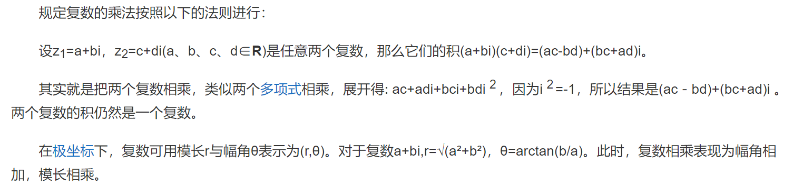

#### 除法法则

复数除法定义：满足(c+di)(x+yi)=(a+bi)的复数x+yi(x,y∈**R**)叫复数a+bi除以复数c+di的商。

运算方法：可以把除法换算成乘法做，在分子分母同时乘上分母的共轭。所谓共轭你可以理解为加减号的变换，互为共轭的两个复数相乘是个实常数。

除法运算规则：

①设复数a+bi(a，b∈R)，除以c+di(c，d∈R)，其商为x+yi(x，y∈R)，

> 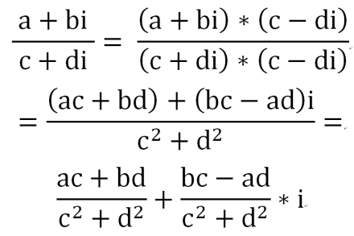图1 分母实数化

即(a+bi)÷(c+di)=x+yi

∵(x+yi)(c+di)=(cx－dy)+(dx+cy)i

∴(cx－dy)+(dx+cy)i=a+bi

由复数相等定义可知 cx-dy=a dx+cy=b

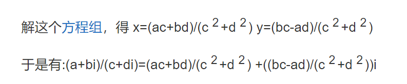

②利用共轭复数将分母实数化得（见图1）：

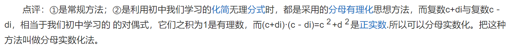

另外，由上述乘法法则可得另一计算方法，即幅角相减，模长相除。

#### 对数运算法则 

对于复数(r,θ)，有ln(r,θ)=ln r+iθ。

其他结论可由换底公式得到。

#### 指数运算法则 

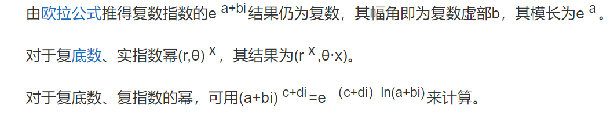

## 2.9 [实例：输出正弦函数（Sin）图像](http://c.biancheng.net/view/vip_7302.html)

在Go语言中，正弦函数由 math 包提供，函数入口为 math.Sin，正弦函数的参数为 float64，返回值也是 float64。在使用正弦函数时，根据实际精度可以进行转换。  
  
Go语言的标准库支持对图片像素进行访问，并且支持输出各种图片格式，如 JPEG、PNG、GIF 等。  
  
首先给出本节完整的代码：

1.  package main

2.  

3.  import (

4.  "image"

5.  "image/color"

6.  "image/png"

7.  "log"

8.  "math"

9.  "os"

10. )

11. 

12. func main() {

13. 

14. // 图片大小

15. const size = 300

16. // 根据给定大小创建灰度图

17. pic := image.NewGray(image.Rect(0, 0, size, size))

18. 

19. // 遍历每个像素

20. for x := 0; x \< size; x++ {

21. for y := 0; y \< size; y++ {

22. // 填充为白色

23. pic.SetGray(x, y, color.Gray{255})

24. }

25. }

26. 

27. // 从0到最大像素生成x坐标

28. for x := 0; x \< size; x++ {

29. 

30. // 让sin的值的范围在0~2Pi之间

31. s := float64(x) \* 2 \* math.Pi / size

32. 

33. // sin的幅度为一半的像素。向下偏移一半像素并翻转

34. y := size/2 - math.Sin(s)\*size/2

35. 

36. // 用黑色绘制sin轨迹

37. pic.SetGray(x, int(y), color.Gray{0})

38. }

39. 

40. // 创建文件

41. file, err := os.Create("sin.png")

42. 

43. if err != nil {

44. log.Fatal(err)

45. }

46. // 使用png格式将数据写入文件

47. png.Encode(file, pic) //将image信息写入文件中

48. 

49. // 关闭文件

50. file.Close()

51. }

### 2.9.1设置图片背景色

以下是设置图片背景的代码：

1.  // 图片大小

2.  const size = 300

3.  

4.  // 根据给定大小创建灰度图

5.  pic := image.NewGray(image.Rect(0, 0, size, size))

6.  

7.  // 遍历每个像素

8.  for x := 0; x \< size; x++ {

9.  for y := 0; y \< size; y++ {

10. // 填充为白色

11. pic.SetGray(x, y, color.Gray{255})

12. }

13. }

代码说明如下：

- 第 2 行，声明一个 size 常量，值为 300。

- 第 5 行，使用 image 包的 NewGray() 函数创建一个图片对象，使用区域由 image.Rect 结构提供，image.Rect 描述一个方形的两个定位点 (x1,y1) 和 (x2,y2)，image.Rect(0,0,size,size) 表示使用完整灰度图像素，尺寸为宽 300，长 300。

- 第 8 行和第 9 行，遍历灰度图的所有像素。

- 第 11 行，将每一个像素的灰度设为 255，也就是白色。

灰度图是一种常见的图片格式，一般情况下颜色由 8 位组成，灰度范围为 0～255，0 表示黑色，255 表示白色。  
  
初始化好的灰度图默认的灰度值都是 0，对的是黑色，由于显示效果的效果不是很好，所以这里将所有像素设置为 255，也就是白色。

### 2.9.2绘制正弦函数轨迹

正弦函数是一个周期函数，定义域是实数集，取值范围是 \[-1, 1\]。用编程的通俗易懂的话来说就是：math.Sin 函数的参数支持任意浮点数范围，函数返回值的范围总是在 -1～1 之间（包含 1、-1）。  
  
要将正弦函数放在图片上需要考虑以下一些因素：

- math.Sin 的返回值在 -1～1 之间，需要考虑将正弦的输出幅度变大，可以将 math.Sin 的返回值乘以一个常量进行放大。

- 图片的坐标系原点在左上角，而 math.Sin 基于笛卡尔坐标系原点在左下角，需要对图像进行上下翻转和平移。

将这些处理逻辑汇总为代码如下：

1.  // 从0到最大像素生成x坐标

2.  for x := 0; x \< size; x++ {

3.  

4.  // 让sin的值的范围在0~2Pi之间

5.  s := float64(x) \* 2 \* math.Pi / size

6.  

7.  // sin的幅度为一半的像素。向下偏移一半像素并翻转

8.  y := size/2 - math.Sin(s)\*size/2

9.  

10. // 用黑色绘制sin轨迹

11. pic.SetGray(x, int(y), color.Gray{0})

12. }

代码说明如下：  
1) 第 2 行，生成 0 到 size（300）的 x 坐标轴。  
  
2) 第 5 行，计算 math.Sin 的定义域，这段代码等效为：

1.  rate := x / size

2.  s := rate \* 2 \* math.Pi

x 的范围是 0 到 size，因此除以 size 后，rate 的范围是 0～1 之间，再乘以 2π 后，s 的范围刚好是 0～2π 之间。  
  
float64(x) 表示将整型的 x 变量转换为 float64 类型，之后运算的所有表达式将以 float64 类型进行。  
  
3) 第 8 行中，math.Sin(s)\*size/2 表示将正弦函数的返回值幅度从 1 扩大到二分之一的 size。负号表示将正弦函数图形以图形中心上下翻转。叠加 size/2 表示将图形在 y 轴上向下偏移二分之一的 size（图片坐标系的 y 向下）。  
  
4) 第 11 行将计算好的 x 轴和 y 轴数据，以灰度为 0（黑色）使用 SetGray() 方法填充到像素中。  
  
写入图片的正弦函数图像如下图所示：


### 2.9.3写入图片文件

内存中的正弦函数图形是不可见的，我们选用 PNG 格式将图形输出为文件，Go语言提供了文件创建函数和 PNG 格式写入函数，代码如下：

1.  // 创建文件

2.  file, err := os.Create("sin.png")

3.  

4.  if err != nil {

5.  log.Fatal(err)

6.  }

7.  // 使用PNG格式将数据写入文件

8.  png.Encode(file, pic) //将image信息写入文件中

9.  

10. // 关闭文件

11. file.Close()

代码说明如下：

- 第 2 行，创建 sin.png 的文件。

- 第 4 行，如果创建文件失败，返回错误，打印错误并终止。

- 第 8 行，使用 PNG 包，将图形对象写入文件中。

- 第 11 行，关闭文件。

## 2.10 [Go语言bool类型（布尔类型）](http://c.biancheng.net/view/16.html)

一个布尔类型的值只有两种：true 或 false。if 和 for 语句的条件部分都是布尔类型的值，并且==和\<等比较操作也会产生布尔型的值。  
  
一元操作符!对应逻辑非操作，因此!true的值为 false，更复杂一些的写法是(!true==false) ==true，实际开发中我们应尽量采用比较简洁的布尔表达式，就像用 x 来表示x==true。

1.  var aVar = 10

2.  aVar == 5 // false

3.  aVar == 10 // true

4.  aVar != 5 // true

5.  aVar != 10 // false

Go语言对于值之间的比较有非常严格的限制，**只有两个相同类型的值才可以进行比较**，如果值的类型是接口（interface），那么它们也必须都实现了相同的接口。如果其中一个值是常量，那么另外一个值可以不是常量，但是类型必须和该常量类型相同。如果以上条件都不满足，则必须将其中一个值的类型转换为和另外一个值的类型相同之后才可以进行比较。  
  
布尔值可以和 &&（AND）和 \|\|（OR）操作符结合，并且有短路行为，如果运算符左边的值已经可以确定整个布尔表达式的值，那么运算符右边的值将不再被求值，因此下面的表达式总是安全的：

1.  s != "" && s\[0\] == 'x'

其中 s\[0\] 操作如果应用于空字符串将会导致 panic 异常。  
  
因为&&的优先级比\|\|高（&& 对应逻辑乘法，\|\| 对应逻辑加法，乘法比加法优先级要高），所以下面的布尔表达式可以不加小括号：

1.  if 'a' \<= c && c \<= 'z' \|\|

2.  'A' \<= c && c \<= 'Z' \|\|

3.  '0' \<= c && c \<= '9' {

4.  // ...ASCII字母或数字...

5.  }

布尔值并不会隐式转换为数字值 0 或 1，反之亦然，必须使用 if 语句显式的进行转换：

1.  i := 0

2.  if b {

3.  i = 1

4.  }

如果需要经常做类似的转换，可以将转换的代码封装成一个函数，如下所示：

1.  // 如果b为真，btoi返回1；如果为假，btoi返回0

2.  func btoi(b bool) int {

3.  if b {

4.  return 1

5.  }

6.  return 0

7.  }

数字到布尔型的逆转换非常简单，不过为了保持对称，我们也可以封装一个函数：

1.  // itob报告是否为非零。

2.  func itob(i int) bool { return i != 0 }

Go语言中***不允许将整型强制转换为布尔型***，代码如下：

1.  var n bool

2.  fmt.Println(int(n) \* 2)

编译错误，输出如下：

cannot convert n (type bool) to type int

布尔型无法参与数值运算，也无法与其他类型进行转换。

## 2.11 [Go语言字符串](http://c.biancheng.net/view/17.html)

一个字符串是一个不可改变的字节序列，字符串可以包含任意的数据，但是通常是用来包含可读的文本，字符串是 UTF-8 字符的一个序列（当字符为 ASCII 码表上的字符时则占用 1 个字节，其它字符根据需要占用 2-4 个字节）。  
  
UTF-8 是一种被广泛使用的编码格式，是文本文件的标准编码，其中包括 XML 和 JSON 在内也都使用该编码。由于该编码对占用字节长度的不定性，在Go语言中字符串也可能根据需要占用 1 至 4 个字节，这与其它编程语言如 C++、Java 或者 Python 不同（Java 始终使用 2 个字节）。Go语言这样做不仅减少了内存和硬盘空间占用，同时也不用像其它语言那样需要对使用 UTF-8 字符集的文本进行编码和解码。  
  
字符串是一种值类型，且值不可变，即创建某个文本后将无法再次修改这个文本的内容，更深入地讲，字符串是字节的定长数组。

### 2.11.1定义字符串

可以使用双引号""来定义字符串，字符串中可以使用转义字符来实现换行、缩进等效果，常用的转义字符包括：

- \n：换行符

- \r：回车符

- \t：tab 键

- \u 或 \U：Unicode 字符

- \\：反斜杠自身

1.  package main

2.  

3.  import (

4.  "fmt"

5.  )

6.  

7.  func main() {

8.  var str = "C语言中文网\nGo语言教程"

9.  fmt.Println(str)

10. }

运行结果为：

C语言中文网  
Go语言教程

一般的比较运算符（==、!=、\<、\<=、\>=、\>）是通过在内存中按字节比较来实现字符串比较的，因此比较的结果是字符串自然编码的顺序。字符串所占的字节长度可以通过函数 len() 来获取，例如 len(str)。  
  
字符串的内容（纯字节）可以通过标准索引法来获取，在方括号\[ \]内写入索引，索引从 0 开始计数：

- 字符串 str 的第 1 个字节：str\[0\]

- 第 i 个字节：str\[i - 1\]

- 最后 1 个字节：str\[len(str)-1\]

需要注意的是，这种转换方案只对纯 ASCII 码的字符串有效。

> 注意：获取字符串中某个字节的地址属于非法行为，例如 &str\[i\]。

### 2.11.2字符串拼接符“+”

两个字符串 s1 和 s2 可以通过 s := s1 + s2 拼接在一起。将 s2 追加到 s1 尾部并生成一个新的字符串 s。  
  
可以通过下面的方式来对代码中多行的字符串进行拼接：

1.  str := "Beginning of the string " +

2.  "second part of the string"

> 提示：因为编译器会在行尾自动补全分号，所以拼接字符串用的加号“+”必须放在第一行末尾。

也可以使用“+=”来对字符串进行拼接：

1.  s := "hel" + "lo,"

2.  s += "world!"

3.  fmt.Println(s) //输出 “hello, world!”

### 2.11.3字符串实现基于 UTF-8 编码

Go语言中字符串的内部实现使用 UTF-8 编码，通过 rune 类型，可以方便地对每个 UTF-8 字符进行访问。当然，Go语言也支持按照传统的 ASCII 码方式逐字符进行访问。  
  
关于字符串的 UTF-8 字符访问的详细方法，后面的章节将会详细介绍。

### 2.11.4定义多行字符串

在Go语言中，使用双引号书写字符串的方式是字符串常见表达方式之一，被称为字符串字面量（string literal），这种双引号字面量不能跨行，如果想要在源码中嵌入一个多行字符串时，就必须使用 ` 反引号，代码如下：

1.  const str = `第一行
2.  第二行
3.  第三行
4.  \r\n
5.  `
6.  fmt.Println(str)

代码运行结果：
<span id="_Toc1745073003" class="anchor"></span>第一行  
第二行  
第三行  
\r\n

反引号\`，是键盘上 1 键左边的键，两个反引号间的字符串将被原样赋值到 str 变量中。  
在这种方式下，反引号间换行将被作为字符串中的换行，但是所有的转义字符均无效，文本将会原样输出。  

多行字符串一般用于内嵌源码和内嵌数据等，代码如下：
1.  const codeTemplate = `// Generated by github.com/davyxu/cellnet/
2.  protoc-gen-msg
3.  // DO NOT EDIT!{{range .Protos}}
4.  // Source: {{.Name}}{{end}}5.  
6.  package {{.PackageName}}
7.  
8.  {{if gt .TotalMessages 0}}
9.  import (
10.   "github.com/davyxu/cellnet"
11.   "reflect"
12.    _ "github.com/davyxu/cellnet/codec/pb"
13. )
14. {{end}}
15. 
16. func init() {
17. {{range .Protos}}
18. // {{.Name}}{{range .Messages}}
19. cellnet.RegisterMessageMeta("pb","{{.FullName}}", reflect.TypeOf((\*{{.Name}})(nil)).Elem(), {{.MsgID}}) {{end}}
20. {{end}}
21. }
22. `

这段代码只定义了一个常量 codeTemplate，类型为字符串，使用 ` 定义，字符串的内容为一段代码生成中使用到的 Go 源码格式。  
在 ` 间的所有代码均不会被编译器识别，而只是作为字符串的一部分。  
  
字符串类型在业务中的应用可以说是最广泛的，读者需要详细了解字符串的常见用法，请猛击下面的文章：
- Go语言计算字符串长度——len()和RuneCountInString()
- Go语言遍历字符串——获取每一个字符串元素
- Go语言字符串截取（获取字符串的某一段字符）
- Go语言修改字符串
- Go语言字符串拼接（连接）
- Go语言fmt.Sprintf（格式化输出）
- Go语言Base64编码——电子邮件的基础编码格式

## 2.11+1 Go语言计算字符串长度——len()和RuneCountInString()

Go 语言的内建函数 len()，可以用来获取切片、字符串、通道（channel）等的长度。下面的代码可以用 len() 来获取字符串的长度。

1.  tip1 := "genji is a ninja"
2.  fmt.Println(len(tip1))
3.  
4.  tip2 := "忍者"
5.  fmt.Println(len(tip2))
程序输出如下：  
16  
6  
  
**len() 函数的返回值**的类型为 int，表示**字符串的 ASCII 字符个数或字节长度**。
- 输出中第一行的 16 表示 tip1 的字符个数为 16。
- 输出中第二行的 6 表示 tip2 的字符格式，也就是“忍者”的字符个数是 6，然而根据习惯，“忍者”的字符个数应该是 2。
这里的差异是由于 Go 语言的字符串都以 UTF-8 格式保存，每个中文占用 3 个字节，因此使用 len() 获得两个中文文字对应的 6 个字节。  
  
如果希望按习惯上的字符个数来计算，就需要使用 Go 语言中 **UTF-8** 包提供的 **RuneCountInString**() 函数，统计 **Uncode 字符数量**。  
  
下面的代码展示如何计算UTF-8的字符个数。
1.  fmt.Println(utf8.RuneCountInString("忍者"))
2.  fmt.Println(utf8.RuneCountInString("龙忍出鞘,fight!"))

程序输出如下：  
2  
11  
  
一般游戏中在登录时都需要输入名字，而名字一般有长度限制。考虑到国人习惯使用中文做名字，就需要检测字符串 UTF-8 格式的长度。

#### 总结
- ASCII 字符串长度使用 len() 函数。
- Unicode 字符串长度使用 utf8.RuneCountInString() 函数。

## 2.11+2 Go语言遍历字符串——获取每一个字符串元素

遍历字符串有下面两种写法。

### 2.11+2.1遍历每一个ASCII字符

遍历 ASCII 字符使用 for 的数值循环进行遍历，直接取每个字符串的下标获取 ASCII 字符，如下面的例子所示。

1.  theme := "狙击 start"
2.  
3.  for i := 0; i \< len(theme); i++ {
4.  fmt.Printf("ascii: %c %d\n", theme\[i\], theme\[i\])
5.  }

程序输出如下：

ascii: ?  231  
ascii:     139  
ascii:     153  
ascii: ?  229  
ascii:     135  
ascii: ?  187  
ascii:    32  
ascii: s  115  
ascii: t  116  
ascii: a  97  
ascii: r  114  
ascii: t  116

这种模式下取到的汉字“惨不忍睹”。由于没有使用 Unicode，汉字被显示为乱码。

### 2.11+2.2按Unicode字符遍历字符串

同样的内容：

1.  theme := "狙击 start"
2.  
3.  for \_, s := range theme {
4.      fmt.Printf("Unicode: %c %d\n", s, s)
5.  }

程序输出如下：

Unicode: 狙  29401  
Unicode: 击  20987  
Unicode:    32  
Unicode: s  115  
Unicode: t  116  
Unicode: a  97  
Unicode: r  114  
Unicode: t  116

可以看到，这次汉字可以正常输出了。

#### 总结
- ASCII 字符串遍历直接使用下标。
- Unicode 字符串遍历用 for range。

## 2.11+3Go语言字符串截取（获取字符串的某一段字符）

获取字符串的某一段字符是开发中常见的操作，我们一般将字符串中的某一段字符称做子串（substring）。  
  
下面例子中使用 strings.Index() 函数在字符串中搜索另外一个子串，代码如下：
1.  tracer := "死神来了, 死神bye bye"
2.  comma := strings.Index(tracer, ", ")
3.  
4.  pos := strings.Index(tracer[comma:], "死神")
5.  
6.  fmt.Println(comma, pos, tracer[comma+pos:])

程序输出如下：
12 3 死神bye bye

代码说明如下：  
1) 第 2 行尝试在 tracer 的字符串中搜索中文的逗号，返回的位置存在 comma 变量中，类型是 int，表示从 tracer 字符串开始的 ASCII 码位置。    
strings.Index() 函数并没有像其他语言一样，提供一个从某偏移开始搜索的功能。不过我们可以对字符串进行**切片**操作来实现这个逻辑。    
2) 第4行中，tracer[comma:] 从 tracer 的 comma 位置开始到 tracer 字符串的结尾构造一个子字符串，返回给 string.Index() 进行再索引。得到的 pos 是相对于 tracer[comma:] 的结果。  
  
comma 逗号的位置是 12，而 pos 是相对位置，值为 3。我们为了获得第二个“死神”的位置，也就是逗号后面的字符串，就必须让 comma 加上 pos 的相对偏移，计算出 15 的偏移，然后再通过切片 tracer[comma+pos:] 计算出最终的子串，获得最终的结果：“死神bye bye”。

#### 总结

字符串索引比较常用的有如下几种方法：

- strings.Index：正向搜索子字符串。

- strings.LastIndex：反向搜索子字符串。

- 搜索的起始位置可以通过切片偏移制作。

## 2.11+4Go语言修改字符串

### Ch1.golang怎么修改字符串

朱不贪原创 2023-07-14 17:20:20

golang字符串修改的方法有：1、通过字符串切割和拼接，使用strings包中的Split函数将字符串切割为切片，然后通过拼接切片中的元素来修改字符串；2、使用字节数组进行修改，通过将字符串转换为字节数组进行修改。

本教程操作环境：windows10系统、golang1.20.1版本、DELL G3电脑。

Golang是一种现代化的编程语言，它具备简洁高效的特点，广泛应用于Web开发和系统编程等领域。在Golang中，字符串是一种不可变的数据类型，意味着一旦定义了字符串，就无法直接修改其内容。但是，我们可以采用一些方法来修改或处理字符串。

#### 一、通过字符串切割和拼接

Golang中的字符串可以通过切割和拼接的方式来达到修改的效果。例如，假设我们有一个字符串s，其中包含下划线，我们可以使用strings包中的Split函数将字符串切割为切片，然后通过拼接切片中的元素来修改字符串。示例如下：

<table>
<colgroup>
<col style="width: 4%" />
<col style="width: 95%" />
</colgroup>
<tbody>
<tr class="odd">
<td><p>1</p>
<p>2</p>
<p>3</p>
<p>4</p>
<p>5</p>
<p>6</p>
<p>7</p>
<p>8</p>
<p>9</p>
<p>10</p>
<p>11</p></td>
<td><p>import(</p>
<p>"fmt"</p>
<p>"strings"</p>
<p>)</p>
<p>func main(){</p>
<p>s:="hello_world"</p>
<p>arr:=strings.Split(s,"_")</p>
<p>arr[1]="golang"</p>
<p>newStr:=strings.Join(arr,"_")</p>
<p>fmt.Println(newStr)</p>
<p>}</p></td>
</tr>
</tbody>
</table>

在上述代码中，我们首先使用strings包中的Split函数将字符串s按照下划线进行切割，得到一个切片arr。然后，我们将切片arr中的第二个元素修改为"golang"，最后使用strings包中的Join函数将修改后的切片拼接为字符串newStr。通过打印newStr，我们可以看到输出结果为"hello_golang"，字符串被成功地修改了。

#### 二、使用字节数组进行修改

除了字符串切割和拼接的方式外，我们还可以通过将字符串转换为字节数组进行修改。在Golang中，字符串实际上是由字节数组组成的，因此我们可以通过操作字节数组来修改字符串的内容。示例如下：

<table>
<colgroup>
<col style="width: 10%" />
<col style="width: 89%" />
</colgroup>
<tbody>
<tr class="odd">
<td><p>1</p>
<p>2</p>
<p>3</p>
<p>4</p>
<p>5</p>
<p>6</p>
<p>7</p>
<p>8</p>
<p>9</p>
<p>10</p></td>
<td><p>import(</p>
<p>"fmt"</p>
<p>)</p>
<p>funcmain(){</p>
<p>s:="hello"</p>
<p>bytes:=[]byte(s)</p>
<p>bytes[1]='a'</p>
<p>newStr:=string(bytes)</p>
<p>fmt.Println(newStr)</p>
<p>}</p></td>
</tr>
</tbody>
</table>

在上述代码中，我们首先定义了字符串s为"hello"，然后将其转换为字节数组bytes。接着，我们通过修改字节数组bytes中的第二个元素为字符'a'来实现字符串的修改。最后，我们将修改后的字节数组转换回字符串newStr并进行打印，可以得到输出结果为"hallo"。

需要注意的是，由于Golang中的字符串是不可变的，所以在修改字符串时，实际上是创建了一个新的字符串对象。因此，性能方面可能会有一定的影响。

总结而言，Golang中的字符串是一种不可变的数据类型，无法直接修改其内容。但是我们可以通过切割和拼接的方式，或者通过将字符串转换为字节数组进行操作来修改字符串。以上就是Golang中修改字符串的几种常用方法。在实际应用中，根据具体需求选择合适的方法，以达到修改字符串的目的 。

### Ch2.如何在Golang中修改字符串

PHPz 发布： 2023-03-30 09:39:59

Golang是一种流行的编程语言，适用于许多不同的应用程序开发任务。在这篇文章中，我们将探讨如何在Golang中修改字符串。

首先，我们需要明确一个概念：**在Golang中，字符串是不可变的**。这意味着我们不能直接在字符串上进行修改，而是需要创建一个新的字符串以保存所做的更改。

那么如何修改字符串？有几种方法可以实现。

第一种方法是使用字符串拼接。这种方法需要将原始字符串分成两个子字符串，并使用修改后的字符串替换其中一个子字符串。这可以通过使用“+”运算符来实现。例如：

<table>
<colgroup>
<col style="width: 2%" />
<col style="width: 97%" />
</colgroup>
<tbody>
<tr class="odd">
<td><p>1</p>
<p>2</p>
<p>3</p>
<p>4</p></td>
<td><p>str := "hello world"</p>
<p>newstr := "new"</p>
<p>result := newstr + str[3:]</p>
<p>fmt.Println(result)</p></td>
</tr>
</tbody>
</table>

在这个例子中，我们将原始字符串拆分为“he”和“llo world”。然后，我们将“new”添加到“he”中，然后将结果与“llo world”子字符串连接起来。最终结果是“newlo world”。

第二种方法是使用字符串切片。这种方法可以直接修改字符串中的某个字符或一系列字符。例如：

<table>
<colgroup>
<col style="width: 2%" />
<col style="width: 97%" />
</colgroup>
<tbody>
<tr class="odd">
<td><p>1</p>
<p>2</p>
<p>3</p>
<p>4</p>
<p>5</p></td>
<td><p>str := "hello world"</p>
<p>chars := []rune(str)</p>
<p>chars[0] = 'j'</p>
<p>result := string(chars)</p>
<p>fmt.Println(result)</p></td>
</tr>
</tbody>
</table>

在这个例子中，我们将字符串转换为rune类型的切片，这样我们才能修改它。然后，我们将第一个字符“h”更改为“j”，并将结果转换回字符串类型。

第三种方法是使用字符串包中的函数。例如，我们可以使用strings.Replace函数来替换字符串中的一个子串。例如：

<table>
<colgroup>
<col style="width: 2%" />
<col style="width: 97%" />
</colgroup>
<tbody>
<tr class="odd">
<td><p>1</p>
<p>2</p>
<p>3</p>
<p>4</p>
<p>5</p>
<p>6</p>
<p>7</p></td>
<td><p>import "strings"</p>
<p> </p>
<p>str := "hello world"</p>
<p>old := "world"</p>
<p>new := "everyone"</p>
<p>result := strings.Replace(str, old, new, -1)</p>
<p>fmt.Println(result)</p></td>
</tr>
</tbody>
</table>

在这个例子中，我们使用strings.Replace函数来将字符串中的“world”子串替换为“everyone”。

总结来说，Golang中虽然不能直接修改字符串，但是有许多方法可以实现字符串的修改。需要根据具体情况选择合适的方式。

### Ch3.Go语言实现修改字符串的三种方法

西卡na 于 2022-03-23 19:56:12 发布

原文链接：<https://blog.csdn.net/qq_55380184/article/details/123694412>

Go语言实现修改字符串的三种方法

/*

修改字符串

注意：字符串是无法被修改的，只能复制原字符串，在复制的版本上修改

方法1：转换为[]byte()

方法2：转换为[]rune()

方法3：新字符串代替原字符串的子字符串,用strings包中的strings.Replace()

*/

func main() {

//方法1

s1 := "abcdefgabc"

s2 := []byte(s1)

s2[1] = 'B'

fmt.Println(string(s2)) //aBcdefgabc

//方法2

s3 := []rune(s1)

s3[1] = 'B'

fmt.Println(string(s3)) //aBcdefgabc

//方法3

new := "ABC"

old := "abc"

s4 := strings.Replace(s1, old, new, 2)

fmt.Println(s4) //ABCdefgABC

}

## 2.11+5Go语言字符串拼接（连接）

连接字符串这么简单，还需要学吗？确实，Go 语言和大多数其他语言一样，使用+对字符串进行连接操作，非常直观。  
  
但问题来了，好的事物并非完美，简单的东西未必高效。除了加号连接字符串，Go 语言中也有类似于 StringBuilder 的机制来进行高效的字符串连接，例如：

1.  hammer := "吃我一锤"

2.  

3.  sickle := "死吧"

4.  

5.  // 声明字节缓冲

6.  var stringBuilder bytes.Buffer

7.  

8.  // 把字符串写入缓冲

9.  stringBuilder.WriteString(hammer)

10. stringBuilder.WriteString(sickle)

11. 

12. // 将缓冲以字符串形式输出

13. fmt.Println(stringBuilder.String())

bytes.Buffer 是可以缓冲并可以往里面写入各种字节数组的。字符串也是一种字节数组，使用 WriteString() 方法进行写入。  
  
将需要连接的字符串，通过调用 WriteString() 方法，写入 stringBuilder 中，然后再通过 stringBuilder.String() 方法将缓冲转换为字符串。

## 2.11+6 Go语言fmt.Sprintf（格式化输出）

格式化在逻辑中非常常用。使用格式化函数，要注意写法：

fmt.Sprintf(格式化样式, 参数列表…)

- 格式化样式：字符串形式，格式化动词以%开头。

- 参数列表：多个参数以逗号分隔，个数必须与格式化样式中的个数一一对应，否则运行时会报错。

在 Go 语言中，格式化的命名延续C语言风格：

[纯文本复制](http://c.biancheng.net/view/41.html)

1.  var progress = 2

2.  var target = 8

3.  

4.  // 两参数格式化

5.  title := fmt.Sprintf("已采集%d个药草, 还需要%d个完成任务", progress, target)

6.  

7.  fmt.Println(title)

8.  

9.  pi := 3.14159

10. // 按数值本身的格式输出

11. variant := fmt.Sprintf("%v %v %v", "月球基地", pi, true)

12. 

13. fmt.Println(variant)

14. 

15. // 匿名结构体声明, 并赋予初值

16. profile := &struct {

17. Name string

18. HP int

19. }{

20. Name: "rat",

21. HP: 150,

22. }

23. 

24. fmt.Printf("使用'%%+v' %+v\n", profile)

25. 

26. fmt.Printf("使用'%%#v' %#v\n", profile)

27. 

28. fmt.Printf("使用'%%T' %T\n", profile)

代码输出如下：

已采集2个药草, 还需要8个完成任务  
"月球基地" 3.14159 true  
使用'%+v' &{Name:rat HP:150}  
使用'%#v' &struct { Name string; HP int }{Name:"rat", HP:150}  
使用'%T' *struct { Name string; HP int }C语言中, 使用%d代表整型参数

下表中标出了常用的一些格式化样式中的动词及功能。

|                                  |                                          |
|----------------------------------|------------------------------------------|
| 表：字符串格式化时常用动词及功能 |                                          |
| **动  词**                       | **功  能**                               |
| %v                               | 按值的本来值输出                         |
| %+v                              | 在 %v 基础上，对结构体字段名和值进行展开 |
| %#v                              | 输出 Go 语言语法格式的值                 |
| %T                               | 输出 Go 语言语法格式的类型和值           |
| %%                               | 输出 % 本体                              |
| %b                               | 整型以二进制方式显示                     |
| %o                               | 整型以八进制方式显示                     |
| %d                               | 整型以十进制方式显示                     |
| %x                               | 整型以十六进制方式显示                   |
| %X                               | 整型以十六进制、字母大写方式显示         |
| %U                               | Unicode 字符                             |
| %f                               | 浮点数                                   |
| %p                               | 指针，十六进制方式显示                   |

## 2.11.7 Base64 编码----电子邮件的基础编码格式

Base64 编码是常见的对8比特字节码的编码方式之一. Base64 编码可以使用64个可打印字符来表示二进制数据,电子邮件就是使用这种编码!  
Go语言的标准库自带了Base64编码算法,通过几行代码就可以对数据进行编码,示例代码如下:

package main

import (

"encoding/base64"

"fmt"

)

func main() {

// 需要处理的字符串

message := "Away from keyboard. https://golang.org/"

// 编码消息

encodedMessage := base64.StdEncoding.EncodeToString([]byte(message))

// 输出编码完成的消息

fmt.Println(encodedMessage)

// 解码消息

data, err := base64.StdEncoding.DecodeString(encodedMessage)

// 出错处理

if err != nil {

fmt.Println(err)

} else {

// 打印解码完成的数据

fmt.Println(string(data))

}

}

将会打印出返回的字节数组转换为字符串!

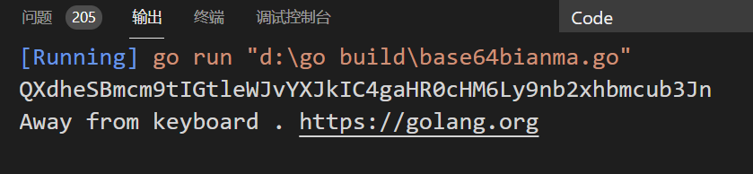

## 2.12 [Go语言字符类型（byte和rune）](http://c.biancheng.net/view/18.html)

字符串中的每一个元素叫做“字符”，在遍历或者单个获取字符串元素时可以获得字符。  
  
Go语言的字符有以下两种：

- 一种是 uint8 类型，或者叫 byte 型，代表了 ASCII 码的一个字符。

- 另一种是 rune 类型，代表一个 UTF-8 字符，当需要处理中文、日文或者其他复合字符时，则需要用到 rune 类型。rune 类型等价于 int32 类型。

byte 类型是 uint8 的别名，对于只占用 1 个字节的传统 ASCII 编码的字符来说，完全没有问题，例如 var ch byte = 'A'，字符使用单引号括起来。  
  
在 ASCII 码表中，A 的值是 65，使用 16 进制表示则为 41，所以下面的写法是等效的：

var ch byte = 65 或 var ch byte = '\x41'      //（\x 总是紧跟着长度为 2 的 16 进制数）

另外一种可能的写法是\后面紧跟着长度为 3 的八进制数，例如 \377。  
  
Go语言同样支持 Unicode（UTF-8），因此字符同样称为 Unicode 代码点或者 runes，并在内存中使用 int 来表示。在文档中，一般使用格式 U+hhhh 来表示，其中 h 表示一个 16 进制数。  
  
在书写 Unicode 字符时，需要在 16 进制数之前加上前缀\u或者\U。因为 Unicode 至少占用 2 个字节，所以我们使用 int16 或者 int 类型来表示。如果需要使用到 4 字节，则使用\u前缀，如果需要使用到 8 个字节，则使用\U前缀。

1.  var ch int = '\u0041'

2.  var ch2 int = '\u03B2'

3.  var ch3 int = '\U00101234'

4.  fmt.Printf("%d - %d - %d\n", ch, ch2, ch3) // integer

5.  fmt.Printf("%c - %c - %c\n", ch, ch2, ch3) // character

6.  fmt.Printf("%X - %X - %X\n", ch, ch2, ch3) // UTF-8 bytes

7.  fmt.Printf("%U - %U - %U", ch, ch2, ch3) // UTF-8 code point

输出：

65 - 946 - 1053236  
A - β - r  
41 - 3B2 - 101234  
U+0041 - U+03B2 - U+101234

格式化说明符%c用于表示字符，当和字符配合使用时，%v或%d会输出用于表示该字符的整数，%U输出格式为 U+hhhh 的字符串。  
  
Unicode 包中内置了一些用于测试字符的函数，这些函数的返回值都是一个布尔值，如下所示（其中 ch 代表字符）：

- 判断是否为字母：unicode.IsLetter(ch)

- 判断是否为数字：unicode.IsDigit(ch)

- 判断是否为空白符号：unicode.IsSpace(ch)

### 2.12.1 UTF-8 和 Unicode 有何区别？

Unicode 与 ASCII 类似，都是一种字符集。  
  
字符集为每个字符分配一个唯一的 ID，我们使用到的所有字符在 Unicode 字符集中都有一个唯一的 ID，例如上面例子中的 a 在 Unicode 与 ASCII 中的编码都是 97。汉字“你”在 Unicode 中的编码为 20320，在不同国家的字符集中，字符所对应的 ID 也会不同。而无论任何情况下，Unicode 中的字符的 ID 都是不会变化的。  
  
UTF-8 是编码规则，将 Unicode 中字符的 ID 以某种方式进行编码，UTF-8 的是一种变长编码规则，从 1 到 4 个字节不等。编码规则如下：

- 0xxxxxx 表示文字符号 0～127，兼容 ASCII 字符集。

- 从 128 到 0x10ffff 表示其他字符。

根据这个规则，拉丁文语系的字符编码一般情况下每个字符占用一个字节，而中文每个字符占用 3 个字节。  
  
广义的 Unicode 指的是一个标准，它定义了字符集及编码规则，即 Unicode 字符集和 UTF-8、UTF-16 编码等。

## 2.13 [Go语言数据类型转换](http://c.biancheng.net/view/20.html)

在必要以及可行的情况下，一个类型的值可以被转换成另一种类型的值。由于**Go语言不存在隐式类型转换**，因此所有的类型转换都必须显式的声明：

valueOfTypeB = typeB(valueOfTypeA)

类型 B 的值 = 类型 B(类型 A 的值)  
  
示例：

a := 5.0  
b := int(a)

类型转换只能在定义正确的情况下转换成功，例如从一个取值范围较小的类型转换到一个取值范围较大的类型（将 int16 转换为 int32）。当从一个取值范围较大的类型转换到取值范围较小的类型时（将 int32 转换为 int16 或将 float32 转换为 int），会发生精度丢失（截断）的情况。  
  
**只有相同底层类型的变量之间可以进行相互转换（**如将 int16 类型转换成 int32 类型），**不同底层类型**的变量相互转换时会引发**编译错误**（如将 bool 类型转换为 int 类型）：

[纯文本复制](http://c.biancheng.net/view/20.html)

1.  package main

2.  

3.  import (

4.  "fmt"

5.  "math"

6.  )

7.  

8.  func main() {

9.  

10. // 输出各数值范围

11. fmt.Println("int8 range:", math.MinInt8, math.MaxInt8)

12. fmt.Println("int16 range:", math.MinInt16, math.MaxInt16)

13. fmt.Println("int32 range:", math.MinInt32, math.MaxInt32)

14. fmt.Println("int64 range:", math.MinInt64, math.MaxInt64)

15. 

16. // 初始化一个32位整型值

17. var a int32 = 1047483647

18. // 输出变量的十六进制形式和十进制值

19. fmt.Printf("int32: 0x%x %d\n", a, a)

20. 

21. // 将a变量数值转换为十六进制, 发生数值截断

22. b := int16(a)

23. // 输出变量的十六进制形式和十进制值

24. fmt.Printf("int16: 0x%x %d\n", b, b)

25. 

26. // 将常量保存为float32类型

27. var c float32 = math.Pi

28. // 转换为int类型, 浮点发生精度丢失

29. fmt.Println(int(c))

30. }

代码说明如下：

- 第 11～14 行，输出几个常见整型类型的数值范围。

- 第 17 行，声明 int32 类型的变量 a 并初始化。

- 第 19 行，使用 fmt.Printf 的%x动词将数值以十六进制格式输出，这一行输出 a 在转换前的 32 位的值。

- 第 22 行，将 a 的值转换为 int16 类型，也就是从 32 位有符号整型转换为 16 位有符号整型，由于 int16 类型的取值范围比 int32 类型的取值范围小，因此数值会进行截断（精度丢失）。

- 第 24 行，输出转换后的 a 变量值，也就是 b 的值，同样以十六进制和十进制两种方式进行打印。

- 第 27 行，math.Pi 是 math 包的常量，默认没有类型，会在引用到的地方自动根据实际类型进行推导，这里 math.Pi 被赋值到变量 c 中，因此类型为 float32。

- 第 29 行，将 float32 转换为 int 类型并输出。

代码输出如下：

int8 range: -128 127  
int16 range: -32768 32767  
int32 range: -2147483648 2147483647  
int64 range: -9223372036854775808 9223372036854775807  
int32: 0x3e6f54ff 1047483647  
int16: 0x54ff 21759  
3

根据输出结果，16 位有符号整型的范围是 -32768～32767，而变量 a 的值 1047483647 不在这个范围内。1047483647 对应的十六进制为 0x3e6f54ff，转为 int16 类型后，长度缩短一半，也就是在十六进制上砍掉一半，变成 0x54ff，对应的十进制值为 21759。  
  
浮点数在转换为整型时，会将小数部分去掉，只保留整数部分。

## 2.14 [Go语言指针](http://c.biancheng.net/view/21.html)

<span id="_Toc1418995371" class="anchor"></span>Go语言指针详解，看这一篇文章就够了

--------------------------

与 Java 和 .NET 等编程语言不同，Go语言为程序员提供了控制数据结构指针的能力，但是，并不能进行指针运算。Go语言允许你控制特定集合的数据结构、分配的数量以及内存访问模式，这对于构建运行良好的系统是非常重要的。指针对于性能的影响不言而喻，如果你想要做系统编程、操作系统或者网络应用，指针更是不可或缺的一部分。  
  
指针（pointer）在Go语言中可以被拆分为两个核心概念：

- **类型指针**，允许对这个指针类型的数据进行修改，**传递数据**可以直接使用指针，而无须拷贝数据，类型指针**不能进行偏移和运算**。

- **切片**，由指向起始元素的原始指针、元素数量和容量组成。

受益于这样的约束和拆分，Go语言的指针类型变量即拥有指针高效访问的特点，又不会发生指针偏移，从而避免了非法修改关键性数据的问题。同时，垃圾回收也比较容易对不会发生偏移的指针进行检索和回收。  
  
切片比原始指针具备更强大的特性，而且更为安全。切片在发生越界时，运行时**会报出宕机**，并**打出堆栈**，而**原始指针只会崩溃**。

### 2.14.1 C/C++中的指针

说到 C/C++ 中的指针，会让许多人“谈虎色变”，尤其是对指针的偏移、运算和转换。  
  
其实，指针是 C/C++ 语言拥有极高性能的根本所在，在操作大块数据和做偏移时即方便又便捷。因此，操作系统依然使用C语言及指针的特性进行编写。  
  
C/C++ 中指针饱受诟病的根本原因是指针的运算和内存释放，C/C++ 语言中的裸指针可以自由偏移，甚至可以在某些情况下偏移进入操作系统的核心区域，我们的计算机操作系统经常需要更新、修复漏洞的本质，就是为解决指针越界访问所导致的“缓冲区溢出”的问题。  
  
要明白指针，需要知道几个概念：指针地址、指针类型和指针取值，下面将展开详细说明。

### 2.14.2认识指针地址和指针类型

一个指针变量可以指向任何一个值的内存地址，它所指向的值的内存地址在 32 和 64 位机器上分别占用 4 或 8 个字节，占用字节的大小与所指向的值的大小无关。当一个指针被定义后没有分配到任何变量时，它的默认值为 nil。指针变量通常缩写为 ptr。  
  
每个变量在运行时都拥有一个地址，这个地址代表变量在内存中的位置。Go语言中使用在变量名前面添加&操作符（前缀）来获取变量的内存地址（取地址操作），格式如下：

ptr := &v    // v 的类型为 T

其中 v 代表被取地址的变量，变量 v 的地址使用变量 ptr 进行接收，ptr 的类型为\*T，称做 T 的指针类型，\*代表指针。  
  
指针实际用法，可以通过下面的例子了解：

1.  package main

2.  

3.  import (

4.  "fmt"

5.  )

6.  

7.  func main() {

8.  var cat int = 1

9.  var str string = "banana"

10. fmt.Printf("%p %p", &cat, &str)

11. }

运行结果：

0xc042052088 0xc0420461b0

代码说明如下：

- 第 8 行，声明整型变量 cat。

- 第 9 行，声明字符串变量 str。

- 第 10 行，使用 fmt.Printf 的动词%p打印 cat 和 str 变量的内存地址，指针的值是带有0x十六进制前缀的一组数据。

提示：变量、指针和地址三者的关系是，每个变量都拥有地址，指针的值就是地址。

### 2.14.3从指针获取指针指向的值

当使用&操作符对普通变量进行取地址操作并得到变量的指针后，可以对指针使用\*操作符，也就是指针取值，代码如下。

1.  package main

2.  

3.  import (

4.  "fmt"

5.  )

6.  

7.  func main() {

8.  

9.  // 准备一个字符串类型

10. var house = "Malibu Point 10880, 90265"

11. 

12. // 对字符串取地址, ptr类型为\*string

13. ptr := &house

14. 

15. // 打印ptr的类型

16. fmt.Printf("ptr type: %T\n", ptr)

17. 

18. // 打印ptr的指针地址

19. fmt.Printf("address: %p\n", ptr)

20. 

21. // 对指针进行取值操作

22. value := \*ptr

23. 

24. // 取值后的类型

25. fmt.Printf("value type: %T\n", value)

26. 

27. // 指针取值后就是指向变量的值

28. fmt.Printf("value: %s\n", value)

29. 

30. }

运行结果：

ptr type: \*string  
address: 0xc0420401b0  
value type: string  
value: Malibu Point 10880, 90265

代码说明如下：

- 第 10 行，准备一个字符串并赋值。

- 第 13 行，对字符串取地址，将指针保存到变量 ptr 中。

- 第 16 行，打印变量 ptr 的类型，其类型为 \*string。

- 第 19 行，打印 ptr 的指针地址，地址每次运行都会发生变化。

- 第 22 行，对 ptr 指针变量进行取值操作，变量 value 的类型为 string。

- 第 25 行，打印取值后 value 的类型。

- 第 28 行，打印 value 的值。

取地址操作符&和取值操作符\*是一对互补操作符，&取出地址，\*根据地址取出地址指向的值。  
  
变量、指针地址、指针变量、取地址、取值的相互关系和特性如下：

- 对变量进行取地址操作使用&操作符，可以获得这个变量的指针变量。

- 指针变量的值是指针地址。

- 对指针变量进行取值操作使用\*操作符，可以获得指针变量指向的原变量的值。

### 2.14.4使用指针修改值

通过指针不仅可以取值，也可以修改值。  
  
前面已经演示了使用多重赋值的方法进行数值交换，使用指针同样可以进行数值交换，代码如下：

1.  package main

2.  

3.  import "fmt"

4.  

5.  // 交换函数

6.  func swap(a, b \*int) {

7.  

8.  // 取a指针的值, 赋给临时变量t

9.  t := \*a

10. 

11. // 取b指针的值, 赋给a指针指向的变量

12. \*a = \*b

13. 

14. // 将a指针的值赋给b指针指向的变量

15. \*b = t

16. }

17. 

18. func main() {

19. 

20. // 准备两个变量, 赋值1和2

21. x, y := 1, 2

22. 

23. // 交换变量值

24. swap(&x, &y)

25. 

26. // 输出变量值

27. fmt.Println(x, y)

28. }

运行结果：

2 1

代码说明如下：

- 第 6 行，定义一个交换函数，参数为 a、b，类型都为 \*int 指针类型。

- 第 9 行，取指针 a 的值，并把值赋给变量 t，t 此时是 int 类型。

- 第 12 行，取 b 的指针值，赋给指针 a 指向的变量。注意，此时\*a的意思不是取 a 指针的值，而是“a 指向的变量”。

- 第 15 行，将 t 的值赋给指针 b 指向的变量。

- 第 21 行，准备 x、y 两个变量，分别赋值为 1 和 2，类型为 int。

- 第 24 行，取出 x 和 y 的地址作为参数传给 swap() 函数进行调用。

- 第 27 行，交换完毕时，输出 x 和 y 的值。

\*操作符作为右值时，意义是取指针的值，作为左值时，也就是放在赋值操作符的左边时，表示 a 指针指向的变量。其实归纳起来，\*操作符的根本意义就是操作指针指向的变量。当操作在右值时，就是取指向变量的值，当操作在左值时，就是将值设置给指向的变量。  
  
如果在 swap() 函数中交换操作的是指针值，会发生什么情况？可以参考下面代码：

1.  package main

2.  

3.  import "fmt"

4.  

5.  func swap(a, b \*int) {

6.  b, a = a, b

7.  }

8.  

9.  func main() {

10. x, y := 1, 2

11. swap(&x, &y)

12. fmt.Println(x, y)

13. }

运行结果：

1 2

结果表明，交换是不成功的。上面代码中的 swap() 函数交换的是 a 和 b 的地址，在交换完毕后，a 和 b 的变量值确实被交换。但和 a、b 关联的两个变量并没有实际关联。这就像写有两座房子的卡片放在桌上一字摊开，交换两座房子的卡片后并不会对两座房子有任何影响。

### 2.14.5示例：使用指针变量获取命令行的输入信息

Go语言内置的 flag 包实现了对命令行参数的解析，flag 包使得开发命令行工具更为简单。  
  
下面的代码通过提前定义一些命令行指令和对应的变量，并在运行时输入对应的参数，经过 flag 包的解析后即可获取命令行的数据。  
  
【示例】获取命令行输入：

1.  package main

2.  

3.  // 导入系统包

4.  import (

5.  "flag"

6.  "fmt"

7.  )

8.  

9.  // 定义命令行参数

10. var mode = flag.String("mode", "", "process mode")

11. 

12. func main() {

13. 

14. // 解析命令行参数

15. flag.Parse()

16. 

17. // 输出命令行参数

18. fmt.Println(\*mode)

19. }

将这段代码命名为 main.go，然后使用如下命令行运行：

go run main.go --mode=fast

命令行输出结果如下：

fast

代码说明如下：

- 第 10 行，通过 flag.String，定义一个 mode 变量，这个变量的类型是 \*string。后面 3 个参数分别如下：

  - 参数名称：在命令行输入参数时，使用这个名称。

  - 参数值的默认值：与 flag 所使用的函数创建变量类型对应，String 对应字符串、Int 对应整型、Bool 对应布尔型等。

  - 参数说明：使用 -help 时，会出现在说明中。

- 第 15 行，解析命令行参数，并将结果写入到变量 mode 中。

- 第 18 行，打印 mode 指针所指向的变量。

由于之前已经使用 flag.String 注册了一个名为 mode 的命令行参数，flag 底层知道怎么解析命令行，并且将值赋给 mode\*string 指针，在 Parse 调用完毕后，无须从 flag 获取值，而是通过自己注册的这个 mode 指针获取到最终的值。代码运行流程如下图所示。

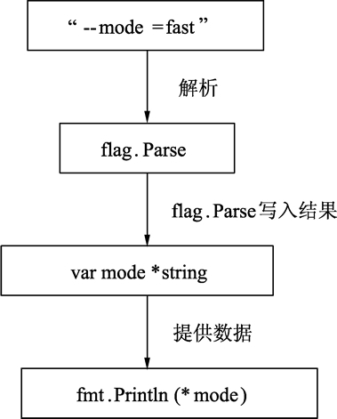  
图：命令行参数与变量的关系

### 2.14.6创建指针的另一种方法——new() 函数

Go语言还提供了另外一种方法来创建指针变量，格式如下：

new(类型)

一般这样写：

1.  str := new(string)

2.  \*str = "Go语言教程"

3.  

4.  fmt.Println(\*str)

new() 函数可以创建一个对应类型的指针，创建过程会分配内存，被创建的指针指向默认值。

## 2.15 Go语言变量逃逸分析

在讨论变量生命周期之前，先来了解下计算机组成里两个非常重要的概念：堆和栈。变量的生命周期我们将在下一节《变量生命周期》中为大家讲解。

### 2.15.1什么是栈

  栈（Stack）是一种拥有特殊规则的线性表数据结构。

#### 1) 概念

  栈只允许从线性表的同一端放入和取出数据，按照后进先出（LIFO，Last InFirst Out）的顺序，如下图所示。

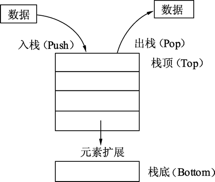  
图：栈的操作及扩展

  往栈中放入元素的过程叫做入栈。入栈会增加栈的元素数量，最后放入的元素总是位于栈的顶部，最先放入的元素总是位于栈的底部。

  从栈中取出元素时，只能从栈顶部取出。取出元素后，栈的元素数量会变少。最先放入的元素总是最后被取出，最后放入的元素总是最先被取出。不允许从栈底获取数据，也不允许对栈成员（除了栈顶部的成员）进行任何查看和修改操作。

  栈的原理类似于将书籍一本一本地堆起来。书按顺序一本一本从顶部放入，要取书时只能从顶部一本一本取出。

#### 2) 变量和栈有什么关系

  栈可用于内存分配，栈的分配和回收速度非常快。下面的代码展示了栈在内存分配上的作用：
```go
func calc(a, b int) int {
  var c int
  c = a * b

  var x int

  x = c * 10

  return x
}
```
  代码说明如下：

- 第 1 行，传入 a、b 两个整型参数。
- 第 2 行，声明整型变量 c，运行时，c 会分配一段内存用以存储 c 的数值。
- 第 3 行，将 a 和 b 相乘后赋值给 c。
- 第 5 行，声明整型变量 x，x 也会被分配一段内存。
- 第 6 行，让 c 乘以 10 后赋值给变量 x。
- 第 8 行，返回 x 的值。

  上面的代码在没有任何优化的情况下，会进行变量 c 和 x 的分配过程。Go语言默认情况下会将 c 和 x 分配在栈上，这两个变量在 calc() 函数退出时就不再使用，函数结束时，保存 c 和 x 的栈内存再出栈释放内存，整个分配内存的过程通过栈的分配和回收都会非常迅速。

### 2.15.2什么是堆

  堆在内存分配中类似于往一个房间里摆放各种家具，家具的尺寸有大有小，分配内存时，需要找一块足够装下家具的空间再摆放家具。经过反复摆放和腾空家具后，房间里的空间会变得乱七八糟，此时再往这个空间里摆放家具会发现虽然有足够的空间，但各个空间分布在不同的区域，没有一段连续的空间来摆放家具。此时，内存分配器就需要对这些空间进行调整优化，如下图所示。

  
图：堆的分配及空间

  堆分配内存和栈分配内存相比，堆适合不可预知大小的内存分配。但是为此付出的代价是分配速度较慢，而且会形成内存碎片。

### 2.15.3变量逃逸（Escape Analysis）——自动决定变量分配方式，提高运行效率

  堆和栈各有优缺点，该怎么在编程中处理这个问题呢？在 C/C++语言中，需要开发者自己学习如何进行内存分配，选用怎样的内存分配方式来适应不同的算法需求。比如，函数局部变量尽量使用栈，全局变量、结构体成员使用堆分配等。程序员不得不花费很长的时间在不同的项目中学习、记忆这些概念并加以实践和使用。

  Go语言将这个过程整合到了编译器中，命名为“变量逃逸分析”。通过编译器分析代码的特征和代码的生命周期，决定应该使用堆还是栈来进行内存分配。

#### 1) 逃逸分析

  通过下面的代码来展现Go语言如何使用命令行来分析变量逃逸，代码如下：
```go
package main

import "fmt"// 本函数测试入口参数和返回值情况

func dummy(b int) int {
  // 声明一个变量c并赋值
  var c int
  c = b
  return c
}
// 空函数, 什么也不做
func void() {}

func main() {
  // 声明a变量并打印
  var a int

  // 调用void()函数
  void()

// 打印a变量的值和dummy()函数返回
  fmt.Println(a, dummy(0))
}
```
  代码说明如下：

- 第 6 行，dummy() 函数拥有一个参数，返回一个整型值，用来测试函数参数和返回值分析情况。
- 第 9 行，声明变量 c，用于演示函数临时变量通过函数返回值返回后的情况。
- 第 16 行，这是一个空函数，测试没有任何参数函数的分析情况。
- 第 23 行，在 main() 中声明变量 a，测试 main() 中变量的分析情况。
- 第 26 行，调用 void() 函数，没有返回值，测试 void() 调用后的分析情况。
- 第 29 行，打印 a 和 dummy(0) 的返回值，测试函数返回值没有变量接收时的分析情况。

  接着使用如下命令行运行上面的代码：

go run -gcflags "-m -l" main.go

  使用 go run 运行程序时，-gcflags 参数是编译参数。其中 -m 表示进行内存分配分析，-l 表示避免程序内联，也就是避免进行程序优化。

  运行结果如下：

# command-line-arguments ./main.go:29:13: a escapes to heap ./main.go:29:22: dummy(0) escapes to heap ./main.go:29:13: main ... argument does not escape 0 0

  程序运行结果分析如下：

- 第 2 行告知“代码的第 29 行的变量 a 逃逸到堆”。

- 第 3 行告知“dummy(0) 调用逃逸到堆”。由于 dummy() 函数会返回一个整型值，这个值被 fmt.Println 使用后还是会在 main() 函数中继续存在。

- 第 4 行，这句提示是默认的，可以忽略。

  上面例子中变量 c 是整型，其值通过 dummy() 的返回值“逃出”了 dummy() 函数。变量 c 的值被复制并作为 dummy() 函数的返回值返回，即使变量 c 在 dummy() 函数中分配的内存被释放，也不会影响 main() 中使用 dummy() 返回的值。变量 c 使用栈分配不会影响结果。

#### 2) 取地址发生逃逸

  下面的例子使用结构体做数据，来了解结构体在堆上的分配情况，代码如下：
```go
package main

import "fmt"// 声明空结构体测试结构体逃逸情况

type Data struct {}

func dummy() *Data {
  // 实例化c为Data类型
  var c Data

  //返回函数局部变量地址
  return &c
}

func main() {
  fmt.Println(dummy())
}
```
  代码说明如下：
- 第 6 行，声明一个空的结构体做结构体逃逸分析。
- 第 9 行，将 dummy() 函数的返回值修改为 *Data 指针类型。
- 第 11 行，将变量 c 声明为 Data 类型，此时 c 的结构体为值类型。
- 第 14 行，取函数局部变量 c 的地址并返回。
- 第 18 行，打印 dummy() 函数的返回值。

  执行逃逸分析：
go run -gcflags "-m -l" main.go
# command-line-arguments 
./main.go:15:9: &c escapes to heap 
./main.go:12:6: moved to heap: c 
./main.go:20:19: dummy() escapes to heap 
./main.go:20:13: main ... argument does not escape &{}

  注意第 4 行出现了新的提示：将 c 移到堆中。这句话表示，Go 编译器已经确认如果将变量 c 分配在栈上是无法保证程序最终结果的，如果这样做，dummy() 函数的返回值将是一个不可预知的内存地址，这种情况一般是 C/C++ 语言中容易犯错的地方，引用了一个函数局部变量的地址。

  Go语言最终选择将 c 的 Data 结构分配在堆上。然后由垃圾回收器去回收 c 的内存。

#### 3) 原则

  在使用Go语言进行编程时，Go语言的设计者不希望开发者将精力放在内存应该分配在栈还是堆的问题上，编译器会自动帮助开发者完成这个纠结的选择，但变量逃逸分析也是需要了解的一个编译器技术，这个技术不仅用于Go语言，在Java等语言的编译器优化上也使用了类似的技术。

  编译器觉得变量应该分配在堆和栈上的原则是：
- 变量是否被取地址；
- 变量是否发生逃逸。

## 2.15+1 [Go语言变量逃逸分析](http://c.biancheng.net/view/vip_7303.html)

晶凌玄夜

于 2022-03-14 14:56:33

原文链接：https://blog.csdn.net/weixin_43755544/article/details/123406666

### 2.15.1 什么是逃逸分析

在编译程序优化理论中，逃逸分析是一种确定指针动态范围的方法——分析在程序的哪些地方可以访问到指针。也是就是说逃逸分析是解决指针作用范围的编译优化方法。编程中常见的两种逃逸情景：

1）函数中局部对象指针被返回（不确定被谁访问）

2）对象指针被多个子程序（如线程 协程）共享使用

### 2.15.2 为什么要做逃逸分析

开始我们提到go语言中对象内存的分配不是由语言运算符或函数决定，而是通过逃逸分析来决定。为什么要这么干呢？其实说到底还是为了优化程序。函数中生成一个新对象：
1)如果分配到栈上，待函数返回资源就被回收了
2)如果分配到堆上，函数返回后交给gc来管理该对象资源

栈资源的分配及回收速度比堆要快，所以逃逸分析最大的好处应该是减少了GC的压力。

使用命令go build -gcflags “-m -l” test.go可以分析变量是否逃逸

### 2.15.3逃逸分析的场景

#### 2.15.3.1指针逃逸

典型的指针逃逸案例，返回局部变量的指针
```go
package main

func test2() *int {
  c1 := 20
  return &c1
}

func main() {
  c2 := test2()
  println(*c2)
}
```
#### 2.15.3.2栈空间不足逃逸

package main

func main() {
  t := make([]int, 1000)
  m := make([]int, 10000)
  t[0] = 1
  m[0] = 1
}

/*
make([]int, 1000) does not escape
make([]int, 10000) escapes to heap
*/

#### 2.15.3.3闭包引用逃逸
```go
package main

func Fibonacci() func() int {
  a, b := 0, 1
  return func() int {
    a, b = b, a+b
    return a
  }

}

func main() {

  f := Fibonacci()

  for i := 0; i < 5; i++ {
    println(f())
  }

}
```
#### 2.15.3.4动态类型逃逸

当对象不确定大小或者被作为不确定大小的参数时发生逃逸。t的大小是个变量所以会逃逸到堆上。size作为interface{}参数逃逸到堆上

package main

func main() {

var size int = 10

t := make([]int, size)

m := make([]int, 10)

for i := 0; i < size; i++ {

t[i] = i

m[i] = i

}

}

/*

make([]int, size) escapes to heap

make([]int, 10) does not escape

*/

#### 2.15.3.5切片或map赋值

在给切片或者map赋值对象指针（与对象共享内存地址时），对象会逃逸到堆上。但赋值对象值或者返回对象值切片是不会发生逃逸的。

package main

func test3() {
  var i = 10
  var j = 10

  s2 := make([]*int, 2)
  m2 := make(map[int]*int)
  s2[0] = &i
  m2[0] = &j
}

func main() {
  test3()
}

/*
./test.go:442:6: moved to heap: i
./test.go:443:6: moved to heap: j
./test.go:445:12: make([]*int, 2) does not escape
./test.go:447:12: make(map[int]*int) does not escape
*/

其实内存逃逸还有其他场景，所以在平时开发中尽量去避免这些情况，可以有效地提高程序的运行效率

## 2.16 [Go语言变量的生命周期](http://c.biancheng.net/view/4034.html)

变量的生命周期指的是在程序运行期间变量有效存在的时间间隔。  
  
变量的生命周期与变量的作用域有着不可分割的联系：

- 全局变量：它的生命周期和整个程序的运行周期是一致的；
- 局部变量：它的生命周期则是动态的，从创建这个变量的声明语句开始，到这个变量不再被引用为止；
- 形式参数和函数返回值：它们都属于局部变量，在函数被调用的时候创建，函数调用结束后被销毁。

1.  for t := 0.0; t < cycles*2*math.Pi; t += res {
2.      x := math.Sin(t)
3.      y := math.Sin(t*freq + phase)
4.      img.SetColorIndex(
5.          size+int(x*size+0.5), size+int(y*size+0.5),
6.          blackIndex, // 最后插入的逗号不会导致编译错误，这是Go编译器的一个特性
7.      ) // 小括号另起一行缩进，和大括号的风格保存一致
8.  }

上面代码中，在每次循环的开始会创建临时变量 t，然后在每次循环迭代中创建临时变量 x 和 y。临时变量 x、y 存放在栈中，随着函数执行结束（执行遇到最后一个}），释放其内存。  
  
栈的概念在上一节《变量逃逸》中介绍过，它和堆的区别在于：

- 堆（heap）：堆是用于存放进程执行中被动态分配的内存段。它的大小并不固定，可动态扩张或缩减。当进程调用 malloc 等函数分配内存时，新分配的内存就被动态加入到堆上（堆被扩张）。当利用 free 等函数释放内存时，被释放的内存从堆中被剔除（堆被缩减）；
- 栈(stack)：栈又称堆栈， 用来存放程序暂时创建的局部变量，也就是我们函数的大括号{ }中定义的局部变量。

在程序的编译阶段，编译器会根据实际情况自动选择在栈或者堆上分配局部变量的存储空间，不论使用 var 还是 new 关键字声明变量都不会影响编译器的选择。

1.  var global *int

2.  func f() {
3.      var x int
4.      x = 1
5.      global = &x
6.  }

7.  func g() {
8.      y := new(int)
9.      *y = 1
10. }

上述代码中，函数 f 里的变量 x 必须在堆上分配，因为它在函数退出后依然可以通过包一级的 global 变量找到，虽然它是在函数内部定义的。用Go语言的术语说，这个局部变量 x 从函数 f 中逃逸了。  
  
相反，当函数 g 返回时，变量 *y 不再被使用，也就是说可以马上被回收的。因此，*y 并没有从函数 g 中逃逸，编译器可以选择在栈上分配 *y 的存储空间，也可以选择在堆上分配，然后由Go语言的 GC（垃圾回收机制）回收这个变量的内存空间。  
  
在实际的开发中，并不需要刻意的实现变量的逃逸行为，因为逃逸的变量需要额外分配内存，同时对性能的优化可能会产生细微的影响。  
  
虽然Go语言能够帮助我们完成对内存的分配和释放，但是为了能够开发出高性能的应用我们任然需要了解变量的声明周期。例如，如果将局部变量赋值给全局变量，将会阻止 GC 对这个局部变量的回收，导致不必要的内存占用，从而影响程序的性能。

## 2.17 [Go语言常量](http://c.biancheng.net/view/23.html)

Go语言常量和const关键字

Go语言中的常量使用关键字 const 定义，用于存储不会改变的数据，常量是在编译时被创建的，即使定义在函数内部也是如此，并且**只能是布尔型、数字型（整数型、浮点型和复数）和字符串型**。由于编译时的限制，定义常量的表达式必须为能被编译器求值的常量表达式。  
  
常量的定义格式和变量的声明语法类似：const name [type] = value，例如：

const pi = 3.14159 // 相当于 math.Pi 的近似值

在Go语言中，你可以省略类型说明符 [type]，因为编译器可以根据变量的值来推断其类型。

- 显式类型定义： const b string = "abc"
- 隐式类型定义： const b = "abc"

常量的值必须是能够在编译时就能够确定的，可以在其赋值表达式中涉及计算过程，但是所有用于计算的值必须在编译期间就能获得。

- 正确的做法：const c1 = 2/3
- 错误的做法：const c2 = getNumber() // 引发构建错误: getNumber() 用做值

和变量声明一样，可以批量声明多个常量：

1.  const (
2.      e = 2.7182818
3.      pi = 3.1415926
4.  )

所有常量的运算都可以在编译期完成，这样不仅可以减少运行时的工作，也方便其他代码的编译优化，当操作数是常量时，一些运行时的错误也可以在编译时被发现，例如整数除零、字符串索引越界、任何导致无效浮点数的操作等。  
  
常量间的所有算术运算、逻辑运算和比较运算的结果也是常量，对常量的类型转换操作或以下函数调用都是返回常量结果：len、cap、real、imag、complex 和 unsafe.Sizeof。  
  
因为它们的值是在编译期就确定的，因此常量可以是构成类型的一部分，例如用于指定数组类型的长度：

1.  const IPv4Len = 4

2.  

3.  // parseIPv4 解析一个 IPv4 地址 (d.d.d.d).

4.  func parseIPv4(s string) IP {

5.  var p [IPv4Len]byte

6.  // ...

7.  }

一个常量的声明也可以包含一个类型和一个值，但是如果没有显式指明类型，那么将从右边的表达式推断类型。在下面的代码中，time.Duration 是一个命名类型，底层类型是 int64，time.Minute 是对应类型的常量。下面声明的两个常量都是 time.Duration 类型，可以通过 %T 参数打印类型信息：

1.  const noDelay time.Duration = 0

2.  const timeout = 5 * time.Minute

3.  fmt.Printf("%T %[1]v\n", noDelay) // "time.Duration 0"

4.  fmt.Printf("%T %[1]v\n", timeout) // "time.Duration 5m0s"

5.  fmt.Printf("%T %[1]v\n", time.Minute) // "time.Duration 1m0s"

如果是批量声明的常量，除了第一个外其它的常量右边的初始化表达式都可以省略，如果省略初始化表达式则表示使用前面常量的初始化表达式，对应的常量类型也是一样的。例如：

1.  const (

2.  a = 1

3.  b

4.  c = 2

5.  d

6.  )

7.  

8.  fmt.Println(a, b, c, d) // "1 1 2 2"

如果只是简单地复制右边的常量表达式，其实并没有太实用的价值。但是它可以带来其它的特性，那就是 iota 常量生成器语法。

### 2.17.1 iota 常量生成器

常量声明可以使用 iota 常量生成器初始化，它用于生成一组以相似规则初始化的常量，但是不用每行都写一遍初始化表达式。在一个 const 声明语句中，在第一个声明的常量所在的行，iota 将会被置为 0，然后在每一个有常量声明的行加一。  
  
【示例 1】首先定义一个 Weekday 命名类型，然后为一周的每天定义了一个常量，从周日 0 开始。在其它编程语言中，这种类型一般被称为枚举类型。

1.  type Weekday int

2.  

3.  const (

4.  Sunday Weekday = iota

5.  Monday

6.  Tuesday

7.  Wednesday

8.  Thursday

9.  Friday

10. Saturday

11. )

周日将对应 0，周一为 1，以此类推。

### 2.17.2 无类型常量

Go语言的常量有个不同寻常之处。虽然一个常量可以有任意一个确定的基础类型，例如 int 或 float64，或者是类似 time.Duration 这样的基础类型，但是许多常量并没有一个明确的基础类型。  
  
编译器为这些没有明确的基础类型的数字常量**提供比基础类型更高精度的算术运算**，可以认为**至少有 256bit 的运算精度**。这里有六种未明确类型的常量类型，分别是**无类型的布尔型、无类型的整数、无类型的字符、无类型的浮点数、无类型的复数、无类型的字符串**。  
  
通过延迟明确常量的具体类型，不仅可以提供更高的运算精度，而且可以直接用于更多的表达式而不需要显式的类型转换。  
  
【示例 2】math.Pi 无类型的浮点数常量，可以直接用于任意需要浮点数或复数的地方：

1.  var x float32 = math.Pi

2.  var y float64 = math.Pi

3.  var z complex128 = math.Pi

如果 math.Pi 被确定为特定类型，比如 float64，那么结果精度可能会不一样，同时对于需要 float32 或 complex128 类型值的地方则需要一个明确的强制类型转换：

1.  const Pi64 float64 = math.Pi

2.  

3.  var x float32 = float32(Pi64)

4.  var y float64 = Pi64

5.  var z complex128 = complex128(Pi64)

对于常量面值，不同的写法可能会对应不同的类型。例如 0、0.0、0i 和 \u0000 虽然有着相同的常量值，但是它们分别对应无类型的整数、无类型的浮点数、无类型的复数和无类型的字符等不同的常量类型。同样，true 和 false 也是无类型的布尔类型，字符串面值常量是无类型的字符串类型。

## 2.18 Go语言模拟枚举

Go语言模拟枚举（const和iota模拟枚举）

-----------

Go语言现阶段没有枚举类型，但是可以使用 const 常量配合上一节《[Go语言常量](http://c.biancheng.net/view/23.html)》中介绍的 iota 来模拟枚举类型，请看下面的代码：

1.  type Weapon int

2.  

3.  const (

4.  Arrow Weapon = iota // 开始生成枚举值, 默认为0

5.  Shuriken

6.  SniperRifle

7.  Rifle

8.  Blower

9.  )

10. 

11. // 输出所有枚举值

12. fmt.Println(Arrow, Shuriken, SniperRifle, Rifle, Blower)

13. 

14. // 使用枚举类型并赋初值

15. var weapon Weapon = Blower

16. fmt.Println(weapon)

代码输出如下：

0 1 2 3 4  
4

代码说明如下：  
第 1 行中，将 int 定义为 Weapon 类型，就像枚举类型的本质是一个 int 类型一样。当然，某些情况下，如果需要 int32 和 int64 的枚举，也是可以的。  
  
第 4 行中，将常量 Arrow 的类型标识为 Weapon，这样标识后，const 下方的常量可以使用 Weapon 作为默认类型。该行使用 iota 进行常量值自动生成，iota 的起始值为 0，一般情况下也是建议枚举从 0 开始，让每个枚举类型都有一个空值，方便业务和逻辑的灵活使用。  
  
一个 const 声明内的每一行常量声明，将会自动套用前面的 iota 格式，并自动增加，类似于电子表格中单元格自动填充的效果，只需要建立好单元格之间的变化关系，拖动右下方的小点就可以自动生成单元格的值。  
  
当然，iota 不仅可以生成每次增加 1 的枚举值。还可以利用 iota 来做一些强大的枚举常量值生成器。下面的代码可以方便的生成标志位常量：

1.  const (

2.  FlagNone = 1 \<\< iota

3.  FlagRed

4.  FlagGreen

5.  FlagBlue

6.  )

7.  

8.  fmt.Printf("%d %d %d\n", FlagRed, FlagGreen, FlagBlue)

9.  fmt.Printf("%b %b %b\n", FlagRed, FlagGreen, FlagBlue)

代码输出如下：

2 4 8  
10 100 1000

在代码中编写一些标志位时，我们往往手动编写常量值，常量值特别多时，很容易重复或者写错，因此，使用 ioto 自动生成更加方便。  
  
代码说明如下：

- 第 2 行中 iota 使用了一个移位操作，每次将上一次的值左移一位（二进制位），以得出每一位的常量值。

- 第 8 行，将 3 个枚举按照常量输出，分别输出 2、4、8，都是将 1 每次左移一位的结果。

- 第 9 行，将枚举值按二进制格式输出，可以清晰地看到每一位的变化。

### 2.18.1 将枚举值转换为字符串

枚举在 [C#](http://c.biancheng.net/csharp/) 中是一个独立的类型，可以通过枚举值获取该值对应的字符串。例如，C# 中 Week 枚举值 Monday 为 1，那么可以通过 Week.Monday.ToString() 函数获得 Monday 字符串。  
  
Go语言中也可以实现这一功能，代码如下所示：  
  
转换字符串：

1.  package main

2.  

3.  import "fmt"

4.  

5.  // 声明芯片类型

6.  type ChipType int

7.  

8.  const (

9.  None ChipType = iota

10. CPU // 中央处理器

11. GPU // 图形处理器

12. )

13. 

14. func (c ChipType) String() string {

15. switch c {

16. case None:

17. return "None"

18. case CPU:

19. return "CPU"

20. case GPU:

21. return "GPU"

22. }

23. 

24. return "N/A"

25. }

26. 

27. func main() {

28. 

29. // 输出CPU的值并以整型格式显示

30. fmt.Printf("%s %d", CPU, CPU)

31. }

运行结果：

CPU 1

代码说明如下：

- 第 6 行，将 int 声明为 ChipType 芯片类型。

- 第 9 行，将 const 里定义的常量值设为 ChipType 类型，且从 0 开始，每行值加 1。

- 第 14 行，定义 ChipType 类型的方法 String()，返回值为字符串类型。

- 第 15～22 行，使用 switch 语句判断当前的 ChitType 类型的值，返回对应的字符串。

- 第 30 行，按整型的格式输出 CPU 的值。

String() 方法的 ChipType 在使用上和普通的常量没有区别。当这个类型需要显示为字符串时，Go语言会自动寻找 String() 方法并进行调用。

## 2.19 [Go语言类型别名](http://c.biancheng.net/view/25.html)

注意：本节内容涉及Go语言新版本的功能，内容上会涉及后续章节讲解的类型定义及结构体嵌入等特性。另外，本节内容适用于对Go语言很熟悉且正在关注工程升级、代码重构等问题的读者阅读。  
  
类型别名是 Go 1.9 版本添加的新功能，主要用于解决代码升级、迁移中存在的类型兼容性问题。在 C/C++ 语言中，代码重构升级可以使用宏快速定义一段新的代码，Go语言中没有选择加入宏，而是解决了重构中最麻烦的类型名变更问题。  
  
在 Go 1.9 版本之前定义内建类型的代码是这样写的：

1.  type byte uint8

2.  type rune int32

而在 Go 1.9 版本之后变为：

1.  type byte = uint8

2.  type rune = int32

这个修改就是配合类型别名而进行的修改。

### 2.19.1区分类型别名与类型定义

定义类型别名的写法为：

type TypeAlias = Type

类型别名规定：TypeAlias 只是 Type 的别名，本质上 TypeAlias 与 Type 是同一个类型，就像一个孩子小时候有小名、乳名，上学后用学名，英语老师又会给他起英文名，但这些名字都指的是他本人。  
  
类型别名与类型定义表面上看只有一个等号的差异，那么它们之间实际的区别有哪些呢？下面通过一段代码来理解。

1.  package main

2.  

3.  import (

4.  "fmt"

5.  )

6.  

7.  // 将NewInt定义为int类型

8.  type NewInt int

9.  

10. // 将int取一个别名叫IntAlias

11. type IntAlias = int

12. 

13. func main() {

14. 

15. // 将a声明为NewInt类型

16. var a NewInt

17. // 查看a的类型名

18. fmt.Printf("a type: %T\n", a)

19. 

20. // 将a2声明为IntAlias类型

21. var a2 IntAlias

22. // 查看a2的类型名

23. fmt.Printf("a2 type: %T\n", a2)

24. }

代码运行结果：

a type: main.NewInt  
a2 type: int

代码说明如下：

- 第 8 行，将 NewInt 定义为 int 类型，这是常见的定义类型的方法，通过 type 关键字的定义，NewInt 会形成一种新的类型，NewInt 本身依然具备 int 类型的特性。

- 第 11 行，将 IntAlias 设置为 int 的一个别名，使用 IntAlias 与 int 等效。

- 第 16 行，将 a 声明为 NewInt 类型，此时若打印，则 a 的值为 0。

- 第 18 行，使用%T格式化参数，打印变量 a 本身的类型。

- 第 21 行，将 a2 声明为 IntAlias 类型，此时打印 a2 的值为 0。

- 第 23 行，打印 a2 变量的类型。

结果显示 a 的类型是 main.NewInt，表示 main 包下定义的 NewInt 类型，a2 类型是 int，IntAlias 类型只会在代码中存在，编译完成时，不会有 IntAlias 类型。

### 2.19.2非本地类型不能定义方法

能够随意地为各种类型起名字，是否意味着可以在自己包里为这些类型任意添加方法呢？参见下面的代码演示：

1.  package main

2.  

3.  import (

4.  "time"

5.  )

6.  

7.  // 定义time.Duration的别名为MyDuration

8.  type MyDuration = time.Duration

9.  

10. // 为MyDuration添加一个函数

11. func (m MyDuration) EasySet(a string) {

12. 

13. }

14. 

15. func main() {

16. 

17. }

代码说明如下：

- 第 8 行，为 time.Duration 设定一个类型别名叫 MyDuration。

- 第 11 行，为这个别名添加一个方法。

编译上面代码报错，信息如下：

cannot define new methods on non-local type time.Duration

编译器提示：不能在一个非本地的类型 time.Duration 上定义新方法，非本地类型指的就是 time.Duration 不是在 main 包中定义的，而是在 time 包中定义的，与 main 包不在同一个包中，因此不能为不在一个包中的类型定义方法。  
  
解决这个问题有下面两种方法：

- 将第 8 行修改为 type MyDuration time.Duration，也就是将 MyDuration 从别名改为类型；

- 将 MyDuration 的别名定义放在 time 包中。

### 2.19.3在结构体成员嵌入时使用别名

当类型别名作为结构体嵌入的成员时会发生什么情况呢？请参考下面的代码。

1.  package main

2.  

3.  import (

4.  "fmt"

5.  "reflect"

6.  )

7.  

8.  // 定义商标结构

9.  type Brand struct {

10. }

11. 

12. // 为商标结构添加Show()方法

13. func (t Brand) Show() {

14. }

15. 

16. // 为Brand定义一个别名FakeBrand

17. type FakeBrand = Brand

18. 

19. // 定义车辆结构

20. type Vehicle struct {

21. 

22. // 嵌入两个结构

23. FakeBrand

24. Brand

25. }

26. 

27. func main() {

28. 

29. // 声明变量a为车辆类型

30. var a Vehicle

31. 

32. // 指定调用FakeBrand的Show

33. a.FakeBrand.Show()

34. 

35. // 取a的类型反射对象

36. ta := reflect.TypeOf(a)

37. 

38. // 遍历a的所有成员

39. for i := 0; i \< ta.NumField(); i++ {

40. 

41. // a的成员信息

42. f := ta.Field(i)

43. 

44. // 打印成员的字段名和类型

45. fmt.Printf("FieldName: %v, FieldType: %v\n", f.Name, f.Type.

46. Name())

47. }

48. }

代码输出如下：

FieldName: FakeBrand, FieldType: Brand  
FieldName: Brand, FieldType: Brand

代码说明如下：

- 第 9 行，定义商标结构。

- 第 13 行，为商标结构添加 Show() 方法。

- 第 17 行，为 Brand 定义一个别名 FakeBrand。

- 第 20～25 行，定义车辆结构 Vehicle，嵌入 FakeBrand 和 Brand 结构。

- 第 30 行，将 Vechicle 实例化为 a。

- 第 33 行，显式调用 Vehicle 中 FakeBrand 的 Show() 方法。

- 第 36 行，使用反射取变量 a 的反射类型对象，以查看其成员类型。

- 第 39～42 行，遍历 a 的结构体成员。

- 第 45 行，打印 Vehicle 类型所有成员的信息。

这个例子中，FakeBrand 是 Brand 的一个别名，在 Vehicle 中嵌入 FakeBrand 和 Brand 并不意味着嵌入两个 Brand，FakeBrand 的类型会以名字的方式保留在 Vehicle 的成员中。  
如果尝试将第 33 行改为：

a.Show()

编译器将发生报错：

ambiguous selector a.Show

在调用 Show() 方法时，因为两个类型都有 Show() 方法，会发生歧义，证明 FakeBrand 的本质确实是 Brand 类型。

## 2.20 [Go语言注释的定义及使用](http://c.biancheng.net/view/4035.html)

注释在程序中的作用是对程序进行注解和说明，便于对源码的阅读。编译系统在对源代码进行编译时会自动忽略注释的部分，因此注释对于程序的功能实现不起任何作用。在源码中适当地添加注释，能够提高源码的可读性。  
  
Go语言的注释主要分成两类，分别是单行注释和多行注释。

- 单行注释简称行注释，是最常见的注释形式，可以在任何地方使用以//开头的单行注释；

- 多行注释简称块注释，以/\*开头，并以\*/结尾，且不可以嵌套使用，多行注释一般用于包的文档描述或注释成块的代码片段。

单行注释的格式如下所示

//单行注释

多行注释的格式如下所示

/\*  
第一行注释  
第二行注释  
...  
\*/

每一个包都应该有相关注释，在使用 package 语句声明包名之前添加相应的注释，用来对包的功能及作用进行简要说明。  
  
同时，**在 package 语句之前的注释内容将被默认认为是这个包的文档说明**。一个包可以分散在多个文件中，但是只需要对其中一个进行注释说明即可。  
  
在多段注释之间可以使用空行分隔加以区分，如下所示：

1.  // Package superman implements methods for saving the world.

2.  //

3.  // Experience has shown that a small number of procedures can prove

4.  // helpful when attempting to save the world.

5.  package superman

对于代码中的变量、常量、函数等对象最好也都加上对应的注释，这样有利于后期对代码进行维护，例如下面代码中对 enterOrbit 函数的注释：

1.  // enterOrbit causes Superman to fly into low Earth orbit, a position

2.  // that presents several possibilities for planet salvation.

3.  func enterOrbit() error {

4.  ...

5.  }

当开发人员需要了解包的一些情况时，可以使用 godoc 来显示包的文档说明，下面来介绍一下 godoc 工具的使用。

### 2.20.1 godoc 工具

godoc 工具会从 Go 程序和包文件中提取顶级声明的首行注释以及每个对象的相关注释，并生成相关文档，也可以作为一个提供在线文档浏览的 web 服务器，Go语言官网（https://golang.google.cn/）就是通过这种形式实现的。  
  
但是Go语言 1.13 版本移除了 godoc 工具，大家可以通过go get 命令来获取 godoc 工具。

go get golang.org/x/tools/cmd/godoc

由于防火墙的原因，国内的用户可能无法通过go get 命令来获取 godoc 工具，这时候就需要大家来手动操作了。

- 首先从 GitHub（https://github.com/golang/tools.git） 下载 golang.org/x/tools 包；

- 然后将下载得到的文件解压到 GOPATH 下的 src\golang.org\x\tools 目录中，没有的话可以手动创建；

- 打开 GOPATH 下的 src\golang.org\x\tools\cmd\godoc 目录，在该目录下打开命令行工具，并执行go build 命令，生成 godoc.exe 可执行文件；

- 最后，将生成的 godoc.exe 文件移动到 GOPATH 下的 bin 目录中。（需要把 GOPATH 下的 bin 目录添加到环境变量 Path 中）

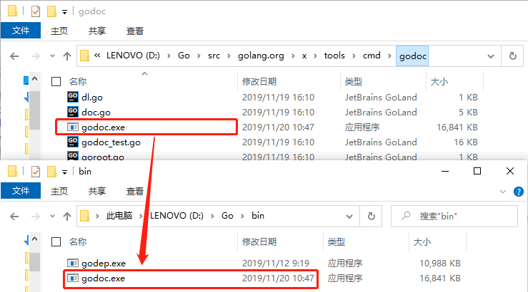

完成上述操作后就可以使用 godoc 工具了，godoc 工具一般有以下几种用法：

- go doc package：获取包的文档注释，例如go doc fmt 会显示使用 godoc 生成的 fmt 包的文档注释；

- go doc package/subpackage：获取子包的文档注释，例如go doc container/list；

- go doc package function：获取某个函数在某个包中的文档注释，例如go doc fmt Printf 会显示有关 fmt.Printf() 的使用说明。

下图演示了使用go doc 命令来获取包的文档注释：

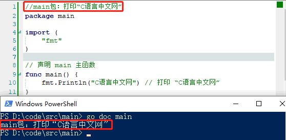

godoc 工具还可以获取 Go 安装目录下 ../go/src 中的注释内容，并将这些注释内容整合到 web 服务器中供我们预览。在命令行输入godoc -http=:6060，然后使用浏览器打开 http://localhost:6060 后，就可以看到本地文档浏览服务器提供的页面。

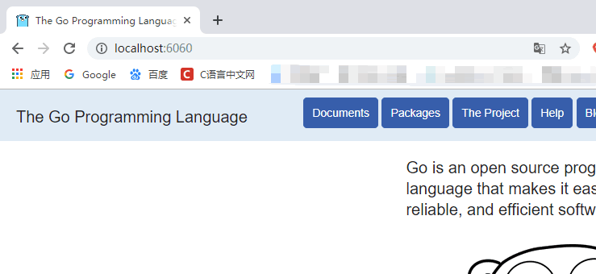

## 2.21 [Go语言关键字与标识符](http://c.biancheng.net/view/4036.html)

Go语言关键字与标识符简述

-----------

Go语言的词法元素包括 5 种，分别是标识符（identifier）、关键字（keyword）、操作符（operator）、分隔符（delimiter）、字面量（literal），它们是组成Go语言代码和程序的最基本单位。  
  
本节我们主要来介绍一下Go语言中的关键字和标识符。

### 2.21.1关键字

关键字即是被Go语言赋予了特殊含义的单词，也可以称为保留字。  
  
Go语言中的关键字一共有 25 个：

|          |             |        |           |        |
|----------|-------------|--------|-----------|--------|
| break    | default     | func   | interface | select |
| case     | defer       | go     | map       | struct |
| chan     | else        | goto   | package   | switch |
| const    | fallthrough | if     | range     | type   |
| continue | for         | import | return    | var    |

之所以刻意地将Go语言中的关键字保持的这么少，是为了简化在编译过程中的代码解析。和其它语言一样，关键字不能够作标识符使用。

### 2.21.2标识符

标识符是指Go语言对各种变量、方法、函数等命名时使用的字符序列，标识符由若干个字母、下划线\_、和数字组成，且第一个字符必须是字母。通俗的讲就是凡可以自己定义的名称都可以叫做标识符。  
  
下划线_是一个特殊的标识符，称为空白标识符，它可以像其他标识符那样用于变量的声明或赋值（任何类型都可以赋值给它），但任何赋给这个标识符的值都将被抛弃，因此这些值不能在后续的代码中使用，也不可以使用_作为变量对其它变量进行赋值或运算。  
  
在使用标识符之前必须进行声明，声明一个标识符就是将这个标识符与常量、类型、变量、函数或者代码包绑定在一起。在同一个代码块内标识符的名称不能重复。  
  
标识符的命名需要遵守以下规则：

- 由 26 个英文字母、0~9、\_组成；

- 不能以数字开头，例如 var 1num int 是错误的；

- Go语言中严格区分大小写；

- 标识符不能包含空格；

- 不能以系统保留关键字作为标识符，比如 break，if 等等。

命名标识符时还需要注意以下几点：

- 标识符的命名要尽量采取简短且有意义；

- 不能和标准库中的包名重复；

- 为变量、函数、常量命名时采用驼峰命名法，例如 stuName、getVal；

当然Go语言中的变量、函数、常量名称的首字母也可以大写，如果首字母大写，则表示它可以被其它的包访问（类似于 Java 中的 public）；如果首字母小写，则表示它只能在本包中使用 (类似于 Java 中 private）。

在Go语言中还存在着一些特殊的标识符，叫做预定义标识符，如下表所示：

|        |         |         |         |        |         |           |            |         |
|--------|---------|---------|---------|--------|---------|-----------|------------|---------|
| append | bool    | byte    | cap     | close  | complex | complex64 | complex128 | uint16  |
| copy   | false   | float32 | float64 | imag   | int     | int8      | int16      | uint32  |
| int32  | int64   | iota    | len     | make   | new     | nil       | panic      | uint64  |
| print  | println | real    | recover | string | true    | uint      | uint8      | uintptr |

预定义标识符一共有 36 个，主要包含Go语言中的基础数据类型和内置函数，这些预定义标识符也不可以当做标识符来使用。

## 2.22 [Go语言运算符的优先级](http://c.biancheng.net/view/5559.html)

运算符是用来在程序运行时执行数学或逻辑运算的，在Go语言中，一个表达式可以包含多个运算符，当表达式中存在多个运算符时，就会遇到优先级的问题，此时应该先处理哪个运算符呢？这个就由Go语言运算符的优先级来决定的。  
  
比如对于下面的表达式：

var a, b, c int = 16, 4, 2  
d := a + b\*c

对于表达式a + b \* c，如果按照数学规则推导，应该先计算乘法，再计算加法；b \* c的结果为 8，a + 8的结果为 24，所以 d 最终的值也是 24。实际上Go语言也是这样处理的，先计算乘法再计算加法，和数据中的规则一样，读者可以亲自验证一下。  
  
先计算乘法后计算加法，说明乘法运算符的优先级比加法运算符的优先级高。所谓优先级，就是当多个运算符出现在同一个表达式中时，先执行哪个运算符。  
Go语言有几十种运算符，被分成十几个级别，有的运算符优先级不同，有的运算符优先级相同，请看下表。

|                                  |                |                                                    |            |
|----------------------------------|----------------|----------------------------------------------------|------------|
| Go语言运算符优先级和结合性一览表 |                |                                                    |            |
| **优先级**                       | **分类**       | **运算符**                                         | **结合性** |
| 1                                | 逗号运算符     | ,                                                  | 从左到右   |
| 2                                | 赋值运算符     | =、+=、-=、\*=、/=、 %=、 \>=、 \<\<=、&=、^=、\|= | 从右到左   |
| 3                                | 逻辑或         | \|\|                                               | 从左到右   |
| 4                                | 逻辑与         | &&                                                 | 从左到右   |
| 5                                | 按位或         | \|                                                 | 从左到右   |
| 6                                | 按位异或       | ^                                                  | 从左到右   |
| 7                                | 按位与         | &                                                  | 从左到右   |
| 8                                | 相等/不等      | ==、!=                                             | 从左到右   |
| 9                                | 关系运算符     | \<、\<=、\>、\>=                                   | 从左到右   |
| 10                               | 位移运算符     | \<\<、\>\>                                         | 从左到右   |
| 11                               | 加法/减法      | +、-                                               | 从左到右   |
| 12                               | 乘法/除法/取余 | \*（乘号）、/、%                                   | 从左到右   |
| 13                               | 单目运算符     | !、\*（指针）、& 、++、--、+（正号）、-（负号）    | 从右到左   |
| 14                               | 后缀运算符     | ( )、\[ \]、-\>                                    | 从左到右   |

注意：优先级值越大，表示优先级越高。  
  
一下子记住所有运算符的优先级并不容易，还好Go语言中大部分运算符的优先级和数学中是一样的，大家在以后的编程过程中也会逐渐熟悉起来。如果实在搞不清，可以加括号，就像下面这样：

d := a + (b \* c)

括号的优先级是最高的，括号中的表达式会优先执行，这样各个运算符的执行顺序就一目了然了。  
  
运算符的结合性是指相同优先级的运算符在同一个表达式中，且没有括号的时候，操作数计算的顺序，通常有从左到右和从右到左两种方式，例如，+加法运算符的结合性是从左到右，那么表达式a + b + c则可以理解为为(a + b) + c。

## 2.23 [Go语言字符串和数值类型的相互转换](http://c.biancheng.net/view/vip_7305.html)

Go语言strconv包：字符串和数值类型的相互转换

-----------------

在实际开发中我们往往需要对一些常用的数据类型进行转换，如 string、int、int64、float 等数据类型之间的转换，Go语言中的 strconv 包为我们提供了字符串和基本数据类型之间的转换功能。  
  
strconv 包中常用的函数包括 Atoi()、Itoa()、parse 系列函数、format 系列函数、append 系列函数等，下面就来分别介绍一下。

### 2.23.1 string 与 int 类型之间的转换

字符串和整型之间的转换是我们平时编程中使用的最多的，下面就来介绍一下具体的操作。

Itoa()：整型转字符串

Itoa() 函数用于将 int 类型数据转换为对应的字符串类型，函数签名如下。

func Itoa(i int) string

示例代码如下：

1.  func main() {

2.  num := 100

3.  str := strconv.Itoa(num)

4.  fmt.Printf("type:%T value:%#v\n", str, str)

5.  }

运行结果如下所示：

type:string value:"100"

Atoi()：字符串转整型

Atoi() 函数用于将字符串类型的整数转换为 int 类型，函数签名如下。

func Atoi(s string) (i int, err error)

通过函数签名可以看出 Atoi() 函数有两个返回值，i 为转换成功的整型，err 在转换成功是为空转换失败时为相应的错误信息。  
  
示例代码如下：

1.  func main() {

2.  str1 := "110"

3.  str2 := "s100"

4.  num1, err := strconv.Atoi(str1)

5.  if err != nil {

6.  fmt.Printf("%v 转换失败！", str1)

7.  } else {

8.  fmt.Printf("type:%T value:%#v\n", num1, num1)

9.  }

10. num2, err := strconv.Atoi(str2)

11. if err != nil {

12. fmt.Printf("%v 转换失败！", str2)

13. } else {

14. fmt.Printf("type:%T value:%#v\n", num2, num2)

15. }

16. }

运行结果如下所示：

type:int value:110  
s100 转换失败！

### 2.23.2 Parse 系列函数

Parse 系列函数用于将字符串转换为指定类型的值，其中包括 ParseBool()、ParseFloat()、ParseInt()、ParseUint()。

ParseBool()

ParseBool() 函数用于将字符串转换为 bool 类型的值，它只能接受 1、0、t、f、T、F、true、false、True、False、TRUE、FALSE，其它的值均返回错误，函数签名如下。

func ParseBool(str string) (value bool, err error)

示例代码如下：

1.  func main() {

2.  str1 := "110"

3.  boo1, err := strconv.ParseBool(str1)

4.  if err != nil {

5.  fmt.Printf("str1: %v\n", err)

6.  } else {

7.  fmt.Println(boo1)

8.  }

9.  str2 := "t"

10. boo2, err := strconv.ParseBool(str2)

11. if err != nil {

12. fmt.Printf("str2: %v\n", err)

13. } else {

14. fmt.Println(boo2)

15. }

16. }

运行结果如下：

str1: strconv.ParseBool: parsing "110": invalid syntax  
true

ParseInt()

ParseInt() 函数用于返回字符串表示的整数值（可以包含正负号），函数签名如下：

func ParseInt(s string, base int, bitSize int) (i int64, err error)

参数说明：

- base 指定进制，取值范围是 2 到 36。如果 base 为 0，则会从字符串前置判断，“0x”是 16 进制，“0”是 8 进制，否则是 10 进制。

- bitSize 指定结果必须能无溢出赋值的整数类型，0、8、16、32、64 分别代表 int、int8、int16、int32、int64。

- 返回的 err 是 \*NumErr 类型的，如果语法有误，err.Error = ErrSyntax，如果结果超出类型范围 err.Error = ErrRange。

示例代码如下：

1.  func main() {

2.  str := "-11"

3.  num, err := strconv.ParseInt(str, 10, 0)

4.  if err != nil {

5.  fmt.Println(err)

6.  } else {

7.  fmt.Println(num)

8.  }

9.  }

运行结果如下：

-11

ParseUnit()

ParseUint() 函数的功能类似于 ParseInt() 函数，但 ParseUint() 函数不接受正负号，用于无符号整型，函数签名如下：

func ParseUint(s string, base int, bitSize int) (n uint64, err error)

示例代码如下：

1.  func main() {

2.  str := "11"

3.  num, err := strconv.ParseUint(str, 10, 0)

4.  if err != nil {

5.  fmt.Println(err)

6.  } else {

7.  fmt.Println(num)

8.  }

9.  }

运行结果如下：

11

ParseFloat()

ParseFloat() 函数用于将一个表示浮点数的字符串转换为 float 类型，函数签名如下。

func ParseFloat(s string, bitSize int) (f float64, err error)

参数说明：

- 如果 s 合乎语法规则，函数会返回最为接近 s 表示值的一个浮点数（使用 IEEE754 规范舍入）。

- bitSize 指定了返回值的类型，32 表示 float32，64 表示 float64；

- 返回值 err 是 \*NumErr 类型的，如果语法有误 err.Error=ErrSyntax，如果返回值超出表示范围，返回值 f 为 ±Inf，err.Error= ErrRange。

示例代码如下：

1.  func main() {

2.  str := "3.1415926"

3.  num, err := strconv.ParseFloat(str, 64)

4.  if err != nil {

5.  fmt.Println(err)

6.  } else {

7.  fmt.Println(num)

8.  }

9.  }

运行结果如下：

3.1415926

Parse 系列函数都有两个返回值，第一个返回值是转换后的值，第二个返回值为转化失败的错误信息。

### 2.23.3 Format 系列函数

Format 系列函数实现了将给定类型数据格式化为字符串类型的功能，其中包括 FormatBool()、FormatInt()、FormatUint()、FormatFloat()。

FormatBool()

FormatBool() 函数可以一个 bool 类型的值转换为对应的字符串类型，函数签名如下。

func FormatBool(b bool) string

示例代码如下：

1.  func main() {

2.  num := true

3.  str := strconv.FormatBool(num)

4.  fmt.Printf("type:%T,value:%v\n ", str, str)

5.  }

运行结果如下：

type:string,value:true

FormatInt()

FormatInt() 函数用于将整型数据转换成指定进制并以字符串的形式返回，函数签名如下：

func FormatInt(i int64, base int) string

其中，参数 i 必须是 int64 类型，参数 base 必须在 2 到 36 之间，返回结果中会使用小写字母“a”到“z”表示大于 10 的数字。  
  
示例代码如下：

1.  func main() {

2.  var num int64 = 100

3.  str := strconv.FormatInt(num, 16)

4.  fmt.Printf("type:%T,value:%v\n ", str, str)

5.  }

运行结果如下：

type:string,value:64

FormatUint()

FormatUint() 函数与 FormatInt() 函数的功能类似，但是参数 i 必须是无符号的 uint64 类型，函数签名如下。

func FormatUint(i uint64, base int) string

示例代码如下：

1.  func main() {

2.  var num uint64 = 110

3.  str := strconv.FormatUint(num, 16)

4.  fmt.Printf("type:%T,value:%v\n ", str, str)

5.  }

运行结果如下：

type:string,value:6e

FormatFloat()

FormatFloat() 函数用于将浮点数转换为字符串类型，函数签名如下：

func FormatFloat(f float64, fmt byte, prec, bitSize int) string

参数说明：

- bitSize 表示参数 f 的来源类型（32 表示 float32、64 表示 float64），会据此进行舍入。

- fmt 表示格式，可以设置为“f”表示 -ddd.dddd、“b”表示 -ddddp±ddd，指数为二进制、“e”表示 -d.dddde±dd 十进制指数、“E”表示 -d.ddddE±dd 十进制指数、“g”表示指数很大时用“e”格式，否则“f”格式、“G”表示指数很大时用“E”格式，否则“f”格式。

- prec 控制精度（排除指数部分）：当参数 fmt 为“f”、“e”、“E”时，它表示小数点后的数字个数；当参数 fmt 为“g”、“G”时，它控制总的数字个数。如果 prec 为 -1，则代表使用最少数量的、但又必需的数字来表示 f。

示例代码如下：

1.  func main() {

2.  var num float64 = 3.1415926

3.  str := strconv.FormatFloat(num, 'E', -1, 64)

4.  fmt.Printf("type:%T,value:%v\n ", str, str)

5.  }

运行结果如下：

type:string,value:3.1415926E+00

### 2.23.4 Append 系列函数

Append 系列函数用于将指定类型转换成字符串后追加到一个切片中，其中包含 AppendBool()、AppendFloat()、AppendInt()、AppendUint()。  
  
Append 系列函数和 Format 系列函数的使用方法类似，只不过是将转换后的结果追加到一个切片中。  
  
示例代码如下：

1.  package main

2.  import (

3.  "fmt"

4.  "strconv"

5.  )

6.  func main() {

7.  // 声明一个slice

8.  b10 := \[\]byte("int (base 10):")

9.  

10. // 将转换为10进制的string，追加到slice中

11. b10 = strconv.AppendInt(b10, -42, 10)

12. fmt.Println(string(b10))

13. b16 := \[\]byte("int (base 16):")

14. b16 = strconv.AppendInt(b16, -42, 16)

15. fmt.Println(string(b16))

16. }

运行结果如下：

int (base 10):-42  
int (base 16):-2a
