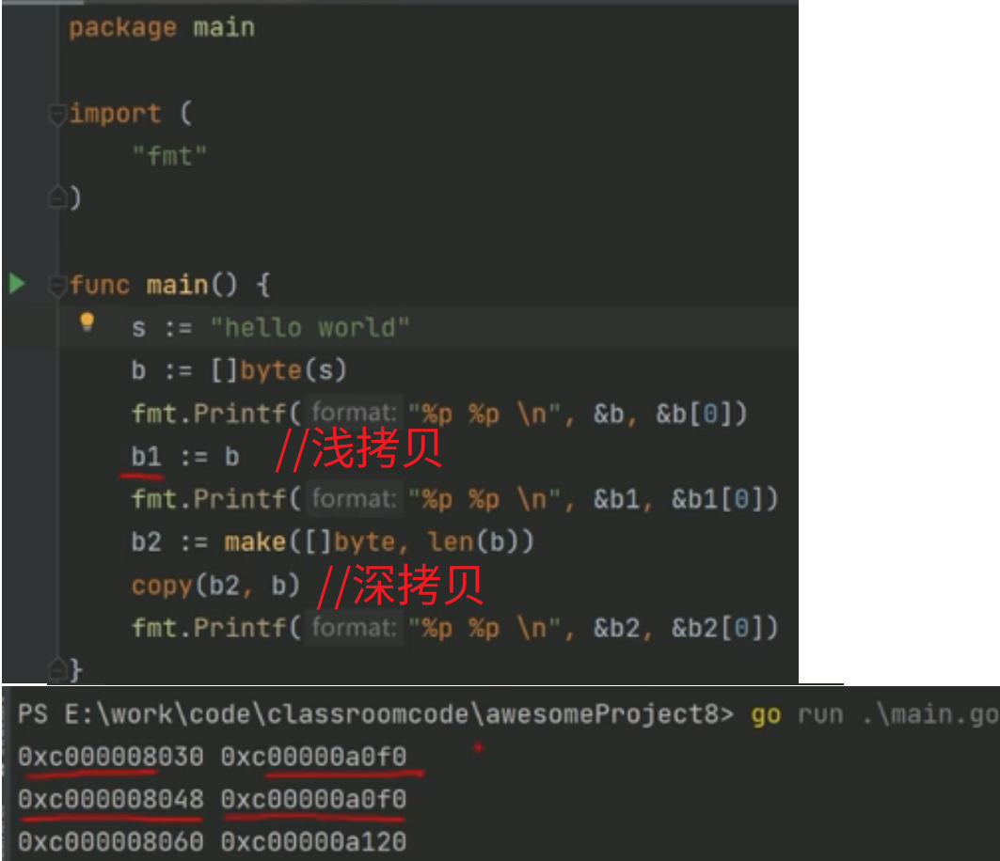

# 1.Go lang 的 make 和 new 的区别。

在 Go 语言中，`make` 和 `new` 是用于分配内存的两个关键字，主要区别如下：

### 1. **功能与适用类型**
- **`new`**  
  - **功能**：为类型分配零值内存空间，返回指向该类型的指针（`*Type`）。  
  - **适用类型**：所有类型（包括基础类型、结构体、指针等）。  

- **`make`**  
  - **功能**：专门为 **引用类型**（`slice`、`map`、`channel`）分配内存，并初始化内部数据结构（如长度、容量等），返回类型本身（非指针）。  
  - **适用类型**：仅 `slice`、`map`、`channel`。  

### 2. **返回值类型**
- `new(T)` 返回 `*T`（指针）。  
  ```go
  var p *int = new(int) // p 指向 int 类型的零值（0）
  ```

- `make(T)` 返回 `T`（类型本身）。  
  ```go
  var s []int = make([]int, 5) // s 是长度为 5 的切片，元素初始化为 0
  ```

### 3. **初始化行为**
- `new` 仅分配内存并填充零值，不涉及复杂初始化（如切片的底层数组、map 的哈希表等）。  
- `make` 会根据引用类型的特点进行初始化：  
  - **`slice`**：分配底层数组，设置长度和容量。  
  - **`map`**：创建哈希表结构。  
  - **`channel`**：创建通信管道。  

### 总结
- **`new`** 用于值类型的内存分配（返回指针），仅赋零值。  
- **`make`** 用于引用类型的初始化（返回类型本身），需指定长度、容量等参数。  

**示例**：  
```go
// new 示例
ptr := new(int)       // *int，值为 0
strPtr := new(string) // *string，值为 ""

// make 示例
slice := make([]int, 3, 5) // 长度 3，容量 5 的切片，元素为 0
m := make(map[string]int)  // 空 map
ch := make(chan int, 2)    // 缓冲容量为 2 的 channel
```

====================================================
# 2.slice 和数组 

## 2.1 slice地层原理
 

## 2.2 slice 和数组的区别

(1)切片是数组的封装( mq：引用)
(2)切片实际上是一个结构体。所以结构体赋值时，产生临时拷贝，所以才会涉及到 深拷贝和浅拷贝 的问题


## 2.2 深拷贝和浅拷贝 
 

## 2.3 参数为1个切片，函数内部可以修改其值吗
