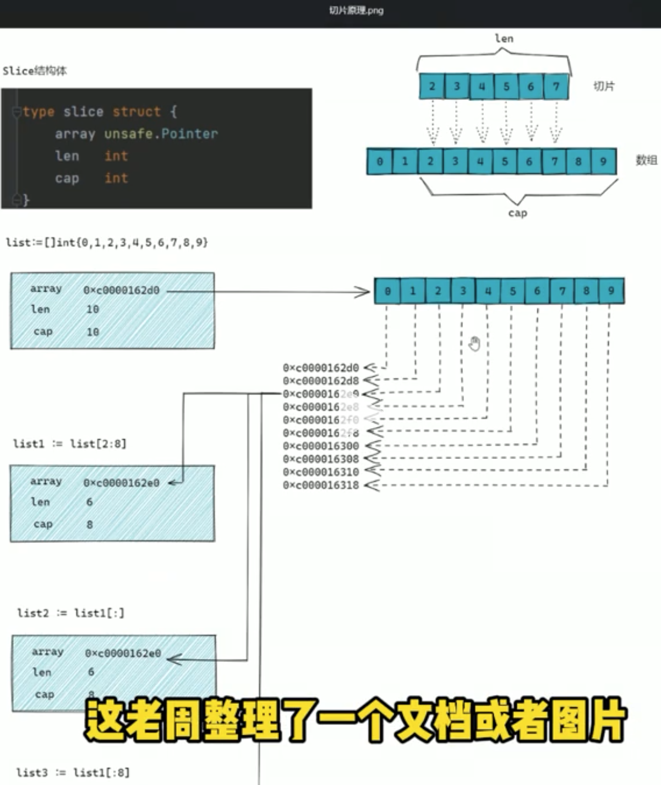
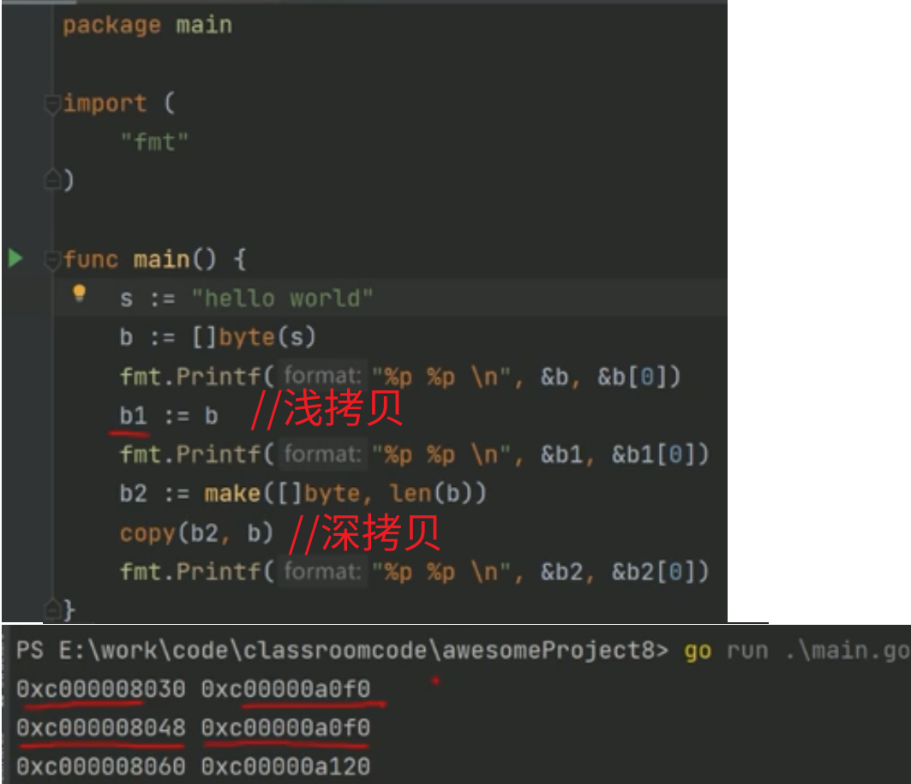

# 1.slice 和数组 

## 1.1 slice地层原理
 

## 1.2 slice 和数组的区别

(1)**切片是数组的封装**( mq：引用)
(2)**切片实际上是一个结构体**。所以结构体赋值时，产生临时拷贝，所以才会涉及到 深拷贝和浅拷贝 的问题

## 1.2 深拷贝和浅拷贝 
 

## 1.3 参数为1个切片，函数内部可以修改其值吗
====================================================
# 2.