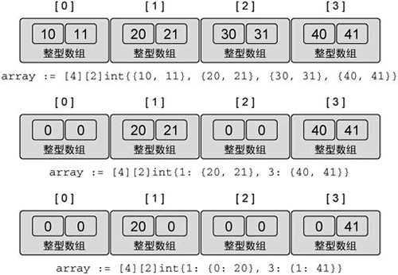
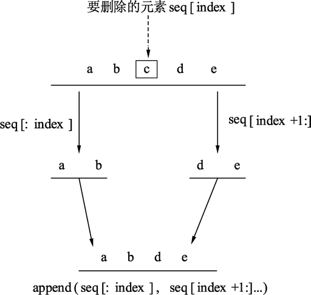
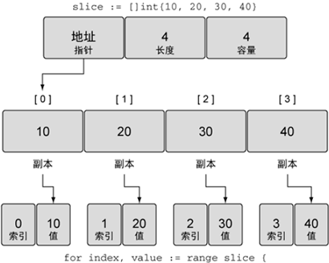
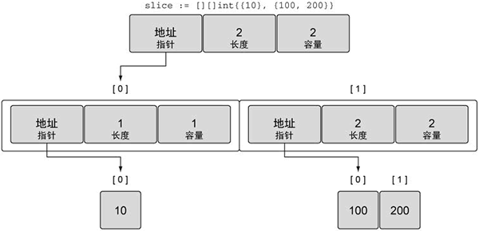
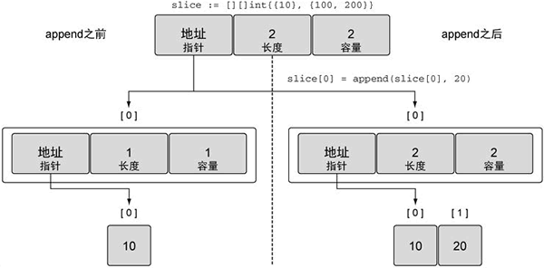
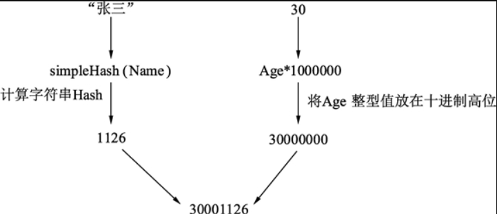
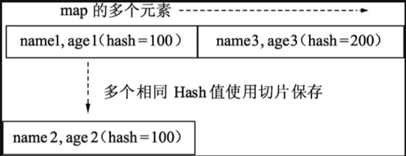
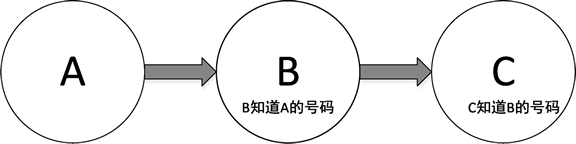

Go语言入门教程，Golang入门教程（非常详细）

<http://c.biancheng.net/golang/>

<https://www.kancloud.cn/imdszxs/golang/1535582>

<https://www.xinbaoku.com/archive/2DHvuPFr.html>

# 目录

[3.容器（container）](\l)

[3.1 数组 [4](#数组)](\l)
    [3.1.1Go语言数组的声明 [4](#go语言数组的声明)](\l)
    [3.1.2比较两个数组是否相等 [6](#比较两个数组是否相等)](\l)
    [3.1.3遍历数组——访问每一个数组元素](\l)
[3.2 多维数组 [7](#多维数组)](\l)


[3.3 切片 [9](#切片)](\l)
    [3.3.1从数组或切片生成新的切片](\l)
    [3.3.2直接声明新的切片](\l)
    [3.3.3使用 make() 函数构造切片](\l)
[3.4 使用append()为切片添加元素](\l)
[3.5 切片复制 [18](#切片复制)](\l)
[3.6 从切片中删除元素](\l)
[3.6.1从开头位置删除](\l)
[3.6.2从中间位置删除](\l)
[3.6.3从尾部删除](\l)
[3.7 range关键字](\l)
[3.8 多维切片 [28](#多维切片)](\l)
    [3.8+1 golang 切片和数组 作为函数参数](\l)
    [3.8+2 golang切片和数组 是值类型还是引用类型](\l)


[3.9 map（映射） [33](#map映射)](\l)
    [3.9.1map 概念](\l)
    [3.9.2map 容量](\l)
    [3.9.3用切片作为 map 的值 ](\l)
[3.10 遍历map](\l)
[3.11 map元素的删除和清空](\l)
    [3.11.1使用 delete() 函数从 map 中删除键值对](\l)
    [3.11.2清空 map 中的所有元素](\l)
[3.12 map的多键索引](\l)
    [3.12.1基于哈希值的多键索引及查询 ](\l)
    [3.12.2利用 map 特性的多键索引及查询 ](\l)
    [3.12.3总结](\l)
    [3.12+1 Golang的map是引用类型。](\l)
[3.13 sync.Map ](\l)


[3.14 list（列表）](\l)
    [3.14.1初始化列表](\l)
    [3.14.2在列表中插入元素](\l)
    [3.14.3从列表中删除元素](\l)
    [3.14.4遍历列表——访问列表的每一个元素](\l)


[3.15 nil：空值/零值 ](\l)
    [3.15.1 nil标识符是不能比较的](\l)
    [3.15.2 nil 不是关键字或保留字](\l)
    [3.15.3 nil 没有默认类型 ](\l)
    [3.15.4不同类型 nil 的指针是一样的](\l)
    [3.15.5不同类型的 nil 是不能比较的 ](\l)
    [3.15.6两个相同类型的 nil 值也可能无法比较](\l)
    [3.15.7nil 是 map、slice、pointer、channel、func、interface 的零值 ](\l)
    [3.15.8不同类型的 nil 值占用的内存大小可能是不一样的](\l)
[3.16 make和new关键字的区别及实现原理](\l)
    [3.16.1new ](\l)
    [3.16.2make](\l)
    [3.16.3实现原理](\l)
[总结 [68](#总结-1)](\l)
    [3.16+1 Golang make和new的区别及实现原理详解](\l)
    [3.16+1.1前言](\l)
    [3.16+1.2make的使用 ](\l)

# 3.容器（container）

变量在一定程度上能满足函数及代码要求。如果编写一些复杂算法、结构和逻辑，就需要更复杂的类型来实现。这类复杂类型一般情况下具有各种形式的存储和处理数据的功能，将它们称为“容器（container）”。  
  
在很多语言里，容器是以标准库的方式提供，你可以随时查看这些标准库的代码，了解如何创建，删除，维护内存。  
  
本章将以实用为目的，详细介绍数组、切片、映射，以及列表的增加、删除、修改和遍历的使用方法。本章既可以作为教程，也可以作为字典，以方便开发者日常的查询和应用。

**其它语言中的容器**

- C语言没有提供容器封装，开发者需要自己根据性能需求进行封装，或者使用第三方提供的容器。

- C++ 语言的容器通过标准库提供，如 vector 对应数组，list 对应双链表，map 对应映射等。

- C# 语言通过 .NET 框架提供，如 List 对应数组，LinkedList 对应双链表，Dictionary 对应映射。

- Lua 语言的 table 实现了数组和映射的功能，Lua 语言默认没有双链表支持。

## 3.1 [数组](http://c.biancheng.net/view/26.html)

Go语言数组详解

---------------------

数组是一个由固定长度的特定类型元素组成的序列，一个数组可以由零个或多个元素组成。因为数组的长度是固定的，所以在Go语言中很少直接使用数组。  
  
和数组对应的类型是 Slice（切片），Slice 是可以增长和收缩的动态序列，功能也更灵活，但是想要理解 slice 工作原理的话需要先理解数组，所以本节主要为大家讲解数组的使用，至于 Slice（切片）将在《Go语言切片》一节中为大家讲解。

### 3.1.1Go语言数组的声明

数组的声明语法如下：

var 数组变量名 \[元素数量\]Type

语法说明如下所示：

- 数组变量名：数组声明及使用时的变量名。

- 元素数量：数组的元素数量，可以是一个表达式，但最终通过编译期计算的结果必须是整型数值，元素数量不能含有到运行时才能确认大小的数值。

- Type：可以是任意基本类型，包括数组本身，类型为数组本身时，可以实现多维数组。

数组的每个元素都可以通过索引下标来访问，索引下标的范围是从 0 开始到数组长度减 1 的位置，内置函数 len() 可以返回数组中元素的个数。

1.  var a \[3\]int // 定义三个整数的数组

2.  fmt.Println(a\[0\]) // 打印第一个元素

3.  fmt.Println(a\[len(a)-1\]) // 打印最后一个元素

4.  

5.  // 打印索引和元素

6.  for i, v := range a {

7.  fmt.Printf("%d %d\n", i, v)

8.  }

9.  

10. // 仅打印元素

11. for \_, v := range a {

12. fmt.Printf("%d\n", v)

13. }

默认情况下，数组的每个元素都会被初始化为元素类型对应的零值，对于数字类型来说就是 0，同时也可以使用数组字面值语法，用一组值来初始化数组：

1.  var q \[3\]int = \[3\]int{1, 2, 3}

2.  var r \[3\]int = \[3\]int{1, 2}

3.  fmt.Println(r\[2\]) // "0"

在数组的定义中，如果在数组长度的位置出现“...”省略号，则表示数组的长度是根据初始化值的个数来计算，因此，上面数组 q 的定义可以简化为：

1.  q := \[...\]int{1, 2, 3}

2.  fmt.Printf("%T\n", q) // "\[3\]int"

数组的长度是数组类型的一个组成部分，因此 \[3\]int 和 \[4\]int 是两种不同的数组类型，数组的长度必须是常量表达式，因为数组的长度需要在编译阶段确定。

1.  q := \[3\]int{1, 2, 3}

2.  q = \[4\]int{1, 2, 3, 4} // 编译错误：无法将 \[4\]int 赋给 \[3\]int

### 3.1.2比较两个数组是否相等

如果两个数组类型相同（包括数组的长度，数组中元素的类型）的情况下，我们可以直接通过较运算符（==和!=）来判断两个数组是否相等，只有当两个数组的所有元素都是相等的时候数组才是相等的，不能比较两个类型不同的数组，否则程序将无法完成编译。

1.  a := \[2\]int{1, 2}

2.  b := \[...\]int{1, 2}

3.  c := \[2\]int{1, 3}

4.  fmt.Println(a == b, a == c, b == c) // "true false false"

5.  d := \[3\]int{1, 2}

6.  fmt.Println(a == d) // 编译错误：无法比较 \[2\]int == \[3\]int

### 3.1.3遍历数组——访问每一个数组元素

遍历数组也和遍历切片类似，代码如下所示：

1.  var team \[3\]string

2.  team\[0\] = "hammer"

3.  team\[1\] = "soldier"

4.  team\[2\] = "mum"

5.  

6.  for k, v := range team {

7.  fmt.Println(k, v)

8.  }

代码输出结果：

0 hammer  
1 soldier  
2 mum

代码说明如下：

- 第 6 行，使用 for 循环，遍历 team 数组，遍历出的键 k 为数组的索引，值 v 为数组的每个元素值。

- 第 7 行，将每个键值打印出来。

## 3.2 [多维数组](http://c.biancheng.net/view/4117.html) 

Go语言多维数组简述

------------------------------

Go语言中允许使用多维数组，因为数组属于值类型，所以多维数组的所有维度都会在创建时自动初始化零值，多维数组尤其适合管理具有父子关系或者与坐标系相关联的数据。

声明多维数组的语法如下所示：

var array_name \[size1\]\[size2\]...\[sizen\] array_type

其中，array_name 为数组的名字，array_type 为数组的类型，size1、size2 等等为数组每一维度的长度。  
  
结合上一节《Go语言数组》中所学到的知识，下面以二维数组为例来简单讲解一下多维数组的使用。  
  
二维数组是最简单的多维数组，二维数组本质上是由多个一维数组组成的。  
  
【示例 1】声明二维数组

1.  // 声明一个二维整型数组，两个维度的长度分别是 4 和 2

2.  var array \[4\]\[2\]int

3.  // 使用数组字面量来声明并初始化一个二维整型数组

4.  array = \[4\]\[2\]int{{10, 11}, {20, 21}, {30, 31}, {40, 41}}

5.  // 声明并初始化数组中索引为 1 和 3 的元素

6.  array = \[4\]\[2\]int{1: {20, 21}, 3: {40, 41}}

7.  // 声明并初始化数组中指定的元素

8.  array = \[4\]\[2\]int{1: {0: 20}, 3: {1: 41}}

下图展示了上面示例中声明的二维数组在每次声明并初始化后包含的值。

  
图：二维数组及其外层数组和内层数组的值

为了访问单个元素，需要反复组合使用\[ \]方括号，如下所示。  
  
【示例 2】为二维数组的每个元素赋值

1.  // 声明一个 2×2 的二维整型数组

2.  var array \[2\]\[2\]int

3.  // 设置每个元素的整型值

4.  array\[0\]\[0\] = 10

5.  array\[0\]\[1\] = 20

6.  array\[1\]\[0\] = 30

7.  array\[1\]\[1\] = 40

只要类型一致，就可以将多维数组互相赋值，如下所示，多维数组的类型包括每一维度的长度以及存储在元素中数据的类型。  
  
【示例 3】同样类型的多维数组赋值

1.  // 声明两个二维整型数组

2.  var array1 \[2\]\[2\]int

3.  var array2 \[2\]\[2\]int

4.  // 为array2的每个元素赋值

5.  array2\[0\]\[0\] = 10

6.  array2\[0\]\[1\] = 20

7.  array2\[1\]\[0\] = 30

8.  array2\[1\]\[1\] = 40

9.  // 将 array2 的值复制给 array1

10. array1 = array2

因为数组中每个元素都是一个值，所以可以独立复制某个维度，如下所示。  
  
【示例 4】使用索引为多维数组赋值

1.  // 将 array1 的索引为 1 的维度复制到一个同类型的新数组里

2.  var array3 \[2\]int = array1\[1\]

3.  // 将数组中指定的整型值复制到新的整型变量里

4.  var value int = array1\[1\]\[0\]

## 3.3 [切片](http://c.biancheng.net/view/27.html)

Go语言切片详解

------------------

切片（slice）是对数组的一个连续片段的引用，所以**切片是一个引用类型**（因此更类似于 C/C++ 中的数组类型，或者 Python 中的 list 类型），这个片段可以是整个数组，也可以是由起始和终止索引标识的一些项的子集，**需要注意的是，终止索引标识的项不包括在切片内**。

Go语言中切片的内部结构包含地址、大小和容量，切片一般用于快速地操作一块数据集合，如果将数据集合比作切糕的话，切片就是你要的“那一块”，切的过程包含从哪里开始（切片的起始位置）及切多大（切片的大小），容量可以理解为装切片的口袋大小，如下图所示。

  
图：切片结构和内存分配

### 3.3.1从数组或切片生成新的切片

切片默认指向一段连续内存区域，可以是数组，也可以是切片本身。  
  
从连续内存区域生成切片是常见的操作，格式如下：

slice \[开始位置 : 结束位置\]

语法说明如下：

- slice：表示目标切片对象；

- 开始位置：对应目标切片对象的索引；

- 结束位置：对应目标切片的结束索引。

从数组生成切片，代码如下：

1.  var a = \[3\]int{1, 2, 3}

2.  fmt.Println(a, a\[1:2\])

其中 a 是一个拥有 3 个整型元素的数组，被初始化为数值 1 到 3，使用 a\[1:2\] 可以生成一个新的切片，代码运行结果如下：

\[1 2 3\]  \[2\]

其中 \[2\] 就是 a\[1:2\] 切片操作的结果。  
  
从数组或切片生成新的切片拥有如下特性：

- 取出的元素数量为：结束位置 - 开始位置；

- 取出元素不包含结束位置对应的索引，切片最后一个元素使用 slice\[len(slice)\] 获取；

- 当缺省开始位置时，表示从连续区域开头到结束位置；

- 当缺省结束位置时，表示从开始位置到整个连续区域末尾；

- 两者同时缺省时，与切片本身等效；

- 两者同时为 0 时，等效于空切片，一般用于切片复位。

根据索引位置取切片 slice 元素值时，取值范围是（0～len(slice)-1），超界会报运行时错误，生成切片时，结束位置可以填写 len(slice) 但不会报错。  
  
下面通过实例来熟悉切片的特性。

#### 1) 从指定范围中生成切片

切片和数组密不可分，如果将数组理解为一栋办公楼，那么切片就是把不同的连续楼层出租给使用者，出租的过程需要选择开始楼层和结束楼层，这个过程就会生成切片，示例代码如下：

1.  var highRiseBuilding \[30\]int

2.  

3.  for i := 0; i \< 30; i++ {

4.  highRiseBuilding\[i\] = i + 1

5.  }

6.  

7.  // 区间

8.  fmt.Println(highRiseBuilding\[10:15\])

9.  

10. // 中间到尾部的所有元素

11. fmt.Println(highRiseBuilding\[20:\])

12. 

13. // 开头到中间指定位置的所有元素

14. fmt.Println(highRiseBuilding\[:2\])

代码输出如下：

\[11 12 13 14 15\]  
\[21 22 23 24 25 26 27 28 29 30\]  
\[1 2\]

代码中构建了一个 30 层的高层建筑，数组的元素值从 1 到 30，分别代表不同的独立楼层，输出的结果是不同的租售方案。  
  
代码说明如下：

- 第 8 行，尝试出租一个区间楼层。

- 第 11 行，出租 20 层以上。

- 第 14 行，出租 2 层以下，一般是商用铺面。

切片有点像C语言里的指针，指针可以做运算，但代价是内存操作越界，切片在指针的基础上增加了大小，约束了切片对应的内存区域，切片使用中无法对切片内部的地址和大小进行手动调整，因此切片比指针更安全、强大。

#### 2) 表示原有的切片

生成切片的格式中，当开始和结束位置都被忽略时，生成的切片将表示和原切片一致的切片，并且生成的切片与原切片在数据内容上也是一致的，代码如下：

1.  a := \[\]int{1, 2, 3}

2.  fmt.Println(a\[:\])

a 是一个拥有 3 个元素的切片，将 a 切片使用 a\[:\] 进行操作后，得到的切片与 a 切片一致，代码输出如下：

\[1 2 3\]

#### 3) 重置切片，清空拥有的元素

把切片的开始和结束位置都设为 0 时，生成的切片将变空，代码如下：

1.  a := \[\]int{1, 2, 3}

2.  fmt.Println(a\[0:0\])

代码输出如下：

\[\]

### 3.3.2直接声明新的切片

除了可以从原有的数组或者切片中生成切片外，也可以声明一个新的切片，每一种类型都可以拥有其切片类型，表示多个相同类型元素的连续集合，因此切片类型也可以被声明，切片类型声明格式如下：

var name \[\]Type

其中 name 表示切片的变量名，Type 表示切片对应的元素类型。  
  
下面代码展示了切片声明的使用过程：

1.  // 声明字符串切片

2.  var strList \[\]string

3.  

4.  // 声明整型切片

5.  var numList \[\]int

6.  

7.  // 声明一个空切片

8.  var numListEmpty = \[\]int{}

9.  

10. // 输出3个切片

11. fmt.Println(strList, numList, numListEmpty)

12. 

13. // 输出3个切片大小

14. fmt.Println(len(strList), len(numList), len(numListEmpty))

15. 

16. // 切片判定空的结果

17. fmt.Println(strList == nil)

18. fmt.Println(numList == nil)

19. fmt.Println(numListEmpty == nil)

代码输出结果：

\[\] \[\] \[\]  
0 0 0  
true  
true  
false

代码说明如下：

- 第 2 行，声明一个字符串切片，切片中拥有多个字符串。

- 第 5 行，声明一个整型切片，切片中拥有多个整型数值。

- 第 8 行，将 numListEmpty 声明为一个整型切片，本来会在{}中填充切片的初始化元素，这里没有填充，所以切片是空的，但是此时的 numListEmpty 已经被分配了内存，只是还没有元素。

- 第 11 行，切片均没有任何元素，3 个切片输出元素内容均为空。

- 第 14 行，没有对切片进行任何操作，strList 和 numList 没有指向任何数组或者其他切片。

- 第 17 行和第 18 行，声明但未使用的切片的默认值是 nil，strList 和 numList 也是 nil，所以和 nil 比较的结果是 true。

- 第 19 行，numListEmpty 已经被分配到了内存，但没有元素，因此和 nil 比较时是 false。

**切片是动态结构，只能与 nil 判定相等，不能互相判定相等。**声明新的切片后，可以使用** append() **函数向切片中添加元素。

### 3.3.3使用 make() 函数构造切片

如果需要动态地创建一个切片，可以使用 make() 内建函数，格式如下：

make( \[\]Type, size, cap )

其中 Type 是指切片的元素类型，size 指的是为这个类型分配多少个元素，cap 为预分配的元素数量，这个值设定后不影响 size，只是能提前分配空间，降低多次分配空间造成的性能问题。  
  
示例如下：

1.  a := make(\[\]int, 2)

2.  b := make(\[\]int, 2, 10)

3.  

4.  fmt.Println(a, b)

5.  fmt.Println(len(a), len(b))

代码输出如下：

\[0 0\] \[0 0\]  
2 2

其中 a 和 b 均是预分配 2 个元素的切片，只是 b 的内部存储空间已经分配了 10 个，但实际使用了 2 个元素。  
  
容量不会影响当前的元素个数，因此 a 和 b 取 len 都是 2。

#### 温馨提示

使用 **make() 函数生成的切片一定发生了内存分配操作**，但**给定开始与结束位置（包括切片复位）的切片**只是将新的切片结构指向已经分配好的内存区域，设定开始与结束位置，**不会发生内存分配操作**。

## 3.4 [使用append()为切片添加元素](http://c.biancheng.net/view/28.html)

Go语言的内建函数 append() 可以为切片动态添加元素，代码如下所示：

1.  var a \[\]int

2.  a = append(a, 1) // 追加1个元素

3.  a = append(a, 1, 2, 3) // 追加多个元素, 手写解包方式

4.  a = append(a, \[\]int{1,2,3}...) // 追加一个切片, 切片需要解包

不过需要注意的是，在使用 append() 函数为切片动态添加元素时，如果空间不足以容纳足够多的元素，切片就会进行**“扩容”**，此时新切片的长度会发生改变。  
  
**切片在扩容时**，容量的扩展规律是**按容量的 2 倍数进行扩充**，例如 1、2、4、8、16……，代码如下：

1.  var numbers \[\]int

2.  

3.  for i := 0; i \< 10; i++ {

4.  numbers = append(numbers, i)

5.  fmt.Printf("len: %d cap: %d pointer: %p\n", len(numbers), cap(numbers), numbers)

6.  }

代码输出如下：

len: 1  cap: 1 pointer: 0xc0420080e8  
len: 2  cap: 2 pointer: 0xc042008150  
len: 3  cap: 4 pointer: 0xc04200e320  
len: 4  cap: 4 pointer: 0xc04200e320  
len: 5  cap: 8 pointer: 0xc04200c200  
len: 6  cap: 8 pointer: 0xc04200c200  
len: 7  cap: 8 pointer: 0xc04200c200  
len: 8  cap: 8 pointer: 0xc04200c200  
len: 9  cap: 16 pointer: 0xc042074000  
len: 10  cap: 16 pointer: 0xc042074000

代码说明如下：

- 第 1 行，声明一个整型切片。

- 第 4 行，循环向 numbers 切片中添加 10 个数。

- 第 5 行，打印输出切片的长度、容量和指针变化，使用函数 len() 查看切片拥有的元素个数，使用函数 cap() 查看切片的容量情况。

通过查看代码输出，可以发现一个有意思的规律：切片长度 len 并不等于切片的容量 cap。  
  
往一个切片中不断添加元素的过程，类似于公司搬家，公司发展初期，资金紧张，人员很少，所以只需要很小的房间即可容纳所有的员工，随着业务的拓展和收入的增加就需要扩充工位，但是办公地的大小是固定的，无法改变，因此公司只能选择搬家，每次搬家就需要将所有的人员转移到新的办公点。

- 员工和工位就是切片中的元素。

- 办公地就是分配好的内存。

- 搬家就是重新分配内存。

- 无论搬多少次家，公司名称始终不会变，代表外部使用切片的变量名不会修改。

- 由于搬家后地址发生变化，因此内存“地址”也会有修改。

除了在切片的尾部追加，我们还可以在切片的开头添加元素：

1.  var a = \[\]int{1,2,3}

2.  a = append(\[\]int{0}, a...) // 在开头添加1个元素

3.  a = append(\[\]int{-3,-2,-1}, a...) // 在开头添加1个切片

在切片开头添加元素一般都会导致**内存的重新分配**，而且会导致已有**元素**全部被**复制** 1 次，因此，**从切片的开头添加元素的性能要比从尾部追加元素的性能差很多**。  
  
因为 append 函数返回新切片的特性，所以切片也支持**链式操作**，我们可以将多个 append 操作组合起来，实现**在切片中间插入元素**：

1.  var a \[\]int

2.  a = append(a\[:i\], append(\[\]int{x}, a\[i:\]...)...) // 在第i个位置插入x

3.  a = append(a\[:i\], append(\[\]int{1,2,3}, a\[i:\]...)...) // 在第i个位置插入切片

每个添加操作中的第二个 append 调用都会创建一个临时切片，并将 a\[i:\] 的内容复制到新创建的切片中，然后将临时创建的切片再追加到 a\[:i\] 中。

## 3.5 [切片复制](http://c.biancheng.net/view/29.html)

Go语言copy()：切片复制（切片拷贝）

---------------------------

Go语言的内置函数 copy() 可以将一个数组切片复制到另一个数组切片中，如果加入的两个数组切片不一样大，就会按照其中较小的那个数组切片的元素个数进行复制。

copy() 函数的使用格式如下：

copy( destSlice, srcSlice \[\]T) int

其中 srcSlice 为数据来源切片，destSlice 为复制的目标（也就是将 srcSlice 复制到 destSlice），目标切片必须分配过空间且足够承载复制的元素个数，并且来源和目标的类型必须一致，copy() 函数的返回值表示实际发生复制的元素个数。  
  
下面的代码展示了使用 copy() 函数将一个切片复制到另一个切片的过程：

1.  slice1 := \[\]int{1, 2, 3, 4, 5}

2.  slice2 := \[\]int{5, 4, 3}

3.  copy(slice2, slice1) // 只会复制slice1的前3个元素到slice2中

4.  copy(slice1, slice2) // 只会复制slice2的3个元素到slice1的前3个位置

虽然通过循环复制切片元素更直接，不过内置的 copy() 函数使用起来更加方便，copy() 函数的第一个参数是要复制的目标 slice，第二个参数是源 slice，两个 slice 可以共享同一个底层数组，甚至有重叠也没有问题。  
  
【示例】通过代码演示对切片的引用和复制操作后对切片元素的影响。

1.  package main

2.  

3.  import "fmt"

4.  

5.  func main() {

6.  

7.  // 设置元素数量为1000

8.  const elementCount = 1000

9.  

10. // 预分配足够多的元素切片

11. srcData := make(\[\]int, elementCount)

12. 

13. // 将切片赋值

14. for i := 0; i \< elementCount; i++ {

15. srcData\[i\] = i

16. }

17. 

18. // 引用切片数据

19. refData := srcData

20. 

21. // 预分配足够多的元素切片

22. copyData := make(\[\]int, elementCount)

23. // 将数据复制到新的切片空间中

24. copy(copyData, srcData)

25. 

26. // 修改原始数据的第一个元素

27. srcData\[0\] = 999

28. 

29. // 打印引用切片的第一个元素

30. fmt.Println(refData\[0\])

31. 

32. // 打印复制切片的第一个和最后一个元素

33. fmt.Println(copyData\[0\], copyData\[elementCount-1\])

34. 

35. // 复制原始数据从4到6(不包含)

36. copy(copyData, srcData\[4:6\])

37. 

38. for i := 0; i \< 5; i++ {

39. fmt.Printf("%d ", copyData\[i\])

40. }

41. }

代码说明如下：

- 第 8 行，定义元素总量为 1000。

- 第 11 行，预分配拥有 1000 个元素的整型切片，这个切片将作为原始数据。

- 第 14～16 行，将 srcData 填充 0～999 的整型值。

- 第 19 行，将 refData 引用 srcData，切片不会因为等号操作进行元素的复制。

- 第 22 行，预分配与 srcData 等大（大小相等）、同类型的切片 copyData。

- 第 24 行，使用 copy() 函数将原始数据复制到 copyData 切片空间中。

- 第 27 行，修改原始数据的第一个元素为 999。

- 第 30 行，引用数据的第一个元素将会发生变化。

- 第 33 行，打印复制数据的首位数据，由于数据是复制的，因此不会发生变化。

- 第 36 行，将 srcData 的局部数据复制到 copyData 中。

- 第 38～40 行，打印复制局部数据后的 copyData 元素。

## 3.6 [从切片中删除元素](http://c.biancheng.net/view/30.html)

Go语言并没有对删除切片元素提供专用的语法或者接口，需要使用切片本身的特性来删除元素，根据要删除元素的位置有三种情况，分别是从开头位置删除、从中间位置删除和从尾部删除，其中删除切片尾部的元素速度最快。

### 3.6.1从开头位置删除

删除开头的元素可以直接移动数据指针：

1.  a = \[\]int{1, 2, 3}

2.  a = a\[1:\] // 删除开头1个元素

3.  a = a\[N:\] // 删除开头N个元素

也可以不移动数据指针，但是将后面的数据向开头移动，可以用 append 原地完成（所谓原地完成是指在原有的切片数据对应的内存区间内完成，不会导致内存空间结构的变化）：

1.  a = \[\]int{1, 2, 3}

2.  a = append(a\[:0\], a\[1:\]...) // 删除开头1个元素

3.  a = append(a\[:0\], a\[N:\]...) // 删除开头N个元素

还可以用 copy() 函数来删除开头的元素：

1.  a = \[\]int{1, 2, 3}

2.  a = a\[:copy(a, a\[1:\])\] // 删除开头1个元素

3.  a = a\[:copy(a, a\[N:\])\] // 删除开头N个元素

### 3.6.2从中间位置删除

对于删除中间的元素，需要对剩余的元素进行一次整体挪动，同样可以用 append 或 copy 原地完成：

1.  a = \[\]int{1, 2, 3, ...}

2.  a = append(a\[:i\], a\[i+1:\]...) // 删除中间1个元素

3.  a = append(a\[:i\], a\[i+N:\]...) // 删除中间N个元素

4.  a = a\[:i+copy(a\[i:\], a\[i+1:\])\] // 删除中间1个元素

5.  a = a\[:i+copy(a\[i:\], a\[i+N:\])\] // 删除中间N个元素

### 3.6.3从尾部删除

1.  a = \[\]int{1, 2, 3}

2.  a = a\[:len(a)-1\] // 删除尾部1个元素

3.  a = a\[:len(a)-N\] // 删除尾部N个元素

删除开头的元素和删除尾部的元素都可以认为是删除中间元素操作的特殊情况，下面来看一个示例。  
  
【示例】删除切片指定位置的元素。

1.  package main

2.  

3.  import "fmt"

4.  

5.  func main() {

6.      seq := \[\]string{"a", "b", "c", "d", "e"}

7.  

8.      // 指定删除位置

9.      index := 2

10. 

11.     // 查看删除位置之前的元素和之后的元素

12.     fmt.Println(seq\[:index\], seq\[index+1:\])

13. 

14.     // 将删除点前后的元素连接起来

15.     seq = append(seq\[:index\], seq\[index+1:\]...)

16. 

17.     fmt.Println(seq)

18. }

代码输出结果：

\[a b\] \[d e\]  
\[a b d e\]

代码说明如下：

- 第 1 行，声明一个整型切片，保存含有从 a 到 e 的字符串。

- 第 4 行，为了演示和讲解方便，使用 index 变量保存需要删除的元素位置。

- 第 7 行，seq\[:index\] 表示的就是被删除元素的前半部分，值为 \[1 2\]，seq\[index+1:\] 表示的是被删除元素的后半部分，值为 \[4 5\]。

- 第 10 行，使用 append() 函数将两个切片连接起来。

- 第 12 行，输出连接好的新切片，此时，索引为 2 的元素已经被删除。

代码的删除过程可以使用下图来描述。

  
图：切片删除元素的操作过程

Go语言中删除切片元素的本质是，以被删除元素为分界点，将前后两个部分的内存重新连接起来。

#### 3.6.3.1提示

连续容器的元素删除无论在任何语言中，都要将删除点前后的元素移动到新的位置，随着元素的增加，这个过程将会变得极为耗时，因此，当业务需要大量、频繁地从一个切片中删除元素时，如果对性能要求较高的话，就需要考虑更换其他的容器了（如双链表等能快速从删除点删除元素）。

## 3.7 [range关键字](http://c.biancheng.net/view/4118.html)

Go语言range关键字：循环迭代切片

----------------------------------------------------

通过前面的学习我们了解到切片其实就是多个相同类型元素的连续集合，既然切片是一个集合，那么我们就可以迭代其中的元素，Go语言有个特殊的关键字 range，它可以配合关键字 for 来迭代切片里的每一个元素，如下所示：

1.  // 创建一个整型切片，并赋值

2.  slice := \[\]int{10, 20, 30, 40}

3.  // 迭代每一个元素，并显示其值

4.  for index, value := range slice {

5.  fmt.Printf("Index: %d Value: %d\n", index, value)

6.  }

第 4 行中的 index 和 value 分别用来接收 range 关键字返回的切片中每个元素的索引和值，这里的 index 和 value 不是固定的，读者也可以定义成其它的名字。  
  
关于 for 的详细使用我们将在下一章《Go语言流程控制》中为大家详细介绍。  
  
上面代码的输出结果为：

Index: 0 Value: 10  
Index: 1 Value: 20  
Index: 2 Value: 30  
Index: 3 Value: 40

当迭代切片时，关键字 range 会返回两个值，第一个值是当前迭代到的索引位置，第二个值是该位置对应元素值的一份副本，如下图所示。

  
图：使用 range 迭代切片会创建每个元素的副本

需要强调的是，range 返回的是每个元素的副本，而不是直接返回对该元素的引用，如下所示。  
  
【示例 1】range 提供了每个元素的副本

1.  // 创建一个整型切片，并赋值

2.  slice := \[\]int{10, 20, 30, 40}

3.  // 迭代每个元素，并显示值和地址

4.  for index, value := range slice {

5.  fmt.Printf("Value: %d Value-Addr: %X ElemAddr: %X\n", value, &value, &slice\[index\])

6.  }

输出结果为：

Value: 10 Value-Addr: 10500168 ElemAddr: 1052E100  
Value: 20 Value-Addr: 10500168 ElemAddr: 1052E104  
Value: 30 Value-Addr: 10500168 ElemAddr: 1052E108  
Value: 40 Value-Addr: 10500168 ElemAddr: 1052E10C

因为迭代返回的变量是一个在迭代过程中根据切片依次赋值的新变量，所以 value 的地址总是相同的，要想获取每个元素的地址，需要使用切片变量和索引值（例如上面代码中的 &slice\[index\]）。  
  
如果不需要索引值，也可以使用下划线_来忽略这个值，代码如下所示。  
  
【示例 2】使用空白标识符（下划线）来忽略索引值

1.  // 创建一个整型切片，并赋值

2.  slice := \[\]int{10, 20, 30, 40}

3.  // 迭代每个元素，并显示其值

4.  for \_, value := range slice {

5.  fmt.Printf("Value: %d\n", value)

6.  }

输出结果为：

Value: 10  
Value: 20  
Value: 30  
Value: 40

关键字 range 总是会从切片头部开始迭代。如果想对迭代做更多的控制，则可以使用传统的 for 循环，代码如下所示。  
  
【示例 3】使用传统的 for 循环对切片进行迭代

1.  // 创建一个整型切片，并赋值

2.  slice := \[\]int{10, 20, 30, 40}

3.  // 从第三个元素开始迭代每个元素

4.  for index := 2; index \< len(slice); index++ {

5.  fmt.Printf("Index: %d Value: %d\n", index, slice\[index\])

6.  }

输出结果为：

Index: 2 Value: 30  
Index: 3 Value: 40

在前面几节的学习中我们了解了两个特殊的内置函数 len() 和 cap()，可以用于处理数组、切片和通道，对于切片，函数 len() 可以返回切片的长度，函数 cap() 可以返回切片的容量，在上面的示例中，使用到了函数 len() 来控制循环迭代的次数。  
  
当然，range 关键字不仅仅可以用来遍历切片，它还可以用来遍历数组、字符串、map 或者通道等，这些我们将在后面的学习中详细介绍。

## 3.8 [多维切片](http://c.biancheng.net/view/4119.html)

Go语言多维切片简述

------------------------------

Go语言中同样允许使用多维切片，声明一个多维数组的语法格式如下：

var sliceName \[\]\[\]...\[\]sliceType

其中，sliceName 为切片的名字，sliceType为切片的类型，每个\[ \]代表着一个维度，切片有几个维度就需要几个\[ \]。  
  
下面以二维切片为例，声明一个二维切片并赋值，代码如下所示。

1.  //声明一个二维切片

2.  var slice \[\]\[\]int

3.  //为二维切片赋值

4.  slice = \[\]\[\]int{{10}, {100, 200}}

上面的代码也可以简写为下面的样子。

1.  // 声明一个二维整型切片并赋值

2.  slice := \[\]\[\]int{{10}, {100, 200}}

上面的代码中展示了一个包含两个元素的外层切片，同时每个元素包又含一个内层的整型切片，切片 slice 的值如下图所示。

  
图：整型切片的切片的值

通过上图可以看到外层的切片包括两个元素，每个元素都是一个切片，第一个元素中的切片使用单个整数 10 来初始化，第二个元素中的切片包括两个整数，即 100 和 200。  
  
这种组合可以让用户创建非常复杂且强大的数据结构，前面介绍过的关于内置函数 append() 的规则也可以应用到组合后的切片上，如下所示。  
  
【示例】组合切片的切片

1.  // 声明一个二维整型切片并赋值

2.  slice := \[\]\[\]int{{10}, {100, 200}}

3.  // 为第一个切片追加值为 20 的元素

4.  slice\[0\] = append(slice\[0\], 20)

Go语言里使用 append() 函数处理追加的方式很简明，先增长切片，再将新的整型切片赋值给外层切片的第一个元素，当上面代码中的操作完成后，再将切片复制到外层切片的索引为 0 的元素，如下图所示。

  
图：append 操作之后外层切片索引为 0 的元素的布局

即便是这么简单的多维切片，操作时也会涉及众多的布局和值，在函数间这样传递数据结构会很复杂，不过切片本身结构很简单，可以用很小的成本在函数间传递。

## 3.8+1 golang 切片和数组 作为函数参数  

在Go语言中，数组和切片（切片本身就是引用类型）可以作为函数的参数。以下是一些示例。

**1.使用数组作为函数参数：**

```go
package main

import "fmt"
func printArray(arr [5]int) {
    fmt.Println(arr)
}

func main() {
    arr := [5]int{1, 2, 3, 4, 5}
    printArray(arr)
}
```
在上述代码中，printArray函数接收一个类型为[5]int的数组。当我们在main函数中调用printArray函数时，我们传递了一个[5]int类型的数组。

**2.使用切片作为函数参数：**
```go
package main

import "fmt"

func printSlice(slc []int) {
    fmt.Println(slc)
}

func main() {
    slc := []int{1, 2, 3, 4, 5}
    printSlice(slc)
}
```

在上述代码中，printSlice函数接收一个类型为[]int的切片。当我们在main函数中调用printSlice函数时，我们传递了一个[]int类型的切片。

**3.使用...操作符来传递切片中的所有元素：**
```go
package main

import "fmt"

func printSliceElements(elems ...int) {
    fmt.Println(elems)
}

func main() {
    slc := []int{1, 2, 3, 4, 5}
    printSliceElements(slc...)
}
```
在上述代码中，printSliceElements函数接收一个类型为...int的参数。这意味着我们可以传递任意数量的int类型的参数。当我们在main函数中调用printSliceElements函数时，我们使用了slc...语法，这将会把slc切片中的所有元素作为单独的参数传递给函数。

**4.使用指针接收数组或切片：**

package main

import "fmt"

func modifyArray(arr *[5]int) {
    (*arr)[0] = 10
}

func modifySlice(slc *[]int) {
    (*slc)[0] = 10
}

func main() {
    arr := [5]int{1, 2, 3, 4, 5}
    slc := []int{1, 2, 3, 4, 5}
    modifyArray(&arr)
    modifySlice(&slc)
    fmt.Println(arr)
    fmt.Println(slc)
}

在上述代码中，modifyArray函数接收一个指向[5]int类型的指针，而modifySlice函数接收一个指向[]int类型的指针。当我们在main函数中调用这些函数时，我们传递了数组和切片的地址。这允许函数内部对原始数组或切片进行修改。

## 3.8+2 golang切片和数组 是值类型还是引用类型

百度ai智能回答：

在 Go 语言中，数组是值类型，而切片（slice）则是引用类型。

数组是固定长度的数据结构，而切片则是可以动态增长和缩减的序列。由于数组的固定长度特性，它在内存中是连续分配的，而切片则是一个包装了底层数组的结构，包含指向底层数组的指针，长度和容量。

因此，当你将一个数组赋值给另一个变量时，实际上是创建了一个新的数组，两个数组之间是完全独立的。而当你将一个切片赋值给另一个切片时，实际上是复制了一个引用，两个切片会指向相同的底层数组，直到你对其中一个切片进行扩展造成底层数组的重新分配。

下面是一些示例代码来说明这个区别：
```go
// 数组是值类型
var array1 [5]int = [5]int{1, 2, 3, 4, 5}
var array2 = array1 // array2 是 array1 的一个副本
array2[0] = 100 // 这不会影响 array1

// 切片是引用类型
var slice1 []int = []int{1, 2, 3, 4, 5}
var slice2 = slice1 // slice2 指向 slice1 的底层数组
slice2[0] = 100 // 这会影响 slice1，因为它们指向相同的底层数组
```
在切片被复制给另一个变量时，如果你希望它们独立，你可以使用 copy 函数来复制切片内容，这样两个切片将指向不同的底层数组。

var slice1 []int = []int{1, 2, 3, 4, 5}

var slice2 = make([]int, len(slice1))

copy(slice2, slice1) // 现在 slice1 和 slice2 是完全独立的

## 3.9 [map（映射）](http://c.biancheng.net/view/31.html)

Go语言map（Go语言映射）

-------------------------------------------------------------

Go语言中 map 是一种特殊的数据结构，一种元素对（pair）的无序集合，pair 对应一个 key（索引）和一个 value（值），所以这个结构也称为关联数组或字典，这是一种能够快速寻找值的理想结构，给定 key，就可以迅速找到对应的 value。  
  
map 这种数据结构在其他编程语言中也称为字典（Python）、hash 和 HashTable 等。

### 3.9.1map 概念

map 是引用类型，可以使用如下方式声明：

var mapname map[keytype]valuetype

其中：

- mapname 为 map 的变量名。

- keytype 为键类型。

- valuetype 是键对应的值类型。

> 提示：[keytype] 和 valuetype 之间允许有空格。

在声明的时候不需要知道 map 的长度，因为 map 是可以动态增长的，未初始化的 map 的值是 nil，使用函数 len() 可以获取 map 中 pair 的数目。  
  
【示例】

1.  package main

2.  import "fmt"

3.  

4.  func main() {

5.  var mapLit map[string]int

6.  //var mapCreated map[string]float32

7.  var mapAssigned map[string]int

8.  mapLit = map[string]int{"one": 1, "two": 2}

9.  mapCreated := make(map[string]float32)

10. mapAssigned = mapLit

11. mapCreated["key1"] = 4.5

12. mapCreated["key2"] = 3.14159

13. mapAssigned["two"] = 3

14. fmt.Printf("Map literal at \\one\\ is: %d\n", mapLit["one"])

15. fmt.Printf("Map created at \\key2\\ is: %f\n", mapCreated["key2"])

16. fmt.Printf("Map assigned at \\two\\ is: %d\n", mapLit["two"])

17. fmt.Printf("Map literal at \\ten\\ is: %d\n", mapLit["ten"])

18. }

输出结果：

Map literal at "one" is: 1  
Map created at "key2" is: 3.14159  
Map assigned at "two" is: 3  
Map literal at "ten" is: 0

示例中 mapLit 演示了使用{key1: value1, key2: value2}的格式来初始化 map ，就像数组和结构体一样。  
  
上面代码中的 mapCreated 的创建方式mapCreated := make(map[string]float)等价于mapCreated := map[string]float{} 。  
  
mapAssigned 是 mapList 的引用，对 mapAssigned 的修改也会影响到 mapLit 的值。  
  
注意：可以使用 make()，但不能使用 new() 来构造 map，如果错误的使用 new() 分配了一个引用对象，会获得一个空引用的指针，相当于声明了一个未初始化的变量并且取了它的地址：

mapCreated := new(map[string]float)

接下来当我们调用mapCreated["key1"] = 4.5的时候，编译器会报错：

invalid operation: mapCreated["key1"] (index of type *map[string]float).

### 3.9.2map 容量

和数组不同，map 可以根据新增的 key-value 动态的伸缩，因此它不存在固定长度或者最大限制，但是也可以选择标明 map 的初始容量 capacity，格式如下：

make(map[keytype]valuetype, cap)

例如：

map2 := make(map[string]float, 100)

当 map 增长到容量上限的时候，如果再增加新的 key-value，map 的大小会自动加 1，所以出于性能的考虑，对于大的 map 或者会快速扩张的 map，即使只是大概知道容量，也最好先标明。  
  
这里有一个 map 的具体例子，即将音阶和对应的音频映射起来：

1.  noteFrequency := map[string]float32 {

2.  "C0": 16.35, "D0": 18.35, "E0": 20.60, "F0": 21.83,

3.  "G0": 24.50, "A0": 27.50, "B0": 30.87, "A4": 440}

### 3.9.3用切片作为 map 的值

既然一个 key 只能对应一个 value，而 value 又是一个原始类型，那么如果一个 key 要对应多个值怎么办？例如，当我们要处理 unix 机器上的所有进程，以父进程（pid 为整形）作为 key，所有的子进程（以所有子进程的 pid 组成的切片）作为 value。通过将 value 定义为 []int 类型或者其他类型的切片，就可以优雅的解决这个问题，示例代码如下所示：

1.  mp1 := make(map[int][]int)

2.  mp2 := make(map[int]*[]int)

## 3.10 [遍历map](http://c.biancheng.net/view/32.html)

Go语言遍历map（访问map中的每一个键值对）

---------------------------------------------------------------------

map 的遍历过程使用 for range 循环完成，代码如下：

1.  scene := make(map[string]int)

2.  

3.  scene["route"] = 66

4.  scene["brazil"] = 4

5.  scene["china"] = 960

6.  

7.  for k, v := range scene {

8.  fmt.Println(k, v)

9.  }

遍历对于Go语言的很多对象来说都是差不多的，直接使用 for range 语法即可，遍历时，可以同时获得键和值，如只遍历值，可以使用下面的形式：

1.  for _, v := range scene {

将不需要的键使用 _ 改为匿名变量形式。  
  
只遍历键时，使用下面的形式：

1.  for k := range scene {

无须将值改为匿名变量形式，忽略值即可。

> 注意：遍历输出元素的顺序与填充顺序无关，**不能期望 map 在遍历时返回某种期望顺序的结果**。

如果需要特定顺序的遍历结果，正确的做法是先排序，代码如下：

1.  scene := make(map[string]int)

2.  

3.  // 准备map数据

4.  scene["route"] = 66

5.  scene["brazil"] = 4

6.  scene["china"] = 960

7.  

8.  // 声明一个切片保存map数据

9.  var sceneList []string

10. 

11. // 将map数据遍历复制到切片中

12. for k := range scene {

13. sceneList = append(sceneList, k)

14. }

15. 

16. // 对切片进行排序

17. sort.Strings(sceneList)

18. 

19. // 输出

20. fmt.Println(sceneList)

代码输出如下：

[brazil china route]

代码说明如下：

- 第 1 行，创建一个 map 实例，键为字符串，值为整型。

- 第 4～6 行，将 3 个键值对写入 map 中。

- 第 9 行，声明 sceneList 为字符串切片，以缓冲和排序 map 中的所有元素。

- 第 12 行，将 map 中元素的键遍历出来，并放入切片中。

- 第 17 行，对 sceneList 字符串切片进行排序，排序时，sceneList 会被修改。

- 第 20 行，输出排好序的 map 的键。

sort.Strings 的作用是对传入的字符串切片进行字符串字符的升序排列，排序接口的使用将在后面的章节中介绍。

## 3.11 [map元素的删除和清空](http://c.biancheng.net/view/33.html)

Go语言提供了一个内置函数 delete()，用于删除容器内的元素，下面我们简单介绍一下如何用 delete() 函数删除 map 内的元素。

### 3.11.1使用 delete() 函数从 map 中删除键值对

使用 delete() 内建函数从 map 中删除一组键值对，delete() 函数的格式如下：

delete(map, 键)

其中 map 为要删除的 map 实例，键为要删除的 map 中键值对的键。  
  
从 map 中删除一组键值对可以通过下面的代码来完成：

1.  scene := make(map[string]int)

2.  

3.  // 准备map数据

4.  scene["route"] = 66

5.  scene["brazil"] = 4

6.  scene["china"] = 960

7.  

8.  delete(scene, "brazil")

9.  

10. for k, v := range scene {

11. fmt.Println(k, v)

12. }

代码输出如下：

route 66  
china 960

这个例子中使用 delete() 函数将 brazil 从 scene 这个 map 中删除了。

### 3.11.2清空 map 中的所有元素

有意思的是，Go语言中并没有为 map 提供任何清空所有元素的函数、方法，清空 map 的唯一办法就是重新 make 一个新的 map，不用担心垃圾回收的效率，Go语言中的并行垃圾回收效率比写一个清空函数要高效的多。

## 3.12 map的多键索引

Go语言map的多键索引——多个数值条件可以同时查询

-------------------------------------------------------------------------------

xyz 于 2021-09-02 23:40:50 发布

在大多数的编程语言中，映射容器的键必须以单一值存在。这种映射方法经常被用在诸如信息检索上，如根据通讯簿的名字进行检索。但随着查询条件越来越复杂，检索也会变得越发困难。下面例子中涉及通讯簿的结构，结构如下：

1.  // 人员档案

2.  type Profile struct {

3.  Name string // 名字

4.  Age int // 年龄

5.  Married bool // 已婚

6.  }

7.  并且准备好了一堆原始数据，需要算法实现构建索引和查询的过程，代码如下：

8.  func main() {

9.  

10. list := []*Profile{

11. {Name: "张三", Age: 30, Married: true},

12. {Name: "李四", Age: 21},

13. {Name: "王麻子", Age: 21},

14. }

15. 

16. buildIndex(list)

17. 

18. queryData("张三", 30)

19. }

需要用算法实现 buildIndex() 构建索引函数及 queryData() 查询数据函数，查询到结果后将数据打印出来。  
  
下面，分别基于传统的基于哈希值的多键索引和利用 map 特性的多键索引进行查询。

### 3.12.1基于哈希值的多键索引及查询

传统的数据索引过程是将输入的数据做特征值。这种特征值有几种常见做法：

- 将特征使用某种算法转为整数，即哈希值，使用整型值做索引。

- 将特征转为字符串，使用字符串做索引。

数据都基于特征值构建好索引后，就可以进行查询。查询时，重复这个过程，将查询条件转为特征值，使用特征值进行查询得到结果。  
  
基于哈希的传统多键索引和查询的完整代码位于./src/chapter12/classic/classic.go，下面是对各个部分的分析。

<span class="mark">本套教程所有源码下载地址： <https://pan.baidu.com/s/1ORFVTOLEYYqDhRzeq0zIiQ>    提取密码：hfyf</span>

1) 字符串转哈希值

本例中，查询键（classicQueryKey）的特征值需要将查询键中每一个字段转换为整型，字符串也需要转换为整型值，这里使用一种简单算法将字符串转换为需要的哈希值，代码如下：

1.  func simpleHash(str string) (ret int) {

2.  

3.  // 遍历字符串中的每一个ASCII字符

4.  for i := 0; i < len(str); i++ {

5.  // 取出字符

6.  c := str[i]

7.  

8.  // 将字符的ASCII码相加

9.  ret += int(c)

10. }

11. 

12. return

13. }

代码说明如下：

- 第 1 行传入需要计算哈希值的字符串。

- 第 4 行，根据字符串的长度，遍历这个字符串的每一个字符，以 ASCII 码为单位。

- 第 9 行，c 变量的类型为 uint8，将其转为 int 类型并累加。

哈希算法有很多，这里只是选用一种大家便于理解的算法。哈希算法的选用的标准是尽量减少重复键的发生，俗称“哈希冲撞”，即同样两个字符串的哈希值重复率降到最低。

2) 查询键

有了哈希算法函数后，将哈希函数用在查询键结构中。查询键结构如下：

1.  // 查询键

2.  type classicQueryKey struct {

3.  Name string // 要查询的名字

4.  Age int // 要查询的年龄

5.  }

6.  

7.  // 计算查询键的哈希值

8.  func (c *classicQueryKey) hash() int {

9.  // 将名字的Hash和年龄哈希合并

10. return simpleHash(c.Name) + c.Age*1000000

11. }

代码说明如下：

- 第 2 行，声明查询键的结构，查询键包含需要索引和查询的字段。

- 第 8 行，查询键的成员方法哈希，通过调用这个方法获得整个查询键的哈希值。

- 第 10 行，查询键哈希的计算方法：使用 simpleHash() 函数根据给定的名字字符串获得其哈希值。同时将年龄乘以 1000000 与名字哈希值相加。

哈希值构建过程如下图所示



3) 构建索引

本例需要快速查询，因此需要提前对已有的数据构建索引。前面已经准备好了数据查询键，使用查询键获得哈希即可对数据进行快速索引，参考下面的代码：

1.  // 创建哈希值到数据的索引关系

2.  var mapper = make(map[int][]*Profile)

3.  

4.  // 构建数据索引

5.  func buildIndex(list []*Profile) {

6.  

7.  // 遍历所有的数据

8.  for _, profile := range list {

9.  

10. // 构建数据的查询索引

11. key := classicQueryKey{profile.Name, profile.Age}

12. 

13. // 计算数据的哈希值, 取出已经存在的记录

14. existValue := mapper[key.hash()]

15. 

16. // 将当前数据添加到已经存在的记录切片中

17. existValue = append(existValue, profile)

18. 

19. // 将切片重新设置到映射中

20. mapper[key.hash()] = existValue

21. }

22. }

代码说明如下：

- 第 2 行，实例化一个 map，键类型为整型，保存哈希值；值类型为 *Profile，为通讯簿的数据格式。

- 第 5 行，构建索引函数入口，传入数据切片。

- 第 8 行，遍历数据切片的所有数据元素。

- 第 11 行，使用查询键（classicQueryKey）来辅助计算哈希值，查询键需要填充两个字段，将数据中的名字和年龄赋值到查询键中进行保存。

- 第 14 行，使用查询键的哈希方法计算查询键的哈希值。通过这个值在 mapper 索引中查找相同哈希值的数据切片集合。因为哈希函数不能保证不同数据的哈希值一定完全不同，因此要考虑在发生哈希值重复时的处理办法。

- 第 17 行，将当前数据添加到可能存在的切片中。

- 第 20 行，将新添加好的数据切片重新赋值到相同哈希的 mapper 中。

具体哈希结构如下图所示。



图：哈希结构

这种多键的算法就是哈希算法。map 的多个元素对应哈希的“桶”。哈希函数的选择决定桶的映射好坏，如果哈希冲撞很厉害，那么就需要将发生冲撞的相同哈希值的元素使用切片保存起来。

4) 查询逻辑

从已经构建好索引的数据中查询需要的数据流程如下：

1.  给定查询条件（名字、年龄）。

2.  根据查询条件构建查询键。

3.  查询键生成哈希值。

4.  根据哈希值在索引中查找数据集合。

5.  遍历数据集合逐个与条件比对。

6.  获得结果。

<!-- -->

1.  func queryData(name string, age int) {

2.  

3.  // 根据给定查询条件构建查询键

4.  keyToQuery := classicQueryKey{name, age}

5.  

6.  // 计算查询键的哈希值并查询, 获得相同哈希值的所有结果集合

7.  resultList := mapper[keyToQuery.hash()]

8.  

9.  // 遍历结果集合

10. for _, result := range resultList {

11. 

12. // 与查询结果比对, 确认找到打印结果

13. if result.Name == name && result.Age == age {

14. fmt.Println(result)

15. return

16. }

17. }

18. 

19. // 没有查询到时, 打印结果

20. fmt.Println("no found")

21. 

22. }

代码说明如下：

- 第 1 行，查询条件（名字、年龄）。

- 第 4 行，根据查询条件构建查询键。

- 第 7 行，使用查询键计算哈希值，使用哈希值查询相同哈希值的所有数据集合。

- 第 10 行，遍历所有相同哈希值的数据集合。

- 第 13 行，将每个数据与查询条件进行比对，如果一致，表示已经找到结果，打印并返回。

- 第 20 行，没有找到记录时，打印 no found。

### 3.12.2利用 map 特性的多键索引及查询

使用结构体进行多键索引和查询比传统的写法更为简单，最主要的区别是无须准备哈希函数及相应的字段无须做哈希合并。看下面的实现流程。  
  
利用map特性的多键索引和查询的代码位于./src/chapter12/multikey/multikey.go，下面是对各个部分的分析。

<span class="mark">本套教程所有源码下载地址： <https://pan.baidu.com/s/1ORFVTOLEYYqDhRzeq0zIiQ>    提取密码：hfyf</span>

1) 构建索引

代码如下：

1.  // 查询键

2.  type queryKey struct {

3.  Name string

4.  Age int

5.  }

6.  

7.  // 创建查询键到数据的映射

8.  var mapper = make(map[queryKey]*Profile)

9.  

10. // 构建查询索引

11. func buildIndex(list []*Profile) {

12. 

13. // 遍历所有数据

14. for _, profile := range list {

15. 

16. // 构建查询键

17. key := queryKey{

18. Name: profile.Name,

19. Age: profile.Age,

20. }

21. 

22. // 保存查询键

23. mapper[key] = profile

24. }

25. }

代码说明如下：

- 第 2 行，与基于哈希值的查询键的结构相同。

- 第 8 行，在 map 的键类型上，直接使用了查询键结构体。注意，这里不使用查询键的指针。同时，结果只有 *Profile 类型，而不是 *Profile 切片，表示查到的结果唯一。

- 第 17 行，类似的，使用遍历到的数据的名字和年龄构建查询键。

- 第 23 行，更简单的，直接将查询键保存对应的数据。

2) 查询逻辑

1.  // 根据条件查询数据

2.  func queryData(name string, age int) {

3.  

4.  // 根据查询条件构建查询键

5.  key := queryKey{name, age}

6.  

7.  // 根据键值查询数据

8.  result, ok := mapper[key]

9.  

10. // 找到数据打印出来

11. if ok {

12. fmt.Println(result)

13. } else {

14. fmt.Println("no found")

15. }

16. }

代码说明如下：

- 第 5 行，根据查询条件（名字、年龄）构建查询键。

- 第 8 行，直接使用查询键在 map 中查询结果。

- 第 12 行，找到结果直接打印。

- 第 14 行，没有找到结果打印 no found。

### 3.12.3总结

基于哈希值的多键索引查询和利用 map 特性的多键索引查询的代码复杂程度显而易见。聪明的程序员都会利用 Go语言的特性进行快速的多键索引查询。  
  
其实，利用 map 特性的例子中的 map 类型即便修改为下面的格式，也一样可以获得同样的结果：

1.  var mapper = make(map[interface{}]*Profile)

代码量大大减少的关键是：Go语言的底层会为 map 的键自动构建哈希值。**能够构建哈希值的类型必须是**非动态类型、非指针、函数、闭包。

- 非动态类型：可用数组，不能用切片。

- 非指针：每个指针数值都不同，失去哈希意义。

- 函数、闭包不能作为 map 的键。

## 3.12+1 Golang的map是引用类型。

在Golang中，map是引用类型。

在Golang中，map是一种特殊的引用类型，它以键值对的方式存储数据。map的键可以是任何可以使用==进行比较的数据类型，如int、string、bool等，而值可以是任意类型。

由于map是引用类型，它在使用前必须进行初始化。map的零值为nil，表示一个未初始化的map。

此外，**map是无序的**，即每次遍历获取的顺序可能不一致。

## 3.13 [sync.Map](http://c.biancheng.net/view/34.html)

Go语言sync.Map（在并发环境中使用的map）

-----------------------------------------------------------------

Go语言中的 map 在并发情况下，只读是线程安全的，同时读写是线程不安全的。  
  
下面来看下并发情况下读写 map 时会出现的问题，代码如下：

1.  // 创建一个int到int的映射

2.  m := make(map[int]int)

3.  

4.  // 开启一段并发代码

5.  go func() {

6.  

7.  // 不停地对map进行写入

8.  for {

9.  m[1] = 1

10. }

11. 

12. }()

13. 

14. // 开启一段并发代码

15. go func() {

16. 

17. // 不停地对map进行读取

18. for {

19. _ = m[1]

20. }

21. 

22. }()

23. 

24. // 无限循环, 让并发程序在后台执行

25. for {

26. 

27. }

运行代码会报错，输出如下：

fatal error: concurrent map read and map write

错误信息显示，并发的 map 读和 map 写，也就是说使用了两个并发函数不断地对 map 进行读和写而发生了竞态问题，map 内部会对这种并发操作进行检查并提前发现。  
  
需要并发读写时，一般的做法是加锁，但这样性能并不高，Go语言在 1.9 版本中提供了一种效率较高的并发安全的 sync.Map，sync.Map 和 map 不同，不是以语言原生形态提供，而是在 sync 包下的特殊结构。  
  
sync.Map 有以下特性：

- 无须初始化，直接声明即可。

- sync.Map 不能使用 map 的方式进行取值和设置等操作，而是使用 sync.Map 的方法进行调用，Store 表示存储，Load 表示获取，Delete 表示删除。

- 使用 Range 配合一个回调函数进行遍历操作，通过回调函数返回内部遍历出来的值，Range 参数中回调函数的返回值在需要继续迭代遍历时，返回 true，终止迭代遍历时，返回 false。

并发安全的 sync.Map 演示代码如下：

1.  package main

2.  

3.  import (

4.  "fmt"

5.  "sync"

6.  )

7.  

8.  func main() {

9.  

10. var scene sync.Map

11. 

12. // 将键值对保存到sync.Map

13. scene.Store("greece", 97)

14. scene.Store("london", 100)

15. scene.Store("egypt", 200)

16. 

17. // 从sync.Map中根据键取值

18. fmt.Println(scene.Load("london"))

19. 

20. // 根据键删除对应的键值对

21. scene.Delete("london")

22. 

23. // 遍历所有sync.Map中的键值对

24. scene.Range(func(k, v interface{}) bool {

25. 

26. fmt.Println("iterate:", k, v)

27. return true

28. })

29. 

30. }

代码输出如下：

100 true  
iterate: egypt 200  
iterate: greece 97

代码说明如下：

- 第 10 行，声明 scene，类型为 sync.Map，注意，sync.Map 不能使用 make 创建。

- 第 13～15 行，将一系列键值对保存到 sync.Map 中，sync.Map 将键和值以 interface{} 类型进行保存。

- 第 18 行，提供一个 sync.Map 的键给 scene.Load() 方法后将查询到键对应的值返回。

- 第 21 行，sync.Map 的 Delete 可以使用指定的键将对应的键值对删除。

- 第 24 行，Range() 方法可以遍历 sync.Map，遍历需要提供一个匿名函数，参数为 k、v，类型为 interface{}，每次 Range() 在遍历一个元素时，都会调用这个匿名函数把结果返回。

sync.Map 没有提供获取 map 数量的方法，替代方法是在获取 sync.Map 时遍历自行计算数量，sync.Map 为了保证并发安全有一些性能损失，因此在非并发情况下，使用 map 相比使用 sync.Map 会有更好的性能。

## 3.14 [list（列表）](http://c.biancheng.net/view/35.html)

列表是一种非连续的存储容器，由多个节点组成，节点通过一些变量记录彼此之间的关系，列表有多种实现方法，如单链表、双链表等。  
  
列表的原理可以这样理解：假设 A、B、C 三个人都有电话号码，如果 A 把号码告诉给 B，B 把号码告诉给 C，这个过程就建立了一个单链表结构，如下图所示。

  
图：三人单向通知电话号码形成单链表结构

如果在这个基础上，再从 C 开始将自己的号码告诉给自己所知道号码的主人，这样就形成了双链表结构，如下图所示。

  
图：三人相互通知电话号码形成双链表结构

那么如果需要获得所有人的号码，只需要从 A 或者 C 开始，要求他们将自己的号码发出来，然后再通知下一个人如此循环，这样就构成了一个列表遍历的过程。  
  
如果 B 换号码了，他需要通知 A 和 C，将自己的号码移除，这个过程就是列表元素的删除操作，如下图所示。

  
图：从双链表中删除一人的电话号码

在Go语言中，列表使用 container/list 包来实现，内部的实现原理是双链表，列表能够高效地进行任意位置的元素插入和删除操作。

### 3.14.1初始化列表

list 的初始化有两种方法：分别是使用 New() 函数和 var 关键字声明，两种方法的初始化效果都是一致的。  
  
1) 通过 container/list 包的 New() 函数初始化 list

变量名 := list.New()

2) 通过 var 关键字声明初始化 list

var 变量名 list.List

列表与切片和 map 不同的是，列表并没有具体元素类型的限制，因此，**列表的元素可以是任意类型**，这既带来了便利，也引来一些问题，例如给列表中放入了一个 interface{} 类型的值，取出值后，如果要将 interface{} 转换为其他类型将会发生宕机。

### 3.14.2在列表中插入元素

双链表支持从队列前方或后方插入元素，分别对应的方法是 PushFront 和 PushBack。

#### 提示

这两个方法都会返回一个 *list.Element 结构，如果在以后的使用中需要删除插入的元素，则只能通过 *list.Element 配合 Remove() 方法进行删除，这种方法可以让删除更加效率化，同时也是双链表特性之一。  
  
下面代码展示如何给 list 添加元素：

1.  l := list.New()

2.  

3.  l.PushBack("fist")

4.  l.PushFront(67)

代码说明如下：

- 第 1 行，创建一个列表实例。

- 第 3 行，将 fist 字符串插入到列表的尾部，此时列表是空的，插入后只有一个元素。

- 第 4 行，将数值 67 放入列表，此时，列表中已经存在 fist 元素，67 这个元素将被放在 fist 的前面。

列表插入元素的方法如下表所示。

|                                                         |                                                   |
|---------------------------------------------------------|---------------------------------------------------|
| **方  法**                                              | **功  能**                                        |
| InsertAfter(v interface {}, mark * Element) * Element | 在 mark 点之后插入元素，mark 点由其他插入函数提供 |
| InsertBefore(v interface {}, mark * Element) *Element | 在 mark 点之前插入元素，mark 点由其他插入函数提供 |
| PushBackList(other *List)                              | 添加 other 列表元素到尾部                         |
| PushFrontList(other *List)                             | 添加 other 列表元素到头部                         |

### 3.14.3从列表中删除元素

列表插入函数的返回值会提供一个 *list.Element 结构，这个结构记录着列表元素的值以及与其他节点之间的关系等信息，从列表中删除元素时，需要用到这个结构进行快速删除。  
  
列表操作元素：

1.  package main

2.  

3.  import "container/list"

4.  

5.  func main() {

6.  l := list.New()

7.  

8.  // 尾部添加

9.  l.PushBack("canon")

10. 

11. // 头部添加

12. l.PushFront(67)

13. 

14. // 尾部添加后保存元素句柄

15. element := l.PushBack("fist")

16. 

17. // 在fist之后添加high

18. l.InsertAfter("high", element)

19. 

20. // 在fist之前添加noon

21. l.InsertBefore("noon", element)

22. 

23. // 使用

24. l.Remove(element)

25. }

代码说明如下：  
第 6 行，创建列表实例。  
第 9 行，将字符串 canon 插入到列表的尾部。  
第 12 行，将数值 67 添加到列表的头部。  
第 15 行，将字符串 fist 插入到列表的尾部，并将这个元素的内部结构保存到 element 变量中。  
第 18 行，使用 element 变量，在 element 的位置后面插入 high 字符串。  
第 21 行，使用 element 变量，在 element 的位置前面插入 noon 字符串。  
第 24 行，移除 element 变量对应的元素。  
  
下表中展示了每次操作后列表的实际元素情况。

|                                 |                             |
|---------------------------------|-----------------------------|
| 列表元素操作的过程              |                             |
| **操作内容**                    | **列表元素**                |
| l.PushBack("canon")             | canon                       |
| l.PushFront(67)                 | 67, canon                   |
| element := l.PushBack("fist")   | 67, canon, fist             |
| l.InsertAfter("high", element)  | 67, canon, fist, high       |
| l.InsertBefore("noon", element) | 67, canon, noon, fist, high |
| l.Remove(element)               | 67, canon, noon, high       |

### 3.14.4遍历列表——访问列表的每一个元素

遍历双链表需要配合 Front() 函数获取头元素，遍历时只要元素不为空就可以继续进行，每一次遍历都会调用元素的 Next() 函数，代码如下所示。

1.  l := list.New()

2.  

3.  // 尾部添加

4.  l.PushBack("canon")

5.  

6.  // 头部添加

7.  l.PushFront(67)

8.  

9.  for i := l.Front(); i != nil; i = i.Next() {

10. fmt.Println(i.Value)

11. }

代码输出如下：

67  
canon

代码说明如下：

- 第 1 行，创建一个列表实例。

- 第 4 行，将 canon 放入列表尾部。

- 第 7 行，在队列头部放入 67。

- 第 9 行，使用 for 语句进行遍历，其中 i:=l.Front() 表示初始赋值，只会在一开始执行一次，每次循环会进行一次 i != nil 语句判断，如果返回 false，表示退出循环，反之则会执行 i = i.Next()。

- 第 10 行，使用遍历返回的 *list.Element 的 Value 成员取得放入列表时的原值。

## 3.15 [nil：空值/零值](http://c.biancheng.net/view/4776.html)

在Go语言中，布尔类型的零值（初始值）为 false，数值类型的零值为 0，字符串类型的零值为空字符串""，而指针、切片、映射、通道、函数和接口的零值则是 nil。  
  
nil 是Go语言中一个预定义好的标识符，有过其他编程语言开发经验的开发者也许会把 nil 看作其他语言中的 null（NULL），其实这并不是完全正确的，因为Go语言中的 nil 和其他语言中的 null 有很多不同点。  
  
下面通过几个方面来介绍一下Go语言中 nil。

### 3.15.1 nil标识符是不能比较的

1.  package main

2.  

3.  import (

4.  "fmt"

5.  )

6.  

7.  func main() {

8.  fmt.Println(nil==nil)

9.  }

运行结果如下所示：

PS D:code> go run .main.go  
# command-line-arguments  
.main.go:8:21: invalid operation: nil == nil (operator == not defined on nil)

这点和 python 等动态语言是不同的，在 python 中，两个 None 值永远相等。

>>> None == None  
True

从上面的运行结果不难看出，==对于 nil 来说是一种未定义的操作。

### 3.15.2 nil 不是关键字或保留字

nil 并不是Go语言的关键字或者保留字，也就是说我们可以定义一个名称为 nil 的变量，比如下面这样：

var nil = errors.New("my god")

虽然上面的声明语句可以通过编译，但是并不提倡这么做。

### 3.15.3 nil 没有默认类型

1.  package main

2.  

3.  import (

4.  "fmt"

5.  )

6.  

7.  func main() {

8.  fmt.Printf("%T", nil)

9.  print(nil)

10. }

运行结果如下所示：

PS D:code> go run .main.go  
# command-line-arguments  
.main.go:9:10: use of untyped nil

### 3.15.4不同类型 nil 的指针是一样的

1.  package main

2.  

3.  import (

4.  "fmt"

5.  )

6.  

7.  func main() {

8.  var arr []int

9.  var num *int

10. fmt.Printf("%pn", arr)

11. fmt.Printf("%p", num)

12. }

运行结果如下所示：

PS D:code> go run .main.go  
0x0  
0x0

通过运行结果可以看出 arr 和 num 的指针都是 0x0。

### 3.15.5不同类型的 nil 是不能比较的

1.  package main

2.  

3.  import (

4.  "fmt"

5.  )

6.  

7.  func main() {

8.  var m map[int]string

9.  var ptr *int

10. fmt.Printf(m == ptr)

11. }

运行结果如下所示：

PS D:code> go run .main.go  
# command-line-arguments  
.main.go:10:20: invalid operation: arr == ptr (mismatched types []int and *int)

### 3.15.6两个相同类型的 nil 值也可能无法比较

在Go语言中 map、slice 和 function 类型的 nil 值不能比较，比较两个无法比较类型的值是非法的，下面的语句无法编译。

1.  package main

2.  

3.  import (

4.  "fmt"

5.  )

6.  

7.  func main() {

8.  var s1 []int

9.  var s2 []int

10. fmt.Printf(s1 == s2)

11. }

运行结果如下所示：

PS D:code> go run .main.go  
# command-line-arguments  
.main.go:10:19: invalid operation: s1 == s2 (slice can only be compared to nil)

通过上面的错误提示可以看出，能够将上述不可比较类型的空值直接与 nil 标识符进行比较，如下所示：

1.  package main

2.  

3.  import (

4.  "fmt"

5.  )

6.  

7.  func main() {

8.  var s1 []int

9.  fmt.Println(s1 == nil)

10. }

运行结果如下所示：

PS D:code> go run .main.go  
true

### 3.15.7nil 是 map、slice、pointer、channel、func、interface 的零值

1.  package main

2.  

3.  import (

4.  "fmt"

5.  )

6.  

7.  func main() {

8.  var m map[int]string

9.  var ptr *int

10. var c chan int

11. var sl []int

12. var f func()

13. var i interface{}

14. fmt.Printf("%#v\n", m)

15. fmt.Printf("%#v\n", ptr)

16. fmt.Printf("%#v\n", c)

17. fmt.Printf("%#v\n", sl)

18. fmt.Printf("%#v\n", f)

19. fmt.Printf("%#v\n", i)

20. }

运行结果如下所示：

PS D:code> go run .main.go  
map[int]string(nil)  
(*int)(nil)  
(chan int)(nil)  
[]int(nil)  
(func())(nil)  
<nil>

零值是Go语言中变量在声明之后但是未初始化被赋予的该类型的一个默认值。

### 3.15.8不同类型的 nil 值占用的内存大小可能是不一样的

一个类型的所有的值的内存布局都是一样的，nil 也不例外，nil 的大小与同类型中的非 nil 类型的大小是一样的。但是不同类型的 nil 值的大小可能不同。

1.  package main

2.  

3.  import (

4.  "fmt"

5.  "unsafe"

6.  )

7.  

8.  func main() {

9.  var p *struct{}

10. fmt.Println( unsafe.Sizeof( p ) ) // 8

11. 

12. var s []int

13. fmt.Println( unsafe.Sizeof( s ) ) // 24

14. 

15. var m map[int]bool

16. fmt.Println( unsafe.Sizeof( m ) ) // 8

17. 

18. var c chan string

19. fmt.Println( unsafe.Sizeof( c ) ) // 8

20. 

21. var f func()

22. fmt.Println( unsafe.Sizeof( f ) ) // 8

23. 

24. var i interface{}

25. fmt.Println( unsafe.Sizeof( i ) ) // 16

26. }

运行结果如下所示：

PS D:code> go run .main.go  
8  
24  
8  
8  
8  
16

具体的大小取决于编译器和架构，上面打印的结果是在 64 位架构和标准编译器下完成的，对应 32 位的架构的，打印的大小将减半。

## 3.16 [make和new关键字的区别及实现原理](http://c.biancheng.net/view/vip_7307.html)

[*Go语言make和new关键字的区别及实现原理*](http://c.biancheng.net/view/vip_7307.html)

*---------------------------------------------------------------------*

Go语言中 new 和 make 是两个内置函数，主要用来创建并分配类型的内存。在我们定义变量的时候，可能会觉得有点迷惑，不知道应该使用哪个函数来声明变量，其实他们的规则很简单，**new 只分配内存，而 make 只能用于 slice、map 和 channel 的初始化**，下面我们就来具体介绍一下。

### 3.16.1new

在Go语言中，new 函数描述如下：

// The new built-in function allocates memory. The first argument is a type,

// not a value, and the value returned is a pointer to a newly

// allocated zero value of that type.

func new(Type) *Type

从上面的代码可以看出，new 函数只接受一个参数，这个参数是一个类型，并且返回一个指向该类型内存地址的指针。同时 new 函数会把分配的内存置为零，也就是类型的零值。

【示例】使用 new 函数为变量分配内存空间。

var sum *int

sum = new(int) //分配空间*sum = 98

fmt.Println(*sum)

当然，new 函数不仅仅能够为系统默认的数据类型，分配空间，自定义类型也可以使用 new 函数来分配空间，如下所示：

type Student struct {

name string

age int

}

var s *Student

s = new(Student) //分配空间

s.name ="dequan"

fmt.Println(s)

这里如果我们不使用 new 函数为自定义类型分配空间（将第 7 行注释），就会报错：

panic: runtime error: invalid memory address or nil pointer dereference [signal SIGSEGV: segmentation violation code=0x1 addr=0x0 pc=0x80bd277]

goroutine 1 [running]:

这就是 new 函数，它返回的永远是类型的指针，指针指向分配类型的内存地址。

### 3.16.2make

make 也是用于内存分配的，但是和 new 不同，它只用于 chan、map 以及 slice 的内存创建，而且它返回的类型就是这三个类型本身，而不是他们的指针类型，因为这三种类型就是引用类型，所以就没有必要返回他们的指针了。

在Go语言中，make 函数的描述如下：

// The make built-in function allocates and initializes an object of type

// slice, map, or chan (only). Like new, the first argument is a type, not a

// value. Unlike new, make's return type is the same as the type of its

// argument, not a pointer to it. The specification of the result depends on

// the type:

// Slice: The size specifies the length. The capacity of the slice is

// equal to its length. A second integer argument may be provided to

// specify a different capacity; it must be no smaller than the

// length, so make([]int, 0, 10) allocates a slice of length 0 and

// capacity 10.

// Map: An empty map is allocated with enough space to hold the

// specified number of elements. The size may be omitted, in which case

// a small starting size is allocated.

// Channel: The channel's buffer is initialized with the specified

// buffer capacity. If zero, or the size is omitted, the channel is

// unbuffered.

func make(t Type, size ...IntegerType) Type

通过上面的代码可以看出 make 函数的 t 参数必须是 chan（通道）、map（字典）、slice（切片）中的一个，并且返回值也是类型本身。

注意：make 函数只用于 map，slice 和 channel，并且不返回指针。如果想要获得一个显式的指针，可以使用 new 函数进行分配，或者显式地使用一个变量的地址。

Go语言中的 new 和 make 主要区别如下：

- make 只能用来分配及初始化类型为 slice、map、chan 的数据。new 可以分配任意类型的数据；

- new 分配返回的是指针，即类型 *Type。make 返回引用，即 Type；

- new 分配的空间被清零。make 分配空间后，会进行初始化；

### 3.16.3实现原理

接下来我们将分别介绍一下 make 和 new 在初始化不同数据结构时的具体过程，我们会从编译期间和运行时两个不同的阶段理解这两个关键字的原理。

#### 1)make

我们已经了解了 make 在创建 slice、map 和 channel 的具体过程，所以在这里我们也只是会简单提及 make 相关的数据结构初始化原理。


在编译期的类型检查阶段，Go语言其实就将代表 make 关键字的 OMAKE 节点根据参数类型的不同转换成了 OMAKESLICE、OMAKEMAP 和 OMAKECHAN 三种不同类型的节点，这些节点最终也会调用不同的运行时函数来初始化数据结构。

#### 2)new

内置函数 new 会在编译期的 SSA 代码生成阶段经过 callnew 函数的处理，如果请求创建的类型大小是 0，那么就会返回一个表示空指针的 zerobase 变量，在遇到其他情况时会将关键字转换成 newobject：

func callnew(t *types.Type) *Node {

if t.NotInHeap() {

yyerror("%v is go:notinheap; heap allocation disallowed", t)

}

dowidth(t)

if t.Size() == 0 {

z := newname(Runtimepkg.Lookup("zerobase"))

z.SetClass(PEXTERN)

z.Type = t

return typecheck(nod(OADDR, z, nil), ctxExpr)

}

fn := syslook("newobject")

fn = substArgTypes(fn, t)

v := mkcall1(fn, types.NewPtr(t), nil, typename(t))

v.SetNonNil(true)

return v}

需要提到的是，哪怕当前变量是使用 var 进行初始化，在这一阶段也可能会被转换成 newobject 的函数调用并在堆上申请内存：

func walkstmt(n *Node) *Node {

switch n.Op {

case ODCL:

v := n.Left

if v.Class() == PAUTOHEAP {

if prealloc[v] == nil {

prealloc[v] = callnew(v.Type)

}

nn := nod(OAS, v.Name.Param.Heapaddr, prealloc[v])

nn.SetColas(true)

nn = typecheck(nn, ctxStmt)

return walkstmt(nn)

}

case ONEW:

if n.Esc == EscNone {

r := temp(n.Type.Elem())

r = nod(OAS, r, nil)

r = typecheck(r, ctxStmt)

init.Append(r)

r = nod(OADDR, r.Left, nil)

r = typecheck(r, ctxExpr)

n = r

} else {

n = callnew(n.Type.Elem())

}

}}

当然这也不是绝对的，如果当前声明的变量或者参数不需要在当前作用域外生存，那么其实就不会被初始化在堆上，而是会初始化在当前函数的栈中并随着函数调用的结束而被销毁。

newobject 函数的工作就是获取传入类型的大小并调用 mallocgc 在堆上申请一片大小合适的内存空间并返回指向这片内存空间的指针：

func newobject(typ *_type) unsafe.Pointer {

return mallocgc(typ.size, typ, true) }

### 总结

最后，简单总结一下Go语言中 make 和 new 关键字的实现原理，make 关键字的主要作用是创建 slice、map 和 Channel 等内置的数据结构，而 new 的主要作用是为类型申请一片内存空间，并返回指向这片内存的指针。

## 3.16+1 Golang make和new的区别及实现原理详解

### 3.16+1.1前言

在Go语言中，有两个比较雷同的内置函数，分别是new和make方法，二者都可以用来分配内存，那他们有什么区别呢？对于初学者可能会觉得有点迷惑，尤其是在掌握不牢固的时候经常遇到panic，下面我们就从底层来分析一下二者的不同。感兴趣的小伙伴们可以参考借鉴，希望对大家能有所帮助。

3.16+1.2 **new的使用**

new可以对类型进行内存创建和初始化，其返回值是所创建类型的指针引用，这是与make函数的区别之一。我们通过一个示例代码看下：

func main() {

var a *int

fmt.Println(a) // nil

*a = 123 //panic

fmt.Println(a)

}

通过上面代码可以看出，当我们通过var声明一个变量后打印后输出nil，当我们给这个变量赋值的时候会报错：

panic: runtime error: invalid memory address or nil pointer dereference

[signal SIGSEGV: segmentation violation code=0x1 addr=0x0 pc=0x10a9043]

综上可以总结出初始化一个指针变量，其值为nil，nil的值是不能直接赋值的。

既然我们知道了没有为其分配内存，那么我们使用new分配一个吧。代码修改后：

func main() {

var a *int

a = new(int)

fmt.Printf("a type is :%T,a point value is :%v,a value is:%v,a size is: %vn", a, a, *a, unsafe.Sizeof(a))

//a type is :*int,a point value is :0xc00001a0a0,a value is:0,a size is: 8

*a = 123

fmt.Printf("a type is :%T,a point value is :%v,a value is:%v,a size is: %v\n", a, a, *a, unsafe.Sizeof(a))

//a type is :*int,a point value is :0xc00001a0a0,a value is:123,a size is: 8

}

通过以上示例我们可以看到new其返回一个指向新分配的类型为int的指针，指针值为0xc00001a0a0，这个指针指向的内容的值为零（zero value）。通过new进行内存分配就可以对其进行赋值。

**底层实现**

new函数的签名如下：

func new(Type) *Type

Type是指变量的类型，可以看到new会根据变量类型返回一个指向该类型的指针。

底层调用的是runtime.newobject申请内存空间：

func newobject(typ *_type) unsafe.Pointer {

return mallocgc(typ.size, typ, true)

}

通过调用mallocgc在堆上按照typ.size的大小申请内存，因此new只会为结构体申请一块内存空间，不会为结构体中的指针类型申请内存空间。

### 3.16+1.2make的使用

make 函数也是用于内存分配的，但是和new不同，仅支持 slice、map、channel 三种数据类型的内存创建，其返回值是所创建类型的本身，而不是新的指针引用。

注意：这三种类型都是引用类型，所以没必要返回他们的指针了，必须得初始化，但是不是设置为零值。

我们通过一个示例看一下：

func test() {

var s *[]int

fmt.Printf("s: %p %#v \n", &s, s) //s: 0xc00000e028 (*[]int)(nil)

s = new([]int)

fmt.Printf("s: %p %#v \n", &s, s) //s: 0xc00000e028 &[]int(nil)

(*s)[0] = 8

fmt.Printf("s: %p %#v \n", &s, s) //panic: runtime error: index out of range [0] with length 0

}

我们先用new进行初始化，会给引用类型初始化为nil，nil是不能直接赋值的。下面改为make。

func test() {

var s = make([]int, 5)

fmt.Printf("s: %p %#v \n", &s, s) //s: 0xc00000c060 []int{0, 0, 0, 0, 0}

s[0] = 8

fmt.Printf("s: %p %#v \n", &s, s) //s: 0xc00000c060 []int{8, 0, 0, 0, 0}

}

通过以上示例输出我们可以看到，make不仅可以开辟一个内存，还能给这个内存的类型初始化其零值。同理，对于map、channel也是同样的效果。

**底层实现**

make函数的签名如下：

func make(t Type, size ...IntegerType) Type

可以看到make返回的是复合类型本身。

make在申请slice内存时，底层调用的是runtime.makeslice，

func makeslice(et *_type, len, cap int) unsafe.Pointer {

mem, overflow := math.MulUintptr(et.size, uintptr(cap))

if overflow || mem > maxAlloc || len < 0 || len > cap {

mem, overflow := math.MulUintptr(et.size, uintptr(len))

if overflow || mem > maxAlloc || len < 0 {

panicmakeslicelen()

}

panicmakeslicecap()

}

return mallocgc(mem, et, true)

}

可以看到makeslice申请内存底层调用的也是mallocgc，首先通过MulUintptr根据容量cap乘以type.siz计算出所需要内存大小，然后再分配所需内存，make为map和channel申请内存底层分别是runtime.makemap_small，runtime.makechan，也是同样调用mallocgc。

3.16+1.3**总结**

- make和new都是golang用来分配内存的函数，且在堆上分配内存，make 即分配内存，也初始化内存。new只是将内存清零，并没有初始化内存。

- make返回的还是引用类型本身；而new返回的是指向类型的指针。

- make只能用来分配及初始化类型为slice，map，channel的数据；new可以分配任意类型的数据。

到此这篇关于深入理解Golang make和new的区别及实现原理的文章就介绍到这了www.linuxprobe.com
