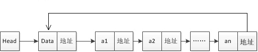

Go语言入门教程，Golang入门教程（非常详细）

<http://c.biancheng.net/golang/>

<https://www.kancloud.cn/imdszxs/golang/1535582>

<https://www.xinbaoku.com/archive/2DHvuPFr.html>

# 0.目录
> [6.结构体 [3](#结构体)](\l)
> 
> [6.1 Go语言结构体定义 ](\l)
>     [6.1.1 golang结构体标签（struct tags） ](\l)
> [6.2 Go语言实例化结构体 ](\l)
>     [6.2.1基本的实例化形式 ](\l)
>     [6.2.2创建指针类型的结构体 ](\l)
>     [6.2.3取结构体的地址实例化 ](\l)
> [6.3 初始化结构体的成员变量 ](\l)
>     [6.3.1使用“键值对”初始化结构体 ](\l)
>     [6.3.2使用多个值的列表初始化结构体 ](\l)
>     [6.3.3初始化匿名结构体 ](\l)
> [6.4 Go语言构造函数 ](\l)
>     [6.4.1多种方式创建和初始化结构体——模拟构造函数重载 ](\l)
>     [6.4.2带有父子关系的结构体的构造和初始化——模拟父级构造调用 ](\l)
> [6.5 Go语言方法和接收器 ](\l)
>     [6.5.1为结构体添加方法 ](\l)
>     [6.5.2接收器——方法作用的目标 ](\l)
>     [6.5.3示例：二维矢量模拟玩家移动 ](\l)
> [6.6 为任意类型添加方法 ](\l)
>     [6.6.1为基本类型添加方法 ](\l)
>     [6.6.2http包中的类型方法 ](\l)
>     [6.6.3time 包中的类型方法 ](\l)
> [6.7 示例：使用事件系统实现事件的响应和处理 ](\l)
>     [6.7.1方法和函数的统一调用 ](\l)
>     [6.7.2事件系统基本原理 ](\l)
>     [6.7.3事件注册 ](\l)
>     [6.7.4事件调用 ](\l)
>     [6.7.5使用事件系统 ](\l)
> 
>     
> [6.8 类型内嵌和结构体内嵌 ](\l)
>     [6.8.1内嵌结构体 ](\l)
>     [6.8.2结构内嵌特性 ](\l)
>     6.8+1结构体嵌入的 指针嵌入和值嵌入
> [6.9 结构体内嵌模拟类的继承 ](\l)
> [6.10 初始化内嵌结构体 ](\l)
>     [6.10.1初始化内嵌匿名结构体 ](\l)
> [6.11 内嵌结构体成员名字冲突](\l)
> [6.12 示例：使用匿名结构体解析JSON数据](\l)
>     [6.12.1定义数据结构 ](\l)
>     [6.12.2准备 JSON 数据](\l)
>     [6.12.3分离JSON数据](\l)
> 
> 
> [6.13 Go语言垃圾回收和SetFinalizer](\l)
> [6.14 示例：将结构体数据保存为JSON格式数据](\l)
> [6.15 Go语言链表操作](\l)
>     [6.15.1单向链表](\l)
>     [6.15.2循环链表](\l)
>     [6.15.3双向链表](\l)
> [6.16 Go语言数据I/O对象及操作](\l)
>     [6.16.1ReadWriter 对象 ](\l)
>     [6.16.2Reader 对象](\l)
>     [创建 Reader 对象 ](\l)
>     [操作 Reader 对象 ](\l)
> [6.16.3Writer 对象](\l)
>     [创建 Writer 对象 ](\l)
>     [操作 Writer 对象](\l)
> appendix01 golang 的结构体 是 值类型还是引用类型

# 6.[结构体](http://c.biancheng.net/golang/struct/)

Go 语言通过用自定义的方式形成新的类型，结构体是类型中带有成员的复合类型。Go 语言使用结构体和结构体成员来描述真实世界的实体和实体对应的各种属性。  
  
Go 语言中的类型可以被实例化，使用new或&构造的类型实例的类型是类型的指针。  
  
结构体成员是由一系列的成员变量构成，这些成员变量也被称为“字段”。字段有以下特性：

- 字段拥有自己的类型和值。

- 字段名必须唯一。

- 字段的类型也可以是结构体，甚至是字段所在结构体的类型。

#### 关于 Go 语言的类（class）

Go 语言中没有“类”的概念，也不支持“类”的继承等面向对象的概念。  
  
Go 语言的结构体与“类”都是复合结构体，但 Go 语言中结构体的内嵌配合接口比面向对象具有更高的扩展性和灵活性。  
  
Go 语言不仅认为结构体能拥有方法，且每种自定义类型也可以拥有自己的方法。

## 6.1 [Go语言结构体定义](http://c.biancheng.net/view/65.html)

Go语言可以通过自定义的方式形成新的类型，结构体就是这些类型中的一种复合类型，结构体是由零个或多个任意类型的值聚合成的实体，每个值都可以称为结构体的成员。  
  
结构体成员也可以称为“字段”，这些字段有以下特性：

- 字段拥有自己的类型和值；

- 字段名必须唯一；

- 字段的类型也可以是结构体，甚至是字段所在结构体的类型。

使用关键字 type 可以将各种基本类型定义为自定义类型，基本类型包括整型、字符串、布尔等。结构体是一种复合的基本类型，通过 type 定义为自定义类型后，使结构体更便于使用。  
  
结构体的定义格式如下：

type 类型名 struct {  
    字段1 字段1类型  
    字段2 字段2类型  
    …  
}

对各个部分的说明：

- 类型名：标识自定义结构体的名称，在同一个包内不能重复。

- struct{}：表示结构体类型，type 类型名 struct{}可以理解为将 struct{} 结构体定义为类型名的类型。

- 字段1、字段2……：表示结构体字段名，结构体中的字段名必须唯一。

- 字段1类型、字段2类型……：表示结构体各个字段的类型。

使用结构体可以表示一个包含 X 和 Y 整型分量的点结构，代码如下：

1.  type Point struct {

2.  X int

3.  Y int

4.  }

同类型的变量也可以写在一行，颜色的红、绿、蓝 3 个分量可以使用 byte 类型表示，定义的颜色结构体如下：

1.  type Color struct {

2.  R, G, B byte

3.  }

结构体的定义只是一种内存布局的描述，只有当结构体实例化时，才会真正地分配内存，我们将在下一节《实例化结构体》中详细为大家介绍。

### 6.1.1 golang结构体标签（struct tags）

**下面的golang结构体 定义中，每行的最后字符串是什么语法**

type User struct {

Id int64 \`gorm:"primary_key" json:"id"\`

Name string // 默认字符串对应的是数据库的longtext文本类型

CreatedAt \*time.Time \`json:"createdAt" gorm:"column:create_at"\`

Email string \`gorm:"type:varchar(255);unique_index"\` // 使用type字段定义类型，并设置为唯一索引

Role string \`gorm:"size:255"\` // 设置字段的大小为255个字节

MemberNumber \*string \`gorm:"unique;not null"\` // 设置memberNumber 字段唯一且不为空

Num int \`gorm:"AUTO_INCREMENT"\` // 设置 Num字段自增

Address string \`gorm:"index:addr"\` // 给Address 创建一个名字是 \`addr\`的索引

IgnoreMe int \`gorm:"-"\` // 忽略这个字段

}

------------------------

在给出的Golang结构体定义中，每行字段声明后面的字符串是结构体标签（struct tags）。结构体标签是Go语言的一个特性，允许在结构体字段后面附加元数据。这些标签通常用于控制结构体字段在JSON、XML或其他格式中的编码和解码行为，或者用于ORM（对象关系映射）工具中定义数据库表的列属性。

具体来说，这些标签的语法是反引号（\`）括起来的一系列键值对，键值对之间用空格分隔。例如：

- gorm:"primary_key"：这是一个用于GORM ORM框架的标签，表示该字段是数据库表的主键。

- json:"id"：这是一个用于json编码/解码的标签，表示在JSON数据中，该字段应该映射为id。

- gorm:"column:create_at"：GORM标签，表示数据库中对应的列名是create_at（注意这里可能是个笔误，通常应该是created_at）。

- gorm:"type:varchar(255);unique_index"：GORM标签，表示数据库字段类型为VARCHAR(255)，并设置唯一索引。

- gorm:"size:255"：GORM标签，表示数据库字段的大小为255个字节。

- gorm:"unique;not null"：GORM标签，表示该字段在数据库中是唯一的且不允许为空。

- gorm:"AUTO_INCREMENT"：GORM标签，表示该字段是自增的。

- gorm:"index:addr"：GORM标签，表示创建一个名为addr的索引。

- gorm:"-"：GORM标签，表示忽略该字段，不在数据库表中创建对应的列。

这些标签为开发者提供了强大的灵活性，允许在不改变结构体字段本身的情况下，控制字段的多种行为。

## 6.2 [Go语言实例化结构体](http://c.biancheng.net/view/66.html)

Go语言实例化结构体——为结构体分配内存并初始化

------------------------------------------------------------------------------

结构体的定义只是一种内存布局的描述，只有当结构体实例化时，才会真正地分配内存，因此必须在定义结构体并实例化后才能使用结构体的字段。  
  
实例化就是根据结构体定义的格式创建一份与格式一致的内存区域，结构体实例与实例间的内存是完全独立的。  
  
Go语言可以通过多种方式实例化结构体，根据实际需要可以选用不同的写法。

### 6.2.1基本的实例化形式

结构体本身是一种类型，可以像整型、字符串等类型一样，以 var 的方式声明结构体即可完成实例化。  
  
基本实例化格式如下：
var ins T
其中，T 为结构体类型，ins 为结构体的实例。  
  
用结构体表示的点结构（Point）的实例化过程请参见下面的代码：

1.  type Point struct {
2.    X int
3.    Y int
4.  }
5.  
6.  var p Point
7.  p.X = 10
8.  p.Y = 20

在例子中，使用.来访问结构体的成员变量，如p.X和p.Y等，结构体成员变量的赋值方法与普通变量一致。

### 6.2.2创建指针类型的结构体

Go语言中，还可以使用 new 关键字对类型（包括结构体、整型、浮点数、字符串等）进行实例化，结构体在实例化后会形成指针类型的结构体。  
  
使用 new 的格式如下：
ins := new(T)

其中：
- T 为类型，可以是结构体、整型、字符串等。
- ins：T 类型被实例化后保存到 ins 变量中， ins的类型为*T ，属于指针。

Go语言让我们可以像访问普通结构体一样使用.来访问结构体指针的成员。  
  
下面的例子定义了一个玩家（Player）的结构，玩家拥有名字、生命值和魔法值，实例化玩家（Player）结构体后，可对成员进行赋值，代码如下：

1.  type Player struct{
2.      Name string
3.      HealthPoint int
4.      MagicPoint int
5.  }
6.  

7.  tank := new(Player)
8.  tank.Name = "Canon"
9.  tank.HealthPoint = 300

经过 new 实例化的结构体实例在成员赋值上与基本实例化的写法一致。

**Go语言和 C/<u>C++</u>**

在 C/C++ 语言中，使用 new 实例化类型后，访问其成员变量时必须使用->操作符。  
在Go语言中，访问结构体指针的成员变量时可以继续使用.，这是因为Go语言为了方便开发者访问结构体指针的成员变量，使用了语法糖（Syntactic sugar）技术，将 ins.Name 形式转换为 (*ins).Name。

### 6.2.3取结构体的地址实例化

在Go语言中，对结构体进行&取地址操作时，视为对该类型进行一次 new 的实例化操作，取地址格式如下：
ins := &T{}

其中：
- T 表示结构体类型。
- ins 为结构体的实例，**类型为 *T**，是指针类型。

下面使用结构体定义一个命令行指令（Command），指令中包含名称、变量关联和注释等，对 Command 进行指针地址的实例化，并完成赋值过程，代码如下：

1.  type Command struct {
2.      Name string // 指令名称
3.      Var  *int // 指令绑定的变量
4.      Comment string // 指令的注释
5.  }
6.  
7.  var version int = 1
8.  
9.  cmd := &Command{}
10. cmd.Name = "version"
11. cmd.Var = &version
12. cmd.Comment = "show version"

代码说明如下：

- 第 1 行，定义 Command 结构体，表示命令行指令
- 第 3 行，命令绑定的变量，使用整型指针绑定一个指针，指令的值可以与绑定的值随时保持同步。
- 第 7 行，命令绑定的目标整型变量：版本号。
- 第 9 行，对结构体取地址实例化。
- 第 10～12 行，初始化成员字段。

取地址实例化是最广泛的一种结构体实例化方式，可以使用函数封装上面的初始化过程，代码如下：

1.  func newCommand(name string, varref *int, comment string) *Command {
2.      return &Command{
3.          Name: name,
4.          Var: varref,
5.          Comment: comment,
6.      }
7.  }
8.  
9.  cmd = newCommand(
10.     "version",
11.     &version,
12.     "show version",
13. )

## 6.3 [初始化结构体的成员变量](http://c.biancheng.net/view/67.html)

Go语言初始化结构体的成员变量

------------------------------------------------

结构体在实例化时可以直接对成员变量进行初始化，初始化有两种形式分别是以字段“键值对”形式和多个值的列表形式，键值对形式的初始化适合选择性填充字段较多的结构体，多个值的列表形式适合填充字段较少的结构体。

### 6.3.1使用“键值对”初始化结构体

结构体可以使用“键值对”（Key value pair）初始化字段，每个“键”（Key）对应结构体中的一个字段，键的“值”（Value）对应字段需要初始化的值。  
  
键值对的填充是可选的，不需要初始化的字段可以不填入初始化列表中。  
  
结构体实例化后字段的默认值是字段类型的默认值，例如 ，数值为 0、字符串为 ""（空字符串）、布尔为 false、指针为 nil 等。

#### 1) 键值对初始化结构体的书写格式

键值对初始化的格式如下：

ins := 结构体类型名{  
    字段1: 字段1的值,  
    字段2: 字段2的值,  
    …  
}

下面是对各个部分的说明：
- 结构体类型：定义结构体时的类型名称。
- 字段1、字段2：结构体成员的字段名，结构体类型名的字段初始化列表中，字段名只能出现一次。
- 字段1的值、字段2的值：结构体成员字段的初始值。

键值之间以:分隔，键值对之间以,分隔。

#### 2) 使用键值对填充结构体的例子

下面示例中描述了家里的人物关联，正如儿歌里唱的：“爸爸的爸爸是爷爷”，人物之间可以使用多级的 child 来描述和建立关联，使用键值对形式填充结构体的代码如下：
1.  type People struct {
2.      name string
3.      child *People
4.  }
5.  
6.  relation := &People{
7.      name: "爷爷",
8.      child: &People{
9.          name: "爸爸",
10.         child: &People{
11.             name: "我",
12.         },
13.     },
14. }

代码说明如下：

- 第 1 行，定义 People 结构体。
- 第 2 行，结构体的字符串字段。
- 第 3 行，结构体的结构体指针字段，类型是 *People。
- 第 6 行，relation 由 People 类型取地址后，形成类型为 *People 的实例。
- 第 8 行，child 在初始化时，需要 *People 类型的值，使用取地址初始化一个 People。

**提示：**结构体成员中只能包含结构体的指针类型，包含非指针类型会引起编译错误。**（abel:这话不正确）**

```go
// code by mq
type Animal struct {
	Name string
	sz   int
}

type Cat struct {
	Animal
	legCnt int
}

type People struct {
	name  string
	child *People
}

func main() {
	relation := People{
		name: "爷爷",
		child: &People{
			name: "爸爸",
			child: &People{
				name: "我",
			},
		},
	}

	ani := Animal{
		Name: "cat",
		sz:   15,
	}

	cat01 := Cat{
		Animal: Animal{
			Name: "cat1",
			sz:   22,
		},
		legCnt: 4,
	}
	cat01.sz = 223

	fmt.Println("relation=", relation, "ani=", ani, "cat01=", cat01)
} 
// //output:
// relation= {爷爷 0xc0001a0000} ani= {cat 15} cat01= {{cat1 223} 4}
```


### 6.3.2使用多个值的列表初始化结构体

Go语言可以在“键值对”初始化的基础上忽略“键”，也就是说，可以使用多个值的列表初始化结构体的字段。

#### 1) 多个值列表初始化结构体的书写格式

多个值使用逗号分隔初始化结构体，例如：

ins := 结构体类型名{  
    字段1的值,  
    字段2的值,  
    …  
}

使用这种格式初始化时，需要注意：
- 必须初始化结构体的所有字段。
- 每一个初始值的填充顺序必须与字段在结构体中的声明顺序一致。
- 键值对与值列表的初始化形式不能混用。

#### 2) 多个值列表初始化结构体的例子

下面的例子描述了一段地址结构，地址要求具有一定的顺序，例如：

1.  type Address struct {
2.      Province string
3.      City string
4.      ZipCode int
5.      PhoneNumber string
6.  }
7.  
8.  addr := Address{
9.      "四川",
10.     "成都",
11.     610000,
12.     "0",
13. }
14. 
15. fmt.Println(addr)

运行代码，输出如下：
{四川 成都 610000 0}

### 6.3.3初始化匿名结构体

匿名结构体没有类型名称，无须通过 type 关键字定义就可以直接使用。

#### 1) 匿名结构体定义格式和初始化写法

匿名结构体的初始化写法由结构体定义和键值对初始化两部分组成，结构体定义时没有结构体类型名，只有字段和类型定义，键值对初始化部分由可选的多个键值对组成，如下格式所示：

ins := struct {  
    // 匿名结构体字段定义  
    字段1 字段类型1  
    字段2 字段类型2  
    …  
}{  
    // 字段值初始化  
    初始化字段1: 字段1的值,  
    初始化字段2: 字段2的值,  
    …  
}

下面是对各个部分的说明：

- 字段1、字段2……：结构体定义的字段名。
- 初始化字段1、初始化字段2……：结构体初始化时的字段名，可选择性地对字段初始化。
- 字段类型1、字段类型2……：结构体定义字段的类型。
- 字段1的值、字段2的值……：结构体初始化字段的初始值。
键值对初始化部分是可选的，不初始化成员时，匿名结构体的格式变为：

ins := struct {  
    字段1 字段类型1  
    字段2 字段类型2  
    …  
}

#### 2) 使用匿名结构体的例子

在本示例中，使用匿名结构体的方式定义和初始化一个消息结构，这个消息结构具有消息标示部分（ID）和数据部分（data），打印消息内容的 printMsg() 函数在接收匿名结构体时需要在参数上重新定义匿名结构体，代码如下：

1.  package main
2.  
3.  import (
4.  "fmt"
5.  )
6.  
7.  // 打印消息类型, 传入匿名结构体
8.  func printMsgType(msg *struct {
9.  id int
10. data string
11. }) {
12. 
13.     // 使用动词%T打印msg的类型
14.     fmt.Printf("%T\n", msg)
15. }
16. 
17. func main() {
18. 
19. // 实例化一个匿名结构体
20. msg := &struct { // 定义部分
21.     id int
22.     data string
23. }{ // 值初始化部分
24.     1024,
25.     "hello",
26. }
27. 
28. printMsgType(msg)
29. }

代码输出如下：
*struct { id int; data string }
代码说明如下：

- 第 8 行，定义 printMsgType() 函数，参数为 msg，类型为*struct{id int data string}，因为类型没有使用 type 定义，所以需要在每次用到的地方进行定义。
- 第 14 行，使用字符串格式化中的%T动词，将 msg 的类型名打印出来。
- 第 20 行，对匿名结构体进行实例化，同时初始化成员。
- 第 21 和 22 行，定义匿名结构体的字段。
- 第 24 和 25 行，给匿名结构体字段赋予初始值。
- 第 28 行，将 msg 传入 printMsgType() 函数中进行函数调用。

匿名结构体的类型名是结构体包含字段成员的详细描述，匿名结构体在使用时需要重新定义，造成大量重复的代码，因此开发中较少使用。

## 6.4 [Go语言构造函数](http://c.biancheng.net/view/68.html)

Go语言的类型或结构体**没有构造函数**的功能，但是我们可以使用结构体初始化的过程来模拟实现构造函数。  
  
其他编程语言构造函数的一些常见功能及特性如下：
- 每个类可以添加构造函数，多个构造函数使用函数重载实现。
- 构造函数一般与类名同名，且没有返回值。
- 构造函数有一个静态构造函数，一般用这个特性来调用父类的构造函数。
- 对于 C++ 来说，还有默认构造函数、拷贝构造函数等。

### 6.4.1多种方式创建和初始化结构体——模拟构造函数重载

如果使用结构体描述猫的特性，那么根据猫的颜色和名字可以有不同种类的猫，那么不同的颜色和名字就是结构体的字段，同时可以使用颜色和名字构造不同种类的猫的实例，这个过程可以参考下面的代码：

1.  type Cat struct {
2.      Color string
3.      Name string
4.  }
5.  
6.  func NewCatByName(name string) *Cat {
7.      return &Cat{
8.          Name: name,
9.      }
10. }
11. 
12. func NewCatByColor(color string) *Cat {
13.     return &Cat{
14.         Color: color,
15.     }
16. }

代码说明如下：
- 第 1 行定义 Cat 结构，包含颜色和名字字段。
- 第 6 行定义用名字构造猫结构的函数，返回 Cat 指针。
- 第 7 行取地址实例化猫的结构体。
- 第 8 行初始化猫的名字字段，忽略颜色字段。
- 第 12 行定义用颜色构造猫结构的函数，返回 Cat 指针。

在这个例子中，颜色和名字两个属性的类型都是字符串，由于Go语言中没有函数重载，为了避免函数名字冲突，使用 NewCatByName() 和 NewCatByColor() 两个不同的函数名表示不同的 Cat 构造过程。

### 6.4.2带有父子关系的结构体的构造和初始化——模拟父级构造调用

黑猫是一种猫，猫是黑猫的一种泛称，同时描述这两种概念时，就是派生，黑猫派生自猫的种类，使用结构体描述猫和黑猫的关系时，将猫（Cat）的结构体嵌入到黑猫（BlackCat）中，表示黑猫拥有猫的特性，然后再使用两个不同的构造函数分别构造出黑猫和猫两个结构体实例，参考下面的代码：

1.  type Cat struct {
2.      Color string
3.      Name string
4.  }
5.  
6.  type BlackCat struct {
7.      Cat // 嵌入Cat, 类似于派生
8.  }
9.  
10. // “构造基类”
11. func NewCat(name string) *Cat {
12.     return &Cat{
13.         Name: name,
14.     }
15. }
16. 
17. // “构造子类”
18. func NewBlackCat(color string) *BlackCat {
19.     cat := &BlackCat{}
20.     cat.Color = color
21.     return cat
22. }

代码说明如下：
- 第 6 行，定义 BlackCat 结构，并嵌入了 Cat 结构体，BlackCat 拥有 Cat 的所有成员，实例化后可以自由访问 Cat 的所有成员。
- 第 11 行，NewCat() 函数定义了 Cat 的构造过程，使用名字作为参数，填充 Cat 结构体。
- 第 18 行，NewBlackCat() 使用 color 作为参数，构造返回 BlackCat 指针。
- 第 19 行，实例化 BlackCat 结构，此时 Cat 也同时被实例化。
- 第 20 行，填充 BlackCat 中嵌入的 Cat 颜色属性，BlackCat 没有任何成员，所有的成员都来自于 Cat。

这个例子中，Cat 结构体类似于面向对象中的“基类”，BlackCat 嵌入 Cat 结构体，类似于面向对象中的“派生”，实例化时，BlackCat 中的 Cat 也会一并被实例化。  
  
总之，Go语言中没有提供构造函数相关的特殊机制，用户根据自己的需求，将参数使用函数传递到结构体构造参数中即可完成构造函数的任务。

## 6.5 [Go语言方法和接收器](http://c.biancheng.net/view/vip_7322.html)

在Go语言中，结构体就像是类的一种简化形式，那么类的方法在哪里呢？在Go语言中有一个概念，它和方法有着同样的名字，并且大体上意思相同，Go 方法是作用在接收器（receiver）上的一个函数，接收器是某种类型的变量，因此方法是一种特殊类型的函数。

接收器类型可以是（几乎）任何类型，不仅仅是结构体类型，任何类型都可以有方法，甚至可以是函数类型，可以是 int、bool、string 或数组的别名类型，但是接收器不能是一个接口类型，因为接口是一个抽象定义，而方法却是具体实现，如果这样做了就会引发一个编译错误invalid receiver type…。

接收器也不能是一个指针类型，但是它可以是任何其他允许类型的指针，**一个类型加上它的方法等价于面向对象中的一个类**，一个重要的区别是，在Go语言中，类型的代码和绑定在它上面的方法的代码可以不放置在一起，它们可以存在不同的源文件中，唯一的要求是它们必须是同一个包的。

类型 T（或 T）上的所有方法的集合叫做类型 T（或 T）的方法集。

因为方法是函数，所以同样的，不允许方法重载，即对于一个类型只能有一个给定名称的方法，但是如果基于接收器类型，是有重载的：具有同样名字的方法可以在 2 个或多个不同的接收器类型上存在，比如在同一个包里这么做是允许的。

#### 提示

在面向对象的语言中，类拥有的方法一般被理解为类可以做的事情。在Go语言中“方法”的概念与其他语言一致，只是Go语言建立的“接收器”强调方法的作用对象是接收器，也就是类实例，而函数没有作用对象。

### 6.5.1为结构体添加方法

本节中，将会使用背包作为“对象”，将物品放入背包的过程作为“方法”，通过面向过程的方式和Go语言中结构体的方式来理解“方法”的概念。

#### 1) 面向过程实现方法

面向过程中没有“方法”概念，只能通过结构体和函数，由使用者使用函数参数和调用关系来形成接近“方法”的概念，代码如下：
```go
type Bag struct { 
    items []int 
} 
// 将一个物品放入背包的过程
func Insert(b *Bag, itemid int) {
    b.items = append(b.items, itemid)
} 
func main() {
    bag := new(Bag)
    Insert(bag, 1001)
} 
```
代码说明如下：

- 第 1 行，声明 Bag 结构，这个结构体包含一个整型切片类型的 items 的成员。
- 第 6 行，定义了 Insert() 函数，这个函数拥有两个参数，第一个是背包指针（*Bag），第二个是物品 ID（itemid）。
- 第 7 行，用 append() 将 itemid 添加到 Bag 的 items 成员中，模拟往背包添加物品的过程。
- 第 12 行，创建背包实例 bag。
- 第 14 行，调用 Insert() 函数，第一个参数放入背包，第二个参数放入物品 ID。

Insert() 函数将 *Bag 参数放在第一位，强调 Insert 会操作 *Bag 结构体，但实际使用中，并不是每个人都会习惯将操作对象放在首位，一定程度上让代码失去一些范式和描述性。同时，Insert() 函数也与 Bag 没有任何归属概念，随着类似 Insert() 的函数越来越多，面向过程的代码描述对象方法概念会越来越麻烦和难以理解。

#### 2) Go语言的结构体方法

将背包及放入背包的物品中使用Go语言的结构体和方法方式编写，为 *Bag 创建一个方法，代码如下：

```go
type Bag struct {
   items []int
}
func (b *Bag) Insert(itemid int) {
    b.items = append(b.items, itemid)
}
func main() {
    b := new(Bag)
    b.Insert(1001)
}
```

第 5 行中，Insert(itemid int) 的写法与函数一致，(b*Bag) 表示接收器，即 Insert 作用的对象实例。
每个方法只能有一个接收器，如下图所示。

  
图：接收器

第 13 行中，在 Insert() 转换为方法后，我们就可以愉快地像其他语言一样，用面向对象的方法来调用 b 的 Insert。

### 6.5.2接收器——方法作用的目标

接收器的格式如下：
func (接收器变量 接收器类型) 方法名(参数列表) (返回参数) {
    函数体
}

对各部分的说明：
- 接收器变量：接收器中的参数变量名在命名时，官方建议使用接收器类型名的第一个小写字母，而不是 self、this 之类的命名。例如，Socket 类型的接收器变量应该命名为 s，Connector 类型的接收器变量应该命名为 c 等。
- 接收器类型：接收器类型和参数类似，可以是指针类型和非指针类型。
- 方法名、参数列表、返回参数：格式与函数定义一致。

接收器根据接收器的类型可以分为指针接收器、非指针接收器，两种接收器在使用时会产生不同的效果，根据效果的不同，两种接收器会被用于不同性能和功能要求的代码中。

#### 1) 理解指针类型的接收器

指针类型的接收器由一个结构体的指针组成，更接近于面向对象中的 this 或者 self。
由于指针的特性，调用方法时，修改接收器指针的任意成员变量，在方法结束后，修改都是有效的。
在下面的例子，使用结构体定义一个属性（Property），为属性添加 SetValue() 方法以封装设置属性的过程，通过属性的 Value() 方法可以重新获得属性的数值，使用属性时，通过 SetValue() 方法的调用，可以达成修改属性值的效果。
```go
package main
import "fmt"
// 定义属性结构
type Property struct {
    value int // 属性值
}

// 设置属性值
func (p *Property) SetValue(v int) {
    // 修改p的成员变量
    p.value = v
}

// 取属性值
func (p *Property) Value() int {
    return p.value
}

func main() {

    // 实例化属性
    p := new(Property)
    // 设置值
    p.SetValue(100)
    // 打印值
    fmt.Println(p.Value())
}
```
运行程序，输出如下：
100

代码说明如下：
- 第 6 行，定义一个属性结构，拥有一个整型的成员变量。
- 第 11 行，定义属性值的方法。
- 第 14 行，设置属性值方法的接收器类型为指针，因此可以修改成员值，即便退出方法，也有效。
- 第 18 行，定义获取值的方法。
- 第 25 行，实例化属性结构。
- 第 28 行，设置值，此时成员变量变为 100。
- 第 31 行，获取成员变量。

#### 2) 理解非指针类型的接收器

当方法作用于非指针接收器时，Go语言会在代码运行时将接收器的值复制一份，在非指针接收器的方法中可以获取接收器的成员值，但修改后无效。

点（Point）使用结构体描述时，为点添加 Add() 方法，这个方法不能修改 Point 的成员 X、Y 变量，而是在计算后返回新的 Point 对象，Point 属于小内存对象，在函数返回值的复制过程中可以极大地提高代码运行效率，详细过程请参考下面的代码。
```go
package main

import (
"fmt"
)

// 定义点结构

type Point struct {
X int
Y int
}

// 非指针接收器的加方法
func (p Point) Add(other Point) Point {
    // 成员值与参数相加后返回新的结构
    return Point{p.X + other.X, p.Y + other.Y}
}

func main() {
    // 初始化点
    p1 := Point{1, 1}
    p2 := Point{2, 2}

    // 与另外一个点相加
    result := p1.Add(p2)
    // 输出结果
    fmt.Println(result)
}
```
代码输出如下：
{3 3}

代码说明如下：
- 第 8 行，定义一个点结构，拥有 X 和 Y 两个整型分量。
- 第 14 行，为 Point 结构定义一个 Add() 方法，传入和返回都是点的结构，可以方便地实现多个点连续相加的效果，例如P4 := P1.Add( P2 ).Add( P3 )
- 第 23 和 24 行，初始化两个点 p1 和 p2。
- 第 27 行，将 p1 和 p2 相加后返回结果。
- 第 30 行，打印结果。

由于例子中使用了非指针接收器，Add() 方法变得类似于只读的方法，Add() 方法内部不会对成员进行任何修改。

#### 3) 指针和非指针接收器的使用

在计算机中，小对象由于值复制时的速度较快，所以适合使用非指针接收器，大对象因为复制性能较低，适合使用指针接收器，在接收器和参数间传递时不进行复制，只是传递指针。
mq注：**非指针接收器** 用于对 对象的成员只有**只读的操作**； **指针接收器** 用于对 对象的成员 有 **写的操作**；
```go
//-------code by mq----
type Rectangle struct {
	Width, Height float64
}
// 对r 只有读操作，所以 r 可以是 Rectangle类型
func (r Rectangle) Area() float64 {
	return r.Width * r.Height
}
// 有写操作，所以 r 是 *Rectangle
func (r *Rectangle) SetWidth(w float64) {
	r.Width = w
}
func main() {
	r1 := Rectangle{10, 20}
	r2 := r1
	r2.SetWidth(100)
	fmt.Println(r1.Area()) // 输出: 2000（r1 被修改）

	fmt.Println("r1=", r1, "r2=", r2)
}
```

### 6.5.3示例：二维矢量模拟玩家移动

在游戏中，一般使用二维矢量保存玩家的位置，使用矢量运算可以计算出玩家移动的位置，本例子中，首先实现二维矢量对象，接着构造玩家对象，最后使用矢量对象和玩家对象共同模拟玩家移动的过程。

#### 1) 实现二维矢量结构

矢量是数学中的概念，二维矢量拥有两个方向的信息，同时可以进行加、减、乘（缩放）、距离、单位化等计算，在计算机中，使用拥有 X 和 Y 两个分量的 Vec2 结构体实现数学中二维向量的概念，详细实现请参考下面的代码。

package main

import "math"

type Vec2 struct {

X, Y float32

}

// 加

func (v Vec2) Add(other Vec2) Vec2 {

return Vec2{

v.X + other.X,

v.Y + other.Y,

}

}

// 减

func (v Vec2) Sub(other Vec2) Vec2 {

return Vec2{

v.X - other.X,

v.Y - other.Y,

}

}

// 乘

func (v Vec2) Scale(s float32) Vec2 {

return Vec2{v.X * s, v.Y * s}

}

// 距离

func (v Vec2) DistanceTo(other Vec2) float32 {

dx := v.X - other.X

dy := v.Y - other.Y

return float32(math.Sqrt(float64(dx*dx + dy*dy)))

}

// 插值

func (v Vec2) Normalize() Vec2 {

mag := v.X*v.X + v.Y*v.Y

if mag > 0 {

oneOverMag := 1 / float32(math.Sqrt(float64(mag)))

return Vec2{v.X * oneOverMag, v.Y * oneOverMag}

}

return Vec2{0, 0}

}

代码说明如下：

- 第 5 行声明了一个 Vec2 结构体，包含两个方向的单精度浮点数作为成员。

- 第 10～16 行定义了 Vec2 的 Add() 方法，使用自身 Vec2 和通过 Add() 方法传入的 Vec2 进行相加，相加后，结果以返回值形式返回，不会修改 Vec2 的成员。

- 第 20 行定义了 Vec2 的减法操作。

- 第 29 行，缩放或者叫矢量乘法，是对矢量的每个分量乘上缩放比，Scale() 方法传入一个参数同时乘两个分量，表示这个缩放是一个等比缩放。

- 第 35 行定义了计算两个矢量的距离，math.Sqrt() 是开方函数，参数是 float64，在使用时需要转换，返回值也是 float64，需要转换回 float32。

- 第 43 行定义矢量单位化。

#### 2) 实现玩家对象

玩家对象负责存储玩家的当前位置、目标位置和速度，使用 MoveTo() 方法为玩家设定移动的目标，使用 Update() 方法更新玩家位置，在 Update() 方法中，通过一系列的矢量计算获得玩家移动后的新位置，步骤如下。

① 使用矢量减法，将目标位置（targetPos）减去当前位置（currPos）即可计算出位于两个位置之间的新矢量，如下图所示。

  
图：计算玩家方向矢量

② 使用 Normalize() 方法将方向矢量变为模为 1 的单位化矢量，这里需要将矢量单位化后才能进行后续计算，如下图所示。

  
图：单位化方向矢量

③ 获得方向后，将单位化方向矢量根据速度进行等比缩放，速度越快，速度数值越大，乘上方向后生成的矢量就越长（模很大），如下图所示。

  
图：根据速度缩放方向

④ 将缩放后的方向添加到当前位置后形成新的位置，如下图所示。

  
图：缩放后的方向叠加位置形成新位置

下面是玩家对象的具体代码：

package main

type Player struct {

currPos Vec2 // 当前位置

targetPos Vec2 // 目标位置

speed float32 // 移动速度

}

// 移动到某个点就是设置目标位置

func (p *Player) MoveTo(v Vec2) {

p.targetPos = v

}

// 获取当前的位置

func (p *Player) Pos() Vec2 {

return p.currPos

}

// 是否到达

func (p *Player) IsArrived() bool {

// 通过计算当前玩家位置与目标位置的距离不超过移动的步长，判断已经到达目标点

return p.currPos.DistanceTo(p.targetPos) < p.speed

}

// 逻辑更新

func (p *Player) Update() {

if !p.IsArrived() {

// 计算出当前位置指向目标的朝向

dir := p.targetPos.Sub(p.currPos).Normalize()

// 添加速度矢量生成新的位置

newPos := p.currPos.Add(dir.Scale(p.speed))

// 移动完成后，更新当前位置

p.currPos = newPos

}

}

// 创建新玩家

func NewPlayer(speed float32) *Player {

return &Player{

speed: speed,

}

}

代码说明如下：

- 第 3 行，结构体 Player 定义了一个玩家的基本属性和方法，结构体的 currPos 表示当前位置，speed 表示速度。

- 第 10 行，定义玩家的移动方法，逻辑层通过这个函数告知玩家要去的目标位置，随后的移动过程由 Update() 方法负责。

- 第 15 行，使用 Pos 方法实现玩家 currPos 的属性访问封装。

- 第 20 行，判断玩家是否到达目标点，玩家每次移动的半径就是速度（speed），因此，如果与目标点的距离小于速度，表示已经非常靠近目标，可以视为到达目标。

- 第 27 行，玩家移动时位置更新的主要实现。

- 第 29 行，如果已经到达，则不必再更新。

- 第 32 行，数学中，两矢量相减将获得指向被减矢量的新矢量，Sub() 方法返回的新矢量使用 Normalize() 方法单位化，最终返回的 dir 矢量就是移动方向。

- 第 35 行，在当前的位置上叠加根据速度缩放的方向计算出新的位置 newPos。

- 第 38 行，将新位置更新到 currPos，为下一次移动做准备。

- 第 44 行，玩家的构造函数，创建一个玩家实例需要传入一个速度值。

#### 3) 处理移动逻辑

将 Player 实例化后，设定玩家移动的最终目标点，之后开始进行移动的过程，这是一个不断更新位置的循环过程，每次检测玩家是否靠近目标点附近，如果还没有到达，则不断地更新位置，让玩家朝着目标点不停的修改当前位置，如下代码所示：

package main

import "fmt"

func main() {

// 实例化玩家对象，并设速度为0.5

p := NewPlayer(0.5)

// 让玩家移动到3,1点

p.MoveTo(Vec2{3, 1})

// 如果没有到达就一直循环

for !p.IsArrived() {

// 更新玩家位置

p.Update()

// 打印每次移动后的玩家位置

fmt.Println(p.Pos())

}

}

代码说明如下：

- 第 8 行，使用 NewPlayer() 函数构造一个 *Player 玩家对象，并设移动速度为 0.5，速度本身是一种相对的和抽象的概念，在这里没有单位，可以根据实际效果进行调整，达到合适的范围即可。

- 第 11 行，设定玩家移动的最终目标为 X 为 3，Y 为 1。

- 第 14 行，构造一个循环，条件是没有到达时一直循环。

- 第 17 行，不停地更新玩家位置，如果玩家到达目标，p.IsArrived 将会变为 true。

- 第 20 行，打印每次更新后玩家的位置。

本例中使用到了结构体的方法、构造函数、指针和非指针类型方法接收器等，读者通过这个例子可以了解在哪些地方能够使用结构体。

## 6.6 [为任意类型添加方法](http://c.biancheng.net/view/vip_7323.html)

Go语言可以对任何类型添加方法，给一种类型添加方法就像给结构体添加方法一样，因为结构体也是一种类型。

### 6.6.1为基本类型添加方法

在Go语言中，使用 type 关键字可以定义出新的自定义类型，之后就可以为自定义类型添加各种方法了。我们习惯于使用面向过程的方式判断一个值是否为 0，例如：

if v == 0 {

// v等于0

}

如果将 v 当做整型对象，那么判断 v 值就可以增加一个 IsZero() 方法，通过这个方法就可以判断 v 值是否为 0，例如：

if v.IsZero() {

// v等于0

}

为基本类型添加方法的详细实现流程如下：

package main

import (

"fmt"

)

// 将int定义为MyInt类型

type MyInt int

// 为MyInt添加IsZero()方法

func (m MyInt) IsZero() bool {

return m == 0

}

// 为MyInt添加Add()方法

func (m MyInt) Add(other int) int {

return other + int(m)

}

func main() {

var b MyInt

fmt.Println(b.IsZero())

b = 1

fmt.Println(b.Add(2))

}

代码输出如下：

true 3

代码说明如下：

- 第 8 行，使用 type MyInt int 将 int 定义为自定义的 MyInt 类型。

- 第 11 行，为 MyInt 类型添加 IsZero() 方法，该方法使用了 (m MyInt) 的非指针接收器，数值类型没有必要使用指针接收器。

- 第 16 行，为 MyInt 类型添加 Add() 方法。

- 第 17 行，由于 m 的类型是 MyInt 类型，但其本身是 int 类型，因此可以将 m 从 MyInt 类型转换为 int 类型再进行计算。

- 第 24 行，调用 b 的 IsZero() 方法，由于使用非指针接收器，b的值会被复制进入 IsZero() 方法进行判断。

- 第 28 行，调用 b 的 Add() 方法，同样也是非指针接收器，结果直接通过 Add() 方法返回。

### 6.6.2http包中的类型方法

Go语言提供的 http 包里也大量使用了类型方法，Go语言使用 http 包进行 HTTP 的请求，使用 http 包的 NewRequest() 方法可以创建一个 HTTP 请求，填充请求中的 http 头（req.Header），再调用 http.Client 的 Do 方法，将传入的 HTTP 请求发送出去。

下面代码演示创建一个 HTTP 请求，并且设定 HTTP 头。

package main

import (

"fmt"

"io/ioutil"

"net/http"

"os"

"strings"

)

func main() {

client := &http.Client{}

// 创建一个http请求

req, err := http.NewRequest("POST", "http://www.163.com/", strings.NewReader("key=value"))

// 发现错误就打印并退出

if err != nil {

fmt.Println(err)

os.Exit(1)

return

}

// 为标头添加信息

req.Header.Add("User-Agent", "myClient")

// 开始请求

resp, err := client.Do(req)

// 处理请求的错误

if err != nil {

fmt.Println(err)

os.Exit(1)

return

}

data, err := ioutil.ReadAll(resp.Body)

fmt.Println(string(data))

defer resp.Body.Close()

}

代码执行结果如下：

405 Not Allowed 405 Not Allowed

nginx

代码说明如下：

- 第 11 行，实例化 HTTP 的客户端，请求需要通过这个客户端实例发送。

- 第 14 行，使用 POST 方式向网易的服务器创建一个 HTTP 请求，第三个参数为 HTTP 的 Body 部分，Body 部分的内容来自字符串，但参数只能接受 io.Reader 类型，因此使用 strings.NewReader() 创建一个字符串的读取器，返回的 io.Reader 接口作为 http 的 Body 部分供 NewRequest() 函数读取，创建请求只是构造一个请求对象，不会连接网络。

- 第 24 行，为创建好的 HTTP 请求的头部添加 User-Agent，作用是表明用户的代理特性。

- 第 27 行，使用客户端处理请求，此时 client 将 HTTP 请求发送到网易服务器，服务器响应请求后，将信息返回并保存到 resp 变量中。

- 第 37 行，读取响应的 Body 部分并打印。

由于我们构造的请求不是网易服务器所支持的类型，所以服务器返回操作不被运行的 405 错误。

在本例子第 24 行中使用的 req.Header 的类型为 http.Header，就是典型的自定义类型，并且拥有自己的方法，http.Header 的部分定义如下：

type Header map[string][]string

func (h Header) Add(key, value string) {

textproto.MIMEHeader(h).Add(key, value)

}

func (h Header) Set(key, value string) {

textproto.MIMEHeader(h).Set(key, value)

}

func (h Header) Get(key string) string {

return textproto.MIMEHeader(h).Get(key)

}

代码说明如下：

- 第 1 行，Header 实际是一个以字符串为键、字符串切片为值的映射。

- 第 3 行，Add() 为 Header 的方法，map 是一个引用类型，因此即便使用 (h Header) 的非指针接收器，也可以修改 map 的值。

为类型添加方法的过程是一个语言层特性，使用类型方法的代码经过编译器编译后的代码运行效率与传统的面向过程或面向对象的代码没有任何区别，因此，为了代码便于理解，可以在编码时使用Go语言的类型方法特性。

### 6.6.3time 包中的类型方法

Go语言提供的 time 包主要用于时间的获取和计算等，在这个包中，也使用了类型方法，例如：

package main

import (

"fmt"

"time"

)

func main() {

fmt.Println(time.Second.String())

}

第 9 行的 time.Second 是一个常量，下面代码的加粗部分就是 time.Second 的定义：

const (

Nanosecond Duration = 1

Microsecond = 1000 * Nanosecond

Millisecond = 1000 * Microsecond

Second = 1000 * Millisecond

Minute = 60 * Second

Hour = 60 * Minute

)

Second 的类型为 Duration，而 Duration 实际是一个 int64 的类型，定义如下：

type Duration int64

它拥有一个 String 的方法，部分定义如下：

func (d Duration) String() string {

// 一系列生成buf的代码

…

return string(buf[w:])

}

Duration.String 可以将 Duration 的值转为字符串。

## 6.7 [示例：使用事件系统实现事件的响应和处理](http://c.biancheng.net/view/vip_7324.html)

Go语言使用事件系统实现事件的响应和处理

-----------------------------------------------------------------

Go语言可以将类型的方法与普通函数视为一个概念，从而简化方法和函数混合作为回调类型时的复杂性。这个特性和C#中的代理（delegate）类似，调用者无须关心谁来支持调用，系统会自动处理是否调用普通函数或类型的方法。

本节中，首先将用简单的例子了解Go语言是如何将方法与函数视为一个概念，接着会实现一个事件系统，事件系统能有效地将事件触发与响应两端代码解耦。

### 6.7.1方法和函数的统一调用

本节的例子将让一个结构体的方法（class.Do）的参数和一个普通函数（funcDo）的参数完全一致，也就是方法与函数的签名一致。然后使用与它们签名一致的函数变量（delegate）分别赋值方法与函数，接着调用它们，观察实际效果。

详细实现请参考下面的代码。

package main

import "fmt"

// 声明一个结构体

type class struct {}

// 给结构体添加Do方法

func (c *class) Do(v int) {

fmt.Println("call method do:", v)

}

// 普通函数的Do

func funcDo(v int) {

fmt.Println("call function do:", v)

}

func main() {

// 声明一个函数回调

var delegate func(int)

// 创建结构体实例

c := new(class)

// 将回调设为c的Do方法

delegate = c.Do

// 调用

delegate(100)

// 将回调设为普通函数

delegate = funcDo

// 调用

delegate(100)

}

代码说明如下：

- 第 10 行，为结构体添加一个 Do() 方法，参数为整型。这个方法的功能是打印提示和输入的参数值。

- 第 16 行，声明一个普通函数，参数也是整型，功能是打印提示和输入的参数值。

- 第 24 行，声明一个 delegate 的变量，类型为 func(int)，与 funcDo 和 class 的 Do() 方法的参数一致。

- 第 30 行，将 c.Do 作为值赋给 delegate 变量。

- 第 33 行，调用 delegate() 函数，传入 100 的参数。此时会调用 c 实例的 Do() 方法。

- 第 36 行，将 funcDo 赋值给 delegate。

- 第 39 行，调用 delegate()，传入 100 的参数。此时会调用 funcDo() 方法。

运行代码，输出如下：

call method do: 100

call function do: 100

这段代码能运行的基础在于：无论是普通函数还是结构体的方法，只要它们的签名一致，与它们签名一致的函数变量就可以保存普通函数或是结构体方法。

了解了Go语言的这一特性后，我们就可以将这个特性用在事件中。

### 6.7.2事件系统基本原理

事件系统可以将事件派发者与事件处理者解耦。例如，网络底层可以生成各种事件，在网络连接上后，网络底层只需将事件派发出去，而不需要关心到底哪些代码来响应连接上的逻辑。或者再比如，你注册、关注或者订阅某“大V”的社交消息后，“大V”发生的任何事件都会通知你，但他并不用了解粉丝们是如何为她喝彩或者疯狂的。如下图所示为事件系统基本原理图。

  
图：事件系统基本原理

一个事件系统拥有如下特性：

- 能够实现事件的一方，可以根据事件 ID 或名字注册对应的事件。

- 事件发起者，会根据注册信息通知这些注册者。

- 一个事件可以有多个实现方响应。

通过下面的步骤详细了解事件系统的构成及使用。

### 6.7.3事件注册

事件系统需要为外部提供一个注册入口。这个注册入口传入注册的事件名称和对应事件名称的响应函数，事件注册的过程就是将事件名称和响应函数关联并保存起来，详细实现请参考下面代码的 RegisterEvent() 函数。

package main

// 实例化一个通过字符串映射函数切片的map

var eventByName = make(map[string][]func(interface{}))

// 注册事件，提供事件名和回调函数

func RegisterEvent(name string, callback func(interface{})) {

// 通过名字查找事件列表

list := eventByName[name]

// 在列表切片中添加函数

list = append(list, callback)

// 将修改的事件列表切片保存回去

eventByName[name] = list}

// 调用事件

func CallEvent(name string, param interface{}) {

// 通过名字找到事件列表

list := eventByName[name]

// 遍历这个事件的所有回调

for _, callback := range list {

// 传入参数调用回调

callback(param)

}

}

代码说明如下：

- 第 4 行，创建一个 map 实例，这个 map 通过事件名（string）关联回调列表（[]func(interface{}），同一个事件名称可能存在多个事件回调，因此使用回调列表保存。回调的函数声明为 func(interface{})。

- 第 7 行，提供给外部的通过事件名注册响应函数的入口。

- 第 10 行，eventByName 通过事件名（name）进行查询，返回回调列表（[]func(interface{}）。

- 第 13 行，为同一个事件名称在已经注册的事件回调的列表中再添加一个回调函数。

- 第 16 行，将修改后的函数列表设置到 map 的对应事件名中。

拥有事件名和事件回调函数列表的关联关系后，就需要开始准备事件调用的入口了。

### 6.7.4事件调用

事件调用方和注册方是事件处理中完全不同的两个角色。事件调用方是事发现场，负责将事件和事件发生的参数通过事件系统派发出去，而不关心事件到底由谁处理；事件注册方通过事件系统注册应该响应哪些事件及如何使用回调函数处理这些事件。事件调用的详细实现请参考上面代码的 CallEvent() 函数。

代码说明如下：

- 第 20 行，调用事件的入口，提供事件名称 name 和参数 param。事件的参数表示描述事件具体的细节，例如门打开的事件触发时，参数可以传入谁进来了。

- 第 23 行，通过注册事件回调的 eventByName 和事件名字查询处理函数列表 list。

- 第 26 行，遍历这个事件列表，如果没有找到对应的事件，list 将是一个空切片。

- 第 29 行，将每个函数回调传入事件参数并调用，就会触发事件实现方的逻辑处理。

### 6.7.5使用事件系统

例子中，在 main() 函数中调用事件系统的 CallEvent 生成 OnSkill 事件，这个事件有两个处理函数，一个是角色的 OnEvent() 方法，还有一个是函数 GlobalEvent()，详细代码实现过程请参考下面的代码。

package main

import "fmt"

// 声明角色的结构体

type Actor struct {}

// 为角色添加一个事件处理函数

func (a *Actor) OnEvent(param interface{}) {

fmt.Println("actor event:", param)}

// 全局事件

func GlobalEvent(param interface{}) {

fmt.Println("global event:", param)}

func main() {

// 实例化一个角色

a := new(Actor)

// 注册名为OnSkill的回调

RegisterEvent("OnSkill", a.OnEvent)

// 再次在OnSkill上注册全局事件

RegisterEvent("OnSkill", GlobalEvent)

// 调用事件，所有注册的同名函数都会被调用

CallEvent("OnSkill", 100)

}

代码说明如下：

- 第 6 行，声明一个角色的结构体。在游戏中，角色是常见的对象，本例中，角色也是 OnSkill 事件的响应处理方。

- 第 10 行，为角色结构添加一个 OnEvent() 方法，这个方法拥有 param 参数，类型为 interface{}，与事件系统的函数（func(interface{})）签名一致。

- 第 16 行为全局事件响应函数。有时需要全局进行侦听或者处理一些事件，这里使用普通函数实现全局事件的处理。

- 第 27 行，注册一个 OnSkill 事件，实现代码由 a 的 OnEvent 进行处理。也就是 Actor的OnEvent() 方法。

- 第 30 行，注册一个 OnSkill 事件，实现代码由 GlobalEvent 进行处理，虽然注册的是同一个名字的事件，但前面注册的事件不会被覆盖，而是被添加到事件系统中，关联 OnSkill 事件的函数列表中。

- 第 33 行，模拟处理事件，通过 CallEvent() 函数传入两个参数，第一个为事件名，第二个为处理函数的参数。

整个例子运行结果如下：

actor event: 100

global event: 100

结果演示，角色和全局的事件会按注册顺序顺序地触发。

一般来说，事件系统不保证同一个事件实现方多个函数列表中的调用顺序，事件系统认为所有实现函数都是平等的。也就是说，无论例子中的 a.OnEvent 先注册，还是 GlobalEvent() 函数先注册，最终谁先被调用，都是无所谓的，开发者不应该去关注和要求保证调用的顺序。

一个完善的事件系统还会提供移除单个和所有事件的方法。

## 6.8 [类型内嵌和结构体内嵌](http://c.biancheng.net/view/72.html)

Go语言类型内嵌和结构体内嵌

-------------------------------------------

结构体可以包含一个或多个匿名（或内嵌）字段，即这些字段没有显式的名字，只有字段的类型是必须的，此时类型也就是字段的名字。匿名字段本身可以是一个结构体类型，即结构体可以包含内嵌结构体。  
  
可以粗略地将这个和面向对象语言中的继承概念相比较，随后将会看到它被用来模拟类似继承的行为。**Go语言中的继承**是通过**内嵌或组合来实现的**，所以可以说，在Go语言中，相比较于继承，组合更受青睐。  
  
考虑如下的程序：

1.  package main
2.  import "fmt"
3.  type innerS struct {
4.      in1 int
5.      in2 int
6.  }
7.  type outerS struct {
8.      b int
9.      c float32
10.     int // anonymous field
11.     innerS //anonymous field
12. }
13. func main() {
14.     outer := new(outerS)
15.     outer.b = 6
16.     outer.c = 7.5
17.     outer.int = 60
18.     outer.in1 = 5
19.     outer.in2 = 10
20.     fmt.Printf("outer.b is: %d\n", outer.b)
21.     fmt.Printf("outer.c is: %f\n", outer.c)
22.     fmt.Printf("outer.int is: %d\n", outer.int)
23.     fmt.Printf("outer.in1 is: %d\n", outer.in1)
24.     fmt.Printf("outer.in2 is: %d\n", outer.in2)
25.     // 使用结构体字面量
26.     outer2 := outerS{6, 7.5, 60, innerS{5, 10}}
27.     fmt.Printf("outer2 is:", outer2)
28. }

运行结果如下所示：
outer.b is: 6  
outer.c is: 7.500000  
outer.int is: 60  
outer.in1 is: 5  
outer.in2 is: 10  
outer2 is:{6 7.5 60 {5 10}}

通过类型 outer.int 的名字来获取存储在匿名字段中的数据，于是可以得出一个结论：在一个结构体中对于每一种数据类型只能有一个匿名字段。

### 6.8.1内嵌结构体

同样地结构体也是一种数据类型，所以它也可以作为一个匿名字段来使用，如同上面例子中那样。外层结构体通过 outer.in1 直接进入内层结构体的字段，内嵌结构体甚至可以来自其他包。内层结构体被简单的插入或者内嵌进外层结构体。这个简单的“继承”机制提供了一种方式，使得可以从另外一个或一些类型继承部分或全部实现。  
  
示例代码如下所示：

1.  package main
2.  import "fmt"
3.  type A struct {
4.      ax, ay int
5.  }
6.  type B struct {
7.      A
8.      bx, by float32
9.  }
10. func main() {
11.     b := B{A{1, 2}, 3.0, 4.0}
12.     fmt.Println(b.ax, b.ay, b.bx, b.by)
13.     fmt.Println(b.A)
14. }

输出：
1 2 3 4  
{1 2}

### 6.8.2结构内嵌特性

Go语言的结构体内嵌有如下特性。

#### 1) 内嵌的结构体可以直接访问其成员变量
嵌入结构体的成员，可以通过外部结构体的实例直接访问。如果结构体有多层嵌入结构体，结构体实例访问任意一级的嵌入结构体成员时都只用给出字段名，而无须像传统结构体字段一样，通过一层层的结构体字段访问到最终的字段。例如，ins.a.b.c的访问可以简化为ins.c。

#### 2) 内嵌结构体的字段名是它的类型名
内嵌结构体字段仍然可以使用详细的字段进行一层层访问，内嵌结构体的字段名就是它的类型名，代码如下：
1.  var c Color
2.  c.BasicColor.R = 1
3.  c.BasicColor.G = 1
4.  c.BasicColor.B = 0
一个结构体只能嵌入一个同类型的成员，无须担心结构体重名和错误赋值的情况，编译器在发现可能的赋值歧义时会报错。


## 6.8+1结构体嵌入的 指针嵌入和值嵌入

```go
type HelloServiceClient struct {
	*rpc.Client
}
```
这里，*rpc.Client是golang的什么语法?

doubaoAI:

在 Go 语言中，`*rpc.Client` 这种语法表示 **结构体嵌入（Struct Embedding）**，也称为 **匿名组合（Anonymous Composition）**。这是 Go 语言实现继承和代码复用的一种方式，允许一个结构体直接包含另一个结构体的字段和方法。


### **一、语法解析**
```go
type HelloServiceClient struct {
    *rpc.Client  // 嵌入指针类型的结构体
}
```
- **含义**：`HelloServiceClient` 结构体**隐式包含**了 `rpc.Client` 的所有字段和方法。
- **类型**：嵌入的是 `*rpc.Client`（指针类型），而非 `rpc.Client`（值类型）。


### **二、核心特性**
#### **1. 方法和字段的继承**
`HelloServiceClient` 可以直接调用 `rpc.Client` 的方法，无需显式转发：
```go
client := &HelloServiceClient{rpc.Dial("tcp", "localhost:1234")}
client.Call("Service.Method", args, &reply)  // 直接调用 rpc.Client 的方法
```

#### **2. 访问控制**
- 嵌入结构体的**导出字段和方法**（首字母大写）会被提升为外部结构体的字段和方法。
- 未导出的字段和方法（首字母小写）无法直接访问。

#### **3. 指针 vs 值嵌入**
- **指针嵌入（`*rpc.Client`）**：多个实例共享同一个底层对象，修改会影响所有引用。
- **值嵌入（`rpc.Client`）**：每个实例有独立的副本，修改不会相互影响。


### **三、使用场景**
#### **1. 扩展已有类型**
为 `rpc.Client` 添加额外功能，同时保留原有接口：
```go
type LoggedClient struct {
    *rpc.Client
    logger *log.Logger
}

// 添加新方法
func (c *LoggedClient) LoggedCall(serviceMethod string, args, reply interface{}) error {
    c.logger.Printf("Calling %s", serviceMethod)
    return c.Client.Call(serviceMethod, args, reply)  // 调用嵌入的方法
}
```

#### **2. 实现接口组合**
通过嵌入多个结构体，组合多个接口的功能：
```go
type HTTPRequest struct {
    *bytes.Buffer  // 嵌入 io.Reader 和 io.Writer 接口的实现
    url.URL
}
```


### **四、与传统继承的区别**
| 特性               | Go 结构体嵌入                | 传统继承（如 Java）         |
|--------------------|------------------------------|----------------------------|
| 语法               | 显式嵌入结构体               | 通过 `extends` 关键字       |
| 实现方式           | 组合（Composition）          | 继承（Inheritance）         |
| 类型关系           | 无类型关系，仅方法提升       | 子类是父类的子类型         |
| 多重继承           | 支持嵌入多个结构体           | 不支持多重继承             |
| 方法重写           | 通过定义同名方法覆盖         | 通过 `override` 关键字      |


### **五、注意事项**
1. **命名冲突**：若嵌入多个结构体存在同名方法，需显式指定调用路径：
   ```go
   client.rpc.Client.Call(...)  // 明确指定调用 rpc.Client 的方法
   ```

2. **初始化**：嵌入指针类型时，需确保指针已初始化：
   ```go
   client := &HelloServiceClient{
       Client: rpc.Dial("tcp", "localhost:1234"),  // 显式初始化
   }
   ```

3. **接口实现**：若嵌入的结构体实现了某个接口，外部结构体也会被视为实现了该接口。


### **六、示例代码**
```go
package main

import (
    "fmt"
    "net/rpc"
)

// 定义服务客户端
type HelloServiceClient struct {
    *rpc.Client
}

// 添加新方法
func (c *HelloServiceClient) SayHello(name string) (string, error) {
    var reply string
    err := c.Client.Call("HelloService.Say", name, &reply)
    return reply, err
}

func main() {
    // 初始化客户端
    rpcClient, _ := rpc.Dial("tcp", "localhost:1234")
    client := &HelloServiceClient{rpcClient}

    // 调用嵌入的方法
    client.Close()

    // 调用自定义方法
    reply, _ := client.SayHello("World")
    fmt.Println(reply)
}
```


### **总结**
`*rpc.Client` 在 Go 中是**结构体嵌入语法**，允许 `HelloServiceClient` 直接使用 `rpc.Client` 的所有功能，同时可以添加新方法或修改行为。这是 Go 语言实现代码复用和接口组合的核心机制之一，相比传统继承更灵活、更清晰。


## 6.9 [结构体内嵌模拟类的继承](http://c.biancheng.net/view/vip_7325.html)

Go语言结构体内嵌模拟类的继承

-------------------------------------------------

在面向对象思想中，实现对象关系需要使用“继承”特性。例如，人类不能飞行，鸟类可以飞行。人类和鸟类都可以继承自可行走类，但只有鸟类继承自飞行类。

面向对象的设计原则中也建议对象最好不要使用多重继承，有些面向对象语言从语言层面就禁止了多重继承，如C#和Java语言。鸟类同时继承自可行走类和飞行类，这显然是存在问题的。在面向对象思想中要正确地实现对象的多重特性，只能使用一些精巧的设计来补救。

Go语言的结构体内嵌特性就是一种组合特性，使用组合特性可以快速构建对象的不同特性。

下面的代码使用Go语言的结构体内嵌实现对象特性组合，请参考下面的代码。

人和鸟的特性：
```go
package main

import "fmt"

// 可飞行的
type Flying struct{}

func (f *Flying) Fly() {
    fmt.Println("can fly")
}

// 可行走的
type Walkable struct{}

func (f *Walkable) Walk() {
    fmt.Println("can calk")
}

// 人类
type Human struct {
    Walkable // 人类能行走
}

// 鸟类
type Bird struct {
    Walkable // 鸟类能行走
    Flying // 鸟类能飞行
}

func main() {
    // 实例化鸟类
    b := new(Bird)
    fmt.Println("Bird: ")
    b.Fly()
    b.Walk()

    // 实例化人类
    h := new(Human)
    fmt.Println("Human: ")
    h.Walk()

}
```
代码说明如下：

- 第 6 行，声明可飞行结构（Flying）。
- 第 8 行，为可飞行结构添加飞行方法 Fly()。
- 第 13 行，声明可行走结构（Walkable）。
- 第 15 行，为可行走结构添加行走方法 Walk()。
- 第 20 行，声明人类结构。这个结构嵌入可行走结构（Walkable），让人类具备“可行走”特性
- 第 25 行，声明鸟类结构。这个结构嵌入可行走结构（Walkable）和可飞行结构（Flying），让鸟类具备既可行走又可飞行的特性。
- 第 33 行，实例化鸟类结构。
- 第 35 和 36 行，调用鸟类可以使用的功能，如飞行和行走。
- 第 39 行，实例化人类结构。
- 第 41 行，调用人类能使用的功能，如行走。

运行代码，输出如下：
Bird:
can fly
can calk
Human:
can calk

使用Go语言的内嵌结构体实现对象特性，可以自由地在对象中增、删、改各种特性。Go语言会在编译时检查能否使用这些特性。

## 6.10 [<u>初始化内嵌结构体</u>](http://c.biancheng.net/view/74.html)

Go语言初始化内嵌结构体

-----------------------------------

结构体内嵌初始化时，将结构体内嵌的类型作为字段名像普通结构体一样进行初始化，详细实现过程请参考下面的代码。  
  
车辆结构的组装和初始化：
1.  package main
2.  
3.  import "fmt"
4.  
5.  // 车轮
6.  type Wheel struct {
7.      Size int
8.  }
9.  
10. // 引擎
11. type Engine struct {
12.     Power int // 功率
13.     Type string // 类型
14. }
15. 
16. // 车
17. type Car struct {
18.     Wheel
19.     Engine
20. }
21. 
22. func main() {
23. 
24.     c := Car{
25. 
26.         // 初始化轮子
27.         Wheel: Wheel{
28.             Size: 18,
29.         },
30. 
31.         // 初始化引擎
32.         Engine: Engine{
33.             Type: "1.4T",
34.             Power: 143,
35.         },
36.     }
37. 
38.     fmt.Printf("%+v\n", c)
39. 
40. }

代码说明如下：
- 第 6 行定义车轮结构。
- 第 11 行定义引擎结构。
- 第 17 行定义车结构，由车轮和引擎结构体嵌入。
- 第 27 行，将 Car 的 Wheel 字段使用 Wheel 结构体进行初始化。
- 第 32 行，将 Car 的 Engine 字段使用 Engine 结构体进行初始化。

### 6.10.1初始化内嵌匿名结构体

在前面描述车辆和引擎的例子中，有时考虑编写代码的便利性，会将结构体直接定义在嵌入的结构体中。也就是说，结构体的定义不会被外部引用到。在初始化这个被嵌入的结构体时，就需要再次声明结构才能赋予数据。具体请参考下面的代码。

1.  package main
2.  
3.  import "fmt"
4.  
5.  // 车轮
6.  type Wheel struct {
7.      Size int
8.  }
9.  
10. // 车
11. type Car struct {
12.     Wheel
13.     // 引擎
14.     Engine struct {
15.         Power int // 功率
16.         Type string // 类型
17.     }
18. }
19. 
20. func main() {
21. 
22.     c := Car{
23. 
24.         // 初始化轮子
25.         Wheel: Wheel{
26.             Size: 18,
27.         },
28. 
29.         // 初始化引擎
30.         Engine: struct {
31.             Power int
32.             Type string
33.         }{
34.             Type: "1.4T",
35.             Power: 143,
36.         },
37.     }
38. 
39.     fmt.Printf("%+v\n", c)
40. 
41. }

代码说明如下：

- 第 14 行中原来的 Engine 结构体被直接定义在 Car 的结构体中。这种嵌入的写法就是将原来的结构体类型转换为 struct{…}。
- 第 30 行，需要对 Car 的 Engine 字段进行初始化，由于 Engine 字段的类型并没有被单独定义，因此在初始化其字段时需要先填写 struct{…} 声明其类型。
- 第 3行开始填充这个匿名结构体的数据，按“键：值”格式填充。

## 6.11 [内嵌结构体成员名字冲突](http://c.biancheng.net/view/75.html)

Go语言内嵌结构体成员名字冲突

---------------------------------

嵌入结构体内部可能拥有相同的成员名，成员重名时会发生什么？下面通过例子来讲解。

1.  package main
2.  
3.  import (
4.  "fmt"
5.  )
6.  
7.  type A struct {
8.      a int
9.  }
10. 
11. type B struct {
12.     a int
13. }
14. 
15. type C struct {
16.     A
17.     B
18. }
19. 
20. func main() {
21.     c := &C{}
22.     c.A.a = 1
23.     fmt.Println(c)
24. }

代码说明如下：
- 第 7 行和第 11 行分别定义了两个拥有 a int 字段的结构体。
- 第 15 行的结构体嵌入了 A 和 B 的结构体。
- 第 21 行实例化 C 结构体。
- 第 22 行按常规的方法，访问嵌入结构体 A 中的 a 字段，并赋值 1。
- 第 23 行可以正常输出实例化 C 结构体。

接着，将第 22 行修改为如下代码：
1.  func main() {
2.      c := &C{}
3.      c.a = 1
4.      fmt.Println(c)
5.  }

此时再编译运行，编译器报错：
.\main.go:22:3: ambiguous selector c.a
编译器告知 C 的选择器 a 引起歧义，也就是说，编译器无法决定将 1 赋给 C 中的 A 还是 B 里的字段 a。 
  
在使用内嵌结构体时，Go语言的编译器会非常智能地提醒我们可能发生的歧义和错误。

## 6.12 [示例：使用匿名结构体解析JSON数据](http://c.biancheng.net/view/vip_7326.html)

Go语言使用匿名结构体解析JSON数据

--------------------------------------------------------

JavaScript对象表示法（JSON）是一种用于发送和接收结构化信息的标准协议。在类似的协议中，JSON 并不是唯一的一个标准协议。 XML、ASN.1 和 Google 的 Protocol Buffers 都是类似的协议，并且有各自的特色，但是由于简洁性、可读性和流行程度等原因，JSON 是应用最广泛的一个。

Go语言对于这些标准格式的编码和解码都有良好的支持，由标准库中的 encoding/json、encoding/xml、encoding/asn1 等包提供支持，并且这类包都有着相似的 API 接口。

基本的 JSON 类型有数字（十进制或科学记数法）、布尔值（true 或 false）、字符串，其中字符串是以双引号包含的 Unicode 字符序列，支持和Go语言类似的反斜杠转义特性，不过 JSON 使用的是 \Uhhhh 转义数字来表示一个 UTF-16 编码，而不是Go语言的 rune 类型。

手机拥有屏幕、电池、指纹识别等信息，将这些信息填充为 JSON 格式的数据。如果需要选择性地分离 JSON 中的数据则较为麻烦。Go语言中的匿名结构体可以方便地完成这个操作。

首先给出完整的代码，然后再讲解每个部分。

package main

import (

"encoding/json"

"fmt"

)

// 定义手机屏幕

type Screen struct {

Size float32 // 屏幕尺寸

ResX, ResY int // 屏幕水平和垂直分辨率

}

// 定义电池

type Battery struct {

Capacity int // 容量

}

// 生成json数据

func genJsonData() \[\]byte {

// 完整数据结构

raw := &struct {

Screen

Battery

HasTouchID bool // 序列化时添加的字段：是否有指纹识别

}{

// 屏幕参数

Screen: Screen{

Size: 5.5,

ResX: 1920,

ResY: 1080,

},

// 电池参数

Battery: Battery{

2910,

},

// 是否有指纹识别

HasTouchID: true,

}

// 将数据序列化为json

jsonData, \_ := json.Marshal(raw)

return jsonData

}

func main() {

// 生成一段json数据

jsonData := genJsonData()

fmt.Println(string(jsonData))

// 只需要屏幕和指纹识别信息的结构和实例

screenAndTouch := struct {

Screen

HasTouchID bool

}{}

// 反序列化到screenAndTouch

json.Unmarshal(jsonData, &screenAndTouch)

// 输出screenAndTouch的详细结构

fmt.Printf("%+v\n", screenAndTouch)

// 只需要电池和指纹识别信息的结构和实例

batteryAndTouch := struct {

Battery

HasTouchID bool

}{}

// 反序列化到batteryAndTouch

json.Unmarshal(jsonData, &batteryAndTouch)

// 输出screenAndTouch的详细结构

fmt.Printf("%+v\n", batteryAndTouch)

}

### 6.12.1定义数据结构

首先，定义手机的各种数据结构体，如屏幕和电池，参考如下代码：

// 定义手机屏幕

type Screen struct {

Size float32 // 屏幕尺寸

ResX, ResY int // 屏幕水平和垂直分辨率

}

// 定义电池

type Battery struct {

Capacity int // 容量

}

上面代码定义了屏幕结构体和电池结构体，它们分别描述屏幕和电池的各种细节参数。

### 6.12.2准备 JSON 数据

准备手机数据结构，填充数据，将数据序列化为 JSON 格式的字节数组，代码如下：

// 生成JSON数据

func genJsonData() \[\]byte {

// 完整数据结构

raw := &struct {

Screen

Battery

HasTouchID bool // 序列化时添加的字段：是否有指纹识别

}{

// 屏幕参数

Screen: Screen{

Size: 5.5,

ResX: 1920,

ResY: 1080,

},

// 电池参数

Battery: Battery{

2910,

},

// 是否有指纹识别

HasTouchID: true,

}

// 将数据序列化为JSON

jsonData, \_ := json.Marshal(raw)

return jsonData

}

代码说明如下：

- 第 4 行定义了一个匿名结构体。这个结构体内嵌了 Screen 和 Battery 结构体，同时临时加入了 HasTouchID 字段。

- 第 10 行，为刚声明的匿名结构体填充屏幕数据。

- 第 17 行，填充电池数据。

- 第 22 行，填充指纹识别字段。

- 第 26 行，使用 json.Marshal 进行 JSON 序列化，将 raw 变量序列化为 \[\]byte 格式的 JSON 数据。

### 6.12.3分离JSON数据

调用 genJsonData 获得 JSON 数据，将需要的字段填充到匿名结构体实例中，通过 json.Unmarshal 反序列化 JSON 数据达成分离 JSON 数据效果。代码如下：

func main() {

// 生成一段JSON数据

jsonData := genJsonData()

fmt.Println(string(jsonData))

// 只需要屏幕和指纹识别信息的结构和实例

screenAndTouch := struct {

Screen

HasTouchID bool

}{}

// 反序列化到screenAndTouch中

json.Unmarshal(jsonData, &screenAndTouch)

// 输出screenAndTouch的详细结构

fmt.Printf("%+v\n", screenAndTouch)

// 只需要电池和指纹识别信息的结构和实例

batteryAndTouch := struct {

Battery

HasTouchID bool

}{}

// 反序列化到batteryAndTouch

json.Unmarshal(jsonData, &batteryAndTouch)

// 输出screenAndTouch的详细结构

fmt.Printf("%+v\n", batteryAndTouch)

}

代码说明如下：

- 第 4 行，调用 genJsonData() 函数，获得 \[\]byte 类型的 JSON 数据。

- 第 6 行，将 jsonData 的 \[\]byte 类型的 JSON 数据转换为字符串格式并打印输出。

- 第 9 行，构造匿名结构体，填充 Screen 结构和 HasTouchID 字段，第 12 行中的 {} 表示将结构体实例化。

- 第 15 行，调用 json.Unmarshal，输入完整的 JSON 数据（jsonData），将数据按第 9 行定义的结构体格式序列化到 screenAndTouch 中。

- 第 18 行，打印输出 screenAndTouch 中的详细数据信息。

- 第 21 行，构造匿名结构体，填充 Battery 结构和 HasTouchID 字段。

- 第 27 行，调用 json.Unmarshal，输入完整的 JSON 数据（jsonData），将数据按第 21 行定义的结构体格式序列化到 batteryAndTouch 中。

- 第 30 行，打印输出 batteryAndTouch 的详细数据信息。

## 6.13 [Go语言垃圾回收和SetFinalizer](http://c.biancheng.net/view/4236.html)

Go语言自带垃圾回收机制（GC）。GC 通过独立的进程执行，它会搜索不再使用的变量，并将其释放。需要注意的是，GC 在运行时会占用机器资源。  
  
GC 是自动进行的，如果要手动进行 GC，可以使用 runtime.GC() 函数，显式的执行 GC。显式的进行 GC 只在某些特殊的情况下才有用，比如当内存资源不足时调用 runtime.GC() ，这样会立即释放一大片内存，但是会造成程序短时间的性能下降。  
  
finalizer（终止器）是与对象关联的一个函数，通过 runtime.SetFinalizer 来设置，如果某个对象定义了 finalizer，当它被 GC 时候，这个 finalizer 就会被调用，以完成一些特定的任务，例如发信号或者写日志等。  
  
在Go语言中 SetFinalizer 函数是这样定义的：

func SetFinalizer(x, f interface{})

参数说明如下：

- 参数 x 必须是一个指向通过 new 申请的对象的指针，或者通过对复合字面值取址得到的指针。

- 参数 f 必须是一个函数，它接受单个可以直接用 x 类型值赋值的参数，也可以有任意个被忽略的返回值。

SetFinalizer 函数可以将 x 的终止器设置为 f，当垃圾收集器发现 x 不能再直接或间接访问时，它会清理 x 并调用 f(x)。  
  
另外，x 的终止器会在 x 不能直接或间接访问后的任意时间被调用执行，不保证终止器会在程序退出前执行，因此一般终止器只用于在长期运行的程序中释放关联到某对象的非内存资源。例如，当一个程序丢弃一个 os.File 对象时没有调用其 Close 方法，该 os.File 对象可以使用终止器去关闭对应的操作系统文件描述符。  
  
终止器会按依赖顺序执行：如果 A 指向 B，两者都有终止器，且 A 和 B 没有其它关联，那么只有 A 的终止器执行完成，并且 A 被释放后，B 的终止器才可以执行。  
  
如果 \*x 的大小为 0 字节，也不保证终止器会执行。  
  
此外，我们也可以使用SetFinalizer(x, nil)来清理绑定到 x 上的终止器。

提示：终止器只有在对象被 GC 时，才会被执行。其他情况下，都不会被执行，即使程序正常结束或者发生错误。

【示例】在函数 entry() 中定义局部变量并设置 finalizer，当函数 entry() 执行完成后，在 main 函数中手动触发 GC，查看 finalizer 的执行情况。

1.  package main

2.  

3.  import (

4.  "log"

5.  "runtime"

6.  "time"

7.  )

8.  

9.  type Road int

10. 

11. func findRoad(r \*Road) {

12. 

13. log.Println("road:", \*r)

14. }

15. 

16. func entry() {

17. var rd Road = Road(999)

18. r := &rd

19. 

20. runtime.SetFinalizer(r, findRoad)

21. }

22. 

23. func main() {

24. 

25. entry()

26. 

27. for i := 0; i \< 10; i++ {

28. time.Sleep(time.Second)

29. runtime.GC()

30. }

31. 

32. }

运行结果如下：

2019/11/28 15:32:16 road: 999

## 6.14 [示例：将结构体数据保存为JSON格式数据](http://c.biancheng.net/view/vip_7327.html)

Go语言将结构体数据保存为JSON格式数据

-------------------------------------------------------------

JSON 格式是一种对象文本格式，是当前互联网最常用的信息交换格式之一。在Go语言中，可以使用 json.Marshal() 函数将结构体格式的数据格式化为 JSON 格式。

想要使用 json.Marshal() 函数需要我们先引入 encoding/json 包，示例代码如下：

package main

import (

"encoding/json"

"fmt"

)

func main() {

// 声明技能结构体

type Skill struct {

Name string

Level int

}

// 声明角色结构体

type Actor struct {

Name string

Age int

Skills \[\]Skill

}

// 填充基本角色数据

a := Actor{

Name: "cow boy",

Age: 37,

Skills: \[\]Skill{

{Name: "Roll and roll", Level: 1},

{Name: "Flash your dog eye", Level: 2},

{Name: "Time to have Lunch", Level: 3},

},

}

result, err := json.Marshal(a)

if err != nil {

fmt.Println(err)

}

jsonStringData := string(result)

fmt.Println(jsonStringData)

}

运行结果如下：

{

"Name":"cow boy",

"Age":37,

"Skills":\[

{

"Name":"Roll and roll",

"Level":1

},

{

"Name":"Flash your dog eye",

"Level":2

},

{

"Name":"Time to have Lunch",

"Level":3

}

\]

}

通过运行结果可以看出我们成功的将结构体数据转换成了 JSON 格式。

提示：为了便于查看这里将输出结果做了格式化处理。

在转换 JSON 格式时，JSON 的各个字段名称默认使用结构体的名称，如果想要指定为其它的名称我们可以在声明结构体时添加一个json:" "标签，在" "中可以填入我们想要的内容，代码如下所示：

package main

import (

"encoding/json"

"fmt"

)

func main() {

// 声明技能结构体

type Skill struct {

Name string \`json:"name"\`

Level int \`json:"level"\`

}

// 声明角色结构体

type Actor struct {

Name string

Age int

Skills \[\]Skill

}

// 填充基本角色数据

a := Actor{

Name: "cow boy",

Age: 37,

Skills: \[\]Skill{

{Name: "Roll and roll", Level: 1},

{Name: "Flash your dog eye", Level: 2},

{Name: "Time to have Lunch", Level: 3},

},

}

result, err := json.Marshal(a)

if err != nil {

fmt.Println(err)

}

jsonStringData := string(result)

fmt.Println(jsonStringData)

}

运行结果如下：

{

"Name":"cow boy",

"Age":37,

"Skills":\[

{

"name":"Roll and roll",

"level":1

},

{

"name":"Flash your dog eye",

"level":2

},

{

"name":"Time to have Lunch",

"level":3

}

\]

}

通过运行结果可以看出，我们成功将 Skill 结构体的 Name 和 Level 字段转换成了想要的内容。

我们还可以在上面的标签的" "中加入 omitempty（使用逗号,与前面的内容分隔），来过滤掉转换的 JSON 格式中的空值，如下所示：

package main

import (

"encoding/json"

"fmt"

)

func main() {

// 声明技能结构体

type Skill struct {

Name string \`json:"name,omitempty"\`

Level int \`json:"level"\`

}

// 声明角色结构体

type Actor struct {

Name string

Age int

Skills \[\]Skill

}

// 填充基本角色数据

a := Actor{

Name: "cow boy",

Age: 37,

Skills: \[\]Skill{

{Name: "", Level: 1},

{Name: "Flash your dog eye"},

{Name: "Time to have Lunch", Level: 3},

},

}

result, err := json.Marshal(a)

if err != nil {

fmt.Println(err)

}

jsonStringData := string(result)

fmt.Println(jsonStringData)

}

运行结果如下：

{

"Name":"cow boy",

"Age":37,

"Skills":\[

{

"level":1

},

{

"name":"Flash your dog eye",

"level":0

},

{

"name":"Time to have Lunch",

"level":3

}

\]

}

通过对比 Skill 结构体的 Name 和 Level 字段可以看出，Name 字段的空值被忽略了，而 Level 字段则没有。

\`\`json:" "标签的使用总结为以下几点：

- FieldName intjson:"-"\`\`：表示该字段被本包忽略；

- FieldName intjson:"myName"\`\`：表示该字段在 JSON 里使用“myName”作为键名；

- FieldName intjson:"myName,omitempty"\`\`：表示该字段在 JSON 里使用“myName”作为键名，并且如果该字段为空时将其省略掉；

- FieldName intjson:",omitempty"\`\`：该字段在json里的键名使用默认值，但如果该字段为空时会被省略掉，注意 omitempty 前面的逗号不能省略。

## 6.15 [Go语言链表操作](http://c.biancheng.net/view/5568.html)

链表是一种物理存储单元上非连续、非顺序的存储结构，数据元素的逻辑顺序是通过链表中的指针链接次序实现的。  
  
链表由一系列结点（链表中每一个元素称为结点）组成，结点可以在运行时动态生成。每个结点包括两个部分：一个是存储数据元素的数据域，另一个是存储下一个结点地址的指针域。  
  
使用链表结构可以避免在使用数组时需要预先知道数据大小的缺点，链表结构可以充分利用计算机内存空间，实现灵活的内存动态管理。但是链表失去了数组随机读取的优点，同时链表由于增加了结点的指针域，空间开销比较大。  
  
链表允许插入和移除表上任意位置上的结点，但是不允许随机存取。链表有三种类型：单向链表、双向链表以及循环链表。

### 6.15.1单向链表

单向链表中每个结点包含两部分，分别是数据域和指针域，上一个结点的指针指向下一结点，依次相连，形成链表。  
  
这里介绍三个概念：首元结点、头结点和头指针。

- 首元结点：就是链表中存储第一个元素的结点，如下图中 a1 的位置。

- 头结点：它是在首元结点之前附设的一个结点，其指针域指向首元结点。头结点的数据域可以存储链表的长度或者其它的信息，也可以为空不存储任何信息。

- 头指针：它是指向链表中第一个结点的指针。若链表中有头结点，则头指针指向头结点；若链表中没有头结点，则头指针指向首元结点。

  
图：单向链表

头结点在链表中不是必须的，但增加头结点有以下几点好处：

- 增加了头结点后，首元结点的地址保存在头结点的指针域中，对链表的第一个数据元素的操作与其他数据元素相同，无需进行特殊处理。

- 增加头结点后，无论链表是否为空，头指针都是指向头结点的非空指针，若链表为空的话，那么头结点的指针域为空。

#### 使用 Struct 定义单链表

利用 Struct 可以包容多种数据类型的特性，使用它作为链表的结点是最合适不过了。一个结构体内可以包含若干成员，这些成员可以是基本类型、自定义类型、数组类型，也可以是指针类型。这里可以使用指针类型成员来存放下一个结点的地址。  
  
【示例 1】使用 Struct 定义一个单向链表。

1.  type Node struct {

2.  Data int

3.  Next \*node

4.  }

其中成员 Data 用来存放结点中的有用数据，Next 是指针类型的成员，它指向 Node struct 类型数据，也就是下一个结点的数据类型。  
  
【示例 2】为链表赋值，并遍历链表中的每个结点。

1.  package main

2.  

3.  import "fmt"

4.  

5.  type Node struct {

6.  data int

7.  next \*Node

8.  }

9.  

10. func Shownode(p \*Node) { //遍历

11. for p != nil {

12. fmt.Println(\*p)

13. p = p.next //移动指针

14. }

15. }

16. 

17. func main() {

18. var head = new(Node)

19. head.data = 1

20. var node1 = new(Node)

21. node1.data = 2

22. 

23. head.next = node1

24. var node2 = new(Node)

25. node2.data = 3

26. 

27. node1.next = node2

28. Shownode(head)

29. }

运行结果如下：

{1 0xc00004c1e0}  
{2 0xc00004c1f0}  
{3 \<nil\>}

#### 插入结点

单链表的结点插入方法一般使用头插法或者尾插法。

#### 1) 头插法

每次插入在链表的头部插入结点，代码如下所示：

1.  package main

2.  

3.  import "fmt"

4.  

5.  type Node struct {

6.  data int

7.  next \*Node

8.  }

9.  

10. func Shownode(p \*Node){ //遍历

11. for p != nil{

12. fmt.Println(\*p)

13. p=p.next //移动指针

14. }

15. }

16. 

17. func main() {

18. var head = new(Node)

19. head.data = 0

20. var tail \*Node

21. tail = head //tail用于记录头结点的地址，刚开始tail的的指针指向头结点

22. for i :=1 ;i\<10;i++{

23. var node = Node{data:i}

24. node.next = tail //将新插入的node的next指向头结点

25. tail = &node //重新赋值头结点

26. }

27. 

28. Shownode(tail) //遍历结果

29. }

运行结果如下:

{9 0xc000036270}  
{8 0xc000036260}  
{7 0xc000036250}  
{6 0xc000036240}  
{5 0xc000036230}  
{4 0xc000036220}  
{3 0xc000036210}  
{2 0xc000036200}  
{1 0xc0000361f0}  
{0 \<nil\>}

#### 2) 尾插法

每次插入结点在尾部，这也是我们较为习惯的方法。

1.  package main

2.  

3.  import "fmt"

4.  

5.  type Node struct {

6.  data int

7.  next \*Node

8.  }

9.  

10. func Shownode(p \*Node){ //遍历

11. for p != nil{

12. fmt.Println(\*p)

13. p=p.next //移动指针

14. }

15. }

16. 

17. func main() {

18. var head = new(Node)

19. head.data = 0

20. var tail \*Node

21. tail = head //tail用于记录最末尾的结点的地址，刚开始tail的的指针指向头结点

22. for i :=1 ;i\<10;i++{

23. var node = Node{data:i}

24. (\*tail).next = &node

25. tail = &node

26. }

27. 

28. Shownode(head) //遍历结果

29. }

运行结果如下：

{0 0xc0000361f0}  
{1 0xc000036200}  
{2 0xc000036210}  
{3 0xc000036220}  
{4 0xc000036230}  
{5 0xc000036240}  
{6 0xc000036250}  
{7 0xc000036260}  
{8 0xc000036270}  
{9 \<nil\>}

在进行数组的插入、删除操作时，为了保持内存数据的连续性，需要做大量的数据搬移，所以速度较慢。而在链表中插入或者删除一个数据，我们并不需要为了保持内存的连续性而搬移结点，因为链表的存储空间本身就不是连续的。所以，在链表中插入和删除一个数据是非常快速的。  
  
但是，有利就有弊。链表要想随机访问第 k 个元素，就没有数组那么高效了。因为链表中的数据并非连续存储的，所以无法像数组那样，根据首地址和下标，通过寻址公式就能直接计算出对应的内存地址，而是需要根据指针一个结点一个结点地依次遍历，直到找到相应的结点。

### 6.15.2循环链表

循环链表是一种特殊的单链表。  
  
循环链表跟单链表唯一的区别就在尾结点。单向链表的尾结点指针指向空地址，表示这就是最后的结点了，而循环链表的尾结点指针是指向链表的头结点，它像一个环一样首尾相连，所以叫作“循环”链表，如下图所示。

  
图：循环链表

和单链表相比，循环链表的优点是从链尾到链头比较方便。当要处理的数据具有环型结构特点时，就特别适合采用循环链表。比如著名的约瑟夫问题，尽管用单链表也可以实现，但是用循环链表实现的话，代码就会简洁很多。

### 6.15.3双向链表

单向链表只有一个方向，结点只有一个后继指针 next 指向后面的结点。而双向链表，顾名思义它支持两个方向，每个结点不止有一个后继指针 next 指向后面的结点，还有一个前驱指针 prev 指向前面的结点。

  
图：双向链表

双向链表需要额外的两个空间来存储后继结点和前驱结点的地址。所以，如果存储同样多的数据，双向链表要比单链表占用更多的内存空间。虽然两个指针比较浪费存储空间，但可以支持双向遍历，这样也带来了双向链表操作的灵活性。

## 6.16 [Go语言数据I/O对象及操作](http://c.biancheng.net/view/5569.html)

在Go语言中，几乎所有的数据结构都围绕接口展开，接口是Go语言中所有数据结构的核心。在实际开发过程中，无论是实现 web 应用程序，还是控制台输入输出，又或者是网络操作，都不可避免的会遇到 I/O 操作。  
  
Go语言标准库的 bufio 包中，实现了对数据 I/O 接口的缓冲功能。这些功能封装于接口 io.ReadWriter、io.Reader 和 io.Writer 中，并对应创建了 ReadWriter、Reader 或 Writer 对象，在提供缓冲的同时实现了一些文本基本 I/O 操作功能。

### 6.16.1ReadWriter 对象

ReadWriter 对象可以对数据 I/O 接口 io.ReadWriter 进行输入输出缓冲操作，ReadWriter 结构定义如下：

type ReadWriter struct {  
    \*Reader  
    \*Writer  
}

默认情况下，ReadWriter 对象中存放了一对 Reader 和 Writer 指针，它同时提供了对数据 I/O 对象的读写缓冲功能。  
  
可以使用 NewReadWriter() 函数创建 ReadWriter 对象，该函数的功能是根据指定的 Reader 和 Writer 创建一个 ReadWriter 对象，ReadWriter 对象将会向底层 io.ReadWriter 接口写入数据，或者从 io.ReadWriter 接口读取数据。该函数原型声明如下：

func NewReadWriter(r \*Reader, w \*Writer) \*ReadWriter

在函数 NewReadWriter() 中，参数 r 是要读取的来源 Reader 对象，参数 w 是要写入的目的 Writer 对象。

### 6.16.2Reader 对象

Reader 对象可以对数据 I/O 接口 io.Reader 进行输入缓冲操作，Reader 结构定义如下：

type Reader struct {  
    //contains filtered or unexported fields  
)

默认情况下 Reader 对象没有定义初始值，输入缓冲区最小值为 16。当超出限制时，另创建一个二倍的存储空间。

### 创建 Reader 对象

可以创建 Reader 对象的函数一共有两个，分别是 NewReader() 和 NewReaderSize()，下面分别介绍。

#### 1) NewReader() 函数

NewReader() 函数的功能是按照缓冲区默认长度创建 Reader 对象，Reader 对象会从底层 io.Reader 接口读取尽量多的数据进行缓存。该函数原型如下：

func NewReader(rd io.Reader) \*Reader

其中，参数 rd 是 io.Reader 接口，Reader 对象将从该接口读取数据。

#### 2) NewReaderSize() 函数

NewReaderSize() 函数的功能是按照指定的缓冲区长度创建 Reader 对象，Reader 对象会从底层 io.Reader 接口读取尽量多的数据进行缓存。该函数原型如下：

func NewReaderSize(rd io.Reader, size int) \*Reader

其中，参数 rd 是 io.Reader 接口，参数 size 是指定的缓冲区字节长度。

### 操作 Reader 对象

操作 Reader 对象的方法共有 11 个，分别是 Read()、ReadByte()、ReadBytes()、ReadLine()、ReadRune ()、ReadSlice()、ReadString()、UnreadByte()、UnreadRune()、Buffered()、Peek()，下面分别介绍。

#### 1) Read() 方法

Read() 方法的功能是读取数据，并存放到字节切片 p 中。Read() 执行结束会返回已读取的字节数，因为最多只调用底层的 io.Reader 一次，所以返回的 n 可能小于 len(p)，当字节流结束时，n 为 0，err 为 io. EOF。该方法原型如下：

func (b \*Reader) Read(p \[\]byte) (n int, err error)

在方法 Read() 中，参数 p 是用于存放读取数据的字节切片。示例代码如下：

1.  package main

2.  

3.  import (

4.  "bufio"

5.  "bytes"

6.  "fmt"

7.  )

8.  

9.  func main() {

10. data := \[\]byte("C语言中文网")

11. rd := bytes.NewReader(data)

12. r := bufio.NewReader(rd)

13. var buf \[128\]byte

14. n, err := r.Read(buf\[:\])

15. fmt.Println(string(buf\[:n\]), n, err)

16. }

运行结果如下：

C语言中文网 16 \<nil\>

#### 2) ReadByte() 方法

ReadByte() 方法的功能是读取并返回一个字节，如果没有字节可读，则返回错误信息。该方法原型如下：

func (b \*Reader) ReadByte() (c byte,err error)

示例代码如下：

1.  package main

2.  

3.  import (

4.  "bufio"

5.  "bytes"

6.  "fmt"

7.  )

8.  

9.  func main() {

10. data := \[\]byte("Go语言入门教程")

11. rd := bytes.NewReader(data)

12. r := bufio.NewReader(rd)

13. c, err := r.ReadByte()

14. fmt.Println(string(c), err)

15. }

运行结果如下：

G \<nil\>

#### 3) ReadBytes() 方法

ReadBytes() 方法的功能是读取数据直到遇到第一个分隔符“delim”，并返回读取的字节序列（包括“delim”）。如果 ReadBytes 在读到第一个“delim”之前出错，它返回已读取的数据和那个错误（通常是 io.EOF）。只有当返回的数据不以“delim”结尾时，返回的 err 才不为空值。该方法原型如下：

func (b \*Reader) ReadBytes(delim byte) (line \[\]byte, err error)

其中，参数 delim 用于指定分割字节。示例代码如下：

1.  package main

2.  

3.  import (

4.  "bufio"

5.  "bytes"

6.  "fmt"

7.  )

8.  

9.  func main() {

10. data := \[\]byte("C语言中文网, Go语言入门教程")

11. rd := bytes.NewReader(data)

12. r := bufio.NewReader(rd)

13. var delim byte = ','

14. line, err := r.ReadBytes(delim)

15. fmt.Println(string(line), err)

16. }

运行结果如下：

C语言中文网, \<nil\>

#### 4) ReadLine() 方法

ReadLine() 是一个低级的用于读取一行数据的方法，大多数调用者应该使用 ReadBytes('\n') 或者 ReadString('\n')。ReadLine 返回一行，不包括结尾的回车字符，如果一行太长（超过缓冲区长度），参数 isPrefix 会设置为 true 并且只返回前面的数据，剩余的数据会在以后的调用中返回。  
  
当返回最后一行数据时，参数 isPrefix 会置为 false。返回的字节切片只在下一次调用 ReadLine 前有效。ReadLine 会返回一个非空的字节切片或一个错误，方法原型如下：

func (b \*Reader) ReadLine() (line \[\]byte, isPrefix bool, err error)

示例代码如下：

1.  package main

2.  

3.  import (

4.  "bufio"

5.  "bytes"

6.  "fmt"

7.  )

8.  

9.  func main() {

10. data := \[\]byte("Golang is a beautiful language. \r\n I like it!")

11. rd := bytes.NewReader(data)

12. r := bufio.NewReader(rd)

13. line, prefix, err := r.ReadLine()

14. fmt.Println(string(line), prefix, err)

15. }

运行结果如下：

Golang is a beautiful language.  false \<nil\>

#### 5) ReadRune() 方法

ReadRune() 方法的功能是读取一个 UTF-8 编码的字符，并返回其 Unicode 编码和字节数。如果编码错误，ReadRune 只读取一个字节并返回 unicode.ReplacementChar(U+FFFD) 和长度 1。该方法原型如下：

func (b \*Reader) ReadRune() (r rune, size int, err error)

示例代码如下：

1.  package main

2.  

3.  import (

4.  "bufio"

5.  "bytes"

6.  "fmt"

7.  )

8.  

9.  func main() {

10. data := \[\]byte("C语言中文网")

11. rd := bytes.NewReader(data)

12. r := bufio.NewReader(rd)

13. ch, size, err := r.ReadRune()

14. fmt.Println(string(ch), size, err)

15. }

运行结果如下：

C 1 \<nil\>

#### 6) ReadSlice() 方法

ReadSlice() 方法的功能是读取数据直到分隔符“delim”处，并返回读取数据的字节切片，下次读取数据时返回的切片会失效。如果 ReadSlice 在查找到“delim”之前遇到错误，它返回读取的所有数据和那个错误（通常是 io.EOF）。  
  
如果缓冲区满时也没有查找到“delim”，则返回 ErrBufferFull 错误。ReadSlice 返回的数据会在下次 I/O 操作时被覆盖，大多数调用者应该使用 ReadBytes 或者 ReadString。只有当 line 不以“delim”结尾时，ReadSlice 才会返回非空 err。该方法原型如下：

func (b \*Reader) ReadSlice(delim byte) (line \[\]byte, err error)

其中，参数 delim 用于指定分割字节。示例代码如下：

1.  package main

2.  

3.  import (

4.  "bufio"

5.  "bytes"

6.  "fmt"

7.  )

8.  

9.  func main() {

10. data := \[\]byte("C语言中文网, Go语言入门教程")

11. rd := bytes.NewReader(data)

12. r := bufio.NewReader(rd)

13. var delim byte = ','

14. line, err := r.ReadSlice(delim)

15. fmt.Println(string(line), err)

16. line, err = r.ReadSlice(delim)

17. fmt.Println(string(line), err)

18. line, err = r.ReadSlice(delim)

19. fmt.Println(string(line), err)

20. }

运行结果如下：

C语言中文网, \<nil\>  
Go语言入门教程 EOF  
EOF

#### 7) ReadString() 方法

ReadString() 方法的功能是读取数据直到分隔符“delim”第一次出现，并返回一个包含“delim”的字符串。如果 ReadString 在读取到“delim”前遇到错误，它返回已读字符串和那个错误（通常是 io.EOF）。只有当返回的字符串不以“delim”结尾时，ReadString 才返回非空 err。该方法原型如下：

func (b \*Reader) ReadString(delim byte) (line string, err error)

其中，参数 delim 用于指定分割字节。示例代码如下：

1.  package main

2.  

3.  import (

4.  "bufio"

5.  "bytes"

6.  "fmt"

7.  )

8.  

9.  func main() {

10. data := \[\]byte("C语言中文网, Go语言入门教程")

11. rd := bytes.NewReader(data)

12. r := bufio.NewReader(rd)

13. var delim byte = ','

14. line, err := r.ReadString(delim)

15. fmt.Println(line, err)

16. }

运行结果为：

C语言中文网, \<nil\>

#### 8) UnreadByte() 方法

UnreadByte() 方法的功能是取消已读取的最后一个字节（即把字节重新放回读取缓冲区的前部）。只有最近一次读取的单个字节才能取消读取。该方法原型如下：

func (b \*Reader) UnreadByte() error

#### 9) UnreadRune() 方法

UnreadRune() 方法的功能是取消读取最后一次读取的 Unicode 字符。如果最后一次读取操作不是 ReadRune，UnreadRune 会返回一个错误（在这方面它比 UnreadByte 更严格，因为 UnreadByte 会取消上次任意读操作的最后一个字节）。该方法原型如下：

func (b \*Reader) UnreadRune() error

#### 10) Buffered() 方法

Buffered() 方法的功能是返回可从缓冲区读出数据的字节数, 示例代码如下：

1.  package main

2.  

3.  import (

4.  "bufio"

5.  "bytes"

6.  "fmt"

7.  )

8.  

9.  func main() {

10. data := \[\]byte("Go语言入门教程")

11. rd := bytes.NewReader(data)

12. r := bufio.NewReader(rd)

13. var buf \[14\]byte

14. n, err := r.Read(buf\[:\])

15. fmt.Println(string(buf\[:n\]), n, err)

16. rn := r.Buffered()

17. fmt.Println(rn)

18. n, err = r.Read(buf\[:\])

19. fmt.Println(string(buf\[:n\]), n, err)

20. rn = r.Buffered()

21. fmt.Println(rn)

22. }

运行结果如下：

Go语言入门 14 \<nil\>  
6  
教程 6 \<nil\>  
0

#### 11) Peek() 方法

Peek() 方法的功能是读取指定字节数的数据，这些被读取的数据不会从缓冲区中清除。在下次读取之后，本次返回的字节切片会失效。如果 Peek 返回的字节数不足 n 字节，则会同时返回一个错误说明原因，如果 n 比缓冲区要大，则错误为 ErrBufferFull。该方法原型如下：

func (b \*Reader) Peek(n int) (\[\]byte, error)

在方法 Peek() 中，参数 n 是希望读取的字节数。示例代码如下：

1.  package main

2.  

3.  import (

4.  "bufio"

5.  "bytes"

6.  "fmt"

7.  )

8.  

9.  func main() {

10. data := \[\]byte("Go语言入门教程")

11. rd := bytes.NewReader(data)

12. r := bufio.NewReader(rd)

13. bl, err := r.Peek(8)

14. fmt.Println(string(bl), err)

15. bl, err = r.Peek(14)

16. fmt.Println(string(bl), err)

17. bl, err = r.Peek(20)

18. fmt.Println(string(bl), err)

19. }

运行结果如下：

Go语言 \<nil\>  
Go语言入门 \<nil\>  
Go语言入门教程 \<nil\>

### 6.16.3Writer 对象

Writer 对象可以对数据 I/O 接口 io.Writer 进行输出缓冲操作，Writer 结构定义如下：

type Writer struct {  
    //contains filtered or unexported fields  
}

默认情况下 Writer 对象没有定义初始值，如果输出缓冲过程中发生错误，则数据写入操作立刻被终止，后续的写操作都会返回写入异常错误。

### 创建 Writer 对象

创建 Writer 对象的函数共有两个分别是 NewWriter() 和 NewWriterSize()，下面分别介绍一下。

#### 1) NewWriter() 函数

NewWriter() 函数的功能是按照默认缓冲区长度创建 Writer 对象，Writer 对象会将缓存的数据批量写入底层 io.Writer 接口。该函数原型如下：

func NewWriter(wr io.Writer) \*Writer

其中，参数 wr 是 io.Writer 接口，Writer 对象会将数据写入该接口。

#### 2) NewWriterSize() 函数

NewWriterSize() 函数的功能是按照指定的缓冲区长度创建 Writer 对象，Writer 对象会将缓存的数据批量写入底层 io.Writer 接口。该函数原型如下：

func NewWriterSize(wr io.Writer, size int) \*Writer

其中，参数 wr 是 io.Writer 接口，参数 size 是指定的缓冲区字节长度。

### 操作 Writer 对象

操作 Writer 对象的方法共有 7 个，分别是 Available()、Buffered()、Flush()、Write()、WriteByte()、WriteRune() 和 WriteString() 方法，下面分别介绍。

#### 1) Available() 方法

Available() 方法的功能是返回缓冲区中未使用的字节数，该方法原型如下：

func (b \*Writer) Available() int

示例代码如下：

1.  package main

2.  

3.  import (

4.  "bufio"

5.  "bytes"

6.  "fmt"

7.  )

8.  

9.  func main() {

10. wr := bytes.NewBuffer(nil)

11. w := bufio.NewWriter(wr)

12. p := \[\]byte("C语言中文网")

13. fmt.Println("写入前未使用的缓冲区为：", w.Available())

14. w.Write(p)

15. fmt.Printf("写入%q后，未使用的缓冲区为：%d\n", string(p), w.Available())

16. }

运行结果如下：

写入前未使用的缓冲区为： 4096  
写入"C语言中文网"后，未使用的缓冲区为：4080

#### 2) Buffered() 方法

Buffered() 方法的功能是返回已写入当前缓冲区中的字节数，该方法原型如下：

func (b \*Writer) Buffered() int

示例代码如下：

1.  package main

2.  

3.  import (

4.  "bufio"

5.  "bytes"

6.  "fmt"

7.  )

8.  

9.  func main() {

10. wr := bytes.NewBuffer(nil)

11. w := bufio.NewWriter(wr)

12. p := \[\]byte("C语言中文网")

13. fmt.Println("写入前未使用的缓冲区为：", w.Buffered())

14. w.Write(p)

15. fmt.Printf("写入%q后，未使用的缓冲区为：%d\n", string(p), w.Buffered())

16. w.Flush()

17. fmt.Println("执行 Flush 方法后，写入的字节数为：", w.Buffered())

18. }

该例测试结果为：

写入前未使用的缓冲区为： 0  
写入"C语言中文网"后，未使用的缓冲区为：16  
执行 Flush 方法后，写入的字节数为： 0

#### 3) Flush() 方法

Flush() 方法的功能是把缓冲区中的数据写入底层的 io.Writer，并返回错误信息。如果成功写入，error 返回 nil，否则 error 返回错误原因。该方法原型如下：

func (b \*Writer) Flush() error

示例代码如下：

1.  package main

2.  

3.  import (

4.  "bufio"

5.  "bytes"

6.  "fmt"

7.  )

8.  

9.  func main() {

10. wr := bytes.NewBuffer(nil)

11. w := bufio.NewWriter(wr)

12. p := \[\]byte("C语言中文网")

13. w.Write(p)

14. fmt.Printf("未执行 Flush 缓冲区输出 %q\n", string(wr.Bytes()))

15. w.Flush()

16. fmt.Printf("执行 Flush 后缓冲区输出 %q\n", string(wr.Bytes()))

17. }

运行结果如下：

未执行 Flush 缓冲区输出 ""  
执行 Flush 后缓冲区输出 "C语言中文网"

#### 4) Write() 方法

Write() 方法的功能是把字节切片 p 写入缓冲区，返回已写入的字节数 nn。如果 nn 小于 len(p)，则同时返回一个错误原因。该方法原型如下：

func (b \*Writer) Write(p \[\]byte) (nn int, err error)

其中，参数 p 是要写入的字节切片。示例代码如下：

1.  package main

2.  

3.  import (

4.  "bufio"

5.  "bytes"

6.  "fmt"

7.  )

8.  

9.  func main() {

10. wr := bytes.NewBuffer(nil)

11. w := bufio.NewWriter(wr)

12. p := \[\]byte("C语言中文网")

13. n, err := w.Write(p)

14. w.Flush()

15. fmt.Println(string(wr.Bytes()), n, err)

16. }

运行结果如下：

C语言中文网 16 \<nil\>

#### 5) WriteByte() 方法

WriteByte() 方法的功能是写入一个字节，如果成功写入，error 返回 nil，否则 error 返回错误原因。该方法原型如下：

func (b \*Writer) WriteByte(c byte) error

其中，参数 c 是要写入的字节数据，比如 ASCII 字符。示例代码如下：

1.  package main

2.  

3.  import (

4.  "bufio"

5.  "bytes"

6.  "fmt"

7.  )

8.  

9.  func main() {

10. wr := bytes.NewBuffer(nil)

11. w := bufio.NewWriter(wr)

12. var c byte = 'G'

13. err := w.WriteByte(c)

14. w.Flush()

15. fmt.Println(string(wr.Bytes()), err)

16. }

运行结果如下：

G \<nil\>

#### 6) WriteRune() 方法

WriteRune() 方法的功能是以 UTF-8 编码写入一个 Unicode 字符，返回写入的字节数和错误信息。该方法原型如下：

func (b \*Writer) WriteRune(r rune) (size int,err error)

其中，参数 r 是要写入的 Unicode 字符。示例代码如下：

1.  package main

2.  

3.  import (

4.  "bufio"

5.  "bytes"

6.  "fmt"

7.  )

8.  

9.  func main() {

10. wr := bytes.NewBuffer(nil)

11. w := bufio.NewWriter(wr)

12. var r rune = 'G'

13. size, err := w.WriteRune(r)

14. w.Flush()

15. fmt.Println(string(wr.Bytes()), size, err)

16. }

该例测试结果为：

G 1 \<nil\>

#### 7) WriteString() 方法

WriteString() 方法的功能是写入一个字符串，并返回写入的字节数和错误信息。如果返回的字节数小于 len(s)，则同时返回一个错误说明原因。该方法原型如下：

func (b \*Writer) WriteString(s string) (int, error)

其中，参数 s 是要写入的字符串。示例代码如下：

1.  package main

2.  

3.  import (

4.  "bufio"

5.  "bytes"

6.  "fmt"

7.  )

8.  

9.  func main() {

10. wr := bytes.NewBuffer(nil)

11. w := bufio.NewWriter(wr)

12. s := "C语言中文网"

13. n, err := w.WriteString(s)

14. w.Flush()

15. fmt.Println(string(wr.Bytes()), n, err)

16. }

运行结果如下：

C语言中文网 16 \<nil\>

========================================================
## appendix01 golang 的结构体 是 值类型还是引用类型

在 Go 语言中，**结构体（struct）是值类型**，但可以通过指针实现类似引用类型的行为。以下是详细解释和示例：


### **一、结构体是值类型**
1. **赋值和传参时复制值**  
   当结构体被赋值给另一个变量或作为参数传递时，会复制整个结构体的内容：
   ```go
   type Point struct {
       X, Y int
   }

   func main() {
       p1 := Point{1, 2}
       p2 := p1       // 复制 p1 的值到 p2
       p2.X = 100     // 修改 p2 不会影响 p1
       fmt.Println(p1) // 输出: {1 2}
       fmt.Println(p2) // 输出: {100 2}
   }
   ```

2. **函数内修改不影响原结构体**  
   函数参数接收的是结构体的副本，修改副本不会影响原始值：
   ```go
   func modify(p Point) {
       p.X = 100      // 修改的是副本
   }

   func main() {
       p := Point{1, 2}
       modify(p)
       fmt.Println(p) // 输出: {1 2}（未被修改）
   }
   ```


### **二、通过指针实现引用行为**
1. **结构体指针的赋值和传参**  
   使用指针时，赋值和传参传递的是内存地址，而非值的副本：
   ```go
   func modifyByPtr(p *Point) {
       p.X = 100      // 通过指针修改原始值
   }

   func main() {
       p := &Point{1, 2}
       modifyByPtr(p)
       fmt.Println(p) // 输出: &{100 2}（已被修改）
   }
   ```

2. **结构体包含指针字段**  
   结构体内部的指针字段不会被深拷贝：
   ```go
   type Person struct {
       Name string
       Age  *int    // 指针字段
   }

   func main() {
       age := 30
       p1 := Person{Name: "Alice", Age: &age}
       p2 := p1       // 复制结构体，但 Age 指向同一内存地址
       *p2.Age = 31   // 修改指针指向的值
       fmt.Println(*p1.Age) // 输出: 31（p1 也被修改）
   }
   ```


### **三、值类型 vs 引用类型对比**
| **特性**               | **值类型（结构体）**         | **引用类型（切片、映射）**    |
|------------------------|-----------------------------|-----------------------------|
| 赋值/传参时的行为      | 复制整个值                  | 复制引用（共享底层数据）      |
| 修改是否影响原值       | 否                          | 是                          |
| 内存占用               | 与字段数量和大小成正比       | 固定大小（指针+元数据）       |
| 零值                   | 各字段的零值组合            | nil                         |


### **四、常见场景选择**
1. **使用值类型的情况**  
   - 结构体较小且无需修改原值。  
   - 需要保持数据的不可变性。  
   - 作为 map 的键（必须是可比较的类型）。

2. **使用指针类型的情况**  
   - 结构体较大，频繁传递时为避免复制开销。  
   - 需要在函数内部修改原始结构体。  
   - 实现接口时（接口方法接收者为指针）。


### **五、示例对比**
#### **值类型行为**
```go
type Rectangle struct {
    Width, Height float64
}

func (r Rectangle) Area() float64 {
    return r.Width * r.Height
}

func main() {
    r1 := Rectangle{10, 20}
    r2 := r1
    r2.Width = 100
    fmt.Println(r1.Area()) // 输出: 200（r1 未被修改）
}
```

#### **引用类型行为（通过指针）**
```go
func (r *Rectangle) SetWidth(w float64) {
    r.Width = w
}

func main() {
    r1 := &Rectangle{10, 20}
    r2 := r1
    r2.SetWidth(100)
    fmt.Println(r1.Area()) // 输出: 2000（r1 被修改）
}
```


### **总结**
- **结构体本身是值类型**，赋值和传参时会复制整个值。  
- **通过指针**可以实现引用语义，避免复制开销并修改原始数据。  
- **选择值类型还是指针类型**取决于具体场景，需权衡性能和语义需求。