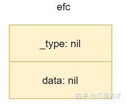
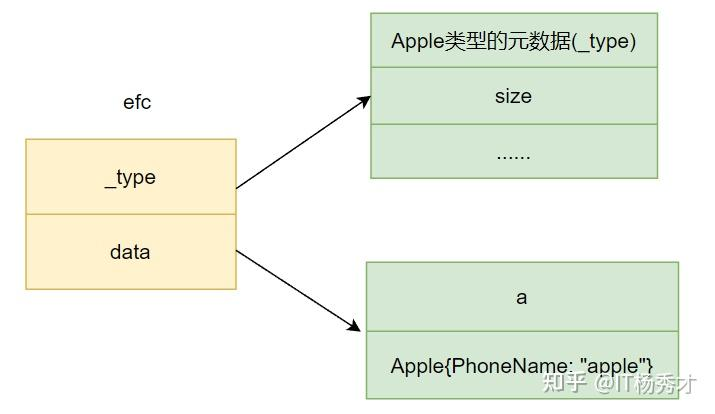
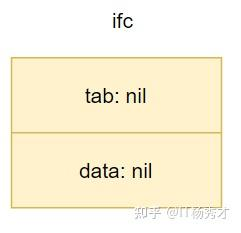
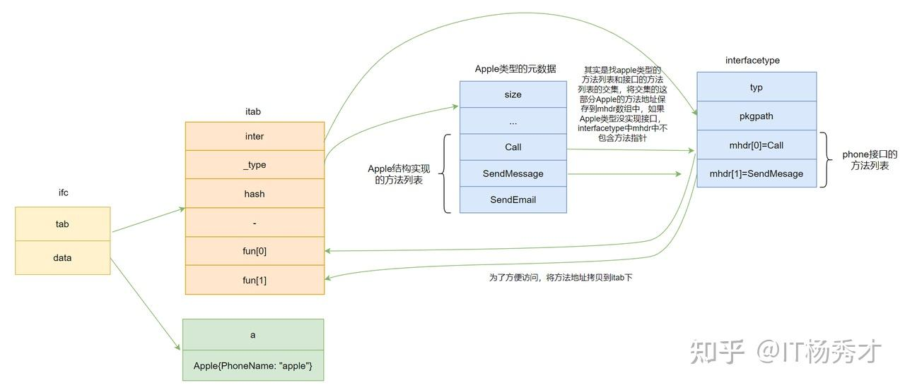
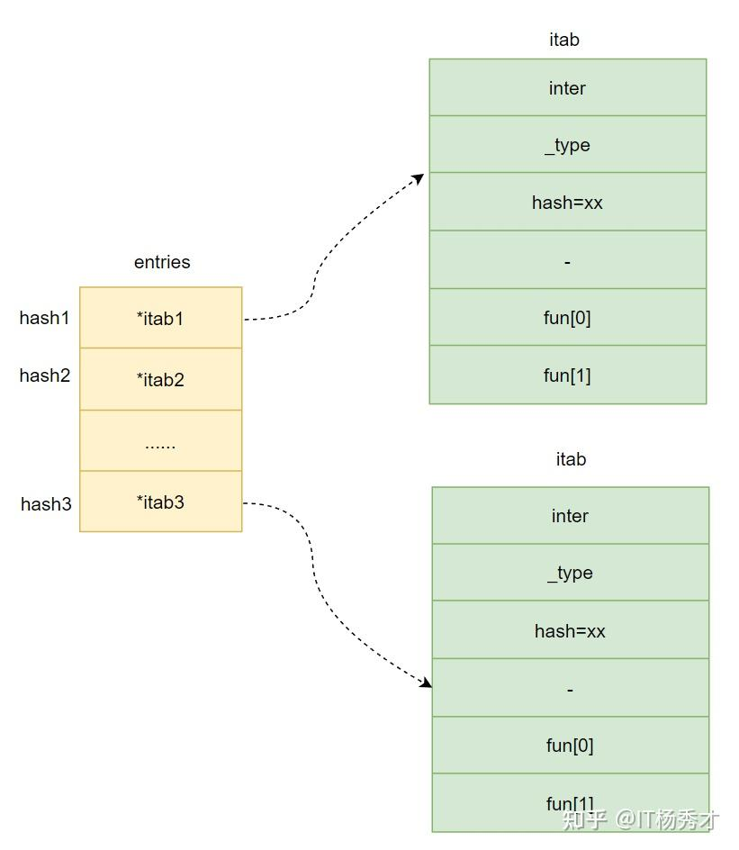

# ch1.Go语言探秘------interface 

 2025-04-12 15:15  
 [Go语言探秘——interface](https://zhuanlan.zhihu.com/p/5692726312) 
来自专栏 · go语言那些事儿
  
Go语言并非传统意义上的面向对象的语言，他不像Java或者c++一样有类，继承等一些特性，但是我们也可以借助Go语言中的`struct`和`interface` 来实现这种面向对象的编程。在学习Go语言的基础语法的时候我们了解到Go语言中`interface`其实就是一组方法的声明，任何类型的对象实现了接口的全部方法就是这个接口的一个实现。本文我们主要分析一下`interface`的底层实现。

## 1. interface的底层原理

## 1.1 空接口 

没有定义任何方法的接口为空接口，空接口可以接收任意数据类型，就是说可以将任意类型的数据赋值给一个空接口，空接口的结构定义位于`src/runtime/runtime2.go`,定义如下:
 
```go
type eface struct {
   _type *_type
   data  unsafe.Pointer
}
```
 

**_type：** 指向接口的动态类型元数据，即接口变量的类型\
**data：** 指向接口的动态值，data是一个指向变量本身的指针

### 1.1.1 \_type是什么

`_type`是Go语言里面所有类型的一个抽象，里面包含了类型的大小，哈希，对齐以及类型编号等信息，决定了`data`如何解释和操作，Go语言中几乎所有的数据结构都可以抽象成`_type`。关于`_type`的定义在源文件`src/runtime/type.go`,具体定义如下：
 
```go
type _type struct {
   size       uintptr // 数据类型占用的空间大小
   ptrdata    uintptr // 前缀持有所有指针的内存大小
   hash       uint32  // 类型的hash值
   tflag      tflag   // 信息标志
   align      uint8   // 这种类型在内存中的对齐方式
   fieldAlign uint8
   kind       uint8   // 类型编号
   equal func(unsafe.Pointer, unsafe.Pointer) bool  // 类型的比较函数
   gcdata    *byte
   str       nameOff
   ptrToThis typeOff
}
```
 

什么是动态类型和动态值呢，举个例子 
```go
package main

import "fmt"

type Apple struct {
   PhoneName string
}

func main() {

   a := Apple{PhoneName: "apple"}
   var efc interface{} 
   efc = a
   fmt.Println(efc) 
}
```
:::

这里在第`12`行定义了一个接口类型实例`efc`，此时还未对`efc`赋值，它的结构如下图所示：


 

在第`13`行，对`efc`赋值了一个`Apple`类型的变量之后，其底层结构表现如下图所示：


 

其中`_type`指针指向`a`变量的类型元数据，`data`指针指向`a`变量的值

## 1.2 非空接口! 

包含方法列表的接口就是非空接口，例如下面定义的接口`Phone`就是一个非空接口：
 
```go
type Phone interface {
   Call()
}
```
 

非空接口的底层实现按与空接口有所不同，因为其多了方法列表，在底层实现中显然我们需要有地方来存储方法列表，非空接口的结构定义位于`src/runtime/runtime2.go`,定义如下:
 
```go
type iface struct {
   tab  *itab
   data unsafe.Pointer
}
```
:::

**data：** 指向接口的动态值，这里跟空接口一样 **tab：**
指向一个`itab`的结构，`itab`结构里面存储值接口要求的方法列表和`data`对应动态类型信息

下面看一下`itab`的结构定义，`itab`结构定义在`src/runtime/runtime2.go`，定义如下：

 
``` text
type itab struct {
   inter *interfacetype
   _type *_type
   hash  uint32 // copy of _type.hash. Used for type switches.
   _     [4]byte
   fun   [1]uintptr // variable sized. fun[0]==0 means _type does not implement inter.
}
```
 
**inter：** 
指向`interfacetype`结构的指针，`interfacetype`结构记录了这个接口类型的描述信息，主要是接口的方法列表\
**_type：**
实际类型的指针，指向`_type`结构，`_type`结构保存了接口的动态类型信息，跟空接口的`_type`一样，即赋值给这个接口的具体类型信息的元数据\
**hash：**
该类型的`hash`值，`itab`中的`hash`和`itab._type`中的`hash`相等，其实是从`itab._type`中拷贝出来的，目的是用于快速判断类型是否相等\
**fun：**
`fun`是一个指针数组，里面保存了实现了该接口的实际类型的方法(只包含接口中的方法)地址，这些方法地址实际上是从`interfacetype`结构中的`mhdr`拷贝出来的，为了在调用的时候快速定位到方法。如果该接口对应的动态类型没有实现接口的所有方法，那么`itab.fun[0]=0`，表示断言失败，该类型不能赋值给该接口

`interfacetype`保存了接口自身的元信息，下面看一下`interfacetype`结构

 
```go
type interfacetype struct {
   typ     _type   // 类型信息
   pkgpath name    // 包路径
   mhdr    []imethod  // 接口的方法列表
}
```
 

这里主要关注的是`mhdr`这个字段，定义的接口的方法里表就保存在`mhdr`数组里。
下面还是通过例子看一下，赋值一个非空接口对应的底层结构变化
 
```go
package main

import "fmt"

type Apple struct {
   PhoneName string
}

func (a Apple) Call() {
   fmt.Printf("%s有打电话功能\n", a.PhoneName)
}

func (a Apple) SendMessage() {
   fmt.Printf("%s有发短信功能\n", a.PhoneName)
}

func (a Apple) SendEmail() {
   fmt.Printf("%s有发邮件功能\n", a.PhoneName)
}

type Phone interface {
   Call()
   SendMessage()
}

func main() {
   a := Apple{PhoneName: "apple"}
   var ifc Phone
   ifc = a          
   fmt.Println(ifc)
```
 

在程序第`28`行，赋值之前，`ifc`的结构如下图所：

 

在第`29`行，给`ifc`赋值一个包含方法的结构体`a`之后，`ifc`的结构如下图：

 

赋值过程中，`data`指针其实还是和空接口一样指向具体类型值，这里指向变量`a`。`tab`指针则是指向`itab`这个结构体，`itab`结构创建的创建主要就分为3部分：

1.  `_type`字段保存接口的动态类型信息，本例中，`_type`指针指向`Apple`类型的元数据
2.  `inter`保存接口本身的一些信息，这里重要处理方法列表，本质上其实是求接口类型`(Phone)`和具体类型`(Apple)`的方法列表的交集，将具体类型`(Apple)`这部分交集的方法地址保存到`interfacetype`的`mhdr`数组中，假设具体类型`(Apple)`没有实现接口`(Phone)`，那么这里`mhdr`数组将不包含任何方法的指针
3.  最后再将`mhdr`数组中的方法地址拷贝到`itab`的`fun`数组中，方便调用方法的时候快速找到方法地址，如果具体类型`(Apple)`没有实现接口`(Phone)`，那么这里`itab.fun[0]=0`

### 1.2.1

通过前面的分析我们知道，在给一个非空接口赋值的时候，`itab`里面主要是保存具体类型的类型元数据和方法列表，但是我们在给接口赋值的时候，我们可以赋值多个类型相同的动态类型，比如我们可以由如下代码：
 
```go
 var ifc Phone
 a := Apple{PhoneName: "apple1"}
 b := Apple{PhoneName: "apple2"}
 C := Apple{PhoneName: "apple3"}
 ifc = a
 ifc = b
 ifc = c
```
 

同类型的接口多次赋值，虽然具体类型的值不同，但是他们的类型相同，方法列表也相同，显然这个`itab`结构体是可以被复用的，如果我们每次都创建一个新的`itab`的话，性能无疑会大大下降。所以可以把用到的`itab`结构体缓存起来，每个非空的`interface`的接口类型和具体类型就可以唯一确定一个类型的`itab`。

### 1.2.1.1 itabTable 

Go语言采用`itabTable`这个结构来缓存所有的`itab`结构，`itabTable`的结构定义在`src/runtime/iface.go`，定义如下：
 
```go
type itabTableType struct {
   size    uintptr              // entries数组的长度
   count   uintptr             // 当前数组中实际itab的数量
   entries [itabInitSize]*itab // 哈希表
}
```
 

`itabTable`实际用来存储`itab`结构的其实是这个`entries`结构，`entries`是一个`hash`表，`key`为接口类型与实际类型分别哈希后的异或值
 
```go
func itabHashFunc(inter *interfacetype, typ *_type) uintptr {    
    return uintptr(inter.typ.hash ^ typ.hash)
}
```
 
所以`key`为整形，所以在实现的时候，Go语言采用了空间换时间的思想，通过一个数组来实现，数组的每个元素为`itab`指针，其结构如下：

<figure data-size="normal">
<div>

</div>
</figure>
 
我们在查找一个`itab`是否存在的时候，

1.  先计算接口类型的哈希值`hash1`和实际类型的哈希值`hash2`
2.  `hash1`与`hash2`做异或运算得到最终哈希值`hash`
3.  在`entries`数组中找到下标为`hash`的位置
4.  如果能查询到对应的`itab`指针(这里需要比较接口类型和实际类型，因为可能出现产生`hash`冲突，槽位被占用的情况)，就直接拿来使用。若没有就要再创建，然后添加到`itabTable`中。

对于`hash`冲突问题，采用的是  开放地址法，根据计算的空位发现槽位被占用，则采用二次寻址法在数组后面寻找空位插入
 
 

================================================
================================================
================================================

=============================================================
# 2. golang中，struct对象是值类型，interface 是引用类型
golang中，struct对象是值类型，interface 是引用类型，解释下面的代码
```go
	var ifVoid01 interface{} = sType1{8, "8void"}
	fmt.Println("ifVoid01=", ifVoid01)

	var ifVoid02 interface{} = &sType1{9, "9void*"}
	fmt.Println("ifVoid02=", ifVoid02)
```

这段代码展示了Go语言中值类型和引用类型在接口中的不同表现。我来详细解释其中的机制：

### 代码解释

```go
var ifVoid01 interface{} = sType1{8, "8void"}
fmt.Println("ifVoid01=", ifVoid01)

var ifVoid02 interface{} = &sType1{9, "9void*"}
fmt.Println("ifVoid02=", ifVoid02)
```

### 关键点分析

1. **接口的底层结构**：
   - Go中的接口(`interface{}`)是一个二元组，包含：
     - `(动态类型, 动态值)`
     - 或 `(type, value)`

2. **`ifVoid01` 的情况**：
   - 动态类型：`sType1`（结构体值类型）
   - 动态值：`sType1{8, "8void"}` 的一个副本
   - 接口内部存储的是结构体的**值拷贝**

3. **`ifVoid02` 的情况**：
   - 动态类型：`*sType1`（结构体指针类型）
   - 动态值：指向 `sType1{9, "9void*"}` 的指针
   - 接口内部存储的是结构体的**引用**

### 内存模型对比

#### 值类型存储在接口中：
```
+----------------+      +----------------+
| ifVoid01       | ---> | sType1{8, "8void"} |
| (type: sType1) |      +----------------+
| (value: 副本)   |
+----------------+
```

#### 引用类型存储在接口中：
```
+----------------+      +----------------+      +----------------+
| ifVoid02       | ---> | *sType1指针    | ---> | sType1{9, "9void*"} |
| (type: *sType1) |      +----------------+      +----------------+
| (value: 指针)   |
+----------------+
```

### 行为差异

1. **修改行为**：
   - `ifVoid01`：修改接口中的值不会影响原始结构体
   - `ifVoid02`：修改接口中的值会影响原始结构体

2. **方法调用**：
   - `ifVoid01`：只能调用`sType1`的值接收者方法
   - `ifVoid02`：可以调用`sType1`的指针接收者和值接收者方法

### 完整示例

下面是一个更完整的示例，展示了值类型和引用类型在接口中的不同行为：
```go
package main

import "fmt"

type sType1 struct {
	a int
	b string
}

// 值接收者方法
func (s sType1) ValueReceiver() {
	s.a = 100 // 修改副本，不影响原始结构体
	fmt.Println("值接收者方法:", s)
}

// 指针接收者方法
func (s *sType1) PointerReceiver() {
	s.a = 200 // 修改原始结构体
	fmt.Println("指针接收者方法:", s)
}

func main() {
	// 值类型存储在接口中
	var ifVoid01 interface{} = sType1{8, "8void"}
	fmt.Println("ifVoid01 类型:", fmt.Sprintf("%T", ifVoid01))
	fmt.Println("ifVoid01 值:", ifVoid01)
	
	// 尝试调用方法
	if v, ok := ifVoid01.(sType1); ok {
		v.ValueReceiver()
		fmt.Println("调用后 ifVoid01:", ifVoid01) // 原始值不变
	}
	
	// 引用类型存储在接口中
	var ifVoid02 interface{} = &sType1{9, "9void*"}
	fmt.Println("\nifVoid02 类型:", fmt.Sprintf("%T", ifVoid02))
	fmt.Println("ifVoid02 值:", ifVoid02)
	
	// 尝试调用方法
	if p, ok := ifVoid02.(*sType1); ok {
		p.PointerReceiver()
		fmt.Println("调用后 ifVoid02:", ifVoid02) // 原始值被修改
	}
	
	// 接口类型断言
	fmt.Println("\n类型断言示例:")
	if v, ok := ifVoid02.(sType1); ok {
		fmt.Println("ifVoid02 是 sType1:", v)
	} else {
		fmt.Println("ifVoid02 不是 sType1")
	}
	
	if p, ok := ifVoid02.(*sType1); ok {
		fmt.Println("ifVoid02 是 *sType1:", p)
	} else {
		fmt.Println("ifVoid02 不是 *sType1")
	}
}
```


### 关键结论

1. **接口本身是值类型**：但它可以存储值类型或引用类型的数据
2. **类型决定行为**：接口内部存储的值类型或引用类型决定了后续操作的行为
3. **指针的优势**：
   - 避免大结构体的复制开销
   - 支持修改原始数据
   - 可以调用指针接收者方法

理解这些差异对于编写高效、正确的Go代码至关重要，尤其是在处理接口和结构体时。
