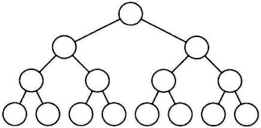

Go语言入门教程，Golang入门教程（非常详细）

<http://c.biancheng.net/golang/>
<https://www.kancloud.cn/imdszxs/golang/1535582>
<https://www.xinbaoku.com/archive/2DHvuPFr.html>

# 目录

[7.接口](l)

[7.1 Go语言接口声明（定义）](l)
    [7.1.1接口声明的格式](l)
    [7.1.2开发中常见的接口及写法](l)
[7.2 Go语言实现接口的条件](l)
    [7.2.1接口被实现的条件一：接口的方法与实现接口的类型方法格式一致](l)
    [7.2.2接口被实现的条件二：接口中所有方法均被实现](l)
[7.3 Go语言类型与接口的关系](l)
    [7.3.1一个类型可以实现多个接口 ](l)
    [7.3.2多个类型可以实现相同的接口 ](l)
[7.4 接口的nil判断](l)
    [1. Go语言接口简介](l)
    [2. Nil判断的作用](l)
    [3. 实例：接口的nil判断](l)

[7.5 Go语言 类型断言](l)

[7.6 示例：Go语言实现日志系统](l)
    [7.6.1日志对外接口](l)
    [7.6.2文件写入器](l)
    [7.6.3命令行写入器](l)
    [7.6.4使用日志](l)
[7.7 Go语言排序](l)
    [7.1.1使用sort.Interface接口进行排序](l)
    [7.1.2常见类型的便捷排序](l)
    [7.1.3对结构体数据进行排序](l)
[7.8 Go语言接口的嵌套组合](l)
    [7.8.1系统包中的接口嵌套组合](l)
    [7.8.2在代码中使用接口嵌套组合](l)

[7.9 Go语言接口和类型之间的转换](l)
    [7.9.1类型断言的格式](l)
    [7.9.2将接口转换为其他接口 ](l)
    [7.9.3将接口转换为其他类型](l)
[7.10 Go语言空接口类型](l)
    [7.10.1将值保存到空接口](l)
    [7.10.2从空接口获取值](l)
    [7.10.3空接口的值比较](l)
[7.11 示例：使用空接口实现可以保存任意值的字典](l)
    [7.11.1值设置和获取 ](l)
    [7.11.2遍历字段的所有键值关联数据 ](l)
    [7.11.3初始化和清除 ](l)
    [7.11.4使用字典](l)

[7.12 Go语言类型分支](l)
    [7.12.1类型断言的书写格式](l)
    [7.12.2使用类型分支判断基本类型](l)
    [7.12.3使用类型分支判断接口类型](l)

[7.13 Go语言error接口 ](l)
    [7.13.1error 基本用法](l)
    [7.13.2自定义错误类型 ](l)
[7.14 Go语言接口内部实现 ](l)
    [7.14.1数据结构 ](l)
    [7.14.2接口调用过程分析](l)
    [7.14.3接口调用代价](l)
    [7.14.4空接口数据结构](l)
[7.15 示例：表达式求值器](l)
[7.16 示例：简单的Web服务器](l)
    [7.16.1Web服务器的工作方式](l)
    [7.16.2搭建一个简单的 Web 服务器](l)
[7.17 部署Go语言程序到Linux服务器](l)
[7.18 示例：音乐播放器](l)
    [7.18.1音乐库](l)
    [7.18.2音乐播放](\l)
    [7.18.3主程序](\l)
    [7.18.4构建运行](\l)
    [7.18.5遗留问题](\l)
[7.19 示例：实现有限状态机（FSM）](\l)
    [7.19.1有限状态机的组成](\l)
    [7.19.2有限状态机的应用领域](\l)
    [7.19.3有限状态机的举例](\l)
    [7.19.4关于对 FSM 的封装](\l)
    [7.19.5总结](\l)
[7.20 示例：二叉树数据结构的应用](\l)
    [7.20.1树的定义和基本术语](\l)
    [7.20.2二叉树简介](\l)
    [7.20.3二叉树的链接存储结构](\l)
        [节点定义](\l)
        [接口定义](\l)
        [方法的实现](\l)
        [底层函数设计)](\l)
    [7.20.4二叉树基本应用测试](\l)

# 7.[接口](http://c.biancheng.net/golang/interface/)

Go语言接口（interface），Golang接口（interface）

------------------------------------------------------------------------

接口本身是调用方和实现方均需要遵守的一种协议，大家按照统一的方法命名参数类型和数量来协调逻辑处理的过程。  
  
Go 语言中使用组合实现对象特性的描述。对象的内部使用结构体内嵌组合对象应该具有的特性，对外通过接口暴露能使用的特性。  
  
Go 语言的接口设计是非侵入式的，接口编写者无须知道接口被哪些类型实现。而接口实现者只需知道实现的是什么样子的接口，但无须指明实现哪一个接口。编译器知道最终编译时使用哪个类型实现哪个接口，或者接口应该由谁来实现。

#### 其它编程语言中的接口

接口是一种较为常见的特性，很多语言都有接口特性。C/C++、C# 语言中的接口都可以多重派生实现接口组合；在苹果的 Objective C 中与接口类似的功能被称为 Protocol，这种叫法比接口更形象、具体。  
非侵入式设计是 Go 语言设计师经过多年的大项目经验总结出来的设计之道。只有**让接口和实现者真正解耦**，编译速度才能真正提高，项目之间的耦合度也会降低不少。

## 7.1 [Go语言接口声明（定义）](http://c.biancheng.net/view/77.html)

Go语言不是一种 “传统” 的面向对象编程语言：它里面没有类和继承的概念。  
  
但是Go语言里有非常灵活的接口概念，通过它可以实现很多面向对象的特性。很多面向对象的语言都有相似的接口概念，但Go语言中接口类型的独特之处在于它是满足隐式实现的。也就是说，我们没有必要对于给定的具体类型定义所有满足的接口类型；简单地拥有一些必需的方法就足够了。  
  
这种设计可以让你**创建一个新的接口类型**满足**已经存在的具体类型**却不会去改变这些类型的定义；当我们使用的类型来自于不受我们控制的包时这种设计尤其有用。  
  
接口类型是对其它类型行为的抽象和概括；因为接口类型不会和特定的实现细节绑定在一起，通过这种抽象的方式我们可以让我们的函数更加灵活和更具有适应能力。  
  
接口是双方约定的一种合作协议。接口实现者不需要关心接口会被怎样使用，调用者也不需要关心接口的实现细节。接口是一种类型，也是一种抽象结构，不会暴露所含数据的格式、类型及结构。

### 7.1.1接口声明的格式

每个接口类型由数个方法组成。接口的形式代码如下：

1.  type 接口类型名 interface{
2.      方法名1( 参数列表1 ) 返回值列表1
3.      方法名2( 参数列表2 ) 返回值列表2
4.      …
5.  }

对各个部分的说明：
- 接口类型名：使用 type 将接口定义为自定义的类型名。Go语言的接口在命名时，一般会在单词后面添加 er，如有写操作的接口叫 Writer，有字符串功能的接口叫 Stringer，有关闭功能的接口叫 Closer 等。

- 方法名：当方法名首字母是大写时，且这个接口类型名首字母也是大写时，这个方法可以被接口所在的包（package）之外的代码访问。
- 参数列表、返回值列表：参数列表和返回值列表中的参数变量名可以被忽略，例如：

1.  type writer interface{
2.      Write([]byte) error
3.  }

### 7.1.2开发中常见的接口及写法

Go语言提供的很多包中都有接口，例如 io 包中提供的 Writer 接口：

1.  type Writer interface {
2.      Write(p []byte) (n int, err error)
3.  }

这个接口可以调用 Write() 方法写入一个字节数组（[]byte），返回值告知写入字节数（n int）和可能发生的错误（err error）。  
  
类似的，还有将一个对象以字符串形式展现的接口，只要实现了这个接口的类型，在调用 String() 方法时，都可以获得对象对应的字符串。在 fmt 包中定义如下：

1.  type Stringer interface {
2.      String() string
3.  }

Stringer 接口在Go语言中的使用频率非常高，功能类似于 Java 或者 C# 语言里的 ToString 的操作。  
  
Go语言的每个接口中的方法数量不会很多。Go语言希望通过一个接口精准描述它自己的功能，而通过多个**接口的嵌入和组合**的方式将简单的接口扩展为复杂的接口。本章后面的小节中会介绍如何使用组合来扩充接口。

## 7.2 [Go语言实现接口的条件](http://c.biancheng.net/view/78.html)

如果一个任意类型 T 的方法集为一个接口类型的方法集的超集，则我们说类型 T 实现了此接口类型。T 可以是一个非接口类型，也可以是一个接口类型。  
  
**实现关系**在Go语言中是**隐式的**。两个类型之间的实现关系不需要在代码中显式地表示出来。Go语言中没有类似于 implements 的关键字。 Go编译器将自动在需要的时候检查两个类型之间的实现关系。  
  
接口定义后，需要实现接口，调用方才能正确编译通过并使用接口。接口的实现需要遵循两条规则才能让接口可用。

### 7.2.1接口被实现的条件一：接口的方法与实现接口的类型方法格式一致

在类型中添加与接口签名一致的方法就可以实现该方法。签名包括方法中的名称、参数列表、返回参数列表。也就是说，只要实现接口类型中的方法的名称、参数列表、返回参数列表中的任意一项与接口要实现的方法不一致，那么接口的这个方法就不会被实现。  
  
为了抽象数据写入的过程，定义 DataWriter 接口来描述数据写入需要实现的方法，接口中的 WriteData() 方法表示将数据写入，写入方无须关心写入到哪里。实现接口的类型实现 WriteData 方法时，会具体编写将数据写入到什么结构中。这里使用file结构体实现 DataWriter 接口的 WriteData 方法，方法内部只是打印一个日志，表示有数据写入，详细实现过程请参考下面的代码。  
  
数据写入器的抽象：

1.  package main

2.  

3.  import (

4.  "fmt"

5.  )

6.  

7.  // 定义一个数据写入器

8.  type DataWriter interface {

9.  WriteData(data interface{}) error

10. }

11. 

12. // 定义文件结构，用于实现DataWriter

13. type file struct {

14. }

15. 

16. // 实现DataWriter接口的WriteData方法

17. func (d *file) WriteData(data interface{}) error {

18. 

19. // 模拟写入数据

20. fmt.Println("WriteData:", data)

21. return nil

22. }

23. 

24. func main() {

25. 

26. // 实例化file

27. f := new(file)

28. 

29. // 声明一个DataWriter的接口

30. var writer DataWriter

31. 

32. // 将接口赋值f，也就是*file类型

33. writer = f

34. 

35. // 使用DataWriter接口进行数据写入

36. writer.WriteData("data")

37. }

代码说明如下：

- 第 8 行，定义 DataWriter 接口。这个接口只有一个方法，即 WriteData()，输入一个 interface{} 类型的 data，返回一个 error 结构表示可能发生的错误。

- 第 17 行，file 的 WriteData() 方法使用指针接收器。输入一个 interface{} 类型的 data，返回 error。

- 第 27 行，实例化 file 赋值给 f，f 的类型为 *file。

- 第 30 行，声明 DataWriter 类型的 writer 接口变量。

- 第 33 行，将 *file 类型的 f 赋值给 DataWriter 接口的 writer，虽然两个变量类型不一致。但是 writer 是一个接口，且 f 已经完全实现了 DataWriter() 的所有方法，因此赋值是成功的。

- 第 36 行，DataWriter 接口类型的 writer 使用 WriteData() 方法写入一个字符串。

运行代码，输出如下：

WriteData: data

本例中调用及实现关系如下图所示。

  
图：WriteWriter的实现过程

当类型无法实现接口时，编译器会报错，下面列出常见的几种接口无法实现的错误。

#### 1) 函数名不一致导致的报错

在以上代码的基础上尝试修改部分代码，造成编译错误，通过编译器的报错理解如何实现接口的方法。首先，修改 file 结构的 WriteData() 方法名，将这个方法签名（第17行）修改为：

1.  func (d *file) WriteDataX(data interface{}) error {

编译代码，报错：

cannot use f (type *file) as type DataWriter in assignment:  
        *file does not implement DataWriter (missing WriteData method)

报错的位置在第 33 行。报错含义是：不能将 f 变量（类型*file）视为 DataWriter 进行赋值。原因：*file 类型未实现 DataWriter 接口（丢失 WriteData 方法）。  
  
WriteDataX 方法的签名本身是合法的。但编译器扫描到第 33 行代码时，发现尝试将 *file 类型赋值给 DataWriter 时，需要检查 *file 类型是否完全实现了 DataWriter 接口。显然，编译器因为没有找到 DataWriter 需要的 WriteData() 方法而报错。

#### 2) 实现接口的方法签名不一致导致的报错

将修改的代码恢复后，再尝试修改 WriteData() 方法，把 data 参数的类型从 interface{} 修改为 int 类型，代码如下：

1.  func (d *file) WriteData(data int) error {

编译代码，报错：

cannot use f (type *file) as type DataWriter in assignment:  
        *file does not implement DataWriter (wrong type for WriteData method)  
                have WriteData(int) error  
                want WriteData(interface {}) error

这次未实现 DataWriter 的理由变为（错误的 WriteData() 方法类型）发现 WriteData(int)error，期望 WriteData(interface{})error。  
  
这种方式的报错就是由实现者的方法签名与接口的方法签名不一致导致的。

### 7.2.2接口被实现的条件二：接口中所有方法均被实现

当一个接口中有多个方法时，只有这些方法都被实现了，接口才能被正确编译并使用。  
  
在本节开头的代码中，为 DataWriter中 添加一个方法，代码如下：

1.  // 定义一个数据写入器

2.  type DataWriter interface {

3.  WriteData(data interface{}) error

4.  

5.  // 能否写入

6.  CanWrite() bool

7.  }

新增 CanWrite() 方法，返回 bool。此时再次编译代码，报错：

cannot use f (type *file) as type DataWriter in assignment:  
        *file does not implement DataWriter (missing CanWrite method)

需要在 file 中实现 CanWrite() 方法才能正常使用 DataWriter()。  
  
Go语言的接口实现是隐式的，无须让实现接口的类型写出实现了哪些接口。这个设计被称为非侵入式设计。  
  
实现者在编写方法时，无法预测未来哪些方法会变为接口。一旦某个接口创建出来，要求旧的代码来实现这个接口时，就需要修改旧的代码的派生部分，这一般会造成雪崩式的重新编译。

#### 提示

传统的派生式接口及类关系构建的模式，让类型间拥有强耦合的父子关系。这种关系一般会以“类派生图”的方式进行。经常可以看到大型软件极为复杂的派生树。随着系统的功能不断增加，这棵“派生树”会变得越来越复杂。  
  
对于Go语言来说，非侵入式设计让实现者的所有类型均是平行的、组合的。如何组合则留到使用者编译时再确认。因此，使用GO语言时，不需要同时也不可能有“类派生图”，开发者唯一需要关注的就是“我需要什么？”，以及“我能实现什么？”。

## 7.3 [Go语言类型与接口的关系](http://c.biancheng.net/view/79.html)

在Go语言中类型和接口之间有一对多和多对一的关系，下面将列举出这些常见的概念，以方便读者理解接口与类型在复杂环境下的实现关系。

### 7.3.1一个类型可以实现多个接口

一个类型可以同时实现多个接口，而接口间彼此独立，不知道对方的实现。  
  
网络上的两个程序通过一个双向的通信连接实现数据的交换，连接的一端称为一个 Socket。Socket 能够同时读取和写入数据，这个特性与文件类似。因此，开发中把文件和 Socket 都具备的读写特性抽象为独立的读写器概念。  
  
Socket 和文件一样，在使用完毕后，也需要对资源进行释放。  
  
把 Socket 能够写入数据和需要关闭的特性使用接口来描述，请参考下面的代码：

1.  type Socket struct {

2.  }

3.  

4.  func (s *Socket) Write(p []byte) (n int, err error) {

5.  return 0, nil

6.  }

7.  

8.  func (s *Socket) Close() error {

9.  return nil

10. }

Socket 结构的 Write() 方法实现了 io.Writer 接口：

1.  type Writer interface {

2.  Write(p []byte) (n int, err error)

3.  }

同时，Socket 结构也实现了 io.Closer 接口：

1.  type Closer interface {

2.  Close() error

3.  }

使用 Socket 实现的 Writer 接口的代码，无须了解 Writer 接口的实现者是否具备 Closer 接口的特性。同样，使用 Closer 接口的代码也并不知道 Socket 已经实现了 Writer 接口，如下图所示。

  
图：接口的使用和实现过程

在代码中使用 Socket 结构实现的 Writer 接口和 Closer 接口代码如下：

1.  // 使用io.Writer的代码, 并不知道Socket和io.Closer的存在

2.  func usingWriter( writer io.Writer){

3.  writer.Write( nil )

4.  }

5.  

6.  // 使用io.Closer, 并不知道Socket和io.Writer的存在

7.  func usingCloser( closer io.Closer) {

8.  closer.Close()

9.  }

10. 

11. func main() {

12. 

13. // 实例化Socket

14. s := new(Socket)

15. 

16. usingWriter(s)

17. 

18. usingCloser(s)

19. }

usingWriter() 和 usingCloser() 完全独立，互相不知道对方的存在，也不知道自己使用的接口是 Socket 实现的。

### 7.3.2多个类型可以实现相同的接口

一个接口的方法，不一定需要由一个类型完全实现，接口的方法可以通过在类型中嵌入其他类型或者结构体来实现。也就是说，使用者并不关心某个接口的方法是通过一个类型完全实现的，还是通过多个结构嵌入到一个结构体中拼凑起来共同实现的。  
  
Service 接口定义了两个方法：一个是开启服务的方法（Start()），一个是输出日志的方法（Log()）。使用 GameService 结构体来实现 Service，GameService 自己的结构只能实现 Start() 方法，而 Service 接口中的 Log() 方法已经被一个能输出日志的日志器（Logger）实现了，无须再进行 GameService 封装，或者重新实现一遍。所以，选择将 Logger 嵌入到 GameService 能最大程度地避免代码冗余，简化代码结构。详细实现过程如下：

1.  // 一个服务需要满足能够开启和写日志的功能

2.  type Service interface {

3.  Start() // 开启服务

4.  Log(string) // 日志输出

5.  }

6.  

7.  // 日志器

8.  type Logger struct {

9.  }

10. 

11. // 实现Service的Log()方法

12. func (g *Logger) Log(l string) {

13. 

14. }

15. 

16. // 游戏服务

17. type GameService struct {

18. Logger // 嵌入日志器

19. }

20. 

21. // 实现Service的Start()方法

22. func (g *GameService) Start() {

23. }

代码说明如下：

- 第 2 行，定义服务接口，一个服务需要实现 Start() 方法和日志方法。

- 第 8 行，定义能输出日志的日志器结构。

- 第 12 行，为 Logger 添加 Log() 方法，同时实现 Service 的 Log() 方法。

- 第 17 行，定义 GameService 结构。

- 第 18 行，在 GameService 中嵌入 Logger 日志器，以实现日志功能。

- 第 22 行，GameService 的 Start() 方法实现了 Service 的 Start() 方法。

此时，实例化 GameService，并将实例赋给 Service，代码如下：

1.  var s Service = new(GameService)

2.  s.Start()

3.  s.Log(“hello”)

s 就可以使用 Start() 方法和 Log() 方法，其中，Start() 由 GameService 实现，Log() 方法由 Logger 实现。

## 7.4 [接口的nil判断](http://c.biancheng.net/view/vip_7328.html)

Go语言接口的nil判断

-------------------------------

[亲测学习网](http://www.qince.net/author/admin) • 2023年5月2日 上午4:17 • [Golang教程](http://www.qince.net/golang)

### 1. Go语言接口简介

Go语言是近年来较为流行的编程语言，在其语法中，提供了一种接口机制，实现了面向对象编程中的多态。在Go中，我们定义一个接口，然后让不同类型的数据实现这个接口，这样我们就可以使用不同的数据类型调用接口的方法，实现多态的效果。

### 2. Nil判断的作用

当我们使用Go语言接口时，需要注意到nil的特性。**在Go语言中，nil表示一个指针或引用类型没有指向任何实例，或者一个接口没有绑定实现**。当实现一个接口的时候，如果没有实现该接口的方法，我们可以将返回值设置为nil，表示该接口的方法不进行任何操作。

在使用接口时，我们需要注意接口变量是否是nil，如果是nil，调用接口中的方法会引起空指针异常。因此，我们需要在使用接口的时候，先进行nil判断。

### 3. 实例：接口的nil判断

以下为Go语言中一个使用接口的例子：

type Output interface {

Output()

}

type OutputData struct {

data string

}

func (o *OutputData) Output() {

println(o.data)

}

func Test(t *testing.T) {

var output Output

if rand.Intn(10) % 2 == 0 {

output = &OutputData{"first line"}

}

if output != nil {

output.Output()

}

}

在上面的例子中，我们使用了一个接口Output，并在OutputData中实现了它的方法。在Test函数中，首先定义了一个Output类型的变量output。通过随机的方式，将OutputData{"first line"}赋值给output变量。在调用Output接口的方法Output()之前，需要判断output是否为nil，否则调用Output()方法时会产生空指针异常。

在上述例子中，我们将OutputData{"first line"}赋值给了output变量。也可以不赋值，将output变量的值设为nil。这样，当执行if output != nil { output.Output() }时，会因为output为nil而不会执行。此外，在Go语言中，我们可以通过类型断言判断接口变量是否为某种类型。

总而言之，在使用Go语言接口时，需要注意对接口变量是否为nil的判断，避免因此出现空指针异常。

## 7.5 [Go语言 类型断言](http://c.biancheng.net/view/4281.html)

Go语言类型断言简述

---------------------------------

**类型断言（Type Assertion）**是一个**使用在接口值上的操作**，用于检查接口类型变量所持有的值是否实现了期望的接口或者具体的类型。  
  
在Go语言中类型断言的语法格式如下：
value, ok := x.(T)
其中，x 表示一个接口的类型，T 表示一个具体的类型（也可为接口类型）。   

该断言表达式会返回 x 的值（也就是 value）和一个布尔值（也就是 ok），可根据该布尔值判断 x 是否为 T 类型：
- 如果 T 是具体某个类型，类型断言会检查 x 的动态类型是否等于具体类型 T。如果检查成功，类型断言返回的结果是 x 的动态值，其类型是 T。
- 如果 T 是接口类型，类型断言会检查 x 的动态类型是否满足 T。如果检查成功，x 的动态值不会被提取，返回值是一个类型为 T 的接口值。
- 无论 T 是什么类型，如果 x 是 nil 接口值，类型断言都会失败。

示例代码如下：
1.  package main
2.  
3.  import (
4.  "fmt"
5.  )
6.  
7.  func main() {
8.      var x interface{}
9.      x = 10
10.     value, ok := x.(int)
11.     fmt.Print(value, ",", ok)
12. }

运行结果如下：
10,true

需要**注意**如果不接收第二个参数也就是上面代码中的 ok，断言失败时会直接造成一个 panic。如果 x 为 nil 同样也会 panic。  
  
示例代码如下：

1.  package main
2.  
3.  import (
4.  "fmt"
5.  )
6.  
7.  func main() {
8.      var x interface{}
9.      x = "Hello"
10.     value := x.(int)
11.     fmt.Println(value)
12. }

运行结果如下：
panic: interface conversion: interface {} is string, not int

类型断言还可以配合 switch 使用，示例代码如下：

1.  package main
2.  
3.  import (
4.  "fmt"
5.  )
6.  
7.  func main() {
8.      var a int
9.      a = 10
10.     getType(a)
11. }
12. 
13. func getType(a interface{}) {
14.     switch a.(type) {
15.     case int:
16.         fmt.Println("the type of a is int")
17.     case string:
18.         fmt.Println("the type of a is string")
19.     case float64:
20.         fmt.Println("the type of a is float")
21.     default:
22.         fmt.Println("unknown type")
23.     }
24. }

运行结果如下：
the type of a is int

## 7.6 [示例：Go语言实现日志系统](http://c.biancheng.net/view/vip_7329.html)

Go语言实现日志系统（支持多种输出方式）

-------------------------------------------------------------

日志可以用于查看和分析应用程序的运行状态。日志一般可以支持输出多种形式，如命令行、文件、网络等。

本例将搭建一个支持多种写入器的日志系统，可以自由扩展多种日志写入设备。

### 7.6.1日志对外接口

本例中定义一个日志写入器接口（LogWriter），要求写入设备必须遵守这个接口协议才能被日志器（Logger）注册。日志器有一个写入器的注册方法（Logger 的 RegisterWriter() 方法）。

日志器还有一个 Log() 方法，进行日志的输出，这个函数会将日志写入到所有已经注册的日志写入器（LogWriter）中，详细代码实现请参考下面的代码。

package main

// 声明日志写入器接口

type LogWriter interface {

Write(data interface{}) error

}

// 日志器

type Logger struct {

// 这个日志器用到的日志写入器

writerList []LogWriter

}

// 注册一个日志写入器

func (l *Logger) RegisterWriter(writer LogWriter) {

l.writerList = append(l.writerList, writer)

}

// 将一个data类型的数据写入日志

func (l *Logger) Log(data interface{}) {

// 遍历所有注册的写入器

for _, writer := range l.writerList {

// 将日志输出到每一个写入器中

writer.Write(data)

}

}

// 创建日志器的实例

func NewLogger() *Logger {

return &Logger{}

}

代码说明如下：  
第 4 行，声明日志写入器接口。这个接口可以被外部使用。日志的输出可以有多种设备，这个写入器就是用来实现一个日志的输出设备。  
第 9 行，声明日志器结构。日志器使用 writeList 记录输出到哪些设备上。  
第 15 行，使用日志器方法 RegisterWriter() 将一个日志写入器（LogWriter）注册到日志器（Logger）中。注册的意思就是将日志写入器的接口添加到 writeList 中。  
第 20 行，日志器的 Log() 方法可以将 interface{} 类型的 data 写入到注册过的日志写入器中。  
第 23 行，遍历日志器拥有的所有日志写入器。  
第 26 行，将本次日志的内容写入日志写入器。  
第 31 行，创建日志器的实例。

这个例子中，为了最大程度地展示接口的用法，仅仅只是将数据直接写入日志写入器中。复杂一些的日志器还可以将日期、级别等信息合并到数据中一并写入日志。

### 7.6.2文件写入器

文件写入器（fileWriter）是众多日志写入器（LogWriter）中的一种。文件写入器的功能是根据一个文件名创建日志文件（fileWriter 的 SetFile 方法）。在有日志写入时，将日志写入文件中。

文件写入器代码：

package main

import (

"errors"

"fmt"

"os"

)

// 声明文件写入器

type fileWriter struct {

file *os.File

}

// 设置文件写入器写入的文件名

func (f *fileWriter) SetFile(filename string) (err error) {

// 如果文件已经打开, 关闭前一个文件

if f.file != nil {

f.file.Close()

}

// 创建一个文件并保存文件句柄

f.file, err = os.Create(filename)

// 如果创建的过程出现错误, 则返回错误

return err

}

// 实现LogWriter的Write()方法

func (f *fileWriter) Write(data interface{}) error {

// 日志文件可能没有创建成功

if f.file == nil {

// 日志文件没有准备好

return errors.New("file not created")

}

// 将数据序列化为字符串

str := fmt.Sprintf("%vn", data)

// 将数据以字节数组写入文件中

_, err := f.file.Write([]byte(str))

return err

}

// 创建文件写入器实例

func newFileWriter() *fileWriter {

return &fileWriter{}

}

代码说明如下：

- 第 10 行，声明文件写入器，在结构体中保存一个文件句柄，以方便每次写入时操作。

- 第 15 行，文件写入器通过文件名创建文件，这里通过 SetFile 的参数提供一个文件名，并创建文件。

- 第 18 行，考虑到 SetFile() 方法可以被多次调用（函数可重入性），假设之前已经调用过 SetFile() 后再次调用，此时的 f.file 不为空，就需要关闭之前的文件，重新创建新的文件。

- 第 23 行，根据文件名创建文件，如果发生错误，通过 SetFile 的返回值返回。

- 第 30 行，fileWriter 的 Write() 方法实现了 LogWriter 接口的 Write() 方法。

- 第 33 行，如果文件没有准备好，文件句柄为 nil，此时使用 errors 包的 New() 函数返回一个错误对象，包含一个字符串“file not created”。

- 第 40 行，通过 Write() 方法传入的 data 参数是 interface{} 类型，而 f.file 的 Write() 方法需要的是 []byte 类型。使用 fmt.Sprintf 将 data 转换为字符串，这里使用的格式化参数是%v，意思是将 data 按其本来的值转换为字符串。

- 第 43 行，通过 f.file 的 Write() 方法，将 str 字符串转换为 []byte 字节数组，再写入到文件中。如果发生错误，则返回。

在操作文件时，会出现文件无法创建、无法写入等错误。开发中尽量不要忽略这些底层报出的错误，应该处理可能发生的所有错误。

文件使用完后，要注意使用 os.File 的 Close() 方法进行及时关闭，否则文件再次访问时会因为其属性出现无法读取、无法写入等错误。

#### 提示

一个完备的文件写入器会提供多种写入文件的模式，例子中使用的模式是将日志添加到日志文件的尾部。随着文件越来越大，文件的访问效率和查看便利性也会大大降低。此时，就需要另外一种写入模式：滚动写入文件。

滚动写入文件模式也是将日志添加到文件的尾部，但当文件达到设定的期望大小时，会自动开启一个新的文件继续写入文件，最终将获得多个日志文件。

日志文件名不仅可以按照文件大小进行分割，还可以按照日期范围进行分割。在到达设定的日期范围，如每天、每小时的周期范围时，日志器会自动创建新的日志文件。这种日志文件创建方法也能方便开发者按日志查看日志。

### 7.6.3命令行写入器

在 UNIX 的思想中，一切皆文件。文件包括内存、磁盘、网络和命令行等。这种抽象方法方便我们访问这些看不见摸不着的虚拟资源。命令行在Go语言中也是一种文件，os.Stdout 对应标准输出，一般表示屏幕，也就是命令行，也可以被重定向为打印机或者磁盘文件；os.Stderr 对应标准错误输出，一般将错误输出到日志中，不过大多数情况，os.Stdout 会与 os.Stderr 合并输出；os.Stdin 对应标准输入，一般表示键盘。os.Stdout、os.Stderr、os.Stdin 都是 *os.File 类型，和文件一样实现了 io.Writer 接口的 Write() 方法。

下面的代码展示如何将命令行抽象为日志写入器：

package main

import (

"fmt"

"os"

)

// 命令行写入器

type consoleWriter struct {}

// 实现LogWriter的Write()方法

func (f *consoleWriter) Write(data interface{}) error {

// 将数据序列化为字符串

str := fmt.Sprintf("%v\n", data)

// 将数据以字节数组写入命令行中

_, err := os.Stdout.Write([]byte(str))

return err

}

// 创建命令行写入器实例

func newConsoleWriter() *consoleWriter {

return &consoleWriter{}

}

代码说明如下：

- 第 9 行，声明 consoleWriter 结构，以实现命令行写入器。

- 第 13 行，consoleWriter 的 Write() 方法实现了日志写入接口（LogWriter）的 Write() 方法。

- 第 16 行，与 fileWriter 类似，这里也将 data 通过 fmt.Sprintf 序列化为字符串。

- 第 19 行，与 fileWriter 类似，这里也将 str 字符串转换为字节数组并写入标准输出 os.Stdout。写入后的内容就会显示在命令行中。

- 第 25 行，创建命令行写入器的实例。

除了命令行写入器（consoleWriter）和文件写入器（fileWriter），读者还可以自行使用 net 包中的 Socket 封装实现网络写入器socketWriter，让日志可以写入远程的服务器中或者可以跨进程进行日志保存和分析。

### 7.6.4使用日志

在程序中使用日志器一般会先通过代码创建日志器（Logger），为日志器添加输出设备（fileWriter、consoleWriter等）。这些设备中有一部分需要一些参数设定，如文件日志写入器需要提供文件名（fileWriter 的 SetFile() 方法）。

下面代码中展示了使用日志器的过程：

package main

import "fmt"

// 创建日志器

func createLogger() *Logger {

// 创建日志器

l := NewLogger()

// 创建命令行写入器

cw := newConsoleWriter()

// 注册命令行写入器到日志器中

l.RegisterWriter(cw)

// 创建文件写入器

fw := newFileWriter()

// 设置文件名

if err := fw.SetFile("log.log"); err != nil {

fmt.Println(err)

}

// 注册文件写入器到日志器中

l.RegisterWriter(fw)

return l

}

func main() {

// 准备日志器

l := createLogger()

// 写一个日志

l.Log("hello")

}

代码说明如下：

- 第 6 行，一个创建日志的过程。这个过程一般隐藏在系统初始化中。程序启动时初始化一次。

- 第 9 行，创建一个日志器的实例，后面的代码会使用到它。

- 第 12 行，创建一个命令行写入器。如果全局有很多日志器，命令行写入器可以被共享，全局只会有一份。

- 第 18 行，创建一个文件写入器。一个程序的日志一般只有一个，因此不同的日志器也应该共享一个文件写入器。

- 第 21 行，创建好的文件写入器需要初始化写入的文件，通过文件名确定写入的文件。设置的过程可能会发生错误，发生错误时会输出错误信息。

- 第 26 行，将文件写入器注册到日志器中。

- 第 34 行，在程序一开始创建日志器。

- 第 37 行，往创建好的日志器中写入日志。

编译整个代码并运行，输出如下：

hello

同时，当前目录的 log.log 文件中也会出现 hello 字符。

#### 提示

Go语言的 log 包实现了一个小型的日志系统。这个日志系统可以在创建日志器时选择输出设备、日志前缀及 flag，函数定义如下：

func New(out io.Writer, prefix string, flag int) *Logger {

return &Logger{out: out, prefix: prefix, flag: flag}

}

在 flag 中，还可以定制日志中是否输出日期、日期精度和详细文件名等。

这个日志器在编写时，也最大程度地保证了输出的效率，如果读者对日志器的编写比较感兴趣，可以在 log 包的基础上进行扩展，形成方便自己使用的日志库。

## 7.7 [Go语言排序](http://c.biancheng.net/view/81.html)

Go语言排序（借助sort.Interface接口）

------------------------------------------------------

排序操作和字符串格式化一样是很多程序经常使用的操作。尽管一个最短的快排程序只要 15 行就可以搞定，但是一个健壮的实现需要更多的代码，并且我们不希望每次我们需要的时候都重写或者拷贝这些代码。  
  
幸运的是，sort 包内置的提供了根据一些排序函数来对任何序列排序的功能。它的设计非常独到。在很多语言中，排序算法都是和序列数据类型关联，同时排序函数和具体类型元素关联。  
  
相比之下，Go语言的 sort.Sort 函数不会对具体的序列和它的元素做任何假设。相反，它使用了一个接口类型 sort.Interface 来指定通用的排序算法和可能被排序到的序列类型之间的约定。这个接口的实现由序列的具体表示和它希望排序的元素决定，序列的表示经常是一个切片。  
  
一个内置的排序算法需要知道三个东西：序列的长度，表示两个元素比较的结果，一种交换两个元素的方式；这就是 sort.Interface 的三个方法：

1.  package sort

2.  type Interface interface {

3.  Len() int // 获取元素数量

4.  Less(i, j int) bool // i，j是序列元素的指数。

5.  Swap(i, j int) // 交换元素

6.  }

为了对序列进行排序，我们需要定义一个实现了这三个方法的类型，然后对这个类型的一个实例应用 sort.Sort 函数。思考对一个字符串切片进行排序，这可能是最简单的例子了。下面是这个新的类型 MyStringList  和它的 Len，Less 和 Swap 方法

1.  type MyStringList []string

2.  func (p MyStringList ) Len() int { return len(m) }

3.  func (p MyStringList ) Less(i, j int) bool { return m[i] < m[j] }

4.  func (p MyStringList ) Swap(i, j int) { m[i], m[j] = m[j], m[i] }

### 7.1.1使用sort.Interface接口进行排序

对一系列字符串进行排序时，使用字符串切片（[]string）承载多个字符串。使用 type 关键字，将字符串切片（[]string）定义为自定义类型 MyStringList。为了让 sort 包能识别 MyStringList，能够对 MyStringList 进行排序，就必须让 MyStringList 实现 sort.Interface 接口。  
  
下面是对字符串排序的详细代码（代码1）：

1.  package main

2.  

3.  import (

4.  "fmt"

5.  "sort"

6.  )

7.  

8.  // 将[]string定义为MyStringList类型

9.  type MyStringList []string

10. 

11. // 实现sort.Interface接口的获取元素数量方法

12. func (m MyStringList) Len() int {

13. return len(m)

14. }

15. 

16. // 实现sort.Interface接口的比较元素方法

17. func (m MyStringList) Less(i, j int) bool {

18. return m[i] < m[j]

19. }

20. 

21. // 实现sort.Interface接口的交换元素方法

22. func (m MyStringList) Swap(i, j int) {

23. m[i], m[j] = m[j], m[i]

24. }

25. 

26. func main() {

27. 

28. // 准备一个内容被打乱顺序的字符串切片

29. names := MyStringList{

30. "3. Triple Kill",

31. "5. Penta Kill",

32. "2. Double Kill",

33. "4. Quadra Kill",

34. "1. First Blood",

35. }

36. 

37. // 使用sort包进行排序

38. sort.Sort(names)

39. 

40. // 遍历打印结果

41. for _, v := range names {

42. fmt.Printf("%sn", v)

43. }

44. 

45. }

代码输出结果：

1. First Blood  
2. Double Kill  
3. Triple Kill  
4. Quadra Kill  
5. Penta Kill

代码说明如下：

- 第 9 行，接口实现不受限于结构体，任何类型都可以实现接口。要排序的字符串切片 []string 是系统定制好的类型，无法让这个类型去实现 sort.Interface 排序接口。因此，需要将 []string 定义为自定义的类型。

- 第 12 行，实现获取元素数量的 Len() 方法，返回字符串切片的元素数量。

- 第 17 行，实现比较元素的 Less() 方法，直接取 m 切片的 i 和 j 元素值进行小于比较，并返回比较结果。

- 第 22 行，实现交换元素的 Swap() 方法，这里使用Go语言的多变量赋值特性实现元素交换。

- 第 29 行，由于将 []string 定义成 MyStringList 类型，字符串切片初始化的过程等效于下面的写法：

- 1.  names := []string {

  2.  "3. Triple Kill",

  3.  "5. Penta Kill",

  4.  "2. Double Kill",

  5.  "4. Quadra Kill",

  6.  "1. First Blood",

  7.  }

- 第 38 行，使用 sort 包的 Sort() 函数，将 names（MyStringList类型）进行排序。排序时，sort 包会通过 MyStringList 实现的 Len()、Less()、Swap() 这 3 个方法进行数据获取和修改。

- 第 41 行，遍历排序好的字符串切片，并打印结果。

### 7.1.2常见类型的便捷排序

通过实现 sort.Interface 接口的排序过程具有很强的可定制性，可以根据被排序对象比较复杂的特性进行定制。例如，需要多种排序逻辑的需求就适合使用 sort.Interface 接口进行排序。但大部分情况中，只需要对字符串、整型等进行快速排序。Go语言中提供了一些固定模式的封装以方便开发者迅速对内容进行排序。

#### 1) 字符串切片的便捷排序

sort 包中有一个 StringSlice 类型，定义如下：

1.  type StringSlice []string

2.  

3.  func (p StringSlice) Len() int { return len(p) }

4.  func (p StringSlice) Less(i, j int) bool { return p[i] < p[j] }

5.  func (p StringSlice) Swap(i, j int) { p[i], p[j] = p[j], p[i] }

6.  

7.  // Sort is a convenience method.

8.  func (p StringSlice) Sort() { Sort(p) }

sort 包中的 StringSlice 的代码与 MyStringList 的实现代码几乎一样。因此，只需要使用 sort 包的 StringSlice 就可以更简单快速地进行字符串排序。将代码1中的排序代码简化后如下所示：

1.  names := sort.StringSlice{

2.  "3. Triple Kill",

3.  "5. Penta Kill",

4.  "2. Double Kill",

5.  "4. Quadra Kill",

6.  "1. First Blood",

7.  }

8.  

9.  sort.Sort(names)

简化后，只要两句代码就实现了字符串排序的功能。

#### 2) 对整型切片进行排序

除了字符串可以使用 sort 包进行便捷排序外，还可以使用 sort.IntSlice 进行整型切片的排序。sort.IntSlice 的定义如下：

1.  type IntSlice []int

2.  

3.  func (p IntSlice) Len() int { return len(p) }

4.  func (p IntSlice) Less(i, j int) bool { return p[i] < p[j] }

5.  func (p IntSlice) Swap(i, j int) { p[i], p[j] = p[j], p[i] }

6.  

7.  // Sort is a convenience method.

8.  func (p IntSlice) Sort() { Sort(p) }

sort 包在 sort.Interface 对各类型的封装上还有更进一步的简化，下面使用 sort.Strings 继续对代码1进行简化，代码如下：

1.  names := []string{

2.  "3. Triple Kill",

3.  "5. Penta Kill",

4.  "2. Double Kill",

5.  "4. Quadra Kill",

6.  "1. First Blood",

7.  }

8.  

9.  sort.Strings(names)

10. 

11. // 遍历打印结果

12. for _, v := range names {

13. fmt.Printf("%s\n", v)

14. }

代码说明如下：

- 第 1 行，需要排序的字符串切片。

- 第 9 行，使用 sort.Strings 直接对字符串切片进行排序。

#### 3) sort包内建的类型排序接口一览

Go语言中的 sort 包中定义了一些常见类型的排序方法，如下表所示。

|                             |                                |                              |                   |
|-----------------------------|--------------------------------|------------------------------|-------------------|
| sort 包中内建的类型排序接口 |                                |                              |                   |
| **类  型**                  | **实现 sort.lnterface 的类型** | **直接排序方法**             | **说  明**        |
| 字符串（String）            | StringSlice                    | sort.Strings(a [] string)  | 字符 ASCII 值升序 |
| 整型（int）                 | IntSlice                       | sort.Ints(a []int)         | 数值升序          |
| 双精度浮点（float64）       | Float64Slice                   | sort.Float64s(a []float64) | 数值升序          |

编程中经常用到的 int32、int64、float32、bool 类型并没有由 sort 包实现，使用时依然需要开发者自己编写。

### 7.1.3对结构体数据进行排序

除了基本类型的排序，也可以对结构体进行排序。结构体比基本类型更为复杂，排序时不能像数值和字符串一样拥有一些固定的单一原则。结构体的多个字段在排序中可能会存在多种排序的规则，例如，结构体中的名字按字母升序排列，数值按从小到大的顺序排序。一般在多种规则同时存在时，需要确定规则的优先度，如先按名字排序，再按年龄排序等。

#### 1) 完整实现sort.Interface进行结构体排序

将一批英雄名单使用结构体定义，英雄名单的结构体中定义了英雄的名字和分类。排序时要求按照英雄的分类进行排序，相同分类的情况下按名字进行排序，详细代码实现过程如下。  
  
结构体排序代码（代码2）：

1.  package main

2.  

3.  import (

4.  "fmt"

5.  "sort"

6.  )

7.  

8.  // 声明英雄的分类

9.  type HeroKind int

10. 

11. // 定义HeroKind常量, 类似于枚举

12. const (

13. None HeroKind = iota

14. Tank

15. Assassin

16. Mage

17. )

18. 

19. // 定义英雄名单的结构

20. type Hero struct {

21. Name string // 英雄的名字

22. Kind HeroKind // 英雄的种类

23. }

24. 

25. // 将英雄指针的切片定义为Heros类型

26. type Heros []*Hero

27. 

28. // 实现sort.Interface接口取元素数量方法

29. func (s Heros) Len() int {

30. return len(s)

31. }

32. 

33. // 实现sort.Interface接口比较元素方法

34. func (s Heros) Less(i, j int) bool {

35. 

36. // 如果英雄的分类不一致时, 优先对分类进行排序

37. if s[i].Kind != s[j].Kind {

38. return s[i].Kind < s[j].Kind

39. }

40. 

41. // 默认按英雄名字字符升序排列

42. return s[i].Name < s[j].Name

43. }

44. 

45. // 实现sort.Interface接口交换元素方法

46. func (s Heros) Swap(i, j int) {

47. s[i], s[j] = s[j], s[i]

48. }

49. 

50. func main() {

51. 

52. // 准备英雄列表

53. heros := Heros{

54. &Hero{"吕布", Tank},

55. &Hero{"李白", Assassin},

56. &Hero{"妲己", Mage},

57. &Hero{"貂蝉", Assassin},

58. &Hero{"关羽", Tank},

59. &Hero{"诸葛亮", Mage},

60. }

61. 

62. // 使用sort包进行排序

63. sort.Sort(heros)

64. 

65. // 遍历英雄列表打印排序结果

66. for _, v := range heros {

67. fmt.Printf("%+vn", v)

68. }

69. }

代码输出如下：

&{Name:关羽 Kind:1}  
&{Name:吕布 Kind:1}  
&{Name:李白 Kind:2}  
&{Name:貂蝉 Kind:2}  
&{Name:妲己 Kind:3}  
&{Name:诸葛亮 Kind:3}

代码说明如下：

- 第 9 行，将 int 声明为 HeroKind 英雄类型，后面会将这个类型当做枚举来使用。

- 第 13 行，定义一些英雄类型常量，可以理解为枚举的值。

- 第 26 行，为了方便实现 sort.Interface 接口，将 []*Hero 定义为 Heros 类型。

- 第 29 行，Heros 类型实现了 sort.Interface 的 Len() 方法，返回英雄的数量。

- 第 34 行，Heros 类型实现了 sort.Interface 的 Less() 方法，根据英雄字段的比较结果决定如何排序。

- 第 37 行，当英雄的分类不一致时，优先按分类的枚举数值从小到大排序。

- 第 42 行，英雄分类相等的情况下，默认根据英雄的名字字符升序排序。

- 第 46 行，Heros 类型实现了 sort.Interface 的 Swap() 方法，交换英雄元素的位置。

- 第 53～60 行，准备一系列英雄数据。

- 第 63 行，使用 sort 包进行排序。

- 第 66 行，遍历所有排序完成的英雄数据。

#### 2) 使用sort.Slice进行切片元素排序

从 Go 1.8 开始，Go语言在 sort 包中提供了 sort.Slice() 函数进行更为简便的排序方法。sort.Slice() 函数只要求传入需要排序的数据，以及一个排序时对元素的回调函数，类型为 func(i,j int)bool，sort.Slice() 函数的定义如下：

1.  func Slice(slice interface{}, less func(i, j int) bool)

使用 sort.Slice() 函数，对代码2重新优化的完整代码如下：

1.  package main

2.  

3.  import (

4.  "fmt"

5.  "sort"

6.  )

7.  

8.  type HeroKind int

9.  

10. const (

11. None = iota

12. Tank

13. Assassin

14. Mage

15. )

16. 

17. type Hero struct {

18. Name string

19. Kind HeroKind

20. }

21. 

22. func main() {

23. 

24. heros := []*Hero{

25. {"吕布", Tank},

26. {"李白", Assassin},

27. {"妲己", Mage},

28. {"貂蝉", Assassin},

29. {"关羽", Tank},

30. {"诸葛亮", Mage},

31. }

32. 

33. sort.Slice(heros, func(i, j int) bool {

34. if heros[i].Kind != heros[j].Kind {

35. return heros[i].Kind < heros[j].Kind

36. }

37. 

38. return heros[i].Name < heros[j].Name

39. })

40. 

41. for _, v := range heros {

42. fmt.Printf("%+vn", v)

43. }

44. }

第 33 行到第 39 行加粗部分是新添加的 sort.Slice() 及回调函数部分。对比前面的代码，这里去掉了 Heros 及接口实现部分的代码。  
  
使用 sort.Slice() 不仅可以完成结构体切片排序，还可以对各种切片类型进行自定义排序。

## 7.8 [Go语言接口的嵌套组合](http://c.biancheng.net/view/82.html)

在Go语言中，不仅结构体与结构体之间可以嵌套，接口与接口间也可以通过嵌套创造出新的接口。  
  
一个接口可以包含一个或多个其他的接口，这相当于直接将这些内嵌接口的方法列举在外层接口中一样。只要接口的所有方法被实现，则这个接口中的所有嵌套接口的方法均可以被调用。

### 7.8.1系统包中的接口嵌套组合

Go语言的 io 包中定义了写入器（Writer）、关闭器（Closer）和写入关闭器（WriteCloser）3 个接口，代码如下：

1.  type Writer interface {

2.  Write(p []byte) (n int, err error)

3.  }

4.  

5.  type Closer interface {

6.  Close() error

7.  }

8.  

9.  type WriteCloser interface {

10. Writer

11. Closer

12. }

代码说明如下：

- 第 1 行定义了写入器（Writer），如这个接口较为常用，常用于 I/O 设备的数据写入。

- 第 5 行定义了关闭器（Closer），如有非托管内存资源的对象，需要用关闭的方法来实现资源释放。

- 第 9 行定义了写入关闭器（WriteCloser），这个接口由 Writer 和 Closer 两个接口嵌入。也就是说，WriteCloser 同时拥有了 Writer 和 Closer 的特性。

### 7.8.2在代码中使用接口嵌套组合

在代码中使用 io.Writer、io.Closer 和 io.WriteCloser 这 3 个接口时，只需要按照接口实现的规则实现 io.Writer 接口和 io.Closer 接口即可。而 io.WriteCloser 接口在使用时，编译器会根据接口的实现者确认它们是否同时实现了 io.Writer 和 io.Closer 接口，详细实现代码如下：

1.  package main

2.  

3.  import (

4.  "io"

5.  )

6.  

7.  // 声明一个设备结构

8.  type device struct {

9.  }

10. 

11. // 实现io.Writer的Write()方法

12. func (d *device) Write(p []byte) (n int, err error) {

13. return 0, nil

14. }

15. 

16. // 实现io.Closer的Close()方法

17. func (d *device) Close() error {

18. return nil

19. }

20. 

21. func main() {

22. 

23. // 声明写入关闭器, 并赋予device的实例

24. var wc io.WriteCloser = new(device)

25. 

26. // 写入数据

27. wc.Write(nil)

28. 

29. // 关闭设备

30. wc.Close()

31. 

32. // 声明写入器, 并赋予device的新实例

33. var writeOnly io.Writer = new(device)

34. 

35. // 写入数据

36. writeOnly.Write(nil)

37. 

38. }

代码说明如下：

- 第 8 行定义了 device 结构体，用来模拟一个虚拟设备，这个结构会实现前面提到的 3 种接口。

- 第 12 行，实现了 io.Writer 的 Write() 方法。

- 第 17 行，实现了 io.Closer 的 Close() 方法。

- 第 24 行，对 device 实例化，由于 device 实现了 io.WriteCloser 的所有嵌入接口，因此 device 指针就会被隐式转换为 io.WriteCloser 接口。

- 第 27 行，调用了 wc（io.WriteCloser接口）的 Write() 方法，由于 wc 被赋值 *device，因此最终会调用 device 的 Write() 方法。

- 第 30 行，与 27 行类似，最终调用 device 的 Close() 方法。

- 第 33 行，再次创建一个 device 的实例，writeOnly 是一个 io.Writer 接口，这个接口只有 Write() 方法。

- 第 36 行，writeOnly 只能调用 Write() 方法，没有 Close() 方法。

为了整理思路，将上面的实现、调用关系使用图方式来展现，参见图 1 和图 2。  
  
1) io.WriteCloser的实现及调用过程如图 1 所示。

  
图1：io.WriteCloser 的实现及调用过程

2) io.Writer 的实现调用过程如图 2 所示。

  
图2：io.Write 的实现及调用过程

给 io.WriteCloser 或 io.Writer 更换不同的实现者，可以动态地切换实现代码。

## 7.9 [Go语言接口和类型之间的转换](http://c.biancheng.net/view/83.html)

Go语言中使用接口断言（type assertions）将接口转换成另外一个接口，也可以将接口转换为另外的类型。接口的转换在开发中非常常见，使用也非常频繁。

### 7.9.1类型断言的格式

类型断言是一个使用在接口值上的操作。语法上它看起来像 i.(T) 被称为断言类型，这里 i 表示一个接口的类型和 T 表示一个类型。一个类型断言检查它操作对象的动态类型是否和断言的类型匹配。  
  
类型断言的基本格式如下：
   t := i.(T)
其中，i 代表接口变量，T 代表转换的目标类型，t 代表转换后的变量。  
  
这里有两种可能。第一种，如果断言的类型 T 是一个具体类型，然后类型断言检查 i 的动态类型是否和 T 相同。如果这个检查成功了，类型断言的结果是 i 的动态值，当然它的类型是 T。换句话说，具体类型的类型断言从它的操作对象中获得具体的值。如果检查失败，接下来这个操作会抛出 panic。例如：

1.  var w io.Writer
2.  w = os.Stdout
3.  f := w.(*os.File) // 成功: f == os.Stdout
4.  c := w.(*bytes.Buffer) // 死机：接口保存*os.file，而不是*bytes.buffer

第二种，如果相反断言的类型 T 是一个接口类型，然后类型断言检查是否 i 的动态类型满足 T。如果这个检查成功了，动态值没有获取到；这个结果仍然是一个有相同类型和值部分的接口值，但是结果有类型 T。换句话说，对一个接口类型的类型断言改变了类型的表述方式，改变了可以获取的方法集合（通常更大），但是它保护了接口值内部的动态类型和值的部分。  
  
在下面的第一个类型断言后，w 和 rw 都持有 os.Stdout 因此它们每个有一个动态类型 *os.File，但是变量 w 是一个 io.Writer 类型只对外公开出文件的 Write 方法，然而 rw 变量也只公开它的 Read 方法。

1.  var w io.Writer
2.  w = os.Stdout
3.  rw := w.(io.ReadWriter) // 成功：*os.file具有读写功能
4.  w = new(ByteCounter)
5.  rw = w.(io.ReadWriter) // 死机：*字节计数器没有读取方法

如果断言操作的对象是一个 nil 接口值，那么不论被断言的类型是什么这个类型断言都会失败。几乎不需要对一个更少限制性的接口类型（更少的方法集合）做断言，因为它表现的就像赋值操作一样，除了对于 nil 接口值的情况。  
  
如果 i 没有完全实现 T 接口的方法，这个语句将会触发宕机。触发宕机不是很友好，因此上面的语句还有一种写法：
   t,ok := i.(T)

这种写法下，如果发生接口未实现时，将会把 ok 置为 false，t 置为 T 类型的 0 值。正常实现时，ok 为 true。这里 ok 可以被认为是：i 接口是否实现 T 类型的结果。

### 7.9.2将接口转换为其他接口

实现某个接口的类型同时实现了另外一个接口，此时可以在两个接口间转换。  
  
鸟和猪具有不同的特性，鸟可以飞，猪不能飞，但两种动物都可以行走。如果使用结构体实现鸟和猪，让它们具备自己特性的 Fly() 和 Walk() 方法就让鸟和猪各自实现了飞行动物接口（Flyer）和行走动物接口（Walker）。  
  
将鸟和猪的实例创建后，被保存到 interface{} 类型的 map 中。interface{} 类型表示空接口，意思就是这种接口可以保存为任意类型。对保存有鸟或猪的实例的 interface{} 变量进行断言操作，如果断言对象是断言指定的类型，则返回转换为断言对象类型的接口；如果不是指定的断言类型时，断言的第二个参数将返回 false。例如下面的代码：

1.  var obj interface = new(bird)
2.  f, isFlyer := obj.(Flyer)

代码中，new(bird) 产生 *bird 类型的 bird 实例，这个实例被保存在 interface{} 类型的 obj 变量中。使用 obj.(Flyer) 类型断言，将 obj 转换为 Flyer 接口。f 为转换成功时的 Flyer 接口类型，isFlyer 表示是否转换成功，类型就是 bool。  
  
下面是详细的代码（代码1）：

1.  package main
2.  
3.  import "fmt"
4.  
5.  // 定义飞行动物接口
6.  type Flyer interface {
7.      Fly()
8.  }
9.  
10. // 定义行走动物接口
11. type Walker interface {
12.     Walk()
13. }
14. 
15. // 定义鸟类
16. type bird struct {
17. }
18. 
19. // 实现飞行动物接口
20. func (b  *bird) Fly() {
21.     fmt.Println("bird: fly")
22. }
23. 
24. // 为鸟添加Walk()方法, 实现行走动物接口
25. func (b *bird) Walk() {
26. fmt.Println("bird: walk")
27. }
28. 
29. // 定义猪
30. type pig struct {
31. }
32. 
33. // 为猪添加Walk()方法, 实现行走动物接口
34. func (p *pig) Walk() {
35. fmt.Println("pig: walk")
36. }
37. 
38. func main() {
39. 
40.     // 创建动物的名字到实例的映射
41.     animals := map[string]interface{}{
42.         "bird": new(bird),
43.         "pig": new(pig),
44.     }
45. 
46.     // 遍历映射
47.     for name, obj := range animals {
48. 
49.         // 判断对象是否为飞行动物
50.         f, isFlyer := obj.(Flyer)
51.         // 判断对象是否为行走动物
52.         w, isWalker := obj.(Walker)
53. 
54.         fmt.Printf("name: %s isFlyer: %v isWalker: %v\n", name, isFlyer, isWalker)
55. 
56.         // 如果是飞行动物则调用飞行动物接口
57.         if isFlyer {
58.             f.Fly()
59.         }
60. 
61.         // 如果是行走动物则调用行走动物接口
62.         if isWalker {
63.             w.Walk()
64.         }
65.     }
66. }

代码说明如下：

- 第 6 行定义了飞行动物的接口。
- 第 11 行定义了行走动物的接口。
- 第 16 和 30 行分别定义了鸟和猪两个对象，并分别实现了飞行动物和行走动物接口。
- 第 41 行是一个 map，映射对象名字和对象实例，实例是鸟和猪。
- 第 47 行开始遍历 map，obj 为 interface{} 接口类型。
- 第 50 行中，使用类型断言获得 f，类型为 Flyer 及 isFlyer 的断言成功的判定。
- 第 52 行中，使用类型断言获得 w，类型为 Walker 及 isWalker 的断言成功的判定。
- 第 57 和 62 行，根据飞行动物和行走动物两者是否断言成功，调用其接口。

代码输出如下：

name: pig isFlyer: false isWalker: true  
pig: walk  
name: bird isFlyer: true isWalker: true  
bird: fly  
bird: walk

### 7.9.3将接口转换为其他类型

在代码 1 中，可以实现将接口转换为普通的指针类型。例如将 Walker 接口转换为 *pig 类型，请参考下面的代码：

1.  p1 := new(pig)
2.  
3.  var a Walker = p1
4.  p2 := a.(*pig)
5.  
6.  fmt.Printf("p1=%p p2=%p", p1, p2)

对代码的说明如下：
- 第 3 行，由于 pig 实现了 Walker 接口，因此可以被隐式转换为 Walker 接口类型保存于 a 中。
- 第 4 行，由于 a 中保存的本来就是 *pig 本体，因此可以转换为 *pig 类型。
- 第 6 行，对比发现，p1 和 p2 指针是相同的。

如果尝试将上面这段代码中的 Walker 类型的 a 转换为 *bird 类型，将会发出运行时错误，请参考下面的代码：
1.  p1 := new(pig)
2.  
3.  var a Walker = p1
4.  p2 := a.( *bird)

运行时报错：

panic: interface conversion: main.Walker is  *main.pig, not  *main.bird
报错意思是：接口转换时，main.Walker 接口的内部保存的是  *main.pig，而不是  *main.bird。    
因此，接口在转换为其他类型时，接口内保存的实例对应的类型指针，必须是要转换的对应的类型指针。

#### 总结

接口和其他类型的转换可以在Go语言中自由进行，前提是已经完全实现。  
  
接口断言类似于流程控制中的 if。但大量类型断言出现时，应使用更为高效的类型分支 switch 特性。

## 7.10 [Go语言空接口类型](http://c.biancheng.net/view/84.html)

Go语言空接口类型（interface{}）

--------------------------------------------

空接口是接口类型的特殊形式，空接口没有任何方法，因此任何类型都无须实现空接口。从实现的角度看，任何值都满足这个接口的需求。因此空接口类型可以保存任何值，也可以从空接口中取出原值。

#### 提示

空接口类型类似于 C# 或 Java 语言中的 Object、C语言中的 void*、C++ 中的 std::any。在泛型和模板出现前，空接口是一种非常灵活的数据抽象保存和使用的方法。  
  
空接口的内部实现保存了对象的类型和指针。使用空接口保存一个数据的过程会比直接用数据对应类型的变量保存稍慢。因此在开发中，应在需要的地方使用空接口，而不是在所有地方使用空接口。

### 7.10.1将值保存到空接口

空接口的赋值如下：

1.  var any interface{}

2.  

3.  any = 1

4.  fmt.Println(any)

5.  

6.  any = "hello"

7.  fmt.Println(any)

8.  

9.  any = false

10. fmt.Println(any)

代码输出如下：

1  
hello  
false

对代码的说明：

- 第 1 行，声明 any 为 interface{} 类型的变量。

- 第 3 行，为 any 赋值一个整型 1。

- 第 4 行，打印 any 的值，提供给 fmt.Println 的类型依然是 interface{}。

- 第 6 行，为 any 赋值一个字符串 hello。此时 any 内部保存了一个字符串。但类型依然是 interface{}。

- 第 9 行，赋值布尔值。

### 7.10.2从空接口获取值

保存到空接口的值，如果直接取出指定类型的值时，会发生编译错误，代码如下：

1.  // 声明a变量, 类型int, 初始值为1

2.  var a int = 1

3.  

4.  // 声明i变量, 类型为interface{}, 初始值为a, 此时i的值变为1

5.  var i interface{} = a

6.  

7.  // 声明b变量, 尝试赋值i

8.  var b int = i

第8行代码编译报错：

cannot use i (type interface {}) as type int in assignment: need type assertion

编译器告诉我们，不能将i变量视为int类型赋值给b。  
  
在代码第 15 行中，将 a 的值赋值给 i 时，虽然 i 在赋值完成后的内部值为 int，但 i 还是一个 interface{} 类型的变量。类似于无论集装箱装的是茶叶还是烟草，集装箱依然是金属做的，不会因为所装物的类型改变而改变。  
  
为了让第 8 行的操作能够完成，编译器提示我们得使用 type assertion，意思就是类型断言。  
  
使用类型断言修改第 8 行代码如下：

1.  var b int = i.(int)

修改后，代码可以编译通过，并且 b 可以获得 i 变量保存的 a 变量的值：1。

### 7.10.3空接口的值比较

空接口在保存不同的值后，可以和其他变量值一样使用==进行比较操作。空接口的比较有以下几种特性。

#### 1) 类型不同的空接口间的比较结果不相同

保存有类型不同的值的空接口进行比较时，Go语言会优先比较值的类型。因此类型不同，比较结果也是不相同的，代码如下：

1.  // a保存整型

2.  var a interface{} = 100

3.  

4.  // b保存字符串

5.  var b interface{} = "hi"

6.  

7.  // 两个空接口不相等

8.  fmt.Println(a == b)

代码输出如下：

false

#### 2) 不能比较空接口中的动态值

当接口中保存有动态类型的值时，运行时将触发错误，代码如下：

1.  // c保存包含10的整型切片

2.  var c interface{} = []int{10}

3.  

4.  // d保存包含20的整型切片

5.  var d interface{} = []int{20}

6.  

7.  // 这里会发生崩溃

8.  fmt.Println(c == d)

代码运行到第8行时发生崩溃：

panic: runtime error: comparing uncomparable type []int

这是一个运行时错误，提示 []int 是不可比较的类型。下表中列举出了类型及比较的几种情况。

|                   |                                                                           |
|-------------------|---------------------------------------------------------------------------|
| 类型的可比较性    |                                                                           |
| **类  型**        | **说  明**                                                                |
| map               | 宕机错误，不可比较                                                        |
| 切片（[]T）     | 宕机错误，不可比较                                                        |
| 通道（channel）   | 可比较，必须由同一个 make 生成，也就是同一个通道才会是 true，否则为 false |
| 数组（[容量]T） | 可比较，编译期知道两个数组是否一致                                        |
| 结构体            | 可比较，可以逐个比较结构体的值                                            |
| 函数              | 可比较                                                                    |

## 7.11 [示例：使用空接口实现可以保存任意值的字典](http://c.biancheng.net/view/vip_7330.html)

Go语言使用空接口实现可以保存任意值的字典

------------------------------------------------------------------------

空接口可以保存任何类型这个特性可以方便地用于容器的设计。下面例子使用 map 和 interface{} 实现了一个字典。字典在其他语言中的功能和 map 类似，可以将任意类型的值做成键值对保存，然后进行找回、遍历操作。详细实现过程请参考下面的代码。

package main

import "fmt"

// 字典结构

type Dictionary struct {

data map[interface{}]interface{} // 键值都为interface{}类型}

// 根据键获取值

func (d *Dictionary) Get(key interface{}) interface{} {

return d.data[key]}

// 设置键值

func (d *Dictionary) Set(key interface{}, value interface{}) {

d.data[key] = value}

// 遍历所有的键值，如果回调返回值为false，停止遍历

func (d *Dictionary) Visit(callback func(k, v interface{}) bool) {

if callback == nil {

return

}

for k, v := range d.data {

if !callback(k, v) {

return

}

}}

// 清空所有的数据

func (d *Dictionary) Clear() {

d.data = make(map[interface{}]interface{})}

// 创建一个字典

func NewDictionary() *Dictionary {

d := &Dictionary{}

// 初始化map

d.Clear()

return d}

func main() {

// 创建字典实例

dict := NewDictionary()

// 添加游戏数据

dict.Set("My Factory", 60)

dict.Set("Terra Craft", 36)

dict.Set("Don't Hungry", 24)

// 获取值及打印值

favorite := dict.Get("Terra Craft")

fmt.Println("favorite:", favorite)

// 遍历所有的字典元素

dict.Visit(func(key, value interface{}) bool {

// 将值转为int类型，并判断是否大于40

if value.(int) > 40 {

// 输出很贵

fmt.Println(key, "is expensive")

return true

}

// 默认都是输出很便宜

fmt.Println(key, "is cheap")

return true

})}

### 7.11.1值设置和获取

字典内部拥有一个 data 字段，其类型为 map。这个 map 的键和值都是 interface{} 类型，也就是实现任意类型关联任意类型。字典的值设置和获取通过 Set() 和 Get() 两个方法来完成，参数都是 interface{}。详细实现代码如下：

// 字典结构

type Dictionary struct {

data map[interface{}]interface{} // 键值都为interface{}类型

}

// 根据键获取值

func (d *Dictionary) Get(key interface{}) interface{} {

return d.data[key]

}

// 设置键值

func (d *Dictionary) Set(key interface{}, value interface{}) {

d.data[key] = value

}

代码说明如下：

- 第 3 行，Dictionary 的内部实现是一个键值均为 interface{} 类型的 map，map 也具备与 Dictionary 一致的功能。

- 第 8 行，通过 map 直接获取值，如果键不存在，将返回 nil。

- 第 13 行，通过 map 设置键值。

### 7.11.2遍历字段的所有键值关联数据

每个容器都有遍历操作。遍历时，需要提供一个回调返回需要遍历的数据。为了方便在必要时终止遍历操作，可以将回调的返回值设置为 bool 类型，外部逻辑在回调中不需要遍历时直接返回 false 即可终止遍历。

Dictionary 的 Visit() 方法需要传入回调函数，回调函数的类型为 func(k,v interface{})bool。每次遍历时获得的键值关联数据通过回调函数的 k 和 v 参数返回。Visit 的详细实现请参考下面的代码：

// 遍历所有的键值, 如果回调返回值为false, 停止遍历

func (d *Dictionary) Visit(callback func(k, v interface{}) bool) {

if callback == nil {

return

}

for k, v := range d.data {

if !callback(k, v) {

return

}

}

}

代码说明如下：

- 第 2 行，定义回调，类型为 func(k,v interface{})bool，意思是返回键值数据（k、v）。bool 表示遍历流程控制，返回 true 时继续遍历，返回 false 时终止遍历。

- 第 4 行，当 callback 为空时，退出遍历，避免后续代码访问空的 callback 而导致的崩溃。

- 第 8 行，遍历字典结构的 data 成员，也就是遍历 map 的所有元素。

- 第 9 行，根据 callback 的返回值，决定是否继续遍历。

### 7.11.3初始化和清除

字典结构包含有 map，需要在创建 Dictionary 实例时初始化 map。这个过程通过 Dictionary 的 Clear() 方法完成。在 NewDictionary 中调用 Clear() 方法避免了 map 初始化过程的代码重复问题。请参考下面的代码：

// 清空所有的数据

func (d *Dictionary) Clear() {

d.data = make(map[interface{}]interface{})}

// 创建一个字典

func NewDictionary() *Dictionary {

d := &Dictionary{}

// 初始化map

d.Clear()

return d

}

代码说明如下：

- 第 3 行，map 没有独立的复位内部元素的操作，需要复位元素时，使用 make 创建新的实例。Go语言的垃圾回收是并行的，不用担心 map 清除的效率问题。

- 第 7 行，实例化一个 Dictionary。

- 第 11 行，在初始化时调用 Clear 进行 map 初始化操作。

### 7.11.4使用字典

字典实现完成后，需要经过一个测试过程，查看这个字典是否存在问题。

将一些字符串和数值组合放入到字典中，然后再从字典中根据键查询出对应的值，接着再遍历一个字典中所有的元素。详细实现过程请参考下面的代码：

func main() {

// 创建字典实例

dict := NewDictionary()

// 添加游戏数据

dict.Set("My Factory", 60)

dict.Set("Terra Craft", 36)

dict.Set("Don't Hungry", 24)

// 获取值及打印值

favorite := dict.Get("Terra Craft")

fmt.Println("favorite:", favorite)

// 遍历所有的字典元素

dict.Visit(func(key, value interface{}) bool {

// 将值转为int类型, 并判断是否大于40

if value.(int) > 40 {

// 输出“很贵”

fmt.Println(key, "is expensive")

return true

}

// 默认都是输出“很便宜”

fmt.Println(key, "is cheap")

return true

})

}

代码说明如下：

- 第 4 行创建字典的实例。

- 第 7～9 行，将 3 组键值对通过字典的 Set() 方法设置到字典中。

- 第 12 行，根据字符串键查找值，将结果保存在 favorite 中。

- 第 13 行，打印 favorite 的值。

- 第 16 行，遍历字典的所有键值对。遍历的返回数据通过回调提供，key 是键，value 是值。

- 第 19 行，遍历返回的 key 和 value 的类型都是 interface{}，这里确认 value 只有 int 类型，所以将 value 转换为 int 类型判断是否大于 40。

- 第 23 和 29 行，继续遍历，返回 true

- 第 23 行，打印键。

运行代码，输出如下：

favorite: 36

My Factory is expensive

Terra Craft is cheap

Don't Hungry is cheap

## 7.12 [Go语言类型分支](http://c.biancheng.net/view/86.html)

Go语言类型分支（switch判断空接口中变量的类型）

--------------------------------------------------------------------------

type-switch 流程控制的语法或许是Go语言中最古怪的语法。 它可以被看作是类型断言的增强版。它和 switch-case 流程控制代码块有些相似。 一个 type-switch 流程控制代码块的语法如下所示：

1.  switch t := areaIntf.(type) {

2.  case *Square:

3.  fmt.Printf("Type Square %T with value %vn", t, t)

4.  case *Circle:

5.  fmt.Printf("Type Circle %T with value %v\n", t, t)

6.  case nil:

7.  fmt.Printf("nil value: nothing to check?\n")

8.  default:

9.  fmt.Printf("Unexpected type %T\n", t)

10. }

输出结构如下：

Type Square *main.Square with value &{5}

变量 t 得到了 areaIntf 的值和类型， 所有 case 语句中列举的类型（nil 除外）都必须实现对应的接口，如果被检测类型没有在 case 语句列举的类型中，就会执行 default 语句。  
  
如果跟随在某个 case 关键字后的条目为一个非接口类型（用一个类型名或类型字面表示），则此非接口类型必须实现了断言值 x 的（接口）类型。

### 7.12.1类型断言的书写格式

switch 实现类型分支时的写法格式如下：

1.  switch 接口变量.(type) {
2.  case 类型1:
3.  // 变量是类型1时的处理
4.  case 类型2:
5.  // 变量是类型2时的处理
6.  …
7.  default:
8.  // 变量不是所有case中列举的类型时的处理
9.  }

对各个部分的说明：
- 接口变量：表示需要判断的接口类型的变量。
- 类型1、类型2……：表示接口变量可能具有的类型列表，满足时，会指定 case 对应的分支进行处理。

### 7.12.2使用类型分支判断基本类型

下面的例子将一个 interface{} 类型的参数传给 printType() 函数，通过 switch 判断 v 的类型，然后打印对应类型的提示，代码如下：

1.  package main
2.  
3.  import (
4.      "fmt"
5.  )
6.  
7.  func printType(v interface{}) {
8.  
9.      switch v.(type) {
10.     case int:
11.         fmt.Println(v, "is int")
12.     case string:
13.         fmt.Println(v, "is string")
14.     case bool:
15.         fmt.Println(v, "is bool")
16.     }
17. }
18. 
19. func main() {
20.     printType(1024)
21.     printType("pig")
22.     printType(true)
23. }

代码输出如下：

1024 is int  
pig is string  
true is bool

代码第 9 行中，v.(type) 就是类型分支的典型写法。通过这个写法，在 switch 的每个 case 中写的将是各种类型分支。    
代码经过 switch 时，会判断 v 这个 interface{} 的具体类型从而进行类型分支跳转。    
switch 的 default 也是可以使用的，功能和其他的 switch 一致。

### 7.12.3使用类型分支判断接口类型

多个接口进行类型断言时，可以使用类型分支简化判断过程。  
  
现在电子支付逐渐成为人们普遍使用的支付方式，电子支付相比现金支付具备很多优点。例如，电子支付能够刷脸支付，而现金支付容易被偷等。使用类型分支可以方便地判断一种支付方法具备哪些特性，具体请参考下面的代码。  
  
电子支付和现金支付：

1.  package main

2.  

3.  import "fmt"

4.  

5.  // 电子支付方式

6.  type Alipay struct {

7.  }

8.  

9.  // 为Alipay添加CanUseFaceID()方法, 表示电子支付方式支持刷脸

10. func (a *Alipay) CanUseFaceID() {

11. }

12. 

13. // 现金支付方式

14. type Cash struct {

15. }

16. 

17. // 为Cash添加Stolen()方法, 表示现金支付方式会出现偷窃情况

18. func (a *Cash) Stolen() {

19. }

20. 

21. // 具备刷脸特性的接口

22. type CantainCanUseFaceID interface {

23. CanUseFaceID()

24. }

25. 

26. // 具备被偷特性的接口

27. type ContainStolen interface {

28. Stolen()

29. }

30. 

31. // 打印支付方式具备的特点

32. func print(payMethod interface{}) {

33. switch payMethod.(type) {

34. case CantainCanUseFaceID: // 可以刷脸

35. fmt.Printf("%T can use faceid\n", payMethod)

36. case ContainStolen: // 可能被偷

37. fmt.Printf("%T may be stolen\n", payMethod)

38. }

39. }

40. 

41. func main() {

42. 

43. // 使用电子支付判断

44. print(new(Alipay))

45. 

46. // 使用现金判断

47. print(new(Cash))

48. }

代码说明如下：

- 第 6～19 行，分别定义 Alipay 和 Cash 结构，并为它们添加具备各自特点的方法。

- 第 22～29 行，定义两种特性，即刷脸和被偷。

- 第 32 行，传入支付方式的接口。

- 第 33 行，使用类型分支进行支付方法的特性判断。

- 第 34～37 行，分别对刷脸和被偷的特性进行打印。

运行代码，输出如下：

*main.Alipay can use faceid  
*main.Cash may be stolen

## 7.13 [Go语言error接口](http://c.biancheng.net/view/4284.html)

Go语言error接口：返回错误信息

-------------------------------------------------

错误处理在每个编程语言中都是一项重要内容，通常开发中遇到的分为异常与错误两种，Go语言中也不例外。本节我们主要来学习一下Go语言中的错误处理。  
  
在C语言中通过返回 -1 或者 NULL 之类的信息来表示错误，但是对于使用者来说，如果不查看相应的 API 说明文档，根本搞不清楚这个返回值究竟代表什么意思，比如返回 0 是成功还是失败？  
  
针对这样的情况，Go语言中引入 error 接口类型作为错误处理的标准模式，如果函数要返回错误，则返回值类型列表中肯定包含 error。error 处理过程类似于C语言中的错误码，可逐层返回，直到被处理。

### 7.13.1error 基本用法

Go语言中返回的 error 类型究竟是什么呢？查看Go语言的源码就会发现 error 类型是一个非常简单的接口类型，如下所示：

1.  // The error built-in interface type is the conventional interface for

2.  // representing an error condition, with the nil value representing no error.

3.  type error interface {

4.  Error() string

5.  }

error 接口有一个签名为 Error() string 的方法，所有实现该接口的类型都可以当作一个错误类型。Error() 方法给出了错误的描述，在使用 fmt.Println 打印错误时，会在内部调用 Error() string 方法来得到该错误的描述。  
  
一般情况下，如果函数需要返回错误，就将 error 作为多个返回值中的最后一个（但这并非是强制要求）。  
  
创建一个 error 最简单的方法就是调用 errors.New 函数，它会根据传入的错误信息返回一个新的 error，示例代码如下：

1.  package main

2.  

3.  import (

4.  "errors"

5.  "fmt"

6.  "math"

7.  )

8.  

9.  func Sqrt(f float64) (float64, error) {

10. if f < 0 {

11. return -1, errors.New("math: square root of negative number")

12. }

13. return math.Sqrt(f), nil

14. }

15. 

16. func main() {

17. result, err := Sqrt(-13)

18. if err != nil {

19. fmt.Println(err)

20. } else {

21. fmt.Println(result)

22. }

23. }

运行结果如下：

math: square root of negative number

上面代码中简单介绍了使用 errors.New 来返回一个错误信息，与其他语言的异常相比，Go语言的方法相对更加容易、直观。

### 7.13.2自定义错误类型

除了上面的 errors.New 用法之外，我们还可以使用 error 接口自定义一个 Error() 方法，来返回自定义的错误信息。

1.  package main

2.  

3.  import (

4.  "fmt"

5.  "math"

6.  )

7.  

8.  type dualError struct {

9.  Num float64

10. problem string

11. }

12. 

13. func (e dualError) Error() string {

14. return fmt.Sprintf("Wrong!!!,because \\%f\\ is a negative number", e.Num)

15. }

16. 

17. func Sqrt(f float64) (float64, error) {

18. if f < 0 {

19. return -1, dualError{Num: f}

20. }

21. return math.Sqrt(f), nil

22. }

23. func main() {

24. result, err := Sqrt(-13)

25. if err != nil {

26. fmt.Println(err)

27. } else {

28. fmt.Println(result)

29. }

30. }

运行结果如下：

Wrong!!!,because "-13.000000" is a negative number

## 7.14 [Go语言接口内部实现](http://c.biancheng.net/view/vip_7331.html)

前几节我们介绍了接口的基本概念和用法，定义接口只需简单声明一个方法集合即可，定义新类型时不需要显式地声明要实现的接口，接口的使用也很简单。

那么接口的底层是如何实现的呢？如何实现动态调用的呢？接口的动态调用到底有多大的额外开销？本节我们就来深入讲解一下接口的底层实现。

阅读本节需要读者了解Go语言接口的基础知识和Go语言汇编基础和函数调用规约，以及对 ELF 可执行文件格式有基本了解。本节内容有点偏底层，有一定的难度，如果阅读起来有困难，可以先跳过去，有时间再慢慢读。

### 7.14.1数据结构

从前面章节了解到，接口变量必须初始化才有意义，没有初始化的接口变量的默认值是 nil，没有任何意义。具体类型实例传递给接口称为接口的实例化。在接口的实例化的过程中，编译器通过特定的数据结构描述这个过程。

首先介绍非空接口的内部数据结构，空接口的底层更简单，放到最后介绍。非空接口的底层数据结构是 iface，代码位于Go语言安装目录的 src/runtime/runtime2.go 文件中。

#### iface 数据结构

非空接口初始化的过程就是初始化一个 iface 类型的结构，示例如下：

//src/runtime/runtime2.go

type iface struct {

tab *itab //itab 存放类型及方法指针信息

data unsafe.Pointer //数据信息

}

可以看到 iface 结构很简单，有两个指针类型字段。

- itab：用来存放接口自身类型和绑定的实例类型及实例相关的函数指针，具体内容后面有详细介绍。

- 数据指针 data：指向接口绑定的实例的副本，接口的初始化也是一种值拷贝。

data 指向具体的实例数据，如果传递给接口的是值类型，则 data 指向的是实例的副本；如果传递给接口的是指针类型，则 data 指向指针的副本。总而言之，无论接口的转换，还是函数调用，Go 遵循一样的规则——值传递。

接下来看一下 itab 数据结构，itab 是接口内部实现的核心和基础。示例如下：

//src/runtime/runtime2.go

type itab struct {

inter *interfacetype //接口自身的静态类型

_type *_type //_type 就是接口存放的具体实例的类型（动态类型）

//hash 存放具体类型的 Hash 值

hash uint32 // copy of _type.hash. Used for type switches.

_ [4]byte

fun [1]uintptr // variable sized. fun[0]==0 means _type does not implement inter.

}

itab 有 5 个字段：

- inner：是指向接口类型元信息的指针。

- _type：是指向接口存放的具体类型元信息的指针，iface 里的 data 指针指向的是该类型的值。一个是类型信息，另一个是类型的值。

- hash：是具体类型的 Hash 值，_type 里面也有 hash，这里冗余存放主要是为了接口断言或类型查询时快速访问。

- fun：是一个函数指针，可以理解为C++对象模型里面的虚拟函数指针，这里虽然只有一个元素，实际上指针数组的大小是可变的，编译器负责填充，运行时使用底层指针进行访问，不会受 struct 类型越界检查的约束，这些指针指向的是具体类型的方法。

itab 这个数据结构是非空接口实现动态调用的基础，itab 的信息被编译器和链接器保存了下来，存放在可执行文件的只读存储段（.rodata）中。itab 存放在静态分配的存储空间中，不受 GC 的限制，其内存不会被回收。

接下来介绍 _type 数据结构，Go语言是一种强类型的语言，编译器在编译时会做严格的类型校验。所以 Go 必然为每种类型维护一个类型的元信息，这个元信息在运行和反射时都会用到，Go语言的类型元信息的通用结构是 _type（代码位于 src/runtime/type.go）， 其他类型都是以 _type 为内嵌宇段封装而成的结构体。

//src/runtime/type.go

type type struct {

size uintptr // 大小

ptrdata uintptr //size of memory prefix holding all pointers

hash uint32 //类型Hash

tflag tflag //类型的特征标记

align uint8 //_type 作为整体交量存放时的对齐字节数

fieldalign uint8 //当前结构字段的对齐字节数

kind uint8 //基础类型枚举值和反射中的 Kind 一致，kind 决定了如何解析该类型

alg *typeAlg //指向一个函数指针表，该表有两个函数，一个是计算类型 Hash 函

//数，另一个是比较两个类型是否相同的 equal 函数

//gcdata stores the GC type data for the garbage collector.

//If the KindGCProg bit is set in kind, gcdata is a GC program.

//Otherwise it is a ptrmask bitmap. See mbitmap.go for details.

gcdata *byte //GC 相关信息

str nameOff //str 用来表示类型名称字符串在编译后二进制文件中某个 section

//的偏移量

//由链接器负责填充

ptrToThis typeOff //ptrToThis 用来表示类型元信息的指针在编译后二进制文件中某个

//section 的偏移量

//由链接器负责填充

}

_type 包含所有类型的共同元信息，编译器和运行时可以根据该元信息解析具体类型、类型名存放位置、类型的 Hash 值等基本信息。

这里需要说明一下：＿type 里面的 nameOff 和 typeOff 最终是由链接器负责确定和填充的，它们都是一个偏移量（offset），类型的名称和类型元信息实际上存放在连接后可执行文件的某个段（section）里，这两个值是相对于段内的偏移量，运行时提供两个转换查找函数。例如：

//src/runtime/type.go

//获取 _type 的 name

func resolveNameOff(ptrInModule unsafe.Pointer , off nameOff) name {}

//获取 _type 的副本

func resolveTypeOff(ptrInModule unsafe.Pointer , off typeOff) *_type {}

> 注意：Go语言类型元信息最初由编译器负责构建，并以表的形式存放在编译后的对象文件中，再由链接器在链接时进行段合并、符号重定向（填充某些值）。这些类型信息在接口的动态调用和反射中被运行时引用。

接下来看一下接口的类型元信息的数据结构。示例如下：

//描述接口的类型

type interfacetype struct {

typ _type //类型通用部分

pkgpath name //接口所属包的名字信息， name 内存放的不仅有名称，还有描述信息

mhdr []imethod //接口的方法

}

//接口方法元信息

type imethod struct {

name nameOff //方法名在编译后的 section 里面的偏移量

ityp typeOff //方法类型在编译后的 section 里面的偏移量

}

### 7.14.2接口调用过程分析

前面讨论了接口内部的基本数据结构，下面就来通过跟踪接口实例化和动态调用过程，使用 Go 源码和反汇编代码相结合的方式进行研究。下面是一段非常简单的接口调用代码。

//iface.go

package main

type Caler interface {

Add (a , b int) int

Sub (a , b int) int

}

type Adder struct ｛id int }

//go:noinline

func (adder Adder) Add(a, b int) int { return a + b }

//go:noinline

func (adder Adder) Sub(a , b int) int { return a - b }

func main () {

var m Caler=Adder{id: 1234}

m.Add(10, 32)

}

生成汇编代码：

go build -gcflags= "-S - N -l" iface.go >iface.s 2>&1

接下来分析 main 函数的汇编代码，非关键逻辑已经去掉：

"".main STEXT size=151 args=0x0 locals=0x40

...

0x000f 00015 (src/iface.go:16) SUBQ $64, SP

0x0013 00019 (src/iface.go:16) MOVQ BP, 56(SP)

0x0018 00024 (src/iface.go:16) LEAQ 56(SP), BP

为 main 函数堆战开辟空间并保存原来的 BP 指针，这是函数调用前编译器的固定动作。

var m Caler = Adder {id: 1234} 语句汇编代码分析：

0x00ld 00029 (src/iface.go:17) MOVQ $0, ""..autotmp_1+32(SP)

0x0026 00038 (src/iface.go:17) MOVQ $1234, ""..autotmp_1+32(SP)

在堆上初始化局部对象 Adder，先初始化为 0，后初始化为 1234。

0x002f 00047 (src/iface.go:17) LEAQ go.itab."".Adder,"".Caler(SB),AX 0x0036 00054 (src/iface.go:17) MOVQ AX, (SP)

这两条语句非常关键，首先 LEAQ 指令是一个获取地址的指令，go.itab."".Adder,"".Caler(SB) 是一个全局符号引用，通过该符号能够获取接口初始化时 itab 数据结构的地址。

注意：这个标号在链接器链接的过程中会替换为具体的地址。我们知道 (SP) 里面存放的是指向 itab(Caler,Adder) 的元信息的地址，这里 (SP) 是函数调用第一个参数的位置。示例如下：

0x003a 00058 (src/iface.go:17) LEAQ ""..autotmp\\1+32(SP), AX

0x003f 00063 (src/iface.go:17) MOVQ AX, 8(SP)

0x0044 00068 (src/iface.go:17) PCDATA $0, $0

复制刚才的 Adder 类型对象的地址到 8(SP)，8(SP) 是函数调用的第二个参数位置。示例如下：

0x0044 00068 (src/iface.go:17) CALL runtime.convT2I64(SB)

runtime.convT2I64 函数是运行时接口动态调用的核心函数。runtime 中有一类这样的函数，看一下 runtime.convT2I64 的源码：

func convT2I64(tab *itab, elem unsafe.Pointer) (i iface) {

t := tab._type

if raceenabled {

raceReadObjectPC(t, elem, getcallerpc(unsafe.Pointer(&tab)), funcPC(convT2I64))

}

if msanenabled {

msanread (elem, t.size)

}

var x unsafe.Pointer

if *(uint64) (elem) == 0 {

x = unsafe.Pointer(&zeroVal[0])

} else {

x = mallocgc(8, t, false)

*(*uint64) (x) = *(*uint64) (elem)

}

i.tab = tab

i.data = x

Return

}

从上述源码可以清楚地看出，runtime.convT2I64 的两个参数分别是 *itab 和 unsafe.Pointer 类型，这两个参数正是上文传递进去的两个参数值：go.itab."".Adder, "".Caler(SB) 和指向 Adder 对象复制的指针。

runtime.convT2I64 的返回值是一个 iface 数据结构，其意义就是根据 itab 元信息和对象值复制的指针构建和初始化 iface 数据结构，iface 数据结构是实现接口动态调用的关键。至此己经完成了接口初始化的工作，即完成了 iface 数据结构的构建过程。下一步就是接口方法调用了。示例如下：

0x0049 00073 (src/iface.go:17) MOVQ 24(SP), AX

0x004e 00078 (src/iface.go:17) MOVQ 16(SP), CX

0x0053 00083 (src/iface.go:17 ) MOVQ CX, "".m+40(SP)

0x0058 00088 (src/iface.go:17 ) MOVQ AX, "".m+48(SP)

16(SP) 和 24(SP) 存放的是函数 runtime.convT2I64 的返回值，分别是指向 itab 和 data 的指针，将指向 itab 的指针复制到 40(SP)，将指向对象 data 的指针复制到 48(SP) 位置。

m.Add(10, 32) 对应的汇编代码如下：

0x00Sd 00093 (src/iface.go:18) MOVQ "".m+40(SP), AX

0x0062 00098 (src/iface.go:18) MOVQ 32(AX), AX

0x0066 00102 (src/iface.go:18) MOVQ "".m+48(SP), ex

0x006b 00107 (src/iface.go:18) MOVQ $10, 8(SP)

0x0074 00116 (src/iface.go:18) MOVQ $32, 16(SP)

0x007d 00125 (src/iface.go:18) MOVQ CX, (SP)

0x0081 00129 (src/iface.go:18) PCDATA $0, $0

0x0081 00129 (src/iface.go:18) CALL AX

第 1 条指令是将 itab 的指针（位于 40(SP)）复制到 AX 寄存器。第 2 条指令是 AX 将 itab 的偏移 32 字节的值复制到 AX。再来看一下 itab 的数据结构：

type itab struct {

inter *interfacetype

_type *type

link *itab

hash uint32 //copy of _type.hash.Used for type switches.

bad bool //type does not implement interface

inhash bool //has this itab been added to hash?

unused [2]byte

fun [1] uintptr //variable sized

}

32(AX) 正好是函数指针的位置， 即存放 Adder *Add() 方法指针的地址（注意：编译器将接收者为值类型的 Add 方法转换为指针的 Add 方法，编译器的这种行为是为了方便调用和优化）。

第 3 条指令和第 6 条指令是将对象指针作为接下来函数调用的第 1 个参数。

第 4 条和第 5 条指令是准备函数的第 2、第 3 个参数。

第 8 条指令是调用 Adder 类型的 Add 方法。

此函数调用时，对象的值的副本作为第 1 个参数，调用格式可以表述为func(reciver, param1, param2)。

至此，整个接口的动态调用完成。从中可以清楚地看到，接口的动态调用分为两个阶段：

- 第一阶段就是构建 iface 动态数据结构，这一阶段是在接口实例化的时候完成的，映射到 Go 语句就是var m Caler = Adder{id: 1234}。

- 第二阶段就是通过函数指针间接调用接口绑定的实例方法的过程，映射到 Go 语句就是 m.Add(10, 32)。

接下来看一下 go.itab. "".Adder, "".Caler(SB) 这个符号在哪里？我们使用 readelf 工具来静态地分析编译后的 ELF 格式的可执行程序。例如：

#编译

#go build -gcflag s= "-N -l" iface.go

#readelf -s -W iface legrep 'itab'

60:000000000047b220 0 OBJECT LOCAL DEFAULT 5 runtime.itablink

61:000000000047b230 0 OBJECT LOCAL DEFAULT 5 runtime.eitablink

88:00000000004aa100 48 OBJECT GLOBAL DEFAULT 8 go.itab.main.Adder, main.Caler

214:00000000004aa080 40 OBJECT GLOBAL DEFAULT 8 go.itab.runtime.errorString, error

418:00000000004095e0 1129 FUNC GLOBAL DEFAULT 1 runtime.getitab

419:0000000000409a50 1665 FUNC GLOBAL DEFAULT 1 runtime.additab

420:000000000040a0e0 257 FUNC GLOBAL DEFAULT 1 runtime.itabsinit

可以看到符号表里面 go.itab.main.Adder, main.Caler 对应本程序里面 itab 的元信息，它被存放在第 8 个段中。我们来看一下第 8 个段是什么段？

#readelf -S -W iface |egrep '＼[8 | I Nr'

[Nr Name Type Address Off Size ES Flg Lk Inf Al

8. noptrdata PROGBITS 00000000004aa000 OaaOOO 000a78 00 WA 0 0 32

可以看到这个接口动态转换的数据元信息存放在 .noptrdata 段中，它是由链接器负责初始化的。可以进一步使用 dd 工具读取井分析其内容，本书就不再继续深入这个细节，留给感兴趣的读者继续分析。

### 7.14.3接口调用代价

前面讨论了接口动态调用过程，这个过程有两部分多余时耗，一个是接口实例化的过程，也就是 iface 结构建立的过程，一旦实例化后，这个接口和具体类型的 itab 数据结构是可以复用的；另一个是接口的方法调用，它是一个函数指针的间接调用。

同时我们应考虑到接口调用是一种动态的计算后的跳转调用，这对现代的计算机 CPU 的执行很不友好，会导致 CPU 缓存失效和分支预测失败，这也有一部分的性能损失。当然最直接的办法就是对比测试，看看接口动态调用的性能损失到底有多大。

#### 测试用例

直接选用 GitHub 上的一个测试用例，稍作改写，代码如下。

package mainimport ( "testing")type identifier interface { idInline() int32 idNoInline() int32}type id32 struct{ id int32 }func (id *id32) idinline() int32 { return id.id }//go:noinlinefunc (id *id32) idNoinline() int32 { return id.id }var escapeMePlease *id32//主要作用是强制变量内存在 heap 上分配//go:noinlinefunc escapeToHeap(id *id32) identifier { escapeMePlease = id return escapeMePlease}//直接调用func BenchmarkMethodCall_direct(b *testing.B) { // var myID int32 b.Run("single/noinline", func(b *testing.B) { m := escapeToHeap(&id32{id: 6754}).(*id32) b.ResetTimer () for i :＝ 0; i ＜ b.N; i++ { //CALL "".(*id32).idNoinline(SB) //MOVL 8(SP), AX //MOVQ "".&myID+40(SP), CX //MOVL AX, (CX) myID = m.idNoInline() } } b.Run ("single/inline", func(b *testing.B) { m := escapeToHeap(＆id32{id: 6754}).(*id32) b.ResetTimer() for i: ＝ 0; i < b.N; i++ { //MOVL (DX), SI //MOVL SI, (CX) myID = m.idinline() } })}//接口调用func BenchmarkMethodCall_interface(b *testing.B) { // var myID int32 b.Run("single/noinline", func(b *testing.B) { m := escapeToHeap(＆id32{id: 6754}) b.ResetTimer() for i := 0; i < b.N ; i++ { // MOVQ 32(AX), CX // MOVQ "".m.data+40(SP), DX // MOVQ DX, (SP) // CALL CX // MOVL 8(SP), AX // MOVQ "".&myID+48(SP), CX // MOVL AX, (CX) myID = m.idNoInline() } }) b.Run("single/inline", func(b *testing.B) { m := escapeToHeap(&id32{id: 6754}) b.ResetTimer() for i := 0; i < b.N; i++ { //MOVQ 24(AX), CX //MOVQ "".m.data+40(SP), DX //MOVQ DX, (SP) //CALL CX //MOVL 8(SP), AX //MOVQ "". &myID+48(SP), ex //MOVL AX, (CX) myID = m.idinline() } })} //func main() {}

#### 测试过程和结果

//直接调用#go test -bench= 'BenchmarkMethodCall_direct/single/noinline' -cpu=1 -count=5 iface_bench_test.gogoos:linuxgoarch:amd64BenchmarkMethodCall_direct/single/noinline 2000000000 2.00 ns/opBenchmarkMethodCall_direct/single/noinline 2000000000 1.97 ns/opBenchmarkMethodCall_direct/single/noinline 2000000000 1.97 ns/opBenchmarkMethodCall_direct/single/noinline 2000000000 1.94 ns/opBenchmarkMethodCall_direct/single/noinline 2000000000 1.97 ns/opPASSok command-line-arguments 20.682s//接口调用#go test -bench='BenchmarkMethodCall_interface/single/noinline' －cpu=1 -count=5 iface_bench_test.gogoos:linuxgoarch:amd64BenchmarkMethodCall_interface/single/noinline 1000000000 2.18 ns/opBenchmarkMethodCall_interface/single/noinline 1000000000 2.16 ns/opBenchmarkMethodCall_interface/single/noinline 1000000000 2.17 ns/opBenchmarkMethodCall_interface/single/noinline 1000000000 2.15 ns/opBenchmarkMethodCall_interface/single/noinline 1000000000 2.16 ns/opPASSok command-line-arguments 11.930s

#### 结果分析

直接调用平均时耗为 1.97ns/op，接口调用的平均时耗为 2.16ns/op, (2.16-1.97)/1.97 约等于 9.64%。可以看到测试结果符合预期，每次迭代接口要慢 0.19ns，大约有 9% 的性能损失。

但是要清楚这个百分比并不能真实地反映接口的效率问题，首先调用的方法是一个很简单的方法，方法的耗时占比很小，无形中放大了接口调用的耗时。如果方法里面有复杂的逻辑，则真实的性能损失远远小于9%。

从绝对值的角度来看更合理，那就是每次接口调用大约比直接调用慢 0.2ns ，从这个角度看，动态调用的性能损失几乎可以忽略不计。

### 7.14.4空接口数据结构

前面我们了解到空接口 interface{} 是没有任何方法集的接口，所以空接口内部不需要维护和动态内存分配相关的数据结构 itab 。空接口只关心存放的具体类型是什么，具体类型的值是什么，所以空接口的底层数据结构也很简单，具体如下：

//go/src/runtime/runtime2.go//空接口type eface struct { _type *_type data unsafe.Pointer}

从 eface 的数据结构可以看出，空接口不是真的为空，其保留了具体实例的类型和值拷贝，即便存放的具体类型是空的，空接口也不是空的。

由于空接口自身没有方法集，所以空接口变量实例化后的真正用途不是接口方法的动态调用。空接口在Go语言中真正的意义是支持多态，有如下几种方式使用了空接口（将空接口类型还原）：

- 通过接口类型断言

- 通过接口类型查询

- 通过反射

至此，接口内部实现原理全部讲完，大家在了解和学习接口内部实现的知识的同时，更应该学习和思考分析过程中的方法和技巧，使用该方法可以继续分析接口断言、接口查询和接口赋值的内部实现机制。

## 7.15 [示例：表达式求值器](http://c.biancheng.net/view/vip_7332.html)

Go语言表达式求值器

------------------------------

在本节中，我们将创建简单算术表达式的一个求值器。我们将使用一个接口 Expr 来代表这种语言中的任意一个表达式。现在，这个接口没有任何方法，但稍后我们会逐个添加。

// Expr：算术表达式

type Expr interface{}

我们的表达式语言包括浮点数字面量，二元操作符 +、-、*、/，一元操作符 -x 和 +x，函数调用 pow(x,y)、sin(x) 和 sqrt(x)，变量（比如 x 和 pi），当然，还有圆括号和标准的操作符优先级。所有的值都是 float64 类型。下面是几个示例表达式：

sqrt(A / pi) pow(x, 3) + pow(y, 3) (F - 32) * 5 / 9

下面 5 种具体类型代表特定类型的表达式。Var 代表变量应用（很快我们将了解到为什么这个类型需要导岀）。literal 代表浮点数常量。unary 和 binary 类型代表有一个或者两个操作数的操作符表达式，而操作数则可以任意的 Expr。call 代表函数调用，这里限制它的 fn 字段只能是 pow、sin 和 sqrt。

// Var 表示一个变量，比如 x

type Var string

// literal 是一个数字常量，比如 3.141

type literal float64

// unary 表示一元操作符表达式，比如-x

type unary struct {

op rune // '+', '-' 中的一个

x Expr

}

// binary 表示二元操作符表达式，比如 x+y

type binary struct {

op rune // '+', '-', '*', '/' 中的一个

x, y Expr

}

// call 表示函数调用表达式，比如 sin(x)

type call struct {

fn string // one of "pow", "sin", "sqrt" 中的一个

args []Expr

}

要对包含变量的表达式进行求值，需要一个上下文 (environment) 来把变量映射到数值：

type Env map[Var]float64

我们还需要为每种类型的表达式定义一个 Eval 方法来返回表达式在一个给定上下文下的值。既然每个表达式都必须提供这个方法，那么可以把它加到 Expr 接口中。这个包只导出了类型 Expr、Env 和 Var。客户端可以在不接触其他表达式类型的情况下使用这个求值器。

type Expr interface {

// Eval 返回表达式在 env 上下文下的值

Eval(env Env) float64

}

下面是具体的 Eval 方法。Var 的 Eval 方法从上下文中查询结果，如果变量不存在则返回 0 literal 的 Eval 方法则直接返冋本身的值。

func (v Var) Eval(env Env) float64 {

return env[v]

}

func (l literal) Eval(_ Env) float64 {

return float64(l)

}

unary 和 binary 的 Eval 方法首先对它们的操作数递归求值，然后应用 op 操作。我们不把除以 0 或者无穷大当做错误（尽管它们生成的结果显然不是有穷数）。最后，call 方法先对 pow、sin 或者 sqrt 函数的参数求值，再调用 math 包中的对应函数。

func (u unary) Eval(env Env) float64 {

switch u.op {

case '+':

return +u.x.Eval(env)

case '-':

return -u.x.Eval(env)

}

panic(fmt.Sprintf("unsupported unary operator: %q", u.op))

}

func (b binary) Eval(env Env) float64 {

switch b.op {

case '+':

return b.x.Eval(env) + b.y.Eval(env)

case '-':

return b.x.Eval(env) - b.y.Eval(env)

case '*1:

return b.x.Eval(env) * b.y.Eval(env)

case '/':

return b.x.Eval(env) / b.y.Eval(env)

}

panic(fmt.Sprintf("unsupported binary operator: %q", b.op))

}

func (c call) Eval(env Env) float64 {

switch c.fn {

case "pow":

return math.Pow(c.args[0].Eval(env), c.args[1].Eval(env)

case "sin":

return math.Sin(c.args[0].Eval(erw))

case "sqrt":

return math.Sqrt(c.args[0].Eval(env))

}

panic(fmt.Sprintf("unsupported function call: %s", c.fn))

}

某些方法可能会失败，比如 call 表达式可能会遇到未知的函数，或者参数数量不对。也有可能用“!”或者“<”这类无效的操作符构造了一个 unary 或 binary 表达式（尽管后面的 Parse 函数不会产生这样的结果）。这些错误都会导致 Eval 崩溃。

其他错误（比如对一个上下文中没有定义的变量求值）仅会导致返回不正确的结果。所有这些错误都可以在求值之前做检查来发现。后面的 Check 方法就负责完成这个任务，但我们先测试 Eval。

下面的 TestEval 函数用于测试求值器，它使用 testing 包。我们知道调用 t.Errorf 来报告错误。这个函数遍历一个表格，表格中定义了三个表达式并为每个表达式准备了不同上下文。第一个表达式用于根据圆面积 A 求半径，第二个用于计算两个变量 x 和 y 的立方和，第三个把华氏温度 F 转为摄氏温度。

func TestEval(t *testing.T) {

tests := []struct {

expr string

env Env

want string

}{

{"sqrt(A / pi)", Env{"A": 87616, "pi": math.Pi}, "167"},

{"pow(x, 3) + pow(y, 3)", Env{"x": 12, "y": 1}, "1729"},

{"pow(x, 3) + pow(y, 3)", Env{"x": 9, "y": 10}, "1729"},

{"5/9 * (F - 32)", Env{"F": -40}, "-40"},

{"5/9 * (F - 32)", Env{"F": 32}, "0"},

{"5/9 * (F - 32)", Env{"F": 212}, "100"},

}

var prevExpr string

for _, test := range tests {

// 仅在表达式变更时才输出

if test.expr != prevExpr {

fmt.Printf("n%sn", test.expr)

prevExpr = test.expr

}

expr, err := Parse(test.expr)

if err != nil {

t.Error(err) // 解析出错

continue

}

got := fmt.Sprintf("%.6g", expr.Eval(test.env))

fmt.Printf("t%v => %sn", test.env, got)

if got != test.want {

t.Errorf("%s.Eval() in %v = %q, want %qn", test.expr, test.env, got, test.want)

}

}

}

对于表格中的每一行记录，该测试先解析表达式，在上下文中求值，再输出表达式。这里没有足够的空间来显示 Parse 函数，但可以通过 go get 来下载源码，自行查看。

go test 命令可用于运行包的测试：

$ go test -v gopl.io/ch7/eval

启用 -v 选项后可以看到测试的输出，通常情况下对于结果正确的测试输出就不显示了。下面就是测试中 fmt.Printf 语句输岀的内容。

sqrt(A / pi)

map\A:87616 pi:3.141592653589793\\ =\> 167

pow(x, 3) + pow(y, 3)

map[x:12 y:1] => 1729

map[x:9 y:10] => 1729 5 / 9 * (F - 32)

map[F:-40] => -40

map[F:32] => 0

map[F:212] => 100

幸运的是，到现在为止所有的输入都是合法的，但这种幸运是不能持久的。即使在解释性语言中，通过语法检查来发现静态错误（即不用运行程序也能检测出来的错误）也是很常见的。通过分离静态检查和动态检查，我们可以更快发现错误，也可以只在运行前检查一次，而不用在表达式求值时每次都检查。

让我们给 Expr 方法加上另外一个方法。Check 方法用于在表达式语法树上检查静态错误。它的 vars 参数将稍后解释。

type Expr interface {

Eval(env Env) float64

// Check 方法报告表达式中的错误，并把表达式中的变量加入 Vars 中

Check(vars map[Var]bool) error

}

具体的 Check 方法如下所示。literal 和 Var 的求值不可能出错，所以 Check 方法返回 nil。unary 和 binary 的方法首先检查操作符是否合法，再递归地检查操作数。类似地，call 的方法首先检查函数是否是已知的，然后检查参数个数是否正确，最后递归检查每个参数。

func (v Var) Check(vars map[Var]bool) error {

vars[v] = true

return nil

}

func (literal) Check(vars map[Var]bool) error {

return nil

}

func (u unary) Check(vars map[Var]bool) error {

if !strings.ContainsRune("+-", u.op) {

return fmt.Errorf("unexpected unary op %q", u.op)

}

return u.x.Check(vars)

}

func (b binary) Check(vars map[Var]bool) error {

if !strings.ContainsRune("+-*/", b.op) {

return fmt.Errorf("unexpected binary op %q", b.op)

}

if err := b.x.Check(vars); err != nil {

return err

}

return b.y.Check(vars)

}

func (c call) Check(vars map[Var]bool) error {

arity, ok := numParams[c.fn]

if !ok {

return fmt.Errorf("unknown function %q", c.fn)

}

if len(c.args) != arity {

return fmt.Errorf("call to %s has %d args, want %d", c.fn, len(c.args), arity)

}

for _, arg := range c.args {

if err := arg.Check(vars); err != nil {

return err

}

}

return nil

}

var numParams = map[string]int{"pow",: 2, "sin": 1, "sqrt": 1}

下面分两列展示了一些有错误的输入，以及它们触发的错误。Parse 函数（没有显示）报告了语法错误，Check 方法报告了语义错误。

x % 2 unexpected '%'

math.Pi unexpected '.'

!true unexpected '!'

"hello" unexpected '"'

log(10) unknown function "log"

sqrt(1, 2) call to sqrt has 2 args, want 1

Check 的输入参数是一个 Ver 集合，它收集在表达中发现的变量名。要让表达式能成功求值，上下文必须包含所有的这些变量。从逻辑上来讲，这个集合应当是 Check 的输出结果而不是输入参数，但因为这个方法是递归调用的，在这种情况下使用参数更为方便。调用方在最初调用时需要提供一个空的集合。

既然我们可以对字符串形式的表达式进行解析、检查和求值，那么就可以构建一个 Web 应用，在运行时从客户端接收一个表达式，并绘制函数的曲面图。可以使用 vars 集合来检查表达式是一个只有两个变量 x、y 的函数（为了简单起见，还提供了半径 r，所以实际上是 3 个变量）。使用 Check 方法来拒绝掉不规范的表达式，避免了在接下来的 40000 次求值中重复检查（4 个象限中 100 x 100 的格子）。

下面的 parseAndCheck 函数组合了解析和检查步骤：

import "gopl.io/ch7/eval"

func parseAndCheck(s string) (eval.Expr, error) {

if s == "" {

return nil, fmt.Errorf("empty expression")

}

expr, err := eval.Parse(s)

if err != nil {

return nil, err

}

vars := make(map[eval.Var]bool)

if err := expr.Check(vars); err != nil {

return nil, err

}

for v := range vars {

if v != "x" && v != "y" && v != "r" {

return nil, fmt.Errorf("undefined variable: %s", v)

}

}

return expr, nil

}

要构造完这个 Web 应用，仅需要增加下面的 plot 函数，其函数签名与 http.HandlerFunc 类似：

func plot(w http.ResponseWriter, r *http.Request) {

r.ParseForm()

expr, err := parseAndCheck(r.Form.Get("expr"))

if err != nil {

http.Error(w, "bad expr: "+err.Error(), http.StatusBadRequest)

return

}

w.Header().Set("Content-Type", "image/syg+xml")

surface(w, func(x, y float64) float64 {

r := math.Hypot(x, y) // 与(0,0)之间的距离

return expr.Eval(eval.Env{"x": x, "y": y, "r" : r})

})

}

plot 函数解析并检查 HTTP 请求中的表达式，并用它来创建一个有两个变量的匿名函数。这个匿名函数与原始曲面图绘制程序中的f有同样的签名，且能对用户提供的表达式进行求值。上下文定义了 x、y 和半径 r。

最后，plot 调用了 surface 函数，surface 函数来自 gop1.io/ch3/surface 中的 main 函数，略做修改，加了参数用于接受绘制函数和输出用的 io.Writer，原始版本直接使用了函数 f 和 os.Stdout。下图显示了用这个程序绘制的三张曲面图。

  
（a）  
  
(b)  
  
(c)  
图：三个函数的曲面图：a) sin(-x)*pow(1.5, -r); b) pow(2, sin(y))*pow(2, sin(x))/12; c) sin (x*y/10)/10

## 7.16 [示例：简单的Web服务器](http://c.biancheng.net/view/5396.html)

Go语言里面提供了一个完善的 net/http 包，通过 net/http 包我们可以很方便的搭建一个可以运行的 Web 服务器。同时使用 net/http 包能很简单地对 Web 的路由，静态文件，模版，cookie 等数据进行设置和操作。

### 7.16.1Web服务器的工作方式

我们平时浏览网页的时候，会打开浏览器，然后输入网址后就可以显示出想要浏览的内容。这个看似简单的过程背后却隐藏了非常复杂的操作。  
  
对于普通的上网过程，系统其实是这样做的：

- 浏览器本身是一个客户端，当在浏览器中输入 URL （网址）的时候，首先浏览器会去请求 DNS 服务器，通过 DNS 获取相应的域名对应的 IP，然后通过 IP 地址找到对应的服务器后，要求建立 TCP 连接；

- 与服务器建立连接后，浏览器会向服务器发送 HTTP Request （请求）包；

- 服务器接收到请求包之后开始处理请求包，并调用自身服务，返回 HTTP Response（响应）包；

- 客户端收到来自服务器的响应后开始渲染这个 Response 包里的主体（body），等收到全部的内容后断开与该服务器之间的 TCP 连接。

  
图：用户访问一个站点的过程

通过上图可以将 Web 服务器的工作原理简单地归纳为：

- 客户机通过 TCP/IP 协议与服务器建立 TCP 连接；

- 客户端向服务器发送 HTTP 协议请求包，请求服务器里的资源文档；

- 服务器向客户机发送 HTTP 协议应答包，如果请求的资源包含有动态语言的内容，那么服务器会调用动态语言的解释引擎负责处理“动态内容”，并将处理得到的数据返回给客户端；

- 客户机与服务器断开，由客户端解释 HTML 文档，在客户端屏幕上渲染图形结果。

### 7.16.2搭建一个简单的 Web 服务器

前面简单介绍了 Web 服务器的工作原理，那么如何用Go语言搭建一个 Web 服务器呢？示例代码如下：

1.  package main

2.  

3.  import (

4.  "fmt"

5.  "log"

6.  "net/http"

7.  )

8.  

9.  func main() {

10. http.HandleFunc("/", index) // index 为向 url发送请求时，调用的函数

11. log.Fatal(http.ListenAndServe("localhost:8000", nil))

12. }

13. 

14. func index(w http.ResponseWriter, r *http.Request) {

15. fmt.Fprintf(w, "C语言中文网")

16. }

使用go run命令运行上面的代码：

go run main.go

运行之后并没有什么提示信息，但是命令行窗口会被占用（不能再输入其它命令）。这时我们在浏览器中输入 localhost:8000 可以看到下图所示的内容，则说明我们的服务器成功运行了。

  
图：localhost:8000

提示：运行 Web 服务器会占用命令行窗口，我们可以使用 Ctrl+C 组合键来退出。

上面的代码只是展示了 Web 服务器的简单应用，下面我们来完善一下，为这个服务器添加一个页面并设置访问的路由。  
  
首先我们准备一个 html 文件，并命名为 index.html，代码如下所示：

1.  <!DOCTYPE html>

2.  **<html** lang="en"**>**

3.  **<head>**

4.  **<meta** charset="UTF-8"**>**

5.  **<title>**C语言中文网**</title>**

6.  **</head>**

7.  **<body>**

8.  **<h1>**C语言中文网**</h1>**

9.  **</body>**

10. **</html>**

然后将我们上面写的 Web 服务器的代码简单修改一下，如下所示：

1.  package main

2.  

3.  import (

4.  "io/ioutil"

5.  "log"

6.  "net/http"

7.  )

8.  

9.  func main() {

10. // 在/后面加上 index ，来指定访问路径

11. http.HandleFunc("/index", index)

12. log.Fatal(http.ListenAndServe("localhost:8000", nil))

13. }

14. 

15. func index(w http.ResponseWriter, r *http.Request) {

16. content, _ := ioutil.ReadFile("./index.html")

17. w.Write(content)

18. }

使用go run命令运行：

go run main.go

运行成功后，在浏览器中输入 localhost:8000/index 就可以看到我们所添加的页面了，如下图所示：

  
图：浏览 localhost:8000/index 页面

## 7.17 [部署Go语言程序到Linux服务器](http://c.biancheng.net/view/vip_7333.html)

通过前面的学习相信大家对Go语言已经有了一定的了解，平时我们都是在本地进行开发调试访问的。那要怎么打包到服务器上呢？下面通过一个简单的实例来给大家介绍一下如何把我们写好的Go语言程序发布到服务 Linux 服务器上。  
  
下面所示的是我们在 Windows 系统下开发的代码：

1.  package main

2.  

3.  import (

4.  "fmt"

5.  "log"

6.  "net/http"

7.  )

8.  

9.  func sayHello(w http.ResponseWriter, r *http.Request) {

10. fmt.Fprintf(w, "新宝库")

11. }

12. func main() {

13. http.HandleFunc("/", sayHello)

14. log.Println("启动成功，可以通过 localhost:9000 访问")

15. err := http.ListenAndServe(":9000", nil)

16. if err != nil {

17. log.Fatal("List 9000")

18. }

19. }

代码已经写好了，现在需要编译了，由于是 window 环境编译到 linux 下运行，所有涉及到跨平台编译。  
  
编译代码命令如下所示：

set GOARCH=amd64   //设置目标可执行程序操作系统构架，包括 386，amd64，arm  
set GOOS=linux           //设置可执行程序运行操作系统，支持 darwin，freebsd，linux，windows  
go build ./main.go       //打包

> 注意：使用 Window 10 系统的小伙伴必须用 cmd 工具执行上述命令，不能使用 powershell。

OK，编译完成后会生成一个 main 可执行文件，没有后缀，这时只需要把这个文件上传到你的虚拟机，直接运行就好了。

运行后如果出现上图的效果，就说明已经运行起来了。这时打开你的浏览器访问服务器的 IP:9000 就能看到如下图的内容了

好啦！就这么简单，不需要任何语言环境，像 java 程序需要在服务器安装 java，php 需要安装 Apache，PHP 等运行环境，go 统统不需要，只需要一个 linux 系统将编译好的代码扔上去就可以了。

## 7.18 [示例：音乐播放器](http://c.biancheng.net/view/vip_7335.html)

Go语言音乐播放器

---------------------------

结合前面所学的知识，本节我们将设计并实现了一个音乐播放器程序。这个程序只是用于演示Go语言的特性，因此大家就不要期望能看到华丽的播放界面，听到优美的音乐。

本节我们将实现以下功能：

- 音乐库功能，使用者可以查看、添加和删除里面的音乐曲目；

- 播放音乐；

- 支持 MP3 和 WAV，但也能随时扩展以支持更多的音乐类型；

- 退出程序。

由于Go语言初始定位为高并发的服务器端程序，尚未在 GUI 的支持上花费大量的精力，而当前版本的Go语言标准库中没有提供 GUI 相关的功能，也没有成熟的第三方界面库，因此不太适合开发 GUI 程序。

因此，这个程序仍然会是一个命令行程序，我们将其命名为 Simple Media Player（SMP）。该程序在运行后进入一个循环，用于监听命令输入的状态。该程序将接受以下命令。

- 音乐库管理命令：lib，包括 list/add/remove 命令。

- 播放管理：play 命令，play 后带歌曲名参数。

- 退出程序：q 命令。

### 7.18.1音乐库

我们先来实现音乐库的管理模块，它管理的对象为音乐。每首音乐都包含以下信息：

- 唯一的 ID；

- 音乐名；

- 艺术家名；

- 音乐位置；

- 音乐文件类型（MP3 和 WAV 等）。

下面我们先定义音乐的结构体，具体如下所示：

type Music struct {

Id string

Name string

Artist string

Source string

Type string

}

然后开始实现这个音乐库管理类型，其中我们使用了一个数组切片作为基础存储结构，其他的操作其实都只是对这个数组切片的包装，代码如下所示。

//manager.go

package library

import "errors"

type MusicManager struct {

musics []MusicEntry

}

func NewMusicManager() *MusicManager {

return &MusicManager{make([]MusicEntry, 0)}

}

func (m *MusicManager) Len() int {

return len(m.musics)

}

func (m *MusicManager) Get(index int) (music *MusicEntry, err error) {

if index < 0 || index >= len(m.musics) {

return nil, errors.New("Index out of range.")

}

return &m.musics[index], nil

}

func (m *MusicManager) Find(name string) *MusicEntry {

if len(m.musics) == 0 {

return nil

}

for _, m := range m.musics {

if m.Name == name {

return &m

}

}

return nil

}

func (m *MusicManager) Add(music *MusicEntry) {

m.musics = append(m.musics, *music)

}

func (m *MusicManager) Remove(index int) *MusicEntry {

if index < 0 || index >= len(m.musics) {

return nil

}

removedMusic := &m.musics[index]

// 从数组切片中删除元素

if index < len(m.musics)-1 { // 中间元素

m.musics = append(m.musics[:index-1], m.musics[index+1:]...)

} elseif index == 0 { // 删除仅有的一个元素

m.musics = make([]MusicEntry, 0)

} else { // 删除的是最后一个元素

m.musics = m.musics[:index-1]

}

return removedMusic

}

实现了这么重要的一个基础数据管理模块后，我们应该马上编写单元测试，而不是给自己借口说等将来有空的时候再补上。下面的代码实现了 MusicManager 类型的单元测试。

//manager_test.go

package library

import (

"testing"

)

func TestOps(t *testing.T) {

mm := NewMusicManager()

if mm == nil {

t.Error("NewMusicManager failed.")

}

if mm.Len() != 0 {

t.Error("NewMusicManager failed, not empty.")

}

m0 := &MusicEntry{

"1", "My Heart Will Go On", "Celion Dion", Pop,

"http://qbox.me/24501234", MP3}

mm.Add(m0)

if mm.Len() != 1 {

t.Error("MusicManager.Add() failed.")

}

m := mm.Find(m0.Name)

if m == nil {

t.Error("MusicManager.Find() failed.")

}

if m.Id != m0.Id || m.Artist != m0.Artist ||

m.Name != m0.Name || m.Genre != m0.Genre ||

m.Source != m0.Source || m.Type != m0.Type {

t.Error("MusicManager.Find() failed. Found item mismatch.")

}

m, err := mm.Get(0)

if m == nil {

t.Error("MusicManager.Get() failed.", err)

}

m = mm.Remove(0)

if m == nil || mm.Len() != 0 {

t.Error("MusicManager.Remove() failed.", err)

}

}

这个单元测试看起来似乎有些偷懒，但它基本上已经覆盖了 MusicManager 的所有功能，实际上也确实测出了 MusicManager 实现过程中的几个问题。因此，养成良好的单元测试习惯还是非常有价值的。

### 7.18.2音乐播放

我们接下来设计和实现音乐播放模块。按我们之前设置的目标，音乐播放模块应该是很容易扩展的，不应该在每次增加一种新音乐文件类型支持时都就需要大幅调整代码。我们来设计一个简单但又足够通用的播放函数：

func Play(source, mtype string)

这里没有直接将 MusicEntry 作为参数传入，这是因为 MusicEntry 包含了一些多余的信息。本着最小原则，我们只需要将真正需要的信息传入即可，即音乐文件的位置以及音乐的类型。

下面我们设计一个简单的接口：

type Player interface {

Play(source string)

}

然后我们可以通过一批类型（比如 MP3Player 和 WAVPlayer 等）来实现这个接口，已达到尽量的架构灵活性。因此，我们可以实现如下代码所示的总入口函数。

//play.go

package mp

import "fmt"

type Player interface {

Play(source string)

}

func Play(source, mtype string) {

var p Player

switch mtype {

case "MP3":

p = &MP3Player{}

case "WAV":

p = &WAVPlayer{}

default:

fmt.Println("Unsupported music type", mtype)

return

}

p.Play(source)

}

因为我们这个例子并不会真正实现多媒体文件的解码和播放过程，所以对于 MP3Player 和 WAVPlayer，我们只实现其中一个作为示例，代码如下所示。

//mp3.go

package mp

import (

"fmt"

"time"

)

type MP3Player struct {

stat int

progress int

}

func (p *MP3Player)Play(source string) {

fmt.Println("Playing MP3 music", source)

p.progress = 0

for p.progress < 100 {

time.Sleep(100 * time.Millisecond) // 假装正在播放

fmt.Print(".")

p.progress += 10

}

fmt.Println("nFinished playing", source)

}

当然，我们也应该对播放流程进行单元测试。因为单元测试比较简单，这里就不再列出完整的单元测试代码了。

### 7.18.3主程序

核心模块已经设计和实现完毕，现在就该使用它们了。我们的主程序是一个命令行交互程序，用户可以通过输入命令来控制播放过程以及获取播放信息。因为主程序与面向对象关系不大，所以我们只是为了完整性而把源代码列在这里，但不作过多解释。

在这里，我们可以顺便了解一下命令行交互程序在Go语言中的常规实现方式。下面的代码实现了音乐播放器的主程序。

//mplayer.go

package main

import (

"bufio"

"fmt"

"os"

"strconv"

"strings"

"pkg/mplayer/mlib"

"pkg/mplayer/mp"

)

var lib *library.MusicManager

var id int = 1

var ctrl, signal chan int

func handleLibCommands(tokens []string) {

switch tokens[1] {

case "list":

for i := 0; i < lib.Len(); i++ {

e, _ := lib.Get(i)

fmt.Println(i+1, ":", e.Name, e.Artist, e.Source, e.Type)

}

case "add": {

if len(tokens) == 6 {

id++

lib.Add(&library.MusicEntry{strconv.Itoa(id),

tokens[2], tokens[3], tokens[4], tokens[5]})

} else {

fmt.Println("USAGE: lib add <name><artist><source><type>")

}

}

case "remove":

if len(tokens) == 3 {

lib.RemoveByName(tokens[2])

} else {

fmt.Println("USAGE: lib remove <name>")

}

default:

fmt.Println("Unrecognized lib command:", tokens[1])

}

}

func handlePlayCommand(tokens []string) {

if len(tokens) != 2 {

fmt.Println("USAGE: play <name>")

return

}

e := lib.Find(tokens[1])

if e == nil {

fmt.Println("The music", tokens[1], "does not exist.")

return

}

mp.Play(e.Source, e.Type, ctrl, signal)

}

func main() {

fmt.Println(`

Enter following commands to control the player:

lib list -- View the existing music lib

lib add <name><artist><source><type> -- Add a music to the music lib

lib remove <name> -- Remove the specified music from the lib

play <name> -- Play the specified music

`)

lib = library.NewMusicManager()

r := bufio.NewReader(os.Stdin)

for {

fmt.Print("Enter command-> ")

rawLine, _, _ := r.ReadLine()

line := string(rawLine)

if line == "q" || line == "e" {

break

}

tokens := strings.Split(line, " ")

if tokens[0] == "lib" {

handleLibCommands(tokens)

} elseif tokens[0] == "play" {

handlePlayCommand(tokens)

} else {

fmt.Println("Unrecognized command:", tokens[0])

}

}

}

### 7.18.4构建运行

所有代码已经写完，现在可以开始构建并运行程序了，具体如下所示：

$ go run mplayer.go

Enter following commands to control the player:

lib list -- View the existing music lib

lib add -- Add a music to the music lib

lib remove -- Remove the specified music from the lib

play -- Play the specified music

Enter command-> lib add HugeStone MJ ~/MusicLib/hs.mp3 MP3

Enter command-> play HugeStone

Playing MP3 music ~/MusicLib/hs.mp3 ..........

Finished playing ~/MusicLib/hs.mp3

Enter command-> lib list 1 : HugeStone MJ ~/MusicLib/hs.mp3 MP3

Enter command-> lib view

Enter command-> q

### 7.18.5遗留问题

这个程序虽然已经写好，但是很显然它离一个可实际使用的程序还相差很远，下面我们就来谈谈遗留问题以及对策。

#### 1)多任务

当前，我们这个程序还只是单任务程序，即同时只能执行一个任务，比如音乐正在播放时，用户不能做其他任何事情。作为一个运行在现代多任务操作系统上的应用程序，这种做法肯定是无法被用户接受的。

音乐播放过程不应导致用户界面无法响应，因此播放应该在一个单独的线程中，并能够与主程序相互通信。而且像一般的媒体播放器一样，在播放音乐的同时，我们甚至也要支持一些视觉效果的播放，即至少需要这么几个线程：用户界面、音乐播放和视频播放。

考虑到这个需求，我们自然而然地想到了使用 Go语言的看家本领 goroutine，比如将上面的播放进行稍微修改后即可将 Play() 函数作为一个独立的 goroutine 运行。

#### 2)控制播放

因为当前这个设计是单任务的，所以播放过程无法接受外部的输入。然而作为一个成熟的播放器，我们至少需要支持暂停和停止等功能，甚至包括设置当前播放位置等。假设我们已经将播放过程放到一个独立的 goroutine 中，那么现在就是如何对这个 goroutine 进行控制的问题，这可以使用 Go语言的 channel 功能来实现。

## 7.19 [示例：实现有限状态机（FSM）](http://c.biancheng.net/view/vip_7336.html)

Go语言实现有限状态机（FSM）

-------------------------------------------

有限状态机又简称 FSM（Finite-State Machine 的首字母缩写），也可以称为有限状态自动机。它是为研究有限内存的计算过程和某些语言类而抽象出的一种计算模型。有限状态机拥有有限数量的状态，每个状态可以迁移到零个或多个状态，输入字串决定执行哪个状态的迁移。

现实生活中，状态是随处可见的，并且通过不同的状态来做不同的事。比如冷了加衣服、饿了吃饭、困了睡觉等。这里的冷了、饿了、困了是三种不同的状态，并且根据这三个状态的转变驱动了不同行为的产生（加衣服、吃饭和睡觉）。

### 7.19.1有限状态机的组成

有限状态机有两个必要的特点，一是离散的，二是有限的。基于这两点，现实世界上绝大多数事物因为复杂的状态而无法用有限状态机表示。

而描述事物的有限状态机模型的元素由以下组成：

- 状态（State）：事物的状态，包括初始状态和所有事件触发后的状态。

- 事件（Event）：触发状态变化或者保持原状态的事件。

- 行为或转换（Action/Transition）：执行状态转换的过程。

- 检测器（Guard）：检测某种状态要转换成另一种状态的条件是否满足。

### 7.19.2有限状态机的应用领域

除了应用于数学模型外，有限状态机在许多不同领域都有重要应用，包括电气工程、语言学、计算机科学、哲学、生物学、数学和逻辑学。有限状态机归属于自动机理论，下面的自动机理论的领域分层图中就可以看出，越是外层的概念越复杂。

  
图：自动机理论

### 7.19.3有限状态机的举例

FSM 持有有限多个状态集合，有当前状态、默认状态、接收的外部数据等。并且 FSM 有一系列的行为：启动 FSM、退出 FSM 以及状态转移等。

State（状态）也会有一系列的行为：进入状态，转移状态等。并且 State 还有动作行为，比如电视机当前频道正在播放西游记，切换频道后就变成了播放封神榜，原理上是一样的。

【示例】下面以游戏中的宠物为例，将这个宠物看做一个 FSM，比如这个宠物每天 8 点开始挣金币，中午 12 点开始打坐练功，8 点和 12 点就是对这个 FSM 的输入语句，对应的状态则开始执行，代码如下所示：

package main

import (

"fmt"

)

// 接口

type IFSMState interface {

Enter()

Exit()

CheckTransition(hour int) bool

Hour() int

}

// State父struct

type FSMState struct{}

// 进入状态

func (this *FSMState) Enter() {

//

}

// 退出状态

func (this *FSMState) Exit() {

//

}

// 状态转移检测

func (this *FSMState) CheckTransition(hour int) {

//

}

// 打坐

type ZazenState struct {

hour int

FSMState

}

func NewZazenState() *ZazenState {

return &ZazenState{hour: 8}

}

func (this *ZazenState) Enter() {

fmt.Println("ZazenState: 开始打坐")

}

func (this *ZazenState) Exit() {

fmt.Println("ZazenState: 退出打坐")

}

func (this *ZazenState) Hour() int {

return this.hour

}

// 状态转移检测

func (this *ZazenState) CheckTransition(hour int) bool {

if hour == this.hour {

return true

}

return false

}

// 工作

type WorkerState struct {

hour int

FSMState

}

func NewWorkerState() *WorkerState {

return &WorkerState{hour: 12}

}

func (this *WorkerState) Enter() {

fmt.Println("WorkerState: 开始工作")

}

func (this *WorkerState) Exit() {

fmt.Println("WorkerState: 退出工作")

}

func (this *WorkerState) Hour() int {

return this.hour

}

// 状态转移检测

func (this *WorkerState) CheckTransition(hour int) bool {

if hour == this.hour {

return true

}

return false

}

type FSM struct {

// 持有状态集合

states map[string]IFSMState

// 当前状态

current_state IFSMState

// 默认状态

default_state IFSMState

// 外部输入数据

input_data int

// 是否初始化

inited bool

}

// 初始化FSM

func (this *FSM) Init() {

this.Reset()

}

// 添加状态到FSM

func (this *FSM) AddState(key string, state IFSMState) {

if this.states == nil {

this.states = make(map[string]IFSMState, 2)

}

this.states[key] = state

}

// 设置默认的State

func (this *FSM) SetDefaultState(state IFSMState) {

this.default_state = state

}

// 转移状态

func (this *FSM) TransitionState() {

nextState := this.default_state

input_data := this.input_data

if this.inited {

for _, v := range this.states {

if input_data == v.Hour() {

nextState = v

break

}

}

}

if ok := nextState.CheckTransition(this.input_data); ok {

if this.current_state != nil {

// 退出前一个状态

this.current_state.Exit()

}

this.current_state = nextState

this.inited = true

nextState.Enter()

}

}

// 设置输入数据

func (this *FSM) SetInputData(inputData int) {

this.input_data = inputData

this.TransitionState()

}

// 重置

func (this *FSM) Reset() {

this.inited = false

}

func main() {

zazenState := NewZazenState()

workerState := NewWorkerState()

fsm := new(FSM)

fsm.AddState("ZazenState", zazenState)

fsm.AddState("WorkerState", workerState)

fsm.SetDefaultState(zazenState)

fsm.Init()

fsm.SetInputData(8)

fsm.SetInputData(12)

fsm.SetInputData(12)

fsm.SetInputData(8)

fsm.SetInputData(12)

}

运行结果如下所示：

ZazenState: 开始打坐

ZazenState: 退出打坐

WorkerState: 开始工作

WorkerState: 退出工作

WorkerState: 开始工作

WorkerState: 退出工作

ZazenState: 开始打坐

ZazenState: 退出打坐

WorkerState: 开始工作

### 7.19.4关于对 FSM 的封装

FSM 主要是处理外部数据而产生状态的转变，所以别打算去封装它。不同的条件，不同的状态以及不同的处理方式令 FSM 基本上不太可能去封装，只能做一些语法上的包装罢了。

### 7.19.5总结

真实的场景中，这个宠物所做的工作可能会非常多。比如自动判断周边的环境，发现怪物就去打怪，没血了就自动补血，然后实在打不过就逃跑等等。

上例中的 SetInputData() 就是用于模拟周边环境的数据对宠物的影响，更复杂的情况还在于宠物有时候执行的动作是不能被打断的（上例中的 Exit() 方法），它只有在完成某个周期的行为才能被终止。这个很容易理解。比如宠物发送网络数据包的时候就不能轻易的被中断，那这个时候其实是可以实现同步原语，状态之间互相 wait。

FSM 被广泛用于游戏设计和其它各方面，的确是个比较重要的数学模型。

## 7.20 [示例：二叉树数据结构的应用](http://c.biancheng.net/view/vip_7337.html)

Go语言二叉树数据结构的应用

----------------------------------------

树型结构（Tree）是一种重要的非线性数据结构，它为计算机应用中出现的具有层次关系的数据提供了一种有效的表示方法，比如文件目录结构、源程序语法结构等。

### 7.20.1树的定义和基本术语

树是 n(n>=0) 个节点的有限集合 T。在任意一棵非空树中满足如下两个条件：

- 有且仅有一个根节点（Root）。

- 当 n>1 时，其余节点可分为 m(m>=0) 个互不相交的有限集合 T1，T2，……，Tm，其中每一个集合本身又都是一棵树，并且称为根的子树（Subtree），如下图所示。

  
图：树型结构

由上图可知，树的定义是递归的，树是一种递归数据结构。树的这种定义为树的递归处理带来了很大方便，本节举例中几乎所有对树的处理都采用了递归算法。

在了解树型结构时，还有几个基本概念非常重要，必须要掌握：

- 节点的度：树中每个节点具有的子树数，或后继节点数称为该节点的度。

- 树的度：树中所有节点的度的最大值称为树的度。

- 分支节点：度大于 0 的节点称为分支节点或非终端节点。

- 叶子节点：度为 0 的节点称为叶子节点或终端节点。

- 儿子节点：一个节点的后继称为该节点的儿子节点。

- 父亲节点：一个节点称为其后继节点的父亲节点。

- 子孙节点：一个节点的所有子树中的节点称为该节点的子孙节点。

- 祖先节点：从根节点到达一个节点的路径上，通过的所有节点称为该节点的祖先节点。

- 兄弟节点：具有同一父亲的节点相互称为兄弟节点。

- 节点的层数：树是一种层次结构，根节点为第一层，其儿子节点为第二层，以此类推可以得到每个节点的层数。

- 树的深度：树中节点的最大层数称为树的深度或高度。

- 森林：0 个或多个不相交的树的集合称为森林。

### 7.20.2二叉树简介

二叉树是一种特殊的树，具有如下特点：

- 二叉树中每个节点最多有两棵子树，称为左子树、右子树；

- 左子树和右子树是有顺序的，有左右之分，次序不能随意颠倒；

- 即使某个节点只有一个子树，也要区分左右子树。

除了这些基本特征外，还有如下一些特殊的二叉树。

#### 1) 斜树

所有的节点只有左子树则称为左斜树；所有节点只有右子树则称为右斜树。如下图所示：

  
图：左斜树和右斜树

#### 2) 满二叉树

在一棵二叉树中，所有的分支结点都存在左子树和右子树，并且所有的叶子结点都在同一层上，这样的二叉树称为满二叉树。就是完美圆满的意思。

  
图：满二叉树

满二叉树的特点如下所示：

- 叶子只能出现在最下一层。

- 非叶子结点度一定是 2.

- 在同样深度的二叉树中，满二叉树的结点个数最多，叶子树最多。

#### 3) 完全二叉树

在一棵二叉树中，除最后一层外，若其余各层都是满的，最后一层要么是满的，要么在右边缺少若干个连续的节点，这样的二叉树被称为完全二叉树。满二叉树必须是完全二叉树，而完全二叉树不一定是满二叉树。

  
图：完全二叉树

完全二叉树的特点如下所示：

- 叶子结点只能出现在最下一层（满二叉树继承而来）。

- 最下层叶子结点一定集中在左部连续位置。

- 倒数第二层，如有叶子节点，一定出现在右部连续位置。

- 同样结点树的二叉树，完全二叉树的深度最小。

### 7.20.3二叉树的链接存储结构

二叉树的存储方法有顺序存储、链接存储和线索树存储等几种存储方法，顺序存储是使用数组来完成，而链接存储和线索树存储都使用了链表来完成。本节在二叉树的应用举例中使用了链接存储法。

### 节点定义

在二叉树的链接存储结构中，通常采用的方法是：每个节点设置三个域，即值域、左指针域和右指针域，其结构如下图所示。

  
图：二叉树链接存储结构

其中 Data 表示值域，用于存储放入节点中的数据元素，LeftChild 和 RightChild 分别表示左指针域和右指针域，用以分别存储左子树和右子树节点的指针地址。

链接存储的指针类型和节点定义如下：

type Node struct {  
    Left *Node  
    Data interface{}  
    Right *Node  
}

这里的 Data 字段可以是任意基本数据类型，如 int、float、string 等。链表所有节点的 Data 字段类型一致，比如同为 int 型或同为 string 型。在本节的应用举例中，二叉树节点的 Data 字段将被设置成空接口 interface{}，这样二叉树的叶子节点将能够存储不同类型的数据，比如一个节点为 int 型，其他节点可以为 string 型等。

### 接口定义

二叉树的应用处理功能主要包括：

- 二叉树新节点的创建、初始化；

- 二叉树的输出、度的计算、叶子节点统计等基本操作；

- 二叉树的前序、中序、后序遍历等。

针对这些功能本例共定义了三个接口：Initer、Operater 和 Order。

#### 1) Initer 接口

当为二叉树创建了一个新节点时，Initer 接口提供了 SetData() 方法可以对节点的 Data 字段进行初始化。

Initer 接口定义如下：

type Initer interface {

SetData (data interface{})

}

#### 2) Operater 接口

当已经生成了一个二叉树时，可以使用 Operater 接口提供的三个方法：PrintBT()、Depth() 和 LeafCount()，对二叉树进行输出、深度计算和叶子统计等基本操作。

Operater 接口定义如下：

type Operater interface {

PrintBT()

Depth() int

LeafCount() int

}

#### 3) Order 接口

对二叉树的遍历是一个重要的功能，这些功能在接口 Order 中实现，Order 接口中共定义了三个方法，分别是 PreOrder()、InOrder() 和 PostOrder()，分别可以实现前序遍历、中序遍历和后序遍历。

Order 接口的定义如下：

type Order interface {

PreOrder()

InOrder()

PostOrder()

}

可以看到，在定义接口时，接口中的方法只需声明原型，而并不需在此实现。这些方法的实现可以在其他 Go 包文件中实现，或者直接由其他用户提供。

接口的意义也在于此，即同一个接口可以有不同的实现方式，甚至由不同的人去完成。

### 方法的实现

通过接口的概念知道接口是方法的组合，而在定义接口时不必马上实现方法，方法可由设计者自己或交由其他人单独设计。本例三个接口中共有 7 个方法，下面分别介绍一下它们是怎么实现的。

#### 1) SetData 方法

SetData() 通过空接口 interface{}，可以将任意类型数据赋值给二叉树节点的 Data 字段，实现二叉树对任意数据类型的存储。

SetData 方法的定义如下：

func (n *Node) SetData(data interface{}) {

n.Data = data

}

#### 2) PrintBT 方法

PrintBT() 调用底层函数 PrintBT()，输出一个给定二叉树的嵌套括号表示。

PrintBT 方法的定义如下：

func (n *Node) PrintBT() {

PrintBT(n)

}

#### 3) Depth 方法

Depth() 调用底层函数 Depth()，返回二叉树的深度。

Depth 方法的定义如下：

func (n *Node) Depth() int {

return Depth(n)

}

#### 4) LeafCount 方法

LeafCount() 调用底层函数 LeafCount()，返回二叉树的叶子节点数。

LeafCount 方法的定义如下：

func (n *Node) LeafCount() int {

return LeafCount(n)

}

#### 5) PreOrder 方法

PreOrder() 调用底层函数 PreOrder() 对二叉树进行前序遍历。

PreOrder 方法的定义如下：

func (n *Node) PreOrder() {

PreOrder(n)

}

#### 6) InOrder 方法

InOrder() 调用底层函数 InOrder() 对二叉树进行中序遍历。

InOrder 方法的定义如下：

func (n *Node) InOrder() {

InOrder(n)

}

#### 7) PostOrder 方法

PostOrder() 调用底层函数 PostOrder() 对二叉树进行后序遍历。

PostOrder 方法的定义如下：

func (n *Node) PostOrder() {

PostOrder(n)

}

### 底层函数设计

在面向对象程序设计中，上层方法的功能实现还要依赖底层函数，本例中大部分方法也是这样，现将所有底层函数一一列举如下。

#### 1) NewNode 函数

NewNode() 按照链接存储方式生成一个新的二叉树节点，参数 left 指向左指针域，参数 right 指向右指针域。

NewNode 函数的定义如下：

func NewNode(left, right *Node) *Node {

return &Node{left, nil, right}

}

#### 2) PrintBT 函数

PrintBT() 用于输出一个给定二叉树的嵌套括号表示，采用递归算法：

- 首先输出根节点，然后再依次输出左子树和右子树，在输出左子树前打印输出左括号“(”，在输出右子树后打印输出右括号“)”；

- 另外，依次输出的左、右子树要至少有一个不为空，若都为空就不必输出了。

PrintBT 函数的定义如下：

func PrintBT(n *Node) {

if n != nil {

fmt.Printf("%v", n.Data)

if n.Left != nil || n.Right != nil {

fmt.Printf("(")

PrintBT(n.Left)

if n.Right != nil {

fmt.Printf(",")

}

PrintBT(n.Right)

fmt.Printf(")")

}

}

}

#### 3) Depth 函数

Depth() 用于计算二叉树的深度，采用递归算法：

- 若一棵二叉树为空，则其深度为 0；

- 否则，其深度等于左子树或右子树的最大深度加 1。

Depth 函数的定义如下：

func Depth(n *Node) int {

var depleft, depright int

if n == nil {

return 0

} else {

depleft = Depth(n.Left)

depright = Depth(n.Right)

if depleft > depright {

return depleft + 1

} else {

return depright + 1

}

}

}

#### 4) LeafCount 函数

LeafCount() 用于统计二叉树叶子节点数，采用递归算法：

- 若一棵二叉树为空，则其叶子节点数为 0；

- 若一棵二叉树的左、右子树均为空，则其叶子节点数为 1；

- 否则叶子数等于左子树与右子树叶子总数之和。

LeafCount 函数的定义如下：

func LeafCount(n *Node) int {

if n == nil {

return 0

} else if (n.Left == nil) && (n.Right == nil) {

return 1

} else {

return (LeafCount(n.Left) + LeafCount(n.Right))

}

}

#### 5) PreOrder 函数

PreOrder() 可以对二叉树进行前序遍历，采用递归算法，按照先访问根节点，再访问左子树，最后访问右子树的次序访问二叉树中的所有节点，且每个节点仅访问一次。

PreOrder 函数的定义如下：

func PreOrder(n *Node) {

if n != nil {

fmt.Printf("%v", n.Data)

PreOrder(n.Left)

PreOrder(n.Right)

}

}

#### 6) InOrder 函数

InOrder() 可以对二叉树进行中序遍历，采用递归算法，按照先访问左子树，再访问根节点，最后访问右子树的次序访问二叉树中的所有节点，且每个节点仅访问一次。

InOrder 函数的定义如下：

func InOrder(n *Node) {

if n != nil {

PreOrder(n.Left)

fmt.Printf("%v", n.Data)

PreOrder(n.Right)

}

}

#### 7) PostOrder 函数

PostOrder() 可以对二叉树进行后序遍历，采用递归算法，按照先访问左子树，再访问右子树，最后访问根节点的次序访问二叉树中的所有节点，且每个节点仅访问一次。

PostOrder 函数的定义如下：

func PostOrder(n *Node) {

PreOrder(n.Left)

PreOrder(n.Right)

fmt.Printf("%v", n.Data)

}

### 7.20.4二叉树基本应用测试

前面介绍了二叉树链接存储结构，以及节点定义、接口定义、方法实现和底层函数设计，并在包 btree 中实现。接下来将利用这些知识实现几个二叉树的基本应用，包括二叉树的创建、基本操作和遍历。

#### 二叉树创建

二叉树的创建过程一般如下：

- 首先调用 NewNode() 函数创建根节点，再调用 SetData() 方法初始化根节点。

- 使用同样的方法创建左子树和右子树，并将左、右子树链接到根节点上。

- 如果左、右子树有叶子节点，则插入叶子节点并和左、右子树建立链接。

【示例 1】二叉树的建立，本例将演示如何使用 Initer 接口实现根节点的初始化。

// 二叉树的建立

package main

import(

"fmt"

"btree")

func main() {

//创建根节点

root := NewNode(nil, nil)

var it Initer

it = root

it.SetData("root node")

//创建左子树

a := NewNode(nil, nil)

a.SetData("left node")

al := NewNode(nil, nil) //左叶子节点

al.SetData(100)

ar := NewNode(nil, nil) //右叶子节点

ar.SetData(3.14)

a.Left = al

a.Right = ar

//创建右子树

b := NewNode(nil, nil)

b.SetData("right node")

root.Left = a

root.Right = b

root.PrintBT()}

编译并运行该程序，输出结果为：

root node (left node ( 100,3.14 ),right node)

通过输出结果可以看出，在示例中首先创建了根节点 root node，然后创建左子树 left node 和右子树 right node。左子树有两个叶子节点，左叶子的值为 int 型 "100"，右叶子的值为 float 型 "3.14"。即该二叉树可以存储不同类型的值，这些都是由空接口 interface{} 实现的。

#### 二叉树基本操作

对一个已存在的二叉树的基本操作包括二叉树的输出、深度计算、叶子数统计等，在下面将演示如何使用 Operater 接口实现这些基本操作。

【示例 2】二叉树的基本操作。

// 二叉树的基本操作

package main

import(

"fmt"

"btree")

func main() {

//创建二叉树

root := NewNode(nil, nil)

root.SetData("root node")

a := NewNode(nil, nil)

a.SetData("left node")

al := NewNode(nil, nil)

al.SetData(100)

ar := NewNode(nil, nil)

ar.SetData(3.14)

a.Left = al

a.Right = ar

b := NewNode(nil, nil)

b.SetData("right node")

root.Left = a

root.Right = b

// 使用 Operater 接口实现对二叉树的基本操作

var it Operater

it = root

it.PrintBT()

fmt.Println()

fmt.Println("The depths of the Btree is:", it.Depth())

fmt.Println("The leaf counts of the Btree is:", it.LeafCount())}

编译并运行该程序，输出结果为：

root node ( left node (100,3.14),right node )

The depths of the Btree is: 3

The leaf counts of the Btree is: 3

通过输出结果可以看出，上面示例中二叉树的深度为 3，叶子节点数也为 3，这和验证结果完全一致。另外，对二叉树的操作还有査找、插入、删除节点等，大家可以在上面的基础上自行完成。

#### 二叉树遍历

在二叉树的一些基本应用中，常常需要在树中查找具有某种特征的节点，或者对树中全部节点逐一进行某种处理，这就是二叉树的遍历（Traversing binary tree）。即如何按某条搜索路径访问树中的每个节点，使得每个节点均能被访问一次，而且仅被访问一次。

二叉树的遍历方法一般分为前序遍历、中序遍历和后序遍历，下面示例将演示如何使用 Order 接口实现二叉树的三种遍历。

【示例 3】二叉树的遍历。

// 二叉树的遍历

package main

import(

"fmt"

"btree")

func main() {

//创建二叉树

root := NewNode(nil, nil)

root.SetData("root node")

a := NewNode(nil, nil)

a.SetData("left node")

al := NewNode(nil, nil)

al.SetData(100)

ar := NewNode(nil, nil)

ar.SetData(3.14)

a.Left = al

a.Right = ar

b := NewNode(nil, nil)

b.SetData("right node")

root.Left = a

root.Right = b

// 使用 Order 接口实现对二叉树的基本操作

var it Order

it = root

it.PreOrder() //先序遍历

fmt.Println()

it.InOrder() //中序遍历

fmt.Println()

it.PostOrder() //后序遍历}

编译并运行该程序，输出结果为：

root node left node 100 3.14 right node

left node 100 3.14 root node right node

left node 100 3.14 right node root node

通过输出结果可以看出，示例的三种遍历方法输出结果和验证结果完全一致。当然在对二叉树进行遍历的同时，用户也可以对树中的节点做各种处理，比如修改节点信息等。
