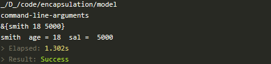
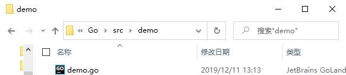
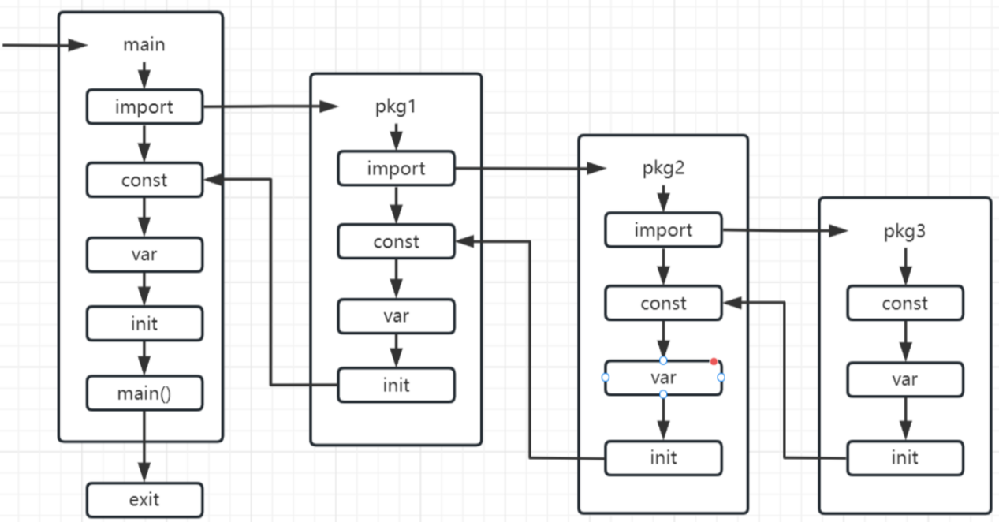
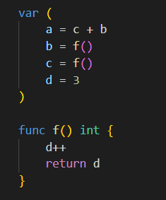
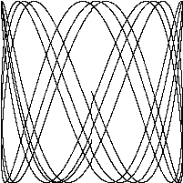
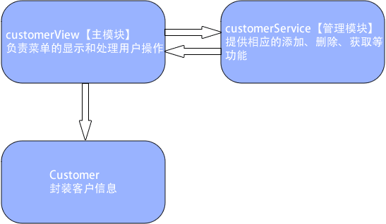
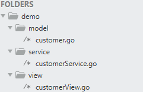
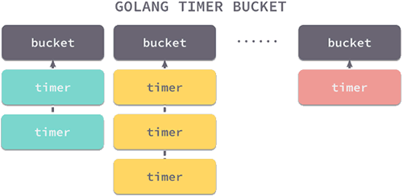
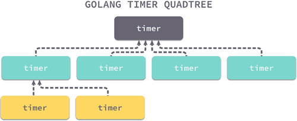

# Go语言入门教程，Golang入门教程（非常详细）

<http://c.biancheng.net/golang/>

<https://www.kancloud.cn/imdszxs/golang/1535582>

<https://www.xinbaoku.com/archive/2DHvuPFr.html>

# 0.目录 
> [8.包（package）](\l)
> 
> [8.1 包的基本概念](\l)
>   [8.1.1包的基本概念](\l)
>   [8.1.2包的导入](\l)
>   [8.1.3包的导入路径](\l)
>   [8.1.4包加载](\l)
> [8.2 Go语言封装简介及实现细节](\l)
> 
> [8.3 Go语言GOPATH](\l)
>   [8.3.1使用命令行查看GOPATH信息](\l)
>   [8.3.2使用GOPATH的工程结构](\l)
>   [8.3.3设置和使用GOPATH](\l)
>   [8.3.4在多项目工程中使用GOPATH](\l)
> 
> [8.4 Go语言常用内置包](\l)
> [8.5 Go语言自定义包](\l)
> [8.6 Go语言package](\l)
> 
> [8.7 Go语言导出包中的标识符](\l)
>   [8.7.1导出包内标识符](\l)
>   [8.7.2导出结构体及接口成员](\l)
> 
> [8.8 Go语言import导入包](\l)
>   [8.8.1默认导入的写法](\l)
>   [8.8.2导入包后自定义引用的包名](\l)
>   [8.8.3匿名导入包——只导入包但不使用包内类型和数值](\l)
>   [8.8.4包在程序启动前的初始化入口：init](\l)
>   [8.8.5理解包导入后的init()函数初始化顺序](\l)
> 
> [8.8+1 GO 中的 init 函数](\l)
>   [8.8+1.1前言](\l)
>   [8.8+1.2 init 特性](\l)
>   [8.8+1.3 init 的执行顺序](\l)
>   [8.8+1.4变量的初始化顺序](\l)
>   [8.8+1.5package 中多个 init 的执行顺序](\l)
>   [8.8+1.6加载顺序总结](\l)
>   [8.8+1.7init 的使用场景](\l)
>   [8.8+1.8 init 注意事项](\l)
> 
> [8.9 Go语言工厂模式自动注册](\l)
> 
> [8.10 Go语言单例模式](\l)
>   [8.10.1单例模式实现](\l)
> 
> [8.11 Go语言sync包与锁](\l)
>   [8.11.1为什么需要锁](\l)
>   [8.11.2互斥锁 Mutex](\l)
>   [8.11.3读写锁](\l)
> [8.12 Go语言big包](\l)
> [8.13 示例：使用图像包制作GIF动画](\l)
> 
> [8.14 Go语言正则表达式：regexp包](\l)
>   [8.14.1正则表达式语法规则](\l)
>   [8.14.2Regexp 包的使用](\l)
> [8.15 Go语言time包：时间和日期](\l)
>   [8.15.1 time 包简介](\l)
>   [8.15.2时间的获取](\l)
>   [8.15.3时间操作函数](\l)
>   [8.15.4定时器](\l)
>   [8.15.5时间格式化](\l)
>   [8.15.6解析字符串格式的时间 ](\l)
> [8.16 Go语言os包用法简述](\l)
>   [8.16.1 os 包中的常用函数](\l)
>   [8.16.2 os/exec 执行外部命令](\l)
>   [8.16.3 os/user 获取当前用户信息](\l)
>   [8.16.4 os/signal 信号处理](\l)
> 
> [8.17 Go语言flag包：命令行参数解析](\l)
>   [8.17.1 flag 包概述](\l)
>   [8.17.2flag 参数类型](\l)
>   [8.17.3flag 包基本使用](\l)
> 
> [8.18 Go语言go mod包依赖管理工具](\l)
>   [8.18.1如何使用 Modules？](\l)
>   [8.18.2如何在项目中使用](\l)
>   [8.18.3使用 replace 替换无法直接获取的 package](\l)
> 
> [8.19 示例：使用Go语言生成二维码](\l)
>   [8.19.1什么是二维码？](\l)
>   [8.19.2使用Go语言生成二维码图片](\l)
>   [8.19.3生成二维码图片字节](\l)
>   [8.19.4自定义二维码](\l)
> 
> [8.20 Go语言Context（上下文）](\l)
>   [8.20.1什么是 Context](\l)
>   [8.20.2Context 接口](\l)
>   [8.20.3总结](\l)
>   
> [8.21 示例：客户信息管理系统](\l)
> [8.22 示例：使用Go语言发送电子邮件](\l)
> [8.23 Go语言（Pingo）插件化开发](\l)
> 
> [8.24 Go语言定时器实现原理及作用](\l)
>   [8.24.1结构](\l)
>   [8.24.2工作原理](\l)
>   [8.24.3性能分析](\l)
>   [8.24.4总结](\l)
> 
# 8.包（package）

Go语言包（package），Golang包（package）

----------------------------------------------------------------

Go 语言的源码复用建立在包（package）基础之上。Go 语言的入口 main() 函数所在的包（package）叫 main，main 包想要引用别的代码，必须同样以包的方式进行引用，本章内容将详细讲解如何导出包的内容及如何导入其他包。  
  
Go 语言的包与文件夹一一对应，所有与包相关的操作，必须依赖于工作目录（GOPATH）。

## 8.1 [包的基本概念](http://c.biancheng.net/view/5394.html)

Go语言是使用包来组织源代码的，包（package）是多个 Go 源码的集合，是一种高级的代码复用方案。Go语言中为我们提供了很多内置包，如 fmt、os、io 等。  
  
任何源代码文件必须属于某个包，同时源码文件的第一行有效代码必须是package pacakgeName 语句，通过该语句声明自己所在的包。

### 8.1.1包的基本概念

Go语言的包借助了目录树的组织形式，一般包的名称就是其源文件所在目录的名称，虽然Go语言没有强制要求包名必须和其所在的目录名同名，但还是建议包名和所在目录同名，这样结构更清晰。  
  
包可以定义在很深的目录中，包名的定义是不包括目录路径的，但是包在引用时一般使用全路径引用。比如在GOPATH/src/a/b/ 下定义一个包 c。在包 c 的源码中只需声明为package c，而不是声明为package a/b/c，但是在导入 c 包时，需要带上路径，例如import "a/b/c"。  
  
包的习惯用法：
- 包名一般是小写的，使用一个简短且有意义的名称。
- 包名一般要和所在的目录同名，也可以不同，包名中不能包含- 等特殊符号。
- 包一般使用域名作为目录名称，这样能保证包名的唯一性，比如 GitHub 项目的包一般会放到GOPATH/src/github.com/userName/projectName 目录下。
- 包名为 main 的包为应用程序的入口包，编译不包含 main 包的源码文件时不会得到可执行文件。
- 一个文件夹下的所有源码文件只能属于同一个包；同样属于同一个包的源码文件不能放在多个文件夹下（属于同一个包的源码文件只能能放在同一个文件夹下）。

### 8.1.2包的导入

要在代码中引用其他包的内容，需要使用 import 关键字导入使用的包。具体语法如下：
import "包的路径"

注意事项：
- import 导入语句通常放在源码文件开头包声明语句的下面；
- 导入的包名需要使用双引号包裹起来；
- 包名是从GOPATH/src/ 后开始计算的，使用/ 进行路径分隔。

包的导入有两种写法，分别是单行导入和多行导入。

#### 单行导入

单行导入的格式如下：

import "包 1 的路径"  
import "包 2 的路径"

#### 多行导入

多行导入的格式如下：

import (  
    "包 1 的路径"  
    "包 2 的路径"  
)

### 8.1.3包的导入路径

包的引用路径有两种写法，分别是全路径导入和相对路径导入。

#### 8.1.3.1全路径导入

包的绝对路径就是GOROOT/src/或GOPATH/src/后面包的存放路径，如下所示：

import "lab/test"  
import "database/sql/driver"  
import "database/sql"

上面代码的含义如下：

- test 包是自定义的包，其源码位于GOPATH/src/lab/test 目录下；
- driver 包的源码位于GOROOT/src/database/sql/driver 目录下；
- sql 包的源码位于GOROOT/src/database/sql 目录下。
#### 8.1.3.2相对路径导入

相对路径只能用于导入GOPATH 下的包，标准包的导入只能使用全路径导入。   
例如包 a 的所在路径是GOPATH/src/lab/a，包 b 的所在路径为GOPATH/src/lab/b，如果在包 b 中导入包 a ，则可以使用相对路径导入方式。示例如下：

// 相对路径导入  
import "../a"
当然了，也可以使用上面的全路径导入，如下所示：

// 全路径导入  
import "lab/a"

#### 8.1.3.3包的引用格式

包的引用有四种格式，下面以 fmt 包为例来分别演示一下这四种格式。

##### 1) 标准引用格式

import "fmt"

此时可以用fmt.作为前缀来使用 fmt 包中的方法，这是常用的一种方式。  
  
示例代码如下：

1.  package main
2.  
3.  import "fmt"
4.  
5.  func main() {
6.    fmt.Println("C语言中文网")
7.  }

##### 2) 自定义别名引用格式

在导入包的时候，我们还可以为导入的包设置别名，如下所示：

import F "fmt"

其中 F 就是 fmt 包的别名，使用时我们可以使用F.来代替标准引用格式的fmt.来作为前缀使用 fmt 包中的方法。  
  
示例代码如下：

1.  package main

2.  

3.  import F "fmt"

4.  

5.  func main() {

6.  F.Println("C语言中文网")

7.  }

##### 3) 省略引用格式

import . "fmt"

这种格式相当于把 fmt 包直接合并到当前程序中，在使用 fmt 包内的方法是可以不用加前缀fmt.，直接引用。  
  
示例代码如下：

1.  package main

2.  

3.  import . "fmt"

4.  

5.  func main() {

6.  //不需要加前缀 fmt.

7.  Println("C语言中文网")

8.  }

##### 4) 匿名引用格式

在引用某个包时，如果只是希望执行包初始化的 init 函数，而不使用包内部的数据时，可以使用匿名引用格式，如下所示：

import \_ "fmt"

匿名导入的包与其他方式导入的包一样都会被编译到可执行文件中。  
  
使用标准格式引用包，但是代码中却没有使用包，编译器会报错。如果包中有 init 初始化函数，则通过import \_ "包的路径" 这种方式引用包，仅执行包的初始化函数，即使包没有 init 初始化函数，也不会引发编译器报错。  
  
示例代码如下：

1.  package main

2.  

3.  import (

4.  \_ "database/sql"

5.  "fmt"

6.  )

7.  

8.  func main() {

9.  fmt.Println("C语言中文网")

10. }

注意：

- 一个包可以有多个 init 函数，包加载时会执行全部的 init 函数，但并不能保证执行顺序，所以不建议在一个包中放入多个 init 函数，将需要初始化的逻辑放到一个 init 函数里面。

- 包不能出现环形引用的情况，比如包 a 引用了包 b，包 b 引用了包 c，如果包 c 又引用了包 a，则编译不能通过。

- 包的重复引用是允许的，比如包 a 引用了包 b 和包 c，包 b 和包 c 都引用了包 d。这种场景相当于重复引用了 d，这种情况是允许的，并且 Go 编译器保证包 d 的 init 函数只会执行一次。

### 8.1.4包加载

通过前面一系列的学习相信大家已经大体了解了 Go 程序的启动和加载过程，在执行 main 包的 mian 函数之前， Go 引导程序会先对整个程序的包进行初始化。整个执行的流程如下图所示。

  
图：Go 包的初始化

Go语言包的初始化有如下特点：

- 包初始化程序从 main 函数引用的包开始，逐级查找包的引用，直到找到没有引用其他包的包，最终生成一个包引用的有向无环图。

- Go 编译器会将有向无环图转换为一棵树，然后从树的叶子节点开始逐层向上对包进行初始化。

- 单个包的初始化过程如上图所示，先初始化常量，然后是全局变量，最后执行包的 init 函数。

## 8.2 [Go语言封装简介及实现细节](http://c.biancheng.net/view/5715.html)

在Go语言中封装就是把抽象出来的字段和对字段的操作封装在一起，数据被保护在内部，程序的其它包只能通过被授权的方法，才能对字段进行操作。  
  
封装的好处：

- 隐藏实现细节；

- 可以对数据进行验证，保证数据安全合理。

如何体现封装：

- 对结构体中的属性进行封装；

- 通过方法，包，实现封装。

封装的实现步骤：

- 将结构体、字段的首字母小写；

- 给结构体所在的包提供一个工厂模式的函数，首字母大写，类似一个构造函数；

- 提供一个首字母大写的 Set 方法（类似其它语言的 public），用于对属性判断并赋值；

- 提供一个首字母大写的 Get 方法（类似其它语言的 public），用于获取属性的值。

【示例】对于员工，不能随便查看年龄，工资等隐私，并对输入的年龄进行合理的验证。代码结构如下：

person.go 中的代码如下所示：

1.  package model

2.  

3.  import "fmt"

4.  

5.  type person struct {

6.  Name string

7.  age int //其它包不能直接访问..

8.  sal float64

9.  }

10. 

11. //写一个工厂模式的函数，相当于构造函数

12. func NewPerson(name string) \*person {

13. return &person{

14. Name : name,

15. }

16. }

17. 

18. //为了访问age 和 sal 我们编写一对SetXxx的方法和GetXxx的方法

19. func (p \*person) SetAge(age int) {

20. if age \>0 && age \<150 {

21. p.age = age

22. } else {

23. fmt.Println("年龄范围不正确..")

24. //给程序员给一个默认值

25. }

26. }

27. func (p \*person) GetAge() int {

28. return p.age

29. }

30. 

31. func (p \*person) SetSal(sal float64) {

32. if sal \>= 3000 && sal \<= 30000 {

33. p.sal = sal

34. } else {

35. fmt.Println("薪水范围不正确..")

36. }

37. }

38. 

39. func (p \*person) GetSal() float64 {

40. return p.sal

41. }

main.go 中的代码如下所示：

1.  package main

2.  

3.  import (

4.  "fmt"

5.  "../model"

6.  )

7.  

8.  func main() {

9.  

10. p := model.NewPerson("smith")

11. p.SetAge(18)

12. p.SetSal(5000)

13. fmt.Println(p)

14. fmt.Println(p.Name, " age =", p.GetAge(), " sal = ", p.GetSal())

15. }

执行效果如下图所示：

## 8.3 [Go语言GOPATH](http://c.biancheng.net/view/88.html)

Go语言GOPATH详解（Go语言工作目录）

----------------------------------------------------------

GOPATH 是 Go语言中使用的一个环境变量，它使用绝对路径提供项目的工作目录。  
  
工作目录是一个工程开发的相对参考目录，好比当你要在公司编写一套服务器代码，你的工位所包含的桌面、计算机及椅子就是你的工作区。工作区的概念与工作目录的概念也是类似的。如果不使用工作目录的概念，在多人开发时，每个人有一套自己的目录结构，读取配置文件的位置不统一，输出的二进制运行文件也不统一，这样会导致开发的标准不统一，影响开发效率。  
  
GOPATH 适合处理大量 Go语言源码、多个包组合而成的复杂工程。

#### 提示

C、C++、Java、C# 及其他语言发展到后期，都拥有自己的 IDE（集成开发环境），并且工程（Project）、解决方案（Solution）和工作区（Workspace）等概念将源码和资源组织了起来，方便编译和输出。

### 8.3.1使用命令行查看GOPATH信息

在《安装Go语言开发包》一节中我们已经介绍过 Go语言的安装方法。在安装过 Go 开发包的操作系统中，可以使用命令行查看 Go 开发包的环境变量配置信息，这些配置信息里可以查看到当前的 GOPATH 路径设置情况。在命令行中运行go env后，命令行将提示以下信息：

\$ go env  
GOARCH="amd64"  
GOBIN=""  
GOEXE=""  
GOHOSTARCH="amd64"  
GOHOSTOS="linux"  
GOOS="linux"  
GOPATH="/home/davy/go"  
GORACE=""  
GOROOT="/usr/local/go"  
GOTOOLDIR="/usr/local/go/pkg/tool/linux_amd64"  
GCCGO="gccgo"  
CC="gcc"  
GOGCCFLAGS="-fPIC -m64 -pthread -fmessage-length=0"  
CXX="g++"  
CGO_ENABLED="1"  
CGO_CFLAGS="-g -O2"  
CGO_CPPFLAGS=""  
CGO_CXXFLAGS="-g -O2"  
CGO_FFLAGS="-g -O2"  
CGO_LDFLAGS="-g -O2"  
PKG_CONFIG="pkg-config"

命令行说明如下：

- 第 1 行，执行 go env 指令，将输出当前 Go 开发包的环境变量状态。

- 第 2 行，GOARCH 表示目标处理器架构。

- 第 3 行，GOBIN 表示编译器和链接器的安装位置。

- 第 7 行，GOOS 表示目标操作系统。

- 第 8 行，GOPATH 表示当前工作目录。

- 第 10 行，GOROOT 表示 Go 开发包的安装目录。

从命令行输出中，可以看到 GOPATH 设定的路径为：/home/davy/go（davy 为笔者的用户名）。  
  
在 Go 1.8 版本之前，GOPATH 环境变量默认是空的。从 Go 1.8 版本开始，Go 开发包在安装完成后，将 GOPATH 赋予了一个默认的目录，参见下表。

|                               |                   |                    |
|-------------------------------|-------------------|--------------------|
| GOPATH 在不同平台上的安装路径 |                   |                    |
| **平  台**                    | **GOPATH 默认值** | **举 例**          |
| Windows 平台                  | %USERPROFILE%/go  | C:\Users\用户名\go |
| Unix 平台                     | \$HOME/go         | /home/用户名/go    |

### 8.3.2使用GOPATH的工程结构

在 GOPATH 指定的工作目录下，代码总是会保存在 \$GOPATH/src 目录下。在工程经过 go build、go install 或 go get 等指令后，会将产生的二进制可执行文件放在 \$GOPATH/bin 目录下，生成的中间缓存文件会被保存在 \$GOPATH/pkg 下。  
  
如果需要将整个源码添加到版本管理工具（Version Control System，VCS）中时，只需要添加 \$GOPATH/src 目录的源码即可。bin 和 pkg 目录的内容都可以由 src 目录生成。

### 8.3.3设置和使用GOPATH

本节以 Linux 为演示平台，为大家演示使用 GOPATH 的方法。

#### 1) 设置当前目录为GOPATH

选择一个目录，在目录中的命令行中执行下面的指令：

export GOPATH=\`pwd\`

该指令中的 pwd 将输出当前的目录，使用反引号\`将 pwd 指令括起来表示命令行替换，也就是说，使用\`pwd\`将获得 pwd 返回的当前目录的值。例如，假设你的当前目录是“/home/davy/go”，那么使用\`pwd\`将获得返回值“/home/davy/go”。  
  
使用 export 指令可以将当前目录的值设置到环境变量 GOPATH中。

#### 2) 建立GOPATH中的源码目录

使用下面的指令创建 GOPATH 中的 src 目录，在 src 目录下还有一个 hello 目录，该目录用于保存源码。

mkdir -p src/hello

mkdir 指令的 -p 可以连续创建一个路径。

#### 3) 添加main.go源码文件

使用 Linux 编辑器将下面的源码保存为 main.go 并保存到 \$GOPATH/src/hello 目录下。

1.  package main

2.  

3.  import "fmt"

4.  

5.  func main(){

6.  fmt.Println("hello")

7.  }

#### 4) 编译源码并运行

此时我们已经设定了 GOPATH，因此在 Go语言中可以通过 GOPATH 找到工程的位置。  
  
在命令行中执行如下指令编译源码：

go install hello

编译完成的可执行文件会保存在 \$GOPATH/bin 目录下。  
  
在 bin 目录中执行 ./hello，命令行输出如下：  
hello world

### 8.3.4在多项目工程中使用GOPATH

在很多与 Go语言相关的书籍、文章中描述的 GOPATH 都是通过修改系统全局的环境变量来实现的。然而，根据笔者多年的 Go语言使用和实践经验及周边朋友、同事的反馈，这种设置全局 GOPATH 的方法可能会导致当前项目错误引用了其他目录的 Go 源码文件从而造成编译输出错误的版本或编译报出一些无法理解的错误提示。  
  
比如说，将某项目代码保存在 /home/davy/projectA 目录下，将该目录设置为 GOPATH。随着开发进行，需要再次获取一份工程项目的源码，此时源码保存在 /home/davy/projectB 目录下，如果此时需要编译 projectB 目录的项目，但开发者忘记设置 GOPATH 而直接使用命令行编译，则当前的 GOPATH 指向的是 /home/davy/projectA 目录，而不是开发者编译时期望的 projectB 目录。编译完成后，开发者就会将错误的工程版本发布到外网。  
  
因此，建议大家无论是使用命令行或者使用集成开发环境编译 Go 源码时，GOPATH 跟随项目设定。在 Jetbrains 公司的 GoLand 集成开发环境（IDE）中的 GOPATH 设置分为全局 GOPATH 和项目 GOPATH，如下图所示。

  
图：全局和项目GOPATH

图中的 Global GOPATH 代表全局 GOPATH，一般来源于系统环境变量中的 GOPATH；Project GOPATH 代表项目所使用的 GOPATH，该设置会被保存在工作目录的 .idea 目录下，不会被设置到环境变量的 GOPATH 中，但会在编译时使用到这个目录。建议在开发时只填写项目 GOPATH，每一个项目尽量只设置一个 GOPATH，不使用多个 GOPATH 和全局的 GOPATH。

#### 提示

Visual Studio 早期在设计时，允许 C++ 语言在全局拥有一个包含路径。当一个工程多个版本的编译，或者两个项目混杂有不同的共享全局包含时，会发生难以察觉的错误。在新版本 Visual Studio 中已经废除了这种全局包含的路径设计，并建议开发者将包含目录与项目关联。  
  
Go语言中的 GOPATH 也是一种类似全局包含的设计，因此鉴于 Visual Studio 在设计上的失误，建议开发者不要设置全局的 GOPATH，而是随项目设置 GOPATH。

## 8.4 [Go语言常用内置包](http://c.biancheng.net/view/4306.html)

标准的Go语言代码库中包含了大量的包，并且在安装 Go 的时候多数会自动安装到系统中。我们可以在 \$GOROOT/src/pkg 目录中查看这些包。下面简单介绍一些我们开发中常用的包。

#### 1) fmt

fmt 包实现了格式化的标准输入输出，这与C语言中的 printf 和 scanf 类似。其中的 fmt.Printf() 和 fmt.Println() 是开发者使用最为频繁的函数。  
  
格式化短语派生于C语言，一些短语（%- 序列）是这样使用：

- %v：默认格式的值。当打印结构时，加号（%+v）会增加字段名；

- %#v：Go样式的值表达；

- %T：带有类型的 Go 样式的值表达。

#### 2) io

这个包提供了原始的 I/O 操作界面。它主要的任务是对 os 包这样的原始的 I/O 进行封装，增加一些其他相关，使其具有抽象功能用在公共的接口上。

#### 3) bufio

bufio 包通过对 io 包的封装，提供了数据缓冲功能，能够一定程度减少大块数据读写带来的开销。  
在 bufio 各个组件内部都维护了一个缓冲区，数据读写操作都直接通过缓存区进行。当发起一次读写操作时，会首先尝试从缓冲区获取数据，只有当缓冲区没有数据时，才会从数据源获取数据更新缓冲。

#### 4) sort

sort 包提供了用于对切片和用户定义的集合进行排序的功能。

#### 5) strconv

strconv 包提供了将字符串转换成基本数据类型，或者从基本数据类型转换为字符串的功能。

#### 6) os

os 包提供了不依赖平台的操作系统函数接口，设计像 Unix 风格，但错误处理是 go 风格，当 os 包使用时，如果失败后返回错误类型而不是错误数量。

#### 7) sync

sync 包实现多线程中锁机制以及其他同步互斥机制。

#### 8) flag

flag 包提供命令行参数的规则定义和传入参数解析的功能。绝大部分的命令行程序都需要用到这个包。

#### 9) encoding/json

JSON 目前广泛用做网络程序中的通信格式。encoding/json 包提供了对 JSON 的基本支持，比如从一个对象序列化为 JSON 字符串，或者从 JSON 字符串反序列化出一个具体的对象等。

#### 10) html/template

主要实现了 web 开发中生成 html 的 template 的一些函数。

#### 11) net/http

net/http 包提供 HTTP 相关服务，主要包括 http 请求、响应和 URL 的解析，以及基本的 http 客户端和扩展的 http 服务。  
  
通过 net/http 包，只需要数行代码，即可实现一个爬虫或者一个 Web 服务器，这在传统语言中是无法想象的。

#### 12) reflect

reflect 包实现了运行时反射，允许程序通过抽象类型操作对象。通常用于处理静态类型 interface{} 的值，并且通过 Typeof 解析出其动态类型信息，通常会返回一个有接口类型 Type 的对象。

#### 13) os/exec

os/exec 包提供了执行自定义 linux 命令的相关实现。

#### 14) strings

strings 包主要是处理字符串的一些函数集合，包括合并、查找、分割、比较、后缀检查、索引、大小写处理等等。  
strings 包与 bytes 包的函数接口功能基本一致。

#### 15) bytes

bytes 包提供了对字节切片进行读写操作的一系列函数。字节切片处理的函数比较多，分为基本处理函数、比较函数、后缀检查函数、索引函数、分割函数、大小写处理函数和子切片处理函数等。

#### 16) log

log 包主要用于在程序中输出日志。  
  
log 包中提供了三类日志输出接口，Print、Fatal 和 Panic。

- Print 是普通输出；

- Fatal 是在执行完 Print 后，执行 os.Exit(1)；

- Panic 是在执行完 Print 后调用 panic() 方法。

## 8.5 [Go语言自定义包](http://c.biancheng.net/view/5123.html)

包是Go语言中代码组成和代码编译的主要方式。关于包的基本信息我们已经在前面介绍过了，本节我们主要来介绍一下如何自定义一个包并使用它。  
  
到目前为止，我们所使用的例子都是以一个包的形式存在的，比如 main 包。在Go语言里，允许我们将同一个包的代码分隔成多个独立的源码文件来单独保存，只需要将这些文件放在同一个目录下即可。  
  
我们创建的自定义的包需要将其放在 GOPATH 的 src 目录下（也可以是 src 目录下的某个子目录），而且两个不同的包不能放在同一目录下，这样会引起编译错误。  
  
一个包中可以有任意多个文件，文件的名字也没有任何规定（但后缀必须是 .go），这里我们假设包名就是 .go 的文件名（如果一个包有多个 .go 文件，则其中会有一个 .go 文件的文件名和包名相同）。  
  
下面通过示例来演示一下如何创建一个名为 demo 的自定义包，并在 main 包中使用自定义包 demo 中的方法。  
  
首先，在 GOPATH 下的 src 目录中新建一个 demo 文件夹 ，并在 demo 文件夹下创建 demo.go 文件，如下所示：

  
图：demo 文件夹

demo.go 文件的代码如下所示：

1.  package demo

2.  

3.  import (

4.  "fmt"

5.  )

6.  

7.  func PrintStr() {

8.  fmt.Println("C语言中文网")

9.  }

然后，在 GOPATH 下的 src 目录中新建一个 main 文件夹，并在 main 文件夹下创建 mian.go 文件，如下所示：

  
图：main 文件夹

main.go 文件的代码如下所示：

1.  package main

2.  

3.  import (

4.  "demo"

5.  )

6.  

7.  func main() {

8.  demo.PrintStr()

9.  }

运行结果如下所示：

go run main.go  
C语言中文网

对引用自定义包需要注意以下几点：

- 如果项目的目录不在 GOPATH 环境变量中，则需要把项目移到 GOPATH 所在的目录中，或者将项目所在的目录设置到 GOPATH 环境变量中，否则无法完成编译；

- 使用 import 语句导入包时，使用的是包所属文件夹的名称；

- 包中的函数名第一个字母要大写，否则无法在外部调用；

- 自定义包的包名不必与其所在文件夹的名称保持一致，但为了便于维护，建议保持一致；

- 调用自定义包时使用 包名 . 函数名 的方式，如上例：demo.PrintStr()。

## 8.6 [Go语言package](http://c.biancheng.net/view/89.html)

Go语言package（创建包）

-------------------------------------

包（package）是多个 Go 源码的集合，是一种高级的代码复用方案，像 fmt、os、io 等这样具有常用功能的内置包在 Go语言中有 150 个以上，它们被称为标准库，大部分（一些底层的除外）内置于 Go 本身。  
  
包要求在同一个目录下的所有文件的第一行添加如下代码，以标记该文件归属的包：

package 包名

包的特性如下：

- 一个目录下的同级文件归属一个包。

- 包名可以与其目录不同名。

- 包名为 main 的包为应用程序的入口包，编译源码没有 main 包时，将无法编译输出可执行的文件。

任何包系统设计的目的都是为了简化大型程序的设计和维护工作，通过将一组相关的特性放进一个独立的单元以便于理解和更新，在每个单元更新的同时保持和程序中其它单元的相对独立性。这种模块化的特性允许每个包可以被其它的不同项目共享和重用，在项目范围内、甚至全球范围统一的分发和复用。  
  
每个包一般都定义了一个不同的名字空间用于它内部的每个标识符的访问。每个名字空间关联到一个特定的包，让我们给类型、函数等选择简短明了的名字，这样可以避免在我们使用它们的时候减少和其它部分名字的冲突。  
  
每个包还通过控制包内名字的可见性和是否导出来实现封装特性。通过限制包成员的可见性并隐藏包 API 的具体实现，将允许包的维护者在不影响外部包用户的前提下调整包的内部实现。通过限制包内变量的可见性，还可以强制用户通过某些特定函数来访问和更新内部变量，这样可以保证内部变量的一致性和并发时的互斥约束。  
  
当我们修改了一个源文件，我们必须重新编译该源文件对应的包和所有依赖该包的其他包。即使是从头构建，Go语言编译器的编译速度也明显快于其它编译语言。Go语言的闪电般的编译速度主要得益于三个语言特性。

- 第一点，所有导入的包必须在每个文件的开头显式声明，这样的话编译器就没有必要读取和分析整个源文件来判断包的依赖关系。

- 第二点，禁止包的环状依赖，因为没有循环依赖，包的依赖关系形成一个有向无环图，每个包可以被独立编译，而且很可能是被并发编译。

- 第三点，编译后包的目标文件不仅仅记录包本身的导出信息，目标文件同时还记录了包的依赖关系。因此，在编译一个包的时候，编译器只需要读取每个直接导入包的目标文件，而不需要遍历所有依赖的的文件。

## 8.7 [Go语言导出包中的标识符](http://c.biancheng.net/view/90.html)

在 Go语言中，如果想在一个包里引用另外一个包里的标识符（如类型、变量、常量等）时，必须首先将被引用的标识符导出，将要导出的标识符的首字母大写就可以让引用者可以访问这些标识符了。

### 8.7.1导出包内标识符

下面代码中包含一系列未导出标识符，它们的首字母都为小写，这些标识符可以在包内自由使用，但是包外无法访问它们，代码如下：

1.  package mypkg

2.  

3.  var myVar = 100

4.  

5.  const myConst = "hello"

6.  

7.  type myStruct struct {

8.  }

将 myStruct 和 myConst 首字母大写，导出这些标识符，修改后代码如下：

1.  package mypkg

2.  

3.  var myVar = 100

4.  

5.  const MyConst = "hello"

6.  

7.  type MyStruct struct {

8.  }

此时，MyConst 和 MyStruct 可以被外部访问，而 myVar 由于首字母是小写，因此只能在 mypkg 包内使用，不能被外部包引用。

### 8.7.2导出结构体及接口成员

在被导出的结构体或接口中，如果它们的字段或方法首字母是大写，外部可以访问这些字段和方法，代码如下：

1.  type MyStruct struct {

2.  

3.  // 包外可以访问的字段

4.  ExportedField int

5.  

6.  // 仅限包内访问的字段

7.  privateField int

8.  }

9.  

10. type MyInterface interface {

11. 

12. // 包外可以访问的方法

13. ExportedMethod()

14. 

15. // 仅限包内访问的方法

16. privateMethod()

17. }

在代码中，MyStruct 的 ExportedField 和 MyInterface 的 ExportedMethod() 可以被包外访问。

## 8.8 [Go语言import导入包](http://c.biancheng.net/view/91.html)

Go语言import导入包——在代码中使用其他的代码

--------------------------------------------------------------------------

可以在一个 Go语言源文件包声明语句之后，其它非导入声明语句之前，包含零到多个导入包声明语句。每个导入声明可以单独指定一个导入路径，也可以通过圆括号同时导入多个导入路径。要引用其他包的标识符，可以使用 import 关键字，导入的包名使用双引号包围，包名是从 GOPATH 开始计算的路径，使用/进行路径分隔。

### 8.8.1默认导入的写法

导入有两种基本格式，即单行导入和多行导入，两种导入方法的导入代码效果是一致的。

#### 1) 单行导入

单行导入格式如下：

import "包1"  
import "包2"

#### 2) 多行导入

当多行导入时，包名在 import 中的顺序不影响导入效果，格式如下：

import(  
    "包1"  
    "包2"  
    …  
)

参考代码 8-1 的例子来理解 import 的机制。

> 本套教程所有源码下载地址：https://pan.baidu.com/s/1ORFVTOLEYYqDhRzeq0zIiQ    提取密码：hfyf

代码 8-1 的目录层次如下：

.  
└── src  
    └── chapter08  
        └── importadd  
            ├── main.go  
            └── mylib  
                └── add.go

代码8-1　加函数（具体文件：…/chapter08/importadd/mylib/add.go）

1.  package mylib

2.  

3.  func Add(a, b int) int {

4.  return a + b

5.  }

第 3 行中的 Add() 函数以大写 A 开头，表示将 Add() 函数导出供包外使用。当首字母小写时，为包内使用，包外无法引用到。  
  
add.go 在 mylib 文件夹下，习惯上将文件夹的命名与包名一致，命名为 mylib 包。  
  
代码8-2　导入包（具体文件：…/chapter08/importadd/main.go）

1.  package main

2.  

3.  import (

4.  "chapter08/importadd/mylib"

5.  "fmt"

6.  )

7.  

8.  func main() {

9.  fmt.Println(mylib.Add(1, 2))

10. }

代码说明如下：

- 第 4 行，导入 chapter08/importadd/mylib 包。

- 第 9 行，使用 mylib 作为包名，并引用 Add() 函数调用。

在命令行中运行下面代码：

export GOPATH=/home/davy/golangbook/code  
go install chapter08/importadd  
\$GOPATH/bin/importadd

命令说明如下：

- 第 1 行，根据你的 GOPATH 不同，设置 GOPATH。

- 第 2 行，使用 go install 指令编译并安装 chapter08/code8-1 到 GOPATH 的 bin 目录下。

- 第 3 行，执行 GOPATH 的 bin 目录下的可执行文件 code8-1。

运行代码，输出结果如下：

3

导入的包之间可以通过添加空行来分组；通常将来自不同组织的包独自分组。包的导入顺序无关紧要，但是在每个分组中一般会根据字符串顺序排列。（gofmt 和 goimports 工具都可以将不同分组导入的包独立排序。）

1.  import (

2.  "fmt"

3.  "html/template"

4.  "os"

5.  

6.  "golang.org/x/net/html"

7.  "golang.org/x/net/ipv4"

8.  )

### 8.8.2导入包后自定义引用的包名

如果我们想同时导入两个有着名字相同的包，例如 math/rand 包和 crypto/rand 包，那么导入声明必须至少为一个同名包指定一个新的包名以避免冲突。这叫做导入包的重命名。

1.  import (

2.  "crypto/rand"

3.  mrand "math/rand" // 将名称替换为mrand避免冲突

4.  )

导入包的重命名只影响当前的源文件。其它的源文件如果导入了相同的包，可以用导入包原本默认的名字或重命名为另一个完全不同的名字。  
  
导入包重命名是一个有用的特性，它不仅仅只是为了解决名字冲突。如果导入的一个包名很笨重，特别是在一些自动生成的代码中，这时候用一个简短名称会更方便。选择用简短名称重命名导入包时候最好统一，以避免包名混乱。选择另一个包名称还可以帮助避免和本地普通变量名产生冲突。例如，如果文件中已经有了一个名为 path 的变量，那么我们可以将"path"标准包重命名为 pathpkg。  
  
每个导入声明语句都明确指定了当前包和被导入包之间的依赖关系。如果遇到包循环导入的情况，Go语言的构建工具将报告错误。

### 8.8.3匿名导入包——只导入包但不使用包内类型和数值

如果只希望导入包，而不使用任何包内的结构和类型，也不调用包内的任何函数时，可以使用匿名导入包，格式如下：

1.  import (

2.  \_ "path/to/package"

3.  )

其中，path/to/package 表示要导入的包名，下画线_表示匿名导入包。  
  
匿名导入的包与其他方式导入包一样会让导入包编译到可执行文件中，同时，导入包也会触发 init() 函数调用。

### 8.8.4包在程序启动前的初始化入口：init

在某些需求的设计上需要在程序启动时统一调用程序引用到的所有包的初始化函数，如果需要通过开发者手动调用这些初始化函数，那么这个过程可能会发生错误或者遗漏。我们希望在被引用的包内部，由包的编写者获得代码启动的通知，在程序启动时做一些自己包内代码的初始化工作。  
  
例如，为了提高数学库计算三角函数的执行效率，可以在程序启动时，将三角函数的值提前在内存中建成索引表，外部程序通过查表的方式迅速获得三角函数的值。但是三角函数索引表的初始化函数的调用不希望由每一个外部使用三角函数的开发者调用，如果在三角函数的包内有一个机制可以告诉三角函数包程序何时启动，那么就可以解决初始化的问题。  
  
Go 语言为以上问题提供了一个非常方便的特性：init() 函数。  
  
init() 函数的特性如下：

- 每个源码可以使用 1 个 init() 函数。

- init() 函数会在程序执行前（main() 函数执行前）被自动调用。

- 调用顺序为 main() 中引用的包，以深度优先顺序初始化。

例如，假设有这样的包引用关系：main→A→B→C，那么这些包的 init() 函数调用顺序为：

C.init→B.init→A.init→main

说明：

- 同一个包中的多个 init() 函数的调用顺序不可预期。

- init() 函数不能被其他函数调用。

### 8.8.5理解包导入后的init()函数初始化顺序

Go 语言包会从 main 包开始检查其引用的所有包，每个包也可能包含其他的包。Go 编译器由此构建出一个树状的包引用关系，再根据引用顺序决定编译顺序，依次编译这些包的代码。  
  
在运行时，被最后导入的包会最先初始化并调用 init() 函数。  
  
通过下面的代码理解包的初始化顺序。  
  
代码8-3　包导入初始化顺序入口（…/chapter08/pkginit/main.go）

1.  package main

2.  

3.  import "chapter08/code8-2/pkg1"

4.  

5.  func main() {

6.  

7.  pkg1.ExecPkg1()

8.  }

代码说明如下：

- 第 3 行，导入 pkg1 包。

- 第 7 行，调用 pkg1 包的 ExecPkg1() 函数。

代码8-4　包导入初始化顺序pkg1（…/chapter08/pkginit/pkg1/pkg1.go）

1.  package pkg1

2.  

3.  import (

4.  "chapter08/code8-2/pkg2"

5.  "fmt"

6.  )

7.  

8.  func ExecPkg1() {

9.  

10. fmt.Println("ExecPkg1")

11. 

12. pkg2.ExecPkg2()

13. }

14. 

15. func init() {

16. fmt.Println("pkg1 init")

17. }

代码说明如下：

- 第 4 行，导入 pkg2 包。

- 第 8 行，声明 ExecPkg1() 函数。

- 第 12 行，调用 pkg2 包的 ExecPkg2() 函数。

- 第 15 行，在 pkg1 包初始化时，打印 pkg1 init。

代码8-5　包导入初始化顺序pkg2（…/chapter08/pkginit/pkg2/pkg2.go）

1.  package pkg2

2.  

3.  import "fmt"

4.  

5.  func ExecPkg2() {

6.  fmt.Println("ExecPkg2")

7.  }

8.  

9.  func init() {

10. fmt.Println("pkg2 init")

11. }

代码说明如下：

- 第 5 行，声明 ExecPkg2() 函数。

- 第 10 行，在 pkg2 包初始化时，打印 pkg2 init。

执行代码，输出如下：

pkg2 init  
pkg1 init  
ExecPkg1  
ExecPkg2

## 8.8+1 GO 中的 init 函数

一江溪水 于 2023-02-12 14:57:52 发布

### 8.8+1.1前言

go 语言中有一个非常神奇的函数 init ,它可以在所有程序执行开始前被执行，并且每个 package 下面可以存在多个 init 函数，我们一起来看看这个奇怪的 init 函数。

### 8.8+1.2 init 特性

init 函数在 main 函数之前执行，并且是自动执行；

每个 package 中可以存在多个 init 函数；

每个 package 中的源文件也可以存在多个 init 函数；

init 函数没有输入参数，返回值，也没有声明，无法引用；

不同的 package 中的 init 函数按照包导入的依赖关系决定执行顺序；

无论包被导入多少次，init 函数只会执行一次。

### 8.8+1.3 init 的执行顺序

这张图清晰反应了 init 函数的加载顺序：

- 优先级最高的是 package 加载，先层层递归进行包加载

- 每个包中的加载顺序是：const -\> var -\> init

### 8.8+1.4变量的初始化顺序

针对变量的初始化顺序，GO 官方文档有一个例子

- 这个例子的初始化顺序：d -\> b -\> c -\> a

- 变量的初始化顺序是按照出现的顺序进行先后加载的

- 如果某个变量需要依赖其他变量，则被依赖的变量先初始化

### 8.8+1.5package 中多个 init 的执行顺序

GO 官方文档对这个有专门的说明

- 如果当前包下有多个 init 函数，首先按照源文件名的字典序从前往后执行

- 若一个文件中出现多个 init 函数，则按照出现顺序从前往后进行执行

### 8.8+1.6加载顺序总结

- 从当前包开始，如果当前包 import 了多个依赖包，

- 先加载依赖包，层层递归初始化各个包

<!-- -->

- 在每一个包中，按照源文件的字典序从前往后执行，

  - 每一个源文件中， 优先初始化常量，变量，最后是 init 函数，

  - 当出现多个 init 函数时，则按照出现的顺序从前往后一次执行，

- 每一个包都初始化完成后，递归返回

<!-- -->

- 初始化当前包。

### 8.8+1.7init 的使用场景

- 服务注册

- 数据库，缓存等中间件的初始化连接

### 8.8+1.8 init 注意事项

开发时尽量不要依赖 init 的顺序,

复杂的逻辑不要使用 init 函数，

init 函数不能在代码中被显式调用，不能被引用,

导入包不要出现循环依赖,

导入包仅仅想使用这个包的 init，不使用其他方法，可以加上下划线\_ ,

例如：import \_ "cumsuter_package",

init 不应依赖 main函数里面创建的变量，因为 init 先于 main 执行。

## 8.9 [Go语言工厂模式自动注册](http://c.biancheng.net/view/vip_7338.html)

本例利用包的 init 特性，将 cls1 和 cls2 两个包注册到工厂，使用字符串创建这两个注册好的结构实例。

完整代码的结构如下：

.

└── src

└── chapter08

└── clsfactory

├── main.go

└── base

└── factory.go

└── cls1

└── reg.go

└── cls2

└── reg.go

本套教程所有源码下载地址：https://pan.baidu.com/s/1ORFVTOLEYYqDhRzeq0zIiQ    提取密码：hfyf

类工厂（具体文件：…/chapter08/clsfactory/base/factory.go）

package base

// 类接口

type Class interface {

Do()

}

var (// 保存注册好的工厂信息

factoryByName = make(map\[string\]func() Class)

)

// 注册一个类生成工厂

func Register(name string, factory func() Class) {

factoryByName\[name\] = factory

}

// 根据名称创建对应的类

func Create(name string) Class {

if f, ok := factoryByName\[name\]; ok {

return f()

} else {

panic("name not found")

}

}

这个包叫base，负责处理注册和使用工厂的基础代码，该包不会引用任何外部的包。

以下是对代码的说明：

- 第 4 行定义了“产品”：类。

- 第 10 行使用了一个 map 保存注册的工厂信息。

- 第 14 行提供给工厂方注册使用，所谓的“工厂”，就是一个定义为func() Class的普通函数，调用此函数，创建一个类实例，实现的工厂内部结构体会实现 Class 接口。

- 第 19 行定义通过名字创建类实例的函数，该函数会在注册好后调用。

- 第 20 行在已经注册的信息中查找名字对应的工厂函数，找到后，在第 21 行调用并返回接口。

- 第 23 行是如果创建的名字没有找到时，报错。

类1及注册代码（具体文件：…/chapter08/clsfactory/cls1/reg.go）

package cls1

import (

"chapter08/clsfactory/base"

"fmt"

)

// 定义类1

type Class1 struct {}

// 实现Class接口

func (c \*Class1) Do() {

fmt.Println("Class1")

}

func init() {

// 在启动时注册类1工厂

base.Register("Class1", func() base.Class {

return new(Class1)

})

}

上面的代码展示了Class1的工厂及产品定义过程。

- 第 9～15 行定义 Class1 结构，该结构实现了 base 中的 Class 接口。

- 第 20 行，Class1 结构的实例化过程叫 Class1 的工厂，使用 base.Register() 函数在 init() 函数被调用时与一个字符串关联，这样，方便以后通过名字重新调用该函数并创建实例。

类2及注册代码（具体文件：…/chapter08/clsfactory/cls2/reg.go）

package cls2

import (

"chapter08/clsfactory/base"

"fmt"

)

// 定义类2

type Class2 struct {}

// 实现Class接口

func (c \*Class2) Do() {

fmt.Println("Class2")

}

func init() {

// 在启动时注册类2工厂

base.Register("Class2", func() base.Class {

return new(Class2)

})

}

Class2 的注册与 Class1 的定义和注册过程类似。

类工程主流程（具体文件：…/chapter08/clsfactory/main.go）

package main

import (

"chapter08/clsfactory/base"

\_ "chapter08/clsfactory/cls1" // 匿名引用cls1包, 自动注册

\_ "chapter08/clsfactory/cls2" // 匿名引用cls2包, 自动注册

)

func main() {

// 根据字符串动态创建一个Class1实例

c1 := base.Create("Class1")

c1.Do()

// 根据字符串动态创建一个Class2实例

c2 := base.Create("Class2")

c2.Do()

}

下面是对代码的说明：

- 第 5 和第 6 行使用匿名引用方法导入了 cls1 和 cls2 两个包。在 main() 函数调用前，这两个包的 init() 函数会被自动调用，从而自动注册 Class1 和 Class2。

- 第 12 和第 16 行，通过 base.Create() 方法查找字符串对应的类注册信息，调用工厂方法进行实例创建。

- 第 13 和第 17 行，调用类的方法。

执行下面的指令进行编译：

export GOPATH=/home/davy/golangbook/code

go install chapter08/clsfactory

\$GOPATH/bin/clsfactory

代码输出如下：  
Class1  
Class2

## 8.10 [Go语言单例模式](http://c.biancheng.net/view/vip_7339.html)

设计模式的重要性不用多说，也是面试时常常会被问到的问题。对于设计模式，更多的则是仁者见仁智者见智，要在实际工作中不断的积累，再进行深度的思考，才能逐渐形成的一种思维。

单例模式也叫单子模式，是常用的模式之一，在它的核心结构中只包含一个被称为单例的特殊类，能够保证系统运行中一个类只创建一个实例，本节我们就来介绍一下Go语言中的单例模式。

### 8.10.1单例模式实现

Go语言实现单例模式的有四种方式，分别是懒汉式、饿汉式、双重检查和 sync.Once。

懒汉式就是创建对象时比较懒，先不急着创建对象，在需要加载配置文件的时候再去创建；饿汉式则是在系统初始化的时候就已经把对象创建好了，需要用的时候直接拿过来用就好了。

不管那种模式最终目的只有一个，就是只实例化一次，只允许一个实例存在。

下面就来分别介绍一下这四种实现方式：

#### 1) 懒汉式——非线程安全

非线程安全，指的是在多线程下可能会创建多次对象。

//使用结构体代替类

type Tool struct {

values int

}

//建立私有变量

var instance \*Tool

//获取单例对象的方法，引用传递返回

func GetInstance() \*Tool {

if instance == nil {

instance = new(Tool)

}

return instance

}

在非线程安全的基本上，利用 Sync.Mutex 进行加锁保证线程安全，但由于每次调用该方法都进行了加锁操作，在性能上不是很高效。

//锁对象

var lock sync.Mutex

//加锁保证线程安全

func GetInstance() \*Tool {

lock.Lock()

defer lock.Unlock()

if instance == nil {

instance = new(Tool)

}

return instance

}

#### 2) 饿汉式

直接创建好对象，不需要判断为空，同时也是线程安全，唯一的缺点是在导入包的同时会创建该对象，并持续占有在内存中。

Go语言饿汉式可以使用 init 函数，也可以使用全局变量。

type cfg struct {}

var cfg \*config

func init() {

cfg = new(config)

}

// NewConfig 提供获取实例的方法

func NewConfig() \*config {

return cfg

}

type config struct { }

//全局变量

var cfg \*config = new(config)

// NewConfig 提供获取实例的方法

func NewConfig() \*config {

return cfg

}

#### 3) 双重检查

在懒汉式（线程安全）的基础上再进行优化，减少加锁的操作，保证线程安全的同时不影响性能。

//锁对象

var lock sync.Mutex

//第一次判断不加锁，第二次加锁保证线程安全，一旦对象建立后，获取对象就不用加锁了。

func GetInstance() \*Tool {

if instance == nil {

lock.Lock()

if instance == nil {

instance = new(Tool)

}

lock.Unlock()

}

return instance

}

#### 5) sync.Once

通过 sync.Once 来确保创建对象的方法只执行一次

var once sync.Once

func GetInstance() \*Tool {

once.Do(func() {

instance = new(Tool)

})

return instance

}

sync.Once 内部本质上也是双重检查的方式，但在写法上会比自己写双重检查更简洁，以下是 Once 的源码

func (o \*Once) Do(f func()) {

　　//判断是否执行过该方法，如果执行过则不执行

if atomic.LoadUint32(&o.done) == 1 {

return

}

// Slow-path.

o.m.Lock()

defer o.m.Unlock()

　　//进行加锁，再做一次判断，如果没有执行，则进行标志已经扫行并调用该方法

if o.done == 0 {

defer atomic.StoreUint32(&o.done, 1)

f()

}

}

## 8.11 [Go语言sync包与锁](http://c.biancheng.net/view/4307.html)

Go语言sync包与锁：限制线程对变量的访问

-----------------------------------------------------------------

Go语言中 sync 包里提供了互斥锁 Mutex 和读写锁 RWMutex 用于处理并发过程中可能出现同时两个或多个协程（或线程）读或写同一个变量的情况。

### 8.11.1为什么需要锁

锁是 sync 包中的核心，它主要有两个方法，分别是加锁（Lock）和解锁（Unlock）。  
  
在并发的情况下，多个线程或协程同时其修改一个变量，使用锁能保证在某一时间内，只有一个协程或线程修改这一变量。  
  
不使用锁时，在并发的情况下可能无法得到想要的结果，如下所示：

1.  package main

2.  import (

3.  "fmt"

4.  "time"

5.  )

6.  func main() {

7.  var a = 0

8.  for i := 0; i \< 1000; i++ {

9.  go func(idx int) {

10. a += 1

11. fmt.Println(a)

12. }(i)

13. }

14. time.Sleep(time.Second)

15. }

从理论上来说，上面的程序会将 a 的值依次递增输出，然而实际结果却是下面这样子的。

537  
995  
996  
997  
538  
999  
1000

通过运行结果可以看出 a 的值并不是按顺序递增输出的，这是为什么呢？  
  
协程的执行顺序大致如下所示：

- 从寄存器读取 a 的值；

- 然后做加法运算；

- 最后写到寄存器。

按照上面的顺序，假如有一个协程取得 a 的值为 3，然后执行加法运算，此时又有一个协程对 a 进行取值，得到的值同样是 3，最终两个协程的返回结果是相同的。  
  
而锁的概念就是，当一个协程正在处理 a 时将 a 锁定，其它协程需要等待该协程处理完成并将 a 解锁后才能再进行操作，也就是说同时处理 a 的协程只能有一个，从而避免上面示例中的情况出现。 

### 8.11.2互斥锁 Mutex

上面的示例中出现的问题怎么解决呢？加一个互斥锁 Mutex 就可以了。那什么是互斥锁呢 ？互斥锁中其有两个方法可以调用，如下所示：

func (m \*Mutex) Lock()  
func (m \*Mutex) Unlock()

将上面的代码略作修改，如下所示：

1.  package main

2.  

3.  import (

4.      "fmt"

5.      "sync"

6.      "time"

7.  )

8.  

9.  func main() {

10.     var a = 0

11.     var lock sync.Mutex

12.     for i := 0; i \< 1000; i++ {

13.         go func(idx int) {

14.             lock.Lock()

15.             defer lock.Unlock()

16.             a += 1

17.             fmt.Printf("goroutine %d, a=%d\n", idx, a)

18.         }(i)

19.     }

20.     // 等待 1s 结束主程序

21.     // 确保所有协程执行完

22.     time.Sleep(time.Second)

23. }

运行结果如下：

goroutine 995, a=996  
goroutine 996, a=997  
goroutine 997, a=998  
goroutine 998, a=999  
goroutine 999, a=1000

需要注意的是一个互斥锁只能同时被一个 goroutine 锁定，其它 goroutine 将阻塞直到互斥锁被解锁（重新争抢对互斥锁的锁定），示例代码如下：

1.  package main

2.  import (

3.  "fmt"

4.  "sync"

5.  "time"

6.  )

7.  func main() {

8.  ch := make(chan struct{}, 2)

9.  var l sync.Mutex

10. go func() {

11. l.Lock()

12. defer l.Unlock()

13. fmt.Println("goroutine1: 我会锁定大概 2s")

14. time.Sleep(time.Second \* 2)

15. fmt.Println("goroutine1: 我解锁了，你们去抢吧")

16. ch \<- struct{}{}

17. }()

18. go func() {

19. fmt.Println("goroutine2: 等待解锁")

20. l.Lock()

21. defer l.Unlock()

22. fmt.Println("goroutine2: 欧耶，我也解锁了")

23. ch \<- struct{}{}

24. }()

25. // 等待 goroutine 执行结束

26. for i := 0; i \< 2; i++ {

27. \<-ch

28. }

29. }

上面的代码运行结果如下：

goroutine1: 我会锁定大概 2s  
goroutine2: 等待解锁  
goroutine1: 我解锁了，你们去抢吧  
goroutine2: 欧耶，我也解锁了

### 8.11.3读写锁

读写锁有如下四个方法：

- 写操作的锁定和解锁分别是func (\*RWMutex) Lock和func (\*RWMutex) Unlock；

- 读操作的锁定和解锁分别是func (\*RWMutex) Rlock和func (\*RWMutex) RUnlock。

读写锁的区别在于：

- 当有一个 goroutine 获得写锁定，其它无论是读锁定还是写锁定都将阻塞直到写解锁；

- 当有一个 goroutine 获得读锁定，其它读锁定仍然可以继续；

- 当有一个或任意多个读锁定，写锁定将等待所有读锁定解锁之后才能够进行写锁定。

所以说这里的读锁定（RLock）目的其实是告诉写锁定，有很多协程或者进程正在读取数据，写操作需要等它们读（读解锁）完才能进行写（写锁定）。  
  
我们可以将其总结为如下三条：

- 同时只能有一个 **goroutine** 能够获得写锁定；

- 同时可以有任意多个 **gorouinte** 获得读锁定；

- 同时只能存在写锁定或读锁定（读和写互斥）。

示例代码如下所示：

1.  package main

2.  import (

3.  "fmt"

4.  "math/rand"

5.  "sync"

6.  )

7.  var count int

8.  var rw sync.RWMutex

9.  func main() {

10. ch := make(chan struct{}, 10)

11. for i := 0; i \< 5; i++ {

12. go read(i, ch)

13. }

14. for i := 0; i \< 5; i++ {

15. go write(i, ch)

16. }

17. for i := 0; i \< 10; i++ {

18. \<-ch

19. }

20. }

21. func read(n int, ch chan struct{}) {

22. rw.RLock()

23. fmt.Printf("goroutine %d 进入读操作...\n", n)

24. v := count

25. fmt.Printf("goroutine %d 读取结束，值为：%d\n", n, v)

26. rw.RUnlock()

27. ch \<- struct{}{}

28. }

29. func write(n int, ch chan struct{}) {

30. rw.Lock()

31. fmt.Printf("goroutine %d 进入写操作...\n", n)

32. v := rand.Intn(1000)

33. count = v

34. fmt.Printf("goroutine %d 写入结束，新值为：%d\n", n, v)

35. rw.Unlock()

36. ch \<- struct{}{}

37. }

其执行结果如下：

goroutine 0 进入读操作...  
goroutine 0 读取结束，值为：0  
goroutine 3 进入读操作...  
goroutine 1 进入读操作...  
goroutine 3 读取结束，值为：0  
goroutine 1 读取结束，值为：0  
goroutine 4 进入写操作...  
goroutine 4 写入结束，新值为：81  
goroutine 4 进入读操作...  
goroutine 4 读取结束，值为：81  
goroutine 2 进入读操作...  
goroutine 2 读取结束，值为：81  
goroutine 0 进入写操作...  
goroutine 0 写入结束，新值为：887  
goroutine 1 进入写操作...  
goroutine 1 写入结束，新值为：847  
goroutine 2 进入写操作...  
goroutine 2 写入结束，新值为：59  
goroutine 3 进入写操作...  
goroutine 3 写入结束，新值为：81

下面再来看两个示例。  
  
【示例 1】多个读操作同时读取一个变量时，虽然加了锁，但是读操作是不受影响的。（读和写是互斥的，读和读不互斥）

1.  package main

2.  import (

3.  "sync"

4.  "time"

5.  )

6.  var m \*sync.RWMutex

7.  func main() {

8.  m = new(sync.RWMutex)

9.  // 多个同时读

10. go read(1)

11. go read(2)

12. time.Sleep(2\*time.Second)

13. }

14. func read(i int) {

15. println(i,"read start")

16. m.RLock()

17. println(i,"reading")

18. time.Sleep(1\*time.Second)

19. m.RUnlock()

20. println(i,"read over")

21. }

运行结果如下：

1 read start  
1 reading  
2 read start  
2 reading  
1 read over  
2 read over

【示例 2】由于读写互斥，所以写操作开始的时候，读操作必须要等写操作进行完才能继续，不然读操作只能继续等待。

1.  package main

2.  import (

3.  "sync"

4.  "time"

5.  )

6.  var m \*sync.RWMutex

7.  func main() {

8.  m = new(sync.RWMutex)

9.  // 写的时候啥也不能干

10. go write(1)

11. go read(2)

12. go write(3)

13. time.Sleep(2\*time.Second)

14. }

15. func read(i int) {

16. println(i,"read start")

17. m.RLock()

18. println(i,"reading")

19. time.Sleep(1\*time.Second)

20. m.RUnlock()

21. println(i,"read over")

22. }

23. func write(i int) {

24. println(i,"write start")

25. m.Lock()

26. println(i,"writing")

27. time.Sleep(1\*time.Second)

28. m.Unlock()

29. println(i,"write over")

30. }

运行结果如下：

1 write start  
3 write start  
1 writing  
2 read start  
1 write over  
2 reading

## 8.12 [Go语言big包](http://c.biancheng.net/view/4308.html)

Go语言big包：对整数的高精度计算

-------------------------------------------------

实际开发中，对于超出 int64 或者 uint64 类型的大数进行计算时，如果对精度没有要求，使用 float32 或者 float64 就可以胜任，但如果对精度有严格要求的时候，我们就不能使用浮点数了，因为浮点数在内存中只能被近似的表示。  
  
Go语言中 math/big 包实现了大数字的多精度计算，支持 Int（有符号整数）、Rat（有理数）和 Float（浮点数）等数字类型。  
  
这些类型可以实现任意位数的数字，只要内存足够大，但缺点是需要更大的内存和处理开销，这使得它们使用起来要比内置的数字类型慢很多。  
  
在 math/big 包中，Int 类型定义如下所示：

1.  // An Int represents a signed multi-precision integer.

2.  // The zero value for an Int represents the value 0.

3.  type Int struct {

4.  neg bool // sign

5.  abs nat // absolute value of the integer

6.  }

生成 Int 类型的方法为 NewInt()，如下所示：

1.  // NewInt allocates and returns a new Int set to x.

2.  func NewInt(x int64) \*Int {

3.  return new(Int).SetInt64(x)

4.  }

注意：NewInt() 函数只对 int64 有效，其他类型必须先转成 int64 才行。

Go语言中还提供了许多 Set 函数，可以方便的把其他类型的整形存入 Int ，因此，我们可以先 new(int) 然后再调用 Set 函数，Set 函数有如下几种：

1.  // SetInt64 函数将 z 转换为 x 并返回 z。

2.  func (z \*Int) SetInt64(x int64) \*Int {

3.  neg := false

4.  if x \< 0 {

5.  neg = true

6.  x = -x

7.  }

8.  z.abs = z.abs.setUint64(uint64(x))

9.  z.neg = neg

10. return z

11. }

12. ​

13. // SetUint64 函数将 z 转换为 x 并返回 z。

14. func (z \*Int) SetUint64(x uint64) \*Int {

15. z.abs = z.abs.setUint64(x)

16. z.neg = false

17. return z

18. }

19. ​

20. // Set 函数将 z 转换为 x 并返回 z。

21. func (z \*Int) Set(x \*Int) \*Int {

22. if z != x {

23. z.abs = z.abs.set(x.abs)

24. z.neg = x.neg

25. }

26. return z

27. }

示例代码如下所示：

1.  package main

2.  

3.  import (

4.  "fmt"

5.  "math/big"

6.  )

7.  

8.  func main() {

9.  big1 := new(big.Int).SetUint64(uint64(1000))

10. fmt.Println("big1 is: ", big1)

11. 

12. big2 := big1.Uint64()

13. fmt.Println("big2 is: ", big2)

14. }

运行结果如下：

big1 is:  1000  
big2 is:  1000

除了上述的 Set 函数，math/big 包中还提供了一个 SetString() 函数，可以指定进制数，比如二进制、十进制或者十六进制等！

1.  // SetString sets z to the value of s, interpreted in the given base,

2.  // and returns z and a boolean indicating success. The entire string

3.  // (not just a prefix) must be valid for success. If SetString fails,

4.  // the value of z is undefined but the returned value is nil.

5.  //

6.  // The base argument must be 0 or a value between 2 and MaxBase. If the base

7.  // is 0, the string prefix determines the actual conversion base. A prefix of

8.  // \`\`0x'' or \`\`0X'' selects base 16; the \`\`0'' prefix selects base 8, and a

9.  // \`\`0b'' or \`\`0B'' prefix selects base 2. Otherwise the selected base is 10.

10. //

11. func (z \*Int) SetString(s string, base int) (\*Int, bool) {

12. r := strings.NewReader(s)

13. if \_, \_, err := z.scan(r, base); err != nil {

14. return nil, false

15. }

16. // entire string must have been consumed

17. if \_, err := r.ReadByte(); err != io.EOF {

18. return nil, false

19. }

20. return z, true // err == io.EOF =\> scan consumed all of s

21. }

示例代码如下所示：

1.  package main

2.  

3.  import (

4.  "fmt"

5.  "math/big"

6.  )

7.  

8.  func main() {

9.  big1, \_ := new(big.Int).SetString("1000", 10)

10. fmt.Println("big1 is: ", big1)

11. 

12. big2 := big1.Uint64()

13. fmt.Println("big2 is: ", big2)

14. }

运行结果如下：

big1 is:  1000  
big2 is:  1000

因为Go语言不支持运算符重载，所以所有大数字类型都有像是 Add() 和 Mul() 这样的方法。  
  
Add 方法的定义如下所示：

func (z \*Int) Add(x, y \*Int) \*Int

该方法会将 z 转换为 x + y 并返回 z。  
  
【示例】计算第 1000 位的斐波那契数列。

1.  package main

2.  

3.  import (

4.      "fmt"

5.      "math/big"

6.      "time"

7.  )

8.  

9.  const LIM = 1000 //求第1000位的斐波那契数列

10. 

11. var fibs \[LIM\]\*big.Int //使用数组保存计算出来的数列的指针

12. 

13. func main() {

14.     result := big.NewInt(0)

15.     start := time.Now()

16.     for i := 0; i \< LIM; i++ {

17.         result = fibonacci(i)

18.         fmt.Printf("数列第 %d 位: %d\n", i+1, result)

19.     }

20.     end := time.Now()

21.     delta := end.Sub(start)

22.     fmt.Printf("执行完成，所耗时间为: %s\n", delta)

23. }

24. 

25. func fibonacci(n int) (res \*big.Int) {

26.     if n \<= 1 {

27.         res = big.NewInt(1)

28.     } else {

29.         temp := new(big.Int)

30.         res = temp.Add(fibs\[n-1\], fibs\[n-2\])

31.     }

32.     fibs\[n\] = res

33.     return

34. }

运行结果如下：

数列第 1 位: 1  
数列第 2 位: 1  
数列第 3 位: 2  
数列第 4 位: 3  
数列第 5 位: 5  
...  
数列第 997 位: 10261062362033262336604926729245222132668558120602124277764622905699407982546711488272859468887457959  
08773311924256407785074365766118082732679853917775891982813511440749936979646564952426675539110499009  
9120377  
数列第 998 位: 16602747662452097049541800472897701834948051198384828062358553091918573717701170201065510185595898605  
10409473691887927846223301598102952299783631123261876053919903676539979992673143323971886037334508837  
5054249  
数列第 999 位: 26863810024485359386146727202142923967616609318986952340123175997617981700247881689338369654483356564  
19182785616144335631297667364221035032463485041037768036733415117289916972319708276398561576445007847  
4174626  
数列第 1000 位: 4346655768693745643568852767504062580256466051737178040248172908953655541794905189040387984007925516  
92959225930803226347752096896232398733224711616429964409065331879382989696499285160037044761377951668  
49228875  
执行完成，所耗时间为: 6.945ms

## 8.13 [示例：使用图像包制作GIF动画](http://c.biancheng.net/view/vip_7340.html)

本节将通过示例来介绍一下Go语言标准库中图像包的使用，并使用这些图像包来创建一系列的位图图像，然后将位图序列编码为 GIF 动画。

下面的图像叫作利萨茹图形，它类似于 20 世纪 60 年代科幻片中出现的一种纤维状视觉效果，利萨茹图形是由在互相垂直的方向上的两个频率成简单整数比的简谐振动所合成的规则的、稳定的曲线。

  
图：四种利萨茹图形

上图中所示的图像看似复杂，利用Go语言标准库中的图像包可以很轻松的实现，代码如下所示：

package main

import (

"image"

"image/color"

"image/gif"

"io"

"math"

"math/rand"

"os"

"time"

)

var palette = \[\]color.Color{color.White, color.Black} //调色板

const (

whiteIndex = 0

blackIndex = 1

)

func main() {

rand.Seed(time.Now().UTC().UnixNano())

lissajous(os.Stdout)

}

func lissajous(out io.Writer) {

const (

cycles = 5 //完整的x振荡器变化的个数

res = 0.001 //角度分辨率

size = 100 //图像画布包含\[-size. .+size\]

nframes = 64 //动画中的帧数

delay = 8 //以10ms为单位的帧间延迟

)

freq := rand.Float64() \* 3.0 //y 振荡器的相对频率

anim := gif.GIF{LoopCount: nframes}

phase := 0.0

for i := 0; i \< nframes; i++ {

rect := image.Rect(0, 0, 2\*size+1, 2\*size+1)

img := image.NewPaletted(rect, palette)

for t := 0.0; t \< cycles\*2\*math.Pi; t += res {

x := math.Sin(t)

y := math.Sin(t\*freq + phase)

img.SetColorIndex(size+int(x\*size+0.5), size+int(y\*size+0.5), blackIndex)

}

phase += 0.1

anim.Delay = append(anim.Delay, delay)

anim.Image = append(anim.Image, img)

}

gif.EncodeAll(out, &anim)

}

其中，lissajous 函数内部包含两层嵌套的 for 循环，外层循环会循环 64 次，每一次都会生成一个单独的动画帧，即生成一个只有黑色和白色，且大小为 201\*201 的图片。

而 lissajous 函数的内层循环则设置了两个偏振值 x 和 y，x 轴偏振使用 sin 函数，y 轴偏振也是正弦波，但其相对 x 轴的偏振是一个 0~3 的随机值。初始偏振值是一个零值，随着动画的每一帧逐渐增加，循环会一直跑到 x 轴完成五次完整的循环，每一步它都会调用 SetColorIndex 来把 (x, y) 点来染成黑色。

想要成功的生成 gif 图像需要我们先使用go build命令将代码编译为可执行文件，然后在 CMD（命令行工具）中运行所生成的可执行文件，如下所示：

go build main.go

main.exe \>1.gif

其中，\>在这里用来指定生成图像的文件名，1.gif 为文件名。

执行成功后就可以在当前目录下找到生成的 gif 文件了，如下图所示：

  
图：利萨如图形

## 8.14 [Go语言正则表达式：regexp包](http://c.biancheng.net/view/5124.html)

正则表达式是一种进行模式匹配和文本操纵的复杂而又强大的工具。虽然正则表达式比纯粹的文本匹配效率低，但是它却更灵活，按照它的语法规则，根据需求构造出的正则表达式能够从原始文本中筛选出几乎任何你想要得到的字符组合。  
  
Go语言通过 regexp 包为正则表达式提供了官方支持，其采用 RE2 语法，除了\c、\C外，Go语言和 Perl、Python 等语言的正则基本一致。

### 8.14.1正则表达式语法规则

正则表达式是由普通字符（例如字符 a 到 z）以及特殊字符（称为"元字符"）构成的文字序列，可以是单个的字符、字符集合、字符范围、字符间的选择或者所有这些组件的任意组合。  
  
下面的表格中列举了构成正则表达式的一些语法规则及其含义。

#### 1) 字符

<table>
<colgroup>
<col style="width: 8%" />
<col style="width: 63%" />
<col style="width: 10%" />
<col style="width: 16%" />
</colgroup>
<tbody>
<tr class="odd">
<td><strong>语法</strong></td>
<td><strong>说明</strong></td>
<td><strong>表达式示例</strong></td>
<td><strong>匹配结果</strong></td>
</tr>
<tr class="even">
<td>一般字符</td>
<td>匹配自身</td>
<td>abc</td>
<td>abc</td>
</tr>
<tr class="odd">
<td>.</td>
<td>匹配任意除换行符"\n"外的字符， 在 DOTALL 模式中也能匹配换行符</td>
<td>a.c</td>
<td>abc</td>
</tr>
<tr class="even">
<td>\</td>
<td>转义字符，使后一个字符改变原来的意思； 
如果字符串中有字符 * 需要匹配，可以使用 \* 或者字符集［*]。</td>
<td>a\.c 
a\\c</td>
<td>a.c 
a\c</td>
</tr>
<tr class="odd">
<td>[...]</td>
<td>字符集（字符类），对应的位置可以是字符集中任意字符。 
字符集中的字符可以逐个列出，也可以给出范围，如 [abc] 或 [a-c]， 
第一个字符如果是 ^ 则表示取反，如 [^abc] 表示除了abc之外的其他字符。</td>
<td>a[bcd]e</td>
<td>abe 或 ace 或 ade</td>
</tr>
<tr class="even">
<td>\d</td>
<td>数字：[0-9]</td>
<td>a\dc</td>
<td>a1c</td>
</tr>
<tr class="odd">
<td>\D</td>
<td>非数字：[^\d]</td>
<td>a\Dc</td>
<td>abc</td>
</tr>
<tr class="even">
<td>\s</td>
<td>空白字符：[&lt;空格&gt;\t\r\n\f\v]</td>
<td>a\sc</td>
<td>a c</td>
</tr>
<tr class="odd">
<td>\S</td>
<td>非空白字符：[^\s]</td>
<td>a\Sc</td>
<td>abc</td>
</tr>
<tr class="even">
<td>\w</td>
<td>单词字符：[A-Za-z0-9]</td>
<td>a\wc</td>
<td>abc</td>
</tr>
<tr class="odd">
<td>\W</td>
<td>非单词字符：[^\w]</td>
<td>a\Wc</td>
<td>a c</td>
</tr>
</tbody>
</table>

#### 2) 数量词（用在字符或 (...) 之后）

<table>
<colgroup>
<col style="width: 6%" />
<col style="width: 69%" />
<col style="width: 11%" />
<col style="width: 12%" />
</colgroup>
<tbody>
<tr class="odd">
<td><strong>语法</strong></td>
<td><strong>说明</strong></td>
<td><strong>表达式示例</strong></td>
<td><strong>匹配结果</strong></td>
</tr>
<tr class="even">
<td>*</td>
<td>匹配前一个字符 0 或无限次</td>
<td>abc*</td>
<td>ab 或 abccc</td>
</tr>
<tr class="odd">
<td>+</td>
<td>匹配前一个字符 1 次或无限次</td>
<td>abc+</td>
<td>abc 或 abccc</td>
</tr>
<tr class="even">
<td>?</td>
<td>匹配前一个字符 0 次或 1 次</td>
<td>abc?</td>
<td>ab 或 abc</td>
</tr>
<tr class="odd">
<td>{m}</td>
<td>匹配前一个字符 m 次</td>
<td>ab{2}c</td>
<td>abbc</td>
</tr>
<tr class="even">
<td>{m,n}</td>
<td>匹配前一个字符 m 至 n 次，m 和 n 可以省略，若省略 m，则匹配 0 至 n 次； 
若省略 n，则匹配 m 至无限次</td>
<td>ab{1,2}c</td>
<td>abc 或 abbc</td>
</tr>
</tbody>
</table>

#### 3) 边界匹配

|          |                                              |                |              |
|----------|----------------------------------------------|----------------|--------------|
| **语法** | **说明**                                     | **表达式示例** | **匹配结果** |
| ^        | 匹配字符串开头，在多行模式中匹配每一行的开头 | ^abc           | abc          |
| \$       | 匹配字符串末尾，在多行模式中匹配每一行的末尾 | abc\$          | abc          |
| \A       | 仅匹配字符串开头                             | \Aabc          | abc          |
| \Z       | 仅匹配字符串末尾                             | abc\Z          | abc          |
| \b       | 匹配 \w 和 \W 之间                           | a\b!bc         | a!bc         |
| \B       | \[^\b\]                                      | a\Bbc          | abc          |

#### 4) 逻辑、分组

|                 |                                                              |                        |                |
|-----------------|--------------------------------------------------------------|------------------------|----------------|
| **语法**        | **说明**                                                     | **表达式示例**         | **匹配结果**   |
| \|              | \| 代表左右表达式任意匹配一个，优先匹配左边的表达式          | abc\|def               | abc 或 def     |
| (...)           | 括起来的表达式将作为分组，分组将作为一个整体，可以后接数量词 | (abc){2}               | abcabc         |
| (?P\<name\>...) | 分组，功能与 (...) 相同，但会指定一个额外的别名              | (?P\<id\>abc){2}       | abcabc         |
| \\number\>      | 引用编号为 \<number\> 的分组匹配到的字符串                   | (\d)abc\1              | 1abe1 或 5abc5 |
| (?P=name)       | 引用别名为 \<name\> 的分组匹配到的字符串                     | (?P\<id\>\d)abc(?P=id) | 1abe1 或 5abc5 |

#### 5) 特殊构造（不作为分组）

|           |                                                                         |                    |                  |
|-----------|-------------------------------------------------------------------------|--------------------|------------------|
| **语法**  | **说明**                                                                | **表达式示例**     | **匹配结果**     |
| (?:...)   | (…) 的不分组版本，用于使用 "\|" 或后接数量词                            | (?:abc){2}         | abcabc           |
| (?iLmsux) | iLmsux 中的每个字符代表一种匹配模式，只能用在正则表达式的开头，可选多个 | (?i)abc            | AbC              |
| (?#...)   | \# 后的内容将作为注释被忽略。                                           | abc(?#comment)123  | abc123           |
| (?=...)   | 之后的字符串内容需要匹配表达式才能成功匹配                              | a(?=\d)            | 后面是数字的 a   |
| (?!...)   | 之后的字符串内容需要不匹配表达式才能成功匹配                            | a(?!\d)            | 后面不是数字的 a |
| (?\<=...) | 之前的字符串内容需要匹配表达式才能成功匹配                              | (?\<=\d)a          | 前面是数字的a    |
| (?\<!...) | 之前的字符串内容需要不匹配表达式才能成功匹配                            | (?\<!\d)a          | 前面不是数字的a  |

### 8.14.2Regexp 包的使用

下面通过几个示例来演示一下 regexp 包的使用。  
  
【示例 1】匹配指定类型的字符串。

1.  package main

2.  

3.  import (

4.  "fmt"

5.  "regexp"

6.  )

7.  

8.  func main() {

9.  

10. buf := "abc azc a7c aac 888 a9c tac"

11. 

12. //解析正则表达式，如果成功返回解释器

13. reg1 := regexp.MustCompile(\`a.c\`)

14. if reg1 == nil {

15. fmt.Println("regexp err")

16. return

17. }

18. 

19. //根据规则提取关键信息

20. result1 := reg1.FindAllStringSubmatch(buf, -1)

21. fmt.Println("result1 = ", result1)

22. }

运行结果如下：

result1 =  \[\[abc\] \[azc\] \[a7c\] \[aac\] \[a9c\]\]　　

【示例 2】匹配 a 和 c 中间包含一个数字的字符串。

1.  package main

2.  

3.  import (

4.  "fmt"

5.  "regexp"

6.  )

7.  

8.  func main() {

9.  

10. buf := "abc azc a7c aac 888 a9c tac"

11. 

12. //解析正则表达式，如果成功返回解释器

13. reg1 := regexp.MustCompile(\`a\[0-9\]c\`)

14. 

15. if reg1 == nil { //解释失败，返回nil

16. fmt.Println("regexp err")

17. return

18. }

19. 

20. //根据规则提取关键信息

21. result1 := reg1.FindAllStringSubmatch(buf, -1)

22. fmt.Println("result1 = ", result1)

23. }

运行结果如下：

result1 =  \[\[a7c\] \[a9c\]\]

【示例 3】使用 \d 来匹配 a 和 c 中间包含一个数字的字符串。

1.  package main

2.  

3.  import (

4.  "fmt"

5.  "regexp"

6.  )

7.  

8.  func main() {

9.  

10. buf := "abc azc a7c aac 888 a9c tac"

11. 

12. //解析正则表达式，如果成功返回解释器

13. reg1 := regexp.MustCompile(\`a\dc\`)

14. if reg1 == nil { //解释失败，返回nil

15. fmt.Println("regexp err")

16. return

17. }

18. 

19. //根据规则提取关键信息

20. result1 := reg1.FindAllStringSubmatch(buf, -1)

21. fmt.Println("result1 = ", result1)

22. }

运行结果如下：

result1 =  \[\[a7c\] \[a9c\]\]

【示例 4】匹配字符串中的小数。

1.  package main

2.  

3.  import (

4.  "fmt"

5.  "regexp"

6.  )

7.  

8.  func main() {

9.  buf := "43.14 567 agsdg 1.23 7. 8.9 1sdljgl 6.66 7.8 "

10. 

11. //解释正则表达式

12. reg := regexp.MustCompile(\`\d+\\\d+\`)

13. if reg == nil {

14. fmt.Println("MustCompile err")

15. return

16. }

17. 

18. //提取关键信息

19. //result := reg.FindAllString(buf, -1)

20. result := reg.FindAllStringSubmatch(buf, -1)

21. fmt.Println("result = ", result)

22. }

运行结果如下：

result =  \[\[43.14\] \[1.23\] \[8.9\] \[6.66\] \[7.8\]\]

【示例 5】匹配 div 标签中的内容。

1.  package main

2.  

3.  import (

4.  "fmt"

5.  "regexp"

6.  )

7.  

8.  func main() {

9.  // 原生字符串

10. buf := \`

11. 

12. \<!DOCTYPE html\>

13. \<html lang="zh-CN"\>

14. \<head\>

15. \<title\>C语言中文网 \| Go语言入门教程\</title\>

16. \</head\>

17. \<body\>

18. \<div\>Go语言简介\</div\>

19. \<div\>Go语言基本语法

20. Go语言变量的声明

21. Go语言教程简明版

22. \</div\>

23. \<div\>Go语言容器\</div\>

24. \<div\>Go语言函数\</div\>

25. \</body\>

26. \</html\>

27. \`

28. 

29. //解释正则表达式

30. reg := regexp.MustCompile(\`\<div\>(?s:(.\*?))\</div\>\`)

31. if reg == nil {

32. fmt.Println("MustCompile err")

33. return

34. }

35. 

36. //提取关键信息

37. result := reg.FindAllStringSubmatch(buf, -1)

38. 

39. //过滤\<\>\</\>

40. for \_, text := range result {

41. fmt.Println("text\[1\] = ", text\[1\])

42. }

43. }

运行结果如下：

text\[1\] =  Go语言简介  
text\[1\] =  Go语言基本语法  
    Go语言变量的声明  
    Go语言教程简明版  
     
text\[1\] =  Go语言容器  
text\[1\] =  Go语言函数

【示例 6】通过 Compile 方法返回一个 Regexp 对象，实现匹配，查找，替换相关的功能。

1.  package main

2.  import (

3.  "fmt"

4.  "regexp"

5.  "strconv"

6.  )

7.  func main() {

8.  //目标字符串

9.  searchIn := "John: 2578.34 William: 4567.23 Steve: 5632.18"

10. pat := "\[0-9\]+.\[0-9\]+" //正则

11. 

12. f := func(s string) string{

13. v, \_ := strconv.ParseFloat(s, 32)

14. return strconv.FormatFloat(v \* 2, 'f', 2, 32)

15. }

16. if ok, \_ := regexp.Match(pat, \[\]byte(searchIn)); ok {

17. fmt.Println("Match Found!")

18. }

19. re, \_ := regexp.Compile(pat)

20. //将匹配到的部分替换为 "##.#"

21. str := re.ReplaceAllString(searchIn, "##.#")

22. fmt.Println(str)

23. //参数为函数时

24. str2 := re.ReplaceAllStringFunc(searchIn, f)

25. fmt.Println(str2)

26. }

输出结果：

Match Found!  
John: \##.# William: \##.# Steve: \##.#  
John: 5156.68 William: 9134.46 Steve: 11264.36

上面代码中 Compile 方法可以解析并返回一个正则表达式，如果成功返回，则说明该正则表达式正确可用于匹配文本。  
  
另外我们也可以使用 MustCompile 方法，它也可以像 Compile 方法一样检验正则的有效性，但是当正则不合法时程序将 panic。

## 8.15 [<u>Go语言time包：时间和日期</u>](http://c.biancheng.net/view/5392.html)

时间和日期是我们开发中经常会用到的，Go语言中的 time 包提供了时间显示和测量等所用的函数，本节我们就来介绍一下 time 包的基本用法。

### 8.15.1 time 包简介

时间一般包含时间值和时区，可以从Go语言中 time 包的源码中看出：

1.  type Time struct {

2.  // wall and ext encode the wall time seconds, wall time nanoseconds,

3.  // and optional monotonic clock reading in nanoseconds.

4.  //

5.  // From high to low bit position, wall encodes a 1-bit flag (hasMonotonic),

6.  // a 33-bit seconds field, and a 30-bit wall time nanoseconds field.

7.  // The nanoseconds field is in the range \[0, 999999999\].

8.  // If the hasMonotonic bit is 0, then the 33-bit field must be zero

9.  // and the full signed 64-bit wall seconds since Jan 1 year 1 is stored in ext.

10. // If the hasMonotonic bit is 1, then the 33-bit field holds a 33-bit

11. // unsigned wall seconds since Jan 1 year 1885, and ext holds a

12. // signed 64-bit monotonic clock reading, nanoseconds since process start.

13. wall uint64

14. ext int64

15. 

16. // loc specifies the Location that should be used to

17. // determine the minute, hour, month, day, and year

18. // that correspond to this Time.

19. // The nil location means UTC.

20. // All UTC times are represented with loc==nil, never loc==&utcLoc.

21. loc \*Location

22. }

上面代码中：

- wall：表示距离公元 1 年 1 月 1 日 00:00:00UTC 的秒数；

- ext：表示纳秒；

- loc：代表时区，主要处理偏移量，不同的时区，对应的时间不一样。

#### 如何正确表示时间呢？

公认最准确的计算应该是使用“原子震荡周期”所计算的物理时钟了（Atomic Clock, 也被称为原子钟），这也被定义为标准时间（International Atomic Time）。  
  
而我们常常看见的 UTC（Universal Time Coordinated，世界协调时间）就是利用这种 Atomic Clock 为基准所定义出来的正确时间。UTC 标准时间是以 GMT（Greenwich Mean Time，格林尼治时间）这个时区为主，所以本地时间与 UTC 时间的时差就是本地时间与 GMT 时间的时差。

UTC + 时区差 ＝ 本地时间

国内一般使用的是北京时间，与 UTC 的时间关系如下：

UTC + 8 个小时 = 北京时间

在Go语言的 time 包里面有两个时区变量，如下：

- time.UTC：UTC 时间

- time.Local：本地时间

同时，Go语言还提供了 LoadLocation 方法和 FixedZone 方法来获取时区变量，如下：

FixedZone(name string, offset int) \*Location

其中，name 为时区名称，offset 是与 UTC 之前的时差。

LoadLocation(name string) (\*Location, error)

其中，name 为时区的名字。

### 8.15.2时间的获取

#### 1) 获取当前时间

我们可以通过 time.Now() 函数来获取当前的时间对象，然后通过事件对象来获取当前的时间信息。示例代码如下：

1.  package main

2.  

3.  import (

4.  "fmt"

5.  "time"

6.  )

7.  

8.  func main() {

9.  now := time.Now() //获取当前时间

10. fmt.Printf("current time:%v\n", now)

11. year := now.Year() //年

12. month := now.Month() //月

13. day := now.Day() //日

14. hour := now.Hour() //小时

15. minute := now.Minute() //分钟

16. second := now.Second() //秒

17. fmt.Printf("%d-%02d-%02d %02d:%02d:%02d\n", year, month, day, hour, minute, second)

18. }

运行结果如下：

current time:2019-12-12 12:33:19.4712277 +0800 CST m=+0.006980401  
2019-12-12 12:33:19

#### 2) 获取时间戳

时间戳是自 1970 年 1 月 1 日（08:00:00GMT）至当前时间的总毫秒数，它也被称为 Unix 时间戳（UnixTimestamp）。  
  
基于时间对象获取时间戳的示例代码如下：

1.  package main

2.  

3.  import (

4.  "fmt"

5.  "time"

6.  )

7.  

8.  func main() {

9.  now := time.Now() //获取当前时间

10. timestamp1 := now.Unix() //时间戳

11. timestamp2 := now.UnixNano() //纳秒时间戳

12. fmt.Printf("现在的时间戳：%v\n", timestamp1)

13. fmt.Printf("现在的纳秒时间戳：%v\n", timestamp2)

14. }

运行结果如下：

现在的时间戳：1576127858  
现在的纳秒时间戳：1576127858829900100

使用 time.Unix() 函数可以将时间戳转为时间格式，示例代码如下：

1.  package main

2.  

3.  import (

4.  "fmt"

5.  "time"

6.  )

7.  

8.  func main() {

9.  now := time.Now() //获取当前时间

10. timestamp := now.Unix() //时间戳

11. timeObj := time.Unix(timestamp, 0) //将时间戳转为时间格式

12. fmt.Println(timeObj)

13. year := timeObj.Year() //年

14. month := timeObj.Month() //月

15. day := timeObj.Day() //日

16. hour := timeObj.Hour() //小时

17. minute := timeObj.Minute() //分钟

18. second := timeObj.Second() //秒

19. fmt.Printf("%d-%02d-%02d %02d:%02d:%02d\n", year, month, day, hour, minute, second)

20. }

运行结果如下：

2019-12-12 13:24:09 +0800 CST  
2019-12-12 13:24:09

#### 3) 获取当前是星期几

time 包中的 Weekday 函数能够返回某个时间点所对应是一周中的周几，示例代码如下：

1.  package main

2.  

3.  import (

4.  "fmt"

5.  "time"

6.  )

7.  

8.  func main() {

9.  //时间戳

10. t := time.Now()

11. fmt.Println(t.Weekday().String())

12. }

运行结果如下：

Thursday

### 8.15.3时间操作函数

#### 1) Add

我们在日常的开发过程中可能会遇到要求某个时间 + 时间间隔之类的需求，Go语言中的 Add 方法如下：

func (t Time) Add(d Duration) Time

Add 函数可以返回时间点 t + 时间间隔 d 的值。  
  
【示例】求一个小时之后的时间：

1.  package main

2.  

3.  import (

4.  "fmt"

5.  "time"

6.  )

7.  

8.  func main() {

9.  now := time.Now()

10. later := now.Add(time.Hour) // 当前时间加1小时后的时间

11. fmt.Println(later)

12. }

运行结果如下：

2019-12-12 16:00:29.9866943 +0800 CST m=+3600.007978201

#### 2) Sub

求两个时间之间的差值：

func (t Time) Sub(u Time) Duration

返回一个时间段 t - u 的值。如果结果超出了 Duration 可以表示的最大值或最小值，将返回最大值或最小值，要获取时间点 t - d（d 为 Duration），可以使用 t.Add(-d)。

#### 3) Equal

判断两个时间是否相同：

func (t Time) Equal(u Time) bool

Equal 函数会考虑时区的影响，因此不同时区标准的时间也可以正确比较，Equal 方法和用 t==u 不同，Equal 方法还会比较地点和时区信息。

#### 4) Before

判断一个时间点是否在另一个时间点之前：

func (t Time) Before(u Time) bool

如果 t 代表的时间点在 u 之前，则返回真，否则返回假。

#### 5) After

判断一个时间点是否在另一个时间点之后：

func (t Time) After(u Time) bool

如果 t 代表的时间点在 u 之后，则返回真，否则返回假。

### 8.15.4定时器

使用 time.Tick(时间间隔) 可以设置定时器，定时器的本质上是一个通道（channel），示例代码如下：

1.  package main

2.  

3.  import (

4.  "fmt"

5.  "time"

6.  )

7.  

8.  func main() {

9.  ticker := time.Tick(time.Second) //定义一个1秒间隔的定时器

10. for i := range ticker {

11. fmt.Println(i) //每秒都会执行的任务

12. }

13. }

运行结果如下：

2019-12-12 15:14:26.4158067 +0800 CST m=+16.007460701  
2019-12-12 15:14:27.4159467 +0800 CST m=+17.007600701  
2019-12-12 15:14:28.4144689 +0800 CST m=+18.006122901  
2019-12-12 15:14:29.4159581 +0800 CST m=+19.007612101  
2019-12-12 15:14:30.4144337 +0800 CST m=+20.006087701  
...

### 8.15.5时间格式化

时间类型有一个自带的 Format 方法进行格式化，需要注意的是Go语言中格式化时间模板不是常见的Y-m-d H:M:S 而是使用Go语言的诞生时间 2006 年 1 月 2 号 15 点 04 分 05 秒。

提示：如果想将时间格式化为 12 小时格式，需指定 PM。

1.  package main

2.  

3.  import (

4.  "fmt"

5.  "time"

6.  )

7.  

8.  func main() {

9.  now := time.Now()

10. // 格式化的模板为Go的出生时间2006年1月2号15点04分 Mon Jan

11. // 24小时制

12. fmt.Println(now.Format("2006-01-02 15:04:05.000 Mon Jan"))

13. // 12小时制

14. fmt.Println(now.Format("2006-01-02 03:04:05.000 PM Mon Jan"))

15. fmt.Println(now.Format("2006/01/02 15:04"))

16. fmt.Println(now.Format("15:04 2006/01/02"))

17. fmt.Println(now.Format("2006/01/02"))

18. }

运行结果如下：

2019-12-12 15:20:52.037 Thu Dec  
2019-12-12 03:20:52.037 PM Thu Dec  
2019/12/12 15:20  
15:20 2019/12/12  
2019/12/12

### 8.15.6解析字符串格式的时间

Parse 函数可以解析一个格式化的时间字符串并返回它代表的时间。

func Parse(layout, value string) (Time, error)

与 Parse 函数类似的还有 ParseInLocation 函数。

func ParseInLocation(layout, value string, loc \*Location) (Time, error)

ParseInLocation 与 Parse 函数类似，但有两个重要的不同之处：

- 第一，当缺少时区信息时，Parse 将时间解释为 UTC 时间，而 ParseInLocation 将返回值的 Location 设置为 loc；

- 第二，当时间字符串提供了时区偏移量信息时，Parse 会尝试去匹配本地时区，而 ParseInLocation 会去匹配 loc。

示例代码如下：

1.  package main

2.  

3.  import (

4.  "fmt"

5.  "time"

6.  )

7.  

8.  func main() {

9.  var layout string = "2006-01-02 15:04:05"

10. var timeStr string = "2019-12-12 15:22:12"

11. 

12. timeObj1, \_ := time.Parse(layout, timeStr)

13. fmt.Println(timeObj1)

14. 

15. timeObj2, \_ := time.ParseInLocation(layout, timeStr, time.Local)

16. fmt.Println(timeObj2)

17. }

运行结果如下：

2019-12-12 15:22:12 +0000 UTC  
2019-12-12 15:22:12 +0800 CST

## 8.16 [Go语言os包用法简述](http://c.biancheng.net/view/5572.html)

Go语言的 os 包中提供了操作系统函数的接口，是一个比较重要的包。顾名思义，os 包的作用主要是在服务器上进行系统的基本操作，如文件操作、目录操作、执行命令、信号与中断、进程、系统状态等等。

### 8.16.1 os 包中的常用函数

#### 1) Hostname

函数定义:

func Hostname() (name string, err error)

Hostname 函数会返回内核提供的主机名。

#### 2) Environ

函数定义:

func Environ() \[\]string

Environ 函数会返回所有的环境变量，返回值格式为“key=value”的字符串的切片拷贝。

#### 3) Getenv

函数定义:

func Getenv(key string) string

Getenv 函数会检索并返回名为 key 的环境变量的值。如果不存在该环境变量则会返回空字符串。

#### 4) Setenv

函数定义:

func Setenv(key, value string) error

Setenv 函数可以设置名为 key 的环境变量，如果出错会返回该错误。

#### 5) Exit

函数定义:

func Exit(code int)

Exit 函数可以让当前程序以给出的状态码 code 退出。一般来说，状态码 0 表示成功，非 0 表示出错。程序会立刻终止，并且 defer 的函数不会被执行。

#### 6) Getuid

函数定义:

func Getuid() int

Getuid 函数可以返回调用者的用户 ID。

#### 7) Getgid

函数定义:

func Getgid() int

Getgid 函数可以返回调用者的组 ID。

#### 8) Getpid

函数定义:

func Getpid() int

Getpid 函数可以返回调用者所在进程的进程 ID。

#### 9) Getwd

函数定义:

func Getwd() (dir string, err error)

Getwd 函数可以返回一个对应当前工作目录的根路径。如果当前目录可以经过多条路径抵达（因为硬链接），Getwd 会返回其中一个。

#### 10) Mkdir

函数定义:

func Mkdir(name string, perm FileMode) error

Mkdir 函数可以使用指定的权限和名称创建一个目录。如果出错，会返回 \*PathError 底层类型的错误。

#### 11) MkdirAll

函数定义:

func MkdirAll(path string, perm FileMode) error

MkdirAll 函数可以使用指定的权限和名称创建一个目录，包括任何必要的上级目录，并返回 nil，否则返回错误。权限位 perm 会应用在每一个被该函数创建的目录上。如果 path 指定了一个已经存在的目录，MkdirAll 不做任何操作并返回 nil。

#### 12) Remove

函数定义:

func Remove(name string) error

Remove 函数会删除 name 指定的文件或目录。如果出错，会返回 \*PathError 底层类型的错误。  
RemoveAll 函数跟 Remove 用法一样，区别是会递归的删除所有子目录和文件。  
在 os 包下，有 exec，signal，user 三个子包，下面来分别介绍一下。

### 8.16.2 os/exec 执行外部命令

exec 包可以执行外部命令，它包装了 os.StartProcess 函数以便更容易的修正输入和输出，使用管道连接 I/O，以及作其它的一些调整。

func LookPath(file string) (string, error)

在环境变量 PATH 指定的目录中搜索可执行文件，如果 file 中有斜杠，则只在当前目录搜索。返回完整路径或者相对于当前目录的一个相对路径。  
  
示例代码如下：

1.  package main

2.  

3.  import (

4.  "fmt"

5.  "os/exec"

6.  )

7.  

8.  func main() {

9.  f, err := exec.LookPath("main")

10. if err != nil {

11. fmt.Println(err)

12. }

13. fmt.Println(f)

14. }

运行结果如下：

main.exe

### 8.16.3 os/user 获取当前用户信息

可以通过 os/user 包中的 Current() 函数来获取当前用户信息，该函数会返回一个 User 结构体，结构体中的 Username、Uid、HomeDir、Gid 分别表示当前用户的名称、用户 id、用户主目录和用户所属组 id，函数原型如下：

func Current() (\*User, error)

示例代码如下：

1.  package main

2.  

3.  import (

4.  "log"

5.  "os/user"

6.  )

7.  

8.  func main() {

9.  u, \_ := user.Current()

10. log.Println("用户名：", u.Username)

11. log.Println("用户id", u.Uid)

12. log.Println("用户主目录：", u.HomeDir)

13. log.Println("主组id：", u.Gid)

14. 

15. // 用户所在的所有的组的id

16. s, \_ := u.GroupIds()

17. log.Println("用户所在的所有组：", s)

18. }

运行结果如下：

2019/12/13 15:12:14 用户名： LENOVO-PC\Administrator  
2019/12/13 15:12:14 用户id S-1-5-21-711400000-2334436127-1750000211-000  
2019/12/13 15:12:14 用户主目录： C:\Users\Administrator  
2019/12/13 15:12:14 主组id： S-1-5-22-766000000-2300000100-1050000262-000  
2019/12/13 15:12:14 用户所在的所有组： \[S-1-5-32-544 S-1-5-22-000 S-1-5-21-777400999-2344436111-1750000262-003\]

### 8.16.4 os/signal 信号处理

一个运行良好的程序在退出（正常退出或者强制退出，如 Ctrl+C，kill 等）时是可以执行一段清理代码的，将收尾工作做完后再真正退出。一般采用系统 Signal 来通知系统退出，如 kill pid，在程序中针对一些系统信号设置了处理函数，当收到信号后，会执行相关清理程序或通知各个子进程做自清理。  
  
Go语言中对信号的处理主要使用 os/signal 包中的两个方法，一个是 Notify 方法用来监听收到的信号，一个是 stop 方法用来取消监听。

func Notify(c chan\<- os.Signal, sig ...os.Signal)

其中，第一个参数表示接收信号的 channel，第二个及后面的参数表示设置要监听的信号，如果不设置表示监听所有的信号。  
  
【示例 1】使用 Notify 方法来监听收到的信号：

1.  package main

2.  

3.  import (

4.  "fmt"

5.  "os"

6.  "os/signal"

7.  )

8.  

9.  func main() {

10. c := make(chan os.Signal, 0)

11. signal.Notify(c)

12. 

13. // Block until a signal is received.

14. s := \<-c

15. fmt.Println("Got signal:", s)

16. }

运行该程序，然后在 CMD 窗口中通过 Ctrl+C 来结束该程序，便会得到输出结果：

Got signal: interrupt

【示例 2】使用 stop 方法来取消监听：

1.  package main

2.  

3.  import (

4.  "fmt"

5.  "os"

6.  "os/signal"

7.  )

8.  

9.  func main() {

10. c := make(chan os.Signal, 0)

11. signal.Notify(c)

12. 

13. signal.Stop(c) //不允许继续往c中存入内容

14. s := \<-c //c无内容，此处阻塞，所以不会执行下面的语句，也就没有输出

15. fmt.Println("Got signal:", s)

16. }

因为使用 Stop 方法取消了 Notify 方法的监听，所以运行程序没有输出结果。

## 8.17 [Go语言flag包：命令行参数解析](http://c.biancheng.net/view/5573.html)

在编写命令行程序（工具、server）时，我们有时需要对命令参数进行解析，各种编程语言一般都会提供解析命令行参数的方法或库，以方便程序员使用。在Go语言中的 flag 包中，提供了命令行参数解析的功能。  
  
下面我们就来看一下 flag 包可以做什么，它具有什么样的能力。  
  
这里介绍几个概念：

- 命令行参数（或参数）：是指运行程序时提供的参数；

- 已定义命令行参数：是指程序中通过 flag.Type 这种形式定义了的参数；

- 非 flag（non-flag）命令行参数（或保留的命令行参数）：可以简单理解为 flag 包不能解析的参数。

### 8.17.1 flag 包概述

Go语言内置的 flag 包实现了命令行参数的解析，flag 包使得开发命令行工具更为简单。若要使用 flag 包，首先需要使用 import 关键字导入 flag 包，如下所示：

import "flag"

### 8.17.2flag 参数类型

flag 包支持的命令行参数类型有 bool、int、int64、uint、uint64、float、float64、string、duration，如下表所示：

<table>
<colgroup>
<col style="width: 19%" />
<col style="width: 80%" />
</colgroup>
<tbody>
<tr class="odd">
<td><strong>flag 参数</strong></td>
<td><strong>有效值</strong></td>
</tr>
<tr class="even">
<td>字符串 flag</td>
<td>合法字符串</td>
</tr>
<tr class="odd">
<td>整数 flag</td>
<td>1234、0664、0x1234 等类型，也可以是负数</td>
</tr>
<tr class="even">
<td>浮点数 flag</td>
<td>合法浮点数</td>
</tr>
<tr class="odd">
<td>bool 类型 flag</td>
<td>1、0、t、f、T、F、true、false、TRUE、FALSE、True、False</td>
</tr>
<tr class="even">
<td>时间段 flag</td>
<td>任何合法的时间段字符串，如“300ms”、“-1.5h”、“2h45m”， 
合法的单位有“ns”、“us”、“µs”、“ms”、“s”、“m”、“h”</td>
</tr>
</tbody>
</table>

### 8.17.3flag 包基本使用

有以下两种常用的定义命令行 flag 参数的方法：

#### 1) flag.Type()

基本格式如下：

flag.Type(flag 名, 默认值, 帮助信息) \*Type

Type 可以是 Int、String、Bool 等，返回值为一个相应类型的指针，例如我们要定义姓名、年龄、婚否三个命令行参数，我们可以按如下方式定义：

1.  name := flag.String("name", "张三", "姓名")

2.  age := flag.Int("age", 18, "年龄")

3.  married := flag.Bool("married", false, "婚否")

4.  delay := flag.Duration("d", 0, "时间间隔")

需要注意的是，此时 name、age、married、delay **均为对应类型的指针**。

#### 2) flag.TypeVar()

基本格式如下：

flag.TypeVar(Type 指针, flag 名, 默认值, 帮助信息)

TypeVar 可以是 IntVar、StringVar、BoolVar 等，其功能为将 flag 绑定到一个变量上，例如我们要定义姓名、年龄、婚否三个命令行参数，我们可以按如下方式定义：

1.  var name string

2.  var age int

3.  var married bool

4.  var delay time.Duration

5.  flag.StringVar(&name, "name", "张三", "姓名")

6.  flag.IntVar(&age, "age", 18, "年龄")

7.  flag.BoolVar(&married, "married", false, "婚否")

8.  flag.DurationVar(&delay, "d", 0, "时间间隔")

#### flag.Parse()

通过以上两种方法定义好命令行 flag 参数后，需要通过调用 flag.Parse() 来对命令行参数进行解析。  
  
支持的命令行参数格式有以下几种：

- -flag：只支持 bool 类型；

- -flag=x；

- -flag x：只支持非 bool 类型。

其中，布尔类型的参数必须使用等号的方式指定。  
  
flag 包的其他函数：

flag.Args()  //返回命令行参数后的其他参数，以 \[\]string 类型  
flag.NArg()  //返回命令行参数后的其他参数个数  
flag.NFlag() //返回使用的命令行参 数个数

结合上面的介绍知识，我们来看一个实例，代码如下：

1.  package main

2.  

3.  import (

4.  "flag"

5.  "fmt"

6.  )

7.  

8.  var Input_pstrName = flag.String("name", "gerry", "input ur name")

9.  var Input_piAge = flag.Int("age", 20, "input ur age")

10. var Input_flagvar int

11. 

12. func Init() {

13. flag.IntVar(&Input_flagvar, "flagname", 1234, "help message for flagname")

14. }

15. 

16. func main() {

17. Init()

18. flag.Parse()

19. 

20. // After parsing, the arguments after the flag are available as the slice flag.Args() or individually as flag.Arg(i). The arguments are indexed from 0 through flag.NArg()-1

21. // Args returns the non-flag command-line arguments

22. // NArg is the number of arguments remaining after flags have been processed

23. fmt.Printf("args=%s, num=%d\n", flag.Args(), flag.NArg())

24. for i := 0; i != flag.NArg(); i++ {

25. fmt.Printf("arg\[%d\]=%s\n", i, flag.Arg(i))

26. }

27. 

28. fmt.Println("name=", \*Input_pstrName)

29. fmt.Println("age=", \*Input_piAge)

30. fmt.Println("flagname=", Input_flagvar)

31. }

运行结果如下：

go run main.go -name "aaa" -age=123 -flagname=999  
args=\[\], num=0  
name= aaa  
age= 123  
flagname= 999

#### 自定义 Value

另外，我们还可以创建自定义 flag，只要实现 flag.Value 接口即可（要求 receiver 是指针类型），这时候可以通过如下方式定义该 flag：

flag.Var(&flagVal, "name", "help message for flagname")

【示例】解析喜欢的编程语言，并直接解析到 slice 中，我们可以定义如下 sliceValue 类型，然后实现 Value 接口：

1.  package main

2.  

3.  import (

4.  "flag"

5.  "fmt"

6.  "strings"

7.  )

8.  

9.  //定义一个类型，用于增加该类型方法

10. type sliceValue \[\]string

11. 

12. //new一个存放命令行参数值的slice

13. func newSliceValue(vals \[\]string, p \*\[\]string) \*sliceValue {

14. \*p = vals

15. return (\*sliceValue)(p)

16. }

17. 

18. /\*

19. Value接口：

20. type Value interface {

21. String() string

22. Set(string) error

23. }

24. 实现flag包中的Value接口，将命令行接收到的值用,分隔存到slice里

25. \*/

26. func (s \*sliceValue) Set(val string) error {

27. \*s = sliceValue(strings.Split(val, ","))

28. return nil

29. }

30. 

31. //flag为slice的默认值default is me,和return返回值没有关系

32. func (s \*sliceValue) String() string {

33. \*s = sliceValue(strings.Split("default is me", ","))

34. return "It's none of my business"

35. }

36. 

37. /\*

38. 可执行文件名 -slice="java,go" 最后将输出\[java,go\]

39. 可执行文件名 最后将输出\[default is me\]

40. \*/

41. func main(){

42. var languages \[\]string

43. flag.Var(newSliceValue(\[\]string{}, &languages), "slice", "I like programming \`languages\`")

44. flag.Parse()

45. 

46. //打印结果slice接收到的值

47. fmt.Println(languages)

48. }

通过-slice go,php 这样的形式传递参数，languages 得到的就是 \[go, php\]，如果不加-slice 参数则打印默认值\[default is me\]，如下所示：

go run main.go -slice go,php,java  
\[go php java\]

flag 中对 Duration 这种非基本类型的支持，使用的就是类似这样的方式，即同样实现了 Value 接口。

## 8.18 [Go语言go mod包依赖管理工具](http://c.biancheng.net/view/5712.html)

最早的时候，Go语言所依赖的所有的第三方库都放在 GOPATH 这个目录下面，这就导致了同一个库只能保存一个版本的代码。如果不同的项目依赖同一个第三方的库的不同版本，应该怎么解决？  
  
go module 是Go语言从 1.11 版本之后官方推出的版本管理工具，并且从 Go1.13 版本开始，go module 成为了Go语言默认的依赖管理工具。  
  
Modules 官方定义为：

Modules 是相关 Go 包的集合，是源代码交换和版本控制的单元。Go语言命令直接支持使用 Modules，包括记录和解析对其他模块的依赖性，Modules 替换旧的基于 GOPATH 的方法，来指定使用哪些源文件。

### 8.18.1如何使用 Modules？

1\) 首先需要把 golang 升级到 1.11 版本以上（现在 1.13 已经发布了，建议使用 1.13）。  
2) 设置 GO111MODULE。

#### GO111MODULE

在Go语言 1.12 版本之前，要启用 go module 工具首先要设置环境变量 GO111MODULE，不过在Go语言 1.13 及以后的版本则不再需要设置环境变量。通过 GO111MODULE 可以开启或关闭 go module 工具。

- GO111MODULE=off 禁用 go module，编译时会从 GOPATH 和 vendor 文件夹中查找包；

- GO111MODULE=on 启用 go module，编译时会忽略 GOPATH 和 vendor 文件夹，只根据 go.mod下载依赖；

- GO111MODULE=auto（默认值），当项目在 GOPATH/src 目录之外，并且项目根目录有 go.mod 文件时，开启 go module。

Windows 下开启 GO111MODULE 的命令为：

set GO111MODULE=on 或者 set GO111MODULE=auto

MacOS 或者 Linux 下开启 GO111MODULE 的命令为：

export GO111MODULE=on 或者 export GO111MODULE=auto

在开启 GO111MODULE 之后就可以使用 go module 工具了，也就是说在以后的开发中就没有必要在 GOPATH 中创建项目了，并且还能够很好的管理项目依赖的第三方包信息。  
  
常用的go mod命令如下表所示：

|                 |                                                |
|-----------------|------------------------------------------------|
| **命令**        | **作用**                                       |
| go mod download | 下载依赖包到本地（默认为 GOPATH/pkg/mod 目录） |
| go mod edit     | 编辑 go.mod 文件                               |
| go mod graph    | 打印模块依赖图                                 |
| go mod init     | 初始化当前文件夹，创建 go.mod 文件             |
| go mod tidy     | 增加缺少的包，删除无用的包                     |
| go mod vendor   | 将依赖复制到 vendor 目录下                     |
| go mod verify   | 校验依赖                                       |
| go mod why      | 解释为什么需要依赖                             |

#### GOPROXY

proxy 顾名思义就是代理服务器的意思。大家都知道，国内的网络有防火墙的存在，这导致有些Go语言的第三方包我们无法直接通过go get命令获取。GOPROXY 是Go语言官方提供的一种通过中间代理商来为用户提供包下载服务的方式。要使用 GOPROXY 只需要设置环境变量 GOPROXY 即可。  
  
目前公开的代理服务器的地址有：

- goproxy.io；

- goproxy.cn：（推荐）由国内的七牛云提供。

Windows 下设置 GOPROXY 的命令为：

go env -w GOPROXY=https://goproxy.cn,direct

MacOS 或 Linux 下设置 GOPROXY 的命令为：

export GOPROXY=https://goproxy.cn

Go语言在 1.13 版本之后 GOPROXY 默认值为 https://proxy.golang.org，在国内可能会存在下载慢或者无法访问的情况，所以十分建议大家将 GOPROXY 设置为国内的 goproxy.cn。

#### 使用go get命令下载指定版本的依赖包

执行go get 命令，在下载依赖包的同时还可以指定依赖包的版本。

- 运行go get -u命令会将项目中的包升级到最新的次要版本或者修订版本；

- 运行go get -u=patch命令会将项目中的包升级到最新的修订版本；

- 运行go get \[包名\]@\[版本号\]命令会下载对应包的指定版本或者将对应包升级到指定的版本。

提示：go get \[包名\]@\[版本号\]命令中版本号可以是 x.y.z 的形式，例如 go get foo@v1.2.3，也可以是 git 上的分支或 tag，例如 go get foo@master，还可以是 git 提交时的哈希值，例如 go get foo@e3702bed2。

### 8.18.2如何在项目中使用

【示例 1】创建一个新项目：  
  
1) 在 GOPATH 目录之外新建一个目录，并使用go mod init初始化生成 go.mod 文件。

go mod init hello  
go: creating new go.mod: module hello

go.mod 文件一旦创建后，它的内容将会被 go toolchain 全面掌控，go toolchain 会在各类命令执行时，比如go get、go build、go mod等修改和维护 go.mod 文件。  
  
go.mod 提供了 module、require、replace 和 exclude 四个命令：

- module 语句指定包的名字（路径）；

- require 语句指定的依赖项模块；

- replace 语句可以替换依赖项模块；

- exclude 语句可以忽略依赖项模块。

初始化生成的 go.mod 文件如下所示：

module hello  
  
go 1.13

2\) 添加依赖。  
  
新建一个 main.go 文件，写入以下代码：

1.  package main

2.  

3.  import (

4.  "net/http"

5.  "github.com/labstack/echo"

6.  )

7.  

8.  func main() {

9.  e := echo.New()

10. e.GET("/", func(c echo.Context) error {

11. return c.String(http.StatusOK, "Hello, World!")

12. })

13. e.Logger.Fatal(e.Start(":1323"))

14. }

执行go run main.go运行代码会发现 go mod 会自动查找依赖自动下载：

go run main.go  
go: finding github.com/labstack/echo v3.3.10+incompatible  
go: downloading github.com/labstack/echo v3.3.10+incompatible  
go: extracting github.com/labstack/echo v3.3.10+incompatible  
go: finding github.com/labstack/gommon v0.3.0  
......  
go: finding golang.org/x/text v0.3.0  
  
   \_\_\_\_    \_\_  
  / \_\_/\_\_\_/ /  \_\_\_  
/ \_// \_\_/ \_ \\ \_ \\  
/\_\_\_/\\\_/\_//\_/\\\_\_/ v3.3.10-dev  
High performance, minimalist Go web framework  
https://echo.labstack.com  
\_\_\_\_\_\_\_\_\_\_\_\_\_\_\_\_\_\_\_\_\_\_\_\_\_\_\_\_\_\_\_\_\_\_\_\_O/\_\_\_\_\_\_\_  
                                                      O\\  
⇨ http server started on \[::\]:1323

现在查看 go.mod 内容：

module hello  
  
go 1.13  
  
require (  
    github.com/labstack/echo v3.3.10+incompatible // indirect  
    github.com/labstack/gommon v0.3.0 // indirect  
    golang.org/x/crypto v0.0.0-20191206172530-e9b2fee46413 // indirect  
)

go module 安装 package 的原则是先拉取最新的 release tag，若无 tag 则拉取最新的 commit，详见 Modules 官方介绍。  
  
go 会自动生成一个 go.sum 文件来记录 dependency tree：

github.com/davecgh/go-spew v1.1.0/go.mod h1:J7Y8YcW2NihsgmVo/mv3lAwl/skON4iLHjSsI+c5H38=  
github.com/labstack/echo v3.3.10+incompatible h1:pGRcYk231ExFAyoAjAfD85kQzRJCRI8bbnE7CX5OEgg=  
github.com/labstack/echo v3.3.10+incompatible/go.mod h1:0INS7j/VjnFxD4E2wkz67b8cVwCLbBmJyDaka6Cmk1s=  
github.com/labstack/gommon v0.3.0 h1:JEeO0bvc78PKdyHxloTKiF8BD5iGrH8T6MSeGvSgob0=  
github.com/labstack/gommon v0.3.0/go.mod h1:MULnywXg0yavhxWKc+lOruYdAhDwPK9wf0OL7NoOu+k=  
github.com/mattn/go-colorable v0.1.2 h1:/bC9yWikZXAL9uJdulbSfyVNIR3n3trXl+v8+1sx8mU=  
... 省略很多行

再次执行脚本go run main.go发现跳过了检查并安装依赖的步骤。  
  
可以使用命令go list -m -u all来检查可以升级的 package，使用go get -u need-upgrade-package升级后会将新的依赖版本更新到 go.mod \* 也可以使用go get -u升级所有依赖。  
  
【示例 2】改造现有项目。  
  
项目目录结构为：

├─ main.go  
│  
└─ api  
      └─ apis.go

main.go 源码为：

1.  package main

2.  

3.  import (

4.  api "./api" // 这里使用的是相对路径

5.  "github.com/labstack/echo"

6.  )

7.  

8.  func main() {

9.  e := echo.New()

10. e.GET("/", api.HelloWorld)

11. e.Logger.Fatal(e.Start(":1323"))

12. }

api/apis.go 源码为：

1.  package api

2.  

3.  import (

4.  "net/http"

5.  

6.  "github.com/labstack/echo"

7.  )

8.  

9.  func HelloWorld(c echo.Context) error {

10. return c.JSON(http.StatusOK, "hello world")

11. }

1\) 使用 go mod init \*\*\* 初始化 go.mod。

go mod init hello  
go: creating new go.mod: module hello

2\) 运行go run main.go。

go run main.go  
go: finding golang.org/x/crypto latest  
build \_/D\_/code/src/api: cannot find module for path \_/D\_/code/src/api

首先还是会查找并下载安装依赖，然后运行脚本 main.go，这里会抛出一个错误：

build \_/D\_/code/src/api: cannot find module for path \_/D\_/code/src/api

但是 go.mod 已经更新：

module hello  
  
go 1.13  
  
require (  
    github.com/labstack/echo v3.3.10+incompatible // indirect  
    github.com/labstack/gommon v0.3.0 // indirect  
    golang.org/x/crypto v0.0.0-20191206172530-e9b2fee46413 // indirect  
)

那为什么会抛出这个错误呢？  
  
这是因为 main.go 中使用 internal package 的方法跟以前已经不同了，由于 go.mod 会扫描同工作目录下所有 package 并且变更引入方法，必须将 hello 当成路径的前缀，也就是需要写成 import hello/api，以往 GOPATH/dep 模式允许的 import ./api 已经失效。  
  
3) 更新旧的 package import 方式。  
  
所以 main.go 需要改写成：

1.  package main

2.  

3.  import (

4.  api "hello/api" // 这里使用的是相对路径

5.  "github.com/labstack/echo"

6.  )

7.  

8.  func main() {

9.  e := echo.New()

10. e.GET("/", api.HelloWorld)

11. e.Logger.Fatal(e.Start(":1323"))

12. }

> 提示：在 Go语言 1.11 版本下使用 go mod 时可能会遇到 go build github.com/valyala/fasttemplate: module requires go 1.12 这种错误，遇到类似这种需要升级到 1.12 的问题，直接升级到Go语言1.12 版本以上就好了。

4\) 到这里就和新创建一个项目没什么区别了。

### 8.18.3使用 replace 替换无法直接获取的 package

由于某些已知的原因，并不是所有的 package 都能成功下载，比如：golang.org 下的包。  
  
modules 可以通过在 go.mod 文件中使用 replace 指令替换成 github 上对应的库，比如：

replace (  
    golang.org/x/crypto v0.0.0-20190313024323-a1f597ede03a =\> github.com/golang/crypto v0.0.0-20190313024323-a1f597ede03a  
)

或者

replace golang.org/x/crypto v0.0.0-20190313024323-a1f597ede03a =\> github.com/golang/crypto v0.0.0-20190313024323-a1f597ede03a

## 8.19 [示例：使用Go语言生成二维码](http://c.biancheng.net/view/vip_7341.html)

二维码作为一种快速的输入手段越来越流行，支付，添加好友，买东西，扫个二维码即可，可以说二维码已经深深地融入了我们的生活中。那么二维码是如何制作生成的呢？我们如何制作自己的二维码呢？

### 8.19.1什么是二维码？

二维条码是指在一维条码的基础上扩展出另一维具有可读性的条码，使用黑白矩形图案表示二进制数据，被设备扫描后可获取其中所包含的信息。一维条码的宽度记载着数据，但其长度没有记载数据，而二维条码的长度、宽度均记载着数据。

二维条码有一维条码没有的“定位点”和“容错机制”，容错机制在即使没有辨识到全部的条码、或是说条码有污损时，也可以正确地还原条码上的信息。

### 8.19.2使用Go语言生成二维码图片

使用Go语言编程时，生成任意内容的二维码是非常方便的，因为我们有 go-qrcode 这个库。该库的源代码托管在 github 上，大家可以从 github 上（https://github.com/skip2/go-qrcode）下载并使用这个库。

go-qrcode 的使用很简单，假如要为我们的官网 http://c.biancheng.net/ 生成一张 256\*256 的图片，可以使用如下代码：

package main

import "github.com/skip2/go-qrcode"

func main() {

qrcode.WriteFile("http://c.biancheng.net/",qrcode.Medium,256,"./golang_qrcode.png")

}

这样我们运行代码的时候，就在当前目录下，生成一张 256\*256 的二维码，扫描后就可以自动跳转到我们的官网，如下所示：

  
图：二维码

func WriteFile(content string, level RecoveryLevel, size int, filename string) error

WriteFile 函数的原型定义如上，它有几个参数，大概意思如下：

- content 表示要生成二维码的内容，可以是任意字符串；

- level 表示二维码的容错级别，取值有 Low、Medium、High、Highest；

- size 表示生成图片的 width 和 height，像素单位；

- filename 表示生成的文件名路径；

- RecoveryLevel 类型其实是个 int，它的定义和常量如下：

type RecoveryLevel int

const (

// Level L: 7% error recovery.

Low RecoveryLevel = iota

// Level M: 15% error recovery. Good default choice.

Medium

// Level Q: 25% error recovery.

High

// Level H: 30% error recovery.

Highest

)

RecoveryLevel 越高，二维码的容错能力越好。

### 8.19.3生成二维码图片字节

有时候我们不想直接生成一个 PNG 文件存储，我们想对 PNG 图片做一些处理，比如缩放了，旋转了，或者网络传输了等，基于此，我们可以使用 Encode 函数，生成一个 PNG 图片的字节流，这样我们就可以进行各种处理了。

func Encode(content string, level RecoveryLevel, size int) (\\\\byte, error)

用法和 WriteFile 函数差不多，只不过返回的是一个 \[\]byte 字节数组，这样我们就可以对这个字节数组进行处理了。

### 8.19.4自定义二维码

除了以上两种快捷方式，go-qrcode 库还为我们提供了对二维码的自定义方式，比如我们可以自定义二维码的前景色和背景色等。qrcode.New 函数可以返回一个 \*QRCode，我们可以对 \*QRCode 设置，实现对二维码的自定义。

比如我们设置背景色为绿色，前景色为白色的二维码

package main

import(

"github.com/skip2/go-qrcode"

"image/color"

"log"

)

func main() {

qr,err:=qrcode.New("http://c.biancheng.net/",qrcode.Medium)

if err != nil {

log.Fatal(err)

} else {

qr.BackgroundColor = color.RGBA{50,205,50,255}

qr.ForegroundColor = color.White

qr.WriteFile(256,"./golang_qrcode.png")

}

}

指定 \*QRCode 的 BackgroundColor 和 ForegroundColor 即可，然后调用 WriteFile 方法生成这个二维码文件，如下所示：

  
图：二维码

func New(content string, level RecoveryLevel) (\*QRCode, error)

// A QRCode represents a valid encoded QRCode.

type QRCode struct {

// Original content encoded.

Content string

// QR Code type.

Level RecoveryLevel

VersionNumber int

// User settable drawing options.

ForegroundColor color.Color

BackgroundColor color.Color

}

以上 QRCode 的这些字段都是可以设置的，这样我们就可以灵活自定义二维码了。

小结：二维码是一种流行的输入技术手段，不光 Go 可以生成，其他语言也可以生成，并且生成的二维码是标准的，都可以扫描和识别，比如Java可以通过 https://github.com/kenglxn/QRGen 库来生成。

## 8.20 [Go语言Context（上下文）](http://c.biancheng.net/view/vip_7342.html)

Context 在 Go1.7 之后就加入到了Go语言标准库中，准确说它是 Goroutine 的上下文，包含 Goroutine 的运行状态、环境、现场等信息。

随着 Context 包的引入，标准库中很多接口因此加上了 Context 参数，例如 database/sql 包，Context 几乎成为了并发控制和超时控制的标准做法。

### 8.20.1什么是 Context

Context 也叫作“上下文”，是一个比较抽象的概念，一般理解为程序单元的一个运行状态、现场、快照。其中上下是指存在上下层的传递，上会把内容传递给下，程序单元则指的是 Goroutine。

每个 Goroutine 在执行之前，都要先知道程序当前的执行状态，通常将这些执行状态封装在一个 Context 变量中，传递给要执行的 Goroutine 中。

在网络编程下，当接收到一个网络请求 Request，在处理 Request 时，我们可能需要开启不同的 Goroutine 来获取数据与逻辑处理，即一个请求 Request，会在多个 Goroutine 中处理。而这些 Goroutine 可能需要共享 Request 的一些信息，同时当 Request 被取消或者超时的时候，所有从这个 Request 创建的所有 Goroutine 也应该被结束。

### 8.20.2Context 接口

Context 包的核心就是 Context 接口，其定义如下：

type Context interface {

Deadline() (deadline time.Time, ok bool)

Done() \<-chan struct{}

Err() error

Value(key interface{}) interface{}

}

其中：

- Deadline 方法需要返回当前 Context 被取消的时间，也就是完成工作的截止时间（deadline）；

- Done 方法需要返回一个 Channel，这个 Channel 会在当前工作完成或者上下文被取消之后关闭，多次调用 Done 方法会返回同一个Channel；

- Err 方法会返回当前 Context 结束的原因，它只会在 Done 返回的 Channel 被关闭时才会返回非空的值：

- 如果当前 Context 被取消就会返回 Canceled 错误；

- 如果当前 Context 超时就会返回 DeadlineExceeded 错误；

- Value 方法会从 Context 中返回键对应的值，对于同一个上下文来说，多次调用 Value 并传入相同的 Key 会返回相同的结果，该方法仅用于传递跨 API 和进程间跟请求域的数据。

#### 1）Background()和TODO()

Go语言内置两个函数：Background() 和 TODO()，这两个函数分别返回一个实现了 Context 接口的 background 和 todo。

Background() 主要用于 main 函数、初始化以及测试代码中，作为 Context 这个树结构的最顶层的 Context，也就是根 Context。

TODO()，它目前还不知道具体的使用场景，在不知道该使用什么 Context 的时候，可以使用这个。

background 和 todo 本质上都是 emptyCtx 结构体类型，是一个不可取消，没有设置截止时间，没有携带任何值的 Context。

#### 2）With 系列函数

此外，Context 包中还定义了四个 With 系列函数。

##### 2.1）WithCancel

WithCancel 的函数签名如下：

func WithCancel(parent Context) (ctx Context, cancel CancelFunc)

WithCancel 返回带有新 Done 通道的父节点的副本，当调用返回的 cancel 函数或当关闭父上下文的 Done 通道时，将关闭返回上下文的 Done 通道，无论先发生什么情况。

取消此上下文将释放与其关联的资源，因此代码应该在此上下文中运行的操作完成后立即调用 cancel，示例代码如下：

package main

import (

    "context"

    "fmt"

)

func main() {

    gen := func(ctx context.Context) \<-chan int {

        dst := make(chan int)

        n := 1

        go func() {

            for {

                select {

                case \<-ctx.Done():

                    return // return结束该goroutine，防止泄露

                case dst \<- n:

                    n++

                }

            }

        }()

        return dst

    }

    ctx, cancel := context.WithCancel(context.Background())

    defer cancel() // 当我们取完需要的整数后调用cancel

    for n := range gen(ctx) {

        fmt.Println(n)

        if n == 5 {

            break

        }

    }

}

上面的代码中，gen 函数在单独的 Goroutine 中生成整数并将它们发送到返回的通道，gen 的调用者在使用生成的整数之后需要取消上下文，以免 gen 启动的内部 Goroutine 发生泄漏。

运行结果如下：

go run main.go 1 2 3 4 5

#### 2.2）WithDeadline

WithDeadline 的函数签名如下：

func WithDeadline(parent Context, deadline time.Time) (Context, CancelFunc)

WithDeadline 函数会返回父上下文的副本，并将 deadline 调整为不迟于 d。如果父上下文的 deadline 已经早于 d，则 WithDeadline(parent, d) 在语义上等同于父上下文。当截止日过期时，当调用返回的 cancel 函数时，或者当父上下文的 Done 通道关闭时，返回上下文的 Done 通道将被关闭，以最先发生的情况为准。

取消此上下文将释放与其关联的资源，因此代码应该在此上下文中运行的操作完成后立即调用 cancel，示例代码如下：

package main

import (

"context"

"fmt"

"time"

)

func main() {

d := time.Now().Add(50 \* time.Millisecond)

ctx, cancel := context.WithDeadline(context.Background(), d)

// 尽管ctx会过期，但在任何情况下调用它的cancel函数都是很好的实践。

// 如果不这样做，可能会使上下文及其父类存活的时间超过必要的时间。

defer cancel()

select {

case \<-time.After(1 \* time.Second):

fmt.Println("overslept")

case \<-ctx.Done():

fmt.Println(ctx.Err())

}

}

运行结果如下：

go run main.go

context deadline exceeded

上面的代码中，定义了一个 50 毫秒之后过期的 deadline，然后我们调用 context.WithDeadline(context.Background(), d) 得到一个上下文（ctx）和一个取消函数（cancel），然后使用一个 select 让主程序陷入等待，等待 1 秒后打印 overslept 退出或者等待 ctx 过期后退出。因为 ctx 50 秒后就过期，所以 ctx.Done() 会先接收到值，然后打印 ctx.Err() 取消原因。

#### 2.3）WithTimeout

WithTimeout 的函数签名如下：

func WithTimeout(parent Context, timeout time.Duration) (Context, CancelFunc)

WithTimeout 函数返回 WithDeadline(parent, time.Now().Add(timeout))。

取消此上下文将释放与其相关的资源，因此代码应该在此上下文中运行的操作完成后立即调用 cancel，示例代码如下：

package main

import (

"context"

"fmt"

"time"

)

func main() {

// 传递带有超时的上下文

// 告诉阻塞函数在超时结束后应该放弃其工作。

ctx, cancel := context.WithTimeout(context.Background(), 50\*time.Millisecond)

defer cancel()

select {

case \<-time.After(1 \* time.Second):

fmt.Println("overslept")

case \<-ctx.Done():

fmt.Println(ctx.Err()) // 终端输出"context deadline exceeded"

}

}

运行结果如下：

go run main.go

context deadline exceeded

#### 2.4）WithValue

WithValue 函数能够将请求作用域的数据与 Context 对象建立关系。函数声明如下：

func WithValue(parent Context, key, val interface{}) Context

WithValue 函数接收 context 并返回派生的 context，其中值 val 与 key 关联，并通过 context 树与 context 一起传递。这意味着一旦获得带有值的 context，从中派生的任何 context 都会获得此值。不建议使用 context 值传递关键参数，函数应接收签名中的那些值，使其显式化。

所提供的键必须是可比较的，并且不应该是 string 类型或任何其他内置类型，以避免使用上下文在包之间发生冲突。WithValue 的用户应该为键定义自己的类型，为了避免在分配给接口{ }时进行分配，上下文键通常具有具体类型 struct{}。或者，导出的上下文关键变量的静态类型应该是指针或接口。

package main

import (

"context"

"fmt"

)

func main() {

type favContextKey string // 定义一个key类型

// f:一个从上下文中根据key取value的函数

f := func(ctx context.Context, k favContextKey) {

if v := ctx.Value(k); v != nil {

fmt.Println("found value:", v)

return

}

fmt.Println("key not found:", k)

}

k := favContextKey("language")

// 创建一个携带key为k，value为"Go"的上下文

ctx := context.WithValue(context.Background(), k, "Go")

f(ctx, k)

f(ctx, favContextKey("color"))

}

运行结果如下：

go run main.go

found value: Go

key not found: color

使用 Context 的注意事项：

- 不要把 Context 放在结构体中，要以参数的方式显示传递；

- 以 Context 作为参数的函数方法，应该把 Context 作为第一个参数；

- 给一个函数方法传递 Context 的时候，不要传递 nil，如果不知道传递什么，就使用 context.TODO；

- Context 的 Value 相关方法应该传递请求域的必要数据，不应该用于传递可选参数；

- Context 是线程安全的，可以放心的在多个 Goroutine 中传递。

### 8.20.3总结

Go语言中的 Context 的主要作用还是在多个 Goroutine 或者模块之间同步取消信号或者截止日期，用于减少对资源的消耗和长时间占用，避免资源浪费，虽然传值也是它的功能之一，但是这个功能我们还是很少用到。

在真正使用传值的功能时我们也应该非常谨慎，不能将请求的所有参数都使用 Context 进行传递，这是一种非常差的设计，比较常见的使用场景是传递请求对应用户的认证令牌以及用于进行分布式追踪的请求 ID。

## 8.21 [示例：客户信息管理系统](http://c.biancheng.net/view/vip_7343.html)

本节带领大家实现一个基于文本界面的客户关系管理软件，该软件可以实现对客户的插入、修改和删除，并且可以打印客户信息明细表。

软件由一下三个模块组成：

项目结构如下所示：

在 costumer.go 中，代码如下：

package model

import (

"fmt"

)

//声明一个Customer结构体，表示一个客户信息

type Customer struct {

Id int

Name string

Gender string

Age int

Phone string

Email string

}

//使用工厂模式，返回一个Customer的实例

func NewCustomer(id int, name string, gender string, age int, phone string, email string ) Customer {

return Customer{

Id : id,

Name : name,

Gender : gender,

Age : age,

Phone : phone,

Email : email,

}

}

//第二种创建Customer实例方法，不带id

func NewCustomer2(name string, gender string,

age int, phone string, email string ) Customer {

return Customer{

Name : name,

Gender : gender,

Age : age,

Phone : phone,

Email : email,

}

}

//返回用户的信息,格式化的字符串

func (this Customer) GetInfo() string {

info := fmt.Sprintf("%v\t %v\t %v\t %v\t %v\t %v\t", this.Id,

this.Name, this.Gender,this.Age, this.Phone, this.Email)

return info

}

在 costumerService.go 中，代码如下：

package service

import (

"../model"

)

//该CustomerService， 完成对Customer的操作,包括//增删改查

type CustomerService struct {

customers \[\]model.Customer

//声明一个字段，表示当前切片含有多少个客户

//该字段后面，还可以作为新客户的id+1

customerNum int

}

//编写一个方法，可以返回 \*CustomerService

func NewCustomerService() \*CustomerService {

//为了能够看到有客户在切片中，我们初始化一个客户

customerService := &CustomerService{}

customerService.customerNum = 1

customer := model.NewCustomer(1, "张三", "男", 20, "010-56253825", "zs@sohu.com")

customerService.customers = append(customerService.customers, customer)

return customerService

}

//返回客户切片

func (this \*CustomerService) List() \[\]model.Customer {

return this.customers

}

//添加客户到customers切片

func (this \*CustomerService) Add(customer model.Customer) bool {

//我们确定一个分配id的规则,就是添加的顺序

this.customerNum++

customer.Id = this.customerNum

this.customers = append(this.customers, customer)

return true

}

//根据id删除客户(从切片中删除)

func (this \*CustomerService) Delete(id int) bool {

index := this.FindById(id)

//如果index == -1, 说明没有这个客户

if index == -1 {

return false

}

//如何从切片中删除一个元素

this.customers = append(this.customers\[:index\], this.customers\[index+1:\]...)

return true

}

//根据id查找客户在切片中对应下标,如果没有该客户，返回-1

func (this \*CustomerService) FindById(id int) int {

index := -1

//遍历this.customers 切片

for i := 0; i \< len(this.customers); i++ {

if this.customers\[i\].Id == id {

//找到

index = i

}

}

return index

}

在 costumerView.go 中，代码如下：

package main

import (

"fmt"

"../model"

"../service"

)

type customerView struct {

//定义必要字段

key string //接收用户输入...

loop bool //表示是否循环的显示主菜单

//增加一个字段customerService

customerService \*service.CustomerService

}

//显示所有的客户信息

func (this \*customerView) list() {

//首先，获取到当前所有的客户信息(在切片中)

customers := this.customerService.List()

//显示

fmt.Println("---------------------------客户列表---------------------------")

fmt.Println("编号\t姓名\t性别\t年龄\t电话\t邮箱")

for i := 0; i \< len(customers); i++ {

//fmt.Println(customers\[i\].Id,"\t", customers\[i\].Name...)

fmt.Println(customers\[i\].GetInfo())

}

fmt.Printf("\n-------------------------客户列表完成-------------------------\n\n")

}

//得到用户的输入，信息构建新的客户，并完成添加

func (this \*customerView) add() {

fmt.Println("---------------------添加客户---------------------")

fmt.Print("姓名:")

name := ""

fmt.Scanln(&name)

fmt.Print("性别:")

gender := ""

fmt.Scanln(&gender)

fmt.Print("年龄:")

age := 0

fmt.Scanln(&age)

fmt.Print("电话:")

phone := ""

fmt.Scanln(&phone)

fmt.Print("邮箱:")

email := ""

fmt.Scanln(&email)

//构建一个新的Customer实例

//注意: id号，没有让用户输入，id是唯一的，需要系统分配

customer := model.NewCustomer2(name, gender, age, phone, email)

//调用

if this.customerService.Add(customer) {

fmt.Println("---------------------添加完成---------------------")

} else {

fmt.Println("---------------------添加失败---------------------")

}

}

//得到用户的输入id，删除该id对应的客户

func (this \*customerView) delete() {

fmt.Println("---------------------删除客户---------------------")

fmt.Print("请选择待删除客户编号(-1退出)：")

id := -1

fmt.Scanln(&id)

if id == -1 {

return //放弃删除操作

}

fmt.Println("确认是否删除(Y/N)：")

//这里同学们可以加入一个循环判断，直到用户输入 y 或者 n,才退出..

choice := ""

fmt.Scanln(&choice)

if choice == "y" \|\| choice == "Y" {

//调用customerService 的 Delete方法

if this.customerService.Delete(id) {

fmt.Println("---------------------删除完成---------------------")

} else {

fmt.Println("---------------------删除失败，输入的id号不存在----")

}

}

}

//退出软件

func (this \*customerView) exit() {

fmt.Print("确认是否退出(Y/N)：")

for {

fmt.Scanln(&this.key)

if this.key == "Y" \|\| this.key == "y" \|\| this.key == "N" \|\| this.key == "n" {

break

}

fmt.Print("你的输入有误，确认是否退出(Y/N)：")

}

if this.key == "Y" \|\| this.key == "y" {

this.loop = false

}

}

//显示主菜单

func (this \*customerView) mainMenu() {

for {

fmt.Println("-----------------客户信息管理软件-----------------")

fmt.Println(" 1 添 加 客 户")

fmt.Println(" 2 修 改 客 户")

fmt.Println(" 3 删 除 客 户")

fmt.Println(" 4 客 户 列 表")

fmt.Println(" 5 退 出")

fmt.Print("请选择(1-5)：")

fmt.Scanln(&this.key)

switch this.key {

case "1" :

this.add()

case "2" :

fmt.Println("修 改 客 户")

case "3" :

this.delete()

case "4" :

this.list()

case "5" :

this.exit()

default :

fmt.Println("你的输入有误，请重新输入...")

}

if !this.loop {

break

}

}

fmt.Println("已退出了客户关系管理系统...")

}

func main() {

//在main函数中，创建一个customerView,并运行显示主菜单..

customerView := customerView{

key : "",

loop : true,

}

//这里完成对customerView结构体的customerService字段的初始化

customerView.customerService = service.NewCustomerService()

//显示主菜单..

customerView.mainMenu()

}

执行结果如下所示：

D:\\code\\demo\\view\>go run customerView.go

\\----------------客户信息管理软件-----------------

1 添 加 客 户

2 修 改 客 户

3 删 除 客 户

4 客 户 列 表

5 退 出

请选择(1-5)：1

\\--------------------添加客户---------------------

姓名:李四

性别:男

年龄:22

电话:15611112222

邮箱:lisi@qq.com

\\--------------------添加完成---------------------

\\----------------客户信息管理软件-----------------

1 添 加 客 户

2 修 改 客 户

3 删 除 客 户

4 客 户 列 表

5 退 出

请选择(1-5)：4

\\--------------------------客户列表---------------------------

编号 姓名 性别 年龄 电话 邮箱 1 张三 男 20 010-56253825 zs@sohu.com 2 李四 男 22 15611112222 lisi@qq.com

\\------------------------客户列表完成-------------------------

\\----------------客户信息管理软件-----------------

1 添 加 客 户

2 修 改 客 户

3 删 除 客 户

4 客 户 列 表

5 退 出

请选择(1-5)：

## 8.22 [示例：使用Go语言发送电子邮件](http://c.biancheng.net/view/vip_7344.html)

电子邮件在日常工作中有很大用途，凡项目或任务，有邮件来往可避免扯皮背锅。而在一些自动化的应用场合，也使用得广泛，特别是系统监控方面，如果在资源使用达到警戒线之前自动发邮件通知运维人员，能消除隐患于前期，而不至于临时临急去做善后方案。

对于多人协合（不管是不是异地）场合，邮件也有用武之地，当有代码或文档更新时，自动发邮件通知项目成员或领导，提醒各方人员知晓并及时更新。

说到发邮件，不得不提用程序的方式实现。下面就来为大家介绍一下怎么使用Go语言来实现发送电子邮件。Go语言拥有大量的库，非常方便使用。

Go语言使用 gomail 包来发送邮箱，代码如下所示：

package main

import (

"strings"

"github.com/go-gomail/gomail"

)

type EmailParam struct {

// ServerHost 邮箱服务器地址，如腾讯邮箱为smtp.qq.com

ServerHost string

// ServerPort 邮箱服务器端口，如腾讯邮箱为465

ServerPort int

// FromEmail　发件人邮箱地址

FromEmail string

// FromPasswd 发件人邮箱密码（注意，这里是明文形式），TODO：如果设置成密文？

FromPasswd string

// Toers 接收者邮件，如有多个，则以英文逗号(“,”)隔开，不能为空

Toers string

// CCers 抄送者邮件，如有多个，则以英文逗号(“,”)隔开，可以为空

CCers string

}

// 全局变量，因为发件人账号、密码，需要在发送时才指定// 注意，由于是小写，外面的包无法使用

var serverHost, fromEmail, fromPasswd string

var serverPort int

var m \*gomail.Message

func InitEmail(ep \*EmailParam) {

toers := \[\]string{}

serverHost = ep.ServerHost

serverPort = ep.ServerPort

fromEmail = ep.FromEmail

fromPasswd = ep.FromPasswd

m = gomail.NewMessage()

if len(ep.Toers) == 0 {

return

}

for \_, tmp := range strings.Split(ep.Toers, ",") {

toers = append(toers, strings.TrimSpace(tmp))

}

// 收件人可以有多个，故用此方式

m.SetHeader("To", toers...)

//抄送列表

if len(ep.CCers) != 0 {

for \_, tmp := range strings.Split(ep.CCers, ",") {

toers = append(toers, strings.TrimSpace(tmp))

}

m.SetHeader("Cc", toers...)

}

// 发件人

// 第三个参数为发件人别名，如"李大锤"，可以为空（此时则为邮箱名称）

m.SetAddressHeader("From", fromEmail, "")

}

// SendEmail body支持html格式字符串

func SendEmail(subject, body string) {

// 主题

m.SetHeader("Subject", subject)

// 正文

m.SetBody("text/html", body)

d := gomail.NewPlainDialer(serverHost, serverPort, fromEmail, fromPasswd)

// 发送

err := d.DialAndSend(m)

if err != nil {

panic(err)

}

}

func main() {

serverHost := "smtp.qq.com"

serverPort := 465

fromEmail := "xxxxxxx@qq.com" //发件人邮箱

fromPasswd := "xumkkzfscmxxxxxx" //授权码

myToers := "xxxxxxx@qq.com" // 收件人邮箱，逗号隔开

myCCers := "" //"readchy@163.com"

subject := "这是主题"

body := \`这是正文\<br\>

Hello \<a href = "http://c.biancheng.net/"\>C语言中文网\</a\>\`

// 结构体赋值

myEmail := &EmailParam {

ServerHost: serverHost,

ServerPort: serverPort,

FromEmail: fromEmail,

FromPasswd: fromPasswd,

Toers: myToers,

CCers: myCCers,

}

InitEmail(myEmail)

SendEmail(subject, body)

}

使用自定义客户端发放邮件需要以下两个要素:

1.  发送方的邮箱必须开启 stmt 和 pop3 通道，以 qq 邮箱为例，登陆 qq 邮箱 -\> 设置 -\> 账户 -\> 开启 pop3 和 stmt 服务

    

2.  开启后会获得该账户的授权码，如果忘记也可以重新生成。

## 8.23 [Go语言（Pingo）插件化开发](http://c.biancheng.net/view/vip_7345.html)

Pingo 是一个用来为Go语言程序编写插件的简单独立库，因为 Go 本身是静态链接的，因此所有插件都以外部进程方式存在。Pingo 旨在简化标准 RPC 包，支持 TCP 和 Unix 套接字作为通讯协议。当前还不支持远程插件，如果有需要，远程插件很快会提供。

使用 Pingo 创建一个插件非常简单，首先新建目录，如 "plugins/hello-world" ，然后在该目

录下编写 main.go：

// 创建新的二进制文件

package main

import "github.com/dullgiulio/pingo"

// 创建要导出的对象

type MyPlugin struct{}

// 导出的方法，带有rpc签名

func (p \*MyPlugin) SayHello(name string, msg \*string) error {

\*msg = "Hello, " + name

return nil

}

func main() {

plugin := &MyPlugin{}

// 注册要导出的对象

pingo.Register(plugin)

// 运行主程序

pingo.Run()

}

使用go build命令编译并生成可执行文件：

cd plugins/hello-world

go build

接下来就可以调用该插件：

package main

import (

"log"

"github.com/dullgiulio/pingo"

)

func main() {

// 从创建的可执行文件中创建一个新插件。通过 TCP 连接到它

p := pingo.NewPlugin("tcp", "plugins/hello-world/hello-world")

// 启动插件

p.Start()

// 使用完插件后停止它

defer p.Stop()

var resp string

// 从先前创建的对象调用函数

if err := p.Call("MyPlugin.SayHello", "Go developer", &resp); err != nil {

log.Print(err)

} else {

log.Print(resp)

}

}

运行结果如下：

go run main.go 2019/12/17 18:00:20 Hello, Go developer

## 8.24 [Go语言定时器实现原理及作用](http://c.biancheng.net/view/vip_7346.html)

对于任何一个正在运行的应用，如何获取准确的绝对时间都非常重要，但是在一个分布式系统中我们很难保证各个节点上绝对时间的一致性，哪怕通过 NTP 这种标准的对时协议也只能把时间的误差控制在毫秒级，所以相对时间在一个分布式系统中显得更为重要，在接下来的讲解中我们将会介绍一下Go语言中的定时器以及它在并发编程中起到什么样的作用。

绝对时间一定不会是完全准确的，它对于一个运行中的分布式系统其实没有太多指导意义，但是由于相对时间的计算不依赖于外部的系统，所以它的计算可以做的比较准确，首先介绍一下Go语言中用于计算相对时间的定时器的实现原理。

### 8.24.1结构

timer 就是Go语言定时器的内部表示，每一个 timer 其实都存储在堆中，tb 就是用于存储当前定时器的桶，而 i 是当前定时器在堆中的索引，我们可以通过这两个变量找到当前定时器在堆中的位置：

type timer struct {

tb \*timersBucket

i int

when int64

period int64

f func(interface{}, uintptr)

arg interface{}

seq uintptr

}

when 表示当前定时器（Timer）被唤醒的时间，而 period 表示两次被唤醒的间隔，每当定时器被唤醒时都会调用 f(args, now) 函数并传入 args 和当前时间作为参数。

然而这里的 timer 作为一个私有结构体其实只是定时器的运行时表示，time 包对外暴露的定时器使用了如下所示的结构体：

type Timer struct {

C \<-chan Time

r runtimeTimer

}

Timer 定时器必须通过 NewTimer 或者 AfterFunc 函数进行创建，其中的 runtimeTimer 其实就是上面介绍的 timer 结构体，当定时器失效时，失效的时间就会被发送给当前定时器持有的 Channel C，订阅管道中消息的 Goroutine 就会收到当前定时器失效的时间。

在 time 包中，除了 timer 和 Timer 两个分别用于表示运行时定时器和对外暴露的 API 之外，timersBucket 这个用于存储定时器的结构体也非常重要，它会存储一个处理器上的全部定时器，不过如果当前机器的核数超过了 64 核，也就是机器上的处理器 P 的个数超过了 64 个，多个处理器上的定时器就可能存储在同一个桶中：

type timersBucket struct {

lock mutex

gp \*g

created bool

sleeping bool

rescheduling bool

sleepUntil int64

waitnote note

t \[\]\*timer

}

每一个 timersBucket 中的 t 就是用于存储定时器指针的切片，每一个运行的Go语言程序都会在内存中存储着 64 个桶，这些桶中都存储定时器的信息：

每一个桶持有的 timer 切片其实都是一个最小堆，这个最小堆会按照 timer 应该触发的时间对它们进行排序，最小堆最上面的定时器就是最近需要被唤醒的 timer，下面来介绍下定时器的创建和触发过程。

### 8.24.2工作原理

既然我们已经介绍了定时器的数据结构，接下来我们就可以开始分析它的常见操作以及工作原理了，在这一节中我们将介绍定时器的创建、触发、time.Sleep 与定时器的关系以及计时器 Ticker 的实现原理。

#### 1)创建

time 包对外提供了两种创建定时器的方法，第一种方法就是 NewTimer 接口，这个接口会创建一个用于通知触发时间的 Channel、调用 startTimer 方法并返回一个创建指向 Timer 结构体的指针：

func NewTimer(d Duration) \*Timer {

c := make(chan Time, 1)

t := &Timer{

C: c,

r: runtimeTimer{

when: when(d),

f: sendTime,

arg: c,

},

}

startTimer(&t.r)

return t

}

另一个用于创建 Timer 的方法 AfterFunc 其实也提供了非常相似的结构，与 NewTimer 方法不同的是该方法没有创建一个用于通知触发时间的 Channel，它只会在定时器到期时调用传入的方法：

func AfterFunc(d Duration, f func()) \*Timer {

t := &Timer{

r: runtimeTimer{

when: when(d),

f: goFunc,

arg: f,

},

}

startTimer(&t.r)

return t

}

startTimer 基本上就是创建定时器的入口了，所有定时器的创建和重启基本上都需要调用该函数：

func startTimer(t \*timer) {

addtimer(t)

}

func addtimer(t \*timer) {

tb := t.assignBucket()

tb.addtimerLocked(t)

}

它会调用 addtimer 函数，这个函数总共做了两件事情，首先通过 assignBucket 方法为当前定时器选择一个 timersBucket 桶，我们会根据当前 Goroutine 所在处理器 P 的 id 选择一个合适的桶，随后调用 addtimerLocked 方法将当前定时器加入桶中：

func (tb \*timersBucket) addtimerLocked(t \*timer) bool {

t.i = len(tb.t)

tb.t = append(tb.t, t)

if !siftupTimer(tb.t, t.i) {

return false

}

if t.i == 0 {

if tb.sleeping && tb.sleepUntil \> t.when {

tb.sleeping = false

notewakeup(&tb.waitnote)

}

if tb.rescheduling {

tb.rescheduling = false

goready(tb.gp, 0)

}

if !tb.created {

tb.created = true

go timerproc(tb)

}

}

return true

}

addtimerLocked 会先将最新加入的定时器加到队列的末尾，随后调用 siftupTimer 将当前定时器与四叉树（或者四叉堆）中的父节点进行比较，保证父节点的到期时间一定小于子节点：

这个四叉树只能保证父节点的到期时间大于子节点，这对于我们来说其实也足够了，因为我们只关心即将被触发的计数器，如果当前定时器是第一个被加入四叉树的定时器，我们还会通过 go timerproc(tb) 启动一个 Goroutine 用于处理当前树中的定时器，这也是处理定时器的核心方法。

#### 2)触发

定时器的触发都是由 timerproc 中的一个双层 for 循环控制的，外层的 for 循环主要负责对当前 Goroutine 进行控制，它不仅会负责锁的获取和释放，还会在合适的时机触发当前 Goroutine 的休眠：

func timerproc(tb \*timersBucket) {

tb.gp = getg()

for {

tb.sleeping = false

now := nanotime()

delta := int64(-1)

// inner loop

if delta \< 0 {

tb.rescheduling = true

goparkunlock(&tb.lock, waitReasonTimerGoroutineIdle, traceEvGoBlock, 1)

continue

}

tb.sleeping = true

tb.sleepUntil = now + delta

noteclear(&tb.waitnote)

notetsleepg(&tb.waitnote, delta)

}

}

如果距离下一个定时器被唤醒的时间小于 0，当前的 timerproc 就会将 rescheduling 标记设置成 true 并立刻陷入休眠，这其实也意味着当前 timerproc 中不包含任何待处理的定时器，当我们再向该 timerBucket 加入定时器时就会重新唤醒 timerproc Goroutine。

在其他情况下，也就是下一次计数器的响应时间是 now + delta 时，timerproc 中的外层循环会通过 notesleepg 将当前 Goroutine 陷入休眠。

func notetsleepg(n \*note, ns int64) bool {

gp := getg()

if gp == gp.m.g0 {

throw("notetsleepg on g0")

}

semacreate(gp.m)

entersyscallblock()

ok := notetsleep_internal(n, ns, nil, 0)

exitsyscall()

return ok

}

该函数会先获取当前的 Goroutine 并在当前的 CPU 上创建一个信号量，随后在 entersyscallblock 和 exitsyscall 之间执行系统调用让当前的 Goroutine 陷入休眠并在 ns 纳秒后返回。

内部循环的主要作用就是触发已经到期的定时器，在这个内部循环中，我们会按照以下的流程对当前桶中的定时器进行处理：

- 如果桶中不包含任何定时器就会直接返回并陷入休眠等待定时器加入当前桶；

- 如果四叉树最上面的定时器还没有到期会通过 notetsleepg 方法陷入休眠等待最近定时器的到期；

- 如果四叉树最上面的定时器已经到期；

- 当定时器的 period \> 0 就会设置下一次会触发定时器的时间并将当前定时器向下移动到对应的位置；

- 当定时器的 period \<= 0 就会将当前定时器从四叉树中移除；

- 在每次循环的最后都会从定时器中取出定时器中的函数、参数和序列号并调用函数触发该计数器；

for {

if len(tb.t) == 0 {

delta = -1

break

}

t := tb.t\[0\]

delta = t.when - now

if delta \> 0 {

break

}

ok := true

if t.period \> 0 {

t.when += t.period \* (1 + -delta/t.period)

if !siftdownTimer(tb.t, 0) {

ok = false

}

} else {

last := len(tb.t) - 1

if last \> 0 {

tb.t\[0\] = tb.t\[last\]

tb.t\[0\].i = 0

}

tb.t\[last\] = nil

tb.t = tb.t\[:last\]

if last \> 0 {

if !siftdownTimer(tb.t, 0) {

ok = false

}

}

t.i = -1 // mark as removed

}

f := t.f

arg := t.arg

seq := t.seq

f(arg, seq)

}

使用 NewTimer 创建的定时器，传入的函数时 sendTime，它会将当前时间发送到定时器持有的 Channel 中，而使用 AfterFunc 创建的定时器，在内层循环中调用的函数就会是调用方传入的函数了。

#### 3)休眠

如果你使用过一段时间的Go语言，一定在项目中使用过 time 包中的 Sleep 方法让当前的 Goroutine 陷入休眠以等待某些条件的完成或者触发一些定时任务，time.Sleep 就是通过如下所示的 timeSleep 方法完成的：

func timeSleep(ns int64) {

if ns \<= 0 {

return

}

gp := getg()

t := gp.timer

if t == nil {

t = new(timer)

gp.timer = t

}

\*t = timer{}

t.when = nanotime() + ns

t.f = goroutineReady

t.arg = gp

tb := t.assignBucket()

lock(&tb.lock)

if !tb.addtimerLocked(t) {

unlock(&tb.lock)

badTimer()

}

goparkunlock(&tb.lock, waitReasonSleep, traceEvGoSleep, 2)

}

timeSleep 会创建一个新的 timer 结构体，在初始化的过程中我们会传入当前 Goroutine 应该被唤醒的时间以及唤醒时需要调用的函数 goroutineReady，随后会调用 goparkunlock 将当前 Goroutine 陷入休眠状态，当定时器到期时也会调用 goroutineReady 方法唤醒当前的 Goroutine：

func goroutineReady(arg interface{}, seq uintptr) {

goready(arg.(\*g), 0)

}

time.Sleep 方法其实只是创建了一个会在到期时唤醒当前 Goroutine 的定时器并通过 goparkunlock 将当前的协程陷入休眠状态等待定时器触发的唤醒。

#### 4)Ticker

除了只用于一次的定时器（Timer）之外，Go语言的 time 包中还提供了用于多次通知的 Ticker 计时器，计时器中包含了一个用于接受通知的 Channel 和一个定时器，这两个字段共同组成了用于连续多次触发事件的计时器：

type Ticker struct {

C \<-chan Time // The channel on which the ticks are delivered.

r runtimeTimer

}

想要在Go语言中创建一个计时器只有两种方法，一种是使用 NewTicker 方法显示地创建 Ticker 计时器指针，另一种可以直接通过 Tick 方法获取一个会定期发送消息的 Channel：

func NewTicker(d Duration) \*Ticker {

if d \<= 0 {

panic(errors.New("non-positive interval for NewTicker"))

}

c := make(chan Time, 1)

t := &Ticker{

C: c,

r: runtimeTimer{

when: when(d),

period: int64(d),

f: sendTime,

arg: c,

},

}

startTimer(&t.r)

return t

}

func Tick(d Duration) \<-chan Time {

if d \<= 0 {

return nil

}

return NewTicker(d).C

}

Tick 其实也只是对 NewTicker 的简单封装，从实现上我们就能看出来它其实就是调用了 NewTicker 获取了计时器并返回了计时器中 Channel，两个创建计时器的方法的实现都并不复杂而且费容易理解，所以在这里也就不详细展开介绍了。

需要注意的是每一个 NewTicker 方法开启的计时器都需要在不需要使用时调用 Stop 进行关闭，如果不显示调用 Stop 方法，创建的计时器就没有办法被垃圾回收，而通过 Tick 创建的计时器由于只对外提供了 Channel，所以是一定没有办法关闭的，我们一定要谨慎使用这一接口创建计时器。

## 8.24.3性能分析

定时器在内部使用四叉树的方式进行实现和存储，当我们在生产环境中使用定时器进行毫秒级别的计时时，在高并发的场景下会有比较明显的性能问题，我们可以通过实验测试一下定时器在高并发时的性能，假设我们有以下的代码：

func runTimers(count int) {

durationCh := make(chan time.Duration, count)

wg := sync.WaitGroup{}

wg.Add(count)

for i := 0; i \< count; i++ {

go func() {

startedAt := time.Now()

time.AfterFunc(10\*time.Millisecond, func() {

defer wg.Done()

durationCh \<- time.Since(startedAt)

})

}()

}

wg.Wait()

close(durationCh)

durations := \[\]time.Duration{}

totalDuration := 0 \* time.Millisecond

for duration := range durationCh {

durations = append(durations, duration)

totalDuration += duration

}

averageDuration := totalDuration / time.Duration(count)

sort.Slice(durations, func(i, j int) bool {

return durations\[i\] \< durations\[j\]

})

fmt.Printf("run %v timers with average=%v, pct50=%v, pct99=%v\n", count, averageDuration, durations\[count/2\], durations\[int(float64(count)\*0.99)\])

}

> 注意：由于机器和性能的不同，多次运行测试可能会有不一样的结果。

这段代码开了 N 个 Goroutine 并在每一个 Goroutine 中运行一个定时器，我们会在定时器到期时将开始计时到定时器到期所用的时间加入 Channel 并用于之后的统计，在函数的最后我们会计算出 N 个 Goroutine 中定时器到期时间的平均数、50 分位数和 99 分位数：

\$ go test ./... -v === RUN TestTimers

run 1000 timers with average=10.367111ms, pct50=10.234219ms, pct99=10.913219ms

run 2000 timers with average=10.431598ms, pct50=10.37367ms, pct99=11.025823ms

run 5000 timers with average=11.873773ms, pct50=11.986249ms, pct99=12.673725ms

run 10000 timers with average=11.954716ms, pct50=12.313613ms, pct99=13.507858ms

run 20000 timers with average=11.456237ms, pct50=10.625529ms, pct99=25.246254ms

run 50000 timers with average=21.223818ms, pct50=14.792982ms, pct99=34.250143ms

run 100000 timers with average=36.010924ms, pct50=31.794761ms, pct99=128.089527ms

run 500000 timers with average=176.676498ms, pct50=138.238588ms, pct99=676.967558ms --- PASS: TestTimers (1.21s)

我们将上述代码输出的结果绘制成如下图所示的折线图，其中横轴是并行定时器的个数，纵轴表示定时器从开始到触发时间的差值，三个不同的线分别表示时间的平均值、50 分位数和 99 分位数：

虽然测试的数据可能有一些误差，但是从图中我们也能得出一些跟定时器性能和现象有关的结论：

- 定时器触发的时间一定会晚于创建时传入的时间，假设定时器需要等待 10ms 触发，那它触发的时间一定是晚于 10ms 的；

- 当并发的定时器数量达到 5000 时，定时器的平均误差达到了 ~18%，99 分位数上的误差达到了 ~26%；

- 并发定时器的数量超过 5000 之后，定时器的误差就变得非常明显，不能有效、准确地完成计时任务；

这其实也是因为定时器从开始到触发的时间间隔非常短，当我们将计时的时间改到 100ms 时就会发现性能问题有比较明显的改善：

哪怕并行运行了 10w 个定时器，99 分位数的误差也只有 ~12%，我们其实能够发现Go语言标准库中的定时器在计时时间较短并且并发较高时有着非常明显的问题，所以在一些性能非常敏感的基础服务中使用定时器一定要非常注意，它可能达不到我们预期的效果。

不过哪怕我们不主动使用定时器，而是使用 context.WithDeadline 这种方法，由于它底层也会使用定时器实现，所以仍然会受到影响。

### 8.24.4总结

Go语言的定时器在并发编程起到了非常重要的作用，它能够为我们提供比较准确的相对时间，基于它的功能，标准库中还提供了计时器、休眠等接口能够帮助我们在Go语言程序中更好地处理过期和超时等问题。

标准库中的定时器在大多数情况下是能够正常工作并且高效完成任务的，但是在遇到极端情况或者性能敏感场景时，它可能没有办法胜任，而在 10ms 的这个粒度下，目前也没有找到能够使用的定时器实现，一些使用时间轮算法的开源库也不能很好地完成这个任务。

## 
