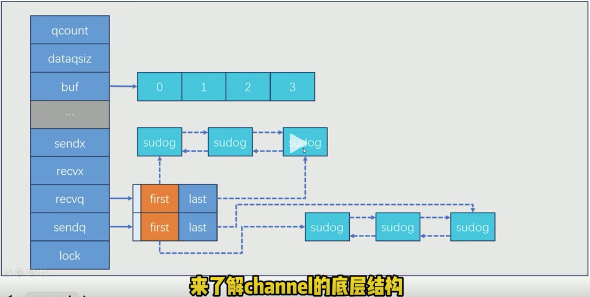
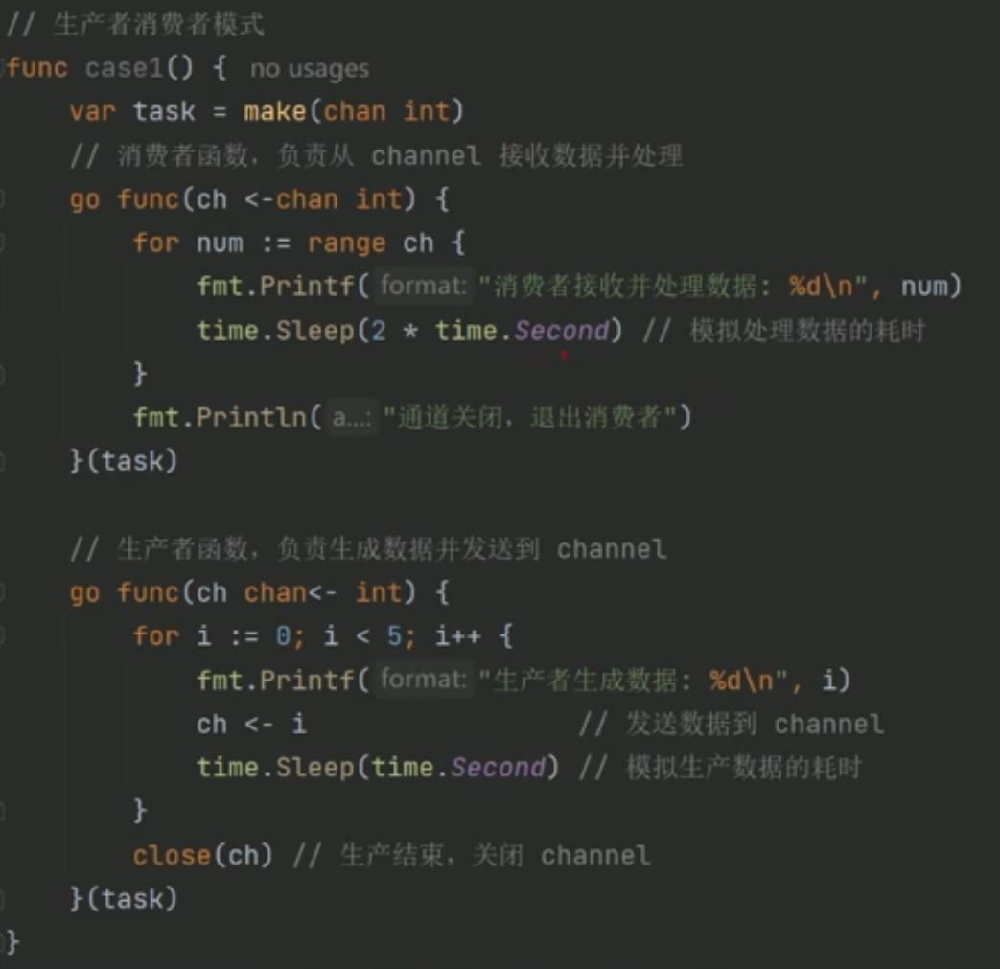
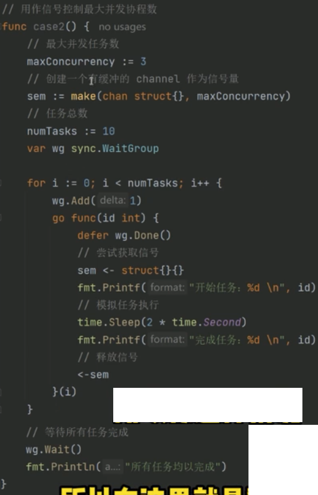
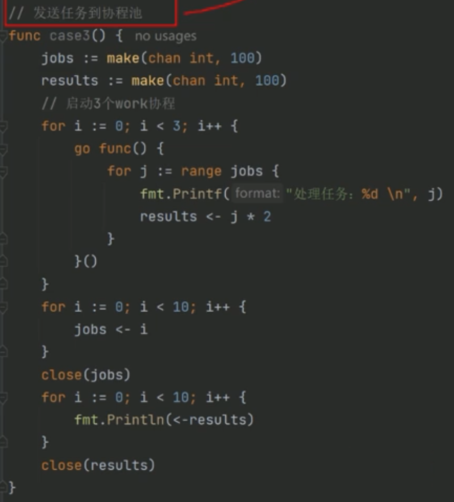
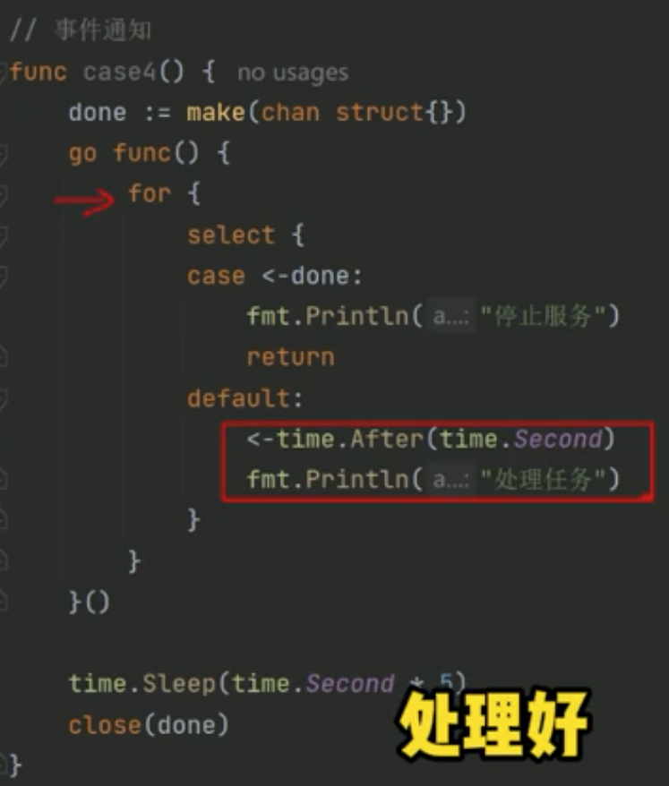

# 1.chan的底层结构

 

==================================================== 
# 2. channel在项目中的应用
 对于channel的 使用场景，只要紧扣住一个主题就行，那就是channel是用干协程间通讯的。
# 2.1 channel在项目中的4种典型应用场景

```go
func main(){
    ctx,stop := signal.NotifyContext(context.Background(),os.Kill,os.Interrupt)
    defer stop()
    //case1()
    //case2()
    //case3()
    //case4()
    <-ctx.Done()
}
```

(1)生产者消费者模式(仅限于应用程序内部)
func casei() {...}
 

(2)用作信号控制最大并发协程数(避免协程溢出)
func case2() {...}
 

(3)发送任务到协程池
 func case3(){...}
 

(4)事件通知
 func case4(){...}

 
