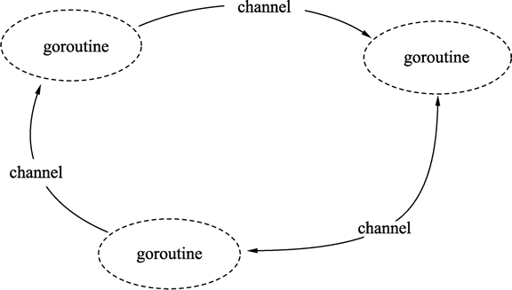

# Go语言入门教程，Golang入门教程（非常详细）
<http://c.biancheng.net/golang/>
<https://www.kancloud.cn/imdszxs/golang/1535582>
<https://www.xinbaoku.com/archive/2DHvuPFr.html>

# 0.目录 
> 9并发	2
> [9.1Go语言并发简述（并发的优势）]	
>   9.1.1Goroutine介绍	
>   9.1.2channel	
> [9.2Go语言轻量级线程]	
>   9.2.1使用普通函数创建 goroutine	
>   9.2.2使用匿名函数创建goroutine	
> [9.3Go语言并发通信]
> [9.4Go语言竞争状态]	
>   9.4.1锁住共享资源	
> [9.5Go语言调整并发的运行性能]
> [9.6并发和并行的区别]	
> [9.7goroutine和coroutine的区别]	
> [9.8Go语言通道（chan）]	
>   9.8.1通道的特性	
>   9.8.2声明通道类型	
>       var 通道变量 chan 通道类型	
>   9.8.3创建通道	
>   9.8.4使用通道发送数据	
>   9.8.5使用通道接收数据	
> [9.9示例：并发打印]	
> [9.10Go语言单向通道]	
>   9.10.1单向通道的声明格式	
>   9.10.2单向通道的使用例子	
>   9.10.3time包中的单向通道	
>   9.10.4关闭 channel	
> [9.11Go语言无缓冲的通道]	
> [9.12Go语言带缓冲的通道]	
>   9.12.1创建带缓冲通道	
>   9.12.2阻塞条件	
> [9.13Go语言channel超时机制]
> [9.14Go语言通道的多路复用]	
> [9.15Go语言模拟远程过程调用]	
>   9.15.1客户端请求和接收封装	
>   9.15.2服务器接收和反馈数据	
>   9.15.3模拟超时	
>   9.15.4主流程	
> [9.16示例：使用通道响应计时器的事件]	
>   9.16.1一段时间之后（time.After）	
>   9.16.2定点计时	
> [9.17Go语言关闭通道后继续使用通道]	
>   9.17.1格式	
>   9.17.2给被关闭通道发送数据将会触发panic	
>   9.17.3从已关闭的通道接收数据时将不会发生阻塞	
> [9.18Go语言多核并行化]	
> [9.19Go语言Telnet回音服务器]	
>   9.19.1接受连接	
>   9.19.2会话处理	
>   9.19.3Telnet命令处理	
>   9.19.4程序入口	
>   9.19.5测试输入字符串	
>   9.19.6测试关闭会话	
>   9.19.7测试关闭服务器	
> [9.20检测代码在并发环境下可能出现的问题]	
> [9.21互斥锁和读写互斥锁]	
> [9.22Go语言等待组]	
> [9.23死锁、活锁和饥饿概述]	
>   9.23.1死锁	
>   9.23.2活锁	
>   9.23.3饥饿	
>   9.23.4总结	
> [9.24示例：封装qsort快速排序函数]	
>   9.24.1认识qsort函数	
>   9.24.2使用Go语言实现快速排序函数	
>   1) 快速排序稳定性	
>   2) 快速排序时间复杂度	
>   9.24.3分治法策略	
> [9.25Go语言CSP：通信顺序进程简述]	
>   9.26示例：聊天服务器	
>   9.26.1服务端程序	
>   9.26.2客户端程序	
> [9.27高效地使用Go语言并发特性]
> [9.28使用select切换协程]	
> [9.29Go语言加密通信]	

# 9[并发](http://c.biancheng.net/golang/concurrent/)

Go语言并发，Golang并发

---------------------------------------

并发指在同一时间内可以执行多个任务。并发编程含义比较广泛，包含多线程编程、多进程编程及分布式程序等。本章讲解的并发含义属于多线程编程。  
  
Go 语言通过编译器运行时（runtime），从语言上支持了并发的特性。Go 语言的并发通过 goroutine 特性完成。goroutine 类似于线程，但是可以根据需要创建多个 goroutine 并发工作。goroutine 是由 Go 语言的运行时调度完成，而线程是由操作系统调度完成。  
  
Go 语言还提供 channel 在多个 goroutine 间进行通信。goroutine 和 channel 是 Go 语言秉承的 CSP（Communicating Sequential Process）并发模式的重要实现基础。本章中，将详细为大家讲解 goroutine 和 channel 及相关特性。

## 9.1Go语言并发简述（并发的优势）

有人把Go语言比作 21 世纪的C语言，第一是因为Go语言设计简单，第二则是因为 21 世纪最重要的就是并发程序设计，而 Go 从语言层面就支持并发。同时实现了自动垃圾回收机制。  
  
Go语言的并发机制运用起来非常简便，在启动并发的方式上直接添加了语言级的关键字就可以实现，和其他编程语言相比更加轻量。  
  
下面来介绍几个概念：

#### 进程/线程

进程是程序在操作系统中的一次执行过程，系统进行资源分配和调度的一个独立单位。  
  
线程是进程的一个执行实体，是 CPU 调度和分派的基本单位，它是比进程更小的能独立运行的基本单位。  
  
一个进程可以创建和撤销多个线程，同一个进程中的多个线程之间可以并发执行。

#### 并发/并行

多线程程序在单核心的 cpu 上运行，称为并发；多线程程序在多核心的 cpu 上运行，称为并行。  
  
并发与并行并不相同，并发主要由切换时间片来实现“同时”运行，并行则是直接利用多核实现多线程的运行，Go程序可以设置使用核心数，以发挥多核计算机的能力。

#### 协程/线程

协程：独立的栈空间，共享堆空间，调度由用户自己控制，本质上有点类似于用户级线程，这些用户级线程的调度也是自己实现的。  
  
线程：一个线程上可以跑多个协程，协程是轻量级的线程。  
  
优雅的并发编程范式，完善的并发支持，出色的并发性能是Go语言区别于其他语言的一大特色。使用Go语言开发服务器程序时，就需要对它的并发机制有深入的了解。

### 9.1.1Goroutine 介绍

goroutine 是一种非常轻量级的实现，可在单个进程里执行成千上万的并发任务，它是Go语言并发设计的核心。  
  
说到底 goroutine 其实就是线程，但是它比线程更小，十几个 goroutine 可能体现在底层就是五六个线程，而且Go语言内部也实现了 goroutine 之间的内存共享。  
  
使用 go 关键字就可以创建 goroutine，将 go 声明放到一个需调用的函数之前，在相同地址空间调用运行这个函数，这样该函数执行时便会作为一个独立的并发线程，这种线程在Go语言中则被称为 goroutine。  
  
goroutine 的用法如下：

1.  //go 关键字放在方法调用前新建一个 goroutine 并执行方法体

2.  go GetThingDone(param1, param2);

3.  

4.  //新建一个匿名方法并执行

5.  go func(param1, param2) {

6.  }(val1, val2)

7.  

8.  //直接新建一个 goroutine 并在 goroutine 中执行代码块

9.  go {

10. //do someting...

11. }

因为 goroutine 在多核 cpu 环境下是并行的，如果代码块在多个 goroutine 中执行，那么我们就实现了代码的并行。  
  
如果需要了解程序的执行情况，怎么拿到并行的结果呢？需要配合使用channel进行。

### 9.1.2channel

channel 是Go语言在语言级别提供的 goroutine 间的通信方式。我们可以使用 channel 在两个或多个 goroutine 之间传递消息。  
  
channel 是进程内的通信方式，因此通过 channel 传递对象的过程和调用函数时的参数传递行为比较一致，比如也可以传递指针等。如果需要跨进程通信，我们建议用分布式系统的方法来解决，比如使用 Socket 或者 HTTP 等通信协议。Go语言对于网络方面也有非常完善的支持。  
  
channel 是类型相关的，也就是说，一个 channel 只能传递一种类型的值，这个类型需要在声明 channel 时指定。如果对 Unix 管道有所了解的话，就不难理解 channel，可以将其认为是一种类型安全的管道。  
  
定义一个 channel 时，也需要定义发送到 channel 的值的类型，注意，必须使用 make 创建 channel，代码如下所示：

1.  ci := make(chan int)

2.  cs := make(chan string)

3.  cf := make(chan interface{})

回到在 Windows 和 Linux 出现之前的古老年代，在开发程序时并没有并发的概念，因为命令式程序设计语言是以串行为基础的，程序会顺序执行每一条指令，整个程序只有一个执行上下文，即一个调用栈，一个堆。  
  
并发则意味着程序在运行时有多个执行上下文，对应着多个调用栈。我们知道每一个进程在运行时，都有自己的调用栈和堆，有一个完整的上下文，而操作系统在调度进程的时候，会保存被调度进程的上下文环境，等该进程获得时间片后，再恢复该进程的上下文到系统中。  
  
从整个操作系统层面来说，多个进程是可以并发的，那么并发的价值何在？下面我们先看以下几种场景。  
  
1) 一方面我们需要灵敏响应的图形用户界面，一方面程序还需要执行大量的运算或者 IO 密集操作，而我们需要让界面响应与运算同时执行。  
  
2) 当我们的 Web 服务器面对大量用户请求时，需要有更多的“Web 服务器工作单元”来分别响应用户。  
  
3) 我们的事务处于分布式环境上，相同的工作单元在不同的计算机上处理着被分片的数据，计算机的 CPU 从单内核（core）向多内核发展，而我们的程序都是串行的，计算机硬件的能力没有得到发挥。  
  
4) 我们的程序因为 IO 操作被阻塞，整个程序处于停滞状态，其他 IO 无关的任务无法执行。  
  
从以上几个例子可以看到，串行程序在很多场景下无法满足我们的要求。下面我们归纳了并发程序的几条优点，让大家认识到并发势在必行：

- 并发能更客观地表现问题模型；

- 并发可以充分利用 CPU 核心的优势，提高程序的执行效率；

- 并发能充分利用 CPU 与其他硬件设备固有的异步性。

## 9.2 [Go语言轻量级线程](http://c.biancheng.net/view/93.html)

Go语言goroutine（轻量级线程）

---------------------------------------------

在编写 Socket 网络程序时，需要提前准备一个线程池为每一个 Socket 的收发包分配一个线程。开发人员需要在线程数量和 CPU 数量间建立一个对应关系，以保证每个任务能及时地被分配到 CPU 上进行处理，同时避免多个任务频繁地在线程间切换执行而损失效率。  
  
虽然，线程池为逻辑编写者提供了线程分配的抽象机制。但是，如果面对随时随地可能发生的并发和线程处理需求，线程池就不是非常直观和方便了。能否有一种机制：使用者分配足够多的任务，系统能自动帮助使用者把任务分配到 CPU 上，让这些任务尽量并发运作。这种机制在 Go语言中被称为 goroutine。  
  
goroutine 是 Go语言中的轻量级线程实现，由 Go 运行时（runtime）管理。Go 程序会智能地将 goroutine 中的任务合理地分配给每个 CPU。  
  
Go 程序从 main 包的 main() 函数开始，在程序启动时，Go 程序就会为 main() 函数创建一个默认的 goroutine。

### 9.2.1使用普通函数创建 goroutine

Go 程序中使用 **go** 关键字为一个函数创建一个 goroutine。一个函数可以被创建多个 goroutine，一个 goroutine 必定对应一个函数。

#### 1) 格式

为一个普通函数创建 goroutine 的写法如下：

go 函数名( 参数列表 )

- 函数名：要调用的函数名。

- 参数列表：调用函数需要传入的参数。

使用 go 关键字创建 goroutine 时，被调用函数的返回值会被忽略。  
  
如果需要在 goroutine 中返回数据，请使用后面介绍的通道（channel）特性，通过通道把数据从 goroutine 中作为返回值传出。

#### 2) 例子

使用 go 关键字，将 running() 函数并发执行，每隔一秒打印一次计数器，而 main 的 goroutine 则等待用户输入，两个行为可以同时进行。请参考下面代码：

1.  package main

2.  

3.  import (

4.  "fmt"

5.  "time"

6.  )

7.  

8.  func running() {

9.  

10. var times int

11. // 构建一个无限循环

12. for {

13. times++

14. fmt.Println("tick", times)

15. 

16. // 延时1秒

17. time.Sleep(time.Second)

18. }

19. 

20. }

21. 

22. func main() {

23. 

24. // 并发执行程序

25. go running()

26. 

27. // 接受命令行输入, 不做任何事情

28. var input string

29. fmt.Scanln(&input)

30. }

命令行输出如下：

tick 1  
tick 2  
tick 3  
tick 4  
tick 5

代码执行后，命令行会不断地输出 tick，同时可以使用 fmt.Scanln() 接受用户输入。两个环节可以同时进行。  
  
代码说明如下：  
第 12 行，使用 for 形成一个无限循环。  
第 13 行，times 变量在循环中不断自增。  
第 14 行，输出 times 变量的值。  
第 17 行，使用 time.Sleep 暂停 1 秒后继续循环。  
第 25 行，使用 go 关键字让 running() 函数并发运行。  
第 29 行，接受用户输入，直到按 Enter 键时将输入的内容写入 input 变量中并返回，整个程序终止。  
  
这段代码的执行顺序如下图所示。

  
图：并发运行图

这个例子中，Go 程序在启动时，运行时（runtime）会默认为 main() 函数创建一个 goroutine。在 main() 函数的 goroutine 中执行到 go running 语句时，归属于 running() 函数的 goroutine 被创建，running() 函数开始在自己的 goroutine 中执行。此时，main() 继续执行，两个 goroutine 通过 Go 程序的调度机制同时运作。

### 9.2.2使用匿名函数创建goroutine

go 关键字后也可以为匿名函数或闭包启动 goroutine。

#### 1) 使用匿名函数创建goroutine的格式

使用匿名函数或闭包创建 goroutine 时，除了将函数定义部分写在 go 的后面之外，还需要加上匿名函数的调用参数，格式如下：

go func( 参数列表 ){  
    函数体  
}( 调用参数列表 )

其中：

- 参数列表：函数体内的参数变量列表。

- 函数体：匿名函数的代码。

- 调用参数列表：启动 goroutine 时，需要向匿名函数传递的调用参数。

#### 2) 使用匿名函数创建goroutine的例子

在 main() 函数中创建一个匿名函数并为匿名函数启动 goroutine。匿名函数没有参数。代码将并行执行定时打印计数的效果。参见下面的代码：

1.  package main

2.  

3.  import (

4.  "fmt"

5.  "time"

6.  )

7.  

8.  func main() {

9.  

10. go func() {

11. 

12. var times int

13. 

14. for {

15. times++

16. fmt.Println("tick", times)

17. 

18. time.Sleep(time.Second)

19. }

20. 

21. }()

22. 

23. var input string

24. fmt.Scanln(&input)

25. }

代码说明如下：

- 第 10 行，go 后面接匿名函数启动 goroutine。

- 第 12～19 行的逻辑与前面程序的 running() 函数一致。

- 第 21 行的括号的功能是调用匿名函数的参数列表。由于第 10 行的匿名函数没有参数，因此第 21 行的参数列表也是空的。

#### 提示

所有 goroutine 在 main() 函数结束时会一同结束。  
  
goroutine 虽然类似于线程概念，但是从调度性能上没有线程细致，而细致程度取决于 Go 程序的 goroutine 调度器的实现和运行环境。  
  
终止 goroutine 的最好方法就是自然返回 goroutine 对应的函数。虽然可以用 golang.org/x/net/context 包进行 goroutine 生命期深度控制，但这种方法仍然处于内部试验阶段，并不是官方推荐的特性。  
  
截止 Go 1.9 版本，暂时没有标准接口获取 goroutine 的 ID。

## 9.3 [Go语言并发通信](http://c.biancheng.net/view/4357.html)

通过上一节《Go语言goroutine》的学习，关键字 go 的引入使得在Go语言中并发编程变得简单而优雅，但我们同时也应该意识到并发编程的原生复杂性，并时刻对并发中容易出现的问题保持警惕。  
  
事实上，不管是什么平台，什么编程语言，不管在哪，并发都是一个大话题。并发编程的难度在于协调，而协调就要通过交流，从这个角度看来，并发单元间的通信是最大的问题。  
  
在工程上，有两种最常见的并发通信模型：共享数据和消息。  
  
共享数据是指多个并发单元分别保持对同一个数据的引用，实现对该数据的共享。被共享的数据可能有多种形式，比如内存数据块、磁盘文件、网络数据等。在实际工程应用中最常见的无疑是内存了，也就是常说的共享内存。  
  
先看看我们在C语言中通常是怎么处理线程间数据共享的，代码如下所示。

1.  \#include \<stdio.h\>

2.  \#include \<stdlib.h\>

3.  \#include \<pthread.h\>

4.  void \*count();

5.  pthread_mutex_t mutex1 = PTHREAD_MUTEX_INITIALIZER;

6.  int counter = 0;

7.  int main()

8.  {

9.  int rc1, rc2;

10. pthread_t thread1, thread2;

11. /\* 创建线程，每个线程独立执行函数functionC \*/

12. **if**((rc1 = pthread_create(&thread1, NULL, &count, NULL)))

13. {

14. printf("Thread creation failed: %d\n", rc1);

15. }

16. **if**((rc2 = pthread_create(&thread2, NULL, &count, NULL)))

17. {

18. printf("Thread creation failed: %d\n", rc2);

19. }

20. /\* 等待所有线程执行完毕 \*/

21. pthread_join( thread1, NULL);

22. pthread_join( thread2, NULL);

23. exit(0);

24. }

25. void \*count()

26. {

27. pthread_mutex_lock( &mutex1 );

28. counter++;

29. printf("Counter value: %d\n",counter);

30. pthread_mutex_unlock( &mutex1 );

31. }

现在我们尝试将这段C语言代码直接翻译为Go语言代码，代码如下所示。

1.  package main

2.  import (

3.      "fmt"

4.      "runtime"

5.      "sync"

6.  )

7.  var counter int = 0

8.  func Count(lock \*sync.Mutex) {

9.  lock.Lock()

10. counter++

11. fmt.Println(counter)

12. lock.Unlock()

13. }

14. func main() {

15. lock := &sync.Mutex{}

16. for i := 0; i \< 10; i++ {

17. go Count(lock)

18. }

19. for {

20. lock.Lock()

21. c := counter

22. lock.Unlock()

23. runtime.Gosched()

24. if c \>= 10 {

25. break

26. }

27. }

28. }

在上面的例子中，我们在 10 个 goroutine 中共享了变量 counter。每个 goroutine 执行完成后，会将 counter 的值加 1。因为 10 个 goroutine 是并发执行的，所以我们还引入了锁，也就是代码中的 lock 变量。每次对 n 的操作，都要先将锁锁住，操作完成后，再将锁打开。  
  
在 main 函数中，使用 for 循环来不断检查 counter 的值（同样需要加锁）。当其值达到 10 时，说明所有 goroutine 都执行完毕了，这时主函数返回，程序退出。  
  
事情好像开始变得糟糕了。实现一个如此简单的功能，却写出如此臃肿而且难以理解的代码。想象一下，在一个大的系统中具有无数的锁、无数的共享变量、无数的业务逻辑与错误处理分支，那将是一场噩梦。这噩梦就是众多 C/C++ 开发者正在经历的，其实 Java 和 C# 开发者也好不到哪里去。  
  
Go语言既然以并发编程作为语言的最核心优势，当然不至于将这样的问题用这么无奈的方式来解决。Go语言提供的是另一种通信模型，即以消息机制而非共享内存作为通信方式。  
  
消息机制认为每个并发单元是自包含的、独立的个体，并且都有自己的变量，但在不同并发单元间这些变量不共享。每个并发单元的输入和输出只有一种，那就是消息。这有点类似于进程的概念，每个进程不会被其他进程打扰，它只做好自己的工作就可以了。不同进程间靠消息来通信，它们不会共享内存。  
  
Go语言提供的消息通信机制被称为 channel，关于 channel 的介绍将在后续的学习中为大家讲解。

## 9.4 [Go语言竞争状态](http://c.biancheng.net/view/4358.html)

有并发，就有资源竞争，如果两个或者多个 goroutine 在没有相互同步的情况下，访问某个共享的资源，比如同时对该资源进行读写时，就会处于相互竞争的状态，这就是并发中的资源竞争。  
  
并发本身并不复杂，但是因为有了资源竞争的问题，就使得我们开发出好的并发程序变得复杂起来，因为会引起很多莫名其妙的问题。  
  
下面的代码中就会出现竞争状态：

1.  package main

2.  

3.  import (

4.  "fmt"

5.  "runtime"

6.  "sync"

7.  )

8.  

9.  var (

10. count int32

11. wg sync.WaitGroup

12. )

13. 

14. func main() {

15. wg.Add(2)

16. go incCount()

17. go incCount()

18. wg.Wait()

19. fmt.Println(count)

20. }

21. 

22. func incCount() {

23. defer wg.Done()

24. for i := 0; i \< 2; i++ {

25. value := count

26. runtime.Gosched()

27. value++

28. count = value

29. }

30. }

这是一个资源竞争的例子，大家可以将程序多运行几次，会发现结果可能是 2，也可以是 3，还可能是 4。这是因为 count 变量没有任何同步保护，所以两个 goroutine 都会对其进行读写，会导致对已经计算好的结果被覆盖，以至于产生错误结果。  
  
代码中的 runtime.Gosched() 是让当前 goroutine 暂停的意思，退回执行队列，让其他等待的 goroutine 运行，目的是为了使资源竞争的结果更明显。  
  
下面我们来分析一下程序的运行过程，将两个 goroutine 分别假设为 g1 和 g2：

- g1 读取到 count 的值为 0；

- 然后 g1 暂停了，切换到 g2 运行，g2 读取到 count 的值也为 0；

- g2 暂停，切换到 g1，g1 对 count+1，count 的值变为 1；

- g1 暂停，切换到 g2，g2 刚刚已经获取到值 0，对其 +1，最后赋值给 count，其结果还是 1；

- 可以看出 g1 对 count+1 的结果被 g2 给覆盖了，两个 goroutine 都 +1 而结果还是 1。

通过上面的分析可以看出，之所以出现上面的问题，是因为两个 goroutine 相互覆盖结果。  
  
所以我们对于同一个资源的读写必须是原子化的，也就是说，同一时间只能允许有一个 goroutine 对共享资源进行读写操作。  
  
共享资源竞争的问题，非常复杂，并且难以察觉，好在 Go 为我们提供了一个工具帮助我们检查，这个就是**go build** -race 命令。在项目目录下执行这个命令，生成一个可以执行文件，然后再运行这个可执行文件，就可以看到打印出的检测信息。  
  
在go build命令中多加了一个-race 标志，这样生成的可执行程序就自带了检测资源竞争的功能，运行生成的可执行文件，效果如下所示：

==================  
WARNING: DATA RACE  
Read at 0x000000619cbc by goroutine 8:  
  main.incCount()  
      D:/code/src/main.go:25 +0x80  
  
Previous write at 0x000000619cbc by goroutine 7:  
  main.incCount()  
      D:/code/src/main.go:28 +0x9f  
  
Goroutine 8 (running) created at:  
  main.main()  
      D:/code/src/main.go:17 +0x7e  
  
Goroutine 7 (finished) created at:  
  main.main()  
      D:/code/src/main.go:16 +0x66  
==================  
4  
Found 1 data race(s)

通过运行结果可以看出 goroutine 8 在代码 25 行读取共享资源value := count，而这时 goroutine 7 在代码 28 行修改共享资源count = value，而这两个 goroutine 都是从 main 函数的 16、17 行通过 go 关键字启动的。

## 9.4.1锁住共享资源

Go语言提供了传统的同步 goroutine 的机制，就是对共享资源加锁。atomic 和 sync 包里的一些函数就可以对共享的资源进行加锁操作。

#### 1)原子函数

原子函数能够以很底层的加锁机制来同步访问整型变量和指针，示例代码如下所示：

1.  package main

2.  

3.  import (

4.  "fmt"

5.  "runtime"

6.  "sync"

7.  "sync/atomic"

8.  )

9.  

10. var (

11. counter int64

12. wg sync.WaitGroup

13. )

14. 

15. func main() {

16. wg.Add(2)

17. go incCounter(1)

18. go incCounter(2)

19. 

20. wg.Wait() //等待goroutine结束

21. fmt.Println(counter)

22. }

23. 

24. func incCounter(id int) {

25. defer wg.Done()

26. for count := 0; count \< 2; count++ {

27. atomic.AddInt64(&counter, 1) //安全的对counter加1

28. 

29. runtime.Gosched()

30. }

31. }

上述代码中使用了 atmoic 包的 AddInt64 函数，这个函数会同步整型值的加法，方法是强制同一时刻只能有一个 gorountie 运行并完成这个加法操作。当 goroutine 试图去调用任何原子函数时，这些 goroutine 都会自动根据所引用的变量做同步处理。  
  
另外两个有用的原子函数是 LoadInt64 和 StoreInt64。这两个函数提供了一种安全地读和写一个整型值的方式。下面是代码就使用了 LoadInt64 和 StoreInt64 函数来创建一个同步标志，这个标志可以向程序里多个 goroutine 通知某个特殊状态。

1.  package main

2.  

3.  import (

4.  "fmt"

5.  "sync"

6.  "sync/atomic"

7.  "time"

8.  )

9.  

10. var (

11. shutdown int64

12. wg sync.WaitGroup

13. )

14. 

15. func main() {

16. wg.Add(2)

17. 

18. go doWork("A")

19. go doWork("B")

20. 

21. time.Sleep(1 \* time.Second)

22. fmt.Println("Shutdown Now")

23. atomic.StoreInt64(&shutdown, 1)

24. wg.Wait()

25. }

26. 

27. func doWork(name string) {

28. defer wg.Done()

29. 

30. for {

31. fmt.Printf("Doing %s Work\n", name)

32. time.Sleep(250 \* time.Millisecond)

33. 

34. if atomic.LoadInt64(&shutdown) == 1 {

35. fmt.Printf("Shutting %s Down\n", name)

36. break

37. }

38. }

39. }

上面代码中 main 函数使用 StoreInt64 函数来安全地修改 shutdown 变量的值。如果哪个 doWork goroutine 试图在 main 函数调用 StoreInt64 的同时调用 LoadInt64 函数，那么原子函数会将这些调用互相同步，保证这些操作都是安全的，不会进入竞争状态。

#### 2)互斥锁

另一种同步访问共享资源的方式是使用互斥锁，互斥锁这个名字来自互斥的概念。互斥锁用于在代码上创建一个临界区，保证同一时间只有一个 goroutine 可以执行这个临界代码。  
  
示例代码如下所示：

1.  package main

2.  

3.  import (

4.  "fmt"

5.  "runtime"

6.  "sync"

7.  )

8.  

9.  var (

10. counter int64

11. wg sync.WaitGroup

12. mutex sync.Mutex

13. )

14. 

15. func main() {

16. wg.Add(2)

17. 

18. go incCounter(1)

19. go incCounter(2)

20. 

21. wg.Wait()

22. fmt.Println(counter)

23. }

24. 

25. func incCounter(id int) {

26. defer wg.Done()

27. 

28. for count := 0; count \< 2; count++ {

29. //同一时刻只允许一个goroutine进入这个临界区

30. mutex.Lock()

31. {

32. value := counter

33. runtime.Gosched()

34. value++

35. counter = value

36. }

37. mutex.Unlock() //释放锁，允许其他正在等待的goroutine进入临界区

38. }

39. }

同一时刻只有一个 goroutine 可以进入临界区。之后直到调用 Unlock 函数之后，其他 goroutine 才能进去临界区。当调用 runtime.Gosched 函数强制将当前 goroutine 退出当前线程后，调度器会再次分配这个 goroutine 继续运行。

## 9.5 [Go语言调整并发的运行性能](http://c.biancheng.net/view/94.html)

Go语言GOMAXPROCS（调整并发的运行性能）

------------------------------------------------------------

在 Go语言程序运行时（runtime）实现了一个小型的任务调度器。这套调度器的工作原理类似于操作系统调度线程，Go 程序调度器可以高效地将 CPU 资源分配给每一个任务。传统逻辑中，开发者需要维护线程池中线程与 CPU 核心数量的对应关系。同样的，Go 地中也可以通过 runtime.GOMAXPROCS() 函数做到，格式为：

runtime.GOMAXPROCS(逻辑CPU数量)

这里的逻辑CPU数量可以有如下几种数值：

- \<1：不修改任何数值。

- =1：单核心执行。

- \>1：多核并发执行。

一般情况下，可以使用 runtime.NumCPU() 查询 CPU 数量，并使用 runtime.GOMAXPROCS() 函数进行设置，例如：

1.  runtime.GOMAXPROCS(runtime.NumCPU())

Go 1.5 版本之前，默认使用的是单核心执行。从 Go 1.5 版本开始，默认执行上面语句以便让代码并发执行，最大效率地利用 CPU。  
  
GOMAXPROCS 同时也是一个环境变量，在应用程序启动前设置环境变量也可以起到相同的作用。

## 9.6 [并发和并行的区别](http://c.biancheng.net/view/95.html)

在讲解并发概念时，总会涉及另外一个概念并行。下面让我们来了解并发和并行之间的区别。

- 并发（concurrency）：把任务在不同的时间点交给处理器进行处理。在同一时间点，任务并不会同时运行。

- 并行（parallelism）：把每一个任务分配给每一个处理器独立完成。在同一时间点，任务一定是同时运行。

并发不是并行。并行是让不同的代码片段同时在不同的物理处理器上执行。并行的关键是同时做很多事情，而并发是指同时管理很多事情，这些事情可能只做了一半就被暂停去做别的事情了。  
  
在很多情况下，并发的效果比并行好，因为操作系统和硬件的总资源一般很少，但能支持系统同时做很多事情。这种“使用较少的资源做更多的事情”的哲学，也是指导 Go语言设计的哲学。  
  
如果希望让 goroutine 并行，必须使用多于一个逻辑处理器。当有多个逻辑处理器时，调度器会将 goroutine 平等分配到每个逻辑处理器上。这会让 goroutine 在不同的线程上运行。不过要想真的实现并行的效果，用户需要让自己的程序运行在有多个物理处理器的机器上。否则，哪怕 Go语言运行时使用多个线程，goroutine 依然会在同一个物理处理器上并发运行，达不到并行的效果。  
  
下图展示了在一个逻辑处理器上并发运行 goroutine 和在两个逻辑处理器上并行运行两个并发的 goroutine 之间的区别。调度器包含一些聪明的算法，这些算法会随着 Go语言的发布被更新和改进，所以不推荐盲目修改语言运行时对逻辑处理器的默认设置。如果真的认为修改逻辑处理器的数量可以改进性能，也可以对语言运行时的参数进行细微调整。

  
图：并发与并行的区别

Go语言在 GOMAXPROCS 数量与任务数量相等时，可以做到并行执行，但一般情况下都是并发执行。

## 9.7 [goroutine和coroutine的区别](http://c.biancheng.net/view/96.html)

C#、Lua、Python 语言都支持 coroutine 特性。coroutine 与 goroutine 在名字上类似，都可以将函数或者语句在独立的环境中运行，但是它们之间有两点不同：

- goroutine 可能发生并行执行；

- 但 coroutine 始终顺序执行。

goroutines 意味着并行（或者可以以并行的方式部署），coroutines 一般来说不是这样的，goroutines 通过通道来通信；coroutines 通过让出和恢复操作来通信，goroutines 比 coroutines 更强大，也很容易从 coroutines 的逻辑复用到 goroutines。  
  
狭义地说，goroutine 可能发生在多线程环境下，goroutine 无法控制自己获取高优先度支持；coroutine 始终发生在单线程，coroutine 程序需要主动交出控制权，宿主才能获得控制权并将控制权交给其他 coroutine。  
  
goroutine 间使用 channel 通信，coroutine 使用 yield 和 resume 操作。  
  
goroutine 和 coroutine 的概念和运行机制都是脱胎于早期的操作系统。  
  
coroutine 的运行机制属于协作式任务处理，早期的操作系统要求每一个应用必须遵守操作系统的任务处理规则，应用程序在不需要使用 CPU 时，会主动交出 CPU 使用权。如果开发者无意间或者故意让应用程序长时间占用 CPU，操作系统也无能为力，表现出来的效果就是计算机很容易失去响应或者死机。  
  
goroutine 属于抢占式任务处理，已经和现有的多线程和多进程任务处理非常类似。应用程序对 CPU 的控制最终还需要由操作系统来管理，操作系统如果发现一个应用程序长时间大量地占用 CPU，那么用户有权终止这个任务。

## 9.8 [Go语言通道（chan）](http://c.biancheng.net/view/97.html)

Go语言通道（chan）——goroutine之间通信的管道

---------------------------------------------------------------------------

如果说 goroutine 是 Go语言程序的并发体的话，那么 channels 就是它们之间的通信机制。一个 channels 是一个通信机制，它可以让一个 goroutine 通过它给另一个 goroutine 发送值信息。每个 channel 都有一个特殊的类型，也就是 channels 可发送数据的类型。一个可以发送 int 类型数据的 channel 一般写为 chan int。  
  
Go语言提倡使用通信的方法代替共享内存，当一个资源需要在 goroutine 之间共享时，通道在 goroutine 之间架起了一个管道，并提供了确保同步交换数据的机制。声明通道时，需要指定将要被共享的数据的类型。可以通过通道共享内置类型、命名类型、结构类型和引用类型的值或者指针。  
  
这里通信的方法就是使用通道（channel），如下图所示。

  
图：goroutine 与 channel 的通信

在地铁站、食堂、洗手间等公共场所人很多的情况下，大家养成了排队的习惯，目的也是避免拥挤、插队导致的低效的资源使用和交换过程。代码与数据也是如此，多个 goroutine 为了争抢数据，势必造成执行的低效率，使用队列的方式是最高效的，channel 就是一种队列一样的结构。

### 9.8.1通道的特性

Go语言中的通道（channel）是一种特殊的类型。**<u>在任何时候，同时只能有一个 goroutine 访问通道进行发送和获取数据。</u>**goroutine 间通过通道就可以通信。  
  
通道像一个传送带或者队列，总是遵循先入先出（First In First Out）的规则，保证收发数据的顺序。

### 9.8.2声明通道类型

通道本身需要一个类型进行修饰，就像切片类型需要标识元素类型。通道的元素类型就是在其内部传输的数据类型，声明如下：
var 通道变量 chan 通道类型

- 通道类型：通道内的数据类型。
- 通道变量：保存通道的变量。

chan 类型的空值是 nil，声明后需要配合 make 后才能使用。

### 9.8.3创建通道

通道是引用类型，需要使用 make 进行创建，格式如下：
通道实例 := make(chan 数据类型)

- 数据类型：通道内传输的元素类型。
- 通道实例：通过make创建的通道句柄。

请看下面的例子：

1.  ch1 := make(chan int) // 创建一个整型类型的通道
2.  ch2 := make(chan interface{}) // 创建一个空接口类型的通道, 可以存放任意格式
3.  
4.  type Equip struct{ /* 一些字段 */ }
5.  ch2 := make(chan *Equip) // 创建Equip指针类型的通道, 可以存放*Equip

### 9.8.4使用通道发送数据

通道创建后，就可以使用通道进行发送和接收操作。

#### 1) 通道发送数据的格式

通道的发送使用特殊的操作符<-，将数据通过通道发送的格式为：

通道变量 <- 值

- 通道变量：通过make创建好的通道实例。
- 值：可以是变量、常量、表达式或者函数返回值等。值的类型必须与ch通道的元素类型一致。

#### 2) 通过通道发送数据的例子
使用 make 创建一个通道后，就可以使用<-向通道发送数据，代码如下：

1.  // 创建一个空接口通道
2.  ch := make(chan interface{})
3.  // 将0放入通道中
4.  ch <- 0
5.  // 将hello字符串放入通道中
6.  ch <- "hello"

#### 3) 发送将持续阻塞直到数据被接收

把数据往通道中发送时，如果接收方一直都没有接收，那么发送操作将持续阻塞。Go 程序运行时能智能地发现一些永远无法发送成功的语句并做出提示，代码如下：

1.  package main
2.  
3.  func main() {
4.  // 创建一个整型通道
5.  ch := make(chan int)
6.  
7.  // 尝试将0通过通道发送
8.  ch <- 0
9.  }

运行代码，报错：

fatal error: all goroutines are asleep - deadlock!

报错的意思是：运行时发现所有的 goroutine（包括main）都处于等待 goroutine。也就是说所有 goroutine 中的 channel 并没有形成发送和接收对应的代码。

### 9.8.5使用通道接收数据

通道接收同样使用<-操作符，通道接收有如下特性：  
① 通道的收发操作在不同的两个 goroutine 间进行。  
由于通道的数据在没有接收方处理时，数据发送方会持续阻塞，因此通道的接收必定在另外一个 goroutine 中进行。  
  
② 接收将持续阻塞直到发送方发送数据。  
如果接收方接收时，通道中没有发送方发送数据，接收方也会发生阻塞，直到发送方发送数据为止。  
  
③ 每次接收一个元素。  
通道一次只能接收一个数据元素。  
  
通道的数据接收一共有以下 4 种写法。

#### 1) 阻塞接收数据
阻塞模式接收数据时，将接收变量作为<-操作符的左值，格式如下：
data := <-ch

执行该语句时将会阻塞，直到接收到数据并赋值给 data 变量。

#### 2) 非阻塞接收数据
使用非阻塞方式从通道接收数据时，语句不会发生阻塞，格式如下：
data, ok := <-ch

- data：表示接收到的数据。未接收到数据时，data 为通道类型的零值。
- ok：表示是否接收到数据。

**非阻塞的通道接收方法可能造成高的 CPU 占用，因此使用非常少**。如果需要实现**接收超时**检测，可以配合 select 和计时器 channel 进行，可以参见后面的内容。

#### 3) 接收任意数据，忽略接收的数据

阻塞接收数据后，忽略从通道返回的数据，格式如下：
<-ch

执行该语句时将会发生阻塞，直到接收到数据，但接收到的数据会被忽略。这个方式实际上只是通过通道在 goroutine 间阻塞收发实现并发同步。  
使用通道做并发同步的写法，可以参考下面的例子：

1.  package main
2.  
3.  import (
4.  "fmt"
5.  )
6.  
7.  func main() {
8.  
9.  // 构建一个通道
10. ch := make(chan int)
11. 
12. // 开启一个并发匿名函数
13. go func() {
14. 
15. fmt.Println("start goroutine")
16. 
17. // 通过通道通知main的goroutine
18. ch <- 0
19. 
20. fmt.Println("exit goroutine")
21. 
22. }()
23. 
24. fmt.Println("wait goroutine")
25. 
26. // 等待匿名goroutine
27. <-ch
28. 
29. fmt.Println("all done")
30. 
31. }

执行代码，输出如下：

wait goroutine  
start goroutine  
exit goroutine  
all done

代码说明如下：
- 第 10 行，构建一个同步用的通道。
- 第 13 行，开启一个匿名函数的并发。
- 第 18 行，匿名 goroutine 即将结束时，通过通道通知 main 的 goroutine，这一句会一直阻塞直到 main 的 goroutine 接收为止。
- 第 27 行，开启 goroutine 后，马上通过通道等待匿名 goroutine 结束。

#### 4) 循环接收

通道的数据接收可以借用 for range 语句进行多个元素的接收操作，格式如下：
1.  for data := range ch {
2.  
3.  }

通道 ch 是可以进行遍历的，遍历的结果就是接收到的数据。数据类型就是通道的数据类型。通过 for 遍历获得的变量只有一个，即上面例子中的 data。  
  
遍历通道数据的例子请参考下面的代码。  
  
使用 for 从通道中接收数据：

1.  package main
2.  
3.  import (
4.  "fmt"
5.  
6.  "time"
7.  )
8.  
9.  func main() {
10. 
11. // 构建一个通道
12. ch := make(chan int)
13. 
14. // 开启一个并发匿名函数
15. go func() {
16. 
17. // 从3循环到0
18. for i := 3; i >= 0; i-- {
19. 
20. // 发送3到0之间的数值
21. ch <- i
22. 
23. // 每次发送完时等待
24. time.Sleep(time.Second)
25. }
26. 
27. }()
28. 
29. // 遍历接收通道数据
30. for data := range ch {
31. 
32. // 打印通道数据
33. fmt.Println(data)
34. 
35. // 当遇到数据0时, 退出接收循环
36. if data == 0 {
37. break
38. }
39. }
40. 
41. }

执行代码，输出如下：
3  
2  
1  
0

代码说明如下：
- 第 12 行，通过 make 生成一个整型元素的通道。
- 第 15 行，将匿名函数并发执行。
- 第 18 行，用循环生成 3 到 0 之间的数值。
- 第 21 行，将 3 到 0 之间的数值依次发送到通道 ch 中。
- 第 24 行，每次发送后暂停 1 秒。
- 第 30 行，使用 for 从通道中接收数据。
- 第 33 行，将接收到的数据打印出来。
- 第 36 行，当接收到数值 0 时，停止接收。如果继续发送，由于接收 goroutine 已经退出，没有 goroutine 发送到通道，因此运行时将会触发宕机报错。

## 9.9 [示例：并发打印](http://c.biancheng.net/view/98.html)

前面的例子创建的都是无缓冲通道。使用无缓冲通道往里面装入数据时，装入方将被阻塞，直到另外通道在另外一个 goroutine 中被取出。同样，如果通道中没有放入任何数据，接收方试图从通道中获取数据时，同样也是阻塞。发送和接收的操作是同步完成的。  
  
下面通过一个并发打印的例子，将 goroutine 和 channel 放在一起展示它们的用法。

1.  package main
2.  
3.  import (
4.  "fmt"
5.  )
6.  
7.  func printer(c chan int) {
8.  
9.  // 开始无限循环等待数据
10. for {
11. 
12. // 从channel中获取一个数据
13. data := <-c
14. 
15. // 将0视为数据结束
16. if data == 0 {
17. break
18. }
19. 
20. // 打印数据
21. fmt.Println(data)
22. }
23. 
24. // 通知main已经结束循环(我搞定了!)
25. c <- 0
26. 
27. }
28. 
29. func main() {
30. 
31. // 创建一个channel
32. c := make(chan int)
33. 
34. // 并发执行printer, 传入channel
35. go printer(c)
36. 
37. for i := 1; i <= 10; i++ {
38. 
39. // 将数据通过channel投送给printer
40. c <- i
41. }
42. 
43. // 通知并发的printer结束循环(没数据啦!)
44. c <- 0
45. 
46. // 等待printer结束(搞定喊我!)
47. <-c
48. 
49. }

运行代码，输出如下：

1  
2  
3  
4  
5  
6  
7  
8  
9  
10

代码说明如下：

- 第 10 行，创建一个无限循环，只有当第 16 行获取到的数据为 0 时才会退出循环。
- 第 13 行，从函数参数传入的通道中获取一个整型数值。
- 第 21 行，打印整型数值。
- 第 25 行，在退出循环时，通过通道通知 main() 函数已经完成工作。
- 第 32 行，创建一个整型通道进行跨 goroutine 的通信。
- 第 35 行，创建一个 goroutine，并发执行 printer() 函数。
- 第 37 行，构建一个数值循环，将 1～10 的数通过通道传送给 printer 构造出的 goroutine。
- 第 44 行，给通道传入一个 0，表示将前面的数据处理完成后，退出循环。
- 第 47 行，在数据发送过去后，因为并发和调度的原因，任务会并发执行。这里需要等待 printer 的第 25 行返回数据后，才可以退出 main()。

本例的设计模式就是典型的生产者和消费者。生产者是第 37 行的循环，而消费者是 printer() 函数。整个例子使用了两个 goroutine，一个是 main()，一个是通过第 35 行 printer() 函数创建的 goroutine。两个 goroutine 通过第 32 行创建的通道进行通信。这个通道有下面两重功能。

- 数据传送：第 40 行中发送数据和第 13 行接收数据。
- 控制指令：类似于信号量的功能。同步 goroutine 的操作。功能简单描述为：
  - 第 44 行：“没数据啦！”
  - 第 25 行：“我搞定了！”
  - 第 47 行：“搞定喊我！”

## 9.10 [Go语言单向通道](http://c.biancheng.net/view/99.html)

Go语言单向通道——通道中的单行道

-----------------------------------------------------

Go语言的类型系统提供了单方向的 channel 类型，顾名思义，单向 channel 就是只能用于写入或者只能用于读取数据。当然 channel 本身必然是同时支持读写的，否则根本没法用。  
  
假如一个 channel 真的只能读取数据，那么它肯定只会是空的，因为你没机会往里面写数据。同理，如果一个 channel 只允许写入数据，即使写进去了，也没有丝毫意义，因为没有办法读取到里面的数据。所谓的单向 channel 概念，其实只是对 channel 的一种使用限制。

### 9.10.1单向通道的声明格式

我们在**将一个channel变量传递到一个函数时，可以通过将其指定为单向 channel 变量**，从而限制该函数中可以对此 channel 的操作，比如只能往这个 channel 中写入数据，或者只能从这个 channel 读取数据。  
  
单向 channel 变量的声明非常简单，只能写入数据的通道类型为chan<-，只能读取数据的通道类型为<-chan，格式如下：

var 通道实例 chan<- 元素类型    // 只能写入数据的通道  
var 通道实例 <-chan 元素类型    // 只能读取数据的通道

- 元素类型：通道包含的元素类型。
- 通道实例：声明的通道变量。

### 9.10.2单向通道的使用例子

示例代码如下：
1.  ch := make(chan int)
2.  // 声明一个只能写入数据的通道类型, 并赋值为ch
3.  var chSendOnly chan<- int = ch
4.  //声明一个只能读取数据的通道类型, 并赋值为ch
5.  var chRecvOnly <-chan int = ch

上面的例子中，chSendOnly 只能写入数据，如果尝试读取数据，将会出现如下报错：
invalid operation: <-chSendOnly (receive from send-only type chan<- int)

同理，chRecvOnly 也是不能写入数据的。  
  
当然，使用 make 创建通道时，也可以创建一个只写入或只读取的通道：

1.  ch := make(<-chan int)
2.  
3.  var chReadOnly <-chan int = ch
4.  <-chReadOnly

上面代码编译正常，运行也是正确的。但是，一个不能写入数据只能读取的通道是毫无意义的。

### 9.10.3time包中的单向通道

time 包中的计时器会返回一个 timer 实例，代码如下：
1.  timer := time.NewTimer(time.Second)

timer的Timer类型定义如下：
1.  type Timer struct {
2.  C <-chan Time
3.  r runtimeTimer
4.  }

第 2 行中 C 通道的类型就是一种只能读取的单向通道。如果此处不进行通道方向约束，一旦外部向通道写入数据，将会造成其他使用到计时器的地方逻辑产生混乱。  
  
因此，**单向通道有利于代码接口的严谨性**。

### 9.10.4关闭 channel

关闭 channel 非常简单，直接使用Go语言内置的 close() 函数即可：
close(ch)

在介绍了如何关闭 channel 之后，我们就多了一个问题：如何判断一个 channel 是否已经被关闭？我们可以在读取的时候使用多重返回值的方式：
x, ok := <-ch

这个用法与 map 中的按键获取 value 的过程比较类似，只需要看第二个 bool 返回值即可，如果返回值是 false 则表示 ch 已经被关闭。

## 9.11 [Go语言无缓冲的通道](http://c.biancheng.net/view/4359.html)

Go语言中无缓冲的通道（unbuffered channel）是指在接收前没有能力保存任何值的通道。这种类型的通道要求发送 goroutine 和接收 goroutine 同时准备好，才能完成发送和接收操作。  
  
如果两个 goroutine 没有同时准备好，通道会导致先执行发送或接收操作的 goroutine 阻塞等待。这种对通道进行发送和接收的交互行为本身就是同步的。其中任意一个操作都无法离开另一个操作单独存在。  
  
阻塞指的是由于某种原因数据没有到达，当前协程（线程）持续处于等待状态，直到条件满足才解除阻塞。  
同步指的是在两个或多个协程（线程）之间，保持数据内容一致性的机制。  
  
下图展示两个 goroutine 如何利用无缓冲的通道来共享一个值。

  
图：使用无缓冲的通道在 goroutine 之间同步

在第 1 步，两个 goroutine 都到达通道，但哪个都没有开始执行发送或者接收。在第 2 步，左侧的 goroutine 将它的手伸进了通道，这模拟了向通道发送数据的行为。这时，这个 goroutine 会在通道中被锁住，直到交换完成。  
  
在第 3 步，右侧的 goroutine 将它的手放入通道，这模拟了从通道里接收数据。这个 goroutine 一样也会在通道中被锁住，直到交换完成。在第 4 步和第 5 步，进行交换，并最终在第 6 步，两个 goroutine 都将它们的手从通道里拿出来，这模拟了被锁住的 goroutine 得到释放。两个 goroutine 现在都可以去做别的事情了。  
  
为了讲得更清楚，让我们来看两个完整的例子。这两个例子都会使用无缓冲的通道在两个 goroutine 之间同步交换数据。  
  
【示例 1】在网球比赛中，两位选手会把球在两个人之间来回传递。选手总是处在以下两种状态之一，要么在等待接球，要么将球打向对方。可以使用两个 goroutine 来模拟网球比赛，并使用无缓冲的通道来模拟球的来回，代码如下所示。

1.  // 这个示例程序展示如何用无缓冲的通道来模拟

2.  // 2 个goroutine 间的网球比赛

3.  package main

4.  

5.  import (

6.  "fmt"

7.  "math/rand"

8.  "sync"

9.  "time"

10. )

11. 

12. // wg 用来等待程序结束

13. var wg sync.WaitGroup

14. 

15. func init() {

16. rand.Seed(time.Now().UnixNano())

17. }

18. 

19. // main 是所有Go 程序的入口

20. func main() {

21. // 创建一个无缓冲的通道

22. court := make(chan int)

23. 

24. // 计数加 2，表示要等待两个goroutine

25. wg.Add(2)

26. 

27. // 启动两个选手

28. go player("Nadal", court)

29. go player("Djokovic", court)

30. 

31. // 发球

32. court <- 1

33. 

34. // 等待游戏结束

35. wg.Wait()

36. }

37. 

38. // player 模拟一个选手在打网球

39. func player(name string, court chan int) {

40. // 在函数退出时调用Done 来通知main 函数工作已经完成

41. defer wg.Done()

42. 

43. for {

44. // 等待球被击打过来

45. ball, ok := <-court

46. if !ok {

47. // 如果通道被关闭，我们就赢了

48. fmt.Printf("Player %s Won\n", name)

49. return

50. }

51. 

52. // 选随机数，然后用这个数来判断我们是否丢球

53. n := rand.Intn(100)

54. if n%13 == 0 {

55. fmt.Printf("Player %s Missed\n", name)

56. 

57. // 关闭通道，表示我们输了

58. close(court)

59. return

60. }

61. 

62. // 显示击球数，并将击球数加1

63. fmt.Printf("Player %s Hit %d\n", name, ball)

64. ball++

65. 

66. // 将球打向对手

67. court <- ball

68. }

69. }

运行这个程序，输出结果如下所示。

Player Nadal Hit 1  
Player Djokovic Hit 2  
Player Nadal Hit 3  
Player Djokovic Missed  
Player Nadal Won

代码说明如下：

- 第 22 行，创建了一个 int 类型的无缓冲的通道，让两个 goroutine 在击球时能够互相同步。

- 第 28 行和第 29 行，创建了参与比赛的两个 goroutine。在这个时候，两个 goroutine 都阻塞住等待击球。

- 第 32 行，将球发到通道里，程序开始执行这个比赛，直到某个 goroutine 输掉比赛。

- 第 43 行可以找到一个无限循环的 for 语句。在这个循环里，是玩游戏的过程。

- 第 45 行，goroutine 从通道接收数据，用来表示等待接球。这个接收动作会锁住 goroutine，直到有数据发送到通道里。通道的接收动作返回时。

- 第 46 行会检测 ok 标志是否为 false。如果这个值是 false，表示通道已经被关闭，游戏结束。

- 第 53 行到第 60 行，会产生一个随机数，用来决定 goroutine 是否击中了球。

- 第 58 行如果某个 goroutine 没有打中球，关闭通道。之后两个 goroutine 都会返回，通过 defer 声明的 Done 会被执行，程序终止。

- 第 64 行，如果击中了球 ball 的值会递增 1，并在第 67 行，将 ball 作为球重新放入通道，发送给另一位选手。在这个时刻，两个 goroutine 都会被锁住，直到交换完成。

【示例 2】用不同的模式，使用无缓冲的通道，在 goroutine 之间同步数据，来模拟接力比赛。在接力比赛里，4 个跑步者围绕赛道轮流跑。第二个、第三个和第四个跑步者要接到前一位跑步者的接力棒后才能起跑。比赛中最重要的部分是要传递接力棒，要求同步传递。在同步接力棒的时候，参与接力的两个跑步者必须在同一时刻准备好交接。代码如下所示。

1.  // 这个示例程序展示如何用无缓冲的通道来模拟

2.  // 4 个goroutine 间的接力比赛

3.  package main

4.  

5.  import (

6.  "fmt"

7.  "sync"

8.  "time"

9.  )

10. 

11. // wg 用来等待程序结束

12. var wg sync.WaitGroup

13. 

14. // main 是所有Go 程序的入口

15. func main() {

16. // 创建一个无缓冲的通道

17. baton := make(chan int)

18. 

19. // 为最后一位跑步者将计数加1

20. wg.Add(1)

21. 

22. // 第一位跑步者持有接力棒

23. go Runner(baton)

24. 

25. // 开始比赛

26. baton <- 1

27. 

28. // 等待比赛结束

29. wg.Wait()

30. }

31. 

32. // Runner 模拟接力比赛中的一位跑步者

33. func Runner(baton chan int) {

34. var newRunner int

35. 

36. // 等待接力棒

37. runner := <-baton

38. 

39. // 开始绕着跑道跑步

40. fmt.Printf("Runner %d Running With Baton\n", runner)

41. 

42. // 创建下一位跑步者

43. if runner != 4 {

44. newRunner = runner + 1

45. fmt.Printf("Runner %d To The Line\n", newRunner)

46. go Runner(baton)

47. }

48. 

49. // 围绕跑道跑

50. time.Sleep(100 * time.Millisecond)

51. 

52. // 比赛结束了吗？

53. if runner == 4 {

54. fmt.Printf("Runner %d Finished, Race Over\n", runner)

55. wg.Done()

56. return

57. }

58. 

59. // 将接力棒交给下一位跑步者

60. fmt.Printf("Runner %d Exchange With Runner %d\n",

61. runner,

62. newRunner)

63. 

64. baton \<- newRunner

65. }

运行这个程序，输出结果如下所示。

Runner 1 Running With Baton  
Runner 1 To The Line  
Runner 1 Exchange With Runner 2  
Runner 2 Running With Baton  
Runner 2 To The Line  
Runner 2 Exchange With Runner 3  
Runner 3 Running With Baton  
Runner 3 To The Line  
Runner 3 Exchange With Runner 4  
Runner 4 Running With Baton  
Runner 4 Finished, Race Over

代码说明如下：

- 第 17 行，创建了一个无缓冲的 int 类型的通道 baton，用来同步传递接力棒。

- 第 20 行，我们给 WaitGroup 加 1，这样 main 函数就会等最后一位跑步者跑步结束。

- 第 23 行创建了一个 goroutine，用来表示第一位跑步者来到跑道。

- 第 26 行，将接力棒交给这个跑步者，比赛开始。

- 第 29 行，main 函数阻塞在 WaitGroup，等候最后一位跑步者完成比赛。

- 第 37 行，goroutine 对 baton 通道执行接收操作，表示等候接力棒。

- 第 46 行，一旦接力棒传了进来，就会创建一位新跑步者，准备接力下一棒，直到 goroutine 是第四个跑步者。

- 第 50 行，跑步者围绕跑道跑 100 ms。

- 第 55 行，如果第四个跑步者完成了比赛，就调用 Done，将 WaitGroup 减 1，之后 goroutine 返回。

- 第 64 行，如果这个 goroutine 不是第四个跑步者，接力棒会交到下一个已经在等待的跑步者手上。在这个时候，goroutine 会被锁住，直到交接完成。

在这两个例子里，我们使用无缓冲的通道同步 goroutine，模拟了网球和接力赛。代码的流程与这两个活动在真实世界中的流程完全一样，这样的代码很容易读懂。  
  
现在知道了无缓冲的通道是如何工作的，下一节我们将为大家介绍带缓冲的通道。

## 9.12 [Go语言带缓冲的通道](http://c.biancheng.net/view/100.html)

Go语言中有缓冲的通道（buffered channel）是一种在被接收前能存储一个或者多个值的通道。这种类型的通道并不强制要求 goroutine 之间必须同时完成发送和接收。通道会阻塞发送和接收动作的条件也会不同。只有在通道中没有要接收的值时，接收动作才会阻塞。只有在通道没有可用缓冲区容纳被发送的值时，发送动作才会阻塞。  
  
这导致有缓冲的通道和无缓冲的通道之间的一个很大的不同：无缓冲的通道保证进行发送和接收的 goroutine 会在同一时间进行数据交换；有缓冲的通道没有这种保证。  
  
在无缓冲通道的基础上，为通道增加一个有限大小的存储空间形成带缓冲通道。带缓冲通道在发送时无需等待接收方接收即可完成发送过程，并且不会发生阻塞，只有当存储空间满时才会发生阻塞。同理，如果缓冲通道中有数据，接收时将不会发生阻塞，直到通道中没有数据可读时，通道将会再度阻塞。  
  
无缓冲通道保证收发过程同步。无缓冲收发过程类似于快递员给你电话让你下楼取快递，整个递交快递的过程是同步发生的，你和快递员不见不散。但这样做快递员就必须等待所有人下楼完成操作后才能完成所有投递工作。如果快递员将快递放入快递柜中，并通知用户来取，快递员和用户就成了异步收发过程，效率可以有明显的提升。带缓冲的通道就是这样的一个“快递柜”。

### 9.12.1创建带缓冲通道

如何创建带缓冲的通道呢？参见如下代码：

通道实例 := make(chan 通道类型, 缓冲大小)

- 通道类型：和无缓冲通道用法一致，影响通道发送和接收的数据类型。

- 缓冲大小：决定通道最多可以保存的元素数量。

- 通道实例：被创建出的通道实例。

下面通过一个例子中来理解带缓冲通道的用法，参见下面的代码：

1.  package main

2.  

3.  import "fmt"

4.  

5.  func main() {

6.  

7.  // 创建一个3个元素缓冲大小的整型通道

8.  ch := make(chan int, 3)

9.  

10. // 查看当前通道的大小

11. fmt.Println(len(ch))

12. 

13. // 发送3个整型元素到通道

14. ch \<- 1

15. ch \<- 2

16. ch \<- 3

17. 

18. // 查看当前通道的大小

19. fmt.Println(len(ch))

20. }

代码输出如下：

0  
3

代码说明如下：

- 第 8 行，创建一个带有 3 个元素缓冲大小的整型类型的通道。

- 第 11 行，查看当前通道的大小。带缓冲的通道在创建完成时，内部的元素是空的，因此使用 len() 获取到的返回值为 0。

- 第 14～16 行，发送 3 个整型元素到通道。因为使用了缓冲通道。即便没有 goroutine 接收，发送者也不会发生阻塞。

- 第 19 行，由于填充了 3 个通道，此时的通道长度变为 3。

### 9.12.2阻塞条件

带缓冲通道在很多特性上和无缓冲通道是类似的。无缓冲通道可以看作是长度永远为 0 的带缓冲通道。因此根据这个特性，带缓冲通道在下面列举的情况下依然会发生阻塞：

- 带缓冲通道被填满时，尝试再次发送数据时发生阻塞。

- 带缓冲通道为空时，尝试接收数据时发生阻塞。

#### 为什么Go语言对通道要限制长度而不提供无限长度的通道？

我们知道通道（channel）是在两个 goroutine 间通信的桥梁。使用 goroutine 的代码必然有一方提供数据，一方消费数据。当提供数据一方的数据供给速度大于消费方的数据处理速度时，如果通道不限制长度，那么内存将不断膨胀直到应用崩溃。因此，限制通道的长度有利于约束数据提供方的供给速度，供给数据量必须在消费方处理量+通道长度的范围内，才能正常地处理数据。

## 9.13 [Go语言channel超时机制](http://c.biancheng.net/view/4361.html)

Go语言没有提供直接的超时处理机制，所谓超时可以理解为当我们上网浏览一些网站时，如果一段时间之后不作操作，就需要重新登录。  
  
那么我们应该如何实现这一功能呢，这时就可以使用 select 来设置超时。  
  
虽然 select 机制不是专门为超时而设计的，却能很方便的解决超时问题，因为 **select 的特点是只要其中有一个 case 已经完成，程序就会继续往下执行**，而不会考虑其他 case 的情况。  
  
超时机制本身虽然也会带来一些问题，比如在运行比较快的机器或者高速的网络上运行正常的程序，到了慢速的机器或者网络上运行就会出问题，从而出现结果不一致的现象，但从根本上来说，解决死锁问题的价值要远大于所带来的问题。  
  
select 的用法与 switch 语言非常类似，由 select 开始一个新的选择块，每个选择条件由 case 语句来描述。  
  
与 switch 语句相比，select 有比较多的限制，其中最大的一条限制就是每个 case 语句里必须是一个 IO 操作，大致的结构如下：

select {  
    case  <-chan1:  
    // 如果chan1成功读到数据，则进行该case处理语句  
    case chan2 <- 1:  
    // 如果成功向chan2写入数据，则进行该case处理语句  
    default:  
    // 如果上面都没有成功，则进入default处理流程  
}

在一个 select 语句中，Go语言会按顺序从头至尾评估每一个发送和接收的语句。    
如果其中的任意一语句可以继续执行（即没有被阻塞），那么就从那些可以执行的语句中任意选择一条来使用。    

如果没有任意一条语句可以执行（即所有的通道都被阻塞），那么有如下两种可能的情况：
- 如果给出了 default 语句，那么就会执行 default 语句，同时程序的执行会从 select 语句后的语句中恢复；
- 如果没有 default 语句，那么 select 语句将被阻塞，直到至少有一个通信可以进行下去。

示例代码如下所示：

1.  package main
2.  
3.  import (
4.  "fmt"
5.  "time"
6.  )
7.  
8.  func main() {
9.      ch := make(chan int)
10.     quit := make(chan bool)
11. 
12.     //新开一个协程
13.     go func() {
14.         for {
15.             select {
16.               case num :=  <-ch:
17.                fmt.Println("num = ", num)
18.               case  <-time.After(3  * time.Second):
19.                   fmt.Println("超时")
20.                   quit <- true
21.             }
22.        }
23. 
24.     }() //别忘了()
25. 

26. for i := 0; i < 5; i++ {
27.    ch  <- i
28.    time.Sleep(time.Second)
29. }
30. 
31. <-quit
32. fmt.Println("程序结束")
33. }

运行结果如下：
num =  0  
num =  1  
num =  2  
num =  3  
num =  4  
超时  
程序结束

## 9.14 [Go语言通道的多路复用](http://c.biancheng.net/view/vip_7348.html)

Go语言通道的多路复用——同时处理接收和发送多个通道的数据

---------------------------------------------------------------------------------------------

多路复用是通信和网络中的一个专业术语。多路复用通常表示在一个信道上传输多路信号或数据流的过程和技术。

#### 提示

报话机同一时刻只能有一边进行收或者发的单边通信，报话机需要遵守的通信流程如下：

- 说话方在完成时需要补上一句“完毕”，随后放开通话按钮，从发送切换到接收状态，收听对方说话。

- 收听方在听到对方说“完毕”时，按下通话按钮，从接收切换到发送状态，开始说话。

电话可以在说话的同时听到对方说话，所以电话是一种多路复用的设备，一条通信线路上可以同时接收或者发送数据。同样的，网线、光纤也都是基于多路复用模式来设计的，网线、光纤不仅可支持同时收发数据，还支持多个人同时收发数据。

在使用通道时，想同时接收多个通道的数据是一件困难的事情。通道在接收数据时，如果没有数据可以接收将会发生阻塞。虽然可以使用如下模式进行遍历，但运行性能会非常差。

for{

// 尝试接收ch1通道

data, ok := <-ch1

// 尝试接收ch2通道

data, ok := <-ch2

// 接收后续通道

…

}

Go语言中提供了 **select 关键字**，可以同时响应多个通道的操作。select 的用法与 switch 语句非常类似，由 select 开始一个新的选择块，每个选择条件由 case 语句来描述。

与 switch 语句可以选择任何可使用相等比较的条件相比，select 有比较多的限制，其中最大的一条限制就是每个 case 语句里必须是一个 IO 操作，大致结构如下：

select{  
    case 操作1:  
        响应操作1  
    case 操作2:  
        响应操作2  
    …  
    default:  
        没有操作情况  
}

- 操作1、操作2：包含通道收发语句，请参考下表。

  select 多路复用中可以接收的样式操作语句示例接收任意数据case <- ch;接收变量case d :=  <- ch;发送数据case ch <- 100;

- 响应操作1、响应操作2：当操作发生时，会执行对应 case 的响应操作。

- default：当没有任何操作时，默认执行 default 中的语句。

可以看出，select 不像 switch，后面并不带判断条件，而是直接去查看 case 语句。每个 case 语句都必须是一个面向 channel 的操作。

基于此功能，我们可以实现一个有趣的程序：

ch := make(chan int, 1)

for {

select {

case ch <- 0:

case ch <- 1:

}

i := <-ch

fmt.Println("Value received:", i)

}

能看明白这段代码的含义吗？其实很简单，这个程序实现了一个随机向 ch 中写入一个 0 或者 1 的过程。当然，这是个死循环。关于 select 的详细使用方法，请参考下节的示例。

## 9.15 [Go语言模拟远程过程调用](http://c.biancheng.net/view/vip_7349.html)

Go语言RPC（模拟远程过程调用）

------------------------------------------------

服务器开发中会使用RPC（Remote Procedure Call，远程过程调用）简化进程间通信的过程。RPC 能有效地封装通信过程，让远程的数据收发通信过程看起来就像本地的函数调用一样。

本例中，使用通道代替 Socket 实现 RPC 的过程。客户端与服务器运行在同一个进程，服务器和客户端在两个 goroutine 中运行。

我们先给出完整代码，然后再详细分析每一个部分。

package main

import (
  "errors"
  "fmt"
  "time"
)

// 模拟RPC客户端的请求和接收消息封装
func RPCClient(ch chan string, req string) (string, error) {

// 向服务器发送请求
ch <- req

// 等待服务器返回
select {
case ack := <-ch:
> // 接收到服务器返回数据
>
> return ack, nil

case <-time.After(time.Second):

> // 超时
>
> return "", errors.New("Time out")

}

}

// 模拟RPC服务器端接收客户端请求和回应

func RPCServer(ch chan string) {

for {

// 接收客户端请求

data := <-ch

// 打印接收到的数据

fmt.Println("server received:", data)

// 反馈给客户端收到

ch <- "roger"

}

}

func main() {

// 创建一个无缓冲字符串通道

ch := make(chan string)

// 并发执行服务器逻辑

go RPCServer(ch)

// 客户端请求数据和接收数据

recv, err := RPCClient(ch, "hi")

if err != nil {

// 发生错误打印

fmt.Println(err)

} else {

// 正常接收到数据

fmt.Println("client received", recv)

}

}

### 9.15.1客户端请求和接收封装

下面的代码封装了向服务器请求数据，等待服务器返回数据，如果请求方超时，该函数还会处理超时逻辑。

模拟 RPC 的代码：

// 模拟RPC客户端的请求和接收消息封装

func RPCClient(ch chan string, req string) (string, error) {

// 向服务器发送请求

ch <- req

// 等待服务器返回

select {

case ack := <-ch:

// 接收到服务器返回数据

return ack, nil

case <-time.After(time.Second): // 超时

return "", errors.New("Time out") }

}

代码说明如下：

- 第 5 行，模拟socket向服务器发送一个字符串信息。服务器接收后，结束阻塞执行下一行。

- 第 8 行，使用 select 开始做多路复用。注意，select 虽然在写法上和 switch 一样，都可以拥有 case 和 default。但是 select 关键字后面不接任何语句，而是将要复用的多个通道语句写在每一个 case 上，如第 9 行和第 11 行所示。

- 第 11 行，使用了 time 包提供的函数 After()，从字面意思看就是多少时间之后，其参数是 time 包的一个常量，time.Second 表示 1 秒。time.After 返回一个通道，这个通道在指定时间后，通过通道返回当前时间。

- 第 12 行，在超时时，返回超时错误。

RPCClient() 函数中，执行到 select 语句时，第 9 行和第 11 行的通道操作会同时开启。如果第 9 行的通道先返回，则执行第 10 行逻辑，表示正常接收到服务器数据；如果第 11 行的通道先返回，则执行第 12 行的逻辑，表示请求超时，返回错误。

### 9.15.2服务器接收和反馈数据

服务器接收到客户端的任意数据后，先打印再通过通道返回给客户端一个固定字符串，表示服务器已经收到请求。

// 模拟RPC服务器端接收客户端请求和回应

func RPCServer(ch chan string) {

for {

> // 接收客户端请求
>
> data := <-ch
>
> // 打印接收到的数据
>
> fmt.Println("server received:", data)
>
> //向客户端反馈已收到
>
> ch <- "roger"

}

}

代码说明如下：

- 第 3 行，构造出一个无限循环。服务器处理完客户端请求后，通过无限循环继续处理下一个客户端请求。

- 第 5 行，通过字符串通道接收一个客户端的请求。

- 第 8 行，将接收到的数据打印出来。

- 第 11 行，给客户端反馈一个字符串。

运行整个程序，客户端可以正确收到服务器返回的数据，客户端 RPCClient() 函数的代码按下面代码中加粗部分的分支执行。

// 等待服务器返回

select {

case ack := <-ch:

> // 接收到服务器返回数据
>
> return ack, nilcase

<-time.After(time.Second): // 超时

> return "", errors.New("Time out")

}

程序输出如下：  
server received: hi  
client received roger

### 9.15.3模拟超时

上面的例子虽然有客户端超时处理，但是永远不会触发，因为服务器的处理速度很快，也没有真正的网络延时或者“服务器宕机”的情况。因此，为了展示 select 中超时的处理，在服务器逻辑中增加一条语句，故意让服务器延时处理一段时间，造成客户端请求超时，代码如下：

// 模拟RPC服务器端接收客户端请求和回应

func RPCServer(ch chan string) {

for {

> // 接收客户端请求
>
> data := <-ch
>
> // 打印接收到的数据
>
> fmt.Println("server received:", data)
>
> // 通过睡眠函数让程序执行阻塞2秒的任务
>
> time.Sleep(time.Second * 2)
>
> // 反馈给客户端收到
>
> ch <- "roger"

}

}

第 11 行中，time.Sleep() 函数会让 goroutine 执行暂停 2 秒。使用这种方法模拟服务器延时，造成客户端超时。客户端处理超时 1 秒时通道就会返回：

// 等待服务器返回

select {

case ack := <-ch: // 接收到服务器返回数据

return ack, nilcase

<-time.After(time.Second): // 超时

return "", errors.New("Time out")

}

上面代码中，加黑部分的代码就会被执行。

### 9.15.4主流程

主流程中会创建一个无缓冲的字符串格式通道。将通道传给服务器的 RPCServer() 函数，这个函数并发执行。使用 RPCClient() 函数通过 ch 对服务器发出 RPC 请求，同时接收服务器反馈数据或者等待超时。参考下面代码：

func main() {

// 创建一个无缓冲字符串通道

ch := make(chan string)

// 并发执行服务器逻辑

go RPCServer(ch)

// 客户端请求数据和接收数据

recv, err := RPCClient(ch, "hi")

if err != nil {

// 发生错误打印

fmt.Println(err)

} else {

// 正常接收到数据

fmt.Println("client received", recv)

}

}

代码说明如下：

- 第 4 行，创建无缓冲的字符串通道，这个通道用于模拟网络和 socke t概念，既可以从通道接收数据，也可以发送。

- 第 7 行，并发执行服务器逻辑。服务器一般都是独立进程的，这里使用并发将服务器和客户端逻辑同时在一个进程内运行。

- 第 10 行，使用 RPCClient() 函数，发送“hi”给服务器，同步等待服务器返回。

- 第 13 行，如果通信过程发生错误，打印错误。

- 第 16 行，正常接收时，打印收到的数据。

## 9.16 [示例：使用通道响应计时器的事件](http://c.biancheng.net/view/vip_7350.html)

Go语言中的 time 包提供了计时器的封装。由于 Go语言中的通道和 goroutine 的设计，定时任务可以在 goroutine 中通过同步的方式完成，也可以通过在 goroutine 中异步回调完成。这里将分两种用法进行例子展示。

### 9.16.1一段时间之后（time.After）

延迟回调：

package main

import (

"fmt"

"time"

)

func main() {

// 声明一个退出用的通道

exit := make(chan int)

// 打印开始

fmt.Println("start")

// 过1秒后, 调用匿名函数

time.AfterFunc(time.Second, func() {

// 1秒后, 打印结果

fmt.Println("one second after")

// 通知main()的goroutine已经结束

exit <- 0

})

// 等待结束

<-exit

}

代码说明如下：

- 第 10 行，声明一个退出用的通道，往这个通道里写数据表示退出。

- 第 16 行，调用 time.AfterFunc() 函数，传入等待的时间和一个回调。回调使用一个匿名函数，在时间到达后，匿名函数会在另外一个 goroutine 中被调用。

- 第 22 行，任务完成后，往退出通道中写入数值表示需要退出。

- 第 26 行，运行到此处时持续阻塞，直到 1 秒后第 22 行被执行后结束阻塞。

time.AfterFunc() 函数是在 time.After 基础上增加了到时的回调，方便使用。

而 time.After() 函数又是在 time.NewTimer() 函数上进行的封装，下面的例子展示如何使用 timer.NewTimer() 和 time.NewTicker()。

### 9.16.2定点计时

计时器（Timer）的原理和倒计时闹钟类似，都是给定多少时间后触发。打点器（Ticker）的原理和钟表类似，钟表每到整点就会触发。这两种方法创建后会返回 time.Ticker 对象和 time.Timer 对象，里面通过一个 C 成员，类型是只能接收的时间通道（<-chan Time），使用这个通道就可以获得时间触发的通知。

下面代码创建一个打点器，每 500 毫秒触发一起；创建一个计时器，2 秒后触发，只触发一次。

计时器：

package main

import (

"fmt"

"time"

)

func main() {

// 创建一个打点器, 每500毫秒触发一次

ticker := time.NewTicker(time.Millisecond * 500)

// 创建一个计时器, 2秒后触发

stopper := time.NewTimer(time.Second * 2)

// 声明计数变量

var i int

// 不断地检查通道情况

for {

// 多路复用通道

select {

case <-stopper.C: // 计时器到时了

fmt.Println("stop")

// 跳出循环

goto StopHere

case <-ticker.C: // 打点器触发了

// 记录触发了多少次

i++

fmt.Println("tick", i)

}

}

// 退出的标签, 使用goto跳转

StopHere:

fmt.Println("done")

}

代码说明如下：

- 第 11 行，创建一个打点器，500 毫秒触发一次，返回 *time.Ticker 类型变量。

- 第 14 行，创建一个计时器，2 秒后返回，返回 *time.Timer 类型变量。

- 第 17 行，声明一个变量，用于累计打点器触发次数。

- 第 20 行，每次触发后，select 会结束，需要使用循环再次从打点器返回的通道中获取触发通知。

- 第 23 行，同时等待多路计时器信号。

- 第 24 行，计时器信号到了。

- 第 29 行，通过 goto 跳出循环。

- 第 31 行，打点器信号到了，通过i自加记录触发次数并打印。

## 9.17 [Go语言关闭通道后继续使用通道](http://c.biancheng.net/view/vip_7351.html)

通道是一个引用对象，和 map 类似。map 在没有任何外部引用时，Go语言程序在运行时（runtime）会自动对内存进行垃圾回收（Garbage Collection, GC）。类似的，通道也可以被垃圾回收，但是通道也可以被主动关闭。

### 9.17.1格式

使用 close() 来关闭一个通道：

close(ch)

关闭的通道依然可以被访问，访问被关闭的通道将会发生一些问题。

### 9.17.2给被关闭通道发送数据将会触发 panic

被关闭的通道不会被置为 nil。如果尝试对已经关闭的通道进行发送，将会触发宕机，代码如下：

package main

import "fmt"

func main() {

// 创建一个整型的通道

ch := make(chan int)

// 关闭通道

close(ch)

// 打印通道的指针, 容量和长度

fmt.Printf("ptr:%p cap:%d len:%d\n", ch, cap(ch), len(ch))

// 给关闭的通道发送数据

ch <- 1

}

代码运行后触发宕机：

panic: send on closed channel

代码说明如下：

- 第 7 行，创建一个整型通道。

- 第 10 行，关闭通道，注意 ch 不会被 close 设置为 nil，依然可以被访问。

- 第 13 行，打印已经关闭通道的指针、容量和长度。

- 第 16 行，尝试给已经关闭的通道发送数据。

提示触发宕机的原因是给一个已经关闭的通道发送数据。

### 9.17.3从已关闭的通道接收数据时将不会发生阻塞

从已经关闭的通道接收数据或者正在接收数据时，将会接收到通道类型的零值，然后停止阻塞并返回。

操作关闭后的通道：

package main

import "fmt"

func main() {

// 创建一个整型带两个缓冲的通道

ch := make(chan int, 2)

// 给通道放入两个数据

ch <- 0

ch <- 1

// 关闭缓冲

close(ch)

// 遍历缓冲所有数据, 且多遍历1个

for i := 0; i < cap(ch)+1; i++ {

// 从通道中取出数据

v, ok := <-ch

// 打印取出数据的状态

fmt.Println(v, ok)

}

}

代码运行结果如下：  
0 true  
1 true  
0 false

代码说明如下：

- 第 7 行，创建一个能保存两个元素的带缓冲的通道，类型为整型。

- 第 10 行和第11行，给这个带缓冲的通道放入两个数据。这时，通道装满了。

- 第 14 行，关闭通道。此时，带缓冲通道的数据不会被释放，通道也没有消失。

- 第 17 行，cap() 函数可以获取一个对象的容量，这里获取的是带缓冲通道的容量，也就是这个通道在 make 时的大小。虽然此时这个通道的元素个数和容量都是相同的，但是 cap 取出的并不是元素个数。这里多遍历一个元素，故意造成这个通道的超界访问。

- 第 20 行，从已关闭的通道中获取数据，取出的数据放在 v 变量中，类型为 int。ok 变量的结果表示数据是否获取成功。

- 第 23 行，将 v 和 ok 变量打印出来。

运行结果前两行正确输出带缓冲通道的数据，表明缓冲通道在关闭后依然可以访问内部的数据。

运行结果第三行的“0 false”表示通道在关闭状态下取出的值。0 表示这个通道的默认值，false 表示没有获取成功，因为此时通道已经空了。我们发现，在通道关闭后，即便通道没有数据，在获取时也不会发生阻塞，但此时取出数据会失败。

## 9.18 [Go语言多核并行化](http://c.biancheng.net/view/4362.html)

Go语言具有支持高并发的特性，可以很方便地实现多线程运算，充分利用多核心 cpu 的性能。  
  
众所周知服务器的处理器大都是单核频率较低而核心数较多，对于支持高并发的程序语言，可以充分利用服务器的多核优势，从而降低单核压力，减少性能浪费。  
  
Go语言实现多核多线程并发运行是非常方便的，下面举个例子：

1.  package main

2.  

3.  import (

4.  "fmt"

5.  )

6.  

7.  func main() {

8.  for i := 0; i < 5; i++ {

9.  go AsyncFunc(i)

10. }

11. }

12. 

13. func AsyncFunc(index int) {

14. sum := 0

15. for i := 0; i < 10000; i++ {

16. sum += 1

17. }

18. fmt.Printf("线程%d, sum为:%d\n", index, sum)

19. }

运行结果如下：

线程0, sum为:10000  
线程2, sum为:10000  
线程3, sum为:10000  
线程1, sum为:10000  
线程4, sum为:10000

在执行一些昂贵的计算任务时，我们希望能够尽量利用现代服务器普遍具备的多核特性来尽量将任务并行化，从而达到降低总计算时间的目的。此时我们需要了解 CPU 核心的数量，并针对性地分解计算任务到多个 goroutine 中去并行运行。  
  
下面我们来模拟一个完全可以并行的计算任务：计算 N 个整型数的总和。我们可以将所有整型数分成 M 份，M 即 CPU 的个数。让每个 CPU 开始计算分给它的那份计算任务，最后将每个 CPU 的计算结果再做一次累加，这样就可以得到所有 N 个整型数的总和：

1.  type Vector []float64

2.  // 分配给每个CPU的计算任务

3.  func (v Vector) DoSome(i, n int, u Vector, c chan int) {

4.  for ; i < n; i++ {

5.  v[i] += u.Op(v[i])

6.  }

7.  c <- 1 // 发信号告诉任务管理者我已经计算完成了

8.  }

9.  const NCPU = 16 // 假设总共有16核

10. func (v Vector) DoAll(u Vector) {

11. c := make(chan int, NCPU) // 用于接收每个CPU的任务完成信号

12. for i := 0; i < NCPU; i++ {

13. go v.DoSome(i*len(v)/NCPU, (i+1)*len(v)/NCPU, u, c)

14. }

15. // 等待所有CPU的任务完成

16. for i := 0; i < NCPU; i++ {

17. <-c // 获取到一个数据，表示一个CPU计算完成了

18. }

19. // 到这里表示所有计算已经结束

20. }

这两个函数看起来设计非常合理，其中 DoAll() 会根据 CPU 核心的数目对任务进行分割，然后开辟多个 goroutine 来并行执行这些计算任务。  
  
是否可以将总的计算时间降到接近原来的 1/N 呢？答案是不一定。如果掐秒表，会发现总的执行时间没有明显缩短。再去观察 CPU 运行状态，你会发现尽管我们有 16 个 CPU 核心，但在计算过程中其实只有一个 CPU 核心处于繁忙状态，这是会让很多Go语言初学者迷惑的问题。  
  
官方给出的答案是，这是当前版本的 Go 编译器还不能很智能地去发现和利用多核的优势。虽然我们确实创建了多个 goroutine，并且从运行状态看这些 goroutine 也都在并行运行，但实际上所有这些 goroutine 都运行在同一个 CPU 核心上，在一个 goroutine 得到时间片执行的时候，其他 goroutine 都会处于等待状态。从这一点可以看出，虽然 goroutine 简化了我们写并行代码的过程，但实际上整体运行效率并不真正高于单线程程序。  
  
虽然Go语言还不能很好的利用多核心的优势，我们可以先通过设置环境变量 GOMAXPROCS 的值来控制使用多少个 CPU 核心。具体操作方法是通过直接设置环境变量 GOMAXPROCS 的值，或者在代码中启动 goroutine 之前先调用以下这个语句以设置使用 16 个 CPU 核心：

runtime.GOMAXPROCS(16)

到底应该设置多少个 CPU 核心呢，其实 runtime 包中还提供了另外一个 NumCPU() 函数来获取核心数，示例代码如下：

1.  package main

2.  

3.  import (

4.  "fmt"

5.  "runtime"

6.  )

7.  

8.  func main() {

9.  cpuNum := runtime.NumCPU() //获得当前设备的cpu核心数

10. fmt.Println("cpu核心数:", cpuNum)

11. 

12. runtime.GOMAXPROCS(cpuNum) //设置需要用到的cpu数量

13. }

运行结果如下：

cpu核心数: 4

## 9.19 [Go语言Telnet回音服务器](http://c.biancheng.net/view/vip_7352.html)

Go语言Telnet回音服务器——TCP服务器的基本结构

----------------------------------------------------------------------------

Telnet 协议是 TCP/IP 协议族中的一种。它允许用户（Telnet 客户端）通过一个协商过程与一个远程设备进行通信。本例将使用一部分 Telnet 协议与服务器进行通信。

服务器的网络库为了完整展示自己的代码实现了完整的收发过程，一般比较倾向于使用发送任意封包返回原数据的逻辑。这个过程类似于对着大山高喊，大山把你的声音原样返回的过程。也就是回音（Echo）。本节使用 Go语言中的 Socket、goroutine 和通道编写一个简单的 Telnet 协议的回音服务器。

回音服务器的代码分为 4 个部分，分别是接受连接、会话处理、Telnet 命令处理和程序入口。

### 9.19.1接受连接

回音服务器能同时服务于多个连接。要接受连接就需要先创建侦听器，侦听器需要一个侦听地址和协议类型。就像你想卖东西，需要先确认卖什么东西，卖东西的类型就是协议类型，然后需要一个店面，店面位于街区的某个位置，这就是侦听器的地址。一个服务器可以开启多个侦听器，就像一个街区可以有多个店面。街区上的编号对应的就是地址中的端口号，如下图所示。

  
图：IP和端口号

- 主机 IP：一般为一个 IP 地址或者域名，127.0.0.1 表示本机地址。

- 端口号：16 位无符号整型值，一共有 65536 个有效端口号。

通过地址和协议名创建侦听器后，可以使用侦听器响应客户端连接。响应连接是一个不断循环的过程，就像到银行办理业务时，一般是排队处理，前一个人办理完后，轮到下一个人办理。

我们把每个客户端连接处理业务的过程叫做会话。在会话中处理的操作和接受连接的业务并不冲突可以同时进行。就像银行有 3 个窗口，喊号器会将用户分配到不同的柜台。这里的喊号器就是 Accept 操作，窗口的数量就是 CPU 的处理能力。因此，使用 goroutine 可以轻松实现会话处理和接受连接的并发执行。

如下图清晰地展现了这一过程。

  
图：Socket 处理过程

Go语言中可以根据实际会话数量创建多个 goroutine，并自动的调度它们的处理。

telnet 服务器处理：

package main

import (

"fmt"

"net"

)

// 服务逻辑, 传入地址和退出的通道

func server(address string, exitChan chan int) {

// 根据给定地址进行侦听

l, err := net.Listen("tcp", address)

// 如果侦听发生错误, 打印错误并退出

if err != nil {

> fmt.Println(err.Error())
>
> exitChan <- 1

}

// 打印侦听地址, 表示侦听成功

fmt.Println("listen: " + address)

// 延迟关闭侦听器

defer l.Close()

// 侦听循环

for {

> // 新连接没有到来时, Accept是阻塞的
>
> conn, err := l.Accept()
>
> // 发生任何的侦听错误, 打印错误并退出服务器
>
> if err != nil {
>
> fmt.Println(err.Error())
>
> continue
>
> }
>
> // 根据连接开启会话, 这个过程需要并行执行
>
> go handleSession(conn, exitChan)

}

}

代码说明如下：

- 第 9 行，接受连接的入口，address 为传入的地址，退出服务器使用 exitChan 的通道控制。往 exitChan 写入一个整型值时，进程将以整型值作为程序返回值来结束服务器。

- 第 12 行，使用 net 包的 Listen() 函数进行侦听。这个函数需要提供两个参数，第一个参数为协议类型，本例需要做的是 TCP 连接，因此填入“tcp”；address 为地址，格式为“主机:端口号”。

- 第 15 行，如果侦听发生错误，通过第 17 行，往 exitChan 中写入非 0 值结束服务器，同时打印侦听错误。

- 第 24 行，使用 defer，将侦听器的结束延迟调用。

- 第 27 行，侦听开始后，开始进行连接接受，每次接受连接后需要继续接受新的连接，周而复始。

- 第 30 行，服务器接受了一个连接。在没有连接时，Accept() 函数调用后会一直阻塞。连接到来时，返回 conn 和错误变量，conn 的类型是 *tcp.Conn。

- 第 33 行，某些情况下，连接接受会发生错误，不影响服务器逻辑，这时重新进行新连接接受。

- 第 39 行，每个连接会生成一个会话。这个会话的处理与接受逻辑需要并行执行，彼此不干扰。

### 9.19.2会话处理

每个连接的会话就是一个接收数据的循环。当没有数据时，调用 reader.ReadString 会发生阻塞，等待数据的到来。一旦数据到来，就可以进行各种逻辑处理。

回音服务器的基本逻辑是“收到什么返回什么”，reader.ReadString 可以一直读取 Socket 连接中的数据直到碰到期望的结尾符。这种期望的结尾符也叫定界符，一般用于将 TCP 封包中的逻辑数据拆分开。下例中使用的定界符是回车换行符（“\r\n”），HTTP 协议也是使用同样的定界符。使用 reader.ReadString() 函数可以将封包简单地拆分开。

如下图所示为 Telnet 数据处理过程。

  
图：Telnet 数据处理过程

回音服务器需要将收到的有效数据通过 Socket 发送回去。

Telnet会话处理：

package main

import (

"bufio"

"fmt"

"net"

"strings"

)

// 连接的会话逻辑

func handleSession(conn net.Conn, exitChan chan int){

fmt.Println("Session started:")

// 创建一个网络连接数据的读取器

reader := bufio.NewReader(conn)

// 接收数据的循环

for {

> // 读取字符串, 直到碰到回车返回
>
> str, err := reader.ReadString('\n')
>
> // 数据读取正确
>
> if err == nil {
>
> // 去掉字符串尾部的回车
>
> str = strings.TrimSpace(str)
>
> // 处理Telnet指令
>
> if !processTelnetCommand(str, exitChan) {
>
> conn.Close()
>
> break
>
> }
>
> // Echo逻辑, 发什么数据, 原样返回
>
> conn.Write(\[\]byte(str + "\r\n"))

} else {

> // 发生错误
>
> fmt.Println("Session closed")
>
> conn.Close()
>
> break
>
> }

}

}

代码说明如下：

- 第 11 行是会话入口，传入连接和退出用的通道。handle Session() 函数被并发执行。

- 第 16 行，使用 bufio 包的 NewReader() 方法，创建一个网络数据读取器，这个 Reader 将输入数据的读取过程进行封装，方便我们迅速获取到需要的数据。

- 第 19 行，会话处理开始时，从 Socket 连接，通过 reader 读取器读取封包，处理封包后需要继续读取从网络发送过来的下一个封包，因此需要一个会话处理循环。

- 第 22 行，使用 reader.ReadString() 方法进行封包读取。内部会自动处理粘包过程，直到下一个回车符到达后返回数据。这里认为封包来自 Telnet，每个指令以回车换行符（“\r\n”）结尾。

- 第 25 行，数据读取正常时，返回 err 为 nil。如果发生连接断开、接收错误等网络错误时，err 就不是 nil 了。

- 第 28 行，reader.ReadString 读取返回的字符串尾部带有回车符，使用 strings.TrimSpace() 函数将尾部带的回车和空白符去掉。

- 第 31 行，将 str 字符串传入 Telnet 指令处理函数 processTelnetCommand() 中，同时传入退出控制通道 exitChan。当这个函数返回 false 时，表示需要关闭当前连接。

- 第 32 行和第 33 行，关闭当前连接并退出会话接受循环。

- 第 37 行，将有效数据通过 conn 的 Write() 方法写入，同时在字符串尾部添加回车换行符（“\r\n”），数据将被 Socket 发送给连接方。

- 第 41～43 行，处理当 reader.ReadString() 函数返回错误时，打印错误信息并关闭连接，退出会话并接收循环。

### 9.19.3Telnet命令处理

Telnet 是一种协议。在操作系统中可以在命令行使用 Telnet 命令发起 TCP 连接。我们一般用 Telnet 来连接 TCP 服务器，键盘输入一行字符回车后，即被发送到服务器上。

在下例中，定义了以下两个特殊控制指令，用以实现一些功能：

- 输入“@close”退出当前连接会话。

- 输入“@shutdown”终止服务器运行。

Telnet命令处理：

package main

import (

"fmt"

"strings"

)

func processTelnetCommand(str string, exitChan chan int) bool {

// @close指令表示终止本次会话

if strings.HasPrefix(str, "@close") {

> fmt.Println("Session closed")
>
> // 告诉外部需要断开连接
>
> return false

// @shutdown指令表示终止服务进程

} else if strings.HasPrefix(str, "@shutdown") {

> fmt.Println("Server shutdown")
>
> // 往通道中写入0, 阻塞等待接收方处理
>
> exitChan \<- 0
>
> // 告诉外部需要断开连接
>
> return false

}

// 打印输入的字符串

fmt.Println(str)

return true

}

代码说明如下：

- 第 8 行，处理 Telnet 命令的函数入口，传入有效字符并退出通道。

- 第 11～16 行，当输入字符串中包含“@close”前缀时，在第 16 行返回 false，表示需要关闭当前会话。

- 第 19～27 行，当输入字符串中包含“@shutdown”前缀时，第 24 行将 0 写入 exitChan，表示结束服务器。

- 第 31 行，没有特殊的控制字符时，打印输入的字符串。

### 9.19.4程序入口

Telnet 回音处理主流程：

package main

import (

"os"

)

func main() {

// 创建一个程序结束码的通道

exitChan := make(chan int)

// 将服务器并发运行

go server("127.0.0.1:7001", exitChan)

// 通道阻塞, 等待接收返回值

code := \<-exitChan

// 标记程序返回值并退出

os.Exit(code)

}

代码说明如下：

- 第 10 行，创建一个整型的无缓冲通道作为退出信号。

- 第 13 行，接受连接的过程可以并发操作，使用 go 将 server() 函数开启 goroutine。

- 第 16 行，从 exitChan 中取出返回值。如果取不到数据就一直阻塞。

- 第 19 行，将程序返回值传入 os.Exit() 函数中并终止程序。

编译所有代码并运行，命令行提示如下：

listen: 127.0.0.1:7001

此时，Socket 侦听成功。在操作系统中的命令行中输入：

telnet 127.0.0.1 7001

尝试连接本地的 7001 端口。接下来进入测试服务器的流程。

### 9.19.5测试输入字符串

在 Telnet 连接后，输入字符串 hello，Telnet 命令行显示如下：

\$ telnet 127.0.0.1 7001  
Trying 127.0.0.1...  
Connected to 127.0.0.1.  
Escape character is '^\]'.  
hello  
hello

服务器显示如下：

listen: 127.0.0.1:7001  
Session started:  
hello

客户端输入的字符串会在服务器中显示，同时客户端也会收到自己发给服务器的内容，这就是一次回音。

### 9.19.6测试关闭会话

当输入 @close 时，Telnet 命令行显示如下：

@close  
Connection closed by foreign host

服务器显示如下：

Session closed

此时，客户端 Telnet 与服务器断开连接。

### 9.19.7测试关闭服务器

当输入 @shutdown 时，Telnet 命令行显示如下：

@shutdown  
Connection closed by foreign host

服务器显示如下：

Server shutdown

此时服务器会自动关闭。

## 9.20 [检测代码在并发环境下可能出现的问题](http://c.biancheng.net/view/vip_7353.html)

Go语言竞态检测——检测代码在并发环境下可能出现的问题

---------------------------------------------------------------------------------------

Go语言程序可以使用通道进行多个 goroutine 间的数据交换，但这仅仅是数据同步中的一种方法。通道内部的实现依然使用了各种锁，因此优雅代码的代价是性能。在某些轻量级的场合，原子访问（atomic包）、互斥锁（sync.Mutex）以及等待组（sync.WaitGroup）能最大程度满足需求。

本节只讲解原子访问，互斥锁和等待组将在接下来的两节中讲解。

当多线程并发运行的程序竞争访问和修改同一块资源时，会发生竞态问题。

下面的代码中有一个 ID 生成器，每次调用生成器将会生成一个不会重复的顺序序号，使用 10 个并发生成序号，观察 10 个并发后的结果。

竞态检测的具体代码：

package main

import (

"fmt"

"sync/atomic"

)

var (

// 序列号

seq int64

)

// 序列号生成器

func GenID() int64 {

// 尝试原子的增加序列号

atomic.AddInt64(&seq, 1)

return seq

}

func main() {

//生成10个并发序列号

for i := 0; i \< 10; i++ {

go GenID()

}

fmt.Println(GenID())

}

代码说明如下：

- 第 10 行，序列号生成器中的保存上次序列号的变量。

- 第 17 行，使用原子操作函数 atomic.AddInt64() 对 seq() 函数加 1 操作。不过这里故意没有使用 atomic.AddInt64() 的返回值作为 GenID() 函数的返回值，因此会造成一个竞态问题。

- 第 25 行，循环 10 次生成 10 个 goroutine 调用 GenID() 函数，同时忽略 GenID() 的返回值。

- 第 28 行，单独调用一次 GenID() 函数。

在运行程序时，为运行参数加入-race参数，开启运行时（runtime）对竞态问题的分析，命令如下：

go run -race racedetect.go

代码运行发生宕机，输出信息如下：

==================  
WARNING: DATA RACE  
Write at 0x000000f52f40 by goroutine 7:  
  sync/atomic.AddInt64()  
      C:/Go/src/runtime/race_amd64.s:276 +0xb  
  main.GenID()  
      racedetect.go:17 +0x4a

Previous read at 0x000000f52f40 by goroutine 6:  
  main.GenID()  
      racedetect.go:18 +0x5a

Goroutine 7 (running) created at:  
  main.main()  
      racedetect.go:25 +0x5a

Goroutine 6 (finished) created at:  
  main.main()  
      racedetect.go:25 +0x5a  
==================  
10  
Found 1 data race(s)  
exit status 66

根据报错信息，第 18 行有竞态问题，根据 atomic.AddInt64() 的参数声明，这个函数会将修改后的值以返回值方式传出。下面代码对加粗部分进行了修改：

func GenID() int64 {

// 尝试原子的增加序列号

return atomic.AddInt64(&seq, 1)

}

再次运行：

go run -race main.go

代码输出如下：  
10

没有发生竞态问题，程序运行正常。

本例中只是对变量进行增减操作，虽然可以使用互斥锁（sync.Mutex）解决竞态问题，但是对性能消耗较大。在这种情况下，推荐使用原子操作（atomic）进行变量操作。

## 9.21 [互斥锁和读写互斥锁](http://c.biancheng.net/view/107.html)

Go语言互斥锁（sync.Mutex）和读写互斥锁（sync.RWMutex）

--------------------------------------------------------------------------------------

Go语言包中的 sync 包提供了两种锁类型：sync.Mutex 和 sync.RWMutex。  
  
Mutex 是最简单的一种锁类型，同时也比较暴力，当一个 goroutine 获得了 Mutex 后，其他 goroutine 就只能乖乖等到这个 goroutine 释放该 Mutex。  
  
RWMutex 相对友好些，是经典的单写多读模型。在读锁占用的情况下，会阻止写，但不阻止读，也就是多个 goroutine 可同时获取读锁（调用 RLock() 方法；而写锁（调用 Lock() 方法）会阻止任何其他 goroutine（无论读和写）进来，整个锁相当于由该 goroutine 独占。从 RWMutex 的实现看，RWMutex 类型其实组合了 Mutex：

type RWMutex struct {  
    w Mutex  
    writerSem uint32  
    readerSem uint32  
    readerCount int32  
    readerWait int32  
}

对于这两种锁类型，任何一个 Lock() 或 RLock() 均需要保证对应有 Unlock() 或 RUnlock() 调用与之对应，否则可能导致等待该锁的所有 goroutine 处于饥饿状态，甚至可能导致死锁。锁的典型使用模式如下：

1.  package main

2.  

3.  import (

4.  "fmt"

5.  "sync"

6.  )

7.  

8.  var (

9.  // 逻辑中使用的某个变量

10. count int

11. 

12. // 与变量对应的使用互斥锁

13. countGuard sync.Mutex

14. )

15. 

16. func GetCount() int {

17. 

18. // 锁定

19. countGuard.Lock()

20. 

21. // 在函数退出时解除锁定

22. defer countGuard.Unlock()

23. 

24. return count

25. }

26. 

27. func SetCount(c int) {

28. countGuard.Lock()

29. count = c

30. countGuard.Unlock()

31. }

32. 

33. func main() {

34. 

35. // 可以进行并发安全的设置

36. SetCount(1)

37. 

38. // 可以进行并发安全的获取

39. fmt.Println(GetCount())

40. 

41. }

代码说明如下：

- 第 10 行是某个逻辑步骤中使用到的变量，无论是包级的变量还是结构体成员字段，都可以。

- 第 13 行，一般情况下，建议将互斥锁的粒度设置得越小越好，降低因为共享访问时等待的时间。这里笔者习惯性地将互斥锁的变量命名为以下格式：

变量名+Guard

- 以表示这个互斥锁用于保护这个变量。

- 第 16 行是一个获取 count 值的函数封装，通过这个函数可以并发安全的访问变量 count。

- 第 19 行，尝试对 countGuard 互斥量进行加锁。一旦 countGuard 发生加锁，如果另外一个 goroutine 尝试继续加锁时将会发生阻塞，直到这个 countGuard 被解锁。

- 第 22 行使用 defer 将 countGuard 的解锁进行延迟调用，解锁操作将会发生在 GetCount() 函数返回时。

- 第 27 行在设置 count 值时，同样使用 countGuard 进行加锁、解锁操作，保证修改 count 值的过程是一个原子过程，不会发生并发访问冲突。

在读多写少的环境中，可以优先使用读写互斥锁（sync.RWMutex），它比互斥锁更加高效。sync 包中的 RWMutex 提供了读写互斥锁的封装。  
  
我们将互斥锁例子中的一部分代码修改为读写互斥锁，参见下面代码：

1.  var (

2.  // 逻辑中使用的某个变量

3.  count int

4.  

5.  // 与变量对应的使用互斥锁

6.  countGuard sync.RWMutex

7.  )

8.  

9.  func GetCount() int {

10. 

11. // 锁定

12. countGuard.RLock()

13. 

14. // 在函数退出时解除锁定

15. defer countGuard.RUnlock()

16. 

17. return count

18. }

代码说明如下：

- 第 6 行，在声明 countGuard 时，从 sync.Mutex 互斥锁改为 sync.RWMutex 读写互斥锁。

- 第 12 行，获取 count 的过程是一个读取 count 数据的过程，适用于读写互斥锁。在这一行，把 countGuard.Lock() 换做 countGuard.RLock()，将读写互斥锁标记为读状态。如果此时另外一个 goroutine 并发访问了 countGuard，同时也调用了 countGuard.RLock() 时，并不会发生阻塞。

- 第 15 行，与读模式加锁对应的，使用读模式解锁。

## 9.22 [Go语言等待组](http://c.biancheng.net/view/108.html)

Go语言等待组（sync.WaitGroup）

--------------------------------------------

Go语言中除了可以使用通道（channel）和互斥锁进行两个并发程序间的同步外，还可以使用等待组进行多个任务的同步，等待组可以保证在并发环境中完成指定数量的任务  
  
在 sync.WaitGroup（等待组）类型中，每个 sync.WaitGroup 值在内部维护着一个计数，此计数的初始默认值为零。  
  
等待组有下面几个方法可用，如下表所示。

|                                  |                                         |
|----------------------------------|-----------------------------------------|
| 等待组的方法                     |                                         |
| **方法名**                       | **功能**                                |
| (wg \* WaitGroup) Add(delta int) | 等待组的计数器 +1                       |
| (wg \* WaitGroup) Done()         | 等待组的计数器 -1                       |
| (wg \* WaitGroup) Wait()         | 当等待组计数器不等于 0 时阻塞直到变 0。 |

对于一个可寻址的 sync.WaitGroup 值 wg：

- 我们可以使用方法调用 wg.Add(delta) 来改变值 wg 维护的计数。

- 方法调用 wg.Done() 和 wg.Add(-1) 是完全等价的。

- 如果一个 wg.Add(delta) 或者 wg.Done() 调用将 wg 维护的计数更改成一个负数，一个恐慌将产生。

- 当一个协程调用了 wg.Wait() 时，

- 如果此时 wg 维护的计数为零，则此 wg.Wait() 此操作为一个空操作（noop）；

- 否则（计数为一个正整数），此协程将进入阻塞状态。当以后其它某个协程将此计数更改至 0 时（一般通过调用 wg.Done()），此协程将重新进入运行状态（即 wg.Wait() 将返回）。

等待组内部拥有一个计数器，计数器的值可以通过方法调用实现计数器的增加和减少。当我们添加了 N 个并发任务进行工作时，就将等待组的计数器值增加 N。每个任务完成时，这个值减 1。同时，在另外一个 goroutine 中等待这个等待组的计数器值为 0 时，表示所有任务已经完成。  
  
下面的代码演示了这一过程：

1.  package main

2.  

3.  import (

4.  "fmt"

5.  "net/http"

6.  "sync"

7.  )

8.  

9.  func main() {

10. 

11. // 声明一个等待组

12. var wg sync.WaitGroup

13. 

14. // 准备一系列的网站地址

15. var urls = \[\]string{

16. "http://www.github.com/",

17. "https://www.qiniu.com/",

18. "https://www.golangtc.com/",

19. }

20. 

21. // 遍历这些地址

22. for \_, url := range urls {

23. 

24. // 每一个任务开始时, 将等待组增加1

25. wg.Add(1)

26. 

27. // 开启一个并发

28. go func(url string) {

29. 

30. // 使用defer, 表示函数完成时将等待组值减1

31. defer wg.Done()

32. 

33. // 使用http访问提供的地址

34. \_, err := http.Get(url)

35. 

36. // 访问完成后, 打印地址和可能发生的错误

37. fmt.Println(url, err)

38. 

39. // 通过参数传递url地址

40. }(url)

41. }

42. 

43. // 等待所有的任务完成

44. wg.Wait()

45. 

46. fmt.Println("over")

47. }

代码说明如下：

- 第 12 行，声明一个等待组，对一组等待任务只需要一个等待组，而不需要每一个任务都使用一个等待组。

- 第 15 行，准备一系列可访问的网站地址的字符串切片。

- 第 22 行，遍历这些字符串切片。

- 第 25 行，将等待组的计数器加1，也就是每一个任务加 1。

- 第 28 行，将一个匿名函数开启并发。

- 第 31 行，在匿名函数结束时会执行这一句以表示任务完成。wg.Done() 方法等效于执行 wg.Add(-1)。

- 第 34 行，使用 http 包提供的 Get() 函数对 url 进行访问，Get() 函数会一直阻塞直到网站响应或者超时。

- 第 37 行，在网站响应和超时后，打印这个网站的地址和可能发生的错误。

- 第 40 行，这里将 url 通过 goroutine 的参数进行传递，是为了避免 url 变量通过闭包放入匿名函数后又被修改的问题。

- 第 44 行，等待所有的网站都响应或者超时后，任务完成，Wait 就会停止阻塞。

## 9.23 [死锁、活锁和饥饿概述](http://c.biancheng.net/view/4786.html)

Go语言死锁、活锁和饥饿概述

---------------------------------------------

本节我们来介绍一下死锁、活锁和饥饿这三个概念。

### 9.23.1死锁

死锁是指两个或两个以上的进程（或线程）在执行过程中，因争夺资源而造成的一种互相等待的现象，若无外力作用，它们都将无法推进下去。此时称系统处于死锁状态或系统产生了死锁，这些永远在互相等待的进程称为死锁进程。  
  
死锁发生的条件有如下几种：

#### 1) 互斥条件

线程对资源的访问是排他性的，如果一个线程对占用了某资源，那么其他线程必须处于等待状态，直到该资源被释放。

#### 2) 请求和保持条件

线程 T1 至少已经保持了一个资源 R1 占用，但又提出使用另一个资源 R2 请求，而此时，资源 R2 被其他线程 T2 占用，于是该线程 T1 也必须等待，但又对自己保持的资源 R1 不释放。

#### 3) 不剥夺条件

线程已获得的资源，在未使用完之前，不能被其他线程剥夺，只能在使用完以后由自己释放。

#### 4) 环路等待条件

在死锁发生时，必然存在一个“进程 - 资源环形链”，即：{p0,p1,p2,...pn}，进程 p0（或线程）等待 p1 占用的资源，p1 等待 p2 占用的资源，pn 等待 p0 占用的资源。  
  
最直观的理解是，p0 等待 p1 占用的资源，而 p1 而在等待 p0 占用的资源，于是两个进程就相互等待。  
  
死锁解决办法：

- 如果并发查询多个表，约定访问顺序；

- 在同一个事务中，尽可能做到一次锁定获取所需要的资源；

- 对于容易产生死锁的业务场景，尝试升级锁颗粒度，使用表级锁；

- 采用分布式事务锁或者使用乐观锁。

死锁程序是所有并发进程彼此等待的程序，在这种情况下，如果没有外界的干预，这个程序将永远无法恢复。  
  
为了便于大家理解死锁是什么，我们先来看一个例子（忽略代码中任何不知道的类型，函数，方法或是包，只理解什么是死锁即可），代码如下所示：

1.  package main

2.  

3.  import (

4.      "fmt"

5.      "runtime"

6.      "sync"

7.      "time"

8.  )

9.  

10. type value struct {

11.     memAccess sync.Mutex

12.     value     int

13. }

14. 

15. func main() {

16.     runtime.GOMAXPROCS(3)

17.     var wg sync.WaitGroup

18.     sum := func(v1, v2 \*value) {

19.         defer wg.Done()

20.         v1.memAccess.Lock()

21.         time.Sleep(2 \* time.Second)

22.         v2.memAccess.Lock()

23.         fmt.Printf("sum = %d\n", v1.value+v2.value)

24.         v2.memAccess.Unlock()

25.         v1.memAccess.Unlock()

26.     }

27. 

28.     product := func(v1, v2 \*value) {

29.         defer wg.Done()

30.         v2.memAccess.Lock()

31.         time.Sleep(2 \* time.Second)

32.         v1.memAccess.Lock()

33.         fmt.Printf("product = %d\n", v1.value\*v2.value)

34.         v1.memAccess.Unlock()

35.         v2.memAccess.Unlock()

36.     }

37. 

38.     var v1, v2 value

39.     v1.value = 1

40.     v2.value = 1

41.     wg.Add(2)

42.     go sum(&v1, &v2)

43.     go product(&v1, &v2)

44.     wg.Wait()

45. }

运行上面的代码，可能会看到：

fatal error: all goroutines are asleep - deadlock!

为什么呢？如果仔细观察，就可以在此代码中看到时机问题，以下是运行时的图形表示。

  
图 ：一个因时间问题导致死锁的演示

### 9.23.2活锁

活锁是另一种形式的活跃性问题，该问题尽管不会阻塞线程，但也不能继续执行，因为线程将不断重复同样的操作，而且总会失败。  
  
例如线程 1 可以使用资源，但它很礼貌，让其他线程先使用资源，线程 2 也可以使用资源，但它同样很绅士，也让其他线程先使用资源。就这样你让我，我让你，最后两个线程都无法使用资源。  
  
活锁通常发生在处理事务消息中，如果不能成功处理某个消息，那么消息处理机制将回滚事务，并将它重新放到队列的开头。这样，错误的事务被一直回滚重复执行，这种形式的活锁通常是由过度的错误恢复代码造成的，因为它错误地将不可修复的错误认为是可修复的错误。  
  
当多个相互协作的线程都对彼此进行相应而修改自己的状态，并使得任何一个线程都无法继续执行时，就导致了活锁。这就像两个过于礼貌的人在路上相遇，他们彼此让路，然后在另一条路上相遇，然后他们就一直这样避让下去。  
  
要解决这种活锁问题，需要在重试机制中引入随机性。例如在网络上发送数据包，如果检测到冲突，都要停止并在一段时间后重发，如果都在 1 秒后重发，还是会冲突，所以引入随机性可以解决该类问题。  
  
下面通过示例来演示一下活锁：

1.  package main

2.  

3.  import (

4.      "bytes"

5.      "fmt"

6.      "runtime"

7.      "sync"

8.      "sync/atomic"

9.      "time"

10. )

11. 

12. func main() {

13.     runtime.GOMAXPROCS(3)

14.     cv := sync.NewCond(&sync.Mutex{})

15.     go func() {

16.         for range time.Tick(1 \* time.Second) { // 通过tick控制两个人的步调

17.             cv.Broadcast()

18.         }

19.     }()

20. 

21.     takeStep := func() {

22.         cv.L.Lock()

23.         cv.Wait()

24.         cv.L.Unlock()

25.     }

26. 

27.     tryDir := func(dirName string, dir \*int32, out \*bytes.Buffer) bool {

28.         fmt.Fprintf(out, " %+v", dirName)

29.         atomic.AddInt32(dir, 1)

30.         takeStep()                      //走上一步

31.         if atomic.LoadInt32(dir) == 1 { //走成功就返回

32.             fmt.Fprint(out, ". Success!")

33.             return true

34.         }

35.         takeStep() // 没走成功，再走回来

36.         atomic.AddInt32(dir, -1)

37.         return false

38.     }

39. 

40.     var left, right int32

41.     tryLeft := func(out \*bytes.Buffer) bool {

42.         return tryDir("向左走", &left, out)

43.     }

44. 

45.     tryRight := func(out \*bytes.Buffer) bool {

46.         return tryDir("向右走", &right, out)

47.     }

48. 

49.     walk := func(walking \*sync.WaitGroup, name string) {

50.         var out bytes.Buffer

51.         defer walking.Done()

52.         defer func() { fmt.Println(out.String()) }()

53.         fmt.Fprintf(&out, "%v is trying to scoot:", name)

54. 

55.         for i := 0; i \< 5; i++ {

56.             if tryLeft(&out) \|\| tryRight(&out) {

57.                 return

58.             }

59.         }

60.         fmt.Fprintf(&out, "\n%v is tried!", name)

61.     }

62. 

63.     var trail sync.WaitGroup

64.     trail.Add(2)

65.     go walk(&trail, "男人") // 男人在路上走

66.     go walk(&trail, "女人") // 女人在路上走

67.     trail.Wait()

68. }

输出结果如下：

go run main.go  
女人 is trying to scoot: 向左走 向右走 向左走 向右走 向左走 向右走 向左走 向右走 向左走 向右走  
女人 is tried!  
男人 is trying to scoot: 向左走 向右走 向左走 向右走 向左走 向右走 向左走 向右走 向左走 向右走  
男人 is tried!

这个例子演示了使用活锁的一个十分常见的原因，两个或两个以上的并发进程试图在没有协调的情况下防止死锁。这就好比，如果走廊里的人都同意，只有一个人会移动，那就不会有活锁；一个人会站着不动，另一个人会移到另一边，他们就会继续移动。  
  
活锁和死锁的区别在于，处于活锁的实体是在不断的改变状态，所谓的“活”，而处于死锁的实体表现为等待，活锁有可能自行解开，死锁则不能。

### 9.23.3饥饿

饥饿是指一个可运行的进程尽管能继续执行，但被调度器无限期地忽视，而不能被调度执行的情况。  
  
与死锁不同的是，饥饿锁在一段时间内，优先级低的线程最终还是会执行的，比如高优先级的线程执行完之后释放了资源。  
  
活锁与饥饿是无关的，因为在活锁中，所有并发进程都是相同的，并且没有完成工作。更广泛地说，饥饿通常意味着有一个或多个贪婪的并发进程，它们不公平地阻止一个或多个并发进程，以尽可能有效地完成工作，或者阻止全部并发进程。  
  
下面的示例程序中包含了一个贪婪的 goroutine 和一个平和的 goroutine：

1.  package main

2.  

3.  import (

4.      "fmt"

5.      "runtime"

6.      "sync"

7.      "time"

8.  )

9.  

10. func main() {

11.     runtime.GOMAXPROCS(3)

12. 

13.     var wg sync.WaitGroup

14.     const runtime = 1 \* time.Second

15.     var sharedLock sync.Mutex

16. 

17.     greedyWorker := func() {

18.         defer wg.Done()

19.         var count int

20.         for begin := time.Now(); time.Since(begin) \<= runtime; {

21.             sharedLock.Lock()

22.             time.Sleep(3 \* time.Nanosecond)

23.             sharedLock.Unlock()

24.             count++

25.         }

26. 

27.         fmt.Printf("Greedy worker was able to execute %v work loops\n", count)

28.     }

29. 

30.     politeWorker := func() {

31.         defer wg.Done()

32.         var count int

33.         for begin := time.Now(); time.Since(begin) \<= runtime; {

34.             sharedLock.Lock()

35.             time.Sleep(1 \* time.Nanosecond)

36.             sharedLock.Unlock()

37. 

38.             sharedLock.Lock()

39.             time.Sleep(1 \* time.Nanosecond)

40.             sharedLock.Unlock()

41. 

42.             sharedLock.Lock()

43.             time.Sleep(1 \* time.Nanosecond)

44.             sharedLock.Unlock()

45.             count++

46.         }

47.         fmt.Printf("Polite worker was able to execute %v work loops\n", count)

48.     }

49. 

50.     wg.Add(2)

51.     go greedyWorker()

52.     go politeWorker()

53. 

54.     wg.Wait()

55. }

输出如下：

Greedy worker was able to execute 276 work loops  
Polite worker was able to execute 92 work loops

贪婪的 worker 会贪婪地抢占共享锁，以完成整个工作循环，而平和的 worker 则试图只在需要时锁定。两种 worker 都做同样多的模拟工作（sleeping 时间为 3ns），可以看到，在同样的时间里，贪婪的 worker 工作量几乎是平和的 worker 工作量的两倍！  
  
假设两种 worker 都有同样大小的临界区，而不是认为贪婪的 worker 的算法更有效（或调用 Lock 和 Unlock 的时候，它们也不是缓慢的），我们得出这样的结论，贪婪的 worker 不必要地扩大其持有共享锁上的临界区，井阻止（通过饥饿）平和的 worker 的 goroutine 高效工作。

### 9.23.4总结

不适用锁肯定会出问题。如果用了，虽然解了前面的问题，但是又出现了更多的新问题。

- 死锁：是因为错误的使用了锁，导致异常；

- 活锁：是饥饿的一种特殊情况，逻辑上感觉对，程序也一直在正常的跑，但就是效率低，逻辑上进行不下去；

- 饥饿：与锁使用的粒度有关，通过计数取样，可以判断进程的工作效率。

只要有共享资源的访问，必定要使其逻辑上进行顺序化和原子化，确保访问一致，这绕不开锁这个概念。

## 9.24 [示例：封装qsort快速排序函数](http://c.biancheng.net/view/vip_7354.html)

快速排序（Quick Sort）是由“东尼·霍尔”所设计的一种排序算法。在平均状况下，排序 n 个项目要Ο(n log n)次比较，在最坏状况下则需要Ο(n2)次比较，但这种状况并不常见。

事实上，快速排序通常明显比其他Ο(n log n)算法更快，因为它的内部循环（inner loop）可以在大部分的架构上很有效率地被实现出来，且在大部分真实世界的数据，可以决定设计的选择，减少所需时间的二次方项之可能性。

qsort 快速排序函数是C语言中的一个高阶函数，支持用于自定义排序比较函数，可以对任意类型的数组进行排序。

本节我们为大家简单的介绍一下C语言中的 qsort 函数，并使用Go语言实现类似功能的 qsort 函数。

### 9.24.1认识 qsort 函数

qsort 快速排序函数有\<stdlib.h\>标准库提供，函数的声明如下：

void qsort(  
    void\* base, size_t num, size_t size,  
    int (\*cmp)(const void\*, const void\*)  
);

参数说明如下：

- base：参数是要排序数组的首个元素的地址；

- num：是数组中元素的个数；

- size：是数组中每个元素的大小；

- cmp：用于对数组中任意两个元素进行排序。

cmp 排序函数的两个指针参数分别是要比较的两个元素的地址，如果第一个参数对应的元素大于第二个参数对应的元素则返回结果大于 0，如果两个元素相等则返回 0，如果第一个元素小于第二个元素则返回结果小于 0。

下面的代码展示了使用C语言的 qsort 函数对一个 int 类型的数组进行排序：

\#include \<stdio.h\>

\#include \<stdlib.h\>

\#define DIM(x) (sizeof(x)/sizeof((x)\[0\]))

static int cmp(const void\* a, const void\* b)

{

const int\* pa = (int\*)a;

const int\* pb = (int\*)b;

return \*pa - \*pb;

}

int main()

{

int values\[\] = { 42, 8, 109, 97, 23, 25 };

int i;

qsort(values, DIM(values), sizeof(values\[0\]), cmp);

for(i = 0; i \< DIM(values); i++) {

printf ("%d ",values\[i\]);

}

return 0;

}

代码说明如下：

- DIM(values) 宏用于计算数组元素的个数；

- sizeof(values\[0\]) 用于计算数组元素的大小；

- cmp 是用于排序时比较两个元素大小的回调函数。

### 9.24.2使用Go语言实现快速排序函数

#### 1) 快速排序稳定性

快速排序是不稳定的算法，它不满足稳定算法的定义。

算法稳定性可以这样理解，假设在数列中存在a\[i\]=a\[j\]，若在排序之前，a\[i\] 在 a\[j\] 前面，并且在排序之后，a\[i\] 仍然在 a\[j\] 前面，则这个排序算法才算是稳定的。

#### 2) 快速排序时间复杂度

快速排序的时间复杂度在最坏情况下是O(N²)，平均的时间复杂度是O(N\*lgN)。

这句话很好理解：假设被排序的数列中有 N 个数，遍历一次的时间复杂度是O(N)，需要遍历多少次呢？至少lg(N+1)次，最多 N 次。

#### 为什么最少是 lg(N+1) 次？

快速排序是采用的分治法进行遍历的，我们将它看作一棵二叉树，它需要遍历的次数就是二叉树的深度，而根据完全二叉树的定义，它的深度至少是lg(N+1)。因此，快速排序的遍历次数最少是lg(N+1)次。

#### 为什么最多是 N 次？

将快速排序看作一棵二叉树，它的深度最大是 N，因此，快读排序的遍历次数最多是 N 次。

示例代码如下：

package main

import (

"fmt"

)

func main() {

Arr := \[\]int{23, 65, 13, 27, 42, 15, 38, 21, 4, 10}

qsort(Arr, 0, len(Arr)-1)

fmt.Println(Arr)

}

/\*\*快速排序：分治法+递归实现随意取一个值A，将比A大的放在A的右边，比A小的放在A的左边；然后在左边的值AA中再取一个值B，将AA中比B小的值放在B的左边，将比B大的值放在B的右边。以此类推

\*/

func qsort(arr \[\]int, first, last int) {

flag := first

left := first

right := last

if first \>= last {

> return

}

// 将大于arr\[flag\]的都放在右边，小于的，都放在左边

for first \< last {

> // 如果flag从左边开始，那么是必须先从有右边开始比较，
>
> // 也就是先在右边找比flag小的
>
> for first \< last {
>
> if arr\[last\] \>= arr\[flag\] {
>
> last--
>
> continue
>
> }
>
> // 交换数据
>
> arr\[last\], arr\[flag\] = arr\[flag\], arr\[last\]
>
> flag = last
>
> break
>
> }
>
> for first \< last {
>
> if arr\[first\] \<= arr\[flag\] {
>
> first++
>
> continue
>
> }
>
> arr\[first\], arr\[flag\] = arr\[flag\], arr\[first\]
>
> flag = first
>
> break
>
> }

}

qsort(arr, left, flag-1)

qsort(arr, flag+1, right)

}

运行结果如下：

\[4 10 13 15 21 23 27 38 42 65\]

### 9.24.3分治法策略

快速排序使用分治法策略，分治法就是把一个复杂的问题分解成两个或更多的相同或相似的子问题，再把子问题分成更小的子问题，直到最后子问题可以简单的直接求解 （各个击破），原问题的解即子问题的解的合并。

因此分治法的执行步骤为：

- 第一步（分）：将原来复杂的问题分解为若干个规模较小、相互独立、与原问题形式相同的子问题，分解到可以直接求解为止；

- 第二步（治）：此时可以直接求解；

- 第三步（合）：将小规模的问题的解合并为一个更大规模的问题的解，自底向上逐步求出原来问题的解，如下图所示。

## 9.25 [Go语言CSP：通信顺序进程简述](http://c.biancheng.net/view/5111.html)

Go实现了两种并发形式，第一种是大家普遍认知的多线程共享内存，其实就是 Java 或 C++ 等语言中的多线程开发；另外一种是Go语言特有的，也是Go语言推荐的 CSP（communicating sequential processes）并发模型。  
  
CSP 并发模型是上个世纪七十年代提出的，用于描述两个独立的并发实体通过共享 channel（管道）进行通信的并发模型。  
  
Go语言就是借用 CSP 并发模型的一些概念为之实现并发的，但是Go语言并没有完全实现了 CSP 并发模型的所有理论，仅仅是实现了 process 和 channel 这两个概念。  
  
process 就是Go语言中的 goroutine，每个 goroutine 之间是通过 channel 通讯来实现数据共享。  
  
这里我们要明确的是“并发不是并行”。并发更关注的是程序的设计层面，并发的程序完全是可以顺序执行的，只有在真正的多核 CPU 上才可能真正地同时运行；并行更关注的是程序的运行层面，并行一般是简单的大量重复，例如 GPU 中对图像处理都会有大量的并行运算。  
  
为了更好地编写并发程序，从设计之初Go语言就注重如何在编程语言层级上设计一个简洁安全高效的抽象模型，让开发人员专注于分解问题和组合方案，而且不用被线程管理和信号互斥这些烦琐的操作分散精力。  
  
在并发编程中，对共享资源的正确访问需要精确地控制，在目前的绝大多数语言中，都是通过加锁等线程同步方案来解决这一困难问题，而Go语言却另辟蹊径，它将共享的值通过通道传递（实际上多个独立执行的线程很少主动共享资源）。  
  
并发编程的核心概念是同步通信，但是同步的方式却有多种。先以大家熟悉的互斥量 sync.Mutex 来实现同步通信，示例代码如下所示：

1.  package main

2.  

3.  import (

4.  "fmt"

5.  "sync"

6.  )

7.  

8.  func main() {

9.  var mu sync.Mutex

10. 

11. go func() {

12. fmt.Println("C语言中文网")

13. mu.Lock()

14. }()

15. 

16. mu.Unlock()

17. }

由于 mu.Lock() 和 mu.Unlock() 并不在同一个 Goroutine 中，所以也就不满足顺序一致性内存模型。同时它们也没有其他的同步事件可以参考，也就是说这两件事是可以并发的。  
  
因为可能是并发的事件，所以 main() 函数中的 mu.Unlock() 很有可能先发生，而这个时刻 mu 互斥对象还处于未加锁的状态，因而会导致运行时异常。  
  
下面是修复后的代码：

1.  package main

2.  

3.  import (

4.  "fmt"

5.  "sync"

6.  )

7.  func main() {

8.  var mu sync.Mutex

9.  

10. mu.Lock()

11. go func() {

12. fmt.Println("C语言中文网")

13. mu.Unlock()

14. }()

15. 

16. mu.Lock()

17. }

修复的方式是在 main() 函数所在线程中执行两次 mu.Lock()，当第二次加锁时会因为锁已经被占用（不是递归锁）而阻塞，main() 函数的阻塞状态驱动后台线程继续向前执行。  
  
当后台线程执行到 mu.Unlock() 时解锁，此时打印工作已经完成了，解锁会导致 main() 函数中的第二个 mu.Lock() 阻塞状态取消，此时后台线程和主线程再没有其他的同步事件参考，它们退出的事件将是并发的，在 main() 函数退出导致程序退出时，后台线程可能已经退出了，也可能没有退出。虽然无法确定两个线程退出的时间，但是打印工作是可以正确完成的。  
  
使用 sync.Mutex 互斥锁同步是比较低级的做法，我们现在改用无缓存通道来实现同步：

1.  package main

2.  

3.  import (

4.  "fmt"

5.  )

6.  

7.  func main() {

8.  done := make(chan int)

9.  

10. go func() {

11. fmt.Println("C语言中文网")

12. \<-done

13. }()

14. 

15. done \<- 1

16. }

根据Go语言内存模型规范，对于从无缓存通道进行的接收，发生在对该通道进行的发送完成之前。因此，后台线程\<-done 接收操作完成之后，main 线程的done \<- 1 发送操作才可能完成（从而退出 main、退出程序），而此时打印工作已经完成了。  
  
上面的代码虽然可以正确同步，但是对通道的缓存大小太敏感，如果通道有缓存，就无法保证 main() 函数退出之前后台线程能正常打印了，更好的做法是将通道的发送和接收方向调换一下，这样可以避免同步事件受通道缓存大小的影响：

1.  package main

2.  

3.  import (

4.  "fmt"

5.  )

6.  

7.  func main() {

8.  done := make(chan int, 1) // 带缓存通道

9.  

10. go func() {

11. fmt.Println("C语言中文网")

12. done \<- 1

13. }()

14. 

15. \<-done

16. }

对于带缓存的通道，对通道的第 K 个接收完成操作发生在第 K+C 个发送操作完成之前，其中 C 是通道的缓存大小。虽然通道是带缓存的，但是 main 线程接收完成是在后台线程发送开始但还未完成的时刻，此时打印工作也是已经完成的。  
  
基于带缓存通道，我们可以很容易将打印线程扩展到 N 个，下面的示例是开启 10 个后台线程分别打印：

1.  package main

2.  

3.  import (

4.  "fmt"

5.  )

6.  

7.  func main() {

8.  done := make(chan int, 10) // 带10个缓存

9.  

10. // 开N个后台打印线程

11. for i := 0; i \< cap(done); i++ {

12. go func() {

13. fmt.Println("C语言中文网")

14. done \<- 1

15. }()

16. }

17. 

18. // 等待N个后台线程完成

19. for i := 0; i \< cap(done); i++ {

20. \<-done

21. }

22. }

对于这种要等待 N 个线程完成后再进行下一步的同步操作有一个简单的做法，就是使用 sync.WaitGroup 来等待一组事件：

1.  package main

2.  

3.  import (

4.  "fmt"

5.  "sync"

6.  )

7.  

8.  func main() {

9.  var wg sync.WaitGroup

10. 

11. // 开N个后台打印线程

12. for i := 0; i \< 10; i++ {

13. wg.Add(1)

14. 

15. go func() {

16. fmt.Println("C语言中文网")

17. wg.Done()

18. }()

19. }

20. 

21. // 等待N个后台线程完成

22. wg.Wait()

23. }

其中 wg.Add(1) 用于增加等待事件的个数，必须确保在后台线程启动之前执行（如果放到后台线程之中执行则不能保证被正常执行到）。当后台线程完成打印工作之后，调用 wg.Done() 表示完成一个事件，main() 函数的 wg.Wait() 是等待全部的事件完成。

## 9.26 [示例：聊天服务器](http://c.biancheng.net/view/5408.html)

本节将带领大家结合咱们前面所学的知识开发一个聊天的示例程序，它可以在几个用户之间相互广播文本消息。

## 9.26.1服务端程序

服务端程序中包含 4 个 goroutine，分别是一个主 goroutine 和广播（broadcaster）goroutine，每一个连接里面又包含一个连接处理（handleConn）goroutine 和一个客户写入（clientwriter）goroutine。  
  
广播器（broadcaster）是用于如何使用 select 的一个规范说明，因为它需要对三种不同的消息进行响应。  
  
主 goroutine 的工作是监听端口，接受连接客户端的网络连接，对每一个连接，它将创建一个新的 handleConn goroutine。  
  
完整的示例代码如下所示：

1.  package main

2.  

3.  import (

4.      "bufio"

5.      "fmt"

6.      "log"

7.      "net"

8.  )

9.  

10. func main() {

11.     listener, err := net.Listen("tcp", "localhost:8000")

12.     if err != nil {

13.         log.Fatal(err)

14.     }

15. 

16.     go broadcaster()

17.     for {

18.         conn, err := listener.Accept()

19.         if err != nil {

20.             log.Print(err)

21.             continue

22.         }

23.         go handleConn(conn)

24.     }

25. }

26. 

27. type client chan\<- string // 对外发送消息的通道

28. 

29. var (

30.     entering = make(chan client)

31.     leaving  = make(chan client)

32.     messages = make(chan string) // 所有连接的客户端

33. )

34. 

35. func broadcaster() {

36.     clients := make(map\[client\]bool)

37.     for {

38.         select {

39.         case msg := \<-messages:

40.             // 把所有接收到的消息广播给所有客户端

41.             // 发送消息通道

42.             for cli := range clients {

43.                 cli \<- msg

44.             }

45. 

46.         case cli := \<-entering:

47.             clients\[cli\] = true

48. 

49.         case cli := \<-leaving:

50.             delete(clients, cli)

51.             close(cli)

52.         }

53.     }

54. }

55. func handleConn(conn net.Conn) {

56.     ch := make(chan string) // 对外发送客户消息的通道

57.     go clientWriter(conn, ch)

58. 

59.     who := conn.RemoteAddr().String()

60.     ch \<- "欢迎 " + who

61.     messages \<- who + " 上线"

62.     entering \<- ch

63. 

64.     input := bufio.NewScanner(conn)

65.     for input.Scan() {

66.         messages \<- who + ": " + input.Text()

67.     }

68.     // 注意：忽略 input.Err() 中可能的错误

69. 

70.     leaving \<- ch

71.     messages \<- who + " 下线"

72.     conn.Close()

73. }

74. 

75. func clientWriter(conn net.Conn, ch \<-chan string) {

76.     for msg := range ch {

77.         fmt.Fprintln(conn, msg) // 注意：忽略网络层面的错误

78.     }

79. }

代码中 main 函数里面写的代码非常简单，其实服务器要做的事情总结一下无非就是获得 listener 对象，然后不停的获取链接上来的 conn 对象，最后把这些对象丢给处理链接函数去进行处理。  
  
在使用 handleConn 方法处理 conn 对象的时候，对不同的链接都启一个 goroutine 去并发处理每个 conn 这样则无需等待。  
  
由于要给所有在线的用户发送消息，而不同用户的 conn 对象都在不同的 goroutine 里面，但是Go语言中有 channel 来处理各不同 goroutine 之间的消息传递，所以在这里我们选择使用 channel 在各不同的 goroutine 中传递广播消息。  
  
下面来介绍一下 broadcaster 广播器，它使用局部变量 clients 来记录当前连接的客户集合，每个客户唯一被记录的信息是其对外发送消息通道的 ID，下面是细节：

1.  type client chan\<- string // 对外发送消息的通道

2.  

3.  var (

4.  entering = make(chan client)

5.  leaving = make(chan client)

6.  messages = make(chan string) // 所有连接的客户端

7.  )

8.  

9.  func broadcaster() {

10. clients := make(map\[client\]bool)

11. for {

12. select {

13. case msg := \<-messages:

14. // 把所有接收到的消息广播给所有客户端

15. // 发送消息通道

16. for cli := range clients {

17. cli \<- msg

18. }

19. 

20. case cli := \<-entering:

21. clients\[cli\] = true

22. 

23. case cli := \<-leaving:

24. delete(clients, cli)

25. close(cli)

26. }

27. }

28. }

在 main 函数里面使用 goroutine 开启了一个 broadcaster 函数来负责广播所有用户发送的消息。  
  
这里使用一个字典来保存用户 clients，字典的 key 是各连接申明的单向并发队列。  
  
使用一个 select 开启一个多路复用：

- 每当有广播消息从 messages 发送进来，都会循环 cliens 对里面的每个 channel 发消息。

- 每当有消息从 entering 里面发送过来，就生成一个新的 key - value，相当于给 clients 里面增加一个新的 client。

- 每当有消息从 leaving 里面发送过来，就删掉这个 key - value 对，并关闭对应的 channel。

下面再来看一下每个客户自己的 goroutine。  
  
handleConn 函数创建一个对外发送消息的新通道，然后通过 entering 通道通知广播者新客户到来，接着它读取客户发来的每一行文本，通过全局接收消息通道将每一行发送给广播者，发送时在每条消息前面加上发送者 ID 作为前缀。一旦从客户端读取完毕消息，handleConn 通过 leaving 通道通知客户离开，然后关闭连接。

1.  func handleConn(conn net.Conn) {

2.      ch := make(chan string) // 对外发送客户消息的通道

3.      go clientWriter(conn, ch)

4.  

5.      who := conn.RemoteAddr().String()

6.      ch \<- "欢迎 " + who

7.      messages \<- who + " 上线"

8.      entering \<- ch

9.  

10.     input := bufio.NewScanner(conn)

11.     for input.Scan() {

12.         messages \<- who + ": " + input.Text()

13.     }

14.     // 注意：忽略 input.Err() 中可能的错误

15. 

16.     leaving \<- ch

17.     messages \<- who + " 下线"

18.     conn.Close()

19. }

20. 

21. func clientWriter(conn net.Conn, ch \<-chan string) {

22.     for msg := range ch {

23.         fmt.Fprintln(conn, msg) // 注意：忽略网络层面的错误

24.     }

25. }

handleConn 函数会为每个过来处理的 conn 都创建一个新的 channel，开启一个新的 goroutine 去把发送给这个 channel 的消息写进 conn。  
  
handleConn 函数的执行过程可以简单总结为如下几个步骤：

- 获取连接过来的 ip 地址和端口号；

- 把欢迎信息写进 channel 返回给客户端；

- 生成一条广播消息写进 messages 里；

- 把这个 channel 加入到客户端集合，也就是 entering \<- ch；

- 监听客户端往 conn 里写的数据，每扫描到一条就将这条消息发送到广播 channel 中；

- 如果关闭了客户端，那么把队列离开写入 leaving 交给广播函数去删除这个客户端并关闭这个客户端；

- 广播通知其他客户端该客户端已关闭；

- 最后关闭这个客户端的连接 Conn.Close()。

## 9.26.2客户端程序

前面对服务端做了简单的介绍，下面介绍客户端，这里将其命名为“netcat.go”，完整代码如下所示：

1.  // netcat 是一个简单的TCP服务器读/写客户端

2.  package main

3.  

4.  import (

5.  "io"

6.  "log"

7.  "net"

8.  "os"

9.  )

10. 

11. func main() {

12. conn, err := net.Dial("tcp", "localhost:8000")

13. if err != nil {

14. log.Fatal(err)

15. }

16. done := make(chan struct{})

17. go func() {

18. io.Copy(os.Stdout, conn) // 注意：忽略错误

19. log.Println("done")

20. done \<- struct{}{} // 向主Goroutine发出信号

21. }()

22. mustCopy(conn, os.Stdin)

23. conn.Close()

24. \<-done // 等待后台goroutine完成

25. }

26. 

27. func mustCopy(dst io.Writer, src io.Reader) {

28. if \_, err := io.Copy(dst, src); err != nil {

29. log.Fatal(err)

30. }

31. }

当有 n 个客户 session 在连接的时候，程序并发运行着2n+2 个相互通信的 goroutine，它不需要隐式的加锁操作。clients map 限制在广播器这一个 goroutine 中被访问，所以不会并发访问它。唯一被多个 goroutine 共享的变量是通道以及 net.Conn 的实例，它们又都是并发安全的。  
  
使用go build 命令编译服务端和客户端，并运行生成的可执行文件。  
  
下图中展示了在同一台计算机上运行的一个服务端和三个客户端：

  
图：有序子序列两两归并形成新的有序序列

## 9.27 [高效地使用Go语言并发特性](http://c.biancheng.net/view/vip_7355.html)

goroutine（Go语言并发）如何使用才更加高效？

[win7桌面小工具](https://outofmemory.cn/user/81088.html)•2022-6-8•

-----------------------------------------------------------------

概述Go [语言](https://outofmemory.cn/tag/16867.html)原生支持[并发](https://outofmemory.cn/tag/17085.html)是被众人津津乐道的特性。goroutine 早期是 Inferno \*\*\* 作系统的一个试验性特性，而现在这个特性与 \*\*\* 作系统一起，将开发变得越来越简单。 很多刚开始使用 Go 语言开 Go语言原生支持并发是被众人津津乐道的特性。  
很多刚开始使用Go语言开发的人都很喜欢使用并发特性，而没有考虑并发是否真正能解决他们的问题。了解 goroutine 的生命期时再创建 goroutine在Go语言中，开发者习惯将并发内容与 goroutine 一一对应地创建 goroutine。开发者很少会考虑 goroutine 在什么时候能退出和控制 goroutine 生命期，这就会造成 goroutine 失控的情况。下面来看一段代码。

失控的 goroutine：

package main

import (

"fmt"

"runtime"

)

// 一段耗时的计算函数

func consumer(ch chan int) {

// 无限获取数据的循环

for {

> // 从通道获取数据
>
> data := \<-ch
>
> // 打印数据
>
> fmt.Println(data)

}

}

func main() {

// 创建一个传递数据用的通道

ch := make(chan int)

for {

> // 空变量,什么也不做
>
> var dummy string
>
> // 获取输入,模拟进程持续运行
>
> fmt.Scan(&dummy)
>
> // 启动并发执行consumer()函数
>
> go consumer(ch)
>
> // 输出现在的goroutine数量
>
> fmt.Println("goroutines:",runtime.NumGoroutine())

}

}

代码说明如下：第 9 行，consumer() 函数模拟平时业务中放到 goroutine 中执行的耗时 \*\*\* 作。该函数从其他 goroutine 中获取和接收数据或者指令，处理后返回结果。第 12 行，需要通过无限循环不停地获取数据。第 15 行，每次从通道中获取数据。第 18 行，模拟处理完数据后的返回数据。第 26 行，创建一个整型通道。第 34 行，使用 fmt.Scan() 函数接收数据时，需要提供变量地址。如果输入匹配的变量类型，将会成功赋值给变量。第 37 行，启动并发执行 consumer() 函数，并传入 ch 通道。第 40 行，每启动一个 goroutine，使用 runtime.NumGoroutine 检查进程创建的 goroutine 数量总数。  
运行程序，每输入一个字符串+回车，将会创建一个 goroutine，结果如下：

a  
goroutines: 2  
b  
goroutines: 3  
c  
goroutines: 4

注意，结果中 a、b、c 为通过键盘输入的字符，其他为打印字符。  
  
这个程序实际在模拟一个进程根据需要创建 goroutine 的情况。运行后，问题已经被暴露出来：随着输入的字符串越来越多，goroutine 将会无限制地被创建，但并不会结束。这种情况如果发生在生产环境中，将会造成内存大量分配，最终使进程崩溃。现实的情况也许比这段代码更加隐蔽：也许你设置了一个退出的条件，但是条件永远不会被满足或者触发。  
  
为了避免这种情况，在这个例子中，需要为 consumer() 函数添加合理的退出条件，修改代码后如下：

package main

import (

"fmt"

"runtime"

)

// 一段耗时的计算函数

func consumer(ch chan int) {

// 无限获取数据的循环

for {

> // 从通道获取数据
>
> data := \<-ch
>
> if data == 0 {
>
> break
>
> }
>
> // 打印数据
>
> fmt.Println(data)

}

fmt.Println("goroutine exit")

}

func main() {

// 传递数据用的通道

ch := make(chan int)

for {

> // 空变量,模拟进程持续运行
>
> fmt.Scan(&dummy)
>
> if dummy == "quit" {
>
> for i := 0; i \< runtime.NumGoroutine()-1; i++ {
>
> ch \<- 0
>
> }
>
> continue
>
> }
>
> // 启动并发执行consumer()函数
>
> go consumer(ch)
>
> // 输出现在的goroutine数量
>
> fmt.Println("goroutines:",runtime.NumGoroutine())

}

}

代码中加粗部分是新添加的代码，具体说明如下：第 17 行，为无限循环设置退出条件，这里设置 0 为退出。第 41 行，当命令行输入 quit 时，进入退出处理的流程。第 43 行，runtime.NumGoroutine 返回一个进程的所有 goroutine 数，main() 的 goroutine 也被算在里面。因此需要扣除 main() 的 goroutine 数。剩下的 goroutine 为实际创建的 goroutine 数，对这些 goroutine 进行遍历。第 44 行，并发开启的 goroutine 都在竞争获取通道中的数据，因此只要知道有多少个 goroutine 需要退出，就给通道里发多少个 0。  
修改程序并运行，结果如下：

a  
goroutines: 2  
b  
goroutines: 3  
quit  
goroutine exit  
goroutine exit  
c  
goroutines: 2

避免在不必要的地方使用通道通道（channel）和 map、切片一样，也是由 Go 源码编写而成。为了保证两个 goroutine 并发访问的安全性，通道也需要做一些锁 \*\*\* 作，因此通道其实并不比锁[**高效**](https://outofmemory.cn/tag/16921.html)。  
  
下面的例子展示套接字的接收和并发管理。对于 TCP 来说，一般是接收过程创建 goroutine 并发处理。当套接字结束时，就要正常退出这些 goroutine。  
  
本例完整代码请参考./src/chapter12/exitnotify/exitnotify.go。

> 本套教程所有源码下载地址：https://pan.baidu.com/s/1ORFVTOLEYYqDhRzeq0zIiQ    提取密码：hfyf

下面是对各个部分的详细分析。  
1) 套接字接收部分套接字在连接后，就需要不停地接收数据，代码如下：

// 套接字接收过程

func socketRecv(conn net.Conn,exitChan chan string) {

// 创建一个接收的缓冲

buff := make(\[\]byte,1024)

// 不停地接收数据

for {

> // 从套接字中读取数据
>
> \_,err := conn.Read(buff)
>
> // 需要结束接收,退出循环
>
> if err != nil {
>
> break
>
> }

}

// 函数已经结束,发送通知

exitChan \<- "recv exit"

}

代码说明如下：第 2 行传入的 net.Conn 是套接字的接口，exitChan 为退出发送同步通道。第 5 行为套接字的接收数据创建一个缓冲。第 8 行构建一个接收的循环，不停地接收数据。第 11 行，从套接字中取出数据。这个例子中，不关注具体接收到的数据，只是关注错误，这里将接收到的字节数做匿名处理。第 14 行，当套接字调用了 Close 方法时，会触发错误，这时需要结束接收循环。第 21 行，结束函数时，与函数绑定的 goroutine 会同时结束，此时需要通知 main() 的 goroutine。2) 连接、关闭、同步 goroutine 主流程部分下面代码中尝试使用套接字的 TCP 协议连接一个网址，连接上后，进行数据接收，等待一段时间后主动关闭套接字，等待套接字所在的 goroutine 自然结束，代码如下：

func main() {

// 连接一个地址

conn,err := net.Dial("tcp","www.163.com:80")

// 发生错误时打印错误退出

if err != nil {

> fmt.Println(err)
>
> return

}

// 创建退出通道

exit := make(chan string)

// 并发执行套接字接收

go socketRecv(conn,exit)

// 在接收时,等待1秒

time.Sleep(time.Second)

// 主动关闭套接字

conn.Close()

// 等待goroutine退出完毕

fmt.Println(\<-exit)

}

代码说明如下：第 4 行，使用 net.Dial 发起 TCP 协议的连接，调用函数就会发送阻塞直到连接超时或者连接完成。第 7 行，如果连接发生错误，将会打印错误并退出。第 13 行，创建一个通道用于退出信号同步，这个通道会在接收用的 goroutine 中使用。第 16 行，并发执行接收函数，传入套接字和用于退出通知的通道。第 19 行，接收需要一个过程，使用 time.Sleep() 等待一段时间。第 22 行，主动关闭套接字，此时会触发套接字接收错误。第 25 行，从 exit 通道接收退出数据，也就是等待接收 goroutine 结束。  
在这个例子中，goroutine 退出使用通道来通知，这种做法可以解决问题，但是实际上通道中的数据并没有完全使用。3) 优化：使用等待组替代通道简化同步通道的内部实现代码在Go语言开发包的 src/runtime/chan.go 中，经过分析后大概了解到通道也是用常见的互斥量等进行同步。因此通道虽然是一个语言级特性，但也不是被神化的特性，通道的运行和使用都要比传统互斥量、等待组（sync.WaitGroup）有一定的消耗。  
  
所以在这个例子中，更建议使用等待组来实现同步，调整后的代码如下：

package main

import (

"fmt"

"net"

"sync"

"time"

)

// 套接字接收过程

func socketRecv(conn net.Conn,wg \*sync.WaitGroup) {

// 创建一个接收的缓冲buff := make(\[\]byte,发送通知

wg.Done()

}

func main() {

// 连接一个地址

conn,"www.163.com:80")

// 发生错误时打印错误退出

if err != nil {

> fmt.Println(err)
>
> return

}

// 退出通道

var wg sync.WaitGroup

// 添加一个任务

wg.Add(1)

// 并发执行接收套接字

go socketRecv(conn,&wg)

// 在接收时,等待1秒

time.Sleep(time.Second)

// 主动关闭套接字

conn.Close()

// 等待goroutine退出完毕

wg.Wait()

fmt.Println("recv done")

}

调整后的代码说明如下：第 45 行，声明退出同步用的等待组。第 48 行，为等待组的计数器加 1，表示需要完成一个任务。第 51 行，将等待组的指针传入接收函数。第 60 行，等待等待组的完成，完成后打印提示。第 30 行，接收完成后，使用 wg.Done() 方法将等待组计数器减一。 总结

以上是内存溢出为你收集整理的goroutine（Go语言并发）如何使用才更加高效？全部内容，希望文章能够帮你解决goroutine（Go语言并发）如何使用才更加高效？所遇到的程序开发问题。

## 9.28 [使用select切换协程](http://c.biancheng.net/view/vip_7356.html)

Go语言入门 之 使用 select 切换协程

https://www.seefan.net/program/view?program_id=117

------------------------------------------------------

从不同的并发执行的协程中获取值可以通过关键字select来完成，它和switch控制语句非常相似（章节5.3）也被称作通信开关；它的行为像是“你准备好了吗”的轮询机制；select监听进入通道的数据，也可以是用通道发送值的时候。

select {

case u:= \<- ch1:

...

case v:= \<- ch2:

...

...

default: // no value ready to be received

...

}

default 语句是可选的；fallthrough 行为，和普通的 switch 相似，是不允许的。在任何一个 case 中执行 break 或者 return，select 就结束了。

select 做的就是：选择处理列出的多个通信情况中的一个。

- 如果都阻塞了，会等待直到其中一个可以处理

- 如果多个可以处理，随机选择一个

- 如果没有通道操作可以处理并且写了 default 语句，它就会执行：default 永远是可运行的（这就是准备好了，可以执行）。

在 select 中使用发送操作并且有 default 可以确保发送不被阻塞！如果没有 default，select 就会一直阻塞。

select 语句实现了一种监听模式，通常用在（无限）循环中；在某种情况下，通过 break 语句使循环退出。

在程序 [goroutine_select.go](https://github.com/unknwon/the-way-to-go_ZH_CN/blob/master/eBook/examples/chapter_14/goroutine_select.go) 中有 2 个通道 ch1 和 ch2，三个协程 pump1()、pump2() 和 suck()。这是一个典型的生产者消费者模式。在无限循环中，ch1 和 ch2 通过 pump1() 和 pump2() 填充整数；suck() 也是在无限循环中轮询输入的，通过 select 语句获取 ch1 和 ch2 的整数并输出。选择哪一个 case 取决于哪一个通道收到了信息。程序在 main 执行 1 秒后结束。

示例 14.10-[goroutine_select.go](https://github.com/unknwon/the-way-to-go_ZH_CN/blob/master/eBook/examples/chapter_14/goroutine_select.go)：

package main

import (

"fmt"

"time"

)

func main() {

ch1 := make(chan int)

ch2 := make(chan int)

go pump1(ch1)

go pump2(ch2)

go suck(ch1, ch2)

time.Sleep(1e9)

}

func pump1(ch chan int) {

for i := 0; ; i++ {

ch \<- i \* 2

}

}

func pump2(ch chan int) {

for i := 0; ; i++ {

ch \<- i + 5

}

}

func suck(ch1, ch2 chan int) {

for {

select {

case v := \<-ch1:

fmt.Printf("Received on channel 1: %d\n", v)

case v := \<-ch2:

fmt.Printf("Received on channel 2: %d\n", v)

}

}

}

输出：

Received on channel 2: 5

Received on channel 2: 6

Received on channel 1: 0

Received on channel 2: 7

Received on channel 2: 8

Received on channel 2: 9

Received on channel 2: 10

Received on channel 1: 2

Received on channel 2: 11

...

Received on channel 2: 47404

Received on channel 1: 94346

Received on channel 1: 94348

一秒内的输出非常惊人，如果我们给它计数（goroutine_select2.go），得到了 90000 个左右的数字。

## 9.29 [Go语言加密通信](http://c.biancheng.net/view/vip_7357.html)

见《15.Go语言避坑与技巧》

## 
