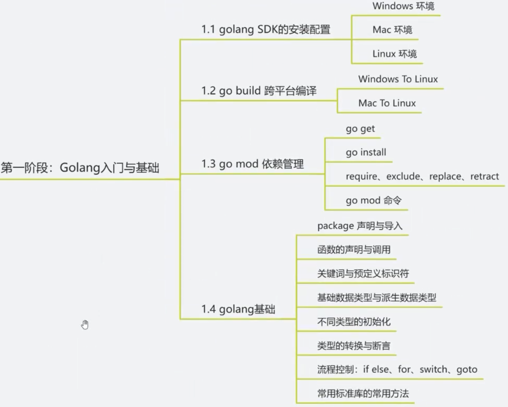
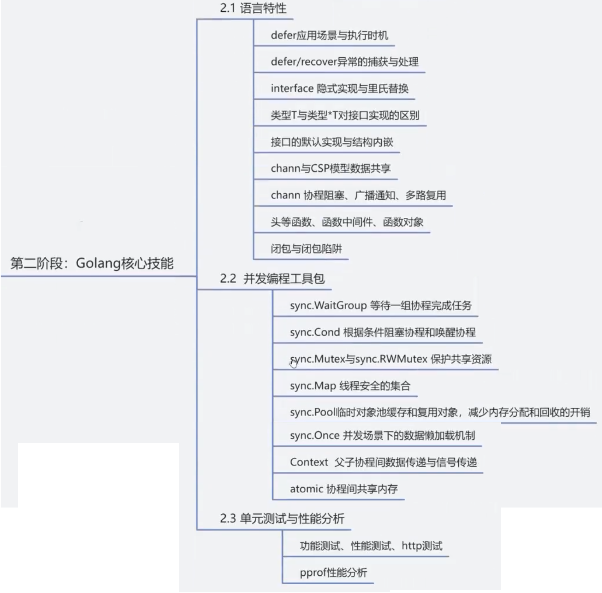
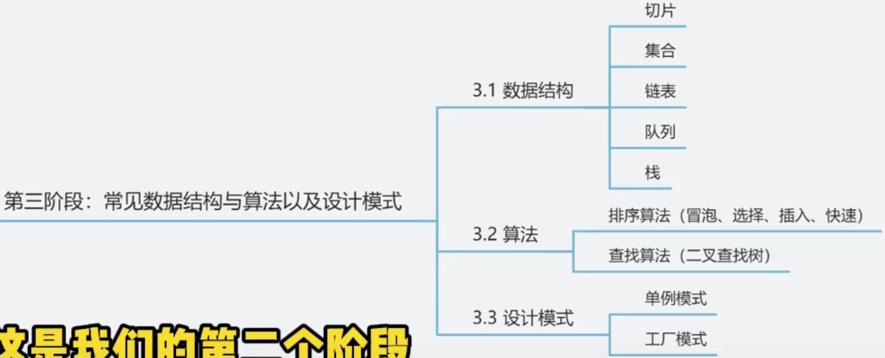
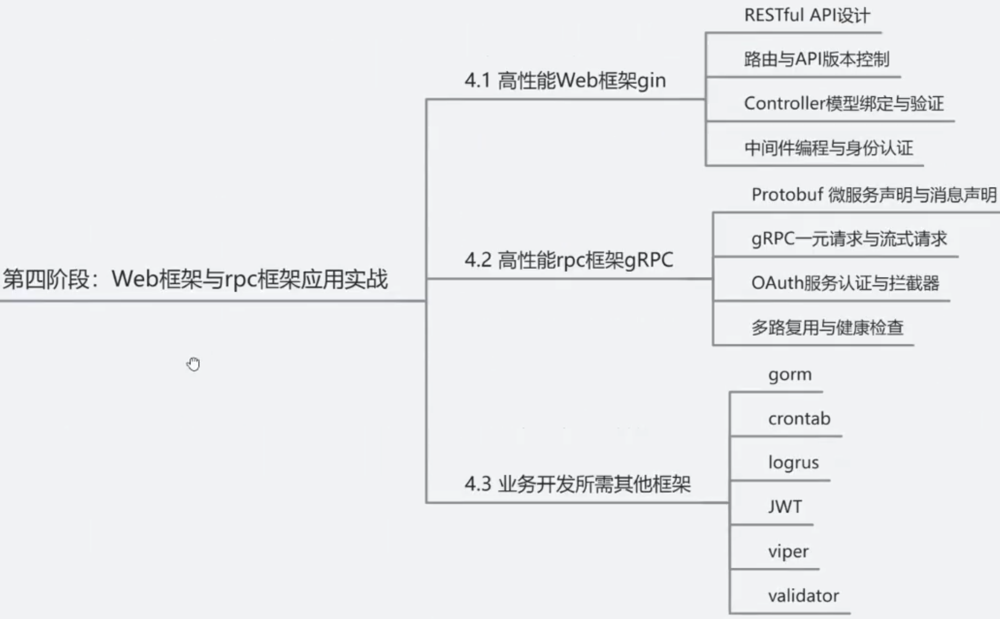
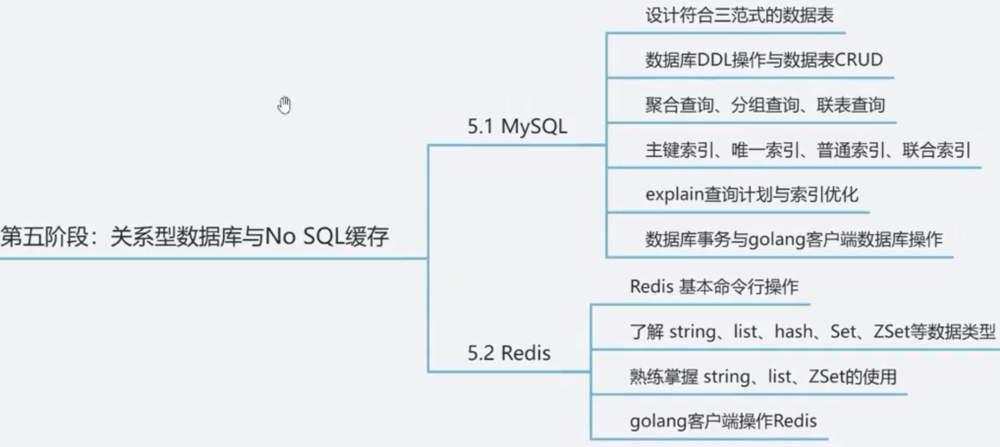
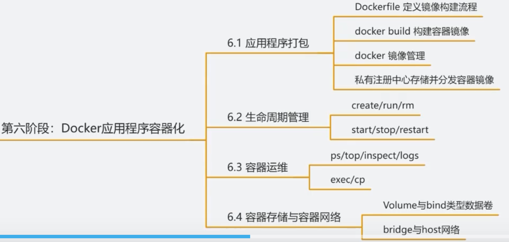
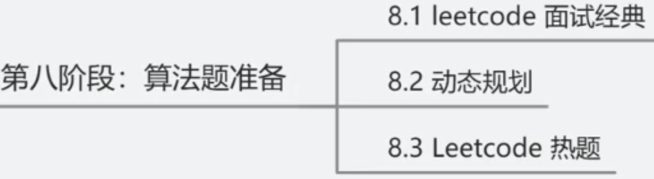
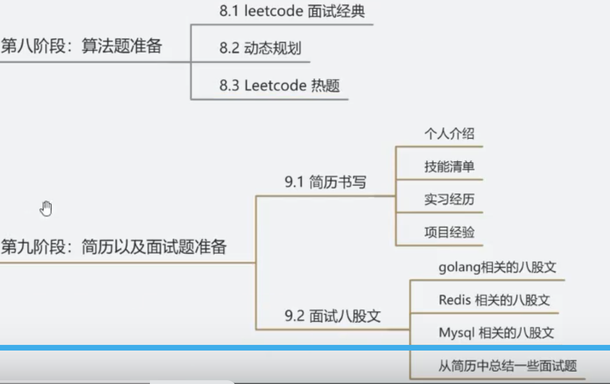

【2024最新】个人整理 Golang开发 适用于2025届春招实习、校招、应届毕业生全面学习路线（附配套资料）
https://www.bilibili.com/video/BV1S6DPYfEXF/?spm_id_from=333.1387.homepage.video_card.click

















=============================================================
# 1。如何理解golang 的依赖注入

依赖注入（Dependency Injection, DI）是Go语言中实现松耦合、可测试和可维护代码的重要设计模式。它通过将组件的依赖关系从内部实现转移到外部注入，提高了代码的灵活性和可复用性。以下是对Go语言依赖注入的深度解析：


### ### 一、核心概念
#### 1. **什么是依赖注入？**
- **依赖**：一个对象（或模块）需要另一个对象（或模块）才能完成工作的关系。
- **注入**：通过外部方式（如构造函数、方法参数或Setter方法）提供依赖对象，而非在内部直接创建。

#### 2. **为什么需要依赖注入？**
- **解耦组件**：减少组件间的硬编码依赖，使代码更易维护和扩展。
- **提高可测试性**：方便替换依赖为模拟对象（Mock），实现单元测试。
- **增强灵活性**：运行时动态更换依赖实现，适应不同环境需求。


### ### 二、Go语言中的依赖注入实现方式
#### 1. **接口注入（最常用）**
通过接口定义依赖，组件依赖接口而非具体实现。

**示例代码**：
```go
// 定义接口
type Logger interface {
    Info(msg string)
    Error(msg string)
}

// 具体实现
type ConsoleLogger struct{}

func (c *ConsoleLogger) Info(msg string) {
    fmt.Println("INFO:", msg)
}

func (c *ConsoleLogger) Error(msg string) {
    fmt.Println("ERROR:", msg)
}

// 依赖接口的组件
type UserService struct {
    logger Logger // 依赖接口而非具体实现
}

// 通过构造函数注入依赖
func NewUserService(logger Logger) *UserService {
    return &UserService{logger: logger}
}

// 使用依赖
func (s *UserService) CreateUser(name string) {
    s.logger.Info("Creating user: " + name)
    // 业务逻辑
}
```

**使用方式**：
```go
logger := &ConsoleLogger{}
service := NewUserService(logger)
service.CreateUser("Alice")
```


#### 2. **结构体嵌入（简化注入）**
将依赖作为结构体字段嵌入，避免显式接口定义。

**示例代码**：
```go
type Database struct{}

func (db *Database) Save(data interface{}) error {
    // 实现数据库保存逻辑
    return nil
}

type ProductService struct {
    DB *Database // 直接嵌入依赖
}

func NewProductService(db *Database) *ProductService {
    return &ProductService{DB: db}
}
```


#### 3. **函数选项模式（灵活配置）**
通过函数参数提供可选依赖，支持链式调用。

**示例代码**：
```go
type Config struct {
    Timeout time.Duration
    Retries int
}

type Option func(*Config)

func WithTimeout(timeout time.Duration) Option {
    return func(c *Config) {
        c.Timeout = timeout
    }
}

func WithRetries(retries int) Option {
    return func(c *Config) {
        c.Retries = retries
    }
}

type APIClient struct {
    config Config
}

func NewAPIClient(opts ...Option) *APIClient {
    config := Config{
        Timeout: 5 * time.Second,
        Retries: 3,
    }
    for _, opt := range opts {
        opt(&config)
    }
    return &APIClient{config: config}
}
```

**使用方式**：
```go
client := NewAPIClient(
    WithTimeout(10*time.Second),
    WithRetries(5),
)
```


### ### 三、依赖注入的最佳实践
#### 1. **依赖倒置原则（DIP）**
- 高层模块不应该依赖低层模块，两者都应该依赖抽象。
- 抽象不应该依赖细节，细节应该依赖抽象。

**错误示例**：
```go
type EmailService struct{}

func (e *EmailService) Send(to, subject, body string) error {
    // 发送邮件实现
    return nil
}

type NotificationService struct {
    emailService *EmailService // 直接依赖具体实现
}
```

**正确示例**：
```go
type Notifier interface {
    Send(to, subject, body string) error
}

type NotificationService struct {
    notifier Notifier // 依赖接口
}
```


#### 2. **单一职责原则**
- 组件只负责自己的核心业务，依赖应由外部提供。

**错误示例**：
```go
type OrderService struct{}

func (o *OrderService) CreateOrder(items []Item) error {
    db := sql.Open("mysql", "user:pass@/dbname") // 内部创建依赖
    // 使用db执行数据库操作
    return nil
}
```

**正确示例**：
```go
type OrderService struct {
    db *sql.DB // 通过构造函数注入
}

func NewOrderService(db *sql.DB) *OrderService {
    return &OrderService{db: db}
}
```


#### 3. **使用依赖注入容器（DI Container）**
对于复杂项目，可以使用第三方库（如 `dig`、`wire`）自动管理依赖关系。

**示例：使用 `dig` 库**
```go
package main

import (
    "github.com/uber-go/dig"
)

type Config struct {
    DBURL string
}

type Database struct {
    URL string
}

func NewConfig() *Config {
    return &Config{DBURL: "localhost:5432"}
}

func NewDatabase(config *Config) *Database {
    return &Database{URL: config.DBURL}
}

func main() {
    container := dig.New()
    container.Provide(NewConfig)
    container.Provide(NewDatabase)

    err := container.Invoke(func(db *Database) {
        println("Database URL:", db.URL)
    })

    if err != nil {
        panic(err)
    }
}
```


### ### 四、依赖注入与测试
依赖注入使单元测试更加简单，通过替换依赖为Mock对象，可以隔离测试目标组件。

**示例：使用Mock测试**
```go
// 定义接口
type PaymentGateway interface {
    Charge(amount float64) error
}

// 实现Mock对象
type MockPaymentGateway struct {
    ChargedAmount float64
    Err           error
}

func (m *MockPaymentGateway) Charge(amount float64) error {
    m.ChargedAmount = amount
    return m.Err
}

// 测试代码
func TestOrderService_ProcessPayment(t *testing.T) {
    mockGateway := &MockPaymentGateway{}
    service := NewOrderService(mockGateway)

    err := service.ProcessPayment(100.0)
    if err != nil {
        t.Errorf("unexpected error: %v", err)
    }

    if mockGateway.ChargedAmount != 100.0 {
        t.Errorf("expected charged amount 100.0, got %v", mockGateway.ChargedAmount)
    }
}
```


### ### 五、优缺点分析
#### **优点**：
1. **松耦合**：组件间依赖关系更灵活，易于替换和扩展。
2. **可测试性**：方便使用Mock对象进行单元测试。
3. **可维护性**：依赖关系清晰，代码结构更易于理解。
4. **可复用性**：组件可以在不同环境中复用。

#### **缺点**：
1. **代码量增加**：需要编写更多的接口和构造函数。
2. **学习曲线**：初学者需要理解接口和依赖关系。
3. **过度设计风险**：简单项目可能不需要复杂的依赖注入。


### ### 六、何时使用依赖注入？
- 当组件依赖外部资源（如数据库、网络服务）时。
- 当需要在测试中替换依赖为Mock对象时。
- 当项目规模变大，组件间依赖关系复杂时。
- 当需要实现插件化架构或支持多种实现时。


依赖注入是Go语言中实现高质量代码的重要手段，通过合理应用接口、结构体嵌入和函数选项模式，可以在保持代码简洁的同时获得良好的可维护性和可测试性。

====================================================
# 2. Go 开发如何快速上手

## Java 转 Go 开发如何快速上手
给楼上补个链接： https://learnxinyminutes.com/zh-cn/go/

Go 本身简直太简单了，几个我初学时觉得比较迷惑的点：

- channel 的行为，select 和 context
- goroutine 的同步
- package 的组织方式
- 错误处理
- 数组和切片的差别
- interface 对象的类型擦除和泛型的实现方式

## Go 社招项目推荐
 
  peileiscott1 · 19 小时 9 分钟前 · 1340 次点击

如题，985 本科毕业三年，想看看外面的 Go 后端机会，求大佬们推荐项目;Go 后端 项目
7 条回复  •  2025-07-09 20:42:40 +08:00
  
https://github.com/iot-ecology/go-iot-platform
 
https://github.com/go-gitea/gitea

算是比较出名的 ;
 
https://github.com/hootrhino/rhilex 

https://github.com/XTLS/Xray-core

## go-carbon v2.6.10 正式版发布，轻量级、语义化、对开发者友好的 golang 时间处理库
 
  gouguoyin · 2 天前 · 571 次点击

carbon 是一个轻量级、语义化、对开发者友好的 Golang 时间处理库，提供了对时间穿越、时间差值、时间极值、时间判断、星座、星座、农历、儒略日 / 简化儒略日、波斯历 / 伊朗历的支持。

carbon 目前已捐赠给 dromara 开源组织，已被 awesome-go 收录，并获得 gitee 2024 年最有价值项目（GVP）和 gitcode 2024 年度 G-Star 项目，如果您觉得不错，请给个 star 吧

github.com/dromara/carbon

gitee.com/dromara/carbon

gitcode.com/dromara/carbon
更新日志

    将日语翻译文件从 jp.json 改成 ja.json，说明文档从 README.jp.md 更名为 README.ja.md，以符合 ISO639-1 标准
    移除已弃用的 ParseWithLayouts 方法，用 ParseByLayouts 方法替代
    移除已弃用的 ParseWithFormats 方法，用 ParseByFormats 方法替代
    移除已弃用的 CleanTestNow 方法，用 ClearTestNow 方法替代
    移除 ParseByLayout 和 ParseByFormat 方法对时间戳字符串的解析支持，解析时间戳请使用 CreateFromTimestamp, CreateFromTimestampMilli, CreateFromTimestampMicro, CreateFromTimestampNano 方法
    优化 helper.go 里 getAbsValue 方法，用位操作替换条件判断
    优化 frozen.go 文件里时间冻结相关方法，用原子操作减少锁竞争，优化内存分配
    优化基准测试文件，覆盖串行测试、并行测试和并发测试
    新增韩语文档 README.ko.md
    新增 Sleep 方法及相关单元测试、基准测试和示例文件
    新增数字常量，如 MaxYear, MinYear, MaxMonth, MinMonth, MaxDay, MinDay 等，并使用这些常量替换硬编码

