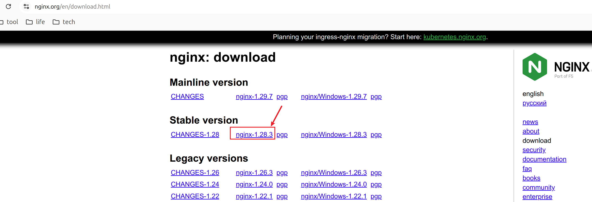

# 1.how to build nginx on ubuntu

## 1.1 Install the prerequisites:

参考： https://nginx.org/en/linux_packages.html#Ubuntu

Install the prerequisites:
```sh
sudo apt install curl gnupg2 ca-certificates lsb-release ubuntu-keyring
```

Import an official nginx signing key so apt could verify the packages authenticity. Fetch the key:
```sh
curl https://nginx.org/keys/nginx_signing.key | gpg --dearmor \
    | sudo tee /usr/share/keyrings/nginx-archive-keyring.gpg >/dev/null
```

Verify that the downloaded file contains the proper key:
```sh
gpg --dry-run --quiet --no-keyring --import --import-options import-show /usr/share/keyrings/nginx-archive-keyring.gpg
```

The output should contain the full fingerprint 573BFD6B3D8FBC641079A6ABABF5BD827BD9BF62 as follows:
```sh
pub   rsa2048 2011-08-19 [SC] [expires: 2027-05-24]
      573BFD6B3D8FBC641079A6ABABF5BD827BD9BF62
uid                      nginx signing key <signing-key@nginx.com>
```

Note that the output can contain other keys used to sign the packages.

To set up the apt repository for stable nginx packages, run the following command:
```sh
echo "deb [signed-by=/usr/share/keyrings/nginx-archive-keyring.gpg] \
https://nginx.org/packages/ubuntu `lsb_release -cs` nginx" \
    | sudo tee /etc/apt/sources.list.d/nginx.list
```

If you would like to use mainline nginx packages, run the following command instead:
```sh
echo "deb [signed-by=/usr/share/keyrings/nginx-archive-keyring.gpg] \
https://nginx.org/packages/mainline/ubuntu `lsb_release -cs` nginx" \
    | sudo tee /etc/apt/sources.list.d/nginx.list
```

Set up repository pinning to prefer our packages over distribution-provided ones:
```sh
echo -e "Package: *\nPin: origin nginx.org\nPin: release o=nginx\nPin-Priority: 900\n" \
    | sudo tee /etc/apt/preferences.d/99nginx
```

To install nginx, run the following commands:
```sh
sudo apt update
sudo apt install nginx
```

## 1.2 Download the nginx source code:


下载nginx-1.28.3.tar.gz到 ~/Downloads/目录下。
解压安装包
```sh
tar -xvf nginx-1.28.3.tar.gz
```


## 1.3 Build the nginx source code:

```sh
(base) abner@abner-XPS:~/Downloads/nginx-1.28.3/build$ ../configure  --srcdir=/home/abner/Downloads/nginx-1.28.3/   --prefix=/home/abner/Downloads/nginx-1.28.3/mk-out     --with-http_ssl_module  --with-http_gzip_static_module  --with-http_stub_status_module
../configure: 10: .: cannot open auto/options: No such file
```

这个报错是因为：Nginx 的 `configure` 对**out-of-source 编译**有严格要求，**不能直接在 build 目录里调用 ../configure**，这是它的设计限制。
 
正确方法（必须这样做）：

```bash
cd ~/Downloads/nginx-1.28.3

# 第二步：在**源码目录**执行 configure，并用 `--builddir` 指定 build 文件夹
# 这是 Nginx 官方支持的**唯一正确**的 out-of-source 编译方式！
./configure --builddir=build --prefix=mk-out --with-http_ssl_module --with-http_gzip_static_module --with-http_stub_status_module
# ./configure \
# --builddir=build \
# --prefix=mk-out \
# --with-http_ssl_module \
# --with-http_gzip_static_module \
# --with-http_stub_status_module


#### 第三步：编译（自动把产物放进 build 目录）
make

#### 第四步：安装到你指定的目录
make install


(base) abner@abner-XPS:~/Downloads/nginx-1.28.3$ ls
auto  build  CHANGES  CHANGES.ru  CODE_OF_CONDUCT.md  conf  configure  contrib  CONTRIBUTING.md  html  LICENSE  Makefile  man  mk-out  README.md  SECURITY.md  src
(base) abner@abner-XPS:~/Downloads/nginx-1.28.3$ cd mk-out/
(base) abner@abner-XPS:~/Downloads/nginx-1.28.3/mk-out$ ls
conf  html  logs  sbin
```
 
