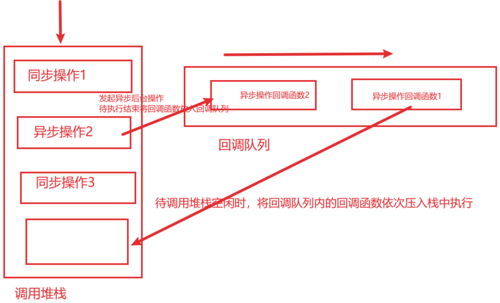
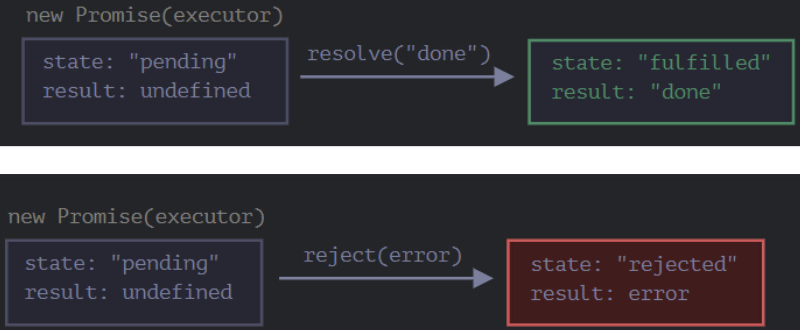

# 2.一篇文章让你搞懂 Javascript异步编程（最全面最详细）
已于 2025-08-15 16:36:12 修改
原文链接：https://blog.csdn.net/xuanfather/article/details/144765342 
## 2.1JavaScript异步编程
### 同步和异步
1.同步 (Synchronous)
同步操作指的是任务按顺序执行，一个任务必须完成后，下一个任务才能开始。这种方式要求程序在等待任务完成时处于“阻塞”状态，直到任务有结果才能继续。

2.异步 (Asynchronous)
异步操作指的是任务可以并发执行，程序无需等待任务完成，而是可以直接继续执行其他任务。异步通常通过回调函数、Promise或类似机制来处理任务完成后的操作。

异步操作的核心思想是不阻塞主线程，将耗时任务的执行交给系统（比如 I/O、定时器、HTTP 请求等），当任务完成后，再通过回调函数通知主线程继续处理。

### 异步操作的基本流程：
> 1. 主线程(调用栈)执行同步和异步代码
> 2. 执行同步代码时，直接在调用栈执行并等待代码执行完毕
> 3. 执行异步代码（例如 I/O 操作、定时器）时，
>    3.1. 立即发起一个异步任务，根据任务类型不同，系统将异步任务交给后台线程或者系统内核处理。但不阻碍后续代码执行
>    3.2. 主线程代码继续执行，当后台异步任务执行完毕时，相关的回调函数会被放入回调队列（Callback Queue）
> 4. 当主线程执行完全部代码空闲时（调用栈为空），会将回调队列里的回调函数依次放入调用栈执行。
 

### 使用场景

如果任务是快速完成的，并且不需要处理复杂的并发，同步是一个简单可靠的选择。
如果涉及到耗时任务（如网络请求、文件 I/O 等），并且需要提升程序响应速度和效率，建议采用异步。 

### 一、回调函数（Callback Function）
在Javascript初期，异步编程实现的方式并不理想。在早期的Javascript当中，仅支持定义回调函数的方式来表明异步操作完成。

回调实现异步操作的具体步骤：
> 1. 当执行到异步操作时（如定时器、网络请求、页面加载查找元素等）。js引擎将该任务交给系统内核或后台线程去处理
> 2. 主线程不等待异步操作完成而是直接执行后续的同步代码
> 3. 异步任务由系统内核或后台线程处理完后，通知主线程，并将该异步任务关联的回调函数添加到回调队列当中
> 4. 当主线程的调用栈清空后，事件循环机制会取出回调队列里的回调函数，将其放入栈内执行回调函数

setTimeout 是一个常见的异步函数，它在指定的时间后执行回调函数。其中这里的匿名箭头函数就称为回调函数。
```js
console.log("1. 开始");

setTimeout(() => {
    console.log("3. 异步任务完成，执行回调");
}, 2000);

console.log("2. 继续执行主线程代码");
```

执行过程分析：
> * console.log("1. 开始") 入栈并执行，打印 “1. 开始” 后出栈。
> * setTimeout 注册一个异步任务，将定时器任务交给系统处理。
> * console.log("2. 继续执行主线程代码") 入栈并执行，打印 “2. 继续执行主线程代码” 后出栈。
> * 系统在 2 秒后完成定时器任务，将回调函数放入回调队列中。
> * 主线程调用栈空闲后，事件循环从回调队列中取出回调函数，将其压入调用栈并执行，打印 “3. 异步任务完成，执行回调”。
> * 由此可见，哪怕定时任务设置为2s,但是实际执行回调函数要等到主线程代码全部执行完毕才有机会执行到异步回调函数。

也可以将回调函数传给异步函数执行回调操作。
```js
// 模拟一个异步数据获取函数
function fetchData(callback) {
  setTimeout(() => {
    const data = "Fetched data";
    callback(data); // 调用回调函数并传递数据
  }, 2000);
}

// 定义一个回调函数
function handleData(data: string) {
  console.log("Received data:", data);
}

// 调用异步函数并传递回调函数
fetchData(handleData);
```
异步操作的失败处理在回调模型中也需要考虑，由此便出现了成功回调和失败回调。这边是下面我们即将介绍的Promise期约状态的雏形。
```js
// 模拟一个异步操作函数
function asyncOperation(successCallback, errorCallback) {
  setTimeout(() => {
    const isSuccess = Math.random() > 0.5; // 随机模拟成功或失败
    if (isSuccess) {
      successCallback("Operation was successful!"); // 调用成功回调函数
    } else {
      errorCallback("Operation failed."); // 调用失败回调函数
    }
  }, 1000);
}

// 定义成功回调函数
function onSuccess(message) {
  console.log("Success:", message);
}

// 定义失败回调函数
function onError(error) {
  console.error("Error:", error);
}

// 调用异步操作函数并传递回调函数
asyncOperation(onSuccess, onError);
```
### 二、期约（Promise）

#### 1、promise
期约（Promise）是对尚不存在结果的替身。
ECMAScript6新增引用类型Promise，用于实现一种异步程序执行的机制。

首先，期约Promise是一个有状态的对象，可能处于以下三种状态之一：
> * 待定（pending）
> * 兑现（fulfilled）/解决（resolved）
> * 拒绝（rejected）

 
待定（pending）是期约的初始状态，可以通过落定（settled）变为成功的resolved状态和失败的rejected状态。且落实之后期约的状态是不可逆的。当期约状态为pending时，表示该异步操作尚未开始或正在执行中；当期约状态为fulfilled/resolved时，表示该异步操作已经成功完成；当期约状态变为rejected时，表示该异步操作发生了中断异常或被阻止。

当期约的状态会发生变更，我们希望当期约状态为解决时，能够返回一个内部值；当期约状态变为拒绝时，能够返回一个拒绝理由（可以是异常，也可以是自定义理由）。二者都是互斥的，且默认值皆为undefined。

期约的状态是私有的，任何外部的代码不能修改其内部的状态。期约将异步行为封装起来为了隔绝外部的同步代码，只能通过其提供的api进行异步操作。

#### 2、执行器函数（executor）
由于期约的状态是私有的，只能通过内部函数执行器executor去操作。创建期约对象需要传入一个执行器函数参数，执行器函数参数内又需要传入两个函数，executor有两项职责：初始化期约的异步行为和控制状态的最终转换。

其中控制状态的异步转换是通过调用它的两个函数参数实现的。这两个参数分别命名为resolve()和reject(),其中，调用resolve()会将状态切换为解决，调用reject()会将状态切换为拒绝。
```js
let p = new Promise(function(resolve, reject){ // 执行器函数参数其实就是一个含有两项函数参数的普通函数。
    ...
})

let p1 = new Promise((resolve, reject) => resolve());
setTimeout(console.log, 0, p1) // Promise <resolved>

let p2 = new Promise((resolve, reject) => reject());
setTimeout(console.log, 0, p2) // Promise <rejected>
// 报错：Uncaught error
```


通过运行上面的代码，我们可以看到两件事儿：
> 1. executor 被自动且立即调用（通过 new Promise）。
> 2. executor 接受两个参数：resolve() 和 reject()。这些函数由 JavaScript 引擎预先定义，因此我们不需要创建它们。我们只需要在准备好时调用其中之一即可。 

一个 resolved 或 rejected 的 promise 都会被称为 “settled”。
executor只能调用一个resolve和reject,当promise的状态变为settled后，Promise转换的状态不可撤销。多次调用状态转换会静默失败。
```js
let promise = new Promise(function(resolve, reject) {
  resolve("done");

  reject(new Error("…")); // 被忽略
  setTimeout(() => resolve("…")); // 被忽略
});
```
并且，resolve/reject 只需要一个参数（或不包含任何参数），并且将忽略额外的参数。

#### 3、期约静态方法
1. Promise.resolve()
通过调用Promise的静态方法能够实例化不同状态的期约。

Promise.resolve()可以将任何值都实例化为一个解决的期约，包括undefined和错误对象Error，以下两个期约实际上都是一样的。
```js
let p1 = new Promise((resolve, reject) => resolve())
let p2 = Promise.resolve()
```

但如果传入的参数本身就是一个期约，则该静态方法只是实现了一个空包装。（无任何操作）
```js
let p = Promise.resolve(new Error('foo'))
setTimeout(console.log, 0, p) // Promise<resolve> Error:foo
```
2. Promise.reject()
Promise.reject()静态方法和resolve()类似，可以将任何值都实例化为一个拒绝的期约并抛出一个拒绝的理由。
```js
let p1 = new Promise((resolve, reject) => resolve())
let p2 = Promise.resolve()
```
拒绝的理由就是传给resolve()的第一个参数，这个参数也会传给后续的拒绝处理程序：
```js
let p = Promise.reject(3);
setTimeout(console.log, 0, p); // Promise<rejectd>:3
p.then(null, (e) => setTimeout(console.log, 0, e)); // 3
```

不同于resolve()的是，如果给resolve()传递的参数本身就是一个期约对象，那么这个期约会成为它返回期约拒绝的理由。

**拒绝期约的错误不能被同步代码的try/catch捕获到，只能通过异步模式捕获错误。**因为异步代码是通过浏览器的异步消息队列来处理的，一旦代码开始以异步的模式执行，唯一与之交互的只有期约的方法。
```js
try {
    throw new Error('foo');
} catch (e) {
    console.log(e); // Error:foo
}

try {
    Promise.reject(new Error('bar'))
}
catch (e) {
    console.log(e) // uncaught Error:bar
}
```

#### 4、期约实例方法
ECMAScript规范当中，任何异步对象都有一个then()方法，即实现了Thenable接口
```js
class MyThenable {
    then() { }
}
```

Promise类型也同样实现了Thenable接口。因此具有then()实例方法
#### 4.1  Promise.then()
then()这个方法是Promise实现了Thenable方法所具有的，该方法接受两个参数：
> .then 的第一个参数是一个函数，该函数将在 promise resolved 且接收到结果后执行。
> .then 的第二个参数也是一个函数，该函数将在 promise rejected 且接收到 error 信息后执行。

```js
let promise = new Promise((resolve, reject) => {
    let success = true; // 模拟一个成功或失败的条件
    if (success) {
        resolve("操作成功");
    } else {
        reject("操作失败");
    }
});

promise.then(
    (result) => {
        console.log("成功:", result);
    },
    (error) => {
        console.log("失败:", error);
    }
);
```

由于Promise只能改变一次状态，因此then()方法的两个函数参数实现是互斥的，我们可以省略其中一个参数从而更加关注另外一种状态改变的参数。如果只想提供reject状态的函数参数，则在resolve函数参数传入undefined即可。
```js
let promise = new Promise(resolve => { // 省略reject
  setTimeout(() => resolve("done!"), 1000);
});

promise.then(console.log); // 1 秒后显示 "done!"

let promise = new Promise(resolve => { // 省略reject
  setTimeout(() => resolve(new Error("foo")), 1000);
});
promise.then(null, console.log); // resolve位置传入null
```

then()方法只接受函数参数，如果含有显示的返回值，then()方法会默认采用Promise.resolve或者Promise.reject包装为对应的Promise期约对象返回。非函数返回值将会静默忽略不处理。
```js
p1.then("aaa") // 静默不处理
p1.then(()=>'bar') // 包转为 Promise<resolve> 'bar'
```

抛出异常会返回拒绝的期约,但是并不会终止程序；而返回异常会返回解决状态的期约
```js
p.then(()=>{throw 'bar'}) // Promise<reject> 'bar'
p.then(()=>Error("que")) // Promise<resolve> 'que'
```
**由于Promise的.then方法也会返回一个Promise对象**，且前面的then方法中回调函数的返回值会作为后面then方法回调的参数。由此可以通过then的链式调用取代回调函数嵌套，避免了**回调地狱**，让代码更加扁平化。

```js
// 回调地狱示例
task1(function() {
    task2(function() {
        task3(function() {
            console.log('All tasks completed');
        });
    });
});

// 链式调用 Promise
task1()
    .then(task2)
    .then(task3)
    .then(() => {
        console.log('All tasks completed');
    })
    .catch((error) => {
        console.log('An error occurred:', error);
    });
```

如果我们只对 error 感兴趣，那么我们可以使用 null 作为第一个参数：.then(null, errorHandlingFunction)。或者我们也可以使用 .catch(errorHandlingFunction)，其实是一样的

#### 4.2 Promise.catch()
Prommise.catch(onRejected)只接受一个参数，用于给期约添加拒绝处理程序，相当于Promise.then(null, onRejected)的语法糖。
```js
let promise = new Promise(function (resolve, reject) {
  // 1 秒后发出工作已经被完成的信号，并带有 error
  setTimeout(() => reject(new Error("Whoops!")), 1000);
});
// 方法1：
promise.then(null, error => console.log(error))
// 方法2：
promise.catch(error => console.log(error))
```
#### 4.3.Promise.finally()
Promise.finally(onFinally)方法无论程序是onResolved还是onrejected都会执行，由于onFinally处理程序不清除异步程序最终的状态,从而被表现为与状态无关的方法，主要是作为onResolved和onRejected函数执行后的清理操作。

```js
function asyncOperation() {
  return new Promise((resolve, reject) => {
    // 模拟异步操作
    setTimeout(() => {
      const success = Math.random() > 0.5;
      if (success) {
        resolve("Operation succeeded");
      } else {
        reject("Operation failed");
      }
    }, 1000);
  });
}

asyncOperation()
  .then(result => {
    console.log(result); // 如果操作成功，输出: Operation succeeded
  })
  .catch(error => {
    console.error(error); // 如果操作失败，输出: Operation failed
  })
  .finally(() => {
    console.log("Cleanup operation"); // 无论成功还是失败，都会执行
  });
```
then/catch/finally的异步链类似于同步代码块当中的try/catch/finally。由于每个期约方法都返回新的Promise对象，这样连缀调用可以构成所谓的**“期约连锁”**

#### 4.4.Promise.all()和Promise.race()
Promise提供了将多个期约实例组合成一个期约的静态方法：Promise.all()和Promise.race()

* Promise.all() 接受一组可迭代的期约对象，当全部的期约对象都正常处理完时，将多条结果封装在Promise数组当中
```js
Promise.all([
    Promise.resolved(),
    Promise.resolved(1),
    Promise.resolved(4),
])
```

* Promise.race() 和Promise.all类似，接受一组可迭代的期约对象，但是只返回第一个异步完成的程序，无论程序的结果是否解决还是拒绝。
```js
// 解决先发生，超时后的拒绝被忽略，只返回第一个先结束的异步程序
let p1 = Promise.race([
  Promise.resolve(3),
  new Promise((resolve, reject) => setTimeout(() => reject, 1000)),
])

// 拒绝先发生，超时后的解决被忽略，只返回第一个先结束的异步程序
let p2 = Promise.race([
  Promise.reject(3),
  new Promise((resolve, reject) => setTimeout(() => resolve, 1000)),
])
```
Promise.all和race一样，合成返回的期约会静默处理所包含期约的拒绝操作。

### 三、异步函数（async/await）
ES8新推出的关键字async/await，async/await 是 Promise 的语法糖，它简化了异步代码的写法，帮助我们避免复杂的链式调用，代码更具可读性。但其本质上还是调用底层的Promise对象并返回

#### 1、async
async关键字用于声明一个异步函数，该关键字可以声明在函数声明、函数表达式、箭头函数和方法上
```js
async function func1() {
}

let func2 = async function();

let func3 = async () => {
}

class A {
  async func4() {
  }
}
```
含有async关键字的函数，声明的异步函数返回值会被自动包装成一个Promise对象。
#### 2、await
await关键字的特点

> 1. await 关键字用于等待一个 Promise 完成，并可以获得其返回值。它只能在 async 函数内部使用。
> 2. await关键字会暂停执行异步函数后面的代码，让出javascript的执行线程，待异步函数执行完毕回调结束后再恢复后续代码的执行。类似于yield生成器函数。
> 3. await关键字还能够将async异步函数返回的Promise包装对象解包。

步骤说明：
```js
async function processData() {
    const data1 = await fetchData('https://api.example.com/data1');
    console.log(data1);
}
```
> * 调用 await fetchData('https://api.example.com/data1')
> * fetchData 被调用并立即返回一个未完成的 Promise。
> * await 会暂停 processData 函数的执行，直到 Promise 状态变为 resolved。
> * 当 Promise 状态变为 resolved 时,fetchData返回Promise对象，await 会提取出 Promise 的结果，并将其赋值给变量 data1。

await关键字运行机制：
当Javascript运行时碰到await关键字时，会记录在哪里暂停执行。当await右边的值可用时，会向消息队列推送一个任务，这个任务会恢复异步函数的执行。即当非异步函数加上await关键字时，也会被放入异步队列等待执行。

3、async/await期约连锁
使用async/await后，契约连锁会变得很简单：

不使用async/await关键字
```js
function fetchData(url: string): Promise<string> {
    return new Promise((resolve, reject) => {
        setTimeout(() => {
            resolve(`Data from ${url}`);
        }, 1000);
    });
}

function processData() {
    fetchData('https://api.example.com/data1')
        .then(data1 => {
            console.log(data1);
            return fetchData('https://api.example.com/data2');
        })
        .then(data2 => {
            console.log(data2);
            return fetchData('https://api.example.com/data3');
        })
        .then(data3 => {
            console.log(data3);
        })
        .catch(error => {
            console.error('Error fetching data:', error);
        });
}

processData();
```
使用关键字优化后
```js
async function fetchData(url: string): Promise<string> {
    return new Promise((resolve, reject) => {
        setTimeout(() => {
            resolve(`Data from ${url}`);
        }, 1000);
    });
}

async function processData() {
    try {
        const data1 = await fetchData('https://api.example.com/data1');
        console.log(data1);

        const data2 = await fetchData('https://api.example.com/data2');
        console.log(data2);

        const data3 = await fetchData('https://api.example.com/data3');
        console.log(data3);
    } catch (error) {
        console.error('Error fetching data:', error);
    }
}

processData();
```
4、异步函数错误处理
在async异步函数当中只能使用传统的try…catch来处理异常
```js
async function fetchData() {
    try {
        const data = await someAsyncOperation();
        console.log(data);
    } catch (error) {
        console.error("发生错误:", error);
    }
}
```