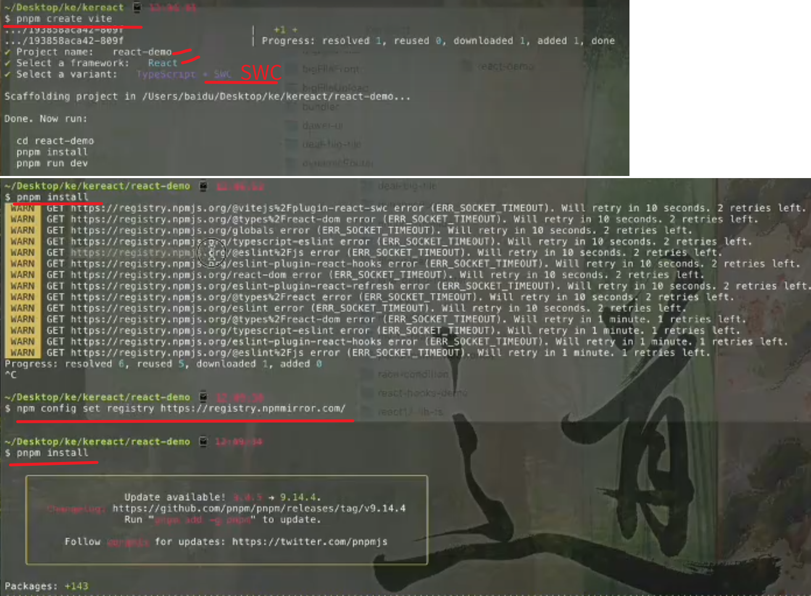

# 0. create-react-prj-by-vite.png
当前最流行的创建 react工程的命令是 npx create-react-app ecommerce-front--template typescript 还是 pnpm create vite ? 
 
 

当前，**`pnpm create vite`** 是更推荐的创建 React 工程的方式，尤其是在需要高性能、灵活配置或使用 TypeScript 的场景中。以下是两者的对比和选择建议：


### **1. `npx create-react-app`（CRA）**
**特点**：
- **官方脚手架**：由 React 官方维护，历史悠久，生态成熟。
- **零配置**：内置 webpack、Babel、ESLint 等工具，开箱即用。
- **局限性**：
  - **配置固化**：难以自定义 webpack 等底层工具（需通过 `eject` 或第三方插件）。
  - **构建速度慢**：基于 webpack，冷启动和热更新耗时较长。
  - **逐渐被弃用**：官方文档已推荐 Vite 作为替代方案。

**适用场景**：初学者快速上手，无需复杂配置的小型项目。


### **2. `pnpm create vite`**
**特点**：
- **新一代构建工具**：基于 ESBuild 和 Rollup，启动速度极快（比 CRA 快 10 倍以上）。
- **高度灵活**：支持多种框架（React、Vue、Svelte 等）和语言（TypeScript、JSX）。
- **轻量配置**：提供简洁的配置文件，易于自定义。
- **社区活跃**：Vite 已成为主流前端构建工具，生态迅速发展。

**适用场景**：所有场景，尤其是中大型项目、需要快速迭代或注重性能的应用。


### **3. 命令对比**
- **使用 CRA 创建 TypeScript 项目**：
  ```bash
  npx create-react-app my-app --template typescript
  ```
- **使用 Vite 创建 React + TypeScript 项目**：
  ```bash
  pnpm create vite my-app --template react-ts
  ```


### **4. 推荐选择 Vite 的理由**
1. **性能优势**：Vite 的开发服务器基于 ES 模块原生导入，无需打包，冷启动仅需秒级。
2. **灵活配置**：支持按需引入插件（如 CSS 预处理器、路由、状态管理）。
3. **TypeScript 支持**：内置 TypeScript 解析，无需额外配置。
4. **生态兼容性**：与 React 生态（如 React Router、Redux）无缝集成。
5. **未来趋势**：Vite 正在取代 CRA 成为 React 项目的首选工具链。


### **5. 示例：使用 Vite 创建 React + TypeScript 项目**
```bash
# 1. 创建项目
pnpm create vite ecommerce-front --template react-ts

# 2. 进入项目目录
cd ecommerce-front

# 3. 安装依赖
pnpm install

# 4. 启动开发服务器
pnpm dev
```


### **总结**
- **新项目推荐**：使用 **`pnpm create vite --template react-ts`**，获得更快的开发体验和更灵活的配置。
- **旧项目迁移**：若已有 CRA 项目，可考虑迁移至 Vite 以提升性能。
- **学习资源**：Vite 官方文档（https://vitejs.dev/）提供了详细的 React 项目指南。
=============================================================
# 1.已有 CRA 项目如何迁移至 Vite

将 Create React App (CRA) 项目迁移至 Vite 可以显著提升开发体验和构建性能。以下是详细的迁移步骤和注意事项：

### **1. 创建 Vite 项目骨架**
```bash
# 创建与原项目同名的 Vite 项目
pnpm create vite your-project-name --template react-ts
cd your-project-name
pnpm install
```


### **2. 复制源文件**
从 CRA 项目复制以下内容到新的 Vite 项目：
- `src/` 目录下的所有源代码（JS/TS/JSX/TSX 文件、样式、图片等）
- `public/` 目录下的静态资源（如 `index.html`、`favicon.ico` 等）
- `.env` 环境变量文件
- `package.json` 中的自定义脚本（如测试命令）


### **3. 配置 Vite**
修改 `vite.config.ts` 以匹配原 CRA 项目的配置：

```typescript
// vite.config.ts
import { defineConfig } from 'vite'
import react from '@vitejs/plugin-react'

export default defineConfig({
  plugins: [react()],
  resolve: {
    // 配置路径别名（若原项目使用）
    alias: {
      '@': '/src',
    },
  },
  server: {
    port: 3000, // 保持与 CRA 相同的端口
    open: true, // 自动打开浏览器
  },
  build: {
    // 配置构建输出目录与 CRA 一致
    outDir: 'build',
  },
  // 处理环境变量（与 CRA 兼容）
  define: {
    'process.env': process.env
  }
})
```


### **4. 处理样式和静态资源**
- **CSS Modules**：Vite 默认支持 CSS Modules，文件名需使用 `.module.css` 后缀。
- **全局样式**：在 `main.tsx` 中引入全局样式（如 `index.css`）。
- **静态资源路径**：更新资源引用方式（如图片、字体）：
  ```tsx
  // CRA 方式
  import logo from './logo.png';

  // Vite 推荐方式
  const logo = new URL('./logo.png', import.meta.url).href;
  ```


### **5. 处理环境变量**
Vite 使用 `import.meta.env` 替代 `process.env`，需做以下调整：
- **创建环境文件**：在项目根目录创建 `.env.development`、`.env.production` 等文件。
- **变量命名**：Vite 要求环境变量以 `VITE_` 前缀开头：
  ```bash
  # .env
  VITE_API_URL = https://api.example.com
  ```
- **代码中使用**：
  ```tsx
  // 原 CRA 写法
  const apiUrl = process.env.REACT_APP_API_URL;

  // Vite 写法
  const apiUrl = import.meta.env.VITE_API_URL;
  ```


### **6. 处理路由和懒加载**
Vite 支持 React.lazy 和 Suspense，但语法略有不同：
```tsx
// CRA 方式
const Home = React.lazy(() => import('./pages/Home'));

// Vite 推荐方式（添加类型断言）
const Home = React.lazy(() => import('./pages/Home').then((mod) => ({ default: mod.Home })));
```


### **7. 处理 Babel 插件**
如果原项目使用了自定义 Babel 插件（如装饰器），需在 Vite 中配置：
```bash
pnpm install @vitejs/plugin-react
```

```typescript
// vite.config.ts
import { defineConfig } from 'vite';
import react from '@vitejs/plugin-react';

export default defineConfig({
  plugins: [
    react({
      babel: {
        plugins: ['@babel/plugin-proposal-decorators'],
      },
    }),
  ],
});
```


### **8. 测试和调试**
- **单元测试**：若使用 Jest，需配置 Vite 兼容的测试环境（如 `vitest`）：
  ```bash
  pnpm install vitest @vitest/coverage-c8 --save-dev
  ```

- **配置 `package.json` 脚本**：
  ```json
  {
    "scripts": {
      "start": "vite",
      "build": "vite build",
      "preview": "vite preview",
      "test": "vitest"
    }
  }
  ```


### **9. 移除 CRA 遗留配置**
删除以下不再需要的文件和依赖：
- `package.json` 中与 CRA 相关的依赖（如 `react-scripts`）
- 配置文件：`tsconfig.json`、`eslintrc.js`、`jest.config.js` 等（Vite 使用不同配置）
- 构建目录：`node_modules`、`build`


### **10. 验证迁移结果**
```bash
pnpm install  # 安装新依赖
pnpm start    # 启动开发服务器
pnpm build    # 测试生产构建
```


### **常见问题与解决方案**
1. **CSS 加载问题**：
   - 确保全局样式在 `main.tsx` 中正确引入。
   - 检查 CSS Modules 文件名是否使用 `.module.css` 后缀。

2. **TypeScript 配置**：
   - 更新 `tsconfig.json` 以匹配 Vite 默认配置：
     ```json
     {
       "compilerOptions": {
         "baseUrl": ".",
         "paths": {
           "@/*": ["src/*"]
         }
       }
     }
     ```

3. **ESLint 和 Prettier**：
   - 重新配置 ESLint 以兼容 Vite（如使用 `eslint-plugin-vite`）。


### **参考资源**
- [Vite 官方迁移指南](https://vitejs.dev/guide/migration.html)
- [React + Vite 最佳实践](https://github.com/vitejs/vite/tree/main/packages/create-vite/template-react-ts)

通过以上步骤，你的 CRA 项目将成功迁移至 Vite，获得更快的开发体验和更高效的构建过程。


==============================================================
# 2.timerID为何不作为this.state的某个kv？
下面的react代码中，   timerID为何不作为this.state的某个kv？
```jsx
class Clock extends React.Component {
  constructor(props) {
    super(props);
    this.state = {date: new Date()};
  }
 
  componentDidMount() {
    this.timerID = setInterval(
      () => this.tick(),
      1000
    );
  }
 
  componentWillUnmount() {
    clearInterval(this.timerID);
  }
 
  tick() {
    this.setState({
      date: new Date()
    });
  }
 
  render() {
    return (
      <div>
        <h1>Hello, world!</h1>
        <h2>现在是 {this.state.date.toLocaleTimeString()}.</h2>
      </div>
    );
  }
}
const root = ReactDOM.createRoot(document.getElementById("root"));
root.render(
  <Clock />
);
```


在React组件中，`timerID` 不被存储在 `state` 中而是作为实例属性（`this.timerID`），主要有以下几个原因：

### 1. **state的设计目的是驱动UI更新**
   - **React的state** 专门用于存储会影响组件渲染输出的数据（如日期、用户输入、列表项等）。当这些数据变化时，React会重新调用 `render()` 方法更新DOM。
   - **timerID** 是一个用于控制定时器生命周期的技术细节（如清除定时器），它不直接影响UI展示，因此不属于state的范畴。如果将其放入state，会导致不必要的重新渲染。

### 2. **避免不必要的渲染**
   - 如果 `timerID` 被存储在state中，每次调用 `setState` 时，React会认为组件状态发生了变化，从而触发重新渲染。但 `timerID` 的变化对UI没有直接影响，这种渲染是多余的。

### 3. **生命周期管理的需要**
   - 在 `componentWillUnmount` 中清除定时器时，需要访问 `timerID`。如果将其存储在state中，可能会因为异步更新导致无法获取最新值。
   - 作为实例属性（`this.timerID`），它在组件实例的整个生命周期内保持一致，确保可以可靠地清除定时器。

### 4. **关注点分离**
   - **state** 应该只包含与UI渲染相关的数据。
   - **实例属性** 适合存储与组件操作相关的技术细节（如定时器、DOM引用、第三方库实例等）。

### 对比示例
如果错误地将 `timerID` 放入state：
```jsx
class Clock extends React.Component {
  constructor(props) {
    super(props);
    this.state = {
      date: new Date(),
      timerID: null // ❌ 错误做法：与UI无关的数据不应放入state
    };
  }

  componentDidMount() {
    const timerID = setInterval(() => this.tick(), 1000);
    this.setState({ timerID }); // ❌ 触发不必要的渲染
  }

  componentWillUnmount() {
    clearInterval(this.state.timerID); // 可能因异步更新导致值不准确
  }

  tick() {
    this.setState({ date: new Date() });
  }

  render() {
    // timerID 不参与UI渲染，但每次setState仍会触发render
    return (
      <div>
        <h2>现在是 {this.state.date.toLocaleTimeString()}.</h2>
      </div>
    );
  }
}
```

### 最佳实践总结
- **使用state**：存储会直接影响UI展示的数据（如日期、文本内容、列表项）。
- **使用实例属性**：存储与组件操作相关的技术细节（如定时器ID、DOM引用、第三方库实例）。

这种分离可以保持代码的清晰性和性能优化。

===============================================

# 3.请解释handleClick()的实现

```jsx
class Toggle extends React.Component {
  constructor(props) {
    super(props);
    this.state = {isToggleOn: true};
 
    // 这边绑定是必要的，这样 `this` 才能在回调函数中使用
    this.handleClick = this.handleClick.bind(this);
  }
 
  handleClick() {
    this.setState(prevState => ({
      isToggleOn: !prevState.isToggleOn
    }));
  }
 
  render() {
    return (
      <button onClick={this.handleClick}>
        {this.state.isToggleOn ? 'ON' : 'OFF'}
      </button>
    );
  }
}
```
请解释handleClick()的实现.

在 React 组件 `Toggle` 中，`handleClick()` 方法是核心逻辑，用于切换按钮的状态（ON/OFF）。下面详细解释其实现原理和关键点：


## **1. 方法定义与 `this` 绑定**
```jsx
constructor(props) {
  super(props);
  this.state = {isToggleOn: true};
  this.handleClick = this.handleClick.bind(this); // 绑定 this
}
```
 **绑定 `this` 仍然是必要的**。这是因为 React 事件处理的工作方式要求回调函数正确绑定到组件实例。

### **为什么需要绑定？**
在 React 中，当你将一个方法作为事件处理函数传递时（如 `<button onClick={this.handleClick}>`），该方法会在不同的上下文中被调用。**默认情况下，JavaScript 类方法不会自动绑定 `this`**，因此如果不手动绑定，`handleClick` 中的 `this` 会指向 `undefined`（严格模式下）或全局对象。

即使方法仅在类内部使用，只要它被作为回调函数传递（如通过 `onClick`），就会失去原有的 `this` 上下文。因此，**绑定 `this` 是确保事件处理函数能访问组件实例的必要步骤**。


### **如何避免手动绑定？**
如果你希望避免在构造函数中手动绑定 `this`，可以使用以下两种现代写法：


#### **1. 使用箭头函数作为类属性**
箭头函数会自动捕获定义时的 `this` 上下文，因此不需要手动绑定：
```jsx
class Toggle extends React.Component {
  state = { isToggleOn: true };

  // 箭头函数自动绑定 this
  handleClick = () => {
    this.setState(prevState => ({
      isToggleOn: !prevState.isToggleOn
    }));
  };

  render() {
    return (
      <button onClick={this.handleClick}>
        {this.state.isToggleOn ? 'ON' : 'OFF'}
      </button>
    );
  }
}
```


#### **2. 在 JSX 中内联箭头函数**
在 `onClick` 中直接使用箭头函数：
```jsx
class Toggle extends React.Component {
  constructor(props) {
    super(props);
    this.state = { isToggleOn: true };
  }

  handleClick() {
    this.setState(prevState => ({
      isToggleOn: !prevState.isToggleOn
    }));
  }

  render() {
    return (
      // 内联箭头函数保留 this 上下文
      <button onClick={() => this.handleClick()}>
        {this.state.isToggleOn ? 'ON' : 'OFF'}
      </button>
    );
  }
}
```

**注意**：内联箭头函数可能会在每次渲染时创建新的函数实例，导致性能问题（尤其是在列表渲染中）。而类属性箭头函数只会创建一次。


### **总结**
- **手动绑定的必要性**：在原始代码中，由于 `handleClick` 作为回调函数传递给 `onClick`，必须绑定 `this` 以确保正确的上下文。
- **替代方案**：使用类属性箭头函数或内联箭头函数可以避免手动绑定，但各有优缺点（如性能考虑）。

无论方法是否仅在类内部使用，**只要作为回调函数传递，就需要确保正确的 `this` 绑定**。


##  **2. `handleClick` 的实现**
```jsx
handleClick() {
  this.setState(prevState => ({
    isToggleOn: !prevState.isToggleOn
  }));
}
```
- **使用函数式更新**：  
  `setState` 接收一个函数 `(prevState, props) => newState`，而非直接的对象。这是因为 React 的 `setState` 是异步的，可能会批量更新。使用函数式更新可以确保获取最新的 `prevState`，避免状态冲突。
  
- **状态切换逻辑**：  
  `!prevState.isToggleOn` 取反当前状态（`true` → `false` 或 `false` → `true`），从而实现按钮文本在 "ON" 和 "OFF" 之间切换。


##  **3. 为什么不直接使用 `this.state.isToggleOn`？**
如果写成：
```jsx
// 错误示范
this.setState({
  isToggleOn: !this.state.isToggleOn // ❌ 可能使用过时的 state
});
```
- **问题**：由于 `setState` 是异步的，当多次调用时，可能会基于同一个旧的 `this.state.isToggleOn` 值进行计算，导致状态更新丢失。  
  例如，连续点击两次按钮，预期状态应从 `true` → `false` → `true`，但实际可能只执行一次取反（`true` → `false`）。

- **函数式更新的优势**：  
  函数式更新 `prevState => ({...})` 会在队列中依次执行，确保每次更新都基于最新状态，避免上述问题。


##  **4. 完整流程演示**
1. **初始渲染**：  
   `state.isToggleOn` 为 `true`，按钮显示 "ON"。

2. **点击按钮**：  
   - `handleClick` 被触发。
   - `setState` 接收函数 `prevState => ({isToggleOn: !prevState.isToggleOn})`。
   - React 异步执行该函数，计算新状态 `isToggleOn: false`。

3. **重新渲染**：  
   新状态触发组件重新渲染，按钮文本变为 "OFF"。

4. **再次点击**：  
   重复上述流程，状态变回 `true`，按钮显示 "ON"。


##  **5. 现代 React 中的改进（使用 Hooks）**
在函数组件中，可以使用 `useState` 和箭头函数避免手动绑定 `this`：
```jsx
import React, { useState } from 'react';

function Toggle() {
  const [isToggleOn, setIsToggleOn] = useState(true);

  const handleClick = () => {
    setIsToggleOn(prev => !prev); // 同样使用函数式更新
  };

  return (
    <button onClick={handleClick}>
      {isToggleOn ? 'ON' : 'OFF'}
    </button>
  );
}
```
- **优势**：  
  箭头函数自动绑定当前上下文，无需手动 `bind`，代码更简洁。


##  **总结**
`handleClick()` 的核心逻辑是：
1. **安全绑定 `this`**，确保方法内部能访问组件实例。
2. **使用函数式 `setState`**，保证状态更新的可靠性。
3. **通过取反当前状态**，实现按钮文本的切换。

这种实现方式是 React 类组件中处理状态更新的经典模式，能有效避免异步更新带来的问题。

===============================================
# 4. 箭头函数的返回值

```jsx
this.setState(prevState => ({
    isToggleOn: !prevState.isToggleOn
  }));
```
为什么不写成
  this.setState(prevState =>  { isToggleOn: !prevState.isToggleOn }   );

在 React 中，这两种写法的区别在于 **对象字面量的语法**。你的第二种写法实际上是错误的，会导致 JavaScript 解析问题。让我详细解释：


### **关键区别：箭头函数的返回值**
箭头函数有两种语法形式：
1. **隐式返回**（无需 `return` 关键字）：  
   ```jsx
   // 用括号包裹对象字面量，直接返回对象
   () => ({ key: value })
   ```
   
2. **显式返回**（必须使用 `return`）：  
   ```jsx
   // 用花括号包裹函数体，需显式 return
   () => {
     return { key: value };
   }
   ```


### **为什么你的第二种写法是错误的？**
```jsx
// ❌ 错误：JavaScript 会将花括号解析为函数体，而非对象
this.setState(prevState => { isToggleOn: !prevState.isToggleOn });

// ✅ 正确：用括号包裹对象字面量，告诉 JavaScript 这是一个对象
this.setState(prevState => ({ isToggleOn: !prevState.isToggleOn }));
```

**错误原因**：  
当你使用 `=> { ... }` 时，JavaScript 会将 `{}` 解析为 **函数体**（代码块），而不是 **对象字面量**。此时，`isToggleOn: !prevState.isToggleOn` 会被视为 **标签语句**（类似 `break label;`），而非对象的键值对，导致语法错误或逻辑异常。


### **示例验证**
以下代码会抛出错误：
```jsx
const fn = () => { a: 1 };
console.log(fn()); // 输出 undefined，而非 { a: 1 }
```

正确写法需要用括号包裹对象：
```jsx
const fn = () => ({ a: 1 });
console.log(fn()); // 输出 { a: 1 }
```


### **在 React 中使用对象字面量的场景**
在 `setState` 中，我们需要返回一个 **新的状态对象**。因此必须确保箭头函数正确返回对象：
```jsx
// 正确：返回一个包含 isToggleOn 属性的对象
this.setState(prevState => ({
  isToggleOn: !prevState.isToggleOn
}));
```


### **总结**
- **括号 `()` 的作用**：强制 JavaScript 将 `{}` 解析为对象字面量，而非函数体。
- **常见误区**：箭头函数的 `=> { ... }` 与对象字面量的 `{ key: value }` 语法冲突，需用括号规避。

这是 JavaScript 语法的细节，与 React 本身无关，但在 React 中使用函数式 `setState` 时特别容易混淆。  

====================================================
# 5. `setState` 接收一个函数 `(prevState, props) => newState`，而非直接的对象
```jsx
handleClick() {
  this.setState(prevState => ({
    isToggleOn: !prevState.isToggleOn
  }));
}
```
为什么说 
`setState` 接收一个函数 `(prevState, props) => newState`，而非直接的对象。这是因为 React 的 `setState` 是异步的，可能会批量更新。使用函数式更新可以确保获取最新的 `prevState`，避免状态冲突。


在React中，`setState`采用函数式更新`(prevState, props) => newState`而非直接传入对象，核心原因在于**异步更新机制和批量更新特性**。以下是详细解释：


### **1. React的异步更新机制**
- **`setState`是异步的**：当调用`this.setState()`时，React不会立即更新`this.state`，而是将更新放入队列中，等待合适时机批量处理（如浏览器渲染周期结束后）。
- **直接访问`this.state`的风险**：如果在异步更新期间多次调用`setState`，直接使用`this.state`可能会基于旧状态计算，导致更新丢失。例如：
  ```jsx
  // 错误示例：依赖过时的this.state
  this.setState({ count: this.state.count + 1 });
  this.setState({ count: this.state.count + 1 });
  // 两次调用可能都基于初始的this.state.count，最终只增加1
  ```


### **2. 函数式更新确保获取最新状态**
- **函数式更新的参数**：`setState(updaterFunction)`中的函数会接收最新的`prevState`和`props`，确保每次更新都基于前一次的最终状态。例如：
  ```jsx
  // 正确示例：使用prevState保证每次更新基于最新值
  this.setState(prev => ({ count: prev.count + 1 }));
  this.setState(prev => ({ count: prev.count + 1 }));
  // 最终count增加2
  ```
- **批量更新场景**：当React批量处理多个`setState`时，函数式更新会按顺序应用，而直接对象更新可能被覆盖。例如：
  ```jsx
  // 假设初始count=0
  this.setState({ count: this.state.count + 1 }); // 计划更新为1
  this.setState({ count: this.state.count + 1 }); // 计划更新为1（基于旧状态）
  // 最终count=1（两次更新冲突）
  
  this.setState(prev => ({ count: prev.count + 1 })); // 1
  this.setState(prev => ({ count: prev.count + 1 })); // 2
  // 最终count=2（正确累加）
  ```


### **3. 函数式更新的兼容性**
- **支持组件更新队列**：在服务端渲染（SSR）或并发模式（Concurrent Mode）中，React可能需要中断并重新执行更新，函数式更新能确保每次都基于最新状态。
- **与`props`的联动**：如果状态更新依赖`props`（如父子组件通信场景），函数式更新的第二个参数`props`会提供最新的`props`值：
  ```jsx
  this.setState((prevState, props) => ({
    value: prevState.value * props.factor
  }));
  ```


### **4. 何时必须使用函数式更新？**
- **状态依赖前一次状态**：如计数器、表单输入累加等场景。
- **在`setTimeout`/`setInterval`等异步回调中**：此时`this.state`可能已被多次更新，必须通过`prevState`获取最新值。
- **在循环或条件语句中多次调用`setState`**：避免基于旧状态计算。


### **5. 直接对象更新的适用场景**
- **状态不依赖前一次状态**：如重置状态、纯数据覆盖（不基于旧值计算）。
  ```jsx
  this.setState({ isLoading: false }); // 直接设置，无需依赖prevState
  ```


### **总结：函数式更新的核心优势**
| 场景                | 函数式更新 `(prev) => newState`               | 直接对象更新 `{key: value}`                   |
|---------------------|---------------------------------------------|---------------------------------------------|
| **异步更新安全性**   | 自动获取最新`prevState`，避免状态冲突           | 可能基于过时的`this.state`，导致更新错误           |
| **批量更新处理**     | 按顺序应用更新，确保累计效果正确                 | 多个更新可能互相覆盖，导致结果错误                 |
| **依赖`props`更新**   | 接收`props`参数，获取最新 props 值               | 需手动通过`this.props`获取，可能因异步更新过时         |
| **代码可维护性**     | 明确表达“基于前一次状态计算”，避免隐式依赖         | 可能隐藏对`this.state`的依赖，导致调试困难           |

**结论**：当状态更新依赖前一次状态或`props`时，必须使用函数式更新；其他场景可选择直接对象更新，但为了代码健壮性，推荐优先使用函数式更新。

==================================================
