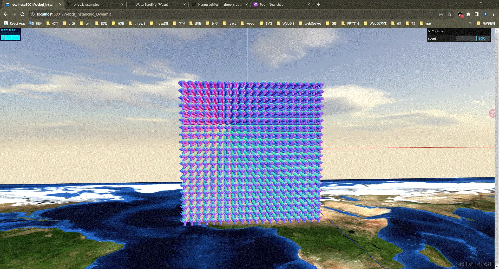

# 1. three.js的InstancedMesh使用
作者：Mchanges
链接：https://juejin.cn/post/7282683504273489960
来源：稀土掘金

官方文档：https://threejs.org/docs/index.html?q=InstancedMesh#InstancedMesh
 
官方示例: https://threejs.org/examples/#webgl_instancing_raycast

### 实例化网格（ InstancedMesh ）
这个类合 Mesh 类似。 你可以使用 InstancedMesh 来渲染大量具有相同几何体与材质、但具有不同世界变换的物体。 使用 InstancedMesh 将帮助你减少 draw call 的数量，从而提升你应用程序的整体渲染性能。

### 使用代码
先看一下 Mesh 的使用
```js
const geometry = new THREE.BoxGeometry( 1, 1, 1 );
const material = new THREE.MeshBasicMaterial( { color: 0xffff00 } );
const mesh = new THREE.Mesh( geometry, material );
scene.add( mesh );
```

InstancedMesh 的使用
```js
const count = 1000; // 要创建 1000 的mesh
const geometry = new THREE.BoxGeometry( 1, 1, 1 );
const material = new THREE.MeshBasicMaterial( { color: 0xffff00 } );
const mesh = new THREE.InstancedMesh( geometry, material, count );

// 修改每个mesh的位置、颜色等属性
const matrix = new THREE.Matrix4();
for(let i = 0; i < count; i++) {
    matrix.setPosition( x, y, z ); // 位置
    mesh.setMatrixAt( i, matrix ); // 修改位置

    mesh.setColorAt( i, color ); // 修改颜色
}
```

对于一些需要贴图的 mesh 就直接修改material就行。如果需要旋转、修改位置等，就和普通的mesh一样操作即可。

========================================================

# 2.Three.js 中的如何一次性绘制八千多个网格对象，还能保持渲染性能
2023-10-08
3,422

要一次性绘制这么多网格对象，还能保持 60 帧，关键要借助于 Three.js 中的 InstancedMesh（实例化网格）。

查看地址 https://three-js-demos-amber.vercel.app/Webgl_Instancing_Dynamic
仓库地址 https://github.com/WaterSeeding/three.js_demos



## InstancedMesh介绍

InstancedMesh 作为一种具有实例化渲染支持的特殊版本的 Mesh。
我们可以通过 InstancedMesh 来渲染大量具有相同几何体与材质、但具有不同世界变换（位置、缩放、旋转）的大量重复物体，比如，我们可以通过 InstancedMesh 来渲染一大片青青草地或者一棵棵相同的树木。
而却 InstancedMesh 将帮助我们减少 draw call 的数量，从而提升你应用程序的整体渲染性能，绘制了几万个模型，还能保持 60 帧。

## InstancedMesh 是如何做到帮助我们减少 draw call 的数量
```txt
通过以下手段，InstancedMesh 做到将渲染过程中的大部分开销从 CPU 转移到 GPU 上，并将多个实例的渲染合并为一次绘制调用。
这样就大大减少了 CPU 与 GPU 之间的通信开销，提高了渲染性能，特别是在需要渲染大量重复对象的场景中。
```

### 1. 单次绘制多个实例
使用传统的渲染方式，每个对象都需要进行一次绘制调用。
而通过 InstancedMesh，您可以在单个绘制调用中渲染多个实例，因为它将所有实例的数据打包在一起，一次性传递给渲染器。无论渲染多少个实例，只需要一次绘制调用，从而显著减少了绘制调用的数量。

### 2. 实例数据的缓冲区
InstancedMesh 将每个实例的属性数据存储在单个缓冲区中，而不是为每个实例创建单独的几何体对象。这样一来，数据传输和处理的开销大大减少。
实例数据可以包括每个实例的位置、旋转、缩放、材质参数等。通过将这些数据存储在缓冲区中，渲染器可以直接从缓冲区中读取数据，而无需逐个访问每个实例。

### 3. 并行处理
现代的图形处理器（GPU）具有强大的并行处理能力。
使用 InstancedMesh 进行实例化渲染时，渲染器可以利用 GPU 的并行计算能力，同时处理多个实例。这样可以大大加快渲染的速度，提高整体性能。

## 开发应用
1.构建 Three.js 场景的世界要素（scene、camera、renderer）以下简略描述：

```tsx
const scene = new THREE.Scene();

const camera = new THREE.PerspectiveCamera(frustumSize, aspect, 1, 10000);

const renderer = new THREE.WebGLRenderer({
  canvas: document.querySelector('canvas.webgl')!,
  antialias: true,
});
```

2.使用 BufferGeometryLoader 加载器来加载 BufferGeometry 对象，实例化 THREE.InstancedMesh 网格对象：

```tsx
const loader = new THREE.BufferGeometryLoader();
loader.load('./models/json/suzanne_buffergeometry.json', (geometry) => {
  geometry.computeVertexNormals();
  geometry.scale(0.5, 0.5, 0.5);

  let material = new THREE.MeshNormalMaterial();
  let mesh = new THREE.InstancedMesh(geometry, material, count);
  mesh.instanceMatrix.setUsage(THREE.DynamicDrawUsage);
  scene.add(mesh);
});
```

这里解释一下instanceMatrix的使用：
```
mesh.instanceMatrix.setUsage(THREE.DynamicDrawUsage);
```
通过将实例矩阵instanceMatrix的使用方式设置为 DynamicDrawUsage，您告诉 Three.js 渲染器，实例矩阵可能会经常改变，并且希望优化相关的内存和 GPU 资源管理。
这对于需要动态更新实例矩阵的情况非常有用，例如在每帧中更新实例位置或动画实例对象。

3.通过循环遍历 THREE.InstancedMesh 网格对象中实例的索引（20 _ 20 _ 20），设置它们的位置、旋转、缩放等属性：
```tsx
let dummyRef.current = new THREE.Object3D();
let instancedMeshRef.current = modelMesh; // THREE.InstancedMesh

let amount = 20;
let i = 0;
let offset = (amount - 1) / 2;

for (let x = 0; x < amount; x++) 
{
  for (let y = 0; y < amount; y++) 
  {
    for (let z = 0; z < amount; z++) 
    { 
      dummyRef.current.position.set(offset - x, offset - y, offset - z);
      // 更新局部变换
      dummyRef.current.updateMatrix();
      instancedMeshRef.current.setMatrixAt(i++, dummyRef.current.matrix);
    }
  }
}

instancedMeshRef.current.instanceMatrix.needsUpdate = true;
instancedMeshRef.current.computeBoundingSphere();
```

其中，setMatrixAt( index : Integer, matrix : Matrix4 ) 方法是设置给定的本地变换矩阵到已定义的实例，并确保在更新所有矩阵后，将 instancedMeshRef.current.instanceMatrix.needsUpdate 设置为 true。
在 Three.js 中，mesh.computeBoundingSphere()是一个用于计算网格对象的边界球（Bounding Sphere）的方法。
 


请注意，mesh.computeBoundingSphere()方法是一个在运行时计算边界球的方法。如果您的网格对象的几何体发生了变化，您可能需要在适当的时机调用该方法来更新边界球。
边界球的计算对于许多应用非常有用，特别是在进行场景剔除（frustum culling）时。
场景剔除是一种优化技术，用于确定哪些对象在相机的视锥体内，并只渲染那些可见的对象。通过使用边界球，可以快速检查一个网格对象是否与相机的视锥体相交，从而进行剔除操作，避免对不可见的对象进行渲染，提高渲染性能。

