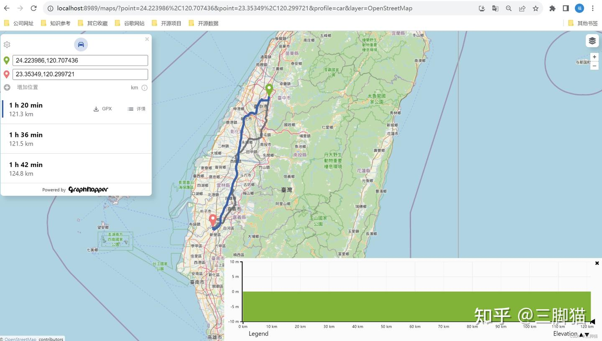

 # GraphHopper Routing Engine开源路线规划引擎  

编辑于 2023-08-16 13:49・IP 属地江苏
https://zhuanlan.zhihu.com/p/650369370

 GraphHopper Routing Engine 是一个基于开源的路线规划引擎，用于解决 [实时路径规划](https://zhida.zhihu.com/search?content_id=232656299&content_type=Article&match_order=1&q=%E5%AE%9E%E6%97%B6%E8%B7%AF%E5%BE%84%E8%A7%84%E5%88%92&zhida_source=entity) 和导航需求。它提供了高性能和灵活性，可用于构建具有定制化路线规划功能的应用程序。

 
## **GraphHopper Routing Engine的主要特点包括：**

**①快速路线规划：**

GraphHopper使用高效的数据结构和算法，可以在大规模地图上进行快速的路径规划，包括车辆、自行车、步行等不同类型的交通模式。

**②定制化规划策略：**

通过使用GraphHopper的API，你可以通过设置一系列参数和规则来定义自定义的路线规划策略，以满足特定的需求，如避开特定道路、考虑实时交通状况等。

**③多种导航模式：**

GraphHopper支持不同的导航模式，包括实时导航、[离线导航](https://zhida.zhihu.com/search?content_id=232656299&content_type=Article&match_order=1&q=%E7%A6%BB%E7%BA%BF%E5%AF%BC%E8%88%AA&zhida_source=entity)和[批量导航](https://zhida.zhihu.com/search?content_id=232656299&content_type=Article&match_order=1&q=%E6%89%B9%E9%87%8F%E5%AF%BC%E8%88%AA&zhida_source=entity)等。你可以根据需要选择适合的导航模式。

**④高度可定制：**

GraphHopper提供了丰富的API和插件机制，使你可以根据自己的需求对其进行扩展和定制，例如添加自定义的地图数据源、导入特定格式的地图文件等。

**⑤[跨平台支持](https://zhida.zhihu.com/search?content_id=232656299&content_type=Article&match_order=1&q=%E8%B7%A8%E5%B9%B3%E5%8F%B0%E6%94%AF%E6%8C%81&zhida_source=entity)**

GraphHopper可以在多种平台上运行，包括服务器、移动设备和嵌入式系统等。这使得它适用于各种应用场景。

总结来说，GraphHopper Routing
Engine是一个功能强大的开源路线规划引擎，具有快速、灵活和可定制化的特性，可用于构建各种路径规划和导航应用。无论是实时导航、离线导航还是批量导航，GraphHopper都能提供可靠的解决方案。

\

源代码地址： https://github.com/graphhopper/graphhopper

在线访问地址：[GraphHopper API Explorer](https://explorer.graphhopper.com/) 

## **一、使用说明：**

## 1.1服务启动
 
```sh
java -D"dw.graphhopper.datareader.file=taiwan.pbf" -jar ./graphhopper-web-7.0.jar server ./config-example.yml
```
启动方式中可以指定数据文件，服务配置在config-example.xml可以修改。

默认配置仅支持car类型路径分析。

启动会访问示例页面地址：[localhost:8989/](http://localhost:8989/) 


<figure data-size="normal">
<div>

</div>
</figure>


## 1.2.调用接口post请求
```
http://localhost:8989/route?key=
请求参数：
{
"points": [
[121.04456322656249, 24.701389058275836],
[120.79737084374999, 24.176287138944744]
],
"profile": "car",
"elevation": true,
"debug": false,
"instructions": true,
"locale": "zh_CN",
"optimize": "false",
"points_encoded": true,
"snap_preventions": ["ferry"],
"details": ["road_class", "road_environment", "max_speed", "average_speed"],
"alternative_route.max_paths": 3,
"algorithm": "alternative_route"
}
--设置限行区域示例
{
"points": [
[121.04456322656249, 24.701389058275836],
[120.79737084374999, 24.176287138944744]
],
"profile": "car",
"elevation": false,
"debug": false,
"instructions": true,
"locale": "zh_CN",
"type":"json",
"optimize": "true",
"points_encoded": true,
"snap_preventions": ["ferry"],
"details": ["road_class", "road_environment", "max_speed", "average_speed"],
"alternative_route.max_paths": 3,
"algorithm": "alternative_route",
"ch.disable":true,
"custom_model":{
"priority": [
{
"if": "in_berlin_bbox",
"multiply_by": "0"
}
],
"areas": {
"type": "FeatureCollection",
"features": [
{
"id": "berlin_bbox",
"type": "Feature",
"geometry": {
"type": "Polygon",
"coordinates": [[[121.286608, 24.882966], [121.219317, 24.841848], [121.123959, 24.882639], [121.159483, 24.846792], [121.286608, 24.882966]]]
}
}
]
}
}
}
}

```

##  1.3.请求参数说明：

profile 路径规划方式
point=lat,lon - 指定起点或途经点的坐标,可以有多个point参数。
vehicle=car - 指定使用的车型,如car、bike、foot等。
locale=zh - 设置返回的语言,如中文zh。
instructions=true - 是否返回路线指引。
elevation=true - 是否返回高程信息。
points_encoded=false - coord参数是否已经编码,如果请求时已经完成编码可以设置为true以加速。
weighting=fastest - 路线优化策略,如最快fastest、最短shortest等。
turn_costs=true - 是否考虑转向时间成本。
ch.disable=true - 禁用某些方式。
debug=true - 输出 debug 信息。


## 二、数据生产

## 2.1 下载osm数据

路图的地址：[download.geofabrik.de/](http://download.geofabrik.de/) 直接下载pbf既可以使用

## 2.2地图文件.osm与.pbf相互转换

1 . 下载转换器osmosis 
下载地址：[github.com/WonderfulGPS](https://github.com/WonderfulGPSGroup/osmosis) 

2 . 解压 
下载后解压，并且双击运行./osmosis/bin/osmosis.bat

开始转换 
将需要转换的文件拖到./osmosis/bin文件夹下，打开powershell进入./osmosis/bin目录下，运行以下命令：

# osm转pbf
./osmosis \--read-xml .\\输入的文件名.osm \--write-pbf
./输入的文件名.osm.pbf\
# pbf转osm
./osmosis \--read-pbf .\\输入的文件名.pbf \--write-xml
./输入的文件名.osm

## 写在最后：

GraphHopper性能非常好，下载pbf后启动服务会自动生成拓扑缓存文件，所以第一次启动会慢一些，第二次启动就会秒速启动，本文仅是对GraphHopper基础使用进行了说明，对于其他规划模式如自行车、徒步、货车等将会在后续文章探索，还有路线规划中的各种条件设置，比如限高、限速、铁路以及铁路公路混合导航是否支持，将继续探索。

​ 


