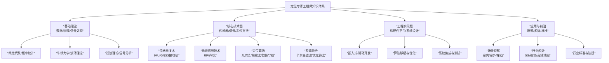
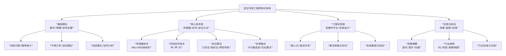

# 1.一个定位专家工程师 需要掌握哪些知识

## x.1 gAI
要成为一名定位专家工程师（Positioning Expert Engineer），你需要横跨传感器硬件、经典估计理论、计算机视觉/激光雷达算法、地图学以及嵌入式工程等多个领域。
在一个自动驾驶、机器人或智能穿手机项目中，定位是整个系统的“地基”。以下是核心知识体系的详细拆解：

### x.1.1. 经典状态估计与滤波理论 (核心底座)
定位的本质是在不确定的观测中寻找最可能的位姿。
概率论与随机过程：高斯分布、马尔可夫链、贝叶斯滤波。
卡尔曼滤波家族：KF、EKF（扩展卡尔曼）、UKF（无迹卡尔曼）、ESKF（误差状态卡尔曼）。
最优化理论：非线性最小二乘、高斯-牛顿法、列文伯格-马夸特（LM）算法、因子图优化（Factor Graph Optimization）。
李群与李代数：熟练掌握 SO(3) 和SE(3)，处理三维旋转的导数和扰动模型。

### x.1.2. 多传感器原理与处理 (硬件感知)
你需要理解不同传感器的特性、误差模型及噪声分布。
GNSS（卫星定位）：单点定位、RTK（载波相位差分）、PPP（精密单点定位）、多路径效应处理。
IMU（惯性导航）：加速度计与陀螺仪偏置（Bias）随机游走、预积分（Pre-integration）技术。
轮速计（Odometer）：车辆运动学模型（如阿克曼转向模型）、标定误差处理。
环境感知传感器：激光雷达（LiDAR）的反射强度与扫描特性、视觉相机（Camera）的内参标定与畸变模型。
### x.1.3. SLAM 与视觉/激光定位算法
这是目前高阶定位工程师的核心竞争力。

前端里程计：
>     视觉：特征点法（ORB/SIFT）、直接法、光流法、对极几何、三角化。
>     激光：ICP（迭代最近点）、NDT（正态分布变换）、点到面/点到线的匹配。
后端优化：滑动窗口优化（Sliding Window）、闭环检测（Loop Closure）、全局一致性优化。
多源融合：VIO（视觉惯性里程计）、LIO（激光惯性里程计）以及紧耦合（Tightly-coupled）系统架构。
### x.1.4. 高精地图与匹配定位 (Map-based Localization)
在自动驾驶中，定位通常是“先验地图 + 实时感知”的匹配。
地图格式：点云地图（PCD）、矢量地图（HD Map，如 Apollo/OpenDRIVE 格式）。
匹配算法：点云到地图的匹配、车道线匹配定位。
坐标系转换：WGS84（经纬度）、在地坐标系（ENU）、车体坐标系、传感器坐标系之间的频繁转换（TF树）。
### x.1.5. 工程实现与工具链
理论转化为代码的能力。
(1)编程语言：C++ 是必须的（要求高性能），Python 用于算法原型和数据分析。
(2)常用库：
    矩阵运算：Eigen。
    优化库：Ceres Solver, g2o, GTSAM。
    点云/视觉：PCL (Point Cloud Library), OpenCV。
    中间件：ROS / ROS2, Protobuf。
(3)数据分析：熟练使用离线回放工具，分析轨迹误差（ATE/RPE）、残差分析。

### x.1.6. 系统安全性与稳定性 (工程进阶)
多准则评估：定位频率（如 100Hz）、时延（Latency）、精度（Accuracy）与可靠性（Availability）。
失效模式分析：处理传感器跳变、GNSS 丢星、隧道/地库等特殊场景下的定位漂移。
完好性监测：如何判断当前的定位结果是“不可信”的并及时报错（Integrity）。

### x.1.7💡 职业发展建议
入门阶段：吃透《视觉SLAM十四讲》（高翔著）和《概率机器人》（Probabilistic Robotics）。
实践阶段：跑通一个开源框架（如 LIO-SAM, ORB-SLAM3 或 VINS-Mono），并尝试在自己的数据集上调优。
专家阶段：深挖多源传感器紧耦合架构，能够针对特定场景（如城市峡谷、弱纹理环境）设计鲁棒性极强的融合方案。

## yuanbaoAI

作为一名定位专家工程师，你需要构建一个横跨**硬件、算法、软件和系统**的庞大知识体系。核心在于深刻理解**各种定位技术的原理、误差来源以及如何将它们融合**，以在复杂现实环境中提供稳定、可靠的定位解决方案。

下图概括了定位专家工程师需要掌握的核心知识领域及其内在联系：




以下是各知识领域的详细分解：

### 一、 基础理论（基石）
这是理解一切定位技术的前提。
1.  **数学**：
    *   **线性代数**：坐标变换、旋转矩阵、四元数（姿态解算核心）。
    *   **概率与统计**：高斯分布、最大似然估计、贝叶斯理论（所有滤波和融合算法的基础）。
    *   **数值计算与优化**：最小二乘法、非线性优化（解决定位方程）。
2.  **物理**：
    *   **经典力学**：牛顿运动定律，深刻理解加速度、速度、位移的关系及积分误差来源。
    *   **波动理论**：理解无线电波、声波、光波的传播特性（衰减、反射、折射、多径效应）。
3.  **信号处理**：
    *   **滤波理论**：卡尔曼滤波（KF）、扩展卡尔曼滤波（EKF）、粒子滤波（PF）的原理与应用。
    *   **时频分析**：信号捕获、跟踪、相关运算。

### 二、 核心技术层（看家本领）
1.  **传感器技术**：
    *   **惯性测量单元（IMU）**：深入理解加速度计、陀螺仪、磁力计的工作原理、误差模型（零偏、比例因子、温漂、噪声）、标定与补偿方法。
    *   **GNSS接收机**：理解GPS、北斗等系统的信号结构、捕获跟踪环路、测距原理、主要误差源（星历、电离层、钟差）及差分/RTK技术。
2.  **无线信号定位技术**：
    *   **测距技术**：飞行时间（ToF）、到达时间差（TDoA）、接收信号强度（RSSI）、载波相位。
    *   **定位算法**：三边测量、三角测量、指纹匹配（指纹库构建与更新）。
    *   **主流技术**：Wi-Fi、蓝牙（特别是BLE AoA/AoD）、UWB、5G NR定位、RFID、地磁。
3.  **其他感知技术**：
    *   **视觉定位/V-SLAM**：相机模型、特征提取与匹配、光束法平差、回环检测。
    *   **激光雷达/LiDAR SLAM**：点云处理、扫描匹配、建图。
    *   **轮速计与里程计**：模型与标定。
4.  **多源融合技术（专家核心价值）**：
    *   **状态估计理论**：熟练运用**卡尔曼滤波家族**和**优化方法**（如图优化），将GNSS、IMU、轮速计、视觉、激光雷达等多源异构数据进行深度融合。
    *   **松耦合/紧耦合/深耦合**：理解不同耦合层次的架构、优缺点及实现。

### 三、 工程实现层（落地能力）
1.  **硬件与嵌入式**：
    *   熟悉常用传感器芯片和模组。
    *   具备嵌入式C/C++开发能力，能编写驱动、进行资源优化。
2.  **软件开发**：
    *   **算法实现**：熟练使用Python（算法原型验证）、C++（高性能部署）。
    *   **框架与工具**：ROS/ROS2（机器人定位）、MATLAB/Simulink（仿真）、DSP/嵌入式Linux开发。
3.  **系统与测试**：
    *   **系统设计**：能根据精度、功耗、成本、实时性要求进行技术选型和架构设计。
    *   **仿真与测试**：搭建仿真环境（Gazebo、Carla），设计实地测试方案，具备强大的**数据分析与debug能力**，能解读轨迹图、误差曲线，定位问题根源。

### 四、 应用与前沿（视野与判断）
1.  **场景理解**：
    *   **室内**：复杂多径、信号遮挡、动态环境。
    *   **室外**：开阔天空、城市峡谷、隧道桥梁。
    *   **车载**：高精度定位与自动驾驶的紧密结合。
2.  **行业趋势**：
    *   **高精度地图与定位**：众包建图、HD Map。
    *   **5G/6G定位**：网络侧定位能力。
    *   **AI赋能**：利用深度学习进行信号增强、位姿估计、环境识别。
3.  **标准与法规**：了解行业通信协议、定位服务标准及相关数据安全法规。

### 💎 专家特质
除了知识，顶尖的定位专家还需具备：
*   **深刻的误差洞察力**：能一眼看出问题本质是“多径效应”、“IMU积分漂移”还是“时间同步误差”。
*   **系统思维**：平衡各项技术的优劣，做出最优的系统级折中。
*   **强大的动手与解决问题能力**：从理论、仿真、测试到产品落地的全链路能力。

**总结**：定位专家工程师是一位 **“融合架构师”** 。他/她不仅精通多种定位技术的细节，更能像指挥交响乐一样，让它们协同工作，在成本、功耗和精度的约束下，输出最可靠的位置信息。这条成长路径需要持续学习，但正是其复杂性和挑战性，构成了这个岗位的核心价值。

====================================================

## doubaoAI

我给你整理一份**真正能当“定位专家工程师”的硬核知识体系**，不搞虚的，完全按**企业招聘、项目实战、室内外定位**来划分。你照着这个学，就能从“会用库”变成“能解决问题、能做方案”的专家。

 
### 一、数学基础（定位的根）
- **线性代数**
  向量、矩阵、旋转、四元数、最小二乘、卡尔曼滤波、协方差矩阵
- **概率论与数理统计**
  高斯分布、噪声模型、误差分析、置信度、MLE最大似然估计
- **数值优化**
  高斯牛顿、LM算法、BA（光束平差法）
- **信号处理基础**
  滤波、相关、FFT、信噪比、时延估计

### 二、定位核心原理（必须吃透）
1. **定位的几大基本观测量**
   - 距离（TOF、RSSI）
   - 角度（AOA、DOA）
   - 时间差（TDOA）
   - 相位（载波相位）
   - 惯性测量（加速度、角速度）
2. **定位解算方法**
   - 三边定位 / 多边定位
   - 最小二乘定位
   - 卡尔曼滤波、EKF、UKF
   - 粒子滤波
3. **误差来源分析**
   - 噪声、多径、非视距（NLOS）
   - 时钟偏差、天线相位中心偏差
   - 环境衰减、遮挡

### 三、主流定位技术栈（全覆盖）
#### 1. 卫星定位（GNSS）
- GPS、北斗、Galileo、GLONASS
- 单点定位、RTK、PPP、PPP-RTK
- 观测方程、电离层/对流层延迟
- 松组合、紧组合（GNSS+INS）

#### 2. 惯性导航（IMU/INS）
- 加速度计、陀螺仪原理
- 零偏、刻度系数、安装误差
- 姿态解算：四元数、欧拉角、旋转矩阵
- **纯惯导为什么会漂移？两次积分误差**
- 预积分、IMU标定

#### 3. 无线定位
- WiFi 指纹/测距
- UWB 超宽带（TOF/TDOA）
- 蓝牙 AoA / AoD
- 5G 定位、UWB 定位
- 基站布设、时钟同步、多径抑制

#### 4. 视觉定位 / SLAM
- 单目/双目/VIO
- 特征点、光流、BA优化
- 相机标定、畸变校正
- 位姿估计、重投影误差
- 点云配准（ICP）

#### 5. 多源融合定位（专家级核心）
- GNSS + IMU
- 视觉 + IMU（VIO）
- UWB + IMU
- WiFi/蓝牙 + 地图 + 惯导
- 松组合、紧组合、深组合
- 因子图优化（FGO）

### 四、工程能力（决定你能不能落地）
- **坐标系变换**
  世界系、机体系、导航系、ENU、NED
- **标定技术**
  IMU 标定、相机标定、相机-IMU外参标定
- **数据采集与数据集**
  传感器时间同步、时间戳对齐
- **地图与匹配**
  栅格地图、点云地图、语义地图
- **精度评估指标**
  RMSE、CEP、漂移率、收敛时间

### 五、编程与工具
- C++ / Python
- Eigen、Ceres、G2O
- OpenCV、PCL
- ROS / ROS2
- 数据可视化工具

### 六、行业场景知识
- 机器人定位
- 自动驾驶定位
- 手机室内定位
- 无人机定位
- 智慧园区、VR/空间定位
- 工业AGV定位

---

### 给你一句最实在的总结
**定位专家 = 数学好 + 懂传感器物理 + 会滤波优化 + 能做多源融合 + 能解决漂移/多径/NLOS**
 

如果你愿意，我可以**直接给你定制一份「从0到定位专家」的学习路线**，按你现在的水平（3D、OpenMVS、视觉、点云都懂）来排，**3个月、6个月、1年分别学到什么程度**。

=================================================================
# 2. 定位专家的学习路线

## gAI
 
既然你已經在處理 OpenMVS、COLMAP、3060 Ti 硬件加速以及 Unity/Blender 整合，你其實已經邁出了「視覺定位」的第一步。
這是一份專為工程實踐導向設計的「從 0 到定位專家」進階路線圖，分為四個核心階段：
### 第一階段：數學與工具鏈（地基期）
定位專家不只是調包，而是要能推導誤差模型。

1.線性代數與幾何：
    重點：旋轉矩陣、四元數、歐拉角（徹底搞懂三者轉換與插值）。
    目標：能在 C++ 中熟練使用 Eigen 庫進行座標變換。
2.李群與李代數 (SO(3)、SE(3))：
    重點：為什麼旋轉不能直接相加？學習如何對旋轉求導。
    推薦書目：高翔《視覺 SLAM 十四講》前四章。
3.編程與工程工具：
    C++ 高級特性：智能指針、多線程、內存管理。
    工具：ROS2（機器人操作系統）、Ceres Solver（谷歌的非線性優化庫，必學）。
### 第二階段：經典視覺與 SfM（進階期）
你目前正在做的 COLMAP 就屬於這一塊。
1.多視圖幾何 (Multi-View Geometry)：
    重點：對極幾何 (Epipolar Geometry)、基礎矩陣 、本質矩陣 、單應矩陣 。
    實踐：手寫一個簡單的三角化 (Triangulation) 代碼。
2.增量式 SfM 原理：
    重點：特徵提取 (SIFT/ORB) -> 匹配 -> 初始化 -> PnP 位姿求解 -> Bundle Adjustment (平差優化)。
    目標：深入理解你之前遇到的 reprojection error（重投影誤差）是如何計算並被優化的。
### 第三階段：多傳感器融合 (核心期)
這是區分「初級玩家」與「專家」的分水嶺。
1.慣性導航與 IMU (必修)：
    重點：IMU 誤差模型、預積分 (Pre-integration) 技術。
    解決問題：為什麼你之前的「向前運動」會導致焦距縮水？學習如何用 IMU 的物理位移約束來修正視覺歧義。
2.狀態估計濾波器：
    重點：ESKF (Error-State Kalman Filter)。
    應用：將 GPS/GNSS 與車輪里程計、IMU 進行融合。
3.VIO (視覺慣性里程計)：
  經典算法：學習 VINS-Mono 或 ORB-SLAM3 的架構。理解「緊耦合」與「鬆耦合」的區別。

### 第四階段：地圖匹配與系統魯棒性（專家期）
讓定位在隧道、地下車庫、黑夜都能工作。

1.基於地圖的定位 (Map-based Localization)：
    重點：點雲匹配 (ICP/NDT)、車道線匹配。
    實踐：如何將實時掃描的點雲與預先建好的高精地圖對齊。
2.完好性與傳感器失效處理：
    重點：當視覺特徵點不足（如在大白牆環境）或 GPS 丟星時，系統如何優雅降級？
3.大規模系統優化：
    重點：因子圖優化 (Factor Graph)、滑動窗口優化 (Sliding Window)。

### 💡 針對你當前項目的具體建議：
你手頭有 i9 + 3060 Ti，這是極佳的實驗平台。你可以嘗試以下「專家級」練習：
代碼級理解：不要只跑 pycolmap，嘗試讀一讀 Ceres Solver 的官方文檔，看看它是如何優化相機參數的。
數據採集：下載一個 Sensor Logger App，嘗試同時錄製視頻和 IMU 數據，然後找一個開源的 VIO 項目（如 VINS-Fusion）在本地跑通。
解決「向前運動歧義」：學習如何手動給 COLMAP 提供一個固定焦距的 Prior（先驗），這就是專家在數學模型不完備時注入物理常識的做法。

這份路線圖中，你對哪一部分（比如視覺算法、傳感器融合或 C++ 優化）最感興趣？ 我可以為你推薦對應的開源項目源碼來研讀。

## doubaoAI

```md
下面给你一份**真正能落地、从0直接冲到「定位专家工程师」**的完整学习路线，**不绕路、不玄学、全是硬核干货**。
我按你现在的基础（懂3D、点云、OpenMVS、视觉、Linux）直接定制，**12个月路线，分阶段、有目标、有产出**。

---

### 总定位目标
你要成为的是：
**多源融合定位工程师（GNSS + IMU + UWB/视觉 + 地图匹配）**
能做：室内定位、室外定位、机器人/AGV/无人机/手机定位、算法落地。

---

### 阶段0：预备期（1～2周）——把地基打牢
**目标：数学 + 工具一次到位**

##### 必学数学
- 向量、旋转矩阵、欧拉角、四元数
- 最小二乘（LS）
- 高斯分布、噪声、协方差
- 简单微积分（导数、积分）

##### 必学工具
- C++ 基础（能写类、指针、 Eigen）
- Python + Matplotlib 画误差曲线
- Eigen3（必须熟练）
- 坐标系：ENU、NED、机体坐标系、世界坐标系

**产出：**
能手写：坐标系互转、点旋转、最小二乘拟合。

---

### 阶段1：惯性导航核心（1个月）——IMU 吃透
**目标：彻底搞懂「为什么加速度计算不准位移」**

##### 内容
1. IMU 原理：加速度计、陀螺仪
2. 误差模型：零偏、刻度系数、噪声
3. 姿态解算：
   - 互补滤波
   - 卡尔曼滤波（KF）
4. 纯惯导解算：
   - 加速度 → 速度 → 位置
   - 漂移原因、误差传播

##### 必须手写代码
- IMU 积分
- 姿态解算（四元数）
- 画轨迹图

**产出：**
你能解释：
**为什么纯IMU室内10秒漂移几米。**

---

# 阶段2：滤波与最优估计（1.5个月）——定位算法核心
**目标：成为滤波高手**

##### 内容
- 卡尔曼滤波 KF
- 扩展卡尔曼 EKF
- 无迹卡尔曼 UKF
- 最小二乘、加权最小二乘
- 高斯牛顿、LM 优化
- 误差分析：RMSE、CEP、偏差

##### 必须实现
- 用 KF 融合 IMU
- 用最小二乘做多边定位

**产出：**
给你一组测距，你能算出位置并给出误差。

---

# 阶段3：无线定位 / UWB / WiFi / 蓝牙（1个月）
**目标：室内定位主流方案全通**

##### 内容
- 测距原理：RSSI、TOF、TDOA、AoA
- UWB 工作原理
- 多边定位、最小二乘解算
- 多径、NLOS 问题与抑制
- 基站布设、时钟同步

**产出：**
能做一套 UWB 定位方案，从部署到解算。

---

### 阶段4：GNSS 北斗/GPS 定位（1个月）
**目标：室外定位通**

##### 内容
- 伪距、载波相位
- 单点定位
- 电离层、对流层
- RTK 原理
- GNSS/IMU 组合导航

**产出：**
能看懂 RTK 定位结果，做松组合融合。

---

### 阶段5：视觉定位 / SLAM / 点云配准（1.5个月）
**目标：和你现有3D能力打通**

##### 内容
- 相机模型、标定、畸变
- PnP 位姿求解
- ICP 点云配准
- 视觉里程计 VO
- VIO 基本原理

**产出：**
能把 OpenMVS 重建结果当地图做定位。

---

# 阶段6：多源融合定位（2个月）——专家核心
**目标：从「会单个算法」变成「能做产品」**

##### 内容
- 松组合 / 紧组合
- GNSS + IMU
- UWB + IMU
- 视觉 + IMU
- 地图匹配
- 因子图优化 FGO（入门）

##### 必须实现
- 一套完整融合定位框架
- 输入：IMU + UWB/GNSS
- 输出：稳定、低漂移位姿

**产出：**
你能做：
室内外无缝定位、AGV/机器人定位引擎。

---

### 阶段7：工程化与落地（1.5个月）——专家级能力
**目标：能进大厂做定位工程师**

#### 内容
- 时间同步、时间戳对齐
- 传感器标定
- 噪声建模
- 在线标定
- 精度测试方案
- 异常处理、NLOS检测、鲁棒滤波

**产出：**
能独立负责一个定位项目。

---

### 总路线时间（紧凑版）
- 0 基础 → 惯性导航：**1.5 月**
- 滤波 + 无线定位：**2.5 月**
- GNSS + 视觉：**2.5 月**
- 多源融合 + 工程化：**3.5 月**

**总计：10～12 个月**
你就能成为：
**定位算法工程师 / 融合定位专家**

---

### 你最关心的：我能学会吗？
你有：
- 3D重建
- 点云
- OpenMVS
- Linux
- 工程思维

**你是天生适合做定位的人。**
比纯软件、纯算法、纯硬件出身都更有优势。

---

如果你愿意，我可以下一步直接给你：
**每阶段必看书籍 + 必跑开源项目 + 必写代码清单（直接照做就行）**
你要吗？
```

## yuanbaoAI

 
 
本路线采用**四阶段火箭模型**，以「理论 → 仿真 → 实战 → 系统」为逻辑，用约 **2-3 年** 时间完成从新手到专家的跨越。

---

### 🚀 第一阶段：基础发射（0-6个月）
#### 目标：建立定位技术的世界观与基础数学能力

##### 核心模块：
1. **数学基石（第1-2个月）**
   - **线性代数**：重点掌握向量、矩阵运算、特征值、奇异值分解、旋转矩阵。
   - **概率与统计**：高斯分布、贝叶斯定理、最大似然估计。
   - **数值计算**：最小二乘法、梯度下降。
   - **实践工具**：用 Python (NumPy) 实现所有矩阵运算和概率计算。

2. **定位技术全景图（第2-3个月）**
   - 系统学习各种定位技术原理：
     - **GNSS**：GPS/北斗如何工作？伪距、载波相位、差分原理。
     - **惯性导航**：加速度计、陀螺仪的误差模型，了解积分误差根源。
     - **无线定位**：Wi-Fi指纹、蓝牙AoA、UWB测距的基本原理。
     - **视觉定位**：相机模型、对极几何、特征匹配。
   - **学习方式**：通过 Coursera 的《机器人学专项》（宾大）或 《自主移动机器人》（ETH Zurich）快速建立框架。

3. **第一个实战项目（第4-6个月）**
   - **项目**：在模拟器中实现**二维平面上的航迹推算**。
   - **输入**：模拟的加速度和角速度数据（含噪声）。
   - **任务**：用纯积分计算轨迹，直观感受误差爆炸。
   - **产出**：一份报告，分析不同噪声水平下位置误差的增长曲线。

##### 本阶段结束标志：
你能清晰地解释：为什么单独用加速度计无法计算位移？GPS在室内为什么失效？多径效应是什么？

---

### 🛰️ 第二阶段：轨道巡航（6-18个月）
#### 目标：掌握核心传感器与经典算法，实现多源融合

##### 核心模块：
1. **深入传感器（第6-9个月）**
   - **IMU 深潜**：学习 Allan 方差分析、标定补偿、温度建模。用 Arduino 或 Pixhawk 实际采集 IMU 数据。
   - **GNSS 深潜**：学习 RTKLIB 开源库，能处理 RINEX 文件，实现单点定位和差分定位。
   - **实践**：用手机传感器 API 或开发板，分别采集静止、直线运动、转圈时的 IMU 和 GPS 数据，并做可视化分析。

2. **状态估计与滤波算法（第9-12个月）**
   - **必学算法**：
     - 卡尔曼滤波 (KF)：推导公式，理解预测与更新。
     - 扩展卡尔曼滤波 (EKF)：处理非线性问题。
     - 互补滤波：简单但高效的多传感器融合入门。
   - **实践**：用 Python 从头实现一个 EKF，融合模拟的 IMU（高频）和 GPS（低频）数据，估计二维平面位置。

3. **标志性实战项目（第12-15个月）**
   - **项目**：**松耦合 GNSS/INS 融合仿真**。
   - **工具**：MATLAB/Simulink 或 Python。
   - **场景**：模拟汽车行驶轨迹，包含 GPS 失效的隧道段。
   - **目标**：在 GPS 可用时校正 INS 误差，GPS 失效时用纯 INS 维持定位，并在 GPS 恢复后快速收敛。
   - **产出**：融合算法代码、轨迹对比图、误差分析报告。

4. **接触前沿框架（第15-18个月）**
   - **学习 ROS (Robot Operating System)**：这是机器人定位的事实标准。
   - **任务**：在 ROS 中运行现成的视觉里程计 (如 ORB-SLAM2) 和激光 SLAM (如 Cartographer) 包，理解其输入输出和参数意义。
   - **实践**：在 Gazebo 仿真环境中，为一个移动机器人配置并启动定位节点。

##### 本阶段结束标志：
你能独立完成一个**松耦合的 GNSS/IMU 融合系统仿真**，并解释清楚 EKF 每一步在做什么。你熟悉 ROS 导航栈中定位相关的话题和消息。

---

### 🪐 第三阶段：深空探索（18-30个月）
#### 目标：攻克复杂场景与先进算法，具备系统级设计能力

##### 核心模块：
1. **攻克复杂场景（第18-22个月）**
   - **室内定位专项**：深入研究 UWB、蓝牙 AoA 的部署与标定。学习粒子滤波用于非高斯环境。
   - **城市峡谷与自动驾驶**：学习紧耦合、深耦合 GNSS/INS。理解高精度地图（HD Map）与定位的闭环。
   - **实践**：使用 UWB 开发套件（如 Decawave）在办公室搭建一个小型定位系统。

2. **掌握优化方法（第22-25个月）**
   - **图优化理论**：理解因子图、位姿图，明白其相比滤波方法的优势（能处理回环、全局优化）。
   - **学习框架**：深入使用 **GTSAM** 或 **g2o** 库。在代码层面实现一个简单的基于因子图的视觉惯性里程计 (VIO) 后端。
   - **对比实践**：用同一组仿真数据，分别用 EKF 和图优化进行融合，对比精度和计算量。

3. **系统级实战项目（第25-30个月）**
   - **项目**：**在真实机器人平台上实现完整的定位系统**。
   - **平台**：TurtleBot3 或类似（配备激光雷达、IMU、轮速计）。
   - **任务**：
     1. 实现自适应蒙特卡洛定位 (AMCL) 用于已知地图中的定位。
     2. 实现一个简易的激光 SLAM 建图与定位。
     3. 融合轮速计、IMU 和激光扫描匹配结果，提升鲁棒性。
   - **产出**：部署在真实机器人上的代码包、建图与定位演示视频、系统性能量化报告。

##### 本阶段结束标志：
你能为**特定场景**（如仓储机器人、室内服务机器人）设计并实现一套**满足精度和鲁棒性要求**的定位方案，并熟练使用图优化工具。

---

### 🧭 第四阶段：任务指挥（30个月+）
#### 目标：成为定义问题、权衡取舍、引领创新的专家

##### 核心任务：
1. **从实现到设计**
   - 面对一个全新产品（如无人机物流、AR眼镜），能**定义其定位需求**（精度、频率、延迟、功耗）。
   - 能进行**技术选型与架构设计**：在成本、性能、功耗之间做权衡，画出系统框图。

2. **深入误差与标定**
   - 能设计**系统级标定方案**，标定传感器间的时间同步误差、外参（旋转平移）。
   - 能搭建高精度真值系统（如光学动捕、全站仪）来评估定位系统性能。

3. **研究与实践前沿**
   - **紧跟学术**：定期阅读 ION GNSS+、ICRA、IROS 的论文。
   - **融合AI**：探索如何用深度学习进行传感器去噪、特征提取、直接位姿回归。
   - **开源贡献**：尝试向知名开源项目（如 Google Cartographer、OpenVINS）提交 Issue 或 PR。

4. **专家思维培养**
   - **看到问题本质**：当定位漂移时，能迅速判断是IMU温漂未补偿、GPS多径、还是标定参数错误。
   - **系统性调试**：建立从传感器原始数据 → 中间结果 → 最终输出的全链路调试能力。

---

### 🛠️ 全路线核心工具栈
- **编程语言**：Python (原型)、C++ (部署)
- **数学工具**：MATLAB (初期仿真)、NumPy/SciPy
- **仿真环境**：Gazebo、AirSim、Carla (自动驾驶)
- **机器人框架**：ROS/ROS2
- **优化库**：GTSAM、Ceres Solver、g2o
- **版本控制**：Git
- **可视化**：Matplotlib、Plotly、RViz

### 📚 推荐学习资源
- **书籍**：《Principles of GNSS, Inertial, and Multisensor Integrated Navigation Systems》(Paul D. Groves)
- **课程**：斯坦福《概率机器人》、MIT《状态估计》
- **社区**：ROS Discourse、知乎机器人/自动驾驶专栏、GitHub 相关开源项目

---

**最终，定位专家的标志**：当面对一个全新的、混乱的、充满噪声的传感器数据流时，你不仅知道如何从中提取出可靠的位置信息，更知道如何设计一套系统，让这个过程变得**稳定、高效、可解释**。这条路没有终点，持续的好奇心和强大的动手能力，是你的永恒燃料。
 
