# ROS系列（四）：坐标系转换介绍和对齐 {#articleContentId .title-article}

于 2023-11-01 19:00:00 首次发布
 已于 2023-11-09 15:31:03 修改
 
 
## 一、坐标系简介

本篇文章介绍：ECEF、ENU、UTM、WGS-84坐标系（LLA)

###  1.1、ECEF坐标系**

[ECEF坐标系]也叫[地心地固直角坐标系] 。

原点：地球的质心，

x轴：原点延伸通过本初子午线（0度经度）和赤道（0维度）的交点。
z轴：原点延伸通过的北极，也就是理想地球旋转轴。
y轴：Z-->X 完成右手定则，穿过赤道和90度经度。如下图所示：

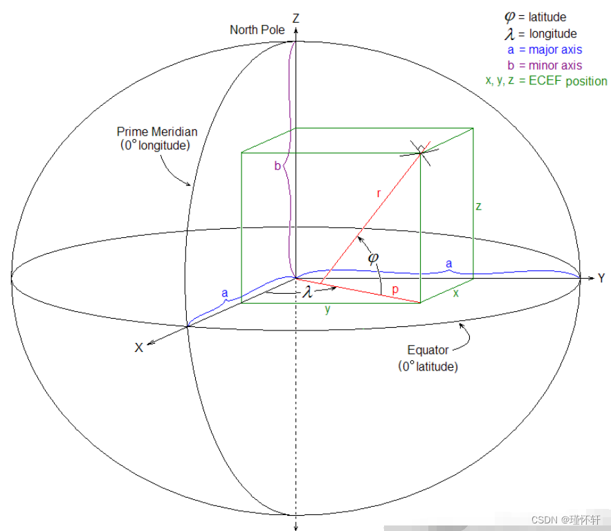{: width="500" height="500"}
<!-- {: width="800" height="800"} -->

### **1.2、 WGS-84坐标系（LLA)**

**WGS-84坐标系**也叫经纬高坐标系(经度(longitude)，纬度(latitude)和高度(altitude)LLA坐标系)，全球[地理坐标系]、大地坐标系。

**特点**：最为广泛应用的一个地球坐标系，它给出一点的大地纬度、大地经度和大地高程。更加直观地告诉我们该点在地球中的位置，故又被称作经纬高坐标系。

WGS-84坐标系：

X轴：指向BIH(国际时间服务机构)1984.0定义的零子午面(Greenwich)和协议地球极([CTP]赤道的交点。
Z轴：指向CTP方向。
Y轴：与X、Z轴构成右手坐标系。 
其中： 
（1）大地纬度是过点P的基准椭球面法线与赤道面的夹角。纬度值在-90°到+90°之间。北半球为正，南半球为负。
（2）大地经度是过点P的子午面与本初子午线之间的夹角。经度值在-180°到+180°之间。
（3）大地高度h是过点P到基准椭球面的法线距离，基准椭球面以内为负，以外为正。 
图示可以参照上图，清楚描述ECEF 和
WGS-84的关系。WGS-84和GPS关系参照下图：

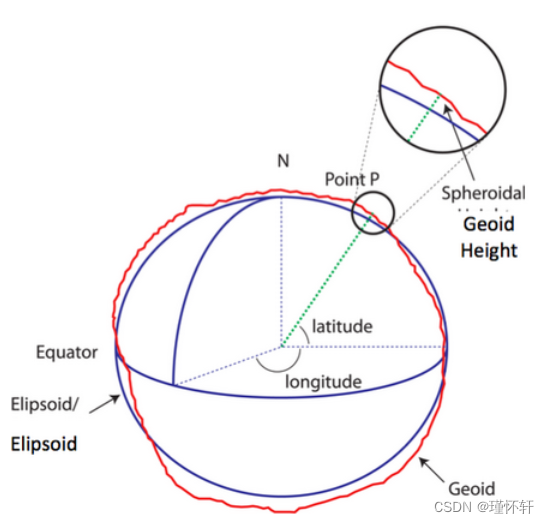 

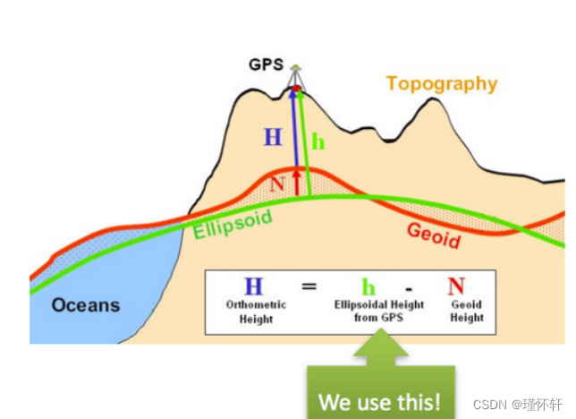 

### **1.3、 东北天坐标系（ENU）**

**东北天坐标系（ENU）**也叫站心坐标系以用户所在位置P为坐标原点。

坐标系定义为：
X轴：指向东边
Y轴：指向北边
Z轴：指向天顶

ENU局部坐标系采用三维直角坐标系来描述地球表面，实际应用较为困难，因此一般使用简化后的二维投影坐标系来描述。

二维投影坐标系中 [统一横轴墨卡托]{style="color:#fe2c24;"}（The Universal Transverse Mercator，[UTM]{style="color:#ed7976;"}）坐标系是一种应用较为广泛的一种。

UTM 坐标系统使用基于网格的方法表示坐标，它将地球分为 60
个经度区，每个区包含6度的经度范围，每个区内的坐标均基于横轴墨卡托投影，如下图所示：

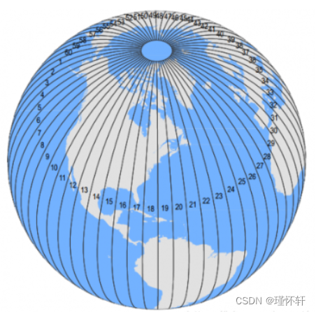 

将上图切分后展平得到下图：

[DMAP: UTM Grid Zones of the
World](https://www.dmap.co.uk/utmworld.htm "DMAP: UTM Grid Zones of the World"){rel="nofollow"}

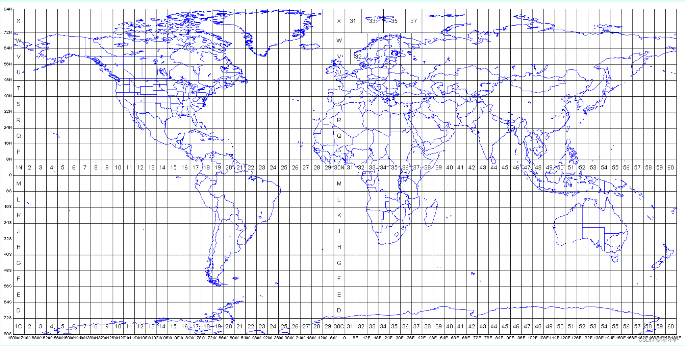

根据中国utm分区表，确定所在地区的utm分区，最常用的对照以下表：

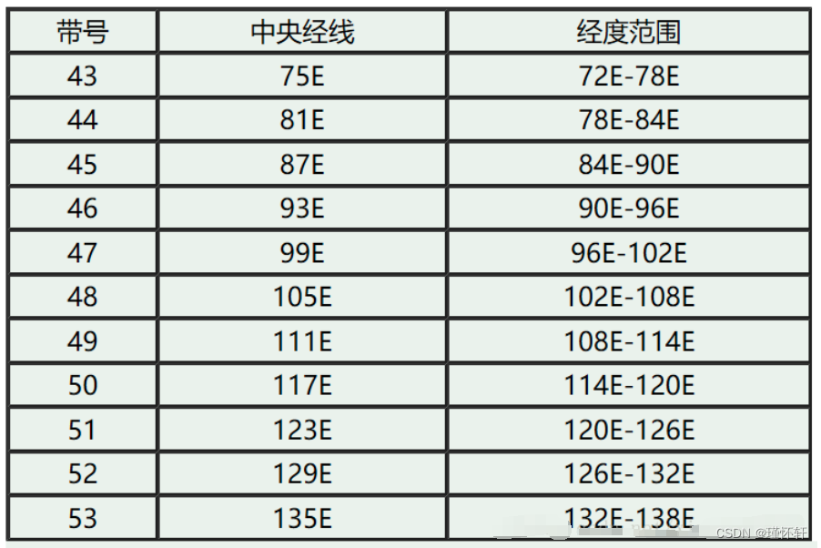 

等会坐标转换就可以使用这个图上的分区。

## 二、坐标转换

### 2.1、工具介绍

主要使用[pyproj]{.words-blog .hl-git-1 tit="pyproj"
pretit="pyproj"}工具进行坐标的转换，文档地址：[入门 --- pyproj 2.1.1
文档](https://www.osgeo.cn/pyproj/examples.html "入门 — pyproj 2.1.1 文档") 

###  2.2、坐标之间相互转换  

知识前置，我们最常见的的是gps坐标拿到经纬度和海拔信息。gps使用的坐标系为WGS，其编号（EPSG）[EPSG：4326] 
，这个参数后续要用到

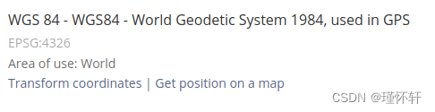 

在使用UTM坐标系转化时要弄清处数据在utm分区表中哪一个分区，假设当前经纬信息为【121.398926，31.559815
】可以根据分区表得到北半球51分区，即51N

网站[EPSG.io: Coordinate Systems
Worldwide](https://epsg.io/ "EPSG.io: Coordinate Systems Worldwide") 
上查询utm分区对应的utm坐标系编码，输入 51N 进行查询,找到对应WGS84
转换前坐标系。得到[EPSG：32651] 

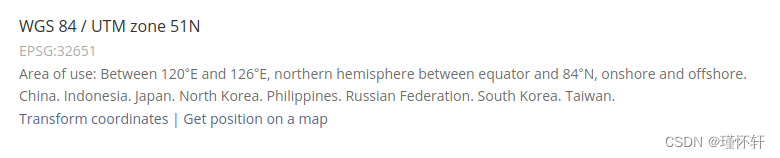 

####  转换原理

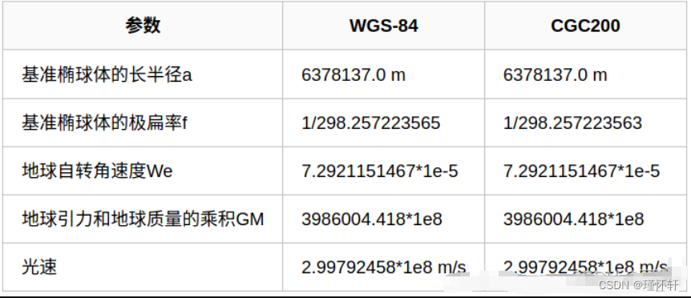

#### （1） **经纬度坐标系转ECEF**

 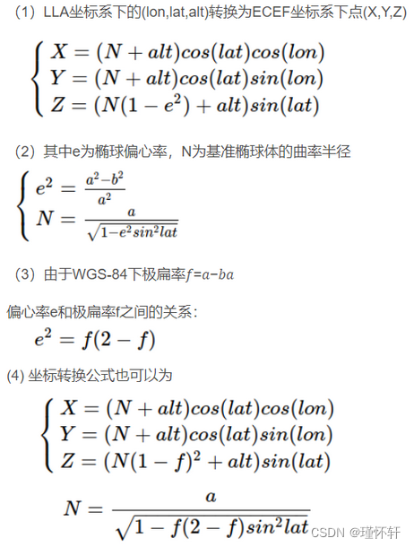

#### （2）ECEF坐标系转LLA坐标系

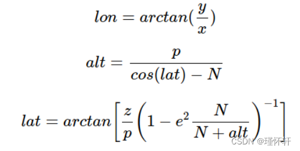 

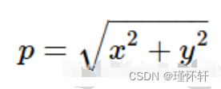 

start：lon是未知的，假设为0，经过几次迭代之后就能收敛

update公式:  alt=(p/cos(lat))-N

####  （3）**ECEF坐标系转ENU坐标系**

用户所在坐标原点𝑃0=(𝑥0,𝑦0,𝑧0),计算点𝑃=(𝑥,𝑦,𝑧)在以点𝑃0为坐标原点的ENU坐标系位置(e,n,u)这里需要用到LLA坐标系的数据，𝑃0的LLA坐标点为𝐿𝐿𝐴0=(𝑙𝑜𝑛0,𝑙𝑎𝑡0,𝑎𝑙𝑡0)

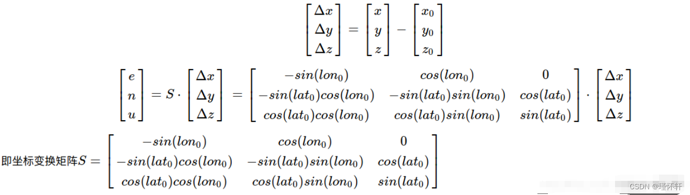

#### **（4）ENU坐标系转ECEF坐标系**

上面介绍S为单位正交阵

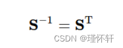

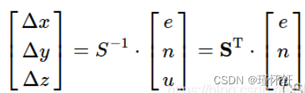

#### （5）**经纬度**LLA**坐标系直接转ENU坐标系**

上述可以看到，从LLA坐标系转换到enu坐标系有较多计算量，在考虑地球偏心率𝑒很小的前提下，可以做一定的近似公式计算

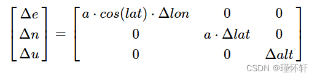 

#### 代码实现

#### （1） 经纬度转UTM坐标

```py
    # 经纬度到UTM世界平面坐标系    
    def wgs2utm_51N(lat,lon):        
        crs = pyproj.CRS.from_epsg(4326)        
        crs_cs = pyproj.CRS.from_epsg(32651)        
        transformer = Transformer.from_crs(crs, crs_cs)        
        x, y = transformer.transform(lat, lon)         
        return [x, y] 
```

#### （2）UTM转经纬坐标

```py
    # 经纬度到UTM世界平面坐标系    
    def utm_51N2wgs(x,y):        
        transformer = Transformer.from_crs("epsg:32651", "epsg:4326")        
        lat, lon = transformer.transform(x, y)        
        return [lat, lon]AI写代码
```

####  （3）经纬海拔转 地心地固坐标

```py
    # 经纬度到地心地固(earth-central, earth-fixed)坐标系    
    def wgs2ecef(lon,lat,alt):        
        ecef = pyproj.Proj(proj='geocent', ellps='WGS84', datum='WGS84')        
        lla = pyproj.Proj(proj='latlong', ellps='WGS84', datum='WGS84')        
        x, y, z = pyproj.transform(lla, ecef, lon, lat, alt, 
                    radians=False)         
        return np.array([x, y, z])AI写代码
```

#### （4）地心地固转enu坐标

```py
  # 用户所在坐标原点Pb=(x0,y0,z0),计算点P=(x,y,z)在以点P0为坐标原点的坐标系位置(e,n,u),    
  # 这里需要用到LLA的数据,P0的LLA坐标点为LLAo=(lon0,lat0,alt0)    
  # 地心地固到东北天坐标系    
  def ecef2enu(self, point0, point):        
    # 转换为弧度        
    lat_r = math.radians(self.lat)        
    lon_r = math.radians(self.lon)        
    line1 = np.array([-math.sin(lon_r), math.cos(lon_r), 0])        
    line2 = np.array([-math.sin(lat_r) * math.cos(lon_r),                          
            -math.sin(lat_r) * math.sin(lon_r),                          
            math.cos(lat_r)])        
    line3 = np.array([math.cos(lat_r) * math.cos(lon_r),                          
            math.cos(lat_r) * math.sin(lon_r),                          
            math.sin(lat_r)])        
    trans = np.vstack((line1, line2, line3))        
    difference = point - point0        
    [e, n, u] = np.matmul(trans, np.array(difference).T).T         
    return [e, n, u] 
```

#### （5）enu转地心地固坐标

```py
    def enu2ecef(self, point):        
        # 转换为弧度        
        lat_r = math.radians(self.lat)        
        lon_r = math.radians(self.lon)        
        line1 = np.array([-math.sin(lon_r), math.cos(lon_r), 0])        
        line2 = np.array([-math.sin(lat_r) * math.cos(lon_r),                          
                -math.sin(lat_r) * math.sin(lon_r),                          
                math.cos(lat_r)])        
        line3 = np.array([math.cos(lat_r) * math.cos(lon_r),                          
                math.cos(lat_r) * math.sin(lon_r),                          
                math.sin(lat_r)])        
        trans = np.vstack((line1, line2, line3))        
        [B, L, H] = np.matmul(trans.T, point)         
        return [B, L, H]
```

#### （6）enu转imu坐标

```py
    # enu空间中的点在惯导坐标系下的坐标,俯仰角绕东轴(x)旋转,横滚角绕北轴(y)旋转,    
    # 航向角绕天轴(z)旋转,这里可以认为简化,只考虑偏航角的情况下   
    # def enu2imu(self, imu_enu, pitch, roll, yaw):    
    def enu2imu(self, imu_enu, yaw, points_enu):        
        Rz = np.array([[math.cos(yaw), -math.sin(yaw), 0],                       
                    [math.sin(yaw), math.cos(yaw), 0],                       
                    [0, 0, 1]])        
        T = np.array(-imu_enu)        
        trans = np.hstack((Rz, T))        
        imu_xyz = np.matmul(trans, points_enu)         
        return imu_xyz
```
