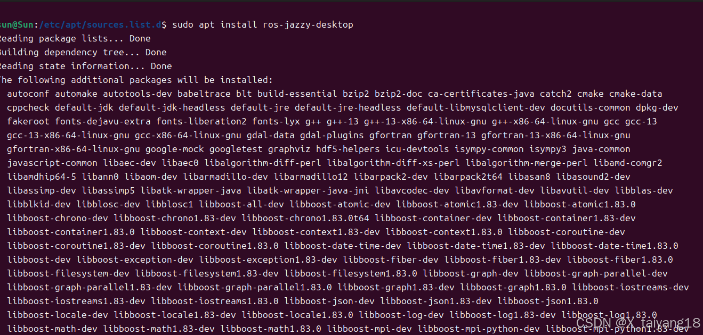

# 《终极指南：在 Ubuntu 24.04 上轻松安装 ROS 2 Jazzy 
[已于 2024-12-29  22:56:19 修改] 
于 2024-12-29 22:55:27 首次发布
 
 
**ROS 2 Jazzy** 是 ROS 2 系列中的一个长期支持（LTS）版本，专为 Ubuntu
24.04 优化，适用于 amd64 和 arm64 架构。该版本的 ROS2
提供了许多新特性和修复，比如对消息类型、图像传输、命令行工具和可视化工具的增强支持。

------------------------------------------------------------------------

**官方安装步骤：**[Ubuntu (Debian packages) --- ROS 2 Documentation:
Jazzy
documentation](https://docs.ros.org/en/jazzy/Installation/Ubuntu-Install-Debians.html) 
------------------------------------------------------------------------

以下是详细的安装步骤：

## 一、前提准备

### 1.  **检查操作系统版本** 
首先，确保你的系统版本是 Ubuntu 24.04。可以使用以下命令检查：
```sh
lsb_release -a
```
如果返回的版本不是 Ubuntu 24.04，建议先升级或安装合适的操作系统版本。

### 2.  **设置 UTF-8 支持** 
确保系统支持 UTF-8 编码。运行以下命令检查并设置 UTF-8：

```sh
locale  # 查看当前 locale 配置
sudo apt update && sudo apt install locales
sudo locale-gen en_US en_US.UTF-8
sudo update-locale LC_ALL=en_US.UTF-8 LANG=en_US.UTF-8
export LANG=en_US.UTF-8
locale  # 验证配置 
```

### 3.  **启用 Universe 存储库** 
Ubuntu 24.04 通常会默认启用 Universe 存储库，但你可以通过以下命令确认并启用它：

```sh
sudo apt install software-properties-common
sudo add-apt-repository universe
sudo apt update 
```

## 二、安装 ROS 2 Jazzy

### 1. **安装所需依赖**

这条命令会一次性安装 `curl`、`gnupg` 和 `lsb-release` 三个包：
-   **curl**：用于下载文件，设置 ROS 2 仓库。
-   **gnupg**：用于处理 GPG 密钥，验证下载的包的来源。
-   **lsb-release**：提供有关操作系统版本的信息，ROS2使用它来确认系统的版本和发行信息。

通过 `-y` 选项，系统会自动确认安装，无需用户交互。

```sh
sudo apt install curl gnupg lsb-release -y 
```

### 2. **设置 ROS 2 软件源**

下载 ROS 2 的 GPG 密钥并添加 ROS2 软件源：

```sh
sudo curl -sSL https://raw.githubusercontent.com/ros/rosdistro/master/ros.key -o /usr/share/keyrings/ros-archive-keyring.gpg
```

接着，将 ROS2 的软件源添加到系统的源列表中：

```sh
echo "deb [arch=$(dpkg --print-architecture) signed-by=/usr/share/keyrings/ros-archive-keyring.gpg] http://packages.ros.org/ros2/ubuntu $(. /etc/os-release && echo $UBUNTU_CODENAME) main" | sudo tee /etc/apt/sources.list.d/ros2.list > /dev/null
```

### 3. **更新并安装 ROS 2 Jazzy**

运行以下命令更新系统的 apt 存储库信息并安装 ROS2：

```sh
sudo apt update  # 更新包管理器的本地软件包索引
sudo apt upgrade -y # 根据 apt update 更新的软件包列表，查找当前安装包是否有新版本，并升级到最新版本
sudo apt install ros-jazzy-desktop -y  # 安装 ROS 2 Jazzy 的桌面版本，包含可视化工具 RViz 等 
```



如果只需要核心功能（不需要 GUI 工具），可以安装 `ros-jazzy-ros-base`：

```sh
sudo apt install ros-jazzy-ros-base -y 
```

**最常见版本**：
-   `ros-jazzy-desktop-full`：完整安装，包括所有开发工具和图形界面。
-   `ros-jazzy-desktop`：较为简化的桌面版本，适合大多数桌面开发。
-   `ros-jazzy-ros-base`：基本的安装版本，只包含核心功能，适合基础开发。

[这里出错的话看一下故障排除](https://blog.csdn.net/weixin_46445090/article/details/144812129#%E5%9B%9B%E3%80%81%E6%95%85%E9%9A%9C%E6%8E%92%E9%99%A4)

###   4. **配置环境变量**

每次打开终端时，必须设置 ROS2 的环境变量。可以通过以下命令手动设置：

```sh
source /opt/ros/jazzy/setup.bash 
```

为了避免每次都要手动设置，可以将此命令添加到 `~/.bashrc` 文件中：

```sh
echo "source /opt/ros/jazzy/setup.bash" >> ~/.bashrc
source ~/.bashrc 
```

### 5. **安装其他开发工具（可选）**

-   更新系统并安装开发工具：
    [这里出错首先看一下故障排除](https://blog.csdn.net/weixin_46445090/article/details/144812129#%E5%9B%9B%E3%80%81%E6%95%85%E9%9A%9C%E6%8E%92%E9%99%A4) 
```sh
sudo apt update && sudo apt install ros-dev-tools 
```

-   安装自动补全功能
```sh
    sudo apt install python3-argcomplete 
```

-   安装colcon和pip
    `colcon` 是用于构建 ROS 2 工作空间的工具，类似于 ROS 1 中的
    `catkin`。同时，`pip` 是 Python 的包管理工具：
```sh
sudo apt install python3-pip
sudo apt install python3-colcon-common-extensions 
```

## 三、测试 ROS 2 安装

### 1. **运行 ROS 2 示例程序**

验证安装是否成功，可以运行 ROS 2
的示例程序。首先打开一个终端，[设置环境变量]{.words-blog .hl-git-1
tit="设置环境变量" pretit="设置环境变量"}并运行一个 C++
发布者节点（talker）：

```sh
source /opt/ros/jazzy/setup.bash
ros2 run demo_nodes_cpp talker 
```

然后在另一个终端中，设置环境变量并运行一个 Python
订阅者节点（listener）：

```sh
source /opt/ros/jazzy/setup.bash
ros2 run demo_nodes_py listener 
```

如果一切顺利，你会看到以下输出：

-   `talker`：会不断发布消息。
-   `listener`：会显示接收到的消息。

##  四、故障排除

1.  **密钥下载超时**：如果在添加 GPG 密钥时遇到超时或连接问题，可能是网络问题导致的。可以尝试更换网络，或者等待一段时间后重试。

2.  **环境变量配置错误**：如果在运行 ROS2 命令时提示"没有那个文件或目录"，请确保 `source` 命令正确执行且 `.bashrc` 配置正确。

3.  **无法找到 ROS 2 软件源**：如果在安装时无法找到 ROS2 的软件源，请检查 `/etc/apt/sources.list.d/ros2.list` 文件中的内容是否正确。

4.  无法连接到 **githubusercontent.com**以及虽然使用 apt-key
    添加了**密钥**，但系统仍然报告密钥无效

    首先删除之前的设置：
```sh
sudo rm /etc/apt/sources.list.d/ros2.list
sudo rm /usr/share/keyrings/ros-archive-keyring.gpg 
```

    使用另一种方式添加密钥：
```sh
# 直接从 keyserver 获取密钥并保存到正确的位置
sudo gpg --keyserver keyserver.ubuntu.com --recv-keys F42ED6FBAB17C654
sudo gpg --export F42ED6FBAB17C654 | sudo gpg --dearmor -o /usr/share/keyrings/ros-archive-keyring.gpg 
```

    添加软件源：
```sh
echo "deb [arch=$(dpkg --print-architecture) signed-by=/usr/share/keyrings/ros-archive-keyring.gpg] http://packages.ros.org/ros2/ubuntu noble main" | sudo tee /etc/apt/sources.list.d/ros2.list
```

    更新并安装：
    ```sh
    sudo apt update 
    ```

## 五、卸载 ROS 2

如果需要卸载 ROS 2 或切换到其他安装方式，可以执行以下命令：

```sh
sudo apt remove ~nros-jazzy-* && sudo apt autoremove 
```

此外，你可能需要删除 ROS 2 的软件源：

```sh
sudo rm /etc/apt/sources.list.d/ros2.list
sudo apt update
sudo apt autoremove
sudo apt upgrade 
```

查看可用的 ROS 2 包：

```sh
apt search ros2
```

* 其他注意事项
-   ROS2 的桌面版本包含了很多工具（如 RViz、Gazebo 等），对于机器人开发来说非常有用。

完成这些步骤后，你就可以开始使用 ROS2 Jazzy 开发和学习 ROS了。如果你有任何问题或遇到安装困难，随时可以询问！

------------------------------------------------------------------------

#### *RCM（Robot Configuration Management）安装方法
-   安装RCM

```sh
curl https://www.ncnynl.com/rcm.sh | bash -
```

-   执行命令：
```sh
rcm -si  install_ros2_now 
```

RCM 是一个用于简化和自动化 ROS 2
安装过程的工具，它通过一组脚本和命令帮助用户快速安装和配置 ROS 2。

RCM 工具通常会自动下载、安装并配置 ROS 2及其相关依赖，简化了传统安装过程中的繁琐步骤。它可能还会提供对特定版本的ROS 2 的支持，以及在不同环境中配置 ROS 2 的选项。

