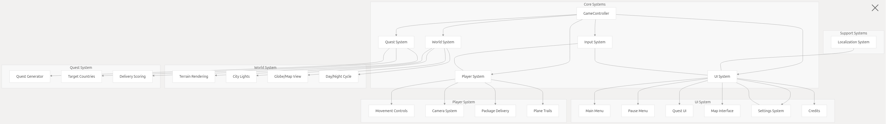
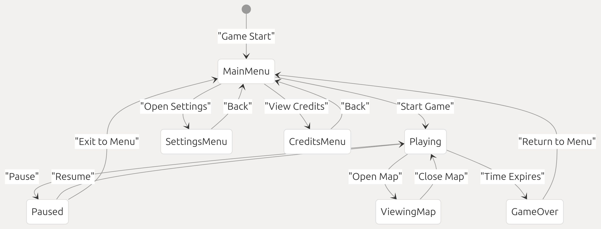
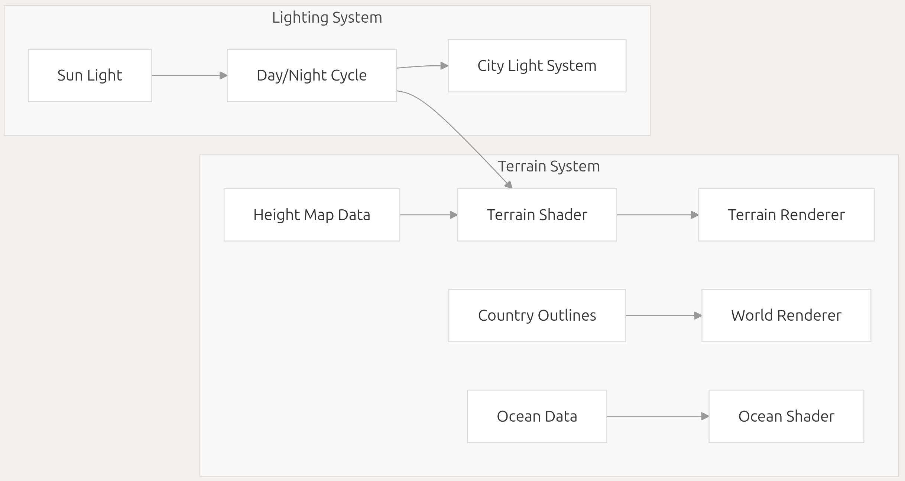
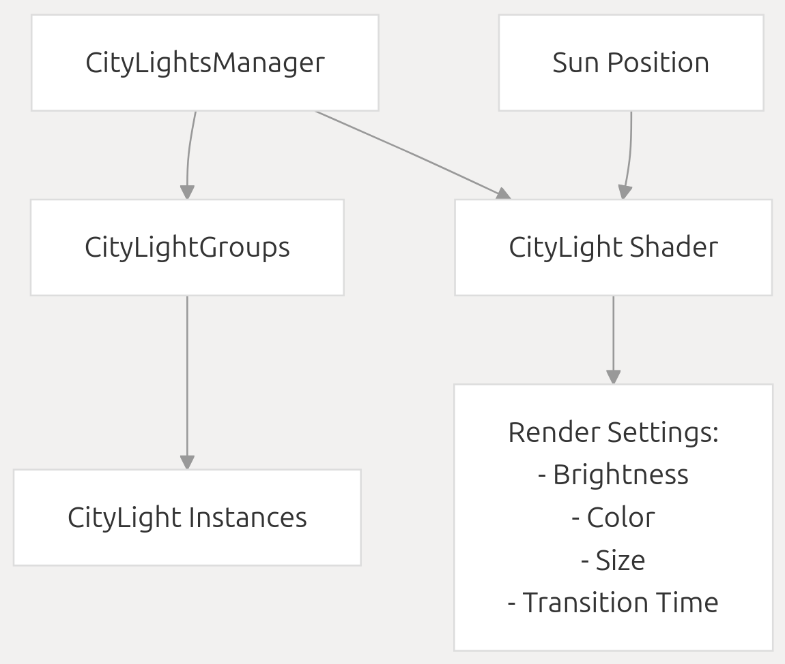
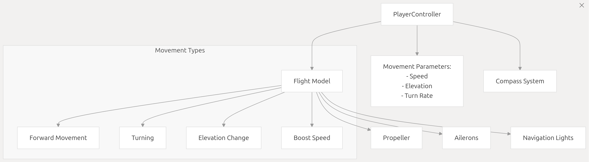
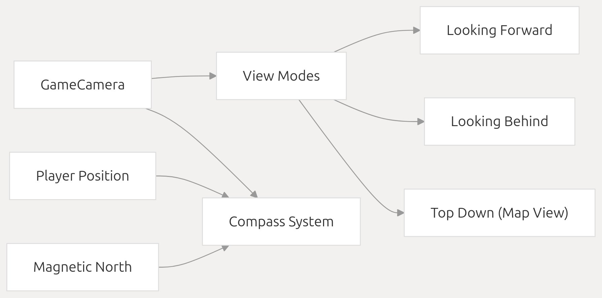
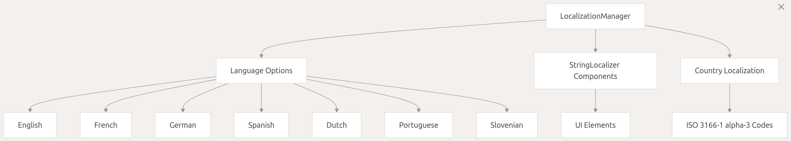
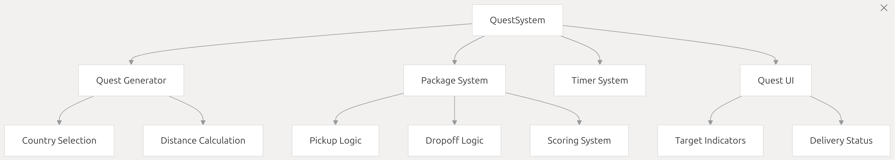
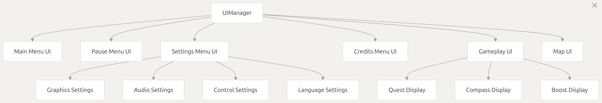

# Overview

## 1.Relevant source files

```
Assets/Data/Localization/Dutch/_Dutch.asset.meta
Assets/Graphics/Materials/Game/Terrain.mat
Assets/Scenes/Game.unity
Assets/Scripts/Game/City Lights/CityLight.shader
Assets/Scripts/Game/City Lights/CityLights.cs
Assets/Scripts/Game/Navigation/Compass.cs
ProjectSettings/ProjectSettings.asset
```
This document provides a comprehensive introduction to the Geographical Adventures codebase, a Unity-based game where players pilot a plane around a 3D globe to deliver packages. It covers the core architecture, primary systems, and how they interact with each other. This overview serves as a foundation for understanding the more detailed documentation in subsequent pages.

For specific implementation details of individual systems, please refer to their dedicated pages in the wiki.

## 2.Game Concept

Geographical Adventures is a delivery game where players fly a plane across a 3D globe, picking up and delivering packages to various countries. The game features:

    A fully navigable 3D Earth with realistic terrain
    Day/night cycle with dynamic city lights
    Package delivery quest system
    Multiple camera views and control schemes
    Multilingual support with extensive localization

Sources:
ProjectSettings/ProjectSettings.asset15-17

## 3.Core Systems Architecture

The game is structured around several interconnected systems that work together to create the gameplay experience:
 

Sources:
Assets/Scenes/Game.unity1100-1142
Assets/Scripts/Game/City Lights/CityLights.cs6-169

## 4.Game States and Flow
The game transitions between different states, each controlling which systems are active and how they interact:



Sources:
Assets/Scenes/Game.unity388-420
Assets/Scenes/Game.unity438-458

## 5.World System

The World System manages the 3D globe environment, including terrain rendering, city lights, and day/night cycle.
### 5.1 Terrain and Globe Rendering
The globe is rendered using a custom shader system that handles terrain elevation, texturing, and lighting:



Sources:
Assets/Graphics/Materials/Game/Terrain.mat10-135

### 5.2 City Lights System
City lights appear dynamically as day transitions to night, using an instancing system for performance:

Sources:
Assets/Scripts/Game/City Lights/CityLights.cs6-169
Assets/Scripts/Game/City Lights/CityLight.shader1-77

## 6.Player System

The Player System manages the airplane controls, movement, camera, and package delivery mechanics.

### 6.1 Player Movement and Controls
 

Sources:
Assets/Scenes/Game.unity1100-1142
Assets/Scripts/Game/Navigation/Compass.cs 5-62

### 6.2 Camera System
 

Sources:
Assets/Scripts/Game/Navigation/Compass.cs 5-62

## 7. Localization System
The game supports multiple languages through a comprehensive localization system:

 
Sources:
Assets/Data/Localization/Dutch/_Dutch.asset.meta1-9

## 8.Quest System
The Quest System generates delivery tasks, manages package pickup and dropoff, and tracks player progress:

 
 
Sources:
Assets/Scenes/Game.unity388-420

## 9.UI System
The UI System manages all user interfaces in the game:
 

Sources:
Assets/Scenes/Game.unity438-458

## 10.Technical Specifications

Geographical Adventures runs on Unity and supports various configurations:
System Aspect | Details
--------------|--------
Engine | Unity
Platforms | Windows, macOS, Linux
Input Systems | Keyboard, Mouse, Controller
Resolution | Multiple supported, configurable
Rendering | Custom shaders for terrain, ocean, and lights
Languages | English, French, German, Spanish, Dutch, Portuguese, Slovenian

Sources:
ProjectSettings/ProjectSettings.asset15-17
ProjectSettings/ProjectSettings.asset137

## 11.Development Approach

The codebase is organized with a component-based architecture following Unity's paradigms:

```
>     Core Systems are organized into distinct managers
>     MonoBehaviour Components handle specific functionality
>     Scriptable Objects store configuration data
>     Custom Shaders handle specialized rendering
>     Data Assets contain game content (countries, city lights, etc.)
```
This organization allows for modular development and easy extension of functionality.

## 12 Summary
Geographical Adventures is a comprehensive game that combines geographical knowledge with flight mechanics and package delivery gameplay. The codebase is structured around several key systems that handle different aspects of the game experience, from rendering the world to managing quests and user interfaces. This overview provides a foundation for understanding the more detailed documentation in the following pages.

