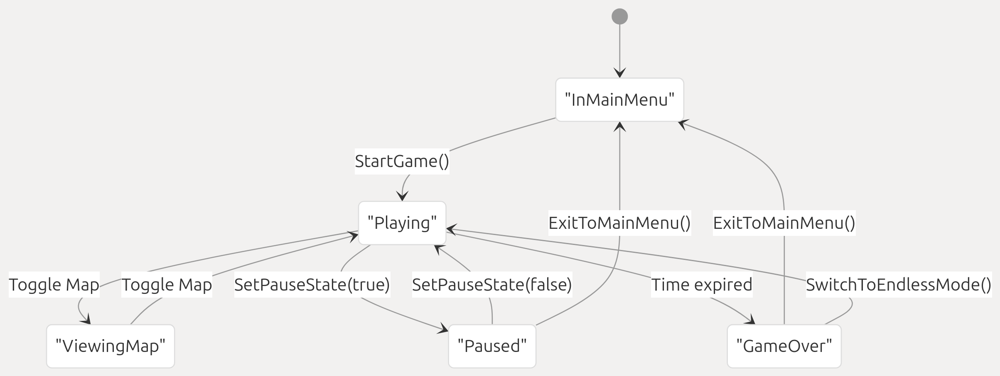
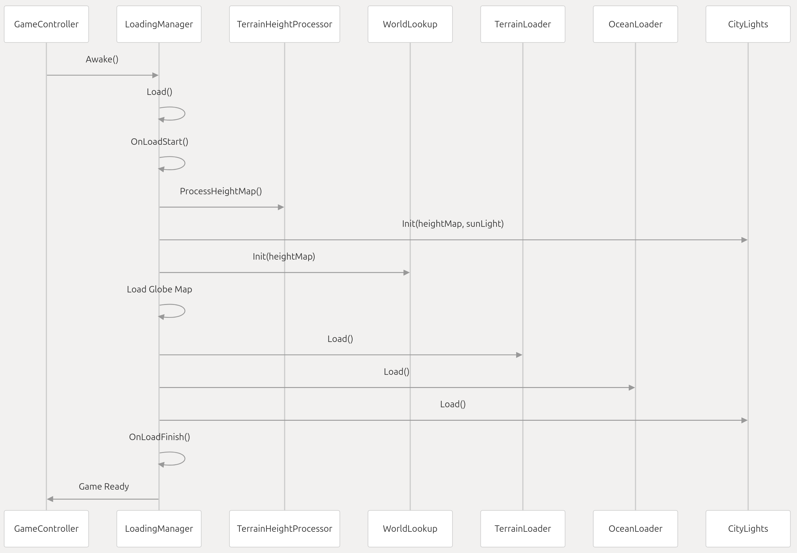
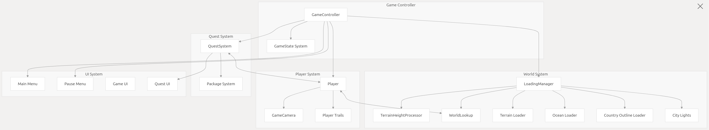
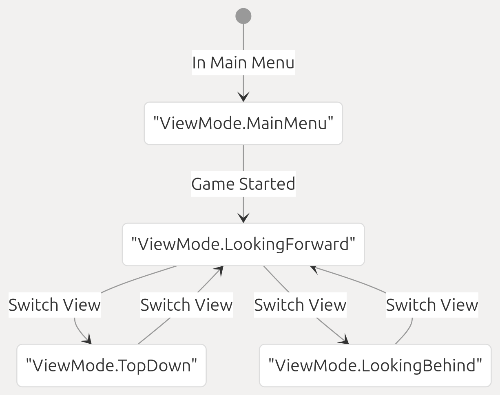

# 1.Game Architecture

This document describes the high-level architecture of Geographical Adventures, focusing on the core systems, game state management, and initialization process. It provides an overview of how the major components interact with each other to create a cohesive gameplay experience.

For specific details about individual systems, refer to the following pages:

    Player system details: Player System
    World rendering: World System
    Quest mechanics: Quest System
    User interface: UI System

## 1.1 Game State Management
Geographical Adventures uses a stack-based state machine to manage different game states. This approach allows for easy transitioning between states while maintaining a history of previous states.
[tr]Geographical Adventures使用基于堆栈的状态机来管理不同的游戏状态。这种方法允许在状态之间轻松转换，同时保留以前状态的历史记录。

### 1.1.1 Game States
The game defines five primary states that control gameplay flow and UI visibility:


The state transitions are managed by the GameController class, which provides static methods for changing states and checking the current state. The controller maintains a stack of states to track history and allow returning to previous states.

Sources:
Assets/Scripts/Game/Misc/GameController.cs6-13
Assets/Scripts/Game/Misc/GameController.cs64-141

### 1.1.2State Stack Implementation

The GameController uses a stack data structure to manage state history. When a new state is set, it's pushed onto the stack. Returning to the previous state pops the current state off the stack.

The state stack implementation has several advantages:

    Allows multiple layers of state (e.g., paused while viewing map)
    Makes it easy to return to previous states
    Provides a clean history of state transitions

Sources:
Assets/Scripts/Game/Misc/GameController.cs28-39
Assets/Scripts/Game/Misc/GameController.cs100-111
Assets/Scripts/Game/Misc/GameController.cs125-131

## 1.2 Initialization and Loading

The game world requires substantial initialization to load terrain, ocean, countries, and other visual elements. The LoadingManager orchestrates this process.
游戏世界需要大量的初始化来加载地形、海洋、国家和其他视觉元素。LoadingManager协调此过程。

### 1.2.1 Loading Process
When the game starts, the LoadingManager executes a series of loading tasks in sequence:
 

Each loading task is executed sequentially, with optional logging of task duration for performance monitoring. The loading screen is displayed during this process and closed once loading is complete.

Sources:
Assets/Scripts/Game/World/LoadingManager.cs30-98 

### 1.2.2 Loading Tasks

The LoadingManager defines a set of tasks that must be completed during initialization:
Task Name | Description | Function
----------|-------------|---------
Processing Height Map   | Processes terrain height data | heightProcessor.ProcessHeightMap()
Creating City Lights    | Initializes city light system | cityLights.Init()
Initializing World Lookup | Sets up geographic coordinate system | worldLookup.Init()
Loading Globe (map)       | Loads map view of the globe | globeMapLoader.Load()
Loading Terrain Mesh      | Loads terrain geometry      | terrainLoader.Load()
Loading Ocean Mesh        | Loads ocean geometry        | oceanLoader.Load()
Loading Country Outlines  | Loads country border geometry | countryOutlineLoader.Load()

Sources:
Assets/Scripts/Game/World/LoadingManager.cs36-54

## 1.3 Core Systems Overview
Geographical Adventures consists of several interconnected systems that work together to create the gameplay experience. Here's a high-level view of the major systems and their relationships:

 
This diagram shows the major systems in the game and their relationships. The GameController sits at the top of the hierarchy, managing game state and coordinating between other systems.

Sources:
Assets/Scripts/Game/Misc/GameController.cs
Assets/Scripts/Game/World/LoadingManager.cs
Assets/Scripts/Game/Player/GameCamera.cs

### 1.3.1 System Communication

The systems communicate through a combination of direct references, events, and static access patterns:

Events are used for loose coupling between systems, while direct references are used where tighter integration is required. The GameController provides static methods that can be accessed from anywhere to check game state.

Sources:
Assets/Scripts/Game/Misc/GameController.cs17-18
Assets/Scripts/Game/Player/GameCamera.cs7

## 1.4 Implementation Details

### 1.4.1 Game State Handling

The GameController implements state transitions with methods that manipulate the state stack:

    1.SetState: Pushes a new state onto the stack
```c#
    public static void SetState(GameState newState)
    {
        if (newState != CurrentState)
        {
            Instance.stateStack.Push(newState);
        }
    }
```
    2.ReturnToPreviousState: Pops the current state from the stack
```c#
    static void ReturnToPreviousState()
    {
        if (Instance.stateStack.Count > 0)
        {
            Instance.stateStack.Pop();
        }
        else
        {
            SetState(GameState.InMainMenu);
        }
    }
```
    3.State-specific transitions:
        SetPauseState: Manages transitions to and from the paused state
        StartGame: Transitions to the playing state
        GameOver: Transitions to the game over state

Sources:
Assets/Scripts/Game/Misc/GameController.cs80-141

### 1.4.2Camera System Integration
The GameCamera adapts to different game states by changing its view mode:


The camera monitors the current game state and automatically transitions between views based on both game state and player input.

Sources:
Assets/Scripts/Game/Player/GameCamera.cs8-9
Assets/Scripts/Game/Player/GameCamera.cs71-106

## 1.5 Testing and Development Tools

The codebase includes tools to assist with development and testing:

    1.Dev Mode: A special mode that can be toggled in builds for testing purposes
```c#
public static bool InDevMode
{
    get
    {
        return Application.isEditor || Instance.devModeEnabledInBuild;
    }
}
``` 
    2.Build Ready Test: A utility to ensure critical game settings are properly configured for release builds
```c#
    public void Test()
    {
        Debug.Assert(player.debug_lockMovement == false, "Player movement locked");
        Debug.Assert(questSystem.cycleThroughStartSettings == true, "Cycle start positions disabled");
        Debug.Assert(solarSystem.animate == true, "SolarSystem animation disabled");
        Debug.Assert(music.tracks != null && music.tracks.Length > 0 && music.tracks[0] != null, "Music Missing");
    }
```
    Placeholder World: A component that provides a visual representation of the world in the editor but disables itself during gameplay
```c#
    void Start()
    {
        if (Application.isPlaying)
        {
            gameObject.SetActive(false);
        }
    }
```
Sources:
Assets/Scripts/Game/Misc/GameController.cs155-161
Assets/Scripts/Editor Helper/BuildReadyTest.cs13-21
Assets/Scripts/Game/Misc/PlaceholderWorld.cs12-18
