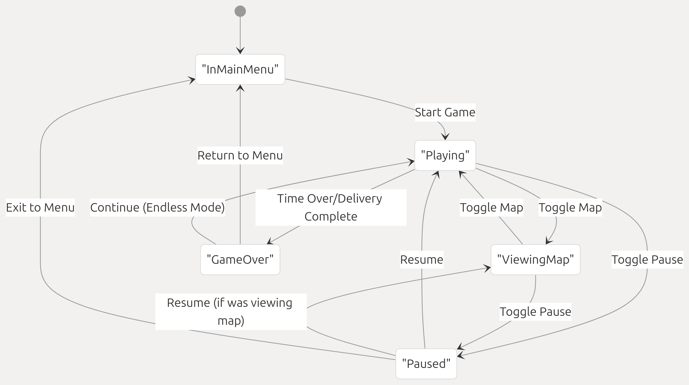
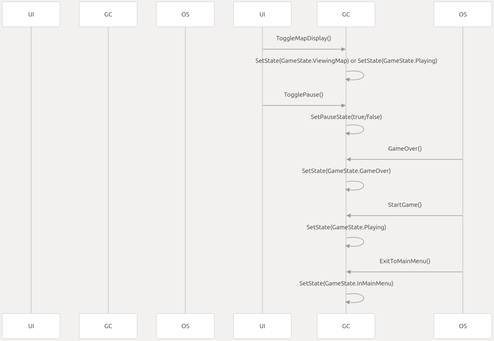

# 1.Game States

Relevant source files
> Assets/Scripts/Game/Misc/GameController.cs
> Assets/Scripts/Game/Player/GameCamera.cs
> Assets/Scripts/Game/Player/Player.cs
> Assets/Scripts/Menu/UIManager.cs

This document details the game state management system in Geographical Adventures. The state system controls the overall flow of the game, determining which gameplay elements are active and how user input is processed at any given moment.

For information on initial game loading, see "[Initialization and Loading](https://deepwiki.com/SebLague/Geographical-Adventures/2.2-initialization-and-loading)". 

## 1.1 Overview
The Game States system serves as the central controller for determining what the game is currently doing. It manages transitions between different modes like playing, paused, or viewing the map. Using a stack-based approach, it enables smooth transitions between states while preserving state history.
 
 
Sources:
Assets/Scripts/Game/Misc/GameController.cs 6-13
Assets/Scripts/Game/Misc/GameController.cs 64-79
Assets/Scripts/Game/Misc/GameController.cs 112-131

## 1.2Game State Types

The GameState enum defines five distinct states that the game can be in:
State | Description
------|------------
InMainMenu | Player is in the main menu before starting gameplay
Playing | Active gameplay where the player controls the plane
ViewingMap | Map view is active, showing the globe overview
Paused | Game is paused, time is stopped
GameOver | Game has ended, showing stats screen

Sources:
Assets/Scripts/Game/Misc/GameController.cs 6-13

## 1.3 State Management Implementation
### 1.3.1 State Stack System

The Game States system uses a stack data structure to manage state transitions and history:

Key implementation details:

    The current state is always the top of the stack (stateStack.Peek())
    New states are pushed onto the stack with SetState()
    When returning from a temporary state (like paused), the top state is popped with ReturnToPreviousState()
    Helper methods IsState() and IsAnyState() allow systems to check the current state

Sources:
Assets/Scripts/Game/Misc/GameController.cs 28
Assets/Scripts/Game/Misc/GameController.cs 100-111
Assets/Scripts/Game/Misc/GameController.cs 125-131
Assets/Scripts/Game/Misc/GameController.cs 163-186

### 1.3.2 State Transitions
The following diagram shows how different components trigger state transitions:

 

 Key transition methods:

    SetPauseState(bool paused): Toggles between paused and previous state
    GameOver(): Transitions to game over state and stops time
    StartGame(): Transitions to playing state
    ExitToMainMenu(): Returns to main menu

Sources:
Assets/Scripts/Game/Misc/GameController.cs 64-79
Assets/Scripts/Game/Misc/GameController.cs 80-98
Assets/Scripts/Game/Misc/GameController.cs 119-123
Assets/Scripts/Game/Misc/GameController.cs 133-140

## 1.4 System Interactions
### 1.4.1 Player System Integration
The player system depends on the game state to determine when to process input and update movement:
```c# 
if (GameController.IsState(GameState.Playing))
{
    HandleInput();
    HandleMovement();
    UpdatePositionHistory();
    UpdateBoostTimer();
}
```
This conditional check ensures that player movement only occurs during active gameplay, not when paused, in menus, or viewing the map.

Sources:
Assets/Scripts/Game/Player/Player.cs  112-127

### 1.4.2 UI System Integration

The UI system reacts to state changes by enabling or disabling appropriate interface elements:

The UIManager enables or disables UI elements based on the current game state:
```c#
bool uiIsActive = GameController.IsState(GameState.Playing) || GameController.IsState(GameState.ViewingMap);
hudGroup.alpha = Mathf.SmoothDamp(hudGroup.alpha, uiIsActive ? 1 : 0, ref smoothV, smoothT);
```
Sources:
Assets/Scripts/Menu/UIManager.cs  28-35
Assets/Scripts/Menu/UIManager.cs  54-67
### 1.4.3 Camera System Integration

The camera system adjusts its view based on the current game state:
```cs
if (GameController.CurrentState == GameState.InMainMenu)
{
    menuToGameViewTransitionT = 0;
    activeView = ViewMode.MainMenu;
}
```
When transitioning from the main menu to gameplay, a special animation occurs:
```cs
if (GameController.IsState(GameState.Playing))
{
    // If started playing, transition from menu cam to forward cam
    menuToGameViewTransitionT += Time.deltaTime * 1f;
    view = ViewSettings.Lerp(menuView, lookingAheadView, Seb.Ease.Quadratic.Out(menuToGameViewTransitionT));
    if (menuToGameViewTransitionT > 1)
    {
        activeView = ViewMode.LookingForward;
    }
}
```
Sources:
Assets/Scripts/Game/Player/GameCamera.cs60-69
Assets/Scripts/Game/Player/GameCamera.cs72-106

## 1.5 Time Management

The Game States system has direct control over Time.timeScale, affecting the actual flow of time in the game:

    When pausing: Time.timeScale = 0
    When resuming: Time.timeScale = 1
    When game over: Time.timeScale = 0
    When switching to endless mode: Time.timeScale = 1

This ensures that game logic stops processing when in paused or game over states.

Sources:
Assets/Scripts/Game/Misc/GameController.cs64-79
Assets/Scripts/Game/Misc/GameController.cs80-98

## 1.6 Best Practices for Using the Game State System

When working with the Game States system:

    Use GameController.IsState() or GameController.IsAnyState() to check current state
    Never modify the state stack directly; use the provided methods
    For UI elements that should be active only during certain states, check the current state in Update()
    When adding a new state, ensure proper transition paths are implemented
```cs
// Example: Conditionally processing logic based on game state
if (GameController.IsState(GameState.Playing))
{
    // Process gameplay logic
}
```
Sources:
Assets/Scripts/Game/Player/Player.cs112-127
Assets/Scripts/Game/Misc/GameController.cs171-186