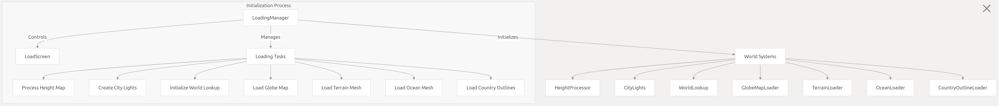
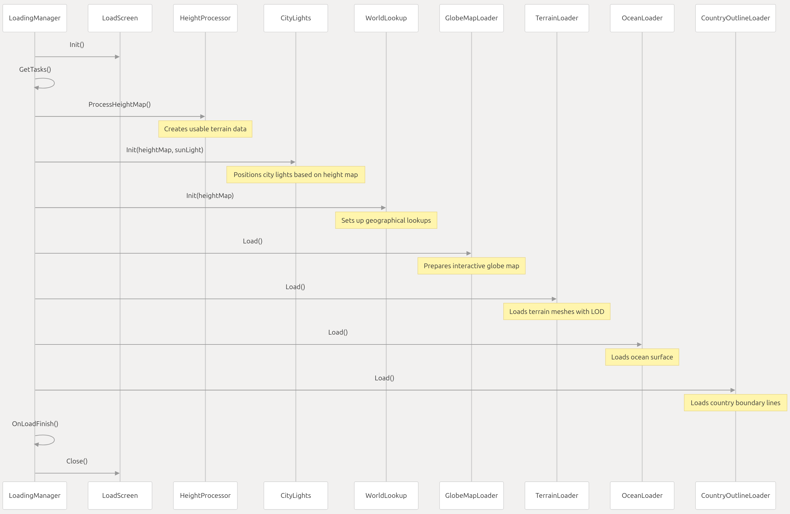
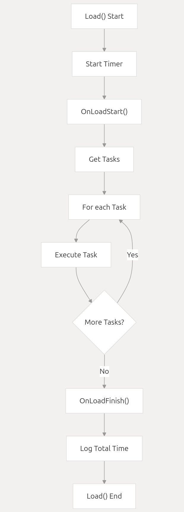
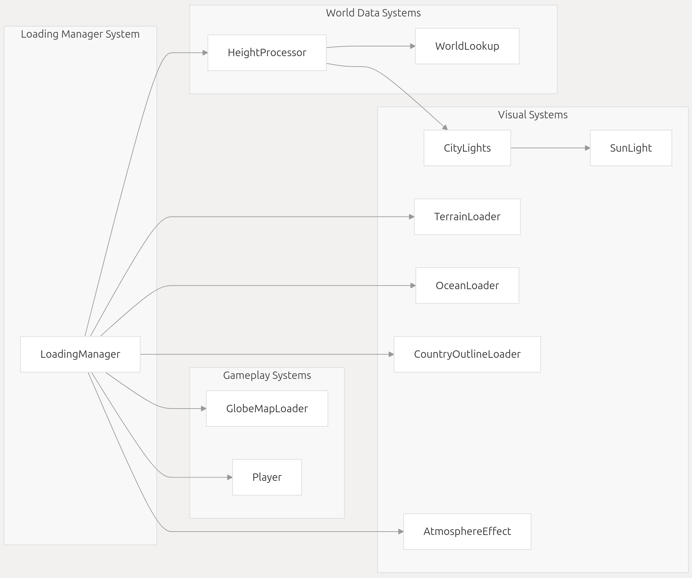

# 1.Initialization and Loading

 
Relevant source files

Assets/Scripts/Editor Helper/BuildReadyTest.cs
Assets/Scripts/Editor Helper/BuildReadyTest.cs.meta
Assets/Scripts/Game/Misc/PlaceholderWorld.cs

    Assets/Scripts/Game/World/LoadingManager.cs

This document details the initialization and loading processes in Geographical Adventures, explaining how the game world is initialized, the sequence of loading tasks, and how various components are prepared for gameplay. For information about specific world rendering systems after initialization, see [Terrain and Rendering](https://deepwiki.com/SebLague/Geographical-Adventures/4.1-terrain-and-rendering) and [City Lights System](https://deepwiki.com/SebLague/Geographical-Adventures/4.2-city-lights-system).

## 1.1 Overview
The initialization and loading system is responsible for preparing the game world before gameplay begins. This includes processing terrain data, setting up visual elements, and establishing lookup systems for geographical features. The system ensures all required components are properly loaded and initialized before the player gains control.
 

 Sources:
Assets/Scripts/Game/World/LoadingManager.cs 6-35

## 1.2Loading Manager
The LoadingManager is the central component responsible for coordinating the initialization and loading of the game world. It has high execution priority (defined in script execution order settings) to ensure it runs before other scripts.

### 1.2.1Component References

The Loading Manager maintains references to various components that need to be initialized:
Component | Purpose
----------------------|--------
TerrainHeightProcessor | Processes raw height map data into usable format
CityLights             | Manages the rendering of city lights on the globe
WorldLookup             | Provides geographical lookup functionality
GlobeMapLoader          | Handles loading of the interactive map view
LodMeshLoader (terrain) | Loads terrain mesh with level-of-detail system
MeshLoader (ocean)      | Loads the ocean mesh
MeshLoader (countries)  | Loads country outline meshes

Sources:
Assets/Scripts/Game/World/LoadingManager.cs 12-26

## 1.3 Loading Process
The loading process is executed through a sequence of well-defined tasks. Each task is encapsulated in a LoadTask object that contains the task's action and name.
 

 Sources:
Assets/Scripts/Game/World/LoadingManager.cs36-78

### 1.3.1 Loading Tasks

The GetTasks() method defines the sequence of loading tasks:

>     1. Processing Height Map: Converts raw height data into a processed format
>     2. Creating City Lights: Initializes city light positions based on the processed height map
>     3. Initializing World Lookup: Sets up the system for geographical queries
>     4. Loading Globe Map: Prepares the interactive map view
>     5. Loading Terrain Mesh: Loads the terrain with level-of-detail support
>     6. Loading Ocean Mesh: Loads the ocean surface
>     7. Loading Country Outlines: Loads country boundaries

Each task is executed sequentially, and its execution time can be logged for performance analysis.

Sources:
Assets/Scripts/Game/World/LoadingManager.cs36-54

### 1.3.2 Task Execution
The Load() method handles the execution of all loading tasks:

 
 During execution, each task's completion time is measured and can be logged for debugging purposes.

Sources:
Assets/Scripts/Game/World/LoadingManager.cs58-78

## 1.4 Loading Screen Integration

The system integrates with a loading screen that provides visual feedback during the initialization process:

    1. Start of Loading:
        * Game objects specified in deactivateWhileLoading are disabled
        * Loading screen is activated and initialized

    2. During Loading:
         * Each task can log its progress to the loading screen
         * Task execution times can be displayed

    3. End of Loading:
         * Resources are released
         * Unused assets are unloaded
         * Game objects are reactivated
         * Loading screen is closed

Sources:
Assets/Scripts/Game/World/LoadingManager.cs 82-98

## 1.5 Post-Loading Cleanup

After all loading tasks are completed, the system performs cleanup operations:

    The height processor releases memory for data no longer needed
    Unused assets are unloaded via Resources.UnloadUnusedAssets()
    Game objects that were deactivated during loading are reactivated
    The loading screen is closed, and the game begins

This cleanup ensures optimal memory usage once the game starts.

Sources:
Assets/Scripts/Game/World/LoadingManager.cs89-98

## 1.6 Editor & Development Considerations

During development, several systems help manage the loading process:
### 1.6.1 Placeholder World

In the Unity Editor, a PlaceholderWorld component provides a visual representation of the world when the game is not running. This helps developers visualize the world size and position during development.

The placeholder automatically positions itself at the world origin and scales according to the worldRadius value in the terrain height settings.

Sources:
Assets/Scripts/Game/Misc/PlaceholderWorld.cs1-28

### 1.6.2 Build Readiness Testing

The system includes a BuildReadyTest utility to ensure critical settings are properly configured before building the game. While not directly part of the loading process, it helps verify that systems initialized during loading have their correct runtime configurations.

This test checks if:
>     * Player movement is unlocked
>     * Quest starting positions cycling is enabled
>     * Solar system animation is enabled
>     * Music tracks are properly assigned

Sources:
Assets/Scripts/Editor Helper/BuildReadyTest.cs  1-21

## 1.7 Integration with Game Systems
The Loading Manager establishes connections between various game systems during initialization:

The processed height map is a key component that connects multiple systems, serving as the foundation for both visual elements and gameplay mechanics.

Sources:
Assets/Scripts/Game/World/LoadingManager.cs12-26
Assets/Scripts/Game/World/LoadingManager.cs36-54