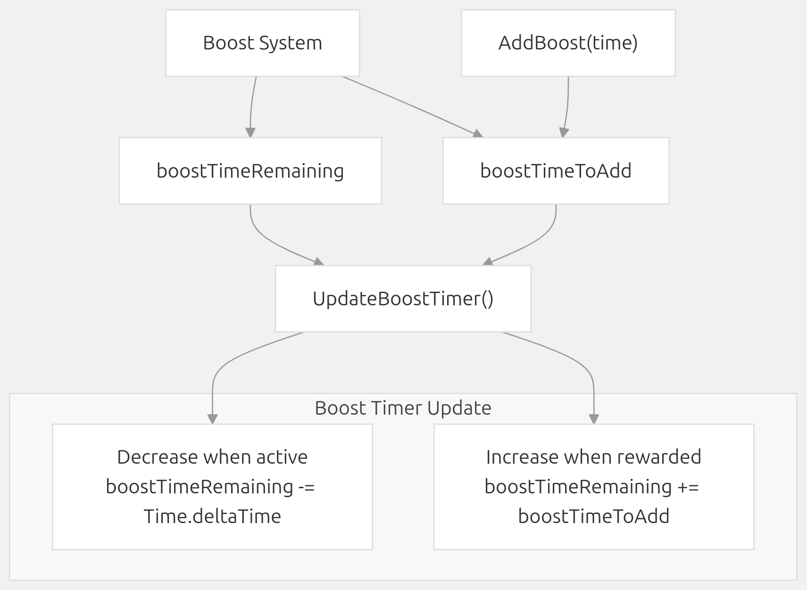
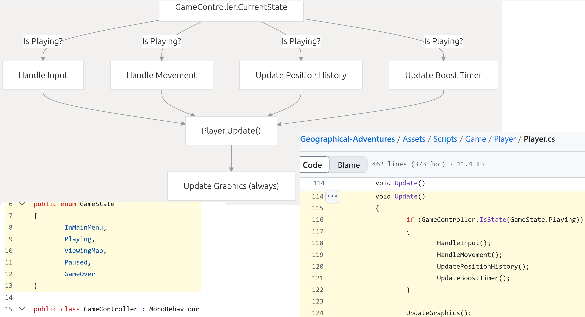

# Player System
Relevant source files
> 1. Assets/Graphics/Aircraft/Materials/Trail.mat
> 2. Assets/Scripts/Game/Misc/GameController.cs
> 3. Assets/Scripts/Game/Player/GameCamera.cs
> 4. Assets/Scripts/Game/Player/PlaneTrails.cs
> 5. Assets/Scripts/Game/Player/PlaneTrails.cs.meta
> 6. Assets/Scripts/Game/Player/Player.cs
> 7. Assets/Scripts/Menu/UIManager.cs
> 8. ProjectSettings/ProjectVersion.txt

# 1.Purpose and Scope

The Player System manages the player-controlled aircraft in Geographical Adventures, handling movement, camera control, visual effects, and package delivery mechanics. This document covers the core components of the Player System, their interactions, and key implementation details.

For information about delivery mechanics and package scoring, see Quest System and Package Delivery Mechanics.

# 2.Core Components
The Player System consists of three primary components that work together to create the player experience:

 

 Sources:
Assets/Scripts/Game/Player/Player.cs
Assets/Scripts/Game/Player/GameCamera.cs
Assets/Scripts/Game/Player/PlaneTrails.cs

# 3.Player Movement System
The player movement system manages the aircraft's position, orientation, speed, and elevation in a spherical or flat world.

## 3.1 Movement Parameters

Key movement parameters are defined in the Player class:
Parameter           | Description | Default Range
--------------------|-------------|--------------
minSpeed / maxSpeed | Base aircraft speed range | 4-12 units
boostSpeed          | Increased speed when boosting | 25 units
turnSpeedInTopDownView / turnSpeedInBehindView | Turning rates based on camera view | View-dependent
minElevation / maxElevation | Altitude limits for the aircraft | Environment-dependent
rollAngle          | Maximum roll angle during turns | Configurable
maxPitchAngle      | Maximum pitch angle             | Configurable

Sources:
Assets/Scripts/Game/Player/Player.cs  14-37

## 3.2 Movement Calculation Flow
The movement system processes inputs and updates the aircraft's position and orientation each frame:

 

Sources:
Assets/Scripts/Game/Player/Player.cs  129-211 : UpdateMovementInput()\HandleInput()\HandleDebugInput()\HandleMovement()

## 3.3 Spherical World Movement
The game supports both spherical and flat world modes, with spherical being the default. In spherical mode, movement calculations must  

Sources:
Assets/Scripts/Game/Player/Player.cs 231-259: void UpdatePosition(float forwardSpeed) \ void UpdateRotation(float turnAmount)

# 4.Boost System
The boost system provides temporary speed increases and is a core gameplay mechanic:
 

The boost system is initialized with boostTimeAtStart seconds of boost time. Boost time can be added through the AddBoost(float time) method, typically as a reward for successful package deliveries.

Sources:
Assets/Scripts/Game/Player/Player.cs25-28
Assets/Scripts/Game/Player/Player.cs73-76
Assets/Scripts/Game/Player/Player.cs213-229
Assets/Scripts/Game/Player/Player.cs374-377

# 5.Camera System

The camera system provides different views of the player aircraft and dynamically adjusts to player actions.

## 5.1Camera View Modes

 
 The GameCamera class supports four view modes:
    * TopDown: Camera positioned above the player, looking down
    * LookingForward: Camera positioned behind, looking ahead
    * LookingBehind: Camera positioned in front, looking back
    * MainMenu: Special view for the main menu

Sources:
Assets/Scripts/Game/Player/GameCamera.cs 8-9

## 5.2 Field of View (FOV) Management
The camera dynamically adjusts its field of view based on player speed:

 

 Sources:
Assets/Scripts/Game/Player/GameCamera.cs  11-14
Assets/Scripts/Game/Player/GameCamera.cs  109-112

# 6.Visual Effects
The Player System includes several visual effects to enhance the flight experience:

## 6.1Plane Trails
The PlaneTrails component manages the trails behind the aircraft, adjusting their opacity based on aircraft speed:

 

 Sources:

Assets/Scripts/Game/Player/PlaneTrails.cs
## 6.2Aircraft Animations

The Player class manages several aircraft animations:

    * Propeller Rotation: Continuous rotation based on propellerSpeed
    * Aileron Movement: Ailerons rotate based on turn input, creating a realistic banking effect
    * Navigation Lights: Automatically activate in dark conditions based on the sun position
 

Sources:
Assets/Scripts/Game/Player/Player.cs 263-295
Assets/Scripts/Game/Player/Player.cs 355-369

# 7.Package Delivery
The Player System includes the ability to drop packages for delivery:

 

 The package delivery functionality interfaces with the Quest System, which handles package pickup and delivery scoring.

Sources:
Assets/Scripts/Game/Player/Player.cs 47-49
Assets/Scripts/Game/Player/Player.cs 379-385

# 8.Position History Tracking
The Player system maintains a history of positions for various game mechanics:

 

 The position history is used for features like displaying the flight path on the map and calculating total distance traveled.

Sources:
Assets/Scripts/Game/Player/Player.cs 87-91
Assets/Scripts/Game/Player/Player.cs 323-341

# 9.Game State Integration
The Player System responds to the game state to ensure appropriate behavior:

 

 The Player only processes input and movement when the game is in the Playing state, but continues to update visuals in all states.

Sources:
Assets/Scripts/Game/Player/Player.cs 114-127
Assets/Scripts/Game/Misc/GameController.cs 6-13

# 10.Initialization
The Player System is initialized when the game starts:

 
 
The player's starting position and orientation are set based on the configured PlayerStartPoint.

Sources:
Assets/Scripts/Game/Player/Player.cs98-112
Assets/Scripts/Game/Player/Player.cs299-321