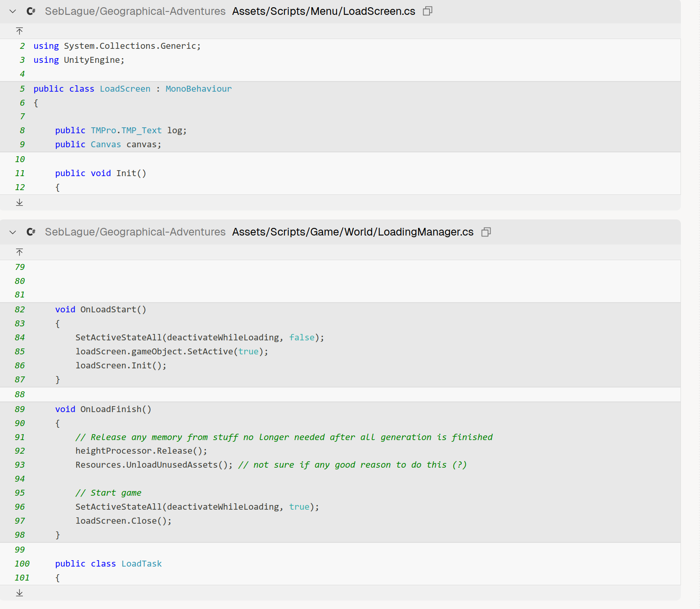

# 1.why the loading screen is not a scene

Looking at your question about why the loading screen is not a scene, I can see you're asking about the `LoadScreen` class in `Assets/Scripts/Menu/LoadScreen.cs` and how it relates to the game's architecture.
 
## Answer

The loading screen is implemented as a UI component rather than a separate Unity scene for architectural efficiency and simplicity. Here's why:

### Implementation as UI Component
The `LoadScreen` is a MonoBehaviour that manages a Canvas UI element [1](#0-0) . It's activated and deactivated programmatically during the loading process rather than being loaded as a separate scene.

### Integration with Loading Process
The `LoadingManager` directly controls the loading screen's lifecycle within the same scene [2](#0-1) . When loading starts, it activates the loading screen UI and initializes it. After all loading tasks complete, it closes the loading screen [3](#0-2) .

### Benefits of This Approach
1. **No Scene Transitions**: Avoids the overhead of loading/unloading scenes, which would add unnecessary complexity and loading time
2. **Synchronous Control**: The loading manager can directly control when to show/hide the loading screen without async scene loading operations
3. **Shared Context**: All game objects and systems remain loaded in memory, allowing the loading process to initialize them directly
4. **Simpler State Management**: No need to manage data persistence between scene transitions

The loading screen serves as a simple overlay that provides visual feedback during the initialization of world systems (terrain, ocean, countries, etc.) rather than being a separate game state that requires its own scene.

## Notes

The loading screen's `Canvas` component can be toggled on/off as needed, making it a lightweight UI solution that doesn't require the complexity of Unity's scene management system for what is essentially a temporary visual indicator.

Wiki pages you might want to explore:
- [Game Architecture (SebLague/Geographical-Adventures)](/wiki/SebLague/Geographical-Adventures#2)