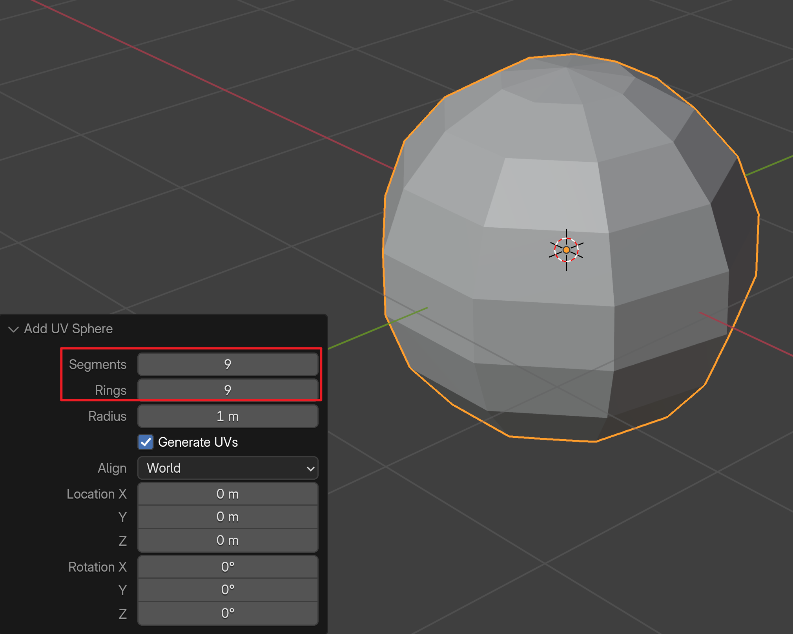
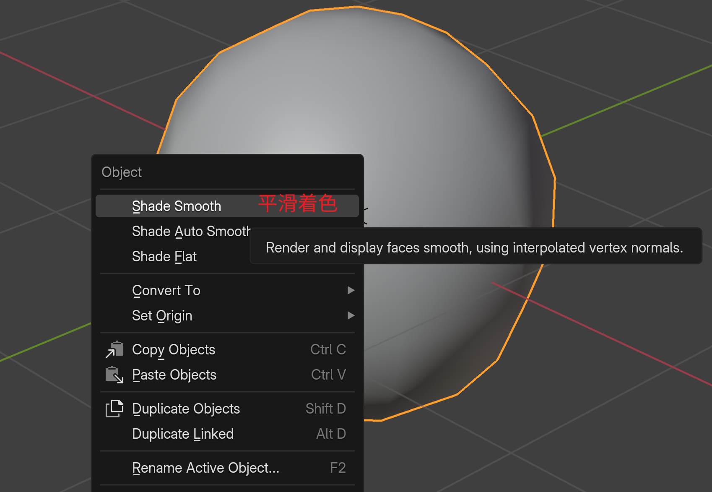
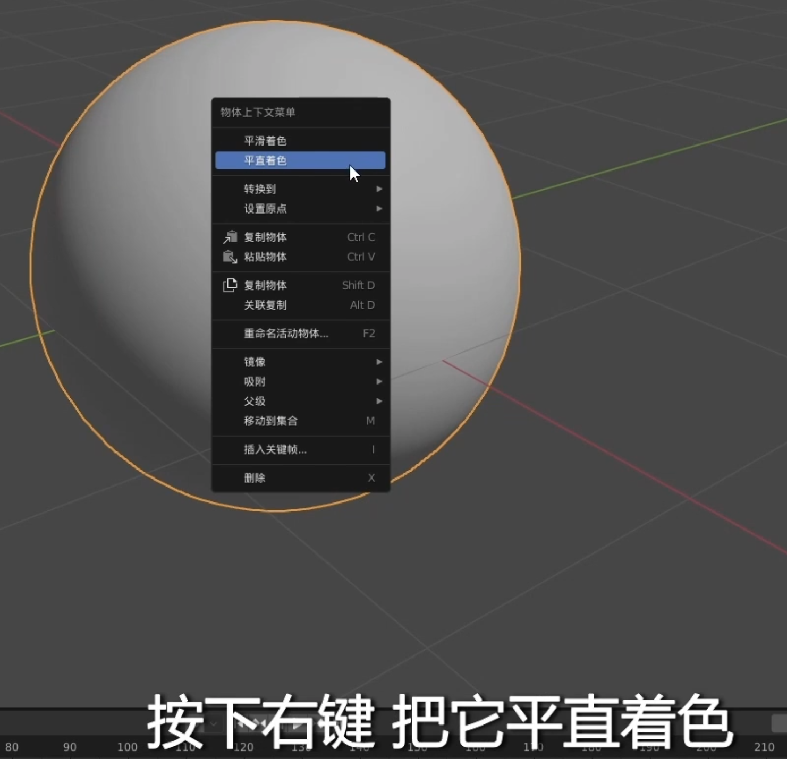

适合中学生的Blender建模入门教程_第一章1教程介绍
2022-07-10 12:13:19
[Blender建模入门教程](https://www.bilibili.com/video/BV19Z4y1Y78e?spm_id_from=333.788.videopod.episodes&vd_source=4212b105520112daf65694a1e5944e23&p=7)
<!-- ----------------------------------------------------------------- -->

<!-- ----------------------------------------------------------------- -->

# 第二章3视图、视角切换

鼠标中键：场景的旋转； 
shift+中键：场景的视角平移 ；
中键的滚轮：场景的缩放；

Esc下的 ~ : 呼唤出 常用视角的操作环, 对应菜单 View -> Viewpoint;  

<!-- ----------------------------------------------------------------- -->
# 第二章4视图菜单

## blender 的 home键
在 Blender 中，Home 键（位于方向键上方）是一个非常实用的导航快捷键，它的核心功能是 “查看全部”（Frame All）。
根据你当前所处的窗口模式，它的行为略有不同：
1. 在 3D 视图（3D Viewport）中
功能：缩放视图以显示场景中所有的物体。
应用场景：如果你不小心把视角缩放得太远或者找不着北了，按一下 Home 键，Blender 会立即自动调整视角，让场景里所有的模型（包括灯光和摄像机）都呈现在屏幕正中间。
对比：Numpad .（小键盘点键）是只聚焦选中的物体，而 Home 是聚焦所有物体。
2. 在 节点编辑器（Node Editor / Geometry Nodes）中
功能：显示所有节点。
应用场景：当你的节点树非常庞大且杂乱，或者你迷失在空白区域时，按 Home 键可以一键找回所有节点，让它们填满编辑窗口。
3. 在 时间轴 / 动画编辑器（Timeline / Graph Editor）中
功能：显示所有关键帧。
应用场景：它会将时间轴的范围自动拉伸/压缩，以便你一眼看到从第一帧到最后一帧的所有关键帧分布。
4. 在 UV 编辑器中
功能：显示完整的 UV 展开图。

## 局部视图 
 快捷键: /

<!-- ----------------------------------------------------------------- -->
# 第二章5添加物体

删除物体的快捷键：选中物体后，按 Delete 键。或 X 键。

添加物体的快捷键：shift + a
菜单：添加 > 网格 > 选择物体类型（如立方体、球体等）

