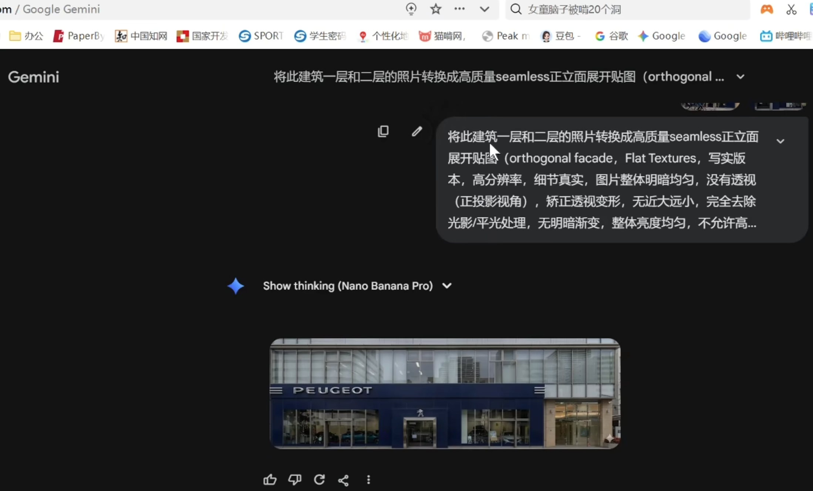
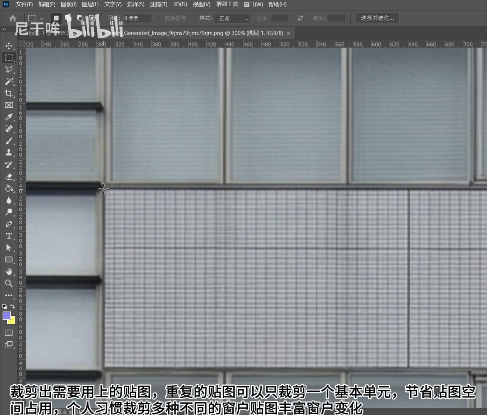
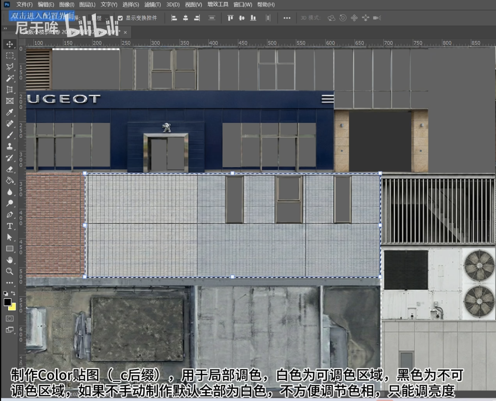
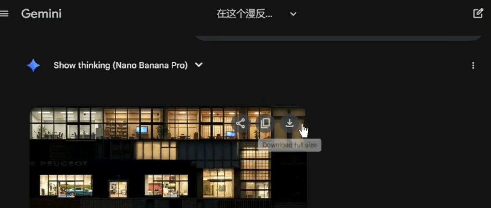
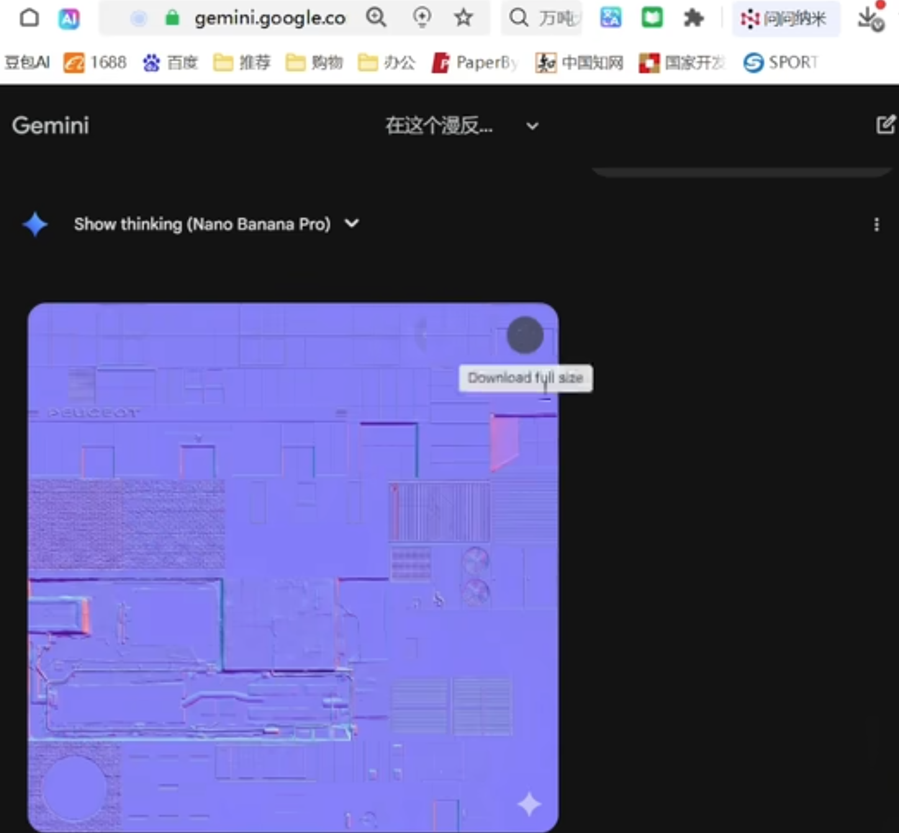

# 借助AI，5小时快速从零到写实级天际线资产
2026-02-01 18:12:34
https://www.bilibili.com/video/BV1SJ64BRErN/?spm_id_from=333.788.recommend_more_video.3&trackid=web_related_0.router-related-2479604-d9wfs.1777182065843.563&vd_source=4212b105520112daf65694a1e5944e23

制作天际线一代资产全过程 （借助AI 5小时快速从零到写实级资产）
视频里穿插了一些知识要点，干货满满！（视频较长，无配音配乐，建议倍速观看）
用到的软件：PS , 3ds Max , Blender
基本流程：选择原型建筑→制作漫反射贴图→建模和展UV贴图→制作其他贴图→烘焙LOD→导入资产编辑器和导出资产→上传工坊

## 评论1-- Gls材质
说实话看完全程真心佩服，我是做二代的，二代很多建筑立面的玻璃直接用Gls材质，对贴图的需求没有这么强烈。原本以为作者是打算直接提取earth建模，没想到居然这样制作每个立面，磕一个[点赞]
gAI：
从你提到的《都市：天际线 2》（Cities: Skylines II）开发背景来看，这里的 **Gls** 并不是一个通用的工业标准缩写，而是该游戏引擎架构（基于 Unity 的高性能渲染管线）中一种**专门针对玻璃和透明材质的着色器（Shader）或材质命名习惯**。

在游戏建模和渲染中，Gls 材质通常具备以下几个核心逻辑：

### 1. 基于物理的透明度（PBR Transparency）
传统的贴图方式可能需要为每个建筑立面绘制精细的反射、折射和污垢贴图。而 Gls 材质通常是一种**过程化/参数化**的材质。
* **逻辑**：它不需要开发者为每一栋楼画玻璃，而是通过程序算法实时计算玻璃的反射（CubeMap）、折射（Refraction）和高光。
* **优势**：极大地节省了显存，因为成千上万个窗户可以共用同一个着色器，只需调整几个参数（如颜色、反射强度、粗糙度）就能产生完全不同的视觉效果。

### 2. 内部映射技术（Interior Mapping）
这是天际线系列或现代开放世界游戏（如《蜘蛛侠》）常用的“黑科技”。
* **原理**：虽然建筑外表只是一个平面的玻璃层，但 Gls 材质内部包含了一个**假 3D 空间**的算法。
* **视觉**：当你从外面看玻璃时，能看到屋子里的家具、灯光和深度感，但这其实并不是真实的 3D 建模，而是着色器计算出来的视觉错觉。这正是你提到的“对贴图需求没那么强烈”的原因——它不需要一张张画室内的贴图，而是自动生成的。

### 3. 多层混合（Multi-Layering）
一个成熟的 Gls 材质往往包含多层信息：
* **基础层**：玻璃的基色和透明度。
* **反射层**：根据环境光贴图（Environment Map）计算出的城市倒影。
* **遮罩层（Dirt/Damage Mask）**：用少量的噪点图来模拟玻璃上的灰尘或雨滴划痕。
============================================================================== 
# 1.楼的外观的纹理图集制作 00:00:00~~00:50:57， 

选择有Google数据的地区的建筑制作资产会方便很多，因为可以获取建筑多角度和不同时期的外观照片，还能直接测量建筑长宽高，这里选择的是目本大阪的一栋普通小楼’


楼的外观的纹理图集: 用google AI修改图片 ，用ps制作图集。

## 1.1google AI 修正 建筑立面图片的 提示词


```txt
1.某部件三视图：生成这XXx的高质量seamless正立面，侧立面，顶面三视图漫反射贴图，FlatTextures，写实版本，高分辨率，细节真实
（真实高清纹理，避免扫描模型的模糊感），没有透视（正投影视角），阴天环境效果，背景为纯白色方便抠图，用于建模模型的材质贴图

2.建筑标准层立面：T将此建筑的照片转换成高质量seamless正立面展开贴图（orthogonalfacade，FlatTextures，写实版本，高分辨率，细
节真实，图片整体明暗均匀，没有透视（正投影视角），矫正透视变形，无近大远小，完全去除光影/平光处理，无明暗渐变，整体亮度均匀
不允许高楼层亮而接近地面楼层低暗的图片亮度不均问题，阴天效果，高清锐化，纹理细节清晰，边缘锐利，无模糊发虚，贴合建筑真实材质不
要玻璃反射效果，尽量呈现玻璃窗的漫反射效果，不要反射到其他建筑物和天空，细节构造的比例要与原建筑一致，没有前景（包括行人，绿
植，灯杆等等一切不是建筑的物体）遮挡，用于建筑建模的材质绘制，生成好的建筑轮廓与画布边缘平行；为了保证分辨率清晰，只生成5层采
样，保证百叶窗或窗帘开闭多样性，阴天环境效果，日本建筑风格

3.建筑一层、多层：将此建筑的照片转换成高质量seamless正立面展开贴图（orthogonalfacade，FlatTextures，写实版本，高分辨率，细节
真实，图片整体明暗均匀，没有透视（正投影视角），矫正透视变形，无近大远小，完全去除光影/平光处理，无明暗渐变，整体亮度均匀，不
允许高楼层亮而接近地面楼层低暗的图片亮度不均问题，阴天效果，高清锐化，纹理细节清晰，边缘锐利，无模糊发虚，贴合建筑真实材质不要
玻璃反射效果，不要玻璃反射效果，尽量皇现玻璃窗的漫反射效果，保留室内场景细节和丰富性，不要反射到其他建筑物，细节构造的比例要与
原建筑一致，没有前景（包括行人，绿植，灯杆，外摆货架、地铁站出入口，人行大桥、雕塑等等一切不是建筑的物体）遮挡，用于建筑建模的
材质绘制，生成好的建筑轮廓与画布边缘平行，阴天环境效果，日本现代建筑风格

建筑一层、多层：将此建筑的照片转换成高质量seamless正立面展开贴图（orthogonalfacade，FlatTextures，写实版本，高分辨率，细节
真实，图片整体明暗均匀，没有透视（正投影视角），矫正透视变形，无近大远小，完全去除光影/平光处理，无明暗渐变，整体亮度均匀，不允许高楼层亮而接近地面
楼层低暗的图片亮度不均问题，阴天效果，高清锐化，纹理细节清晰，边缘锐利，无模糊发虚，贴合建筑真实材质不要玻璃反射效果，尽量呈现玻璃窗的漫反射效果，不要反射到其他建筑物和
天空，细节构造的比例要与原建筑一致，没有前景（包括行人，绿植，灯杆等等一切不是建筑的物体）遮挡，用于建筑建模的材质绘制，生成好的建筑轮廓与画布边缘平行；为了保证分辨率清
断，只生成5层采样，保证百叶窗或窗帘开闭多样性，阴天环境效果，日本建筑风格，去掉内部的灯光


4.夜景贴图：在这个漫反射贴图的门窗幕墙处生成对应的夜景贴图用以制作模型夜景贴图，其他部分为纯黑色，日本风格

5.某部件单面贴图：生成这建筑构件的高质量seamless正立面漫反射贴图，FlatTextures，写实版本，高分辨率，细节真实（真实高清纹理）
避免扫描模型的模糊感），没有透视（正投影视角），阴大环境效果，背景为纯白色方便抠图，用于建模模型的材质贴图

生成这个建筑表面的漫反射纹理，要求写实版本，高分辨率，细节真实，矫正透视变形，正面平视视角，无近大远小，完全去除光影/平光处
理，无明暗渐变，整体亮度均匀，阴天效果，高清锐化，纹理细节清晰，边缘锐利，无模糊发虚，贴合建筑真实材质，背景为纯白色方便抠图，
尽量保证原图所有细节！！！最好还能把玻璃反光也处理掉

6.屋顶平面：生成这个建筑屋顶的高质量seamless平面图漫反射贴图，FlatTextures，写实版本，高分辨率，细节真实（真实高清纹理，避免
扫描模型的模糊感），没有透视（正投影视角），阴天环境效果，建筑平面布局比例和图片一致，背景为纯白色方便抠图，不要设备只保留管
线，用于建模模型的材质贴图，日本建筑风格
```

### 重复的贴图可以只裁剪一个基本单元，节省贴图空间
裁剪出需要用上的贴图，重复的贴图可以只裁剪一个基本单元，节省贴图空间占用，个人习惯裁剪多种不同的窗户贴图丰富窗户变化



# 2.楼的建模制作 00:50:57~~04:03:07
用3d Max.


制作Color贴图(c后缀)，用于局部调色，白色为可调色区域，黑色为不可调色区域，如果不手动制作默认全部为白色，不方便调节色相，只能调亮度



4.夜景贴图:在这个漫反射贴图的门窗幕墙处生成对应的夜景贴图用以制作模型夜景贴图，保证室内场景细节和丰富性。其他部分为纯黑色，日本风格

在这个漫反射贴图的门窗幕墙处生成对应的夜景贴图用以制作模型夜景贴图，保证窗帘或百叶窗闭合多样性以及室内场景细节和丰富性，其他部分为纯黑色，日本风格

根据漫反射贴图生成对应的法线贴图 ：



# 4.blender 04:03:07~~end
