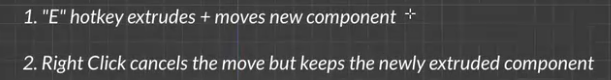
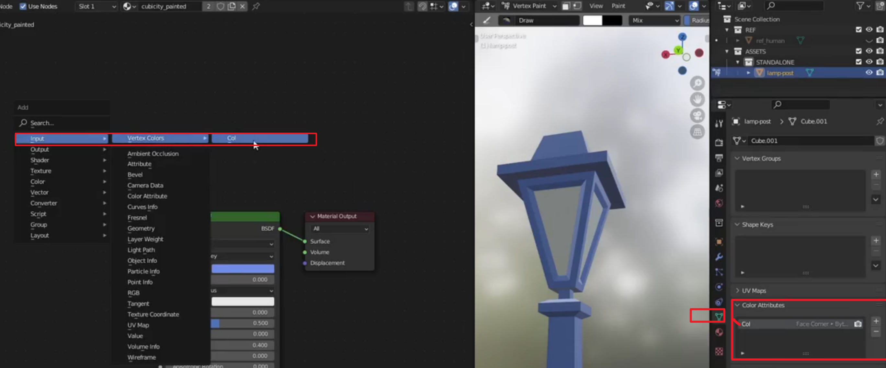
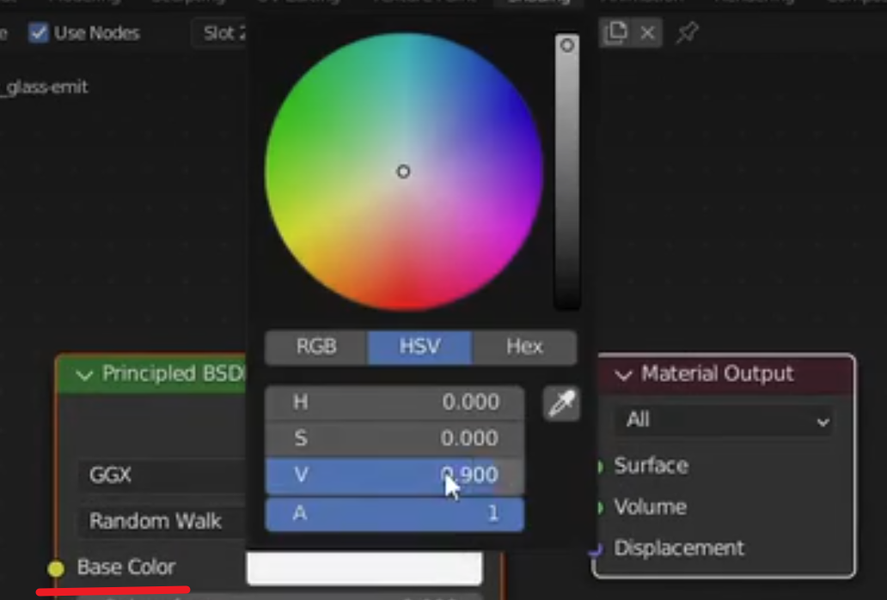
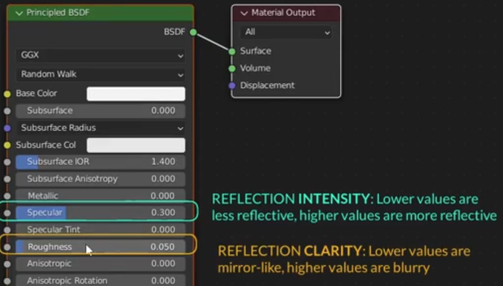

Blender低多边形城市动画教程\
2024-07-03 01:03:32
https://www.bilibili.com/video/BV1Eb421n7BU?spm_id_from=333.788.player.switch&vd_source=4212b105520112daf65694a1e5944e23&p=2


# cubicity_C0T2_trailer 03:17

# cubicity_C1L01_lamp-post-modeling
11:40

----

## x.01 编辑模式下，cube的顶面 i 后紧跟g z ，生成 以cube的顶面为底的棱台；但是cube的顶面 i 后 右键一下，再g 、z，就生成以cube的顶面 为底的 柱体

```
blender中，编辑模式下，cube的顶面 i 后紧跟g z ，就可以生成 以cube的顶面为底的棱台；但是cube的顶面 i 后, **右键**，再g 、z，生成以cube的顶面 为底的 柱体
```
这就是 **Blender 建模逻辑**中一个非常经典且重要的细节。你观察得很敏锐，这涉及到 **“取消操作”与“残留几何体”** 的关系。

简单来说，这是因为 `I`（内插面/Inset）在执行时，实际上包含了两个阶段：**生成新面** 和 **调整大小**。
 

### 1. 为什么“右键一下”会变成柱体？

在 Blender 中，当你按下快捷键并看到数值变化时，工具已经激活。**右键点击**的操作并不是“撤销”整个工具，而是 **“取消数值上的位移/缩放，但保留生成的几何体”**。

#### 情况 A：直接 `I` + `G` `Z`（棱台）
1.  按下 `I`：Blender 生成了一圈新的侧边面。
2.  移动鼠标：你在缩放顶面的大小。
3.  左键确认：顶面缩小。
4.  `G` `Z`：向上移动这个**已经缩小**的面。
    * **结果：** 底部大、顶部小，形成**棱台**。

#### 情况 B：`I` + 右键 + `G` `Z`（柱体）
1.  按下 `I`：Blender 瞬间生成了新的几何结构（虽然重合了）。
2.  **右键点击：** 你取消了“缩放”动作，顶面的大小回到了原始尺寸，但**刚才生成的那些重合的侧面并没有消失**。
3.  `G` `Z`：你向上移动了那个和原尺寸一样大的面。
    * **结果：** 侧面垂直向上延伸，形成**柱体**。
 
### 2. 核心逻辑：重叠的顶点（Duplicate Vertices）
在第二种情况下，你的模型在 `G` 之前，其实在同一个位置有两组重叠的边和点。
* 一组属于原 Cube 的侧面顶部。
* 一组属于新生成的 Inset 面的外边缘。

当你 `G` `Z` 拉起来时，你拉动的是新生成的面，而它的边缘原本是重叠在底座边缘上的，所以拉出来就是垂直的。

> **提示：** 这种情况如果处理不当，容易产生“重叠面”（Z-fighting），建议在建模时养成习惯：如果右键取消了某个挤出（Extrude）或内插（Inset）操作，最好紧接着按 `Ctrl + Z` 彻底撤销，或者 `M` > **Merge by Distance** 清理掉重合点。
 

### 3. 进阶：这其实就是手动“挤出” (Extrude)
你发现的“右键 + `G` `Z`”的操作，其实在逻辑上等同于：
1.  按下 `E` (Extrude)。
2.  右键取消位移（面已生成但重合）。
3.  `G` `Z` 拉起。

这种技巧在需要**精确控制移动距离**时非常有用，因为 `E` 自带的移动有时不容易通过坐标轴锁定，而先右键确认生成、再用 `G` 移动则更加可控。

----

##  x.02  ALT+S 

ALT+S 快捷键的正式名称是 Shrink/Fatten（沿法线缩放）。

##  x.03 面编辑模式下，选择立方体的四个侧面，i，为何每个侧面内差，相邻侧面的内差没有合并在一起

这涉及到 Blender `Inset`（内插）工具的一个默认逻辑：**它是将“选中的整体”视为一个区域，还是将“每个面”视为独立的个体。**

你遇到的情况是因为 **`Individual`（各自内插）** 开关的状态决定的。

### 1. 核心原因：Individual 模式
当你选中四个侧面并按下 `I` 时：
* **如果 `Individual` 关闭（默认）：** Blender 会尝试把这四个面看作一个连续的“带状区域”。但在立方体这种有 90° 转角的情况下，由于它们不处于同一平面，边缘的内插往往会因为几何计算而显得像是“连在一起但又没完全合并”。
* **如果 `Individual` 开启：** 每个面会无视邻居，各自向中心缩进，导致相邻面之间产生缝隙（即你看到的“没有合并在一起”）。

### 2. 如何切换？
在你按下 `I` 激活工具后：
* **快捷键：** 再次按下 **`I`** 键。你会发现顶部的状态栏（或鼠标旁）的 `Individual: Off/On` 在切换。
* **左下角面板：** 在执行完内插后，点击左下角的 **"Inset Faces"** 展开面板，勾选或取消勾选 **"Individual"** 选项。
 

### 3. 深度解析：为什么“不合并”？

即便你关闭了 `Individual`，有时候你仍会觉得相邻侧面的内插看起来“怪怪的”，这通常是因为：

* **共用边的处理：** 如果你关闭了 Individual，内插会沿着这四个面组成的“环”进行。如果你希望相邻面的内插边缘完全融合（即形成一个连续的、等宽的框），你需要确保你的内插深度（Thickness）不要过大，且没有勾选其他干扰项。
* **外轨内插 (Outset)：** 如果你按住 `Ctrl` 再拖动 `I`，会变成外扩，这会让几何结构更加复杂。
* **边界 (Boundary)：** 如果你的面没有形成闭环（比如你只选了三个侧面），**`B` (Boundary)** 键会决定开口处的边缘是否也参与内插。
 
**操作建议：**
下次你选完四个侧面按 `I` 之后，观察一下那条连接处的线。如果你希望它们像一个整体一样向内缩进，请确保按下 `I` 之后，**没有**第二次按 `I`（即保持 `Individual` 为关闭状态）。

你现在是在给 300㎡ 场景里的建筑结构开窗户，还是在给工业零件模型添加表面的细节槽位？

----

## x.04 e--right-click


---- 

## x.05  编辑模式下，cube的顶面 s 如何只缩放顶面

在 Blender 的编辑模式下，当你选中 Cube 的顶面并按下 **`S`** 时，默认情况下**只会缩放你选中的那个面**。

如果你发现缩放顶面时，底部的顶点也跟着动了，或者整个立方体都在变形，通常是因为你开启了 **Proportional Editing（比例编辑/衰减编辑）**。

### 1. 核心原因：比例编辑 (Proportional Editing)
这是新手最常遇到的“意外”。比例编辑的作用是让你在移动或缩放选定元素时，带动周围未选中的顶点一起变形。

* **快捷键：** 按下 **`O`** 键可以开启或关闭它。
* **视觉标志：** 开启后，视图顶部中间会出现一个蓝色的圆形图标。
* **操作表现：** 当你按下 `S` 缩放时，屏幕上会出现一个灰色的圆圈。圆圈范围内的所有东西都会跟着缩放。如果圆圈大到包裹了整个立方体，底部就会跟着动。
 

### 2. 正确的操作步骤
如果你只想缩放顶面，保持侧面垂直或斜向改变：
1.  确保关闭比例编辑（按 **`O`**，直到顶部图标变灰）。
2.  按下 **`3`**（大键盘横排数字）进入**面选择模式**。
3.  点击选中顶面。
4.  按下 **`S`**，移动鼠标。
    * 此时，只有顶部的四个顶点会向中心汇聚，底部的四个顶点保持不动，侧面会随之倾斜，形成一个**倒棱台**。
 

### 3. 进阶：限制轴向缩放
有时候你可能不想整体缩放，而是只想改变顶面的“宽度”或“长度”：
* **`S` + `X`**：只在 X 轴方向拉宽/缩窄顶面。
* **`S` + `Y`**：只在 Y 轴方向拉宽/缩窄顶面。
* **`S` + `Shift + Z`**：在 XY 平面上缩放，保持 Z 轴（高度）完全不受影响（虽然顶面通常是平的，但在处理复杂斜面时很有用）。
 

### 4. 为什么你会觉得“不是只缩放顶面”？
如果关闭了比例编辑，你依然觉得缩放效果不理想，可能是因为：
* **坐标系问题：** 如果你的立方体旋转过，默认的 **Global（全局）** 坐标轴可能不再对齐面的方向。尝试在顶部切换到 **Local（局部）** 坐标系。
* **物体模式下的缩放残留：** 如果你在“物体模式”下缩放过立方体但没有 `Ctrl + A` 应用缩放（Apply Scale），在编辑模式下的操作可能会出现比例失真的情况。

**总结建议：**
检查一下屏幕上方有没有那个蓝色的“小圆圈”图标，按一下 `O` 把它关掉，你的 `S` 就只会作用于选中的顶面了。


 

# cubicity_C1L02_lamp-post-material
12:54

## x.01 cubicity_mat_painted




## x.01 cubicity_mat_glass-emit





## x.03Node Wrangler插件

既然你已经聊到了 **Shader Slot** 和材质逻辑，那 **Node Wrangler** 绝对是你在 Blender 中必须开启的“头号插件”。它不是外部安装的，是 Blender **自带**的，但默认关闭。

它是专门为加速节点操作而生的工具集。对于你处理 **300㎡ 工业场景纹理**这种需要大量连接贴图的工作，没有它简直是“折磨”。
 

### x.03.1. 如何开启
> 1. 打开 **Edit > Preferences** (偏好设置)。
> 2. 选择 **Add-ons** (插件)。
> 3. 搜索 `Node Wrangler`，勾选它。
 

### x.03.2. 三个“神级”快捷键 (你最需要的)

作为开发者和建模者，这三个操作能节省你 80% 的连线时间：

#### A. 一键导入全套 PBR 贴图 (`Ctrl + Shift + T`)
这是最强大的功能。当你选中 **Principled BSDF** 节点并按下此快捷键：
* 你可以选择文件夹里的 `Color`、`Roughness`、`Normal`、`Metallic` 等一堆图。
* Node Wrangler 会**自动识别文件名**，创建所有 Image Texture 节点，连好所有线，并加上 **Mapping** 和 **Texture Coordinate** 节点。
  
#### B. 快速预览节点 (`Ctrl + Shift + 左键点击`)
在复杂的节点树中，你想看看某张贴图或某个数学节点输出的结果是什么样的：
* 点击任意节点，它会自动连接到一个临时的 **Viewer 节点**。
* **结果：** 3D 视图会立刻只显示这个节点的输出。再次点击切换回原来的着色器。

#### C. 快速替换/连接 (`Alt + 右键拖拽`)
* **懒人连线：** 在两个节点之间按住 `Alt` 并用右键画一条线，它会自动帮你把合适的槽位连上。
* **快速切换：** 如果你想把 A 节点的输出换成 B 节点的输出，直接拖动。
 
### x.03.3. 其他高效操作

| 快捷键 | 功能说明 |
| :--- | :--- |
| **`Shift + S`** | **切换节点类型**。比如把一个“相加”节点快速换成“相乘”，不用删掉重连。 |
| **`Ctrl + X`** | **删除并重新连接**。删除中间节点，但保持前后节点的连线不中断（普通 Delete 会断线）。 |
| **`Alt + S`** | **循环切换槽位**。如果一个节点有多个输出，按这个可以快速切换。 |
| **`Slash (/)`** | **框架包裹**。把选中的一堆节点装进一个框里，并写上备注（比如“地面纹理组”）。 |
  

**一个小技巧：**
如果你在 `Ctrl + Shift + T` 时识别不出贴图，请检查文件名。它默认寻找包含 `color`, `diffuse`, `rough`, `nor`, `disp` 等关键字的文件。

你现在是在手动调试某个特定复杂模型的材质节点，还是打算写脚本批量生成这些节点逻辑？


cubicity_C1L03_bench
12:22
cubicity_C1L04_tree
29:09
cubicity_C1L05_roof-access
18:59
cubicity_C1L06_skylight
08:57
cubicity_C1L07_water-tower
15:44
cubicity_C2L01_hvac-unit
23:09
cubicity_C2L02_marquee-sign
21:11
cubicity_C2L03_city-template
08:06
cubicity_C2L04_street-section
29:33
cubicity_C2L05_street-intersection
18:31
cubicity_C2L06_vehicles
24:46
cubicity_C2L07_stop-light
22:11
cubicity_C3L01_simple-skyscraper
32:46
cubicity_C3L02_edge-highlighting
26:09
cubicity_C3L03_corner-building
30:57
cubicity_C3L04_corner-building-materials
19:54
cubicity_C3L05_parametric-building-overview
06:35
cubicity_C3L06_parametric-building-node-setup
11:26
cubicity_C3L07_parametric-building-gradient
13:46
cubicity_C3L08_parametric-building-balconies
24:49
cubicity_C3L09_auto-randomization
21:27
cubicity_C3L10_night-time-setup
23:08
cubicity_C4L01_asset-library-linking-overview
02:27
cubicity_C4L02_converting-to-assets
24:01
cubicity_C4L03_asset-browser-loose-ends
16:11
cubicity_C4L04_assembling-streets-buildings
25:18
cubicity_C4L05_adding-standalone-assets
24:35
cubicity_C4L06_lighting-rendering-post
17:37
cubicity_C4L07_night-time-version
19:32