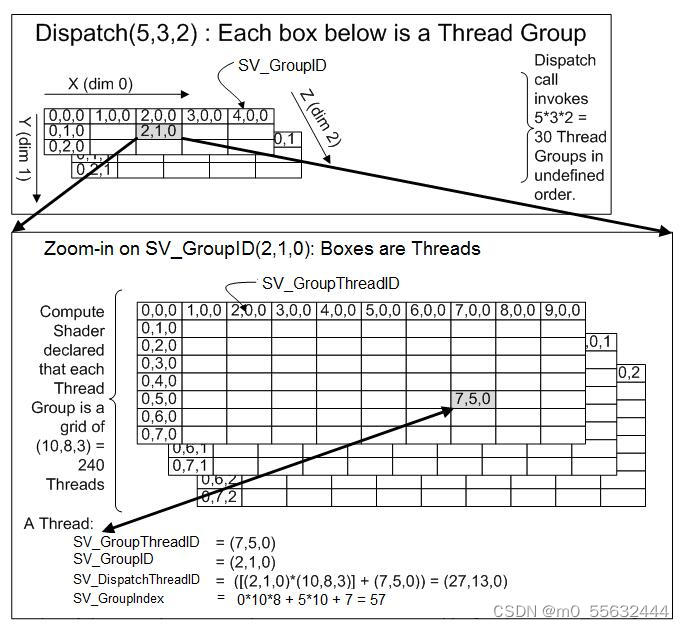

# 1.ComputeShader入门精要
 
[大俊哥][已于 2024-05-20 12:15:01 修改] 
 
本文链接：[https://blog.csdn.net/m0_55632444/article/details/139059276](https://blog.csdn.net/m0_55632444/article/details/139059276) 
## 0.前言

随着[人工智能]技术的迅速普及和发展，对[并行]计算的需求也日益增长。在 游戏开发和图形处理领域，尤其是在 Unity这样的全球领先的游戏开发平台中，计算着色器（Compute Shader）已成为实现高效并行计算的首选工具。计算着色器不仅能够处理大量数据，还能显著提高渲染效率和性能，是现代图形编程中不可或缺的一环。

### 0.1.计算着色器概述

计算着色器是一种在 GPU上执行数据并行处理的程序，它不依赖于渲染管线的传统流程。与顶点着色器和片元着色器等主要处理图形的着色器不同，计算着色器被设计用来进行通用计算任务，如物理模拟、[AI]计算、图像处理等。

Unity中的计算着色器可以直接访问缓冲区（Buffer）和纹理（Texture），并通过它们来进行复杂的数据处理。这使得开发者能够利用GPU 的并行处理能力，执行大规模的数值计算任务。

### 0.2.计算着色器的应用场景

-   物理模拟：如粒子系统、流体动力学和软体动力学等。
-   AI 计算：在游戏和实时应用中，通过 GPU 加速复杂的 AI
    算法，多维数组的运算。
-   图像处理：应用如图像模糊、锐化、噪声生成和图像效果的实时调整。

## 1.入门实例：基础计算着色器

#### (1)步骤 1：创建计算着色器文件

在 Unity 中，首先需要创建一个 .compute 文件。你可以在项目的 Assets目录下右键点击，选择 \"Create -\> Shader -\> Compute
Shader\"，并给文件命名。

#### (2)步骤 2：编写计算着色器代码

打开你创建的 .compute 文件，并输入以下代码：

```C#
#pragma kernel CSMain
RWStructuredBuffer<float> Result; // 可读写的浮点数缓冲区
[numthreads(5, 3, 2)]
void CSMain(uint3 id : SV_DispatchThreadID) 
{
    Result[0] = 1.0; // 简单地将第一个元素设置为 1.0
}
```

这是一个简单的计算着色器示例，其中#pragma kernel CSMain是一种特殊的编译指令，简单来说通过C#可以通过kernel来调用对应的计算方法，上文中的#pragma kernel CSMain 对应的就是CSMain方法，一个 Compute Shader 文件中可以包含多个 kernel 函数。

RWStructuredBuffer Result;是一个可读写的浮点数缓冲区,可以理解成一个float[]浮点型数组。

[numthreads(5, 3, 2)]，numthreads 定义了一个三维的线程结构；



如果我们在程序的Dispatch接口发送了（5，3，2）这样的结构，就会生成5x3x2个线程组，其中每个组的线程结构由ComputeShader中的numthreads定义，图中numthreads定义了10x8x3的三维结构，由此，我们可以分析4个HLSL关键词的定义。

> SV_GroupThreadID 表示该线程在该组内的位置；
> SV_GroupID 表示整个组所分配的位置；
> SV_DispatchThreadID 表示该线程在所有组的线程中的位置；
> SV_GroupIndex 表示该线程在该组内的索引；

通过这些关键词，我们可以在 **并行计算** 时获取其他线程的输入数据。

#### (3)步骤 3：在 Unity 脚本中调用计算着色器

创建一个 C# 脚本来调用这个计算着色器，并将其结果输出到控制台。

```C#
using UnityEngine;
 
public class ComputeTest : MonoBehaviour 
{
    public ComputeShader computeShader;
 
    void Start() 
    {
        // 找到 Compute Shader 中定义的 Kernel
        int kernelHandle = computeShader.FindKernel("CSMain");
 
        // 创建一个 ComputeBuffer 来存储结果
        ComputeBuffer resultBuffer = new ComputeBuffer(1, 
                  sizeof(float), ComputeBufferType.Default);
 
        // 将 ComputeBuffer 绑定到 Compute Shader 的对应变量上
        computeShader.SetBuffer(kernelHandle, "Result", resultBuffer);
 
        // 调用或执行 Compute Shader
        computeShader.Dispatch(kernelHandle, 1, 1, 1);
 
        // 创建一个数组来接收计算结果
        float[] result = new float[1];
 
        // 从 GPU 检索计算结果
        resultBuffer.GetData(result);
 
        // 输出结果到控制台
        Debug.Log("Compute Shader result: " + result[0]);
 
        // 释放 ComputeBuffer 资源
        resultBuffer.Release();
    }
}
```

> 1.Compute Shader 定位：使用 FindKernel 方法根据 Kernel的名称获取其索引。
> 
> 2.创建ComputeBuffer：computebuffer是用于CPU和GPU传递数据的通道，定义一个新的ComputeBuffer，大小为 1，存储类型为 float，用于从 Compute Shader接收计算结果。
> 
> 3.绑定 ComputeBuffer：通过 SetBuffer 方法将创建的 ComputeBuffer 绑定到Compute Shader 中定义的 Result 变量。
> 
> 4.执行 Compute Shader：通过 Dispatch 方法执行 Compute Shader。参数 (1,1, 1)指定执行一组线程，其中每组包含一个线程（总共一个线程），因为我们的任务是非常简单的。
> 
> 5.检索结果：使用 GetData 方法从 ComputeBuffer 中读取计算结果。
> 
> 6.资源释放：完成数据检索后，通过调用 Release 方法释放 ComputeBuffer的资源，这是非常重要的步骤，以避免内存泄露。

通过这种方式，你可以在 Unity 中利用 GPU的计算能力来执行并行计算任务，并将结果回传到 CPU进行进一步处理或显示。这段代码提供了一个基本的框架，你可以根据具体需求调整计算逻辑或数据处理方式。

 

## 2.数据结构（常用）

#### (1).纹理（Textures）
在 Compute Shader中，纹理不仅仅用于存储图像，它们也可以用来存储任何需要的数据。纹理可以是一维的、二维的、三维的，甚至是立方图。使用纹理的好处在于它们是经过优化的，可以快速读取和写入，并且支持各种硬件加速的过滤操作。

```C#
computeshader：
Texture2D<float4> inputTexture; //四通道纹理（rgba）
Texture2D<float2> inputTexture;//二通道纹理
 
C#：
shader.SetTexture(kernel, "inputTexture", texture);
```

#### (2).缓冲区（Buffers）

Compute Buffers 用于存储大量数据，从简单类型到复杂的自定义结构体。

```C#
computeshader:
RWStructuredBuffer<float> outputBuffer;  // 可读写的结构化缓冲区 
StructuredBuffer<float> outputBuffer; //不可读的结构化缓冲区 
 
C#
 buffer = new ComputeBuffer(1, sizeof(float));   
 float[] values = newfloat[1] {0f};   
 buffer.SetData(values);
 
 shader.SetBuffer(kernel, "outputBuffer", buffer);
 
//RWStructuredBuffer可以通过buffer.GetData获取数据
 buffer.GetData(values);
```

#### (3). 普通数据类型

```C#
computeshader
float float_1 = 1.0;
float2 float_2 = float2(1.0, 1.0);
float3 float_3 = float3(1.0, 1.0, 1.0);
float4 float_4 = float4(1.0, 1.0, 1.0, 1.0);
 
int int_1 = 1;
int2 int_2 = int2(1, 1);
int3 int_3 = int3(1, 1, 1);
int4 int_4 = int4(1, 1, 1, 1);
 
C#
int kernelHandle = shader.FindKernel("CSMain");    
// 设置单个 float 和 int    
shader.SetFloat("float_1", 1.0f);   
shader.SetInt("int_1", 1);   
 // 设置 floats 类型的数据    
shader.SetFloats("float_2", newfloat[] {1.0f, 1.0f}); 
shader.SetFloats("float_3", newfloat[] {1.0f, 1.0f, 1.0f}); 
shader.SetFloats("float_4", newfloat[] {1.0f, 1.0f, 1.0f, 1.0f}); 
    
// 设置整型向量，使用 SetVector 转换成 Vector4 后传递，但这里需要将整型转换为float    
shader.SetInts("int_2", newint[] {1, 1});
shader.SetInts("int_3", newint[] {1, 1, 1});
shader.SetInts("int_4", newint[] {1, 1, 1, 1});
```

## 3.ComputeBuffer

#### (1)创建ComputeBuffer：

在Unity中创建ComputeBuffer时，需要指定其存储的数据类型的大小和数量。

```C#
ComputeBuffer buffer = new ComputeBuffer(count, sizeof(int),
                ComputeBufferType.Default); 
```

#### (2)绑定ComputeBuffer到Compute Shader：

将ComputeBuffer传递给Compute Shader之前，需要通过Compute Shader的SetBuffer方法将其绑定。

```C#
computeShader.SetBuffer(kernelIndex, "bufferName", buffer);
```

#### (3)在Compute Shader中使用ComputeBuffer：

在Compute Shader代码中，可以通过声明的buffer变量来读写数据。

```C#
RWStructuredBuffer<int> dataBuffer; // HLSL代码
```

#### (4) 从ComputeBuffer检索数据：

计算完成后，可以将数据从GPU读回到CPU。

```C#
int[] results = newint[count];
buffer.GetData(results);
```

#### (5)清理：

使用完ComputeBuffer后，应该释放其资源，以避免内存泄漏。

```C#
buffer.Release(); 
```

### 3.1 ComputeBuffer的类型（ComputeBufferType）

Unity中的ComputeBuffer有几种类型，每种类型都有其特定的用途：

-   Default：最普通的缓冲区类型，用于存储通用数据。 
-   Structured：用于存储一系列结构化数据。这是最常用的类型，因为它允许你以结构化的方式存储复杂的数据，如顶点或计算数据。
-   Append：这种类型的缓冲区用于动态添加数据，常用于不确定输出数据数量的情况。
-   Counter：与Append类似，但这种缓冲区包含一个计数器，用于追踪缓冲区中元素的数量。
-   Raw：允许以字节形式存储和访问数据，适用于那些需要非结构化存储数据的高级用途。

  