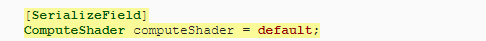
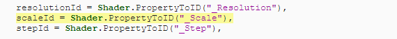
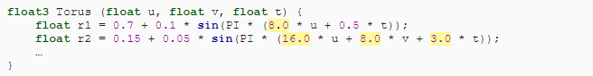

## Unity基础教程系列(新)（五）------计算着色器（Rendering One Million Cubes）
发布于 2021-03-10 15:05:30

> 本文重点内容： 1、把点存储在compute buffer 2、让GPU来做大部分工作
> 3、程序画立方体任务 4、复制函数库到GPU

这是关于学习使用Unity的基础知识的系列文章中的第五篇。这次，我们将使用计算着色器显著提高图形的分辨率。

> 本教程是CatLikeCoding系列的一部分，原文地址见文章底部。

本教程使用Unity 2019.4.14f1制作。

<figure>

</figure>

（100万个移动的立方体）

**1 把工作移到GPU**

图形的分辨率越高，CPU和GPU在计算位置和渲染立方体上要做的工作就越多。点的数量等于分辨率的平方，因此将分辨率加倍会大大增加工作量。在分辨率为100的情况下，我们也许可以达到60FPS，但是我们能提高到多少呢？如果遇到瓶颈，是否可以使用其他方法克服瓶颈？

**1.1 分辨率200**

首先将Graph的最大分辨率从100翻倍到200，然后看看我们获得了什么性能结果。

<figure>

</figure>

<figure>

</figure>

<figure>

</figure>

（视图分辨率设置为200）

我们现在渲染了40,000点。以我的例子来说，对于DRP构建，平均帧速率下降到10FPS，对于URP构建，平均帧速率下降到15FPS。这对于获得流畅的体验而言太低了。

<figure>

</figure>

<figure>

</figure>

（在分辨率为200的情况下分析一个Build，有垂直同步，DRP和URP的情况）

对构建进行概要分析表明，所有内容花费的时间大约是原来的四倍，这是符合预期的。

**1.2 GPU视图**

排序，批处理，然后将40,000点的转换矩阵发送到GPU需要花费大量时间。单个矩阵由16个浮点数组成，每个浮点数为4个字节，每个矩阵总计64B。对于40,000个点，即265万字节（大约2.44MiB），每次绘制点时必须将其复制到GPU。URP必须每帧执行两次，一次用于阴影，一次用于常规几何。DRP必须执行至少三遍，因为它具有额外的深度Pass，除了主定向Pass外，还需要为每个其他光源进行一次Pass。

> 什么是MiB？
> 由于计算机硬件使用二进制数来寻址内存，因此它以2的幂而不是10的幂进行分区。MiB是兆字节的后缀，即2的20次方
> = 1,024的平方 =
> 1,048,576字节。它最初被称为兆字节（以MB表示），但是现在应该表示为106字节，与官方定义的一百万字节相匹配。但是，仍然经常使用MB，GB等代替MiB，GiB等。

通常情况下，最好最大程度地减少CPU和GPU之间的通信和数据传输量。由于我们只需要显示点的位置即可，因此如果该数据仅存在于GPU端，则将是理想的。这将消除大量数据传输。但是随后CPU无法再计算位置，GPU必须执行该操作。幸运的是，它非常适合该任务。

让GPU计算位置需要不同的方法。我们将保留当前视图以进行比较，然后创建一个新视图。复制Graph C＃资产文件并将其重命名为GPUGraph。从新类中删除pointPrefab和points字段。然后还删除其Awake，UpdateFunction和UpdateFunctionTransition方法。我只标记了新类的已删除代码，而没有将所有内容标记为新代码。

<figure>

</figure>

然后删除在Update末尾调用现在缺少的方法的代码。

<figure>

</figure>

我们的新GPUGraph组件是Graph的简化版本，它暴露了相同的配置选项，但不包括预制件。它包含了从一个功能过渡到另一个功能的逻辑，但除此之外没有任何作用。使用分辨率为200的该组件创建一个游戏对象，该对象设置为使用瞬时过渡循环。停用原始视图对象，以便仅GPU版本保持活动状态。

<figure>

</figure>

（GPU graph组件设置为瞬时转换）

**1.3 Compute Buffer**

为了将位置存储在GPU上，我们需要为其分配空间。通过创建ComputeBuffer对象来做到这一点。通过调用New ComputeBuffer()（称为构造方法），将位置缓冲区的字段添加到GPUGraph并通过新的Awake方法创建对象。它的工作方式类似于分配新数组，但用于对象或结构。

<figure>

</figure>

我们需要将缓冲区的元素数量作为参数传递，即分辨率的平方，就像Graph的positions数组一样。

<figure>

</figure>

compute buffer包含任意未类型化的数据。我们需要通过第二个参数指定每个元素的确切大小（以字节为单位）。我们需要存储3D位置矢量，该位置矢量由三个浮点数组成，因此元素大小是四个字节的三倍。因此，40,000个位置仅需要0.48MB或大约0.46MiB的GPU内存。

<figure>

</figure>

这为我们提供了一个compute buffer，但是这些对象无法在热重载中生存，这意味着，如果我们在播放模式下更改代码，它将消失。可以通过用OnEnable方法替换Awake方法来解决此问题，该方法在每次启用组件时都会被调用。也会在唤醒后立即发生（除非已禁用），并且在热重载完成后也会发生。

<figure>

</figure>

除此之外，我们还应该添加一个伴随的OnDisable方法，该方法在禁用组件时被调用，如果图形被销毁并且在热重载之前，该方法也会发生。通过调用其Release方法使它释放缓冲区。这表明缓冲区申请的GPU内存可以立即释放。

<figure>

</figure>

由于在此之后我们将不再使用该特定的对象实例，因此最好将字段显式设置为引用null。如果我们的视图在播放模式下被禁用或破坏，则该对象有可能在下次运行时被Unity的内存垃圾回收进程回收。

<figure>

</figure>

> 如果我们不明确释放缓冲区会发生什么？
> 当垃圾回收器回收该对象时，如果没有任何引用保留该对象，则它将最终被释放。但是何时发生这种情况是任意的。最好尽快将其明确释放，以免阻塞内存。

**1.4 Compute Shader**

要计算GPU上的位置，我们需要为其编写脚本，特别是计算着色器。通过Assets/ Create / Shader / Compute Shader创建一个。它将成为我们的FunctionLibrary类的等效GPU，因此也将其命名为FunctionLibrary。尽管它被称为着色器并使用HLSL语法，但它的作用是作为通用程序，而不是用作渲染事物的常规着色器。因此，我将资产放置在Scripts文件夹中。

<figure>

</figure>

（Function library compute shader 资产）

打开资产文件并删除其默认内容。Compute Shader需要包含一个称为内核的主要功能，该功能通过#pragma kernel 指令指示，后跟一个名称，例如表面着色器的#pragma surface。使用名称FunctionKernel，将此指令添加为第一行，也是当前唯一的行。

<figure>

</figure>

在指令下定义函数。这是一个空函数，最初没有参数。

<figure>

</figure>

**1.5 Compute 线程**

当指示GPU执行计算着色器功能时，它会将其工作划分为多个组，然后安排它们独立且并行运行。每个组依次由执行相同计算但输入不同的多个线程组成。我们需要通过将numthreads属性添加到我们的内核函数中来指定每个组应该具有多少个线程。它需要三个整数参数。最简单的选项是对所有三个参数使用1，这使得每个组仅运行一个线程。

<figure>

</figure>

GPU硬件包含始终在lockstep中运行特定固定数量线程的计算单元。这些被称为包裹（warps）或波阵面（wavefronts）。如果组中的线程数小于warps大小，则某些线程将空闲，从而浪费时间。如果线程数量超过了大小，则GPU将每组使用更多的warps。通常，最好使用64个线程，因为它与AMD GPU的warps大小匹配，而对于NVidia GPU为32个线程，因此每个组将使用两个warps。实际上，硬件更复杂，并且可以通过线程组执行更多操作，但这与我们的简单图形无关。

numthreads的三个参数可用于在一维，二维或三维中组织线程。例如，（64，1，1）给我们一个维上的64个线程，而（8，8，1）给我们一个相同的数量，但表示为2D 8×8正方形网格。在基于2D UV坐标定义点时，我们使用后一个选项。

<figure>

</figure>

每个线程由三个无符号整数的向量标识，我们可以通过在函数中添加uint3参数来访问该向量。

<figure>

</figure>

> 什么是无符号整数？
> 它就是一个没有符号指示符的整数，因此是无符号的。无符号整数要么为零，要么为正。因为无符号整数不需要使用位来表示符号，所以它们可以存储更大的值，但这通常并不重要。

我们必须显式地指出这个参数是线程标识符。通过在参数名称后面加上一个冒号来实现这一点，后面跟着SV DispatchThreadID shader语义关键字。

<figure>

</figure>

**1.6 UV坐标**

如果我们知道图形的步长，就可以将线程标识符转换为UV坐标。为它添加一个名为Step的compute shader 属性，就像我们为表面着色器添加_Smoothness 一样。

<figure>

</figure>

然后创建一个GetUV函数，该函数将线程标识符作为参数，并将UV坐标作为float2返回。遍历这些点时，可以使用在Graph中应用的相同逻辑。取标识符的XY分量，加0.5，乘以步长，然后减一。

<figure>

</figure>

**1.7 设置位置**

为了存储位置，我们需要访问位置缓冲区。在HLSL中，计算缓冲区被称为结构化缓冲区。因为我们必须对它进行写操作，所以需要启用读写的版本，即RWStructuredBuffer。为命名的位置添加一个着色器属性。

<figure>

</figure>

在这种情况下，我们需要指定缓冲区的元素类型。位置是float3值，我们将它们直接写在尖括号之间的RWStructuredBuffer之后。

<figure>

</figure>

为了存储一个点的位置，我们需要根据线程标识符为它分配一个索引。我们需要知道这个图像的分辨率。因此，添加一个分辨率着色器属性，用uint类型匹配标识符的类型。

<figure>

</figure>

然后创建一个SetPosition函数来设置一个位置，给定一个标识符和要设置的位置。对于索引，我们将使用标识符的X分量加上它的Y分量乘以图形分辨率。通过这种方式，我们将2D数据按顺序存储在1D数组中。

<figure>

</figure>

<figure>

</figure>

（3X3格子的位置索引）

我们需要知道的一件事是，我们每个小组都计算了一个有8个8个点的网格。如果这个图的分辨率不是8的倍数，那么我们将会得到一行和一列的组来计算一些超出边界的点。这些点的索引要么落在缓冲区之外，要么与有效索引冲突，这会破坏我们的数据。

<figure>

</figure>

（超出边界）

只有当X和Y标识符组件都小于分辨率时，才可以通过存储它们来避免无效位置。

<figure>

</figure>

**1.8 Wave函数**

我们现在可以在FunctionKernel中获得UV坐标，并使用我们创建的函数设置位置。开始使用0作为位置。

<figure>

</figure>

我们最初只支持波函数，它是我们库中最简单的。要使它具有动画效果，我们需要知道时间，因此添加一个time属性。

<figure>

</figure>

然后从FunctionLibrary类复制Wave方法，将其插入FunctionKernel上方。要将其转换为HLSL函数，请删除公共静态限定符，将Vector3替换为float3，将Sin替换为sin。

<figure>

</figure>

唯一还缺少的是PI的定义。我们将通过为其定义宏来添加它。这是通过在#define
PI后面加上数字来完成的，我们将使用3.14159265358979323846。这比float值可以表示的要精确得多，但是我们将其留给着色器[编译器]{.mod-overview__keyword}以使用适当的近似值。

<figure>

</figure>

现在，使用Wave函数来计算FunctionKernel中的位置，而不是使用零。

<figure>

</figure>

**1.9 调度Compute Shader内核**

我们现在有一个内核函数，可以计算和存储视图点的位置。下一步是在GPU上运行它。GPUGraph需要访问计算着色器才能执行此操作，因此请向其添加可序列化的ComputeShader字段，然后将我们的资产链接到该组件。

<figure>

</figure>

<figure>

</figure>

（已分配的Compute shader）

我们需要设置一些compute
shader的属性。要做到这些，我们需要知道Unity为它们使用的标识符。这些是可以通过调用着色器来检索的整数。带有名称字符串的PropertyToID。这些标识符是按需声明的，并且在应用程序或编辑器运行时保持相同，因此我们可以直接将这些标识符存储在静态字段中。从position属性开始。

<figure>

</figure>

我们是否也应该将FunctionLibrary.functions标记为只读？
虽然这样做是有意义的，但readonly对于引用类型不起作用，因为它只强制字段值本身不改变。在这个例子中，对象就是数组本身仍然可以被修改。所以它会阻止分配一个完全不同的数组，但不会阻止改变它的元素。我更喜欢只对原始类型(如int)使用readonly。

还要存储_Resolution，\_Step和_Time的标识符。

<figure>

</figure>

接下来，创建一个UpdateFunctionOnGPU方法，该方法计算步长并设置compute
shader的分辨率，步长和时间属性。这是通过在其上调用SetInt来实现分辨率，并在SetFloat上调用其他两个属性来完成的，其中标识符和值作为参数。

<figure>

</figure>

> 着色器的分辨率属性不是uint吗？
> 是的，但是只有一种方法可以设置正整数，而不是无符号整数。这没关系，因为正整数值等于uint值。

我们还必须设置positions缓冲区，该缓冲区不会复制任何数据，但会将缓冲区链接到内核。这是通过调用SetBuffer来完成的，它与其他方法一样工作，只不过它需要一个额外的参数。它的第一个参数是内核函数的索引，因为计算着色器可以包含多个内核，并且缓冲区可以链接到特定的内核。我们可以通过在计算着色器上调用FindKernel来获取内核索引，但是我们的单个内核始终具有零索引，因此我们可以直接使用该值。

<figure>

</figure>

设置缓冲区后，我们可以通过使用四个整数参数在compute
shader上调用Dispatch来运行内核。第一个是内核索引，其他三个是要运行的组的数量，每个维又进行划分。在所有尺寸上使用1将意味着仅计算第一组8×8位置。

<figure>

</figure>

由于我们固定的8×8群组大小，我们在X和Y维度上需要的群组数量等于分辨率除以8（四舍五入）。可以通过执行浮点除法并将结果传递给Mathf.CeilToInt来实现。

<figure>

</figure>

最后在更新结束时运行内核调用UpdateFunctionOnGPU。

<figure>

</figure>

现在，我们在播放模式下每帧会计算所有图形的位置，即使我们看不到这些，也没有对数据做任何事情。

**2 过程绘制**

有了GPU上可用的位置，下一步就是绘制点，而无需从CPU向GPU发送任何转换矩阵。因此，着色器将需要从缓冲区中检索正确的位置，而不是依赖于标准矩阵。

**2.1 画很多Meshes**

由于这些位置已经存在于GPU上，因此我们不需要在CPU端对其进行跟踪。我们甚至不需要游戏对象。取而代之的是，我们将通过一条命令指示GPU使用特定的材质多次绘制特定的网格。要配置绘制内容，请将可序列化的Material和Mesh字段添加到GPUGraph。最初，我们将使用现有的Point
Surface材质来通过DRP绘制点。对于网格，我们将使用默认的立方体。

<figure>

</figure>

<figure>

</figure>

（Material mesh 配置）

通过使用带有网格，子网格索引和材质作为参数的Graphics.DrawMeshInstancedProcedural来完成过程绘制。当网格由多个部分组成时，子网格索引适用于我们，但情况并非如此，因此我们仅使用零。在UpdateFunctionOnGPU的末尾执行此操作。

<figure>

</figure>

> 我们不应该使用DrawMeshInstancedIndirect吗？
> 当你不知道要在CPU端绘制多少实例，而是通过缓冲区向计算着色器提供该信息时，DrawMeshInstancedIndirect方法很有用。

因为这种绘制方式不使用游戏对象，所以Unity不知道绘制在场景中的哪个位置。我们需要通过提供边界盒作为附加参数来表明这一点。这是一个轴对齐的盒，用于指示我们要绘制的内容的空间范围。Unity使用它来确定是否可以跳过视图，因为它最终会超出相机的视场。这称为视锥剔除。因此，现在不再需要评估每个点的边界，而是可以立即对整个视图进行评估。这对于我们的视图来说很好，因为我们本来就是打算完整查看它。

我们的图位于原点，点的位置应保留在大小为2的立方体内。我们可以通过使用Vector3.zero和Vector3.one乘以2作为参数的Bounds构造函数方法来为此创建边界值。

<figure>

</figure>

但是，点也有大小，其中一半可以在所有方向上凸出去。因此，我们应该同样增加界限。

<figure>

</figure>

还需要提供给DrawMeshInstancedProcedural的最后一个参数是应绘制多少个实例。这应该与positions缓冲区中的元素数量匹配，我们可以通过其count属性检索它。

<figure>

</figure>

<figure>

</figure>

（重叠的单位立方体）

当进入游戏模式时，我们会看到一个单色立方体位于原点。同样的立方体每个点渲染一次，但是有1个单位变换矩阵，所以它们都是重叠的。现在性能比以前好多了，因为几乎没有数据需要复制到GPU，并且所有的点都是通过一个DrawCall绘制的。同样，Unity也不需要对每个点进行筛选。它也不会根据视图空间的深度对点进行排序，而通常情况下它是需要这么做，以便首先绘制离摄像机最近的点。

深度排序使不透明几何图形的渲染更加有效，因为它避免了过度绘制，但是我们的过程绘制命令只是简单地一个接一个地渲染点。即使消除了CPU工作量和数据传输，加上GPU能够全速渲染所有立方体的能力，还是不能弥补这一点。

**2.2 检索位置**

要检索存储在GPU上的点位置，我们需要创建一个新的着色器，最初是用于DRP的。复制Point
Surface着色器并将其重命名为Point Surface
GPU。调整其着色器菜单标签以匹配。另外，由于我们现在依赖于由Compute
shader填充的结构化缓冲区，因此将着色器的target
level提高到4.5。严格来说，这不是必需的，但表明我们需要Compute
shader支持。

<figure>

</figure>

> target level4.5是什么意思？ 这表明我们至少需要OpenGL ES
> 3.1的功能。它不适用于旧的pre-DX11 gpu，也不适用于OpenGL ES
> 2.0或3.0。这也排除了WebGL。WebGL
> 2.0有一些实验性的计算着色器支持，但是Unity目前还不支持它。当支持不足时运行GPU图形会导致所有点重叠，就像现在所发生的一样。因此，如果ni
> 的目标是这样的平台，你将不得不坚持使用旧的方法，或者同时使用这两种方法，并在需要时使用分辨率低得多的CPU视图。

过程渲染的工作方式类似于GPU实例化，但是我们需要指定一个附加选项，以添加#pragma
instancing_options指令表示。在这种情况下，我们可以使用procedural：ConfigureProcedural选项。

<figure>

</figure>

这表明表面着色器需要为每个顶点调用一个配置函数。它是一个没有任何参数的空函数。将它添加到我们的着色器中。

<figure>

</figure>

默认情况下，此函数仅在常规绘制过程中被调用。为了在渲染阴影时也应用它，我们需要通过向#pragma
surface指令添加addshadow来指示需要自定义阴影Pass。

<figure>

</figure>

现在添加我们在计算着色器中声明的相同位置缓冲区字段。这次我们只读它，因此给它提供StructuredBuffer类型而不是RWStructuredBuffer。

<figure>

</figure>

但是，我们仅应针对专为程序绘制而编译的着色器变体执行此操作。定义UNITY_PROCEDURAL_INSTANCING_ENABLED宏标签时就是这种情况。可以通过编写#if定义（UNITY_PROCEDURAL_INSTANCING_ENABLED）进行检查。这是一个预处理程序指令，它指示编译器仅在定义了标签的情况下在以下行中包含代码。这适用于直到仅包含#endif指令的行。它的工作方式类似于C＃中的条件块，不同之处在于在编译过程中包括或省略了代码。最终代码中不存在分支。

<figure>

</figure>

我们还需要对将放入ConfigureProcedural函数中的代码执行相同的操作。

<figure>

</figure>

现在，我们可以通过使用当前正在绘制的实例的标识符为位置缓冲区建立索引来检索点的位置。通过unity_InstanceID访问其标识符，该标识符可全局访问。

<figure>

</figure>

**2.3 创建一个转换矩阵**

确定位置后，下一步就是为该点创建对象到世界的转换矩阵。为了使事情尽可能简单，请在无任何旋转或缩放的情况下将图形固定在世界原点。调整GPU
Graph游戏对象的Transform组件不会产生任何效果，因为不会使用它。

我们只需要应用该点的位置和比例即可。位置存储在4×4转换矩阵的最后一列中，而比例尺存储在矩阵对角线上。矩阵的最后一个成分始终设置为1。对我们来说，所有其他成分均为零。

<figure>

</figure>

（有位置和缩放值的转换矩阵）

转换矩阵用于将顶点从对象空间转换为世界空间。它是通过unity_ObjectToWorld全局提供的。因为我们在程序上绘制它是一个单位矩阵，所以我们需要替换它。将整个矩阵初始设置为零。

<figure>

</figure>

我们可以通过float4（position，1.0）为位置偏移量构造一个列向量。通过将其分配给unity_ObjectToWorld.\_m03_m13_m23_m33，可以将其设置为第四列。

<figure>

</figure>

然后将float
\_Scale着色器属性添加到我们的着色器，并将其分配给unity_ObjectToWorld.\_m00_m11_m22。

<figure>

</figure>

还有一个unity_WorldToObject矩阵，其中包含逆变换，用于变换法向量。当应用非均匀变形时，需要正确地变换方向矢量。在我们的例子中，可以通过简单地使用负位置和缩放的倒数来构造它。

<figure>

</figure>

我们可以跳过计算每个顶点的缩放尺度，而是通过传递给GPU，将缩放转换为浮点2。我们将法线标度存储在第一个分量中而反标度存储在第二个分量中。

<figure>

</figure>

现在创建一个启用了GPU实例化的使用此着色器的新材质，并将其分配给我们的GPU图形。

<figure>

</figure>

（使用GPU材质）

为了使这项工作正常进行，我们需要设置材质的属性，就像我们设置较早的计算着色器一样。首先，将缩放的标识符添加到GPUGraph。

<figure>

</figure>

然后在绘制之前在UpdateFunctionOnGPU中的材质上调用SetBuffer和SetVector。在这种情况下，我们不必为缓冲区提供内核索引。即使我们仅使用两个组件，SetVector也仅接受Vector4。即使我们仅使用两个或三个定义着色器矢量属性，它始终具有四个分量。我们将简单地使用两个参数调用Vector4构造函数方法，其另两个组件将设置为零。

<figure>

</figure>

<figure>

</figure>

（40000个阴影立方体 DRP的绘制方式）

当我们进入播放模式时，我们再次看到了图形，但是现在它的40,000点以稳定的60FPS渲染。如果我关闭了编辑器游戏窗口的垂直同步功能，则最高可跑到120FPS。我们的程序方法显然比每点使用一个游戏对象快得多。

<figure>

</figure>

（分析一个DRP Build 带垂直同步）

对Build进行概要分析表明，我们的GPUGraph组件几乎无事可做。它仅指示GPU运行计算着色器内核，然后告诉Unity从程序上绘制很多点。这不会立即发生。计算着色器已计划，将在GPU空闲时立即运行。程序绘制命令随后由DRP发送到GPU。该命令将发送三遍，一次用于仅深度遍，一次用于阴影，一次用于最终绘制。GPU将首先运行Compute
shader，并且只有在完成后才可以绘制场景，之后它可以运行Compute
shader的下一次调用。Unity可以毫不费力地获得40,000点。

> 暂停播放模式后，为什么图形消失了？
> 暂停期间，Unity不会执行其Player循环，因此不会调用GPUGraph.Update，也不会发生程序绘制。如果帧[调试器]{.mod-overview__keyword}处于活动状态，则该视图不会保持可见，因为最后一帧会不断重复渲染，包括过程绘制命令。

**2.4 百万计划**

因为它可以很好地处理40,000个点，所以让我们看看我们的GPU图是否也可以处理一百万个点。但是在我们这样做之前，我们需要了解异步着色器编译。这是Unity编辑器的功能，而不是构建功能。编辑器仅在需要时才编译着色器，而不是提前编译。在编辑着色器时，这可以节省大量的编译时间，但是这意味着着色器并不总是立即可用。发生这种情况时，将暂时使用统一的青色虚拟着色器，直到着色器编译过程完成（该过程并行运行）为止。

通常这很好，但是虚拟着色器不适用于过程视图。这将大大减慢绘图过程。如果在尝试渲染一百万点时发生这种情况，它很可能会卡住，然后崩溃，甚至崩溃整个Unity。

我们可以通过项目设置关闭异步着色器编译，但这只是Point Surface
GPU着色器的问题。幸运的是，通过向其添加#pragma
editor_sync_compilation指令，我们可以告诉Unity将同步编译用于特定的着色器。这将迫使Unity停顿并立即在第一次使用着色器之前立即对其进行编译，从而避免使用虚拟着色器。

<figure>

</figure>

现在可以安全地将GPUGraph的分辨率限制提高到1000。

<figure>

</figure>

让我们尝试最大的分辨率。

<figure>

</figure>

<figure>

</figure>

（分辨率设置为1000）

当在小窗口中查看时，它看起来并不漂亮-出现摩尔纹图案，因为这些点太小了-但它可以运行。对我而言，以24FPS渲染一百万个动画点。编辑器和内部版本的性能相同。此时，编辑器的开销微不足道，GPU是瓶颈。此外，就我的硬件而言，是否启用了VSync并没有明显的区别。

<figure>

</figure>

（分析1百万个点 没有垂直同步）

禁用VSync后，很明显，播放器循环的大部分时间都花在等待GPU完成。GPU确实是瓶颈。我们可以在不影响性能的情况下向CPU添加同等量的工作负载。

请注意，我们要渲染一百万个带阴影的点，这要求它们在DRP中每帧绘制3次。禁用阴影可将我的帧频提高到稳定的60FPS。

当然，如果发现帧速率不足，则无需将分辨率一直提高到1000。将其减少到700可能已经使它以启用阴影的速度以60FPS运行，并且外观几乎相同。但从现在开始，我将始终使用分辨率1000。

**2.5 URP**

要查看URP的性能，我们需要复制Point URP着色器视图，并将其重命名为Point URP GPU。着色器视图不直接支持过程化，但是我们可以使它与少量自定义代码一起使用。为了简化操作并重用一些代码，我们将创建一个HLSL包含文件资产。Unity没有为此提供的菜单选项，因此可以复制一个表面着色器资源并将其重命名为PointGPU。然后，使用系统的文件浏览器将资产的文件扩展名从shader更改为hlsl。

<figure>

</figure>

（PointGPU HLSL 脚本资产）

清除文件的内容，然后将Points Surface GPU的位置缓冲区，缩放比例尺和ConfigureProcedural函数的代码复制到其中。

<figure>

</figure>

现在，我们可以通过#include" PointGPU.hlsl"指令将此文件包含在Point Surface GPU着色器中，然后可以从其中删除原始代码。

<figure>

</figure>

> 我们可以在CGPROGRAM着色器中包含HLSL文件吗？
> 可以。CGPROGRAM块和HLSLPROGRAM块之间的唯一区别是，前者默认包含一些文件。这种差异与我们无关。

我们将使用Custom Function节点将HLSL文件包括在我们的着色器视图中。这个想法是节点从文件中调用一个函数。实际上我们不需要此功能，只有将其链接到图形，代码才会被包含进来。因此，我们将为PointGPU添加格式正确的伪函数，该函数仅传递float3值而不更改它。

使用两个名为In和Out的float3参数向PointGPU添加一个无效的ShaderGraphFunction_float函数。该函数只是将输入分配给输出。参数名称按约定大写，因为它们将与着色器视图中使用的输入和输出标签相对应。

<figure>

</figure>

假设Out参数是一个输出参数，我们需要在其前面写出来来声明它。

函数名称的_float后缀是必需的，因为它表示函数的精度。着色器视图形提供两种精度模式，即float或half模式。后者的大小是前者的一半，因此是两个而不是四个字节。节点使用的精度可以通过显式选择或设置为继承，这是默认设置。为确保我们的图形适用于两种精度模式，再添加了一个使用half的变体函数。

<figure>

</figure>

现在将Custom Function节点添加到我们的Point URP GPU图。默认情况下，其类型设置为File。通过齿轮图标打开其配置面板，然后将PointGPU分配给其Source属性。使用ShaderGraphFunction作为其名称，不带精度后缀。然后将In作为"Vector3"添加到Inputs列表中，将Out添加到Outputs列表中。

<figure>

</figure>

（通过文件分配 自定义函数）

为了将我们的代码集成到视图中，我们需要将节点链接到它。根据顶点阶段的需要，将其输出连接到主节点的"Vertex Position。然后将Position节点集添加到对象空间，并将其链接到我们的自定义节点的输入。

<figure>

</figure>

（通过我们的函数传递的对象空间的顶点位置）

现在，对象空间的顶点位置通过我们的伪函数传递，我们的代码包含在生成的着色器中。但是，要启用过程渲染，我们还需要包含#pragma
instancing_options和#pragma editor_sync_compilation编译器指令。这些必须直接写入生成的着色器源代码中，不能通过单独的文件包含它们。因此，添加另一个具有与之前相同的输入和输出的Custom Function节点，但是这次将其Type设置为String。将其名称设置为适当的名称（例如InjectPragmas），然后将指令放入正文文本块中。主体充当函数的代码块，因此我们还需要在此处将输入分配给输出。

<figure>

</figure>

（通过字符串注入编译指示的自定义函数）

为了清楚起见，这是正文的代码：

<figure>

</figure>

顶点位置也要通过此节点，在其他自定义功能节点之前或之后。

<figure>

</figure>

（带有Pragmas的着色器视图）

使用Point URP GPU着色器创建启用了实例化的材质，将其分配给视图，然后进入播放模式。现在，我在编辑器和内部版本中都达到了36FPS，并且启用了阴影。这比DRP快50％。

<figure>

</figure>

（分析URP的构建）

同样，VSync对平均帧速率没有影响。禁用阴影会使它增加到67FPS，与DRP基本相同，播放器循环所花的时间更少。

**2.6 可变的分辨率**

因为我们当前总是在缓冲区中的每个位置绘制一个点，所以在播放模式下降低分辨率会固定一些点。发生这种情况是因为compute shader仅更新适合视图的点。

<figure>

</figure>

（降低分辨率之后，点被卡住了）

这是因为无法调整计算缓冲区的大小。我们可以在每次更改分辨率时创建一个新的缓冲区，但另一种更简单的方法是始终为最大分辨率分配一个缓冲区。这将使在游戏模式下改变分辨率变得毫不费力。

首先将最大分辨率定义为常数，然后在resolution字段的Range属性中使用它。

<figure>

</figure>

接下来，始终使用最大分辨率的平方作为缓冲区中元素的数量。这意味着无论图形分辨率如何，我们将始终拥有12MB（约11.44MiB）的GPU内存。

<figure>

</figure>

最后，在绘制时，请使用当前分辨率的平方而不是缓冲区元素数。

<figure>

</figure>

（分辨率在10和1000之间变化）

**3 GPU Function Library**

现在，我们基于GPU的方法已完全可用，让我们将整个函数库移植到我们的compute shader中。

**3.1 所有的函数**

我们可以复制其他功能，就像我们复制和调整Wave一样。第二个是MultiWave。与Wave唯一的显着区别是它包含浮点值。HLSL中不存在后缀f，因此应将其从所有数字中删除。为了表明它们都是浮点值，我为所有它们显式添加了一个小数点，例如2f变为2.0。

<figure>

</figure>

对其余功能执行相同的操作。Sqrt变成sqrt，而Cos变成cos。

<figure>

</figure>

**3.2 宏**

现在，我们需要为每个视图函数创建一个单独的内核函数，但这是很多重复的代码。我们可以通过创建着色器宏来避免这种情况，就像我们之前定义的PI。首先在FunctionKernel函数上方的行上编写#define
KERNEL_FUNCTION。

<figure>

</figure>

这些定义通常仅适用于同一行后面的内容，但是我们可以通过在除最后一行之外的每行末尾添加一个\\反斜杠来将其扩展到多行。

<figure>

</figure>

现在，当我们编写KERNEL_FUNCTION时，编译器会将其替换为FunctionKernel函数的代码。为了使其适用于任意函数，我们向宏添加了一个参数。这就像函数的参数列表一样工作，但是没有类型，并且必须在宏名称后附加左括号。给它一个函数参数，并使用它代替显式调用Wave。

<figure>

</figure>

我们还需要修改内核函数的名称。使用function参数作为前缀，然后使用Kernel。但是，我们必须将功能标签分开，否则它将不会被视为着色器参数。要组合两个单词，请使用##宏串联运算符将它们连接起来。

<figure>

</figure>

现在可以通过使用适当的参数编写KERNEL_FUNCTION来定义所有五个内核函数。

<figure>

</figure>

我们还需要按照与FunctionLibrary.FunctionName匹配的顺序，将每个函数的单个内核指令替换为1。

<figure>

</figure>

最后一步是将当前函数用作GPUGraph.UpdateFunctionOnGPU中的内核索引，而不是始终使用0。

<figure>

</figure>

<figure>

</figure>

（1000分辨率下所有的函数，放置了一个平面展示阴影）

计算着色器运行太快了，它不关心哪个函数被显示，对所有的函数而言，帧率都是相同的。

**3.3 函数变形**

支持从一个函数到另一个函数的变化就不那么简单了，因为我们需要为每个唯一的转换使用一个单独的内核。首先为过渡进程添加一个属性到compute shader，我们将使用它来混合函数。

<figure>

</figure>

然后复制内核宏，将其重命名为KERNEL_MOPH_FUNCTION，并为其指定两个参数：functionA和functionB。将函数的名称更改为functionA
\## To \## functionB \##
Kernel，并使用lerp在它们根据进度计算的位置之间进行线性插值。我们在这里也可以使用smoothstep，但是在CPU上每帧只计算一次。

<figure>

</figure>

每个功能可以转换到所有其他功能，因此每个功能有四个转换。为所有这些添加内核功能。

<figure>

</figure>

我们将定义内核，以使它们的索引等于functionB + functionA \*
5，将不进行过渡的内核视为从相同的函数过渡到相同的函数。因此，第一个内核是Wave，然后是从Wave过渡到其他功能的四个内核。之后是从MultiWave开始的功能，第二个功能是非过渡内核，依此类推。

<figure>

</figure>

返回GPUGraph，添加过渡进度的标识符。

<figure>

</figure>

如果我们要过渡，请在UpdateFunctionOnGPU中进行设置，否则便不懂。在这里，我们应用了smoothstep函数，因此我们不必在GPU的每个点上都这样做。这是一个很小的优化，但是它是免费提供的，并且避免了很多工作。

<figure>

</figure>

要选择正确的内核索引，请向其添加过渡函数的五倍，如果不进行过渡，则向同一函数添加五倍。

<figure>

</figure>

<figure>

</figure>

（随机变形）

添加的过渡对我的例子来说仍然没有影响帧速率。很明显，瓶颈是渲染，而不是位置的计算。

**3.4 Function Count 属性**

要计算内核索引，GPUGraph需要知道有多少个函数。我们可以将GetFunctionCount方法添加到返回它的FunctionLibrary中，而不是在GPUGraph中对其进行硬编码。这样做的好处是，如果要添加或删除函数，则只需要更改两个FunctionLibrary文件（类和计算着色器）。

<figure>

</figure>

我们甚至可以删除常量值并返回函数数组的长度，从而进一步减少了以后需要更改的代码。

<figure>

</figure>

函数计数转换为属性是不错的选择。要自己创建一个，请从GetFunctionCount中删除Get前缀，并删除其空参数列表。然后将return语句包装在嵌套的get代码块中。

<figure>

</figure>

这定义了一个getter属性。它唯一要做的就是返回一个值，我们可以通过将get块简化为表达式主体来简化它，这可以通过用get =\>; functions.Length;替换它来完成。

<figure>

</figure>

因为没有Set块，所以我们可以通过省略get来进一步简化属性。这会将属性减少为一行。

<figure>

</figure>

使用此属性代替GPUGraph.UpdateFunctionOnGPU中的常数。

<figure>

</figure>

**3.5 更多细节**

总结起来，由于分辨率的提高，我们的功能可以变得更加详细。例如，我们可以使Sphere的扭曲频率加倍。

<figure>

</figure>

<figure>

</figure>

（更多细节的球）

同样，对于星形图案和圆环的扭曲。这将使扭曲看起来相对于主要样式移动得更慢，因此也可以稍微增加它们的时间因子。

<figure>

</figure>

<figure>

</figure>

（更多细节的环）

为了使两个函数库保持同步，请同时调整FunctionLibrary类中的函数。这使得可以在基于CPU的游戏对象与基于GPU的过程方法之间进行更真实的比较。

欢迎扫描二维码，查看更多精彩内容。点击 阅读原文 可以跳转原教程。

本文翻译自 Jasper Flick的系列教程

原文地址：

https://catlikecoding.com/unity/tutorials
-------------------------------------------------   
=================================================
=================================================

Unity基础教程系列(新)（六）------Jobs（Animating a
Fractal）:            
 

 
[Unity基础教程系列(新)（二）------构建视图（Visualizing
Math）](https://cloud.tencent.com/developer/article/1787211?policyId=1003) 

  

Unity基础教程系列(新)（二）------构建视图（Visualizing
Math） 
 

 
[Unity基础教程系列(新)（七）------有机品种（Making the Artificial Look
Natural）](https://cloud.tencent.com/developer/article/1799633?policyId=1003) 

    
Unity基础教程系列(新)（七）------有机品种 
 

 
[Unity通用渲染管线（URP）系列（二）------Draw Calls（Shaders and
Batches）](https://cloud.tencent.com/developer/article/1759421?policyId=1003) 

   

 
 

 
[Unity基础教程系列(新)（四）------测量性能（MS and
FPS）](https://cloud.tencent.com/developer/article/1787214?policyId=1003) 
      
 
 

 
[Unity通用渲染管线（URP）系列（十五）------粒子（Color and Depth
Textures）](https://cloud.tencent.com/developer/article/1771273?policyId=1003) 
    
 
 

 
[Unity通用渲染管线（URP）系列（十一）------后处理（Bloom）](https://cloud.tencent.com/developer/article/1771260?policyId=1003) 
 
[渲染](https://cloud.tencent.com/developer/tag/10576) [http](https://cloud.tencent.com/developer/tag/10620) 

[这是关于创建自定义脚本渲染管道的教程系列的第11部分。它增加了对后处理的支持，目前只支持bloom。](https://cloud.tencent.com/developer/article/1771260?policyId=1003) 
 
 

 
[Unity通用渲染管线（URP）系列（四）------方向阴影（Cascaded Shadow Maps）](https://cloud.tencent.com/developer/article/1764845?policyId=1003) 
 
 
[当进行物体渲染时，表面和灯光信息足以计算光照。但是在两者之间可能存在某些阻碍光线的东西，导致在我们需要渲染的表面上投射了阴影。为了使阴影能够正常表现，就必须以某种方式让着色器知道阴影对象。这有很多种方法可以实现，
最常见的方法是生成一个阴影贴图，该贴图存储光在击中表面之前离开其源的距离。任何在同一个方向上更远的距离都不能被同一个光源照亮。Unity的RP使用这种方法，我们也会这样做。](https://cloud.tencent.com/developer/article/1764845?policyId=1003) 

Unity通用渲染管线（URP）系列（三）------方向光（Direct
Illumination）

 
[基础渲染系列（十三）------延迟着色](https://cloud.tencent.com/developer/article/1658908?policyId=1003) 
  
 
[这是关于渲染的系列教程的第13部分。上一部分涵盖了半透明阴影。现在我们来看一下延迟着色。](https://cloud.tencent.com/developer/article/1658908?policyId=1003)

[基础渲染系列（二）------着色器](https://cloud.tencent.com/developer/article/1659072?policyId=1003)

[这是渲染系列的第二篇文章，第一篇讲述的是矩阵，这次我们会写我们的第一个Shader并且导入一张纹理。] 

基础渲染系列（二）------着色器   
 

[Unity可编程渲染管线系列（十一）后处理（全屏特效）](https://cloud.tencent.com/developer/article/1680743?policyId=1003) 

 
[这是涵盖Unity的可脚本化渲染管道的教程系列的第11部分。它涵盖了后处理堆栈的创建。](https://cloud.tencent.com/developer/article/1680743?policyId=1003) 
 
 
 
  
[1.使用AVPlayer 获取视频每一帧的YUV 像素数据 2.通过CoreVideo
框架中的几个方法,将Y分量和UV 分量进行分离 3.创建着色器，对Y分量和UV
分量进行采样. 4.在着色器中，将YUV 转换为RGB
5.计算视口的位置，分别进行渲染.](https://cloud.tencent.com/developer/article/1338962?policyId=1003) 

  
 

[Unity性能调优手册7：渲染优化，DrawCall，剔除，Shader，LOD，TextureStreaming](https://cloud.tencent.com/developer/article/2351739?policyId=1003)

[翻译自https://github.com/CyberAgentGameEntertainment/UnityPerformanceTuningBible/
本章介绍围绕Unity图形功能的调整实践。](https://cloud.tencent.com/developer/article/2351739?policyId=1003) 
  
 
 
 

[Unity通用渲染管线（URP）系列（十二）------ HDR（Scattering and Tone
Mapping）](https://cloud.tencent.com/developer/article/1771261?policyId=1003)

 
 
[这是有关创建自定义脚本渲染管道的系列教程的第12部分。它增加了对高动态范围渲染，基于散射的光晕和色调映射的支持。](https://cloud.tencent.com/developer/article/1771261?policyId=1003) 
 
 

[Unity通用渲染管线（URP）系列（十三）------颜色分级（Playing with
Colors）](https://cloud.tencent.com/developer/article/1771264?policyId=1003)

[这是有关创建自定义可脚本渲染管道的系列教程的第13部分。这次，我们将添加各种用于颜色分级的工具。](https://cloud.tencent.com/developer/article/1771264?policyId=1003)

[Unity可编程渲染管线系列（三）光照（单通道
正向渲染）](https://cloud.tencent.com/developer/article/1673528?policyId=1003)

[这是涵盖Unity可编写脚本的渲染管线的教程系列的第三部分。这次，我们将通过一个Drawcall为每个对象最多着色8个灯光来增加对漫反射光照的支持。](https://cloud.tencent.com/developer/article/1673528?policyId=1003)

   
 

 
[基础渲染系列（十五）------延迟光照](https://cloud.tencent.com/developer/article/1659088?policyId=1003)

[这是关于渲染的系列教程的第15部分。在上一部分中，我们添加了雾。现在，我们将创建自己的延迟光照。](https://cloud.tencent.com/developer/article/1659088?policyId=1003)

 

[Unity通用渲染管线（URP）系列（十四）------多相机（Camera Blending & Rendering Layers）](https://cloud.tencent.com/developer/article/1771265?policyId=1003)
 
 
[这是有关创建自定义脚本渲染管道的系列教程的第14部分。这次，我们重新考虑了使用多个摄像机的渲染，现在添加了post
FX。](https://cloud.tencent.com/developer/article/1771265?policyId=1003)
  

[[万字详解高可用架构设计]](https://cloud.tencent.com/developer/article/2485144)

[[Go开发者必备：Protocol Buffers入门指南]](https://cloud.tencent.com/developer/article/2490247)

[[10分钟带你彻底搞懂分布式链路跟踪]{.cdc-m-article-rank__item-title}](https://cloud.tencent.com/developer/article/2493091)

[[轻量应用构建训练营]](https://cloud.tencent.com/developer/learning/camp/4)

[[AI绘画-StableDiffusion图像生成]](https://cloud.tencent.com/developer/learning/camp/19)

[[C/Python]](https://cloud.tencent.com/developer/learning/graph/6)

[Unity基础教程系列(新)（六）------Jobs（Animating a
Fractal）](https://cloud.tencent.com/developer/article/1799617?policyId=1003)

[Unity基础教程系列(新)（二）------构建视图（Visualizing
Math）](https://cloud.tencent.com/developer/article/1787211?policyId=1003)

[Unity基础教程系列(新)（七）------有机品种（Making the Artificial Look Natural）](https://cloud.tencent.com/developer/article/1799633?policyId=1003)

[Unity通用渲染管线（URP）系列（二）------Draw Calls（Shaders and Batches）](https://cloud.tencent.com/developer/article/1759421?policyId=1003)

[Unity基础教程系列(新)（四）------测量性能（MS and FPS）](https://cloud.tencent.com/developer/article/1787214?policyId=1003)

[Unity通用渲染管线（URP）系列（十五）------粒子（Color and Depth Textures）](https://cloud.tencent.com/developer/article/1771273?policyId=1003)

[Unity通用渲染管线（URP）系列（十一）------后处理（Bloom）](https://cloud.tencent.com/developer/article/1771260?policyId=1003)

[Unity通用渲染管线（URP）系列（四）------方向阴影（Cascaded Shadow Maps）](https://cloud.tencent.com/developer/article/1764845?policyId=1003)

[《Unity Shader入门精要》笔记：基础篇（1）](https://cloud.tencent.com/developer/article/2115686?policyId=1003)

[Unity通用渲染管线（URP）系列（三）------方向光（Direct
Illumination）](https://cloud.tencent.com/developer/article/1759426?policyId=1003)

[基础渲染系列（十三）------延迟着色](https://cloud.tencent.com/developer/article/1658908?policyId=1003)

[基础渲染系列（二）------着色器](https://cloud.tencent.com/developer/article/1659072?policyId=1003)

[Unity可编程渲染管线系列（十一）后处理（全屏特效）](https://cloud.tencent.com/developer/article/1680743?policyId=1003)

[OPenGL ES着色器_实战2](https://cloud.tencent.com/developer/article/1338962?policyId=1003)

[Unity性能调优手册7：渲染优化，DrawCall，剔除，Shader，LOD，TextureStreaming](https://cloud.tencent.com/developer/article/2351739?policyId=1003)

[Unity通用渲染管线（URP）系列（十二）------ HDR（Scattering and Tone Mapping）](https://cloud.tencent.com/developer/article/1771261?policyId=1003)

[Unity通用渲染管线（URP）系列（十三）------颜色分级（Playing with Colors）](https://cloud.tencent.com/developer/article/1771264?policyId=1003)

[Unity可编程渲染管线系列（三）光照（单通道
正向渲染）](https://cloud.tencent.com/developer/article/1673528?policyId=1003)

[基础渲染系列（十五）------延迟光照](https://cloud.tencent.com/developer/article/1659088?policyId=1003)

[Unity通用渲染管线（URP）系列（十四）------多相机（Camera Blending &RenderingLayers）](https://cloud.tencent.com/developer/article/1771265?policyId=1003)

-   [[Unity基础教程系列(新)（六）------Jobs（Animating a Fractal）]](https://cloud.tencent.com/developer/article/1799617)

-   [[Unity基础教程系列(新)（七）------有机品种（Making the Artificial Look Natural）]](https://cloud.tencent.com/developer/article/1799633)

-   [[Unity基础教程系列(新)（二）------构建视图（Visualizing  Math）]](https://cloud.tencent.com/developer/article/1787211)

