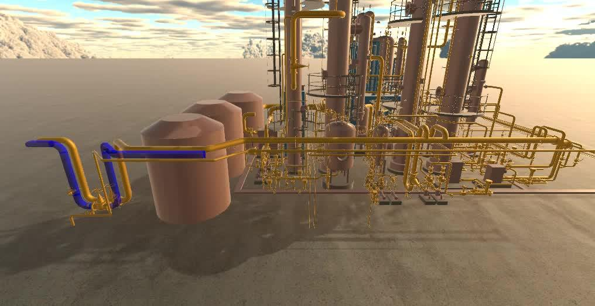
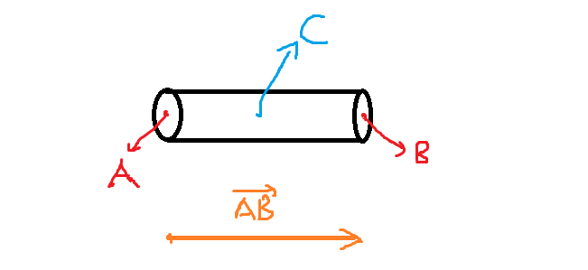
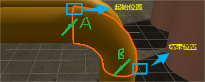
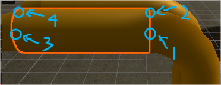
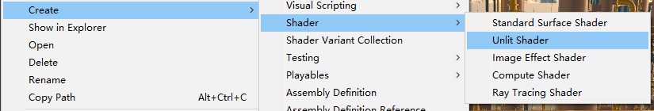
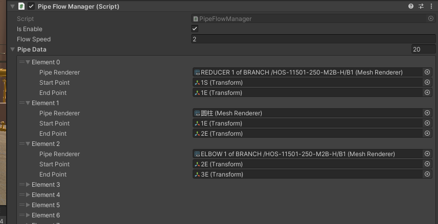
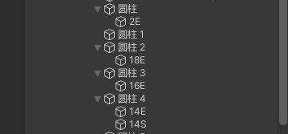

#  Unity Shader模拟管道流动效果（程序向） 
 
目录
 
-   声明: 首先我不是TA，我只是个小客户端，但是学过图形学而已，效果实现的没那么好请见谅。
-   为什么写这篇文章：因为没学过[ShaderGraph](https://zhida.zhihu.com/search?content_id=241196137&content_type=Article&match_order=1&q=ShaderGraph&zhida_source=entity)网上大多数教程都是ShaderGraph的，而且这个还只能在 URP管线 用，虽然可以自己导包但是太麻烦了，不如用 Shader快。然后只能用我粗浅的知识根据其他知乎博主的思路用 Shader 代码实现出来。
-   这篇文章面相的对象，当然是和我一样的小白啦
-   做这个效果的目的：老师拜托做这个效果。刚好最近比较闲，就帮了这个忙。

 
先看一下效果吧，有点小瑕疵，但这是我偷懒数据没填好导致的（另外这里我隐藏的原模型）： 
 
 

## 实现思路  

**Unlit Shader** + **cg 着色语言** + **冯光照模型**

思路：我们如果知道管道的起始点 A 和 结束点B，我们就得知每个像素在管道的百分比位置。如下图，对于 C点，我们可知它大概在 50% 的位置，那我们我们控制一个从 0~1 的 Fill 字段，对于百分比小于 Tick 的像素我们就让他显示，对于百分比大的像素的丢弃就好。然后使用时间 Tick 该 Fill 字段就好（对，思路就那么简单）
 
<figure data-size="normal">
<div>

</div>
<figcaption>Image</figcaption>
</figure>
 

## 一些实现上需要注意的问题 

**1. 如何求得像素相对于起始结束点的百分比？**

对于上面的图，我们使用 AC 向量 点积 AB 向量（注意必须正交化以后的AB向量）即可得到 AC 在 AB 方向上的长度， 我们拿该长度除以 AB 向量的模即可。

**2. 弯道如何处理？**
处理方法一其实一样，但是我们需要注意我们需要将起始点移动到外半径处，如下图所示。如果我们还按照原来的将圆心处作为起始结束位置（A、B），那么A左上方的像素将永远显示，而B右下方的像素则会因为 min(fillPercent, 1) 而一下子就都显示。

<figure data-size="normal">
<div>

</div>
<figcaption>Image</figcaption>
</figure>


当然附带的我们还需要修改与弯管道相连的直管道部分，由于连续管道的结束点一般会作为下一个管道的起始点（当然这个是因为我懒，你也可以单独创建起始点和结束点这样就不用修改直管道起点），**为了保证直管道起始点到结束点的向量能覆盖所有像素，我们需要将直管道的起始点由3处调整至 4处。**

<figure data-size="normal">
<div>

</div>
<figcaption>Image</figcaption>
</figure>
 
**3. 管道都是分段的，那么如何协调不同管道的流动？**

首先我们就不能共用一个材质，所以我们需要用代码生成材质，并且将MeshRenderer的材质修改为我们生成的材质。然后我们在脚本中维护一个下标，然后只 Tick对应的管道数据即可。

**4. 又想要原先的管道材质，又想要流动怎么办？**

这个我没想到啥好办法，直接把管道复制一遍就行，在副本上模拟流动

## 代码 

### Shader 

以防一些小伙伴不知道创建哪个 shader：

<figure data-size="normal">
<div>

</div>
<figcaption>Image</figcaption>
</figure>

```glsl
Shader "Custom/FlowShader"
{
    Properties
    {
        _MainTex("Texture", 2D) = "white" {}
        _WaterColor("Water Color", Color) = (0, 0, 1, 1)
        //注意这里不能写 0f，写代码写习惯了
        _FillPct("FillPercent", Range(0, 1)) = 0 
        _StartPoint("StartPoint", Vector) = (0,0,0,0)
        _EndPoint("EndPoint", Vector) = (0,0,0,0)
    }

        SubShader
        {
            //这里队列设置 Transparent 应该也没事
            Tags { "Queue" = "AlphaTest" "IgnoreProjector" = "True" "RenderType" = "TransparentCutout"}
            LOD 100

            Pass
            {
                Tags {"LightMode" = "ForwardBase"}
                //透明材质设置
                ZWrite Off
                Blend SrcAlpha OneMinusSrcAlpha

                CGPROGRAM
                #pragma vertex vert
                #pragma fragment frag

                #include "UnityCG.cginc"
                #include "Lighting.cginc"
                
                sampler2D _MainTex;
                float4 _MainTex_ST;
                fixed4 _WaterColor;
                fixed _FillPct;
                float4 _StartPoint;
                float4 _EndPoint;

                struct appdata
                {
                    float4 vertex : POSITION;
                    float3 normal : NORMAL;
                    float4 uv : TEXCOORD0;
                };

                struct v2f
                {
                    float4 pos : SV_POSITION;
                    float2 uv : TEXCOORD0;
                    float3 worldNormal : TEXCOORD1;
                    float3 worldPos : TEXCOORD2;
                };
                //没啥好说的，顶点着色器的作用就是传输计算的中间结果，除非你想逐顶点光照
//这里根据评论区大佬的建议，可以在顶点着色器中计算 percent（顶点/像素在管子的相对位置）
//然后交给硬件做插值，这样的话需要在 v2f 结构体中加入一个变量，或是存入 worldPos 的 w 分量
//好处是在几何体简单（顶点少）的情况下，性能好一些（是不是有点小题大作）
                v2f vert(appdata v)
                {
                    v2f o;
                    o.pos = UnityObjectToClipPos(v.vertex);
                    o.uv = TRANSFORM_TEX(v.uv, _MainTex);
                    o.worldPos = mul(unity_ObjectToWorld, v.vertex).xyz;
                    o.worldNormal = UnityObjectToWorldNormal(v.normal);
                    return o;
                }

                fixed4 frag(v2f i) : SV_Target
                {
                    //基础光照信息
                    fixed3 worldNormal = normalize(i.worldNormal);
                    fixed3 worldLightDir = normalize(UnityWorldSpaceLightDir(i.worldPos));
                    //水面裁剪信息
                    float flowLength = length(_EndPoint.xyz - _StartPoint.xyz);
                    float pixelToStart = dot(i.worldPos - _StartPoint.xyz, normalize(_EndPoint.xyz - _StartPoint.xyz));
                    float percent = pixelToStart / flowLength; //像素在管子中的相对位置
                    //裁剪点
                    clip(_FillPct - percent);
                    //基础光照计算
                    fixed3 albedo = tex2D(_MainTex, i.uv) * _WaterColor.rgb;
                    fixed3 ambient = UNITY_LIGHTMODEL_AMBIENT.xyz * albedo;
                    fixed3 diffuse = _LightColor0 * albedo * max(0, dot(worldLightDir, worldNormal));
                    //return fixed4(percent, percent, percent, 0.8f);
                    return fixed4(ambient + diffuse, 0.8f);
                }
                ENDCG
            }
        }
            Fallback "Transparent/Cutout/VertexLit"
}
``` 

### PipeFlowData 管道流动数据 

前言，注意以我的粗浅的经验来说，我们思考一个功能的时候一定要先考虑该功能需要哪些基本的对象（非管理类），**这些对象的数据结构是什么样的**？**我们需要对该对象做哪些封装**？**如果有多种多样的该类型对象是否该考虑抽象出一个基类或者用组合模式去解决？**

> 当然我这里是偷懒，没考虑多类型管道、你比如说可能有直管道、弯管道、S型管道，它们的数据各有什么变化？它们的
> Tick
> 函数会有什么不同？都是一些值得思考的问题（[感觉有点小题大作了，勿怪] ）
 
``` csharp
using System;
using UnityEngine;

/// <summary>
/// 该类是描述水在管道中流动的基本数据结构
/// </summary>
[Serializable]
public class PipeFlowData
{
    [Tooltip("是渲染组件，只要是在场景中能看得到的物体 ，在编辑器面板把有这个组件的管道拖到这里即可")]
    public MeshRenderer pipeRenderer;
    [Tooltip("管道起始点, 使用空物体表示，需要将对应的物体移动到对应的位置")]
    public Transform startPoint;
    [Tooltip("管道结束点")]
    public Transform endPoint;

    private float distance;
    private float curMoveDistance;
    private Vector3 dir;
    public float FlowPct => Mathf.Min(curMoveDistance / distance, 1f);
    public bool IsEnd => (FlowPct > 0.99f);

    /// <summary>
    /// 用于更新该管道流动距离
    /// </summary>
    /// <param name="displacement">当前帧流动的距离</param>
    public void TickMoveDistance(float displacement)
    {
        curMoveDistance += displacement;
    }


    /// <summary>
    /// 初始化/重置数据
    /// </summary>
    /// <param name="mat">有就赋值</param>
    public void InitData(Material mat = null)
    {
        if (mat)
            pipeRenderer.material = mat;
        else
            mat = pipeRenderer.sharedMaterial;
        dir = endPoint.position - startPoint.position;
        distance = dir.magnitude;
        dir.Normalize();
        curMoveDistance = 0f;

        mat.SetVector("_StartPoint", startPoint.position);
        mat.SetVector("_EndPoint", endPoint.position);
        mat.SetFloat("_FillPct", 0);
    }
}
``` 

### PipeFlowManager 

> 小小吐槽一下，为啥 C# List 没有提供 back() 函数，C++ 就有。

**这里更正一下 using System.Linq; 以后可以使用 List.Last()获取最后一个元素，感谢评论区大佬**。当然如果想自己写 Last也可以像我这样，自己扩展。

``` csharp
//自己扩展一下 List 函数
public static class UnitExpandingFunction
{
    public static T GetLast<T>(this List<T> arr)
    {
        if (arr.Count == 0) return default;
        else return arr[arr.Count - 1];
    }
}
```
 
> 注意，计算名字的时候过滤特殊字符可以使用 stringBuilder
> 创建一个新的字符串，我这样数组尾删虽然也可以，但是耗性能，还容易产生内存垃圾（太懒啦）。另外吐槽一下，这建模没规范吗？模型里名字里带
> '/'，局部坐标中心离模型中心十万八千里。

``` csharp
/// <summary>
/// 管理所有水管流动
/// </summary>
public class PipeFlowManager : MonoBehaviour
{
    //是否启动
    public bool isEnable = false;
    //管道流动速度
    public float flowSpeed = 2f;
    //管道数据，主要是这个把这个数组填好就行
    public List<PipeFlowData> PipeData = new List<PipeFlowData>();
    //材质数组，不用管在代码里会自动加载好
    private List<Material> materials;
    //当前正在流动的管道下标，也不用管
    int curIndex = 0;

    #region 生命周期
    private void Awake()
    {
        materials = new List<Material>();
        //首先初始化管道数据
        foreach (var data in PipeData)
        {
            materials.Add(CreateMaterial(data.pipeRenderer.gameObject));
            data.InitData(materials.GetLast()); //这个是自己扩展的函数
        }
    }
    private void FixedUpdate()
    {
        if (isEnable)
            TickWaterFlow();
    }
    #endregion

    /// <summary>
    /// 更新管道参数，具体更新逻辑为：
    ///     如果当前管道没走到末尾，更新材质参数即可
    ///     否则我们移动我们的 curIndex 下标
    /// </summary>
    private void TickWaterFlow()
    {
        if (!PipeData[curIndex].IsEnd)
            materials[curIndex].SetFloat("_FillPct", PipeData[curIndex].FlowPct);
        else
        {
            materials[curIndex].SetFloat("_FillPct", 1f);
            ++curIndex;
            if (curIndex >= PipeData.Count)
            {
                ResetAll();
                return;
            }
        }

        PipeData[curIndex].TickMoveDistance(flowSpeed * Time.fixedDeltaTime);
    }

    /// <summary>
    /// 重置所有
    /// </summary>
    private void ResetAll()
    {
        curIndex = 0;
        foreach (var data in PipeData)
        {
            data.InitData();
        }
    }

    /// <summary>
    /// 这里我们为 pipe 对象创建材质，先在 Assets 目录下找，有我们寻找，没有我们就创建
    /// </summary>
    /// <param name="pipe">管道对象</param>
    /// <param name="texture">该参数为空即可</param>
    /// <returns></returns>
    Material CreateMaterial(GameObject pipe, Texture texture = null)
    {
        //计算材质的名字，规则为该对象名字+父对象名字的 hash 值，以防止重复
        string name = pipe.name;
        for (int i = name.Length - 1; i >= 0; --i) //过滤 '/'
        {
            if (name[i] == '/')
            {
                name = name.Remove(i);
            }
        }
        if (pipe.transform.parent != null)
            name += Animator.StringToHash(pipe.transform.parent.name);

        //如果已经创建过我们加载即可
        Material mat = Resources.Load<Material>($"Mats/PipeFlowMats/{name}");
        if (texture != null)
        {
            mat.mainTexture = texture;
        }
        if (mat != null) return mat;

        //如果没创建过，我们将其创建后加载，目录可以手动修改，当前值为："Assets/GameAssets/Resources/Mats/PipeFlowMats/
        mat = new Material(Shader.Find("Custom/FlowShader"));
        AssetDatabase.CreateAsset(mat, $"Assets/GameAssets/Resources/Mats/PipeFlowMats/{name}.mat");
        mat = Resources.Load<Material>($"Mats/PipeFlowMats/{name}");
        return mat;
    }
}
```
 

## 填写管道数据（堆量的活） 

<figure data-size="normal">
<div>

</div>
<figcaption>Image</figcaption>
</figure>

<figure data-size="normal">
<div>

</div>
<figcaption>Image</figcaption>
</figure>
 

**对于单个元素我们怎么去填写：** 我们可以看到每个元素有三个参数

-   PipeRenderer：我们需要在Hierarchy窗口找到对应的管道对象，然后将其拖进来
-   StartPoint：这个点一般使用上一个管道的结束点即可
-   EndPiont：我们一般在对应的管道对象下创建一个空的子对象，用于表示结尾，同时作为下一个数据的
    StartPoint

> 对于不连续的部分，我们需要为首个管道同时创建其实和结束点

## 可能需要拓展的东西  

> 注意这部分仅供参考，也没经过验证，只是我的拙劣的想法，大佬们有问题尽管提出

-   **对于分叉的管道如何处理**？

我们可能需要修改 PipeFlowData数据结构，我们需要给他加上一个父节点下标，也就是使用树的数据结构。

然后我们还需要修改 PipeFlowManager 脚本，即使用 BFS 去 Tick所有处于队列中的FlowData，每帧检测是否有管道走到头了，然后将子节点加入队列。

-   **你可能也注意到了管道截断处的地方如何处理？**

在我的实现中没有处理，但是我在想是不是可以设置个 世界空间的UI，让它跟随截面移动，同时用程序控制该 UI的缩放、旋转与移动。（感觉不太好实现，但是我没有其他思路了）

参考：

[Unity 管道 液体流动 效果](https://zhuanlan.zhihu.com/p/525001459)

[Unity Shader 常用函数和变量](https://zhuanlan.zhihu.com/p/521907457)

[零基础入门Unity Shader（四）](https://zhuanlan.zhihu.com/p/47506575)

[unity通过代码动态添加、生成材质_unity动态加载材质-CSDN博客](https://link.zhihu.com/?target=https%3A//blog.csdn.net/weixin_43118159/article/details/116303478)

> 本文使用 [Zhihu On> VSCode](https://zhuanlan.zhihu.com/p/106057556)


[所属专栏 · 2024-03-24 23:57
更新](https://zhuanlan.zhihu.com/c_1569443603402932224)
 