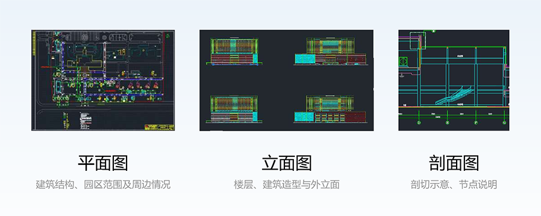
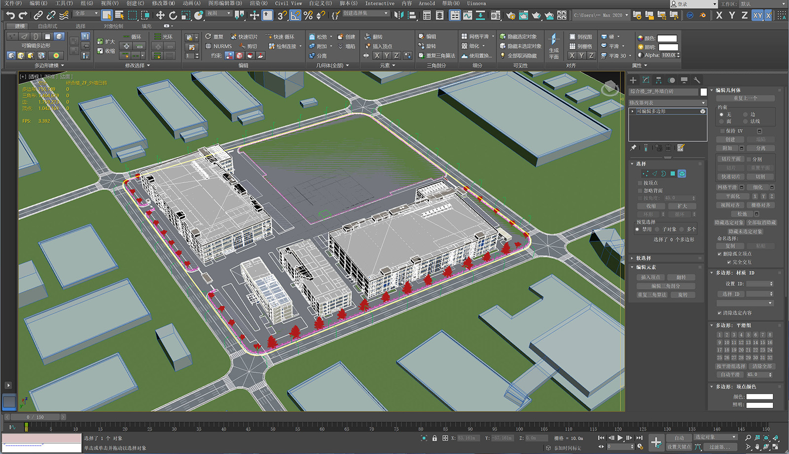
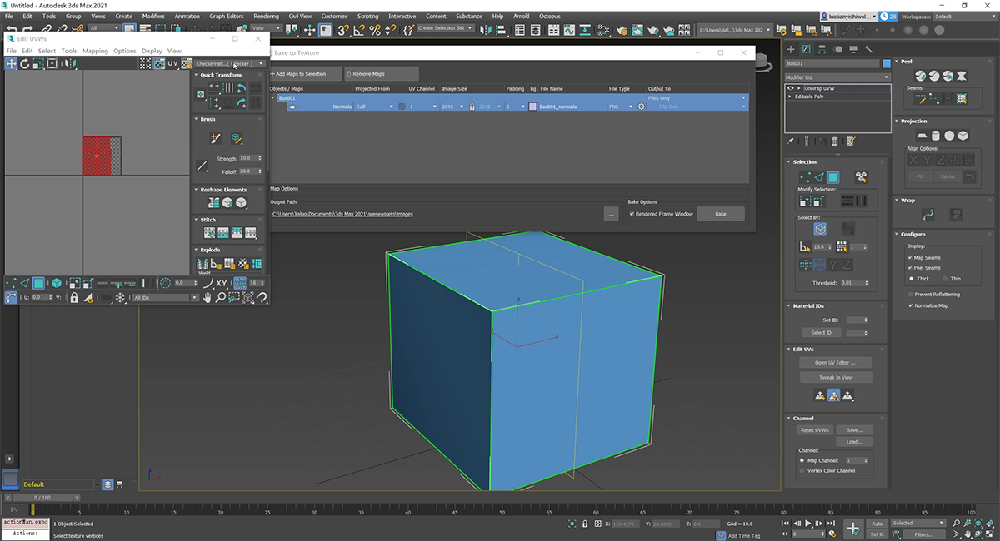
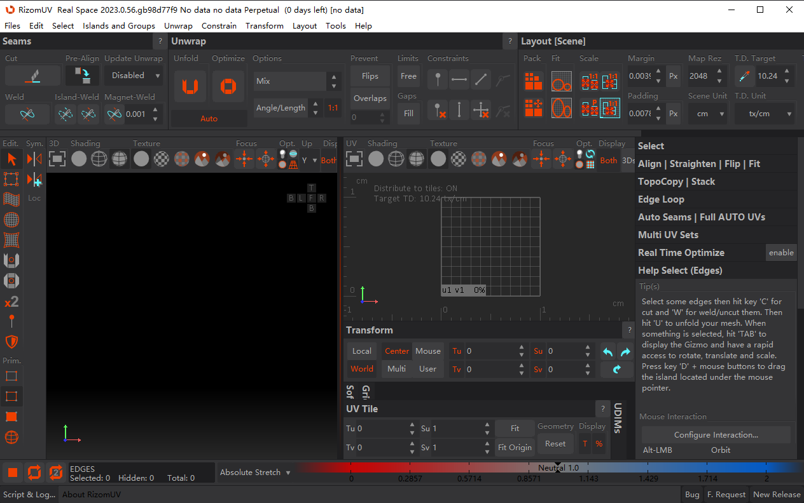
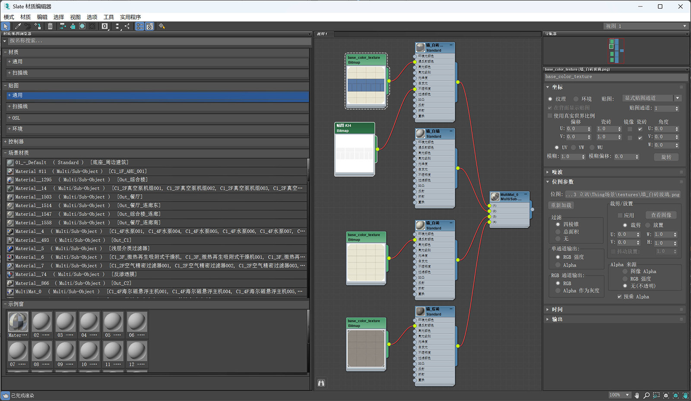
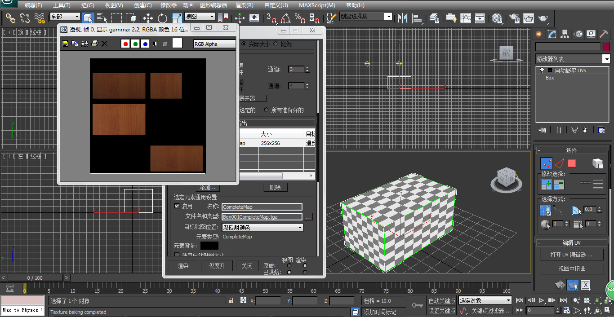

# 智慧园区 \| 3D建模的步骤流程  
 
最新推荐文章于 2026-03-14 01:37:02 发布
 
[原创] [于 2025-04-28 07:00:00 发布] 
      
在智慧园区的建设中，[3D建模] 是构建数字孪生底座的基石。无论是建筑外观、道路规划，还是绿化景观和地下管线，都需要通过精细的建模实现可视化与管理。然而，面对复杂的园区场景，如何高效完成建模并兼顾性能？本文将结合**建模工具（Blender/3ds Max）与实战流程**，拆解从图纸处理到场景落地的全链路技术细节。

-------------------- 

### 一、前期准备：需求分析与图纸处理** 

####  **1. 需求明确：精度与用途的平衡** 

智慧园区的3D建模需根据应用场景选择模型精度：

-   [**管理平台**：中低精度模型（三角面数\<10万/建筑），支持快速加载与交互。]{#u4d7ebfe0}
-   [**宣传展示**：高精度模型（三角面数50万+），需细节雕刻与写实渲染。]{#ud2434342}

 

####  **2. 图纸处理：从CAD到3D软件**  

**步骤1：简化CAD图纸**

-   删除冗余图层（如标注、填充），保留建筑轮廓与结构线。
-   输出为DXF格式（兼容性最佳）。

**步骤2：导入Blender/3ds Max**

-   **单位统一**：将CAD图纸缩放至实际尺寸（1单位=1米）。
-   **定位原点**：调整模型中心与场景世界坐标对齐。

[[[基于CAD的1比1建筑建模 智慧楼宇 数字园区
ThingJS_哔哩哔哩_bilibili]{.link-title}[基于CAD的1比1建筑建模 智慧楼宇
数字园区 ThingJS, 视频播放量 614、弹幕量 1、点赞数 4、投硬币枚数
0、收藏人数 14、转发人数 0, 视频作者 数图模方, 作者简介
智慧园区/数字孪生/数据可视化设计/场景美术设计/3D建模动画
VX/QQ:361863359，相关视频：智慧楼宇单体建筑建模效果展示 建筑外立面设计
Thing.js粒子创建与剖切盒添加，三维组态设计\|楼宇暖通冷热水系统\|楼宇暖通设备间\|数字孪生三维仿真设计，三维组态设计\|板式换热系统\|楼宇暖通设备间\|数字孪生三维仿真设计，如何使用Twinmotion制作数字园区场景
智慧园区建筑表现 建筑可视化
Twinmotion景观设计，Unity智慧楼宇-数字孪生免费教程已完结-实时监控数据-进交流群有答疑，智慧园区数字孪生可视化3D组态设计，智慧楼宇\|轻量化园区\|Thing.js单体建筑模型，智慧园区数字底座
卫星影像
城市地理数据，倾斜摄影高精度扫描的楼宇建筑模型，其还原度怎么样？，【3dmax建模】制作建筑场景模型很难吗？从零开始教你制作，3dmax房子建筑模型，学过才知道这么简单！！！]{.link-desc}[{.link-link-icon}https://www.bilibili.com/video/BV1JW4y1d7sU/?spm_id_from=333.1387.homepage.video_card.click&vd_source=d0d7439197bfaddef439eed1f4e1b348]{.link-link}]{.link-card-box
contenteditable="false"}](https://www.bilibili.com/video/BV1JW4y1d7sU/?spm_id_from=333.1387.homepage.video_card.click&vd_source=d0d7439197bfaddef439eed1f4e1b348 "基于CAD的1比1建筑建模 智慧楼宇 数字园区 ThingJS_哔哩哔哩_bilibili"){.has-card
rel="nofollow"}

------------------------------------------------------------------------

###  **二、模型创建：从基础到细节** 

####  **1. 基础建模：快速搭建建筑主体** 

**方法1：多边形建模（Blender）**

-   根据CAD轮廓线挤出墙体，生成基础建筑结构。
-   使用**阵列修改器（Array Modifier）**快速复制楼层。

**方法2：参数化建模（3ds Max）**

-   通过**墙体生成工具**（如Wall Builder）自动创建分层结构。

{#u95a83787
height="922" width="1600"}

####  **2. 细节雕刻：外立面与景观优化**  

**外立面贴图**：

-   收集园区实景照片，制作无缝贴图（建议尺寸1024×1024px）。
-   使用**平铺模式（Tileable Texture）**避免重复感。

**景观建模**：

-   树木、路灯等重复元素使用**实例化（Instancing）**技术，减少面数。

[[[智慧园区轻量化园区3D建模渲染Web端效果展示_哔哩哔哩_bilibili]{.link-title}[轻量化智慧园区模型效果展示,
视频播放量 344、弹幕量 0、点赞数 2、投硬币枚数 0、收藏人数 3、转发人数
2, 视频作者 数图模方, 作者简介
智慧园区/数字孪生/数据可视化设计/场景美术设计/3D建模动画
VX/QQ:361863359，相关视频：智慧园区数字孪生可视化3D组态设计，智慧园区数字孪生3D可视化组态系统，轻量型仓储类园区建模Thing.js，园区高斯溅射3DGS模型展示，倾斜摄影生成的园区底座模型，效果如何？，可视化项目设计展示与总结，如何使用Twinmotion制作数字园区场景
智慧园区建筑表现 建筑可视化
Twinmotion景观设计，信华信IOC综合数字化解决方案，双旋翼科幻飞行器，物联网系统
数据采集设备
空间点位绑定]{.link-desc}[{.link-link-icon}https://www.bilibili.com/video/BV1Xr4y1o7vd/?spm_id_from=333.1387.homepage.video_card.click&vd_source=d0d7439197bfaddef439eed1f4e1b348]{.link-link}]{.link-card-box
contenteditable="false"}](https://www.bilibili.com/video/BV1Xr4y1o7vd/?spm_id_from=333.1387.homepage.video_card.click&vd_source=d0d7439197bfaddef439eed1f4e1b348 "智慧园区轻量化园区3D建模渲染Web端效果展示_哔哩哔哩_bilibili"){.has-card
rel="nofollow"}

------------------------------------------------------------------------

###  **三、UV拆分与材质贴图** 

####  **1. UV拆分：高效利用贴图空间** 

**规则**：

-   建筑外立面按区域拆分UV（如正面、侧面分开）。
-   确保UV岛之间留足空隙（2-4像素），避免纹理溢出。

{#wqz6X
height="650" width="1200"}

**工具推荐**：

-   **RizomUV**：自动展开UV并优化利用率。
-   **Blender UV Toolkit**：手动调整复杂结构。

{#u5f5706db
height="792" width="1264"}

####  **2. 材质与PBR流程**  

**基础材质**：

-   **Albedo（基础色）**：控制主色调，避免过饱和（Blender中V值建议0.8-1.0）。
-   **Roughness（粗糙度）**：区分材质类型（如玻璃=0.1，混凝土=0.7）。

**特殊材质**：

-   **玻璃**：在3ds Max中启用折射（IOR=1.5）与菲涅尔反射。
-   **金属**：设置金属度=1.0，结合环境光遮蔽（AO）贴图增强真实感。

{#ua12403e3
height="929" width="1600"}

------------------------------------------------------------------------

###  **四、场景整合与光照烘焙**  

####  **1. 环境搭建：天空盒与地形融合**  

-   [**天空盒**：使用HDR环境贴图模拟自然光照（推荐分辨率4096×4096）。]{#ue079215f}
-   [**地形匹配**：将建筑模型与GIS地形数据（DEM）对齐，避免悬空或穿插。]{#u9a4974bc}

####  **2. 光照烘焙：提升渲染效率** 

**步骤**：

1.  在3ds Max中添加**天光（Skylight）与平行光（Directional Light）**。
2.  [烘焙阴影贴图（Lightmap），分辨率根据模型精度选择（512-2048px）。]{#u92a3c328}

**技巧**：

1.  使用**光线追踪（Ray Tracing）**优化阴影细节。
2.  避免过度烘焙导致噪点，可通过**降噪插件（Denoiser）**后期处理。

{#u3c9f8ca9
height="706" width="1366"}

------------------------------------------------------------------------

###  **五、性能优化与交付**  

#### **1. 模型轻量化：从35万面到5万面** 

-   [**Decimate减面**：Blender中应用**Decimate
    Modifier**，设置比率=0.2。]{#ubcc18f06}
-   [**删除隐藏面**：移除建筑内部不可见结构（如屋顶下方）。]{#u54fbd9dc}
-   [**实例化复用**：相同物体（如路灯、垃圾桶）共享网格数据。]{#u5fc47156}

####  **2. 格式导出与引擎适配** 

-   [**通用格式**：导出为FBX或glTF（支持贴图内嵌）。]{#ubef3936a}
-   [**引擎优化**：]{#u4fc50ce8}
    -   **Unity**：启用GPU Instancing与LOD Group。
    -   **Unreal Engine**：使用Nanite虚拟几何体技术。

------------------------------------------------------------------------

###  **六、总结：工具链与学习建议** 

####  **1. 工具推荐** 

::: table-box
  -------------- ----------------------------------------
  功能           推荐工具
  **建模**       Blender（免费）、3ds Max（高精度）
  **UV拆分**     RizomUV、Blender UV Toolkit
  **材质贴图**   Substance Painter、Quixel Mixer
  **渲染引擎**   Unreal Engine（实时）、V-Ray（影视级）
  -------------- ----------------------------------------
:::

####  **2. 避坑指南**  

-   [**单位问题**：确保所有软件单位一致（米制）。]{#u9de9f4a1}
-   [**贴图压缩**：Web端贴图需压缩为JPEG/PNG格式（单张\<500KB）。]{#u353a9f39}
-   [**版本管理**：使用Git或云存储保存迭代版本。]{#ud893e619}

------------------------------------------------------------------------

掌握智慧园区3D建模的流程，不仅能提升项目交付效率，更能为[数字孪生]{.words-blog
.hl-git-1 tit="数字孪生"
pretit="数字孪生"}应用打下坚实基础。从图纸处理到引擎适配，每一步都需严谨细致------**模型是骨架，细节是灵魂，优化是生命**。
 
