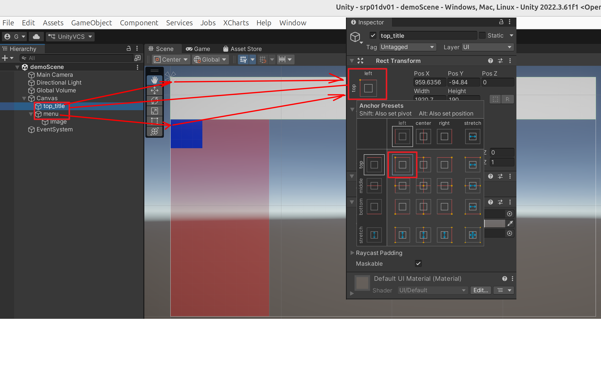

# 1.为什么 unity 工程ui设计也用来锚点，但是 一切换game视图的分辨率，UI还是乱了

你的UI在切换Game视图分辨率时仍然"乱了"，核心原因在于**Canvas Scaler组件的设置问题**。虽然你设置了锚点，但画布本身的缩放模式没有正确配置，导致UI元素无法根据屏幕尺寸自动调整。

## 核心问题：Canvas Scaler设置不当

**Canvas Scaler**是控制整个UI画布如何响应不同屏幕尺寸的关键组件。如果这里设置错误，即使单个UI元素的锚点设置正确，整个UI也会出现错位或缩放异常。

## 快速修复步骤

1. **选中Canvas对象**：在Hierarchy面板中找到Canvas

2. **检查Canvas Scaler组件**：
   - **UI Scale Mode**：必须设置为 **Scale With Screen Size**
   - **Reference Resolution**：设置为你的设计分辨率（如1920x1080）
   - **Screen Match Mode**：选择 **Match Width or Height**
   - **Match**：根据你的UI类型调整滑块（横屏游戏设为0，竖屏游戏设为1）

3. **验证效果**：在Game视图顶部的分辨率下拉菜单中切换不同设备分辨率，查看UI是否正常适配

## 常见错误场景

- **Constant Pixel Size模式**：UI元素保持固定像素大小，在高分辨率下会显得很小
- **Constant Physical Size模式**：按物理尺寸缩放，不适合游戏UI
- **Reference Resolution与设计不符**：导致UI整体缩放比例错误

## 锚点设置要点

确保每个UI元素的锚点与其定位逻辑匹配：
- 固定位置：锚点固定在父物体的某个角
- 水平拉伸：左右锚点分别吸附到父物体的左右边
- 垂直拉伸：上下锚点分别吸附到父物体的上下边
- 完全拉伸：四个锚点分别吸附到父物体的四个角

**总结**：锚点负责单个UI元素的相对定位，Canvas Scaler负责整个画布的缩放策略，两者必须配合使用才能实现完美的多分辨率适配。
##  **我的UI设计经验**
  (1) 设置 Canvas Scaler组件 
  (2) 注意： anchor 设置 top-left
    

=======================================
# 2.为什么 unity 工程ui设计也用来锚点，但是 一切换分辨率，UI还是乱了

这是一个非常常见且让 Unity 初学者头疼的问题。仅仅“使用”了锚点，并不等于“正确设置”了锚点。锚点的使用需要理解和遵循其核心逻辑。

你的UI切换分辨率时仍然“乱了”，通常是由于以下几个核心原因，我们可以一步步来分析：

### 核心原因分析（从最常见到不常见）

#### 1. **锚点预设选错（最常见！）**
   - **问题**：你点击了“锚点”按钮，但可能只是从预设里选择了错误的样式。**最常用的预设是底部/拉伸，但很多情况需要更具体的设置。**
   - **错误的做法**：将一个按钮的锚点设为左上角，然后通过 `PosX` 和 `PosY` 固定它的位置。当屏幕变宽或变高时，它距离左上角的像素距离不变，但屏幕比例变了，它看起来就会“跑偏”。
   - **正确的逻辑**：
     - **希望UI元素相对于父物体的某个角或边固定位置**：将锚点**重叠**在那个角或边上（例如四个小三角汇聚到左上角）。然后通过 `PosX`、`PosY` 或 `Left`、`Top` 等属性来设定**距离**。无论分辨率如何，它都会保持与那个角的固定距离。
     - **希望UI元素随着父物体（画布）一起拉伸**：将锚点**分别定位**在父物体的两条对应边上（例如左右两个锚点分别卡在父物体的左边和右边）。此时，`PosX` 和 `PosY` 会变为 `Left`、`Right`、`Top`、`Bottom`，你可以设置它与各边的距离。这样，当屏幕尺寸变化时，UI 元素会像弹簧一样被“撑开”或“压缩”。

#### 2. **画布（Canvas）的 Canvas Scaler 设置不当**
   锚点的“百分比”是相对于其父物体的。而父物体的尺寸由 **Canvas Scaler** 控制。如果这里设置不当，整个UI的缩放基准就错了。
   - **常用设置**：
     - **UI Scale Mode: Scale With Screen Size**（最常用，也最适合多分辨率适配）。
     - **Reference Resolution**：设定一个你设计UI时使用的基准分辨率（例如 1920x1080）。
     - **Screen Match Mode**：通常选择 `Match Width or Height`，并根据你的UI是更注重宽度（如横屏游戏）还是高度（如竖屏游戏）来调整滑块（0=匹配宽度，1=匹配高度，0.5=折中）。这个设置不当会导致UI在不同宽高比的屏幕上整体缩放不协调。

#### 3. **父物体没有正确适配**
   子物体的锚点是相对于其**直接父物体**的矩形区域。如果你的UI元素在一个空的 `Panel` 或 `Image` 下，而这个父物体本身没有正确适配屏幕，那么子物体无论怎么设锚点都没用。**确保UI层级中每一层父物体都正确设置了锚点和尺寸。**

#### 4. **使用了绝对像素值，而非相对值**
   即使设置了锚点，如果你在代码里或用动画等方式，直接修改了UI元素的 `rectTransform.anchoredPosition` 或 `rectTransform.sizeDelta` 等属性，且写死了像素值，这可能会覆盖锚点的行为。

### 快速自查与修复步骤

1.  **检查单个UI元素**：
    - 选中一个“乱了”的UI元素，观察它的 **Rect Transform** 组件。
    - 看它的**锚点**（四个小三角）在哪里。问自己：我希望它相对于父物体的哪个区域定位？
    - 观察属性是 `PosX/PosY` 还是 `Left/Right/Top/Bottom`。后者才是拉伸模式。

2.  **检查画布设置**：
    - 选中场景中的 **Canvas** 对象。
    - 查看 **Canvas Scaler** 组件。确保它设置为 `Scale With Screen Size`，并设定好你的设计分辨率。

3.  **使用正确的锚点工作流**（建议操作顺序）：
    a. **先拖拽UI元素到理想的位置和大小**（在设计分辨率下）。
    b. **然后，思考适配逻辑**：我希望它固定在某处，还是与四边联动？
    c. **最后，去设置锚点**：
       - 固定四角：点击锚点预设，选择对应的角落。
       - 水平方向拉伸：将左右两个锚点拖到父物体的左右两边。
       - 垂直方向拉伸：将上下两个锚点拖到父物体的上下两边。
       - 完全拉伸（充满）：将四个锚点拖到四个角上。
    d. 设置后，UI可能会移动，这时**使用 `Left/Right/Top/Bottom` 等属性微调它与边界的距离**，而不是用鼠标拖拽。

### 一个简单有效的适配策略（对于大多数情况）

- **背景图/全屏面板**：锚点**完全拉伸**，`Left/Right/Top/Bottom` 都设为 0。
- **标题/顶部栏**：锚点吸附在**顶部**并水平拉伸。锚点设为上边水平条，然后设置 `Top` 和 `Left`、`Right`。
- **底部按钮组**：锚点吸附在**底部**并水平拉伸。锚点设为下边水平条，然后设置 `Bottom` 和 `Left`、`Right`。
- **侧边菜单**：锚点吸附在**左边**并垂直拉伸。锚点设为左边垂直条，然后设置 `Left` 和 `Top`、`Bottom`。
- **一个始终在屏幕右上角的关闭按钮**：锚点固定在**右上角**，然后设置 `Pos X` 和 `Pos Y` 来微调与右上角的偏移。

**总结一下：问题的关键通常不在于“有没有用锚点”，而在于“锚点与屏幕边缘/父物体边的关联关系”是否设置得符合你的设计意图。** 花点时间理解锚点的逻辑，以后UI适配将事半功倍。
