Unity3D西安城市可视化数字孪生教程
2025-05-27 20:02:05
https://www.bilibili.com/video/BV1CejdzsEyS?spm_id_from=333.788.player.switch&vd_source=4212b105520112daf65694a1e5944e23&p=2

# 0西安城市可视化大屏数字孪生项目最终效果 
05:14


# 第1课：GIS数据坐标转换
10:29
## 1. QGIS：右键菜单 Export -> Save Features As...


=======================================================
# 第2课：GIS数据在Blender中生成城市建筑轮廓模型并优化
14:44
## 1. Blender4.4.1：安装BlenderGIS插件

```sh
$ git clone https://github.com/domlysz/BlenderGIS.git
```
将下载的BlendGIS文件夹 压缩成 BlenderGIS-master.zip

然后 Blender菜单 【Edit】-【Preferences】,在Preferences】 窗口中 
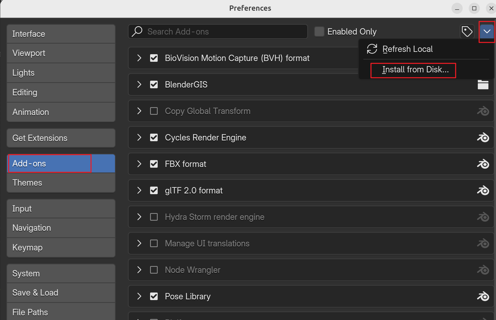 
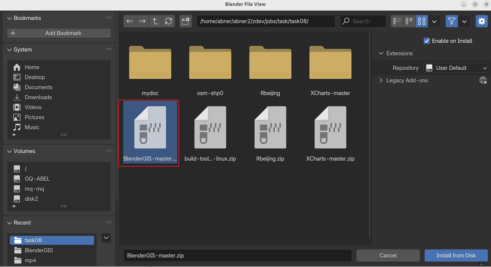 

## 2. Blender4.4.1：导入building数据并extrude
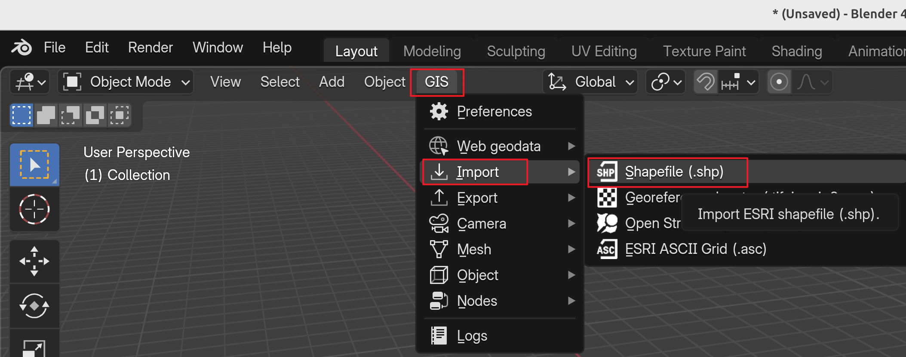

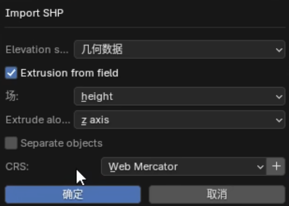

## 3.优化：减少点和面
### 3.1查看统计信息
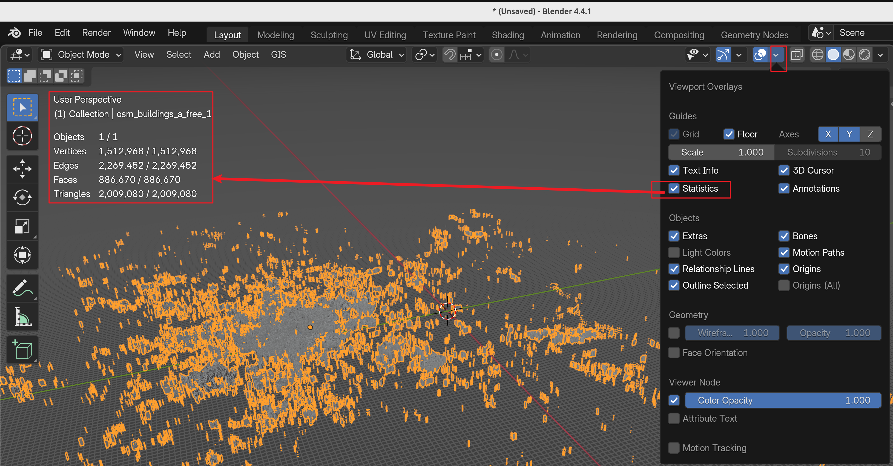

### 3.2 删除多余的点和面
Blender 进入Edit Mode --> 点击a键(选中所有点)--> 再点击m键（显示merge窗口）,
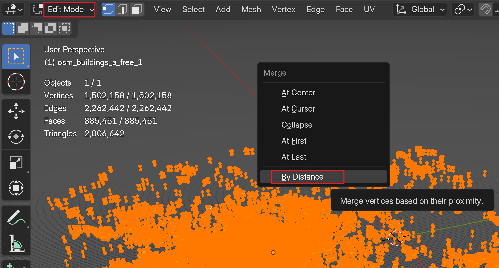.
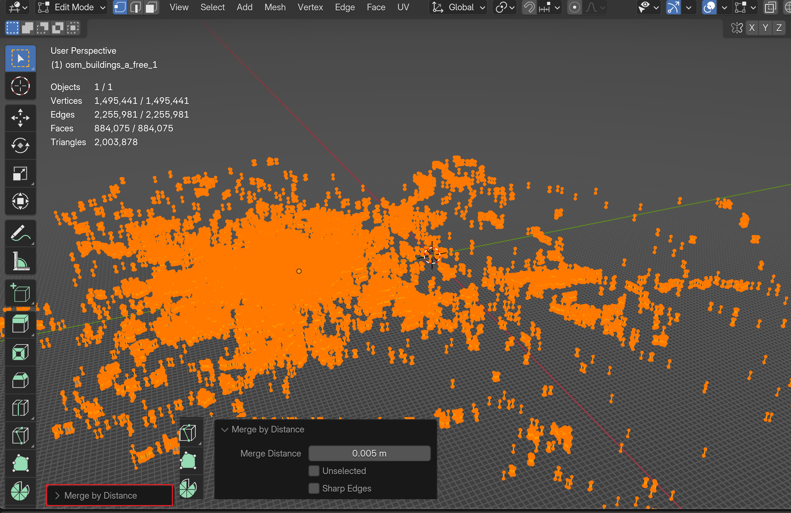.

**blender-mode-select** 
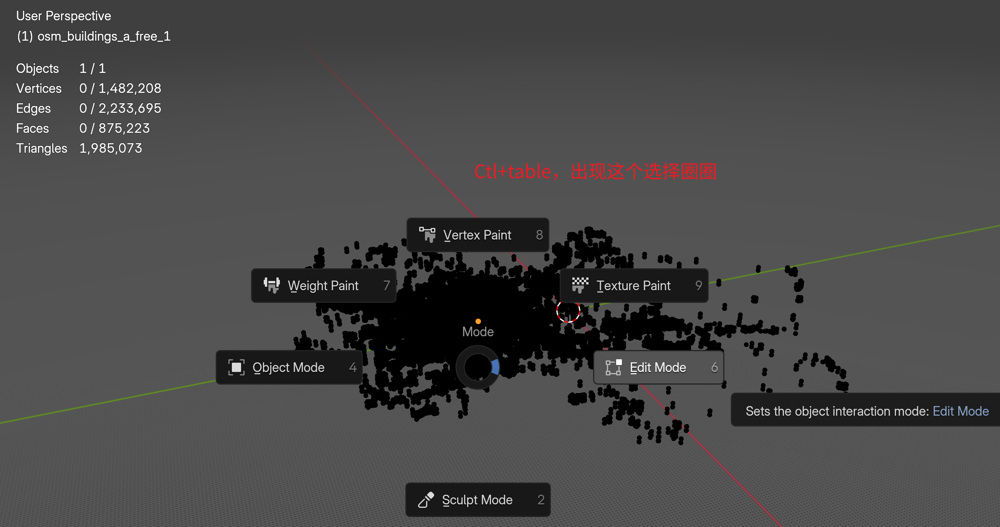.

=======================================================
# 第3课：道路水系GIS数据生成模型并优化模型面数
25:10

=======================================================
# 第4课：地铁线路及站点GIS数据生成模型并优化面数
19:56

=======================================================
# 第5课：地铁站点关联对应线路
13:40

=======================================================
# 第6课：场景模型材质设置
18:57

=======================================================
# 第7课：场景相机自由旋转缩放
19:02

=======================================================
# 第8课：地标建筑模型导入并调整材质
13:34

=======================================================
第9课：摄像机聚焦地标建筑特写
25:43

=======================================================
第10课：场景声纳特效添加设置
11:53

=======================================================
第11课：相机目标点移动后改变声纳特效位置
13:57

=======================================================

第12课：地标建筑碰撞体优化
05:43

=======================================================

# 第13课：菜单按钮组制作
10:05
## 菜单按钮组制作
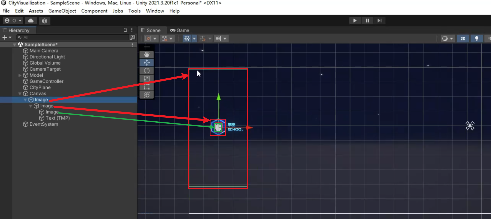
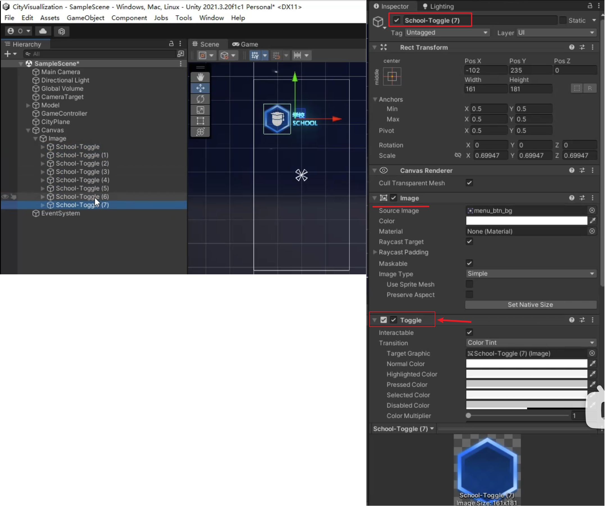
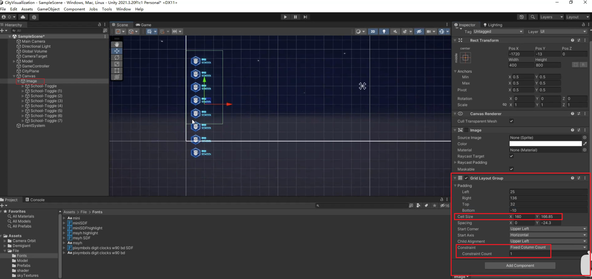
## 菜单按钮组 
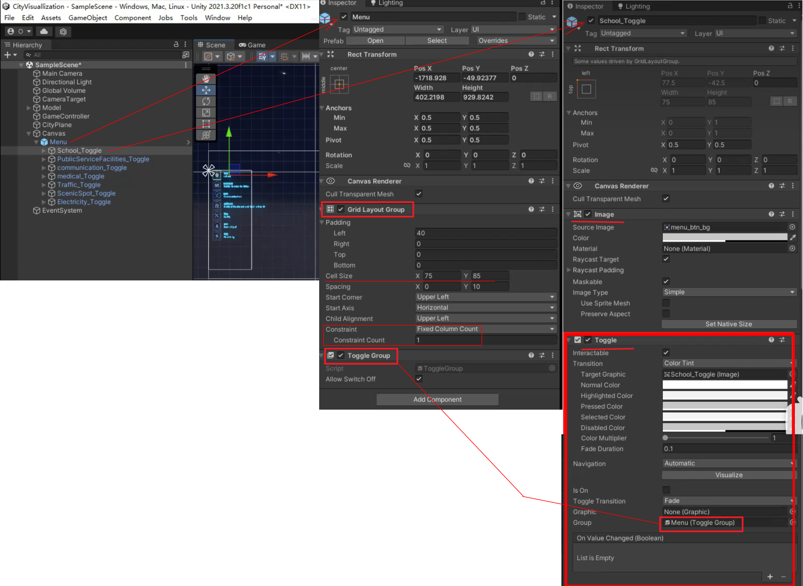
=======================================================
第14课：XCharts图表插件介绍
21:40

=======================================================
第15课：菜单按钮组点击切换及效果制作
19:06

=======================================================
第16课：菜单按钮控制图表面板动画播放进入退出
24:09

=======================================================
第17课：Excel文件转JSON数据及搭建本地服务器导入JSON数据
10:22

=======================================================
# 第18课：json数据转实体类及代码加载服务器json数据并解析
14:55
## 1. 站长工具：json生成实体类
https://tool.chinaz.com/tools/json2entity.aspx


# 第19课：学校模块图表数据绑定（一）
06:02

# 第20课：学校模块图表数据绑定（二）
29:22

第21课：代码重构

22:28
第22课：公共设施模块图表数据绑定
34:14
第23课：医疗卫生模块图表数据绑定
19:25
第24课：序列帧动画播放的两种方式
13:15
第25课：通讯模块图表数据绑定
18:14
第26课：交通模块图表数据绑定
29:41
第27课：地铁线路按钮交互逻辑代码编写
19:09
第28课：地铁线路按钮选中高亮显示线路名称
08:37
第29课：地铁8号线模型不显示问题修复
06:47
第30课：地铁站点标识牌UI制作及显示控制
36:13
第31课：地铁站点信息数据绑定及站点信息显示不正确问题解决
38:55
第32课：鼠标放在地铁站点信息面板上在UI上显示更多站点信息
37:42
第33课：地铁站点相机特写及站点信息面板声纳特效制作
16:43
第34课：地铁站点显示动画只执行一次问题修复
12:23
第35课：景区模块视频面板背景动画制作及直播视频播放视频流地址获取方式
30:43
第36课：景区模块视频窗口放大动画制作
21:09
第37课：切换地标建筑视角时更新对应地标景区直播视频画面
10:34
第38课：景区模块景点模型及信息展示
16:20
第39课：景区模块景点按钮点击后弹出面板显示对应景点模型信息
22:13
第40课：景点展示模块景点信息面板数据绑定
32:03
第41课：电力模块图表数据绑定
18:04
第42课：景点列表UI实例
09:58
第43课：项目标题UI制作及场景调整
21:21
第44课：Image组件高亮及扫光效果
26:16
第45课：时间天气温度UI制作及数据绑定
29:15
第46课：电视塔信号特效制作
15:53