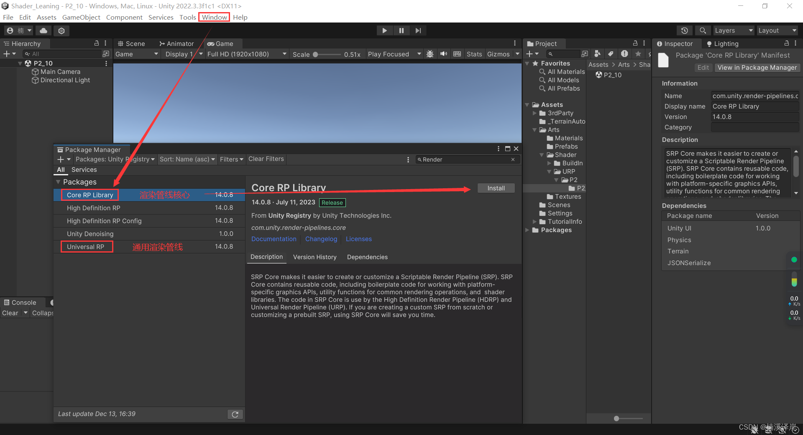
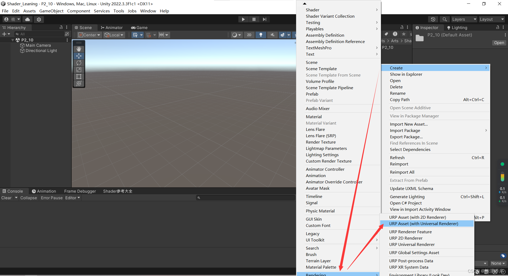
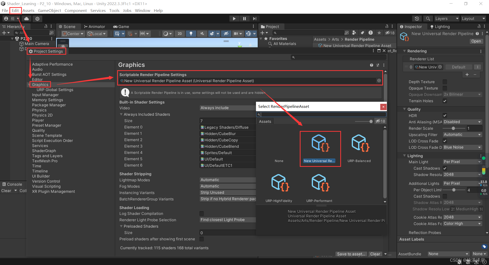
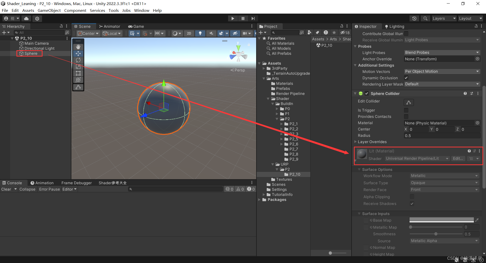
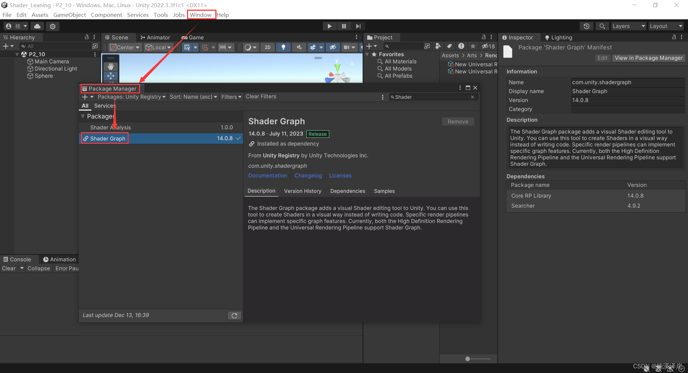
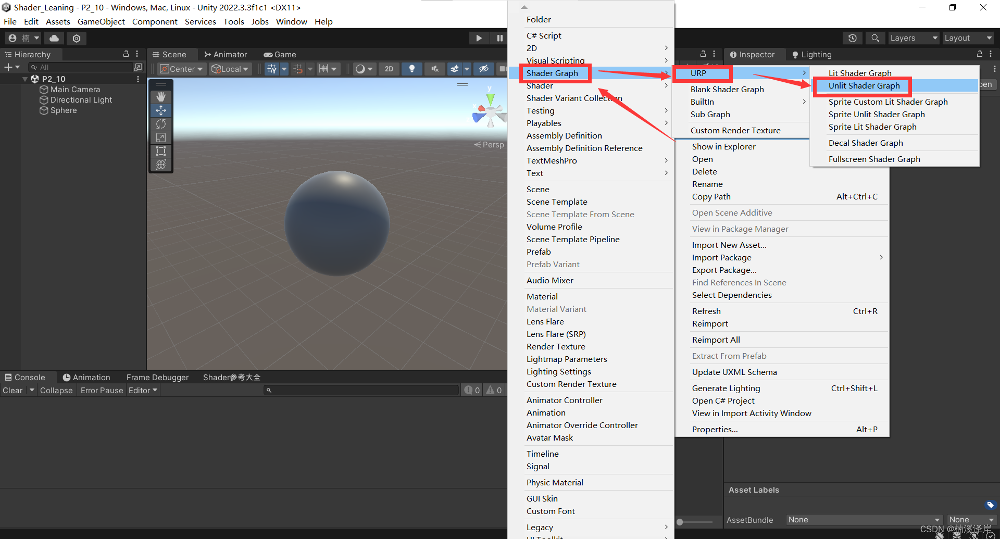
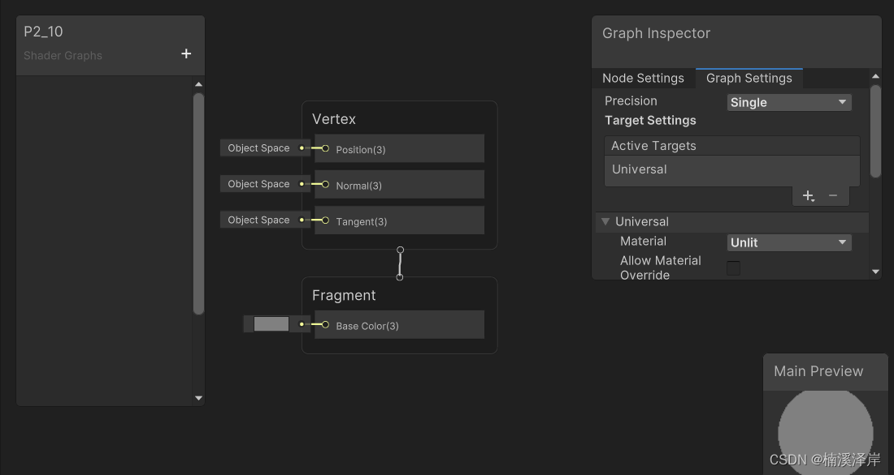

# Unity中Shader URP的安装与设置 {#articleContentId .title-article}

于 2023-12-13 17:28:54 首次发布

  
本文链接：[https://blog.csdn.net/qq_51603875/article/details/134975160] 
  
本文介绍了如何在Unity中安装和设置UniversalRenderPipeline(URP)，包括创建配置文件、修改渲染管线以及使用ShaderGraph进行效果调试的过程。

#### []{#t0}文章目录

-   [前言] 
-   [一、URP安装]
-   -   1、Window -\> Project Manager -\> 搜索Render

-   [二、URP设置]

-   -   [1、创建一个URP配置文件]
    -   [2、渲染管线的修改（当为空时，使用的是 BuildIn Render
        Pipeline）]
    -   [3、这时我们新建一个对象。使用的材质球默认使用 URP   默认Shader了]

-   [三、安装Shader
    Graph方便之后调试效果]
-   -   [1、Window -\> Project Manager -\> 搜索 Shader
        Graph]
    -   [2、我们尝试创建一个URP Unlit    ShaderGraph]
    -   [3、这是 Shader Graph 的基础模板]

------------------------------------------------------------------------

## 0.前言

我们在这篇文章中，来介绍一下[URP] 的安装 与 设置

------------------------------------------------------------------------

## 一、URP安装

###  1、Window -\> Project Manager -\> 搜索 Render

-   选择 Core Render Pipeline Library 安装
-   选择 Universal Render Pipeline 安装\
    

------------------------------------------------------------------------

##  二、URP设置

-   [Unity帮助文档](https://docs.unity3d.com/cn/Packages/com.unity.render-pipelines.universal@12.1/manual/universalrp-builtin-feature-comparison.html) 

### 1、创建一个URP配置文件

-   Create -\> Rendering -\> URP Assets(with Universal Render)\
    

### 2、[渲染管线]的修改（当为空时，使用的是 BuildIn Render Pipeline）

-   我们选择我们刚刚创建的 URP 配置文件\
    

###  3、这时我们新建一个对象。使用的材质球默认使用 URP 默认Shader了

内置渲染管线(BuildIn RP) 和 通用渲染管线(Universal
RP)在受灯光影响的Shader中，是不兼容的。

------------------------------------------------------------------------

## \三、安装[Shader Graph],方便之后调试效果

###  1、Window -\> Project Manager -\> 搜索 Shader Graph

###  2、我们尝试创建一个URP Unlit ShaderGraph

###  3、这是 Shader Graph 的基础[模板] 

我们使用Shader Graph **只是为了方便调试Shader效果。最终我们的Shader还是得以代码的形式编写**。
 