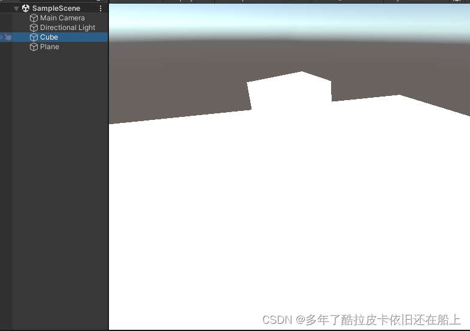

# 1.【unity基础】关于学习通用渲染管线(UniversalRenderPipeline)入门级的分享笔记  
相良宗介x  已于 2023-10-16 16:15:56 修改
  
本文链接：[https://blog.csdn.net/qq_41094072/article/details/131884750](https://blog.csdn.net/qq_41094072/article/details/131884750)
 
## 一、主要分享和学习的内容

        文章是学习入门级别的文章，定位偏向于个人学习笔记，文章内有错误的点希望大家理性指出，感谢各位。因为[URP]本身是一个比较杂的东西，涉及到的东西也非常的多，下面主要是对于[Unity] URP的创建、简单使用(资深级别使用起来可能会设计到渲染方方面面的知识，各种渲染效果，后处理等等)，相关概念，原理，源码解析，以及URP自带[Shader]脚本的解析(主要是Lit脚本)。

**简单枚举一下学习的内容:**
**1.URP的概念，创建和使用**
**2.URP的运行逻辑和源码解析**
**3.URP自带Shader脚本和Lit脚本涉及的渲染知识整理**

##  二、URP的概念，创建和使用

###  1.URP的概念

#### I.URP是什么

URP全称，Universal Render Pipeline 通用渲染管线，是SRP（Scriptable Render Pipeline，可编辑渲染管线）的一个模型，它的前身是LWRP（Light Weight Render Pipeline，轻量渲染管线），在Unity的2019.3版本中，正式将LWRP改名为URP，LWRP名字也正式退出了历史的舞台。URP主要是应用在移动端上面。

#### II.使用URP渲染管线的优势

**可扩展性**
Unity中最早提出SRP就是为了提高渲染管线的可编辑性，能够给用户提供管线自定义的空间以致\
满足不同项目的需求。而URP是SRP的一个模型，本身就对功能进行模块化了。这样我们可以添加不同的功能模块来满足对应的需求。

**性能对比**
[性能]上最大的区别就是URP是 **单Pass前向**渲染管线，而内置管线是**多Pass前向**渲染管线。所谓的前向渲染，就是在渲染物体受点光光照的时候，分别对每个点光对该物体产生的影响进行计算，最后将所有光的渲染结果相加得到最终物体的颜色。

内置管线的做法是，用多个pass来渲染光照，第一个pass只渲染主光源，然后多出来的光每个光用一个pass单独渲染。这也是为什么我们在做手游的时候很少会用点光源。因为对于内置管线来说，每多一盏光，整个场景的drawcall就会翻倍，这个性能开销基本是无法接受的。

URP的做法则是，在一个pass当中，对这个物体受到的所有光源通过一个for循环一次性计算。
* 这么做的好处有： 
一个物体的光照可以在一次DrawCall中计算完毕 
省去了多个Pass的上下文切换以及光栅化等开销 
* 但是这么做的坏处也很明显： 
只支持1盏直光 
单个物体最多支持4盏点光 
单个相机最多支持16盏灯光 

因此，有了URP之后，只要控制好点光的范围，我们在手游里面也可以做多点光照明了，例如释放一个火球照亮周围物件，这在内置管线里基本是可以放弃的功能

**支持SRP Batch** 
在所有SRP管线中，都可以使用SRP Batcher，这个功能可以将没有进行静态合并，也没法通过Instancing渲染的使用相同Shader的物体，通过CBuffer去保存每个物体材质球的参数，进而在不进行SetPassCall的情况下完成绘制。
这个功能的效果是，可以大幅降低相同DrawCall情况下单个DrawCall的开销，当这个功能开启的时候，你会发现，也许你的场景有500个DrawCall，但实际上SetPassCall只有不到100，在相同情况下的渲染性能是要高于内置管线不少的。不过Shader要支持SRP Batcher还是有些条件的，详细的大家去参考SRP Batcher的文档吧。

**容易对渲染功能的更新** 
打比方，我们使用内置渲染管线的功能而且要更新内置渲染管线的东西时候，需要对Unity版本的管线，但是我们使用URP的时候，只需要管线一下URP包就可以了。

### 2.Universal的安装，创建流程记录

步骤一，点击Unity菜单栏的window，打开下面的Package Manager 


步骤二，打开Package Manager面板后搜索Universal
RP，并且进行安装。等待安装结束即可 
 

步骤三，点击Unity菜单栏[Assets]-\>Create-\>Rendering-\>URP Asset(with Universal Renderer)，点击之后就可以创建出来了一个Asset文件和一个Data文件。关于Asset文件和Data文件的关系需要放到下面提一嘴。


步骤四，点击Unity菜单栏Project Setting。点击打开Project Setting面板的Graphics，把上个步骤创建好的URP的Asset资源文件放到下面截图的Scriptable Render Pipeline Setting上面，Unity会自动生成Universal RP的Global Setting文件和内置管线自带的Shader不能用的时候就表明成功了。


打开Framedebugger(window-\>analysis-\>framedebugger)就能看到对应的调用接口和自定义管线了。


### 3.Universal RP Asset和Universal RP Data

Universal RP Asset也就是拖拽进Project Setting面板的Graphics选项里面的Scriptable Render Pipeline Settings的资源文件，它是URP管线资产，也就是存放设置数据的地方可以进行各种设置。通过Unity的官方文档给出来的解释，我们可以认为Universal RP Asset是一个可编辑脚本的对象，其实是一个handler。比如说一个handler(Asset)打开阴影的设置，另外一个handler关闭阴影的设置，我们可以透过选择不同的handler(Asset)来实现不同需求，比如说移动端和PC端来说，移动端的性能较弱，实时阴影的性能开销高，那么就选择关闭阴影的handler(Asset)放置到Scriptable Render Pipeline Setting设置中。

这里主要整理一下URP的Asset文件设置的东西，当然这些东西可以通过Unity的URP文档中去查询。

#### I.Rendering项

这一项主要是设置控制渲染帧的核心部分。下面为该项设置的截图
\
**Depth Texture** 使URP可以创建_CameraDepthTexture。然后，URP为场景中所有摄像机都默认使用此深度纹理。可以在Camera的Inspector中为单个摄像机覆盖此项内容。

**Opaque Texture**启动此选项可为场景中所有摄像机都创建一个_CameraOpaqueTexture作为默认设置。此设置的功能很像内置渲染管线中的GrabPass。Opaque
Texture在URP渲染任何透明网格之前立即提供场景的快照。您可以在透明着色器使用它来创建毛玻璃、水折射或热浪等效果。

**Opaque Downsampling** 将不透明纹理上的采样模式设置为一下三个选项之一:
None：使用与摄像机相同的分辨率生成不透明通道的副本。
2x Bilinear：使用双线性滤波生成二分之一分辨率图像。
4x Box：使用盒状滤波生成四分之一分辨率图像。这会产生柔和模糊的副本。
4x Bilinear：使用双线性滤波生成四分之一分辨率图像。

**Terrain Holes**如果禁用此选项，URP 会在您针对 Unity Player 进行构建时移除所有地形孔洞着色器变体，从而减少构建时间。

#### II.Quality项

\
**HDR**启用此选项可以默认为场景中的每个摄像机以高动态范围 (HDR)执行渲染。使用 HDR 时，图像中最亮的部分可以大于1。这提供了更广泛的光强度，使光照看起来更逼真。有了它，即使在明亮的光线下，您仍然可以看到细节并获得更少的饱和度。如果需要多种光照或使用泛光效果，这非常有用。如果目标[硬件] 是低端硬件，可以禁用此属性以便跳过 HDR 计算，从而获得更好的性能。

**MSAA** 默认情况下，在渲染时为场景中的每个摄像机使用多重采样抗锯齿(Multi Sample Anti-aliasing)技术。这样可以柔化几何体的边缘，使它们不会出现锯齿状或闪烁现象。在下拉菜单中，选择每个像素使用的样本数：2x、4x 或 8x。选择的样本越多，对象边缘越平滑。如果想跳过 MSAA 计算，或者在 2D游戏中不需要此类计算，请选择 Disabled。注意：在不支持 StoreAndResolve 存储操作的移动平台上，如果在 URP 资源中选择了 Opaque Texture，Unity 会在运行时忽略 Anti Aliasing (MSAA) 属性（如同 Anti Aliasing (MSAA)设置为 Disabled 一样）。

**Render Scale**
此滑动条用于缩放渲染目标分辨率（而不是当前设备的分辨率）。如果出于性能原因要以较小的分辨率进行渲染或需要升级渲染来提高质量，请使用此属性。这只会缩放游戏渲染。UI渲染保留采用设备的原始分辨率。

**Lighting**\
\
这些设置会影响场景中的光源。
如果禁用其中某些设置，则会从着色器变量中剥离相关的关键字。如果您确定不会在游戏或应用程序中使用某些设置，则可以禁用它们来提高性能并缩短构建时间。

**Main Light** 这些设置会影响场景中的主方向光。为选择此项，可以在Lighting Inspector 中将其指定为 Sun Source。如果不指定太阳光源 (SunSource)，URP 会将场景中最亮的方向光视为主光源。可以在Pixel Lighting 和 None 选项之间进行选择。如果选择None，即使设置了太阳光源，URP 也不会渲染主光源。

**Cast Shadows** 选中此复选框可以使主光源在场景中投射阴影。

**Shadow Resolution** 此属性可以控制主光源的阴影贴图纹理的大小。高分辨率可提供更清晰、细节更多的阴影。如果内存或渲染时间受限，请尝试降低分辨率。

**Additional Lights** 在此处可以选择附加的光源来补充主光源。选项包括 Per Vertex、Per Pixel 和 Disabled。
关于阴影故障排除我会另外写一篇学习文章。

**Per Object Limit**
此滑动条可以设置影响每个游戏对象的附加光源数量限制。

#### III.Shadows项

这些设置可让您配置阴影的外观和行为方式，并在视觉质量和性能之间找到良好的平衡。\
\
**Max Distance** Unity 渲染阴影时与摄像机之间的最大距离。Unity
不会渲染超出此距离的阴影。\
注意：此属性采用公制单位，无论 Working Unit 属性中的值如何，均是如此。

**Working Unit** Unity 度量阴影级联距离的单位。

**Depth Bias** 使用此设置可减轻阴影暗斑。

**Normal Bias** 使用此设置可减轻阴影暗斑。

**Cascade Count** 阴影级联的数量。使用阴影级联可以避免靠近摄像机的阴影过于粗糙，并使阴影分辨率保持在合理的较低值。有关更多信息，请参阅阴影级联页面。增加级联数会降低性能。级联设置仅影响主光源。

**Soft Shadows** 
选中此复选框可启用对阴影贴图的额外处理，以使它们看起来更平滑。
启用后，Unity 使用以下阴影贴图过滤方法：
桌面平台：5x5 帐篷过滤器，移动平台：4 抽头过滤器。
性能影响：高。
禁用此选项后，Unity 会使用默认的硬件过滤方法对阴影贴图进行一次采样。

####  IV.Post-processing项

此部分用于微调全局后期处理设置。
**Post Processing** 此复选框为当前 URP资源开启（选中复选框）或关闭（清除复选框）后期处理。
如果清除此复选框，Unity会从构建中排除后期处理着色器和纹理，除非以下条件之一成立：
构建中的其他资源是指与后期处理相关的资源。
另一个 URP 资源启用了 Post Processing 属性。

**Post Process Data** 该资源引用了供渲染器用于后期处理的着色器和纹理。
注意：只有高级自定义用例才需要更改此属性。

**Grading Mode** 选择要用于项目的颜色分级模式。
• High Dynamic Range：此模式最适合类似于电影制作工作流程的高精度分级。Unity
在色调映射之前应用颜色分级。
• Low Dynamic Range：此模式遵循更经典的工作流程。Unity在色调映射之后应用有限范围的颜色分级。

**LUT Size** 设置通用渲染管线用于颜色分级的内部和外部查找纹理 (LUT)的大小。更大的大小提供更高的精度，但有潜在的性能和内存使用成本。不能混合和搭配LUT 大小，因此请在开始颜色分级过程之前确定好大小。
默认值为 32，可以确保速度与质量之间的良好平衡。

## 三、URP的运行逻辑，原理和源码解析记录

### 1.关于SRP的自定义管线

在阅读URP的代码之前，需要对SRP进行一遍熟悉。
首先我们可以通过一下代码进行SRP的Asset文件的创建

```c#
[CreateAssetMenu(menuName = "Rendering/Custom Render Pipeline")]
public class CustomRenderPipelineAsset : RenderPipelineAsset
{
    protected override RenderPipeline CreatePipeline()
    {
        return new CutomRenderPipeline();
    }
}

public class CutomRenderPipeline : RenderPipeline
{
    protected override void Render(ScriptableRenderContext context, Camera[] cameras)
    {
        
    }
} 
```

创建好以上的两个脚本之后，就可以直接创建一个CustomRenderPipeline的一个Asset文件了，点击Unity的工具栏里面的Assets/Create/Rendering/CustomRenderPipeline进行对Asset文件进行创建，创建好再把创建好的Asset文件配置到Project Settings面板的Graphics选项里面的Scriptable Render Pipeline Settings里面。如下图:\
\
切换Scriptable Render Pipeline Settings成功之后，Unity的Scene面板和Game面板什么都没有就说明切换成功了，这个时候需要我们去编写一下CutomRenderPipeline 脚本里面的Render方法，对渲染指令进行提交等操作。现在我们看一下CutomRenderPipeline重写的Render方法，参数为ScriptableRenderContext和Camera数组，其实我可以理解为这里的ScriptableRenderContext 是一个配置，Camera数组里面的所有相机都会使用ScriptableRenderContext的对象进行渲染流程。更改CutomRenderPipeline的Render方法之后，代码如下:

```C#
public class CutomRenderPipeline : RenderPipeline
{
    protected override void Render(ScriptableRenderContext context, Camera[] cameras)
    {
        //把当前摄像机的属性设置到全局的Shader属性中(比如view矩阵，project矩阵等数据)
        context.SetupCameraProperties(cameras[0]);
        
        //配置完摄像机属性后，利用摄像机属性对天空盒子的绘制
        context.DrawSkybox(cameras[0]);
        
        //把当前进行过的命令进行一次提交
        context.Submit();
    }
}
1234567891011121314AI写代码
```

这样我们就能把天空盒子给绘制出来了。\


### 2.关于CommandBuffer

CommandBuffer-\>命令缓冲，其实CommandBuffer对象就是用来收集CPU向GPU发送的渲染指令，把需要进行的指令在一个合适的时间点里面对GPU进行发送。CommandBuffer的对象一般是通过CommandBufferPool进行实例化的，这里稍微修改一下CustomPipeline的Render方法，代码如下:

```C#
public class CutomRenderPipeline : RenderPipeline
{
    private string m_commandBufferName = "我是一个测试用的CommandBuffer";
    protected override void Render(ScriptableRenderContext context, Camera[] cameras)
    {
        CommandBuffer cmd = CommandBufferPool.Get(m_commandBufferName);
        //把当前摄像机的属性设置到全局的Shader属性中(比如view矩阵，project矩阵等数据)
        context.SetupCameraProperties(cameras[0]);
        //对RT的深度缓存，颜色缓存进行清理
        cmd.ClearRenderTarget(true,true,Color.clear);
        //执行buffer
        context.ExecuteCommandBuffer(cmd);
        //清理
        cmd.Clear();
        //配置完摄像机属性后，利用摄像机属性对天空盒子的绘制
        context.DrawSkybox(cameras[0]);
        //把当前进行过的命令进行一次提交
        context.Submit(); 
    }
} 
```

上面仅仅是使用CommandBuffer对象进行了清理render target原理颜色上的清理。

### 3.绘制当前相机观察的物体

下面会对场景上的物体进行渲染处理，我们首先得对摄像机不能看到的东西进行剔除，虽然GPU也会方面剔除，在程序这边剔除能减少一下CPU和GPU之间的通讯带宽压力，故编写如下代码

```C#
private bool Cull(ScripttableRenderContext context,Camera camera){
    if(camera.tryGetCullingParameters(out ScriptableCullingParameters p)){
        m_cullingResults = context.Cull(ref p);
        return true;
    }
    
    return false;
} 
```

修改后CustomRenderPipeline类的整体代码为

```C#
public class CutomRenderPipeline : RenderPipeline
{
    private string m_commandBufferName = "我是一个测试用的CommandBuffer";
    private static ShaderTagId m_unlitShaderTagId = new ShaderTagId("SRPDefaultUnlit");
    private CullingResults m_cullingResults;

    protected override void Render(ScriptableRenderContext context, Camera[] cameras)
    {
        if (!Cull(context, cameras[0]))
        {
            return;
        }
        Setup(context,cameras[0]);
        DrawVisibleGeometry(context, cameras[0]);
        DrawSkyBox(context,cameras[0]);
        context.Submit();
    }

    private bool Cull(ScriptableRenderContext context, Camera camera)
    {
        if (camera.TryGetCullingParameters(out ScriptableCullingParameters p))
        {
            m_cullingResults = context.Cull(ref p);
            return true;
        }

        return false;
    }

    private void Setup(ScriptableRenderContext context, Camera camera)
    {
        context.SetupCameraProperties(camera);
        CommandBuffer cmd = CommandBufferPool.Get(m_commandBufferName);
        cmd.ClearRenderTarget(true, true, Color.clear);
        context.ExecuteCommandBuffer(cmd);
        cmd.Clear();
    }

    //绘制图像
    private void DrawVisibleGeometry(ScriptableRenderContext context, Camera camera)
    {
        var sortingSetting = new SortingSettings(camera);
        var drawingSetting = new DrawingSettings(m_unlitShaderTagId, sortingSetting);
        var filteringSetting = new FilteringSettings(RenderQueueRange.all);
        context.DrawRenderers(m_cullingResults, ref drawingSetting, ref filteringSetting);  
    }
    
    //绘制天空盒子
    private void DrawSkyBox(ScriptableRenderContext context, Camera camera)
    {
        context.DrawSkybox(camera);
    }
} 
```

由上面的代码，因为这个时候点击打开Frame Debug，发现确实会对物体进行了渲染。 
\
但是这里发现物体的材质Shader出现物体了。\
\
这是因为我上面的代码选择使用SRPDefaultUnlit的pass进行着色，而因为安装的URP的包，所以目前场景默认使用的材质都是Lit，Lit的pass的名字叫ForwardLit，因为目前要使用SPRDefaultUnlit进行着色的话，需要我们重新制作一个材质，那就是，我们选择无光照的Color/Unlit即可。如下两张图:\
\
\
到这里SRP脚本就完成了简单的编写学习。当然更详细的可以去参考Catlike
Coding里面查看，里面说明更加详细，会更加详细说明多相机处理，多个层级剔除，半透明渲染和不透明渲染等等的说明介绍。

###  3.慢慢剖析URP运行逻辑和原理

这一小节主要是记录一下个人在阅读URP[源代码] 的时候的一些心得。
先来点看开一下Unity下载的包，里面有Editor文件和Runtime文件还有其他的shader文件、shader库等等。其实这里主要是查看一下Runtime文件里面的代码，Editor其实是对Unity进行自定义编辑进行扩展的代码。

在启动游戏之后打开Frame Debuger，会看到我抓了一帧之后他所执行的东西

我们可以看到我们只有一个主相机所以我们的URP执行了主相机相关的渲染命令，添加另外一个相机的时候会发现URP会多执行另外一个摄像机的渲染命令，这里肯定是对所有相机都执行了一次遍历。首先，我们在第二节简单的学习了一下SRP扩展的编写，我们首先找到URP里面继承了RenderPipeline的类，因为基本上自定义渲染管线以继承RenderPipelineAsset为入口创建RenderPipeline类的子类对象，再通过重写Render方法去进行提交渲染指令。这里我们先找到UniversalRenderPipelineAsset类，再看看里面的CreatePipeline()方法如下:

```C#
protected override RenderPipeline CreatePipeline()
        {
            if (m_RendererDataList == null)
                m_RendererDataList = new ScriptableRendererData[1];

            // If no default data we can't create pipeline instance
            if (m_RendererDataList[m_DefaultRendererIndex] == null)
            {
                // If previous version and current version are miss-matched then we are waiting for the upgrader to kick in
                if (k_AssetPreviousVersion != k_AssetVersion)
                    return null;

                if (m_RendererDataList[m_DefaultRendererIndex].GetType().ToString()
                    .Contains("Universal.ForwardRendererData"))
                    return null;

                Debug.LogError(
                    $"Default Renderer is missing, make sure there is a Renderer assigned as the default on the current Universal RP asset:{UniversalRenderPipeline.asset.name}",
                    this);
                return null;
            }

            DestroyRenderers();
            var pipeline = new UniversalRenderPipeline(this);
            CreateRenderers();

            // Blitter can only be initialized after renderers have been created and ResourceReloader has been
            // called on potentially empty shader resources
            foreach (var data in m_RendererDataList)
            {
                if (data is UniversalRendererData universalData)
                {
                    Blitter.Initialize(universalData.shaders.coreBlitPS, universalData.shaders.coreBlitColorAndDepthPS);
                    break;
                }
            }

            return pipeline;
        } 
```

可以看到里面都是一些获取Universal URP data的一些操作。这里往下查看一下创建的UniversalRenderPipeline，主要是再看这个方法的Render方法都做了些什么操作。

```C#
#if UNITY_2021_1_OR_NEWER
        /// <inheritdoc/>
        protected override void Render(ScriptableRenderContext renderContext, List<Camera> cameras)
#else
        /// <inheritdoc/>
        protected override void Render(ScriptableRenderContext renderContext, Camera[] cameras)
#endif
        {
#if RENDER_GRAPH_ENABLED
            useRenderGraph = asset.enableRenderGraph;
#else
            useRenderGraph = false;
#endif

            SetHDRState(cameras);

            // When HDR is active we render UI overlay per camera as we want all UI to be calibrated to white paper inside a single pass
            // for performance reasons otherwise we render UI overlay after all camera
            SupportedRenderingFeatures.active.rendersUIOverlay = HDROutputIsActive();

            // TODO: Would be better to add Profiling name hooks into RenderPipelineManager.
            // C#8 feature, only in >= 2020.2
            using var profScope = new ProfilingScope(null, ProfilingSampler.Get(URPProfileId.UniversalRenderTotal));

#if UNITY_2021_1_OR_NEWER
            using (new ProfilingScope(null, Profiling.Pipeline.beginContextRendering))
            {
                BeginContextRendering(renderContext, cameras);
            }
#else
            using (new ProfilingScope(null, Profiling.Pipeline.beginFrameRendering))
            {
                BeginFrameRendering(renderContext, cameras);
            }
#endif

            GraphicsSettings.lightsUseLinearIntensity = (QualitySettings.activeColorSpace == ColorSpace.Linear);
            GraphicsSettings.lightsUseColorTemperature = true;
            GraphicsSettings.defaultRenderingLayerMask = k_DefaultRenderingLayerMask;
            SetupPerFrameShaderConstants();
            XRSystem.SetDisplayMSAASamples((MSAASamples)asset.msaaSampleCount);

#if UNITY_EDITOR
            // We do not want to start rendering if URP global settings are not ready (m_globalSettings is null)
            // or been deleted/moved (m_globalSettings is not necessarily null)
            if (m_GlobalSettings == null || UniversalRenderPipelineGlobalSettings.instance == null)
            {
                m_GlobalSettings = UniversalRenderPipelineGlobalSettings.Ensure();
                if(m_GlobalSettings == null) return;
            }
#endif

#if DEVELOPMENT_BUILD || UNITY_EDITOR
            if (DebugManager.instance.isAnyDebugUIActive)
                UniversalRenderPipelineDebugDisplaySettings.Instance.UpdateFrameTiming();
#endif

            SortCameras(cameras);
#if UNITY_2021_1_OR_NEWER
            for (int i = 0; i < cameras.Count; ++i)
#else
            for (int i = 0; i < cameras.Length; ++i)
#endif
            {
                var camera = cameras[i];
                if (IsGameCamera(camera))
                {
                    RenderCameraStack(renderContext, camera);
                }
                else
                {
                    using (new ProfilingScope(null, Profiling.Pipeline.beginCameraRendering))
                    {
                        BeginCameraRendering(renderContext, camera);
                    }
#if VISUAL_EFFECT_GRAPH_0_0_1_OR_NEWER
                    //It should be called before culling to prepare material. When there isn't any VisualEffect component, this method has no effect.
                    VFX.VFXManager.PrepareCamera(camera);
#endif
                    UpdateVolumeFramework(camera, null);

                    RenderSingleCameraInternal(renderContext, camera);

                    using (new ProfilingScope(null, Profiling.Pipeline.endCameraRendering))
                    {
                        EndCameraRendering(renderContext, camera);
                    }
                }
            }

            s_RenderGraph.EndFrame();

#if UNITY_2021_1_OR_NEWER
            using (new ProfilingScope(null, Profiling.Pipeline.endContextRendering))
            {
                EndContextRendering(renderContext, cameras);
            }
#else
            using (new ProfilingScope(null, Profiling.Pipeline.endFrameRendering))
            {
                EndFrameRendering(renderContext, cameras);
            }
#endif

#if ENABLE_SHADER_DEBUG_PRINT
            ShaderDebugPrintManager.instance.EndFrame();
#endif
        } 
```

根据上面代码首先对HDR的状态进行设置，进行一些状态上的设置。Render最核心的内容无非就是BeginRender(开始渲染)---\>遍历摄像机数组\-\-\--\>EndRendering(结束渲染)\
而遍历摄像机里面主要又是把主相机和堆叠相机分开处理(堆叠相机可以看下面相关的资料官方的手册描述的很清楚),如果是堆叠相机就正常走完流程
BeginCamera -\> RenderingCamera -\>EndCamera，RenderingCamera
这过程基本上都是发生在RenderCameraStack方法里面，这里主要是研究一下摄像机内部循环里面这段代码判断。上面这段代码可以看到，只要是游戏的相机基本上都会进入RenderCameraStack方法里面，下面是RenderCameraStack方法代码片段，下面主要要做的东西基本是找到堆叠相机的最后一个相机，让相机堆叠里面的最后一个相机为最终输出屏幕的相机，其他的相机都输出到，毫无疑问里面底层都是使用CommandBuff收集命令，通过CommadBuff和Context提交命令，使用一个RT放前面相机的输入颜色，最终把最后一个相机作为输出的最终相机。

```C#
/// <summary>
        /// Renders a camera stack. This method calls RenderSingleCamera for each valid camera in the stack.
        /// The last camera resolves the final target to screen.
        /// </summary>
        /// <param name="context">Render context used to record commands during execution.</param>
        /// <param name="camera">Camera to render.</param>
        static void RenderCameraStack(ScriptableRenderContext context, Camera baseCamera)
        {
            using var profScope = new ProfilingScope(null, ProfilingSampler.Get(URPProfileId.RenderCameraStack));

            baseCamera.TryGetComponent<UniversalAdditionalCameraData>(out var baseCameraAdditionalData);

            // Overlay cameras will be rendered stacked while rendering base cameras
            if (baseCameraAdditionalData != null && baseCameraAdditionalData.renderType == CameraRenderType.Overlay)
                return;

            // Renderer contains a stack if it has additional data and the renderer supports stacking
            // The renderer is checked if it supports Base camera. Since Base is the only relevant type at this moment.
            var renderer = baseCameraAdditionalData?.scriptableRenderer;
            bool supportsCameraStacking = renderer != null && renderer.SupportsCameraStackingType(CameraRenderType.Base);
            List<Camera> cameraStack = (supportsCameraStacking) ? baseCameraAdditionalData?.cameraStack : null;

            bool anyPostProcessingEnabled = baseCameraAdditionalData != null && baseCameraAdditionalData.renderPostProcessing;
            int rendererCount = asset.m_RendererDataList.Length;

            // We need to know the last active camera in the stack to be able to resolve
            // rendering to screen when rendering it. The last camera in the stack is not
            // necessarily the last active one as it users might disable it.
            int lastActiveOverlayCameraIndex = -1;
            if (cameraStack != null)
            {
                var baseCameraRendererType = baseCameraAdditionalData?.scriptableRenderer.GetType();
                bool shouldUpdateCameraStack = false;

                cameraStackRequiresDepthForPostprocessing = false;

                for (int i = 0; i < cameraStack.Count; ++i)
                {
                    Camera currCamera = cameraStack[i];
                    if (currCamera == null)
                    {
                        shouldUpdateCameraStack = true;
                        continue;
                    }

                    if (currCamera.isActiveAndEnabled)
                    {
                        currCamera.TryGetComponent<UniversalAdditionalCameraData>(out var data);

                        // Checking if the base and the overlay camera is of the same renderer type.
                        var currCameraRendererType = data?.scriptableRenderer.GetType();
                        if (currCameraRendererType != baseCameraRendererType)
                        {
                            Debug.LogWarning("Only cameras with compatible renderer types can be stacked. " +
                                             $"The camera: {currCamera.name} are using the renderer {currCameraRendererType.Name}, " +
                                             $"but the base camera: {baseCamera.name} are using {baseCameraRendererType.Name}. Will skip rendering");
                            continue;
                        }

                        var overlayRenderer = data.scriptableRenderer;
                        // Checking if they are the same renderer type but just not supporting Overlay
                        if ((overlayRenderer.SupportedCameraStackingTypes() & 1 << (int)CameraRenderType.Overlay) == 0)
                        {
                            Debug.LogWarning($"The camera: {currCamera.name} is using a renderer of type {renderer.GetType().Name} which does not support Overlay cameras in it's current state.");
                            continue;
                        }

                        if (data == null || data.renderType != CameraRenderType.Overlay)
                        {
                            Debug.LogWarning($"Stack can only contain Overlay cameras. The camera: {currCamera.name} " +
                                             $"has a type {data.renderType} that is not supported. Will skip rendering.");
                            continue;
                        }

                        cameraStackRequiresDepthForPostprocessing |= CheckPostProcessForDepth();

                        anyPostProcessingEnabled |= data.renderPostProcessing;
                        lastActiveOverlayCameraIndex = i;
                    }
                }
                if (shouldUpdateCameraStack)
                {
                    baseCameraAdditionalData.UpdateCameraStack();
                }
            }

            // Post-processing not supported in GLES2.
            anyPostProcessingEnabled &= SystemInfo.graphicsDeviceType != GraphicsDeviceType.OpenGLES2;

            bool isStackedRendering = lastActiveOverlayCameraIndex != -1;

            // Prepare XR rendering
            var xrActive = false;
            var xrRendering = baseCameraAdditionalData?.allowXRRendering ?? true;
            var xrLayout = XRSystem.NewLayout();
            xrLayout.AddCamera(baseCamera, xrRendering);

            // With XR multi-pass enabled, each camera can be rendered multiple times with different parameters
            foreach ((Camera _, XRPass xrPass) in xrLayout.GetActivePasses())
            {
                if (xrPass.enabled)
                {
                    xrActive = true;
                    UpdateCameraStereoMatrices(baseCamera, xrPass);
                }


                using (new ProfilingScope(null, Profiling.Pipeline.beginCameraRendering))
                {
                    BeginCameraRendering(context, baseCamera);
                }
                // Update volumeframework before initializing additional camera data
                UpdateVolumeFramework(baseCamera, baseCameraAdditionalData);
                InitializeCameraData(baseCamera, baseCameraAdditionalData, !isStackedRendering, out var baseCameraData);
                RenderTextureDescriptor originalTargetDesc = baseCameraData.cameraTargetDescriptor;

#if ENABLE_VR && ENABLE_XR_MODULE
                if (xrPass.enabled)
                {
                    baseCameraData.xr = xrPass;

                    // Helper function for updating cameraData with xrPass Data
                    // Need to update XRSystem using baseCameraData to handle the case where camera position is modified in BeginCameraRendering
                    UpdateCameraData(ref baseCameraData, baseCameraData.xr);

                    // Handle the case where camera position is modified in BeginCameraRendering
                    xrLayout.ReconfigurePass(baseCameraData.xr, baseCamera);
                    XRSystemUniversal.BeginLateLatching(baseCamera, baseCameraData.xrUniversal);
                }
#endif
                // InitializeAdditionalCameraData needs to be initialized after the cameraTargetDescriptor is set because it needs to know the
                // msaa level of cameraTargetDescriptor and XR modifications.
                InitializeAdditionalCameraData(baseCamera, baseCameraAdditionalData, !isStackedRendering, ref baseCameraData);

#if VISUAL_EFFECT_GRAPH_0_0_1_OR_NEWER
                //It should be called before culling to prepare material. When there isn't any VisualEffect component, this method has no effect.
                VFX.VFXManager.PrepareCamera(baseCamera);
#endif
#if ADAPTIVE_PERFORMANCE_2_0_0_OR_NEWER
                if (asset.useAdaptivePerformance)
                    ApplyAdaptivePerformance(ref baseCameraData);
#endif
                // update the base camera flag so that the scene depth is stored if needed by overlay cameras later in the frame
                baseCameraData.postProcessingRequiresDepthTexture |= cameraStackRequiresDepthForPostprocessing;

                RenderSingleCamera(context, ref baseCameraData, anyPostProcessingEnabled);
                using (new ProfilingScope(null, Profiling.Pipeline.endCameraRendering))
                {
                    EndCameraRendering(context, baseCamera);
                }

                // Late latching is not supported after this point
                if (baseCameraData.xr.enabled)
                    XRSystemUniversal.EndLateLatching(baseCamera, baseCameraData.xrUniversal);

                if (isStackedRendering)
                {
                    for (int i = 0; i < cameraStack.Count; ++i)
                    {
                        var currCamera = cameraStack[i];
                        if (!currCamera.isActiveAndEnabled)
                            continue;

                        currCamera.TryGetComponent<UniversalAdditionalCameraData>(out var currAdditionalCameraData);
                        // Camera is overlay and enabled
                        if (currAdditionalCameraData != null)
                        {
                            // Copy base settings from base camera data and initialize initialize remaining specific settings for this camera type.
                            CameraData overlayCameraData = baseCameraData;
                            overlayCameraData.camera = currCamera;
                            overlayCameraData.baseCamera = baseCamera;

                            UpdateCameraStereoMatrices(currAdditionalCameraData.camera, xrPass);

                            using (new ProfilingScope(null, Profiling.Pipeline.beginCameraRendering))
                            {
                                BeginCameraRendering(context, currCamera);
                            }
#if VISUAL_EFFECT_GRAPH_0_0_1_OR_NEWER
                            //It should be called before culling to prepare material. When there isn't any VisualEffect component, this method has no effect.
                            VFX.VFXManager.PrepareCamera(currCamera);
#endif
                            UpdateVolumeFramework(currCamera, currAdditionalCameraData);

                            bool lastCamera = i == lastActiveOverlayCameraIndex;
                            InitializeAdditionalCameraData(currCamera, currAdditionalCameraData, lastCamera, ref overlayCameraData);

                            xrLayout.ReconfigurePass(overlayCameraData.xr, currCamera);

                            RenderSingleCamera(context, ref overlayCameraData, anyPostProcessingEnabled);

                            using (new ProfilingScope(null, Profiling.Pipeline.endCameraRendering))
                            {
                                EndCameraRendering(context, currCamera);
                            }
                        }
                    }
                }

                if (baseCameraData.xr.enabled)
                    baseCameraData.cameraTargetDescriptor = originalTargetDesc;
            }

            if (xrActive)
            {
                CommandBuffer cmd = CommandBufferPool.Get();
                XRSystem.RenderMirrorView(cmd, baseCamera);
                context.ExecuteCommandBuffer(cmd);
                context.Submit();
                CommandBufferPool.Release(cmd);
            }

            XRSystem.EndLayout();
        }
 
```

##  四、URP自带Shader脚本和Lit脚本涉及的渲染知识整理

后面整理。

## 五、相关资料阅读链接

[Unity官方阅读Universal RP文档](https://docs.unity3d.com/Packages/com.unity.render-pipelines.universal@14.0/manual/index.html) 
[Unity Universal RP Manual手册](https://docs.unity3d.com/cn/2021.2/Manual/universal-render-pipeline.html){rel="nofollow"} 
[Catlike Coding的Scriptable RP教程](https://catlikecoding.com/unity/tutorials/custom-srp/) 
[走进LWRP（UniversalRP）的世界](https://blog.csdn.net/yinfourever/article/details/104799430/)
   
  