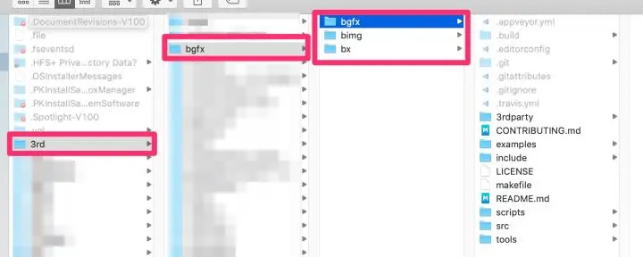
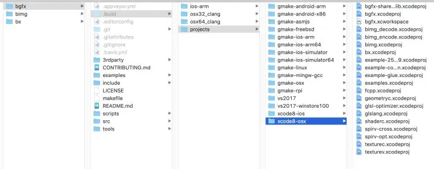
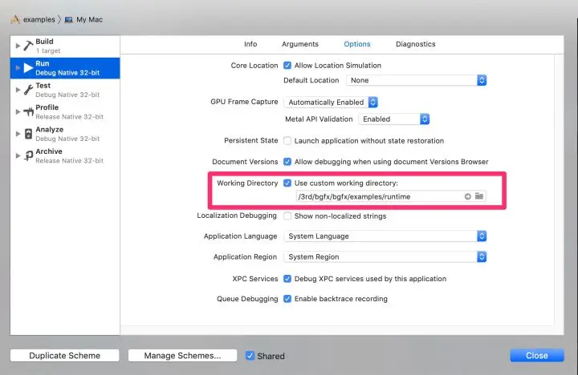

# bgfx 学习笔记（1）- 在 macOS 编译调试
2019-04-20
 链接：https://juejin.cn/post/6844903827137626126
 bgfx 是个跨平台的渲染库，支持 DirectX、Metal、OpenGL 等多个后端。渲染库跨平台，要做两件事。将同一份 shader, 编译成各平台的 shader，包括 GLSL(OpenGL)、HLSL(DirectX)、MGL(Metal)。封装各平台 3d api 的差异，提供同一套图形接口。我暂时只关心它是如何封装 Metal 的。

作者：iOS开发之旅
 
## 1.1下载源码

官方的编译过程[在这里](https://bkaradzic.github.io/bgfx/build.html)。我放在 /3rd 的目录下。

```sh
cd /3rd
mkdir bgfx
cd bgfx

git clone git://github.com/bkaradzic/bx.git
git clone git://github.com/bkaradzic/bimg.git
git clone git://github.com/bkaradzic/bgfx.git 
```

命令执行完毕之后，目录结构如下



## 1.2编译

```sh
cd /3rd/bgfx/bgfx/
make
```

可以输出多个编译选项，也有注释说明

```sh
clean                          Clean all intermediate files.
projgen                        Generate project files for all configurations.
idl                            Generate code from IDL.
android-arm-debug              Build - Android ARM Debug
android-arm-release            Build - Android ARM Release
android-arm                    Build - Android ARM Debug and Release
android-x86-debug              Build - Android x86 Debug and Release
android-x86-release            Build - Android x86 Debug and Release
android-x86                    Build - Android x86 Debug and Release
asmjs-debug                    Build - Emscripten Debug
asmjs-release                  Build - Emscripten
```

我目的是在 macOS 上调试 Metal 平台，为方便调试，需要生成 Xcode 工程文件。

```sh
make projgen
```



我机器设置了显示所有文件。可以用下面命令设置，假如 -bool false 就不显示。

```sh
defaults write com.apple.finder AppleShowAllFiles -bool true;
KillAll Finder
```

打开一个工程，比如 examples.xcodeproj，会有编译错误。
```sh
The i386 architecture is deprecated. You should update your ARCHS build setting to remove the i386 architecture.
```

这是因为 macOS 已经不支持 32 位了。工程（包括子工程）手动配置一下，将【Build Settings】-【Architectures】设置成 Standard Architectures(64-bit Intel)。

## 1.3运行
这时可以使用 Xcode 编译运行了，左上角有个下拉框，可以选择不同的测试例子。当选择 01-cubes 时，程序运行崩溃了。

调试之后，发现是找不到资源。00-helloworld 没有用到外部资源，因而运行正常。01-cubes 用到外部资源，找不到资源就崩溃了。例子工程所需的资源在 bgfx/examples/runtime/ 下。

调试到 entry.cpp 这段代码，知道需要设置一下 s_currentDir 路径。
```cpp
virtual bool open(const bx::FilePath& _filePath, bx::Error* _err) override
{
    String filePath(s_currentDir);
    filePath.append(_filePath);
    return super::open(filePath.getPtr(), _err);
}
```

为了方便调试所有的例子。可以临时修改 entry.cpp 中的代码

```cpp
int runApp(AppI* _app, int _argc, const char* const* _argv)
{
    // 添加这行代码
    entry::setCurrentDir("/3rd/bgfx/bgfx/examples/runtime/");	
    _app->init(_argc, _argv, s_width, s_height);
    bgfx::frame();
    xxxx
} 
```

将 /3rd/bgfx/bgfx/examples/runtime/ 修改成正确的路径。注意最后有个 '/' 字符。

不想改源码，也可以在 Xcode 设置工作目录。目的是相同的，为了找到 runtime 中的资源。




现在可以运行测试例子了，并可用 Xcode 方便查看代码、设置断点、逐行调试。


