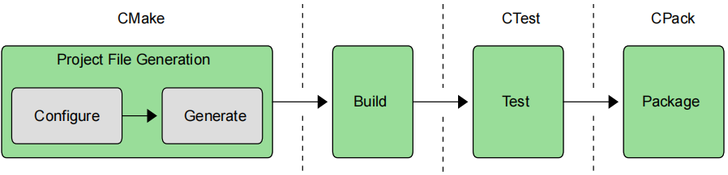

# ----Part I: Fundamentals----

Attempting to use any tool before understanding at least the basics of what it does and how it is meant to be used is most likely going to result in frustration. On the other hand, spending all one’s time learning the theory about something without getting hands-on makes for a rather boring experience and often leads to an overly idealistic understanding. This first part of the book follows a logical progression through CMake’s more fundamental features and concepts and is structured to enable the reader to immediately experiment and to do increasingly useful things with each chapter. The goal is to incrementally build up the base knowledge needed to use CMake effectively,with an emphasis on being able to put that knowledge into practice right away.

【译】在至少了解工具的基本功能和使用方法之前，就尝试使用任何工具，很可能会导致挫败感。另一方面，如果一个人把所有时间都花在学习某事物的理论上，而不进行实践，那将是一种相当无聊的经历，而且往往会导致过于理想化的理解。本书的第一部分遵循了CMake更基本特性和概念的逻辑顺序，其结构旨在使读者能够立即进行实验，并在每一章中完成越来越有用的事情。目标是逐步积累有效使用CMake所需的基础知识，重点是能够立即将这些知识付诸实践。

The initial focus in the first few chapters is on building a basic executable or library, covering just enough to give a new developer a quick introduction to CMake. Subsequent chapters expand that knowledge to demonstrate how to get the most out of what CMake has to offer. The techniques presented are aimed at real world use, with the intention of establishing good habits and teaching sound methods which scale to very large projects and can handle more complex scenarios.

【译】前几章的初步重点是构建一个基本的可执行文件或库，内容刚好足够让新开发人员快速了解CMake。后续章节将扩展这些知识，展示如何充分利用CMake所提供的功能。所介绍的技术旨在应用于现实世界，目的是培养良好的习惯，并教授可扩展到大型项目并能处理更复杂场景的实用方法。

The later parts of the book all rely heavily on the material covered in this first part. Those who have already been using CMake for some time may find the topics relatively familiar, but the material also includes hard-won knowledge from real world projects and interaction with the CMake community. Even experienced users should find at least the Recommended Practices section at the end of each chapter to be a useful read.

【译】本书的后半部分内容在很大程度上依赖于前半部分所涵盖的内容。对于那些已经使用CMake一段时间的人来说，可能会发现这些主题相对熟悉，但书中内容还包括来自现实世界项目的宝贵知识以及与CMake社区的互动。即使是经验丰富的用户，也应该会发现每章末尾的“推荐实践”部分非常有用。

# Ch1.Introduction

Whether a seasoned developer or just starting out in a software career, one cannot avoid the process of becoming familiar with a range of tools in order to turn a project’s source code into something an end user can actually use. Compilers, linkers, testing frameworks, packaging systems and more all contribute to the complexity of deploying high quality, robust software. While some platforms have a dominant IDE environment that simplifies some aspects of this (e.g. Xcode and Visual Studio), projects that need to support multiple platforms cannot always make use of their features. Having to support multiple platforms adds more complications that can affect everything from the set of available tools through to the different capabilities available and restrictions enforced. A typical developer could be forgiven for losing at least some of their sanity trying to keep on top of the whole picture.

【译】无论是经验丰富的开发人员还是刚刚开始软件职业生涯的人，都无法避免熟悉一系列工具的过程，以便将项目的源代码转化为最终用户可以实际使用的东西。编译器、链接器、测试框架、打包系统等都会增加部署高质量、健壮软件的复杂性。虽然一些平台有一个占主导地位的IDE环境，简化了其中的一些方面（例如Xcode和Visual Studio），但需要支持多个平台的项目并不总是能利用它们的功能。必须支持多个平台增加了更多的复杂性，这可能会影响从可用工具集到可用的不同功能和实施的限制的一切。一个典型的开发人员如果试图掌握全局，至少会失去一些理智，这是可以原谅的。

The first stage takes a generic project description and generates platform-specific project files suitable for use with the developer’s regular build tool of choice (e.g. make, Xcode, Visual Studio, etc.). While this setup stage is what CMake is best known for, the CMake suite of tools also includes CTest and CPack for managing the later testing and packaging stages respectively. The entire process from start to finish can be driven from CMake itself, with the testing and packaging steps available simply as additional targets in the build. Even the build tool can be invoked by CMake.

【译】第一阶段采用通用的项目描述，并生成适合与开发人员选择的常规构建工具（例如make、Xcode、Visual Studio等）一起使用的特定于平台的项目文件。虽然这个设置阶段是CMake最为人所知的，但CMake工具套件还包括CTest和CPack，分别用于管理后续的测试和打包阶段。从开始到结束的整个过程都可以从CMake本身驱动，测试和打包步骤只需作为构建中的附加目标即可。甚至构建工具也可以被CMake调用。

Before jumping in and getting their hands dirty with CMake, developers will first need to ensure CMake is installed on their system. Some platforms may typically come with CMake already installed (eg most Linux distributions have CMake available through their package manager), but these versions are often quite old. Where possible, it is recommended that developers work with a recent CMake release. This is particularly true when developing for Apple platforms where tools like Xcode and its SDKs change rapidly and where app store requirements evolve over time. The official CMake packages can be downloaded and unpacked to a directory on the developer’s machine without interfering with any system-wide CMake install. Developers are encouraged to take advantage of this and remain relatively close to the most recent stable CMake release.

【译】在开始使用CMake之前，开发人员首先需要确保CMake安装在他们的系统上。一些平台通常可能已经安装了CMake（例如，大多数Linux发行版都可以通过其软件包管理器使用CMake），但这些版本通常很旧。在可能的情况下，建议开发人员使用最新的CMake版本。在为苹果平台开发时尤其如此，因为Xcode及其SDK等工具变化很快，应用商店的需求也会随着时间的推移而变化。官方CMake软件包可以下载并解压缩到开发人员计算机上的一个目录中，而不会干扰任何系统范围的CMake安装。鼓励开发人员利用这一点，并保持相对接近最新稳定的CMake版本。

These days, CMake also comes with fairly extensive reference documentation which is accessible from the official CMake site. This useful resource is very helpful for looking up the various commands, options, keywords, etc. and developers will likely want to bookmark it for quick reference. The CMake users mailing list is also a great source of advice and a recommended forum for asking CMake-related questions where the documentation doesn’t provide sufficient guidance.

【译】如今，CMake还附带了相当广泛的参考文档，可以从CMake官方网站访问。这个有用的资源对于查找各种命令、选项、关键字等非常有帮助，开发人员可能希望将其添加书签以供快速参考。CMake用户邮件列表也是一个很好的建议来源，也是一个推荐的论坛，可以在文档没有提供足够指导的情况下提出与CMake相关的问题。

