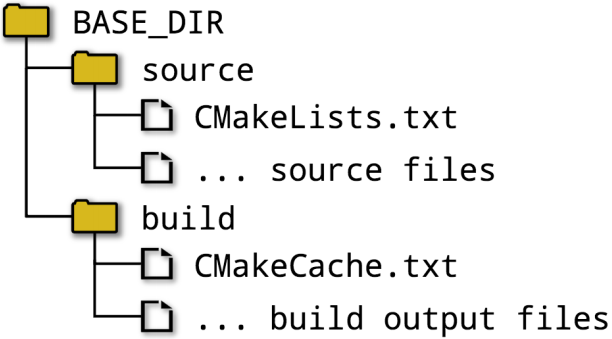
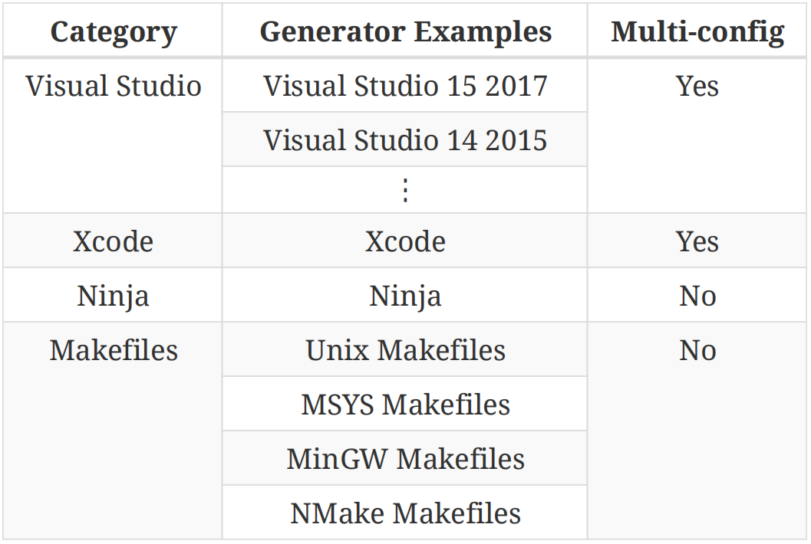

# Ch2. Setting Up A Project

Ch2.设置项目

Without a build system, a project is just a collection of files. CMake brings some order to this, starting with a human-readable file called CMakeLists.txt that defines what should be built and how, what tests to run and what package(s) to create. This file is a platform independent description of the whole project, which CMake then turns into platform specific build tool project files. As its name suggests, it is just an ordinary text file which developers edit in their favourite text editor or development environment. The contents of this file are covered in great detail in subsequent chapters, but for now, it is enough to know that this is what controls everything that CMake will do in setting up and performing the build. 【译】没有构建系统，项目只是文件的集合。CMake为此带来了一些秩序，从一个名为CMakeLists.txt的人类可读文件开始，该文件定义了应该构建什么、如何构建、运行什么测试以及创建什么包。此文件是整个项目的独立于平台的描述，CMake随后将其转换为特定于平台的构建工具项目文件。顾名思义，它只是一个普通的文本文件，开发人员可以在他们喜欢的文本编辑器或开发环境中编辑。此文件的内容将在后续章节中详细介绍，但就目前而言，只需知道这是控制CMake在设置和执行构建过程中所做的一切即可。

A fundamental part of CMake is the concept of a project having both a source directory and a binary directory. The source directory is where the CMakeLists.txt file is located and the project’s source files and all other files needed for the build are organized under that location. The source directory is frequently under version control with a tool like git, subversion, or similar. 【译】CMake的一个基本部分是项目同时具有源目录和二进制目录的概念。源目录是CMakeLists.txt文件所在的位置，项目的源文件和构建所需的所有其他文件都组织在该位置下。源目录经常受到git、subversion或类似工具的版本控制。

The binary directory is where everything produced by the build is created. It is often also called the build directory. For reasons that will become clear in later chapters, CMake generally uses the term binary directory, but among developers, the term build directory tends to be in more common use. This book tends to prefer the latter term since it is generally more intuitive. CMake, the chosen build tool (e.g. make, Visual Studio, etc.), CTest and CPack will all create various files within the build directory and subdirectories below it. Executables, libraries, test output and packages are all created within the build directory. CMake also creates a special file called CMakeCache.txt in the build directory to store various information for reuse on subsequent runs. Developers won’t normally need to concern themselves with the CMakeCache.txt file, but later chapters will discuss situations where this file is relevant. The build tool’s project files (e.g. Xcode or Visual Studio project files, Makefiles, etc.) are also created in the build directory and are not intended to be put under version control. The CMakeLists.txt files are the canonical description of the project and the generated project files should be considered part of the build output.

【译】**二进制目录**是创建构建生成的所有内容的地方。它通常也被称为构建目录。由于在后面的章节中会清楚说明的原因，CMake通常使用术语二进制目录，但在开发人员中，术语构建目录往往更常用。这本书倾向于使用后者，因为它通常更直观。CMake、所选的构建工具（例如make、Visual Studio等）、CTest和CPack都将在构建目录及其下的子目录中创建各种文件。可执行文件、库、测试输出和包都在构建目录中创建。CMake还在构建目录中创建了一个名为CMakeCache.txt的特殊文件，用于存储各种信息，以便在后续运行中重用。开发人员通常不需要关心CMakeCache.txt文件，但后面的章节将讨论此文件的相关情况。构建工具的项目文件（例如Xcode或Visual Studio项目文件、Makefiles等）也在构建目录中创建，不受版本控制。CMakeLists.txt文件是项目的规范描述，生成的项目文件应被视为构建输出的一部分。

When a developer commences work on a project, they must decide where they want their build directory to be in relation to their source directory. There are essentially two approaches: in-source and out-of-source builds. 【译】当开发人员开始在项目上工作时，他们必须决定他们希望自己的构建目录相对于源目录的位置。基本上有两种方法：源代码内构建和源代码外构建。

## 2.1. In-source Builds

It is possible, though discouraged, for the source and build directories to be the same. This arrangement is called an in-source build. Developers at the beginning of their career often start out using this approach because of the perceived simplicity. The main difficulty with in-source builds, however, is that all the build outputs are intermixed with the source files. This lack of separation causes directories to become cluttered with all sorts of files and subdirectories, making it harder to manage the project sources and running the risk of build outputs overwriting source files. It also makes working with version control systems more difficult, since there are lots of files created by the build which either the source control tool has to know to ignore or the developer has to manually exclude during commits. One other drawback to in-source builds is that it can be non trivial to clear out all build output and start again with a clean source tree. For these reasons, developers are discouraged from using in-source builds where possible, even for simple projects. 【译】虽然不鼓励，但源目录和构建目录可能是相同的。这种安排称为源代码内构建。开发人员在职业生涯初期经常开始使用这种方法，因为他们认为这种方法很简单。然而，源代码内构建的主要困难是所有构建输出都与源文件混合在一起。这种缺乏分离导致目录中充斥着各种文件和子目录，使管理项目源变得更加困难，并存在构建输出覆盖源文件的风险。这也使得使用版本控制系统变得更加困难，因为构建过程中创建了许多文件，要么源代码管理工具必须知道要忽略这些文件，要么开发人员必须在提交过程中手动排除这些文件。源代码内构建的另一个缺点是，清除所有构建输出并从干净的源代码树重新开始可能并不容易。出于这些原因，即使对于简单的项目，也不鼓励开发人员在可能的情况下在源代码构建中使用。

## 2.2. Out-of-source Builds

The more preferable arrangement is for the source and build directories to be different, which is called an out-of-source build. This keeps the sources and the build outputs completely separate from each other, thus avoiding the intermixing problems experienced with in-source builds. Out-of source builds also have the advantage that the developer can create multiple build directories for the same source directory, which allows builds to be set up with different sets of options, such as debug and release versions, etc. 【译】更可取的安排是源代码和构建目录不同，这被称为源代码外构建。这使得源代码和构建输出彼此完全分开，从而避免了源代码内构建遇到的混合问题。源代码外构建还有一个优点，即开发人员可以为同一个源目录创建多个构建目录，这允许使用不同的选项集（如调试和发布版本等）设置构建。

This book will always use out-of-source builds and will follow the pattern of the source and build directories being under a common parent. The build directory will be called build, or some variation thereof. For example: 【译】本书将始终使用源代码外构建，并遵循源代码和构建目录位于公共父目录下的模式。构建目录将被称为build或其变体。例如：

A variation on this used by some developers is to make the build directory a subdirectory of the source directory. This offers most of the advantages of an out-of-source build, but it does still carry with it some of the disadvantages of an in-source arrangement. Unless there is a good reason to structure things that way, keeping the build directory completely outside of the source tree instead is recommended. 【译】一些开发人员使用的一种变体是将构建目录设置为源目录的子目录。这提供了源外构建的大部分优点，但它仍然带有源内安排的一些缺点。除非有充分的理由以这种方式构建内容，否则建议将构建目录完全放在源代码树之外。

## 2.3. Generating Project Files

Once the choice of directory structure has been made, the developer runs CMake, which reads in the CMakeLists.txt file and creates project files in the build directory. The developer selects the type of project file to be created by choosing a particular project file generator. A range of different generators are supported, with the more commonly used ones listed in the table below.

【译】一旦选择了目录结构，开发人员就会运行CMake，它读取CMakeLists.txt文件并在构建目录中创建项目文件。开发人员通过选择特定的项目文件生成器来选择要创建的项目文件类型。支持一系列不同的生成器，下表列出了更常用的生成器。

Some of the generators produce projects which support multiple configurations (e.g. Debug, Release, etc.). These allow the developer to choose between different build configurations without having to re-run CMake, which is more suitable for generators creating projects for use in IDE environments like Xcode and Visual Studio. For generators which do not support multiple configurations, the developer has to re-run CMake to switch the build between Debug, Release, etc. These are simpler and often have good support in IDE environments not so closely associated with a particular compiler (Qt Creator, KDevelop, etc.). 【译】一些生成器生成支持多种配置的项目（例如调试、发布等）。这些允许开发人员在不同的构建配置之间进行选择，而无需重新运行CMake，CMake更适合创建在Xcode和Visual Studio等IDE环境中使用的项目的生成器。对于不支持多种配置的生成器，开发人员必须重新运行CMake以在调试、发布等之间切换构建。这些更简单，在与特定编译器（Qt Creator、KDevelop等）关系不太密切的IDE环境中通常有很好的支持。

The most basic way to run CMake is via the cmake command line utility. The simplest way to invoke it is to change to the build directory and pass options to cmake for the generator type and location of the source tree. For example: 【译】运行CMake的最基本方法是通过CMake命令行实用程序。调用它的最简单方法是更改到构建目录，并将生成器类型和源代码树位置的选项传递给cmake。例如：

\`\`\`sh

mkdir build

cd build

cmake -G "Unix Makefiles" ../source

\`\`\`

If the -G option is omitted, CMake will choose a default generator type based on the host platform. For all generator types, CMake will carry out a series of tests and interrogate the system to determine how to set up the project files. This includes things like verifying that the compilers work, determining the set of supported compiler features and various other tasks. A variety of information will be logged before CMake finishes with lines like the following upon success:

【译】如果省略-G选项，CMake将根据主机平台选择默认生成器类型。对于所有生成器类型，CMake将执行一系列测试并询问系统以确定如何设置项目文件。这包括验证编译器是否正常工作、确定支持的编译器功能集以及各种其他任务。在CMake成功完成之前，将记录各种信息，并显示以下行：

-- Configuring done

-- Generating done

-- Build files have been written to: /some/path/build

The above highlights that project file creation actually involves two steps; configuring and generating. During the configuring phase, CMake reads in the CMakeLists.txt file and builds up an internal representation of the entire project. After this is done, the generation phase creates the project files. The distinction between configuring and generating doesn’t matter so much for basic CMake usage, but in later chapters the separation of configuration and generation becomes important. This is covered in more detail in “Chapter 10, Generator Expressions”. 【译】上面强调了项目文件创建实际上涉及两个步骤：配置和生成。在配置阶段，CMake读取CMakeLists.txt文件并构建整个项目的内部表示。完成此操作后，生成阶段将创建项目文件。配置和生成之间的区别对于CMake的基本用法来说并不重要，但在后面的章节中，配置和生成的分离变得很重要。这在第10章“生成器表达式”中有更详细的介绍。

When CMake has completed its run, it will have saved a CMakeCache.txt file in the build directory. CMake uses this file to save details so that if it is re-run again, it can re-use information computed the first time and speed up the project generation. As covered in later chapters, it also allows developer options to be saved between runs. A GUI application, cmake-gui, is available as an alternative to running the cmake command line tool, but the introduction of the GUI application is deferred to “Chapter 5, Variables” where its usefulness is more clearly evident.

当CMake完成运行时，它将在构建目录中保存一个CMakeCache.txt文件。CMake使用此文件保存详细信息，这样如果再次运行，它可以**重用**第一次计算的信息并**加快**项目生成。如后面章节所述，它还允许在运行之间**保存开发者选项**。GUI应用程序cmake-GUI可作为运行cmake命令行工具的替代方案，但GUI应用程序的介绍推迟到第5章“变量”，在第5章中，其有用性更加明显。

## 2.4. Running The Build Tool

At this point, with project files now available, the developer can use their selected build tool in the way to which they are accustomed. The build directory will contain the necessary project files which can be loaded into an IDE, read by command line tools, etc. lternatively, cmake can invoke the build tool on the developer’s behalf like so: 【译】此时，有了项目文件，开发人员可以按照他们习惯的方式使用他们选择的构建工具。构建目录将包含必要的项目文件，这些文件可以加载到IDE中，由命令行工具读取等。或者，cmake可以代表开发人员调用构建工具，如下所示：

\`\`\`sh

cmake --build /some/path/build --config Debug --target MyApp

\`\`\`

This works even for project types the developer may be more accustomed to using through an IDE like Xcode or Visual Studio. The --build option points to the build directory used by the CMake project generation step. For multi configuration generators, the --config option specifies which configuration to build, whereas single configuration generators will ignore the --config option and rely instead on information provided when the CMake project generation step was performed. Specifying the build configuration is covered in depth in “Chapter 13, Build Type”. The --target option can be used to tell the build tool what to build, or if omitted, the default target will be built. 【译】这甚至适用于开发人员可能更习惯通过Xcode或Visual Studio等IDE使用的项目类型。

--build选项指向CMake项目生成步骤使用的构建目录。对于多配置生成器，--config选项指定要构建的配置，而单个配置生成器将忽略--config选项，而是依赖于执行CMake项目生成步骤时提供的信息。第13章“构建类型”详细介绍了指定构建配置。

--target选项可用于告诉构建工具要构建什么，或者如果省略，将构建默认目标。

While developers will typically invoke their selected build tool directly in day-to-day development, invoking it via the cmake command as shown above can be more useful in scripts driving an automated build. Using this approach, a simple scripted build might look something like this:

【译】虽然开发人员通常会在日常开发中直接调用他们选择的构建工具，但通过如上所示的cmake命令调用它在驱动自动构建的脚本中可能更有用。使用这种方法，一个简单的脚本构建可能看起来像这样：

\`\`\`sh

mkdir build

cd build

cmake -G "Unix Makefiles" ../source

cmake --build . --config Release --target MyApp

\`\`\`

If the developer wishes to experiment with different generators, all that needs to be done is change the argument given to the -G CMake option and the correct build tool will be automatically invoked. The build tool doesn’t even have to be on the user’s PATH for cmake --build to work (although it may need to be for the initial configuration step when cmake is first invoked). 【译】如果开发人员希望尝试不同的生成器，只需更改-G CMake选项的参数，就会自动调用正确的构建工具。构建工具甚至不必在用户的PATH上，cmake--build才能工作（尽管在cmake首次调用时，它可能需要在初始配置步骤中）。

## 2.5. Recommended Practices

2.5. 推荐做法

Even when first starting out using CMake, it is advisable to make a habit of keeping the build directory completely separate from the source tree. A good way to get early experience of the benefits of such an arrangement is to set up two or more different builds for the same source directory. One build could be configured with Debug settings, the other for a Release build. Another option is to use different project generators for the different build directories, such as Unix Makefiles and Xcode. This can help to catch any unintended dependencies on a particular build tool or to check for differing compiler settings between generator types. 【译】即使刚开始使用CMake，建议养成将构建目录与源代码树完全分离的习惯。尽早体验这种安排的好处的一个好方法是为同一个源目录设置两个或多个不同的构建。一个版本可以配置调试设置，另一个版本用于发布版本。另一种选择是为不同的构建目录使用不同的项目生成器，例如Unix Makefiles和Xcode。这有助于捕捉对特定构建工具的任何意外依赖，或检查生成器类型之间的不同编译器设置。

It can be tempting to focus on using one particular type of project generator in the early stages of a project, especially if the developer is not accustomed to writing cross-platform software. Projects do, however, have a habit of growing beyond their initial scope and it can be relatively common for them to need to support additional platforms and therefore different generator types. Periodically checking the build with a different project generator than the one a developer usually uses can save considerable future pain by discouraging generator-specific code where it isn’t required. This also has the benefit of making the project well placed to take advantage of any new generator type in the future. A good strategy would be to ensure the project builds with the default generator type on each platform of interest, plus one other type. The Ninja generator is an excellent choice for the latter, since it has the broadest platform support of all the generators and it also creates very efficient builds. If the project is being scripted, invoke the build tool via cmake --build instead of invoking the build tool directly. This allows the script to easily switch between generator types without having to be modified. 【译】在项目的早期阶段，人们可能会倾向于使用一种特定类型的项目生成器，特别是如果开发人员不习惯编写跨平台软件的话。然而，项目确实有一种习惯，即超出其最初的范围，并且它们需要支持其他平台，从而支持不同的生成器类型，这可能是相对常见的。定期使用与开发人员通常使用的项目生成器不同的项目生成器检查构建，可以通过在不需要的地方阻止特定于生成器的代码来节省大量的未来痛苦。这也有利于使该项目在未来能够很好地利用任何新的发电机类型。 一个好的策略是确保项目在每个感兴趣的平台上使用默认生成器类型构建，再加上另一种类型。Ninja生成器是后者的绝佳选择，因为它拥有所有生成器中最广泛的平台支持，并且还可以创建非常高效的构建。如果项目正在编写脚本，请通过cmake-build调用构建工具，而不是直接调用构建工具。这允许脚本在生成器类型之间轻松切换，而无需修改。

