# Ch5. Variables

The preceding chapters showed how to define basic targets and produce build outputs. On its own, this is already useful, but CMake comes with a whole host of other features which bring great flexibility and convenience. This chapter covers one of the most fundamental parts of CMake, namely the use of variables. 【译】前面的章节展示了如何定义基本目标和生成构建输出。就其本身而言，这已经很有用了，但CMake还附带了一系列其他功能，这些功能带来了极大的灵活性和便利性。本章涵盖了CMake最基本的部分之一，即变量的使用。

## 5.1. Variable Basics

Like any computing language, variables are a cornerstone of getting things done in CMake. The most basic way of defining a variable is with the set() command. A normal variable can be defined in a CMakeLists.txt file as follows: 【译】与任何计算语言一样，变量是CMake中完成任务的基石。定义变量的最基本方法是使用set() 命令。一个普通变量可以在CMakeLists.txt文件中定义如下：

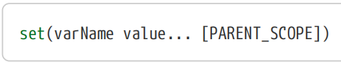

The name of the variable, varName, can contain letters, numbers and underscores, with letters being case-sensitive. The name may also contain the characters ./-+ but these are rarely seen in practice. Other characters are also possible via indirect means, but again, these are not typically seen in normal use. 【译】变量名varName可以包含字母、数字和下划线，字母区分大小写。名称还可以包含字符./-+但这些在实践中很少见。其他字符也可以通过间接方式使用，但同样，这些字符在正常使用中通常不常见。

In CMake, a variable has a particular scope, much like how variables in other languages have scope limited to a particular function, file, etc. A variable cannot be read or modified outside of its scope. Compared to other languages, variable scope is a little more flexible in CMake, but for now, in the simple examples in this chapter, consider the scope of a variable as being global. “Chapter 7, Using Subdirectories” and “Chapter 8, Functions And Macros” introduce the situations where local scopes arise and show how the PARENT_SCOPE keyword is used to promote the visibility of a variable into the enclosing scope. 【译】在CMake中，变量具有特定的作用域，就像其他语言中的变量将作用域限制在特定的函数、文件等中一样。变量不能在其作用域之外读取或修改。与其他语言相比，CMake中的变量作用域更灵活，但就目前而言，在本章的简单示例中，将变量的作用域视为全局的。“第7章，使用子目录”和“第8章，函数和宏”介绍了局部作用域出现的情况，并展示了如何使用PARENT_SCOPE关键字来提高变量在封闭作用域中的可见性。

CMake treats all variables as strings. In various contexts, variables may be interpreted as a different type, but ultimately, they are just strings. When setting a variable’s value, CMake doesn’t require those values to be quoted unless the value contains spaces. If multiple values are given, the values will be joined together with a semicolon separating each value - the resultant string is how CMake represents lists. The following should help to demonstrate the behavior.

【译】CMake将所有变量视为字符串。在各种情况下，变量可能被解释为不同的类型，但最终它们只是字符串。设置变量值时，CMake不要求引用这些值，除非值包含空格。如果给定了多个值，这些值将用分号连接在一起，分隔每个值——结果字符串就是CMake表示列表的方式。以下内容应有助于演示该行为。

\#------------------------------------\>\>\>\>\>\>

set(myVar a b c) \# myVar = "a;b;c"

set(myVar a;b;c) \# myVar = "a;b;c"

set(myVar "a b c") \# myVar = "a b c"

set(myVar a b;c) \# myVar = "a;b;c"

set(myVar a "b c") \# myVar = "a;b c

\#------------------------------------\<\<\<\<\<\<

The value of a variable is obtained with \${myVar}, which can be used anywhere a string or variable is expected. CMake is particularly flexible in that it is also possible to use this form recursively or to specify the name of another variable to set. In addition, CMake doesn’t require variables to be defined before using them. Use of an undefined variable simply results in an empty string being substituted with no error or warning, much like Unix shell scripts.

【译】变量的值是通过\${myVar}获得的，它可以在任何需要字符串或变量的地方使用。CMake特别灵活，因为它还可以递归使用此表单或指定要设置的另一个变量的名称。此外，CMake在使用变量之前不需要定义变量。使用未定义的变量只会导致空字符串被替换而没有错误或警告，就像Unix shell脚本一样。

\#------------------------------------\>\>\>\>\>\>

set(foo ab) \# foo = "ab"

set(bar \${foo}cd) \# bar = "abcd"

set(baz \${foo} cd) \# baz = "ab;cd"

set(myVar ba) \# myVar = "ba"

set(big "\${\${myVar}r}ef") \# big = "\${bar}ef" = "abcdef"

set(\${foo} xyz) \# ab = "xyz"

set(bar \${notSetVar}) \# bar = ""

\#------------------------------------\<\<\<\<\<\<

Strings are not restricted to being a single line, they can contain embedded newline characters. They can also contain quotes, which require escaping with backslashes.

【译】字符串不限于单行，它们可以包含嵌入式换行符。它们还可以包含引号，需要用反斜杠转义。

\#------------------------------------\>\>\>\>\>\>

set(myVar "goes here")

set(multiLine "First line \${myVar}

Second line with a \\quoted\\ word")

\#------------------------------------\<\<\<\<\<\<

If using CMake 3.0 or later, an alternative to quotes is to use the lua-inspired bracket syntax where the start of the content is marked by \[=\[ and the end with \]=\]. Any number of = characters can appear between the square brackets, including none at all, but the same number of = characters must be used at the start and the end. If the opening brackets are immediately followed by a newline character, that first newline is ignored, but subsequent newlines are not. Furthermore, no further transformation of the bracketed content is performed (i.e. no variable substitution or escaping).

【译】如果使用CMake 3.0或更高版本，引号的替代方法是使用lua风格的括号语法，其中内容的开头用\[=\[标记，结尾用\]=\]标记。方括号之间可以出现任意数量的=字符，包括根本没有，但开头和结尾必须使用相同数量的=个字符。如果开始的括号后面紧跟着换行符，则忽略第一个换行符，但后续换行符则不会。此外，括号内的内容不会进行进一步的转换（即没有变量替换或转义）。

\#\>\>\>\>\>\>\>\>\>\>\>\>\>\>\>\>\>\>\>\>\>\>\>\>\>\>\>\>\>\>\>\>\>\>\>\>\>\>\>\>\>\>\>\>\>\>\>\>\>\>\>\>\>

\# Simple multi-line content with bracket syntax,

\# no = needed between the square bracket markers

set(multiLine \[\[

First line

Second line

\]\])

\# Bracket syntax prevents unwanted substitution

set(shellScript \[=\[

\#!/bin/bash

\[\[ -n "\${USER}" \]\] && echo "Have USER"

\]=\])

\# Equivalent code without bracket syntax

set(shellScript

"#!/bin/bash

\[\[ -n \\\\{USER}\\ \]\] && echo \\Have USER\\

")

\#\<\<\<\<\<\<\<\<\<\<\<\<\<\<\<\<\<\<\<\<\<\<\<\<\<\<\<\<\<\<\<\<\<\<\<\<\<\<\<\<\<\<\<\<\<\<\<\<\<\<\<\<\<

As the above example shows, bracket syntax is particularly well suited to defining content like Unix shell scripts. Such content uses the \${…} syntax for its own purpose and frequently contains quotes, but using bracket syntax means these things do not have to be escaped, unlike the traditional quoting style of defining CMake content. The flexibility to use any number of = characters between the \[ and \] markers also means embedded square brackets do not get misinterpreted as markers.”Chapter 18, Working With Files” includes further examples which highlight situations where bracket syntax can be a better alternative.

【译】如上例所示，括号语法特别适合定义Unix shell脚本等内容。此类内容出于自身目的使用\${…}语法，并且经常包含引号，但使用括号语法意味着这些内容不必转义，这与定义CMake内容的传统引号样式不同。在\[和\]标记之间使用任意数量的=字符的灵活性也意味着嵌入的方括号不会被误解为标记。”第18章“使用文件”包括进一步的示例，突出了括号语法可能是更好的替代方案的情况。

**A variable can be unset** either by calling unset() or by calling set() with no value for the named variable. The following are equivalent, with no error or warning if myVar does not already exist:

【译】可以通过调用unset()或在命名变量没有值的情况下调用set()来**取消设置变量**。以下内容是等效的，如果myVar不存在，则没有错误或警告：

\#\>\>\>\>\>\>\>\>\>\>\>\>\>\>

set(myVar)

unset(myVar)

\#\<\<\<\<\<\<\<\<\<\<\<\<

In addition to variables defined by the project for its own use, the behavior of many of CMake’s commands can be influenced by the value of specific variables at the time the command is called. This is a common pattern used by CMake to tailor command behavior or to modify defaults so they don’t have to be repeated for every command, target definition, etc. The CMake reference documentation for each command typically lists any variables which can affect that command’s behavior. Later chapters of this book also highlight a number of useful variables and the way they affect or give information about the build.

【译】除了项目为自己使用而定义的变量外，许多CMake命令的行为也会受到调用命令时特定变量值的影响。这是CMake用来定制命令行为或修改默认值的常见模式，这样就不必对每个命令、目标定义等重复这些模式。每个命令的CMake参考文档通常会列出可能影响该命令行为的任何变量。本书后面的章节还强调了一些有用的变量以及它们影响或提供构建信息的方式。

## 5.2. Environment Variables

CMake also allows the value of environment variables to be retrieved and set using a modified form of the normal variable notation. The value of an environment variable is obtained using the special form \$ENV{varName} and this can be used anywhere a regular \${varName} form can be used. Setting an environment variable can be done in the same way as an ordinary variable, except with ENV{varName} instead of just varName as the variable to set. For example:

【译】CMake还允许使用修改后的普通变量表示法检索和设置环境变量的值。环境变量的值是使用特殊形式\$ENV{varName}获得的，这可以在任何可以使用常规\${varName\]形式的地方使用。设置环境变量的方式与普通变量相同，除了使用ENV{varName}而不是仅使用varName作为要设置的变量。例如：

\#\>\>\>\>\>\>\>\>\>\>\>\>\>\>\>\>\>\>\>\>\>\>\>\>\>\>\>\>\>\>\>\>\>\>\>\>\>\>\>\>\>\>\>

set(ENV{PATH} "\$ENV{PATH}:/opt/myDir")

\#\<\<\<\<\<\<\<\<\<\<\<\<\<\<\<\<\<\<\<\<\<\<\<\<\<\<\<\<\<\<\<\<\<\<\<\<\<\<\<\<\<\<\<

Note, however, that setting an environment variable like this only affects the currently running CMake instance. As soon as the CMake run is finished, the change to the environment variable is lost. In particular, the change to the environment variable will not be visible at build time. Therefore, setting environment variables within the CMakeLists.txt file like this is rarely useful.

【译】但是请注意，设置这样的环境变量只会影响当前运行的CMake实例。一旦CMake运行完成，对环境变量的更改就会丢失。特别是，对环境变量的更改在构建时将不可见。因此，像这样在CMakeLists.txt文件中设置环境变量很少有用。

## 5.3. Cache Variables

In addition to normal variables discussed above, CMake also supports cache variables. Unlike normal variables which have a lifetime limited to the processing of the CMakeLists.txt file, cache variables are stored in the special file called CMakeCache.txt in the build directory and they persist between CMake runs. Once set, cache variables remain set until something explicitly removes them from the cache. The value of a cache variable is retrieved in exactly the same way as a normal variable (i.e. with the \${myVar} form), but the set() command is different when used to set a cache variable: 【译】除了上面讨论的普通变量外，CMake还支持缓存变量。与生命周期仅限于处理CMakeLists.txt文件的普通变量不同，缓存变量存储在构建目录中名为CMakeCache.txt的特殊文件中，并在CMake运行之间持续存在。一旦设置，缓存变量将保持设置状态，直到有明确的东西将其从缓存中删除。缓存变量的值以与普通变量完全相同的方式检索（即使用\${myVar}形式），但用于设置缓存变量时，set()命令是不同的：

\`\`\`cmake

set(varName value... CACHE type "docstring" \[FORCE\]

\`\`\`

When the CACHE keyword is present, the set() command will apply to a cache variable named varName instead of a normal variable. Cache variables have more information attached to them than a normal variable, including a nominal type and a documentation string. Both must be provided when setting a cache variable, although the docstring can be empty. Neither the nominal type nor the documentation string affect how CMake treats the variable, they are only used by GUI tools to present the variable to the user in a more suitable form. CMake will always treat the variable as a string during processing, the type is just to improve the user experience in GUI tools. The type must be one of the following: 【译】当CACHE关键字存在时，set()命令将应用于名为varName的缓存变量，而不是普通变量。缓存变量比普通变量附加了更多的信息，包括标称类型和文档字符串。在设置缓存变量时，必须同时提供这两个变量，尽管文档字符串可以为空。名义类型和文档字符串都不会影响CMake处理变量的方式，它们只被GUI工具用来以更合适的形式向用户呈现变量。CMake在处理过程中始终将变量视为字符串，类型只是为了改善GUI工具中的用户体验。类型必须是以下类型之一：

\#\>\>\>\>\>\>\>\>\>\>\>\>\>\>\>\>\>\>\>\>\>\>\>\>\>\>\>\>\>\>\>\>\>\>\>\>\>\>\>\>\>\>\>\>\>\>\>\>\>\>\>\>\>\>\>\>\>\>\>\>

**\#(1)BOOL**

The cache variable is a boolean on/off value. GUI tools use a checkbox or similar to represent the variable. The underlying string value held by the variable will conform to one of the ways CMake represents booleans as strings (ON/OFF, TRUE/FALSE, 1/0, etc. - see Section 6.1.1, “Basic Expressions” for full details). 【译】缓存变量是一个布尔开/关值。GUI工具使用复选框或类似工具来表示变量。变量所持有的底层字符串值将符合CMake将布尔值表示为字符串的方式之一（ON/OFF、TRUE/FALSE、1/0等）详见第6.1.1节“基本表达式”）。

**\#(2)FILEPATH**

The cache variable represents a path to a file on disk. GUI tools present a file dialog to the user

for modifying the variable’s value. 【译】缓存变量表示磁盘上文件的路径。GUI工具向用户呈现一个文件对话框，用于修改变量的值。

**\#(3)PATH**

Like FILEPATH, but GUI tools present a dialog that selects a directory rather than a file.【译】与FILEPATH类似，但GUI工具提供了一个选择目录而不是文件的对话框。

**\#(4)STRING**

The variable is treated as an arbitrary string. By default, GUI tools use a single-line text edit widget for manipulating the value of the variable. Projects may use cache variable properties to provide a pre-defined set of values for GUI tools to present as a combobox or similar instead (see Section 9.6, “Cache Variable Properties”). 【译】变量被视为任意字符串。默认情况下，GUI工具使用单行文本编辑小部件来操纵变量的值。项目可以使用缓存变量属性为GUI工具提供一组预定义的值，以组合框或类似形式呈现（见第9.6节“缓存变量属性”）。

**\#(5)INTERNAL**

The variable is not intended to be made available to the user. Internal cache variables are sometimes used to persistently record internal information by the project, such as caching the result of an intensive query or computation. GUI tools do not show INTERNAL variables. 【译】该变量不打算供用户使用。内部缓存变量有时用于项目持久记录内部信息，例如缓存密集查询或计算的结果。GUI工具不显示内部变量。

\#\<\<\<\<\<\<\<\<\<\<\<\<\<\<\<\<\<\<\<\<\<\<\<\<\<\<\<\<\<\<\<\<\<\<\<\<\<\<\<\<\<\<\<\<\<\<\<\<\<\<\<\<\<\<\<\<\<\<\<\<

GUI tools typically use the docstring as a tooltip for the cache variable or as a short one line description when the variable is selected. The docstring should be short and consist of plain text (i.e. no HTML markup, etc.). The FORCE keyword is discussed further below. 【译】GUI工具通常将docstring用作缓存变量的工具提示，或者在选择变量时用作简短的单行描述。文档字符串应该很短，并且由纯文本组成（即没有HTML标记等）。FORCE关键字将在下面进一步讨论。

Setting a boolean cache variable is such a common need that CMake provides a separate command expressly for that purpose. Rather than the somewhat verbose set() command, developers can use option() instead: 【译】设置布尔缓存变量是一种常见的需求，CMake为此专门提供了一个单独的命令。开发人员可以使用option()代替稍显冗长的set()命令：

\`\`\`cmake

option(optVar helpString \[initialValue\])

\`\`\`

If initialValue is omitted, the default value OFF will be used. If provided, the initialValue must conform to one of the boolean values accepted by the set() command. For reference, the above is equivalent to: 【译】如果省略initialValue，将使用默认值OFF。如果提供，initialValue必须符合set（）命令接受的布尔值之一。作为参考，上述内容相当于：

\`\`\`cmake

set(optVar initialValue CACHE BOOL helpString)

\`\`\`

Compared to set(), the option() command more clearly expresses the behavior for boolean cache variables, so it would generally be the preferred command to use. 【译】与set()相比，option()命令更清楚地表达了布尔缓存变量的行为，因此它通常是首选命令。

An important difference between normal and cache variables is that the set() command will only overwrite a cache variable if the FORCE keyword is present, unlike normal variables where the set() command will always overwrite a pre-existing value. The set() command acts more like set-if-notset when used to define cache variables, as does the option() command (which has no FORCE capability). The main reason for this is that cache variables are primarily intended as a customisation point for developers. Rather than hard-coding the value in the CMakeLists.txt file as a normal variable, a cache variable can be used so that the developer can override the value without having to edit the CMakeLists.txt file. The variable can be modified by interactive GUI tools or by scripts without having to change anything in the project itself. 【译】普通变量和缓存变量之间的一个重要区别是，只有在FORCE关键字存在的情况下，set()命令才会覆盖缓存变量，这与普通变量不同，在普通变量中，set()命令总是覆盖预先存在的值。当用于定义缓存变量时，set()命令的行为更像set if not set，option()命令也是如此（它没有FORCE功能）。其主要原因是缓存变量主要是作为开发人员的定制点。可以使用缓存变量，而不是将CMakeLists.txt文件中的值硬编码为普通变量，这样开发人员就可以覆盖该值，而无需编辑CMakeLists..txt文件。该变量可以通过交互式GUI工具或脚本进行修改，而无需更改项目本身的任何内容。

A point that is often not well understood is that normal and cache variables are two separate things. It is possible to have a normal variable and a cache variable with the same name but holding different values. In such cases, CMake will retrieve the normal variable’s value rather than the cache variable when using \${myVar}, or put another way, normal variables take precedence over cache variables. The exception to this is that when setting a cache variable’s value, if that cache variable did not exist before the call to set() or if the FORCE option was used, then any normal variable in the current scope is effectively removed. Note that this unfortunately means it is possible to get different behavior between the first and subsequent CMake runs, since in the first run, the cache variable won’t exist, but in subsequent runs it will. Therefore, in the first run, a normal variable would be hidden, but in subsequent runs it would not. An example should help illustrate the problem. 【译】一个经常不被很好理解的点是，正常变量和缓存变量是两个独立的东西。可以有一个普通变量和一个同名但保存不同值的缓存变量。在这种情况下，当使用\${myVar}时，CMake将检索正常变量的值，而不是缓存变量，或者换句话说，正常变量优先于缓存变量。例外情况是，在设置缓存变量的值时，如果在调用set()之前该缓存变量不存在，或者使用了FORCE选项，则当前作用域中的任何普通变量都将被有效删除。请注意，不幸的是，这意味着在第一次和后续的CMake运行之间可能会出现不同的行为，因为在第一次运行中，缓存变量不存在，但在后续运行中，它会存在。因此，在第一次运行中，一个普通变量将被隐藏，但在后续运行中，它不会被隐藏。一个例子应该有助于说明这个问题。

\#------------------------------------\>\>\>\>\>\>

set(myVar foo) \# Local myVar

set(result \${myVar}) \# result = foo

set(myVar bar CACHE STRING “”) \# Cache myVar

set(result \${myVar}) \# First run: result = bar

\# Subsequent runs: result = foo

set(myVar fred)

set(result \${myVar}) \# result = fred

\#------------------------------------\<\<\<\<\<\<

Loosely speaking, the resultant behavior is that \${myVar} will retrieve the last value that was assigned to myVar, regardless of whether it was a normal variable or a cache variable. The discussions in “Chapter 7, Using Subdirectories” and “Chapter 8, Functions And Macros” further clarify this behavior, explaining how a variable’s scope can influence what value \${myVar} would return. 【译】从广义上讲，结果行为是\${myVar}将检索分配给myVar的最后一个值，无论它是普通变量还是缓存变量。“第7章，使用子目录”和“第8章，函数和宏”中的讨论进一步阐明了这种行为，解释了变量的作用域如何影响\${myVar}将返回的值。

## 5.4. Manipulating Cache Variables

Using set() and option(), a project can build up a useful set of customisation points for its developers. Different parts of the build can be turned on or off, paths to external packages can be set, flags for compilers and linkers can be modified and so on. Later chapters cover these and other uses of cache variables, but first, the ways to manipulate such variables need to be understood. There are two primary ways developers can do this, either from the cmake command line or using a GUI tool. 【译】使用set()和option()，项目可以为开发人员建立一组有用的自定义点。构建的不同部分可以打开或关闭，可以设置外部包的路径，可以修改编译器和链接器的标志等等。后面的章节将介绍缓存变量的这些和其他用途，但首先需要了解操纵这些变量的方法。开发人员有两种主要方法可以做到这一点，要么从cmake命令行，要么使用GUI工具。

### 5.4.1. Setting Cache Values On The Command Line

CMake allows cache variables to be manipulated directly via command line options passed to cmake. The primary workhorse is the -D option, which is used to define the value of a cache variable. 【译】CMake允许通过传递给CMake的命令行选项直接操纵缓存变量。主要的工作是-D选项，它用于定义缓存变量的值。

\`\`\`sh

cmake -D myVar:type=someValue ...

\`\`\`

someValue will replace any previous value of the myVar cache variable. The behavior is essentially as though the variable was being assigned using the set() command with the CACHE and FORCE options. The command line option only needs to be given once, since it is stored in the cache for subsequent runs and therefore does not need to be provided every time cmake is run. Multiple -D options can be provided to set more than one variable at a time on the cmake command line. 【译】someValue将替换myVar缓存变量的任何先前值。该行为本质上就像是使用带有CACHE和FORCE选项的set()命令分配变量一样。命令行选项只需要给出一次，因为它存储在缓存中以供后续运行，因此不需要每次运行cmake时都提供。可以提供多个-D选项，以便在cmake命令行上一次设置多个变量。

When defining cache variables this way, they do not have to be set within the CMakeLists.txt file (i.e. no corresponding set() command is required). Cache variables defined on the command line have an empty docstring. The type can also be omitted, in which case the variable is given a special type that is similar to INTERNAL. The following shows various examples of setting cache variables via the command line. 【译】当以这种方式定义缓存变量时，它们不必在CMakeLists.txt文件中设置（即不需要相应的set()命令）。在命令行上定义的缓存变量有一个空的docstring。该类型也可以省略，在这种情况下，该变量会被赋予一个类似于INTERNAL的特殊类型。下面显示了通过命令行设置缓存变量的各种示例。

\#\>\>\>\>\>\>\>\>\>\>\>\>\>\>\>\>\>\>\>\>\>\>\>\>\>\>\>\>\>\>\>\>\>\>\>\>\>\>\>\>\>\>\>\>\>\>\>\>\>

cmake -D foo:BOOL=ON ...

cmake -D "bar:STRING=This contains spaces" ...

cmake -D hideMe=mysteryValue ...

cmake -D helpers:FILEPATH=subdir/helpers.txt ...

cmake -D helpDir:PATH=/opt/helpThings ...

\#\<\<\<\<\<\<\<\<\<\<\<\<\<\<\<\<\<\<\<\<\<\<\<\<\<\<\<\<\<\<\<\<\<\<\<\<\<\<\<\<\<\<\<\<\<\<\<\<\<\<

Note how the entire value given with the -D option should be quoted if setting a cache variable with a value containing spaces.【译】请注意，如果将缓存变量设置为包含空格的值，则应如何引用-D选项给出的整个值。

There is a special case for handling values initially declared without a type on the cmake command line. If the project’s CMakeLists.txt file then tries to set the same cache variable and specifies a type of FILEPATH or PATH, then if the value of that cache variable is a relative path, CMake will treat it as being relative to the directory from which cmake was invoked and automatically convert it to an absolute path. This is not particularly robust, since cmake could be invoked from any directory, not just the build directory. Therefore, developers are advised to always include a type if specifying a variable on the cmake command line for a variable that represents some kind of path. It is a good habit to always specify the type of the variable on the command line in general anyway so that it is likely to be shown in GUI applications in the most appropriate form. 【译】在cmake命令行上处理最初声明的没有类型的值有一个特殊情况。如果项目的CMakeLists.txt文件试图设置相同的缓存变量并指定FILEPATH或PATH类型，那么如果该缓存变量的值是相对路径，CMake会将其视为相对于调用CMake的目录，并自动将其转换为绝对路径。这并不是特别稳健，因为cmake可以从任何目录调用，而不仅仅是构建目录。因此，建议开发人员在cmake命令行上为表示某种路径的变量指定变量时，始终包含一个类型。无论如何，在命令行上始终指定变量的类型是一个好习惯，这样它就有可能以最合适的形式显示在GUI应用程序中。

It is also possible to remove variables from the cache with the -U option, which can be repeated as necessary to remove more than one variable. Note that the -U option supports \* and ? wildcards, but care needs to be taken to avoid deleting more than was intended and leaving the cache in an unbuildable state. In general, it is recommended to only remove specific entries without wildcards unless it is absolutely certain the wildcards used are safe. 【译】还可以使用-U选项从缓存中删除变量，必要时可以重复该选项以删除多个变量。请注意，-U选项支持\*和？通配符，但需要注意避免删除超出预期的内容，并使缓存处于不可构建的状态。一般来说，建议只删除没有通配符的特定条目，除非绝对确定使用的通配符是安全的。

\`\`\`sh

cmake -U 'help\*' -U foo ...

\`\`\`

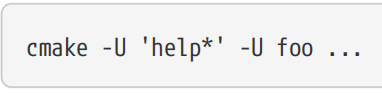

### 5.4.2. CMake GUI Tools

Setting cache variables via the command line is an essential part of automated build scripts and anything else driving CMake via the cmake command. For everyday development, however, the GUI tools provided by CMake often present a better user experience. CMake provides two equivalent GUI tools, cmake-gui and ccmake, which allow developers to manipulate cache variables interactively. cmake-gui is a fully functional GUI application supported on all major desktop platforms, whereas ccmake uses a curses-based interface which can be used in text-only environments such as over a ssh connection. Both are included in the official CMake release packages on all platforms. If using system-provided packages on Linux rather than the official releases, note that many distributions split cmake-gui out into its own package. 【译】通过命令行设置缓存变量是自动构建脚本的重要组成部分，也是通过CMake命令驱动CMake的任何其他部分。然而，对于日常开发，CMake提供的GUI工具通常会提供更好的用户体验。CMake提供了两个等效的GUI工具，cmake-gui和ccmake，它们允许开发人员交互式地操作缓存变量。Cmake-gui是一个功能齐全的gui应用程序，支持所有主要桌面平台，而ccmake使用基于curses的界面，可用于纯文本环境，如通过ssh连接。两者都包含在所有平台上的CMake官方发布包中。如果在Linux上使用系统提供的软件包而不是官方版本，请注意，许多发行版将cmake-gui拆分为自己的软件包。

The cmake-gui user interface is shown in the figure below. The top section allows the project’s source and build directories to be defined, the middle section is where the cache variables can be viewed and edited, while at the bottom are the Configure and Generate buttons and their associated log area. 【译】Cmake-gui用户界面如下图所示。顶部允许定义项目的源代码和构建目录，中间部分是可以查看和编辑缓存变量的地方，而底部是配置和生成按钮及其相关日志区域。

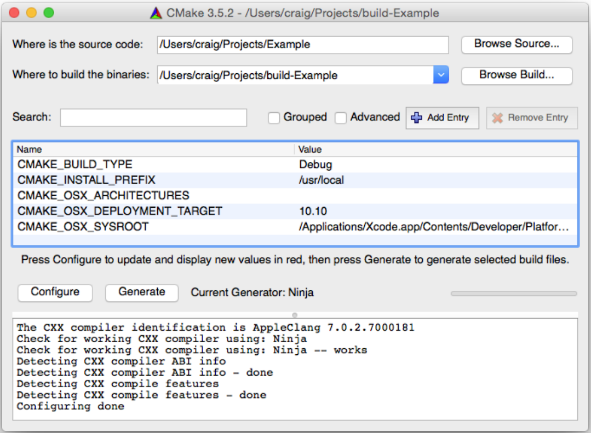

The source directory must be set to the directory containing the CMakeLists.txt file at the top of the project’s source tree. The build directory is where CMake will generate all build output (recommended directory layouts were discussed in “Chapter 2, Setting Up A Project”). For new projects, both must be set, but for existing projects, setting the build directory will also update the source directory, since the source location is stored in the build directory’s cache. 【译】源目录必须设置为项目源代码树顶部包含CMakeLists.txt文件的目录。构建目录是CMake生成所有构建输出的地方（推荐的目录布局在“第2章，设置项目”中进行了讨论）。对于新项目，必须同时设置两者，但对于现有项目，设置生成目录也会更新源目录，因为源位置存储在生成目录的缓存中。

CMake’s two-stage setup process was introduced in Section 2.3, “Generating Project Files”. In the first stage, the CMakeLists.txt file is read and a representation of the project is built up in memory. This is called the configure stage. If the configure stage is successful, the generate stage can then be executed to create the build tool’s project files in the build directory. When running cmake from the command line, both stages are executed automatically, but in the GUI application, they are triggered separately with the Configure and Generate buttons. Each time the configure step is initiated, the cache variables shown in the middle of the UI are updated. Any variables which were newly added or which changed value from the previous run will be highlighted in red (when a project is first loaded, all variables are shown highlighted). Good practice is to re-run the configure stage until there are no changes, since this ensures robust behavior for more complex projects where enabling some options may add further options which could require another configure pass. Once all cache variables are shown without red highlighting, the generate stage can be run. The example in the previous screenshot shows typical log output after the configure stage has been run and no changes were made to any of the cache variables. 【译】CMake的两阶段设置过程在第2.3节“生成项目文件”中介绍。在第一阶段，读取CMakeLists.txt文件，并在内存中构建项目的表示。这被称为配置阶段。如果配置阶段成功，则可以执行生成阶段，在构建目录中创建构建工具的项目文件。从命令行运行cmake时，这两个阶段都会自动执行，但在GUI应用程序中，它们是通过配置和生成按钮单独触发的。每次启动配置步骤时，UI中间显示的缓存变量都会更新。任何新添加的变量或与上一次运行相比更改值的变量都将以红色突出显示（当项目首次加载时，所有变量都将突出显示）。好的做法是重新运行配置阶段，直到没有变化，因为这可以确保更复杂项目的稳健行为，在这些项目中启用某些选项可能会添加更多选项，这可能需要另一次配置过程。一旦所有缓存变量都显示为没有红色突出显示，就可以运行生成阶段。上一个屏幕截图中的示例显示了配置阶段运行后的典型日志输出，并且没有对任何缓存变量进行任何更改。

Hovering the mouse over any of the cache variables will show a tooltip containing the docstring for that variable. New cache variables can also be added manually with the Add Entry button, which is equivalent to issuing a set() command with an empty docstring. Cache variables can be removed with the Remove Entry button, although CMake will most likely recreate that variable on the next run. 【译】将鼠标悬停在任何缓存变量上都会显示一个工具提示，其中包含该变量的文档字符串。也可以使用Add Entry按钮手动添加新的缓存变量，这相当于使用空docstring发出set（）命令。可以使用Remove Entry按钮删除缓存变量，尽管CMake很可能会在下次运行时重新创建该变量。

Clicking on a variable allows its value to be edited in a widget tailored to the variable type. Booleans are shown as a checkbox, files and paths have a browse filesystem button and strings are usually presented as a text line edit. As a special case, cache variables of type STRING can be given a set of values to show in a combobox in CMake GUI instead of showing a simple text entry widget. This is achieved by setting a cache variable’s STRINGS property (covered in detail in Section 9.6, “Cache Variable Properties”, but shown here for convenience): 【译】点击变量可以在针对变量类型定制的小部件中编辑其值。布尔值显示为复选框，文件和路径有一个浏览文件系统按钮，字符串通常显示为文本行编辑。作为一种特殊情况，STRING类型的缓存变量可以被赋予一组值，以在CMake GUI的组合框中显示，而不是显示一个简单的文本输入小部件。这是通过设置缓存变量的STRINGS属性来实现的（详见第9.6节“缓存变量属性”，但为方便起见，此处显示）：

\#\>\>\>\>\>\>\>\>\>\>\>\>\>\>\>\>\>\>\>\>\>\>\>\>\>\>\>\>\>\>\>\>\>\>\>\>\>\>\>\>\>\>\>\>\>\>\>\>\>\>\>\>\>

set(trafficLight Green CACHE STRING "Status of something")

set_property(CACHE trafficLight PROPERTY STRINGS Red Orange Green)

\#\<\<\<\<\<\<\<\<\<\<\<\<\<\<\<\<\<\<\<\<\<\<\<\<\<\<\<\<\<\<\<\<\<\<\<\<\<\<\<\<\<\<\<\<\<\<\<\<\<\<\<\<\<

In the above, the trafficLight cache variable will initially have the value Green. When the user attempts to modify trafficLight in cmake-gui, they will be given a combobox containing the three values Red, Orange and Green instead of a simple line edit widget which would otherwise have allowed them to enter any arbitrary text. Note that setting the STRINGS property on the variable doesn’t prevent that variable from having other values assigned to it, it only affects the widget used by cmake-gui when editing it. The variable can still be given other values via set() commands in the CMakeLists.txt file or by other means such as manually editing the CMakeCache.txt file. 【译】在上面，trafficLight缓存变量最初将具有值Green。当用户试图在cmakegui中修改trafficLight时，他们将得到一个包含红、橙和绿三个值的组合框，而不是一个简单的行编辑小部件，否则他们将可以输入任何任意文本。请注意，在变量上设置STRINGS属性并不会阻止该变量被分配其他值，它只会影响cmakegui在编辑时使用的小部件。该变量仍然可以通过CMakeLists.txt文件中的set()命令或手动编辑CMakeCache.txt文件等其他方式获得其他值。

Cache variables can also have a property marking them as advanced or not. This too only affects the way the variable is displayed in cmake-gui, it does not in any way affect how CMake uses the variable during processing. By default, cmake-gui only shows non-advanced variables, which typically presents just the main variables a developer would be interested in viewing or modifying. Enabling the Advanced option shows all cache variables except those marked INTERNAL (the only way to see INTERNAL variables is to edit the CMakeCache.txt file with a text editor, since they are not intended to be manipulated directly by developers). Variables can be marked as advanced with the mark_as_advanced() command within the CMakeLists.txt file: 【译】缓存变量也可以有一个属性，将它们标记为高级或非高级。这也只会影响变量在cmakegui中的显示方式，它不会以任何方式影响cmake在处理过程中使用变量的方式。默认情况下，cmakegui只显示非高级变量，通常只显示开发人员有兴趣查看或修改的主要变量。启用“高级”选项将显示除标记为“内部”的缓存变量之外的所有缓存变量（查看“内部”变量的唯一方法是使用文本编辑器编辑CMakeCache.txt文件，因为它们不打算由开发人员直接操作）。在CMakeLists.txt文件中，可以使用mark_as_advanced()命令将变量标记为高级：

\#\>\>\>\>\>\>\>\>\>\>\>\>\>\>\>\>\>\>\>\>\>\>\>\>\>\>\>\>\>\>

mark_as_advanced(\[CLEAR\|FORCE\] var1 \[var2...\])

\#\<\<\<\<\<\<\<\<\<\<\<\<\<\<\<\<\<\<\<\<\<\<\<\<\<\<\<\<\<\<

The CLEAR keyword ensures the variables are not marked as advanced, while the FORCE keyword ensures the variables are marked advanced. Without either keyword, the variables will only be marked as advanced if they don’t already have an advanced/non-advanced state set.

【译】CLEAR关键字确保变量不标记为高级，而FORCE关键字确保变量标记为高级。如果没有这两个关键字，只有当变量还没有高级/非高级状态集时，它们才会被标记为高级。

Selecting the Grouped option can make viewing advanced variables easier by grouping variables together based on the start of the variable name up to the first underscore. Another way to filter the list of variables shown is to enter text in the Search area, which results in only showing variables with the specified text in their name or value. 【译】选择Grouped选项可以根据变量名称的开头到第一个下划线将变量分组在一起，从而更容易查看高级变量。过滤显示的变量列表的另一种方法是在搜索区域中输入文本，这只会显示名称或值中包含指定文本的变量。

When the configure stage is run for the first time on a new project, the developer is presented with a dialog similar to that shown in the next screenshot: 【译】当配置阶段首次在新项目上运行时，开发人员会看到一个类似于下一个屏幕截图所示的对话框：

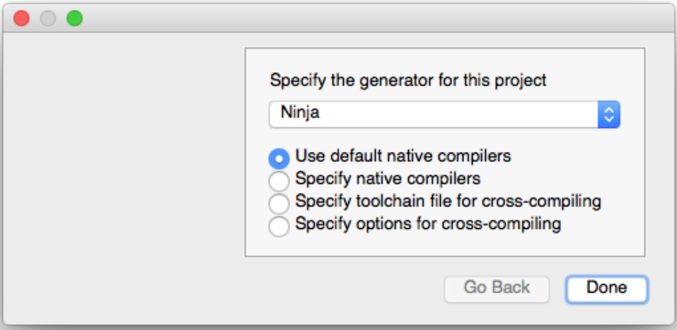

This dialog is where the CMake generator and toolchain are specified. The choice of generator is usually up to the developer’s personal preference, with available options provided in the combobox. Depending on the project, the choice of generator may be more restricted than what the combobox options allow, such as if the project relies on generator-specific functionality. A common example of this is a project that requires the Xcode generator due to the Apple platform’s unique features, such as code signing and iOS/tvOS/watchOS support. Once a generator has been selected for a project, it cannot be changed without deleting the cache and starting again, which can be done from the File menu if required. 【译】此对话框用于指定CMake生成器和工具链。生成器的选择通常取决于开发人员的个人偏好，组合框中提供了可用的选项。根据项目的不同，生成器的选择可能比组合框选项允许的更受限制，例如如果项目依赖于生成器特定的功能。一个常见的例子是，由于苹果平台的独特功能，如代码签名和iOS/tvOS/watchOS支持，一个项目需要Xcode生成器。一旦为项目选择了生成器，如果不删除缓存并重新启动，就无法对其进行更改，如果需要，可以从“文件”菜单中完成。

For the toolchain options presented, each one requires progressively more information from the developer. Using the default native compilers is the usual choice for ordinary desktop development and selecting that option requires no further details. If more control is required, developers can instead override the native compilers, with the paths to the compilers being given in a follow-up dialog. If a separate toolchain file is available, that can be used to customize not just the compilers but also the target environment, compiler flags and various other things. Using a toolchain file is typical when cross-compiling, which is covered in detail in “Chapter 21, Toolchains And Cross Compiling”. Lastly, for ultimate control, developers can specify the full set of options for crosscompiling, but this is not recommended for normal use. A toolchain file can provide the same information but has the advantage that it can be re-used as needed. 【译】对于所提供的工具链选项，每个选项都需要开发人员提供越来越多的信息。使用默认的本机编译器是普通桌面开发的常见选择，选择该选项不需要更多细节。如果需要更多的控制，开发人员可以替代本地编译器，在后续对话框中给出编译器的路径。如果有单独的工具链文件可用，则不仅可以用于自定义编译器，还可以用于自定义目标环境、编译器标志和各种其他内容。交叉编译时通常使用工具链文件，这在“第21章，工具链和交叉编译”中有详细介绍。最后，为了最终控制，开发人员可以指定交叉编译的全套选项，但不建议正常使用。工具链文件可以提供相同的信息，但具有可以根据需要重复使用的优点。

The ccmake tool offers all the same functionality as the cmake-gui application, but it does so through a text-based interface. 【译】ccmake工具提供了与cmakegui应用程序相同的所有功能，但它是通过基于文本的界面实现的。

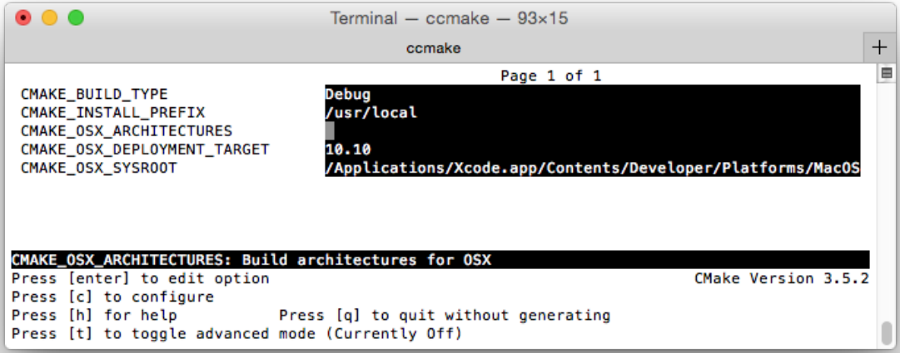

Rather than selecting the source and build directories like with cmake-gui, the source or build directory has to be specified on the ccmake command line, just like for the cmake command.

【译】与使用cmakegui选择源代码和构建目录不同，必须在ccmake命令行上指定源代码或构建目录，就像cmake命令一样。

One main drawback of the ccmake interface is that the log output is not captured as conveniently as with the cmake-gui version. The ability to filter the variables shown is also not provided and the methods for editing a variable are not as rich as with cmake-gui. Other than that, the ccmake tool is a useful alternative when the full cmake-gui application is not practical or not available, such as over a terminal connection that cannot support UI forwarding. 【译】ccmake接口的一个主要缺点是，日志输出的捕获不如cmakegui版本方便。也没有提供过滤所示变量的能力，编辑变量的方法也不如cmakegui丰富。除此之外，当完整的cmakegui应用程序不实用或不可用时，ccmake工具是一个有用的替代方案，例如通过无法支持UI转发的终端连接。

## 5.5. Debugging Variables And Diagnostics

As projects get more complicated or when investigating unexpected behavior, it can be useful to print out diagnostic messages and variable values during a CMake run. This is generally achieved using the message() command. 【译】随着项目变得越来越复杂或在调查意外行为时，在CMake运行期间打印诊断消息和变量值可能很有用。这通常是通过使用message()命令来实现的。

\#\>\>\>\>\>\>\>\>\>\>\>\>\>\>\>\>\>\>\>\>\>\>\>\>\>\>\>\>\>\>\>\>\>

message(\[mode\] msg1 \[msg2\]...)

\#\<\<\<\<\<\<\<\<\<\<\<\<\<\<\<\<\<\<\<\<\<\<\<\<\<\<\<\<\<\<\<\<\<

If more than one msg is specified, they will be joined together into a single string without any separators. This is typically not what the developer intended, so the more common usage is a single msg with the message surrounded by quotes to preserve spaces. Variable values can be used and will be evaluated before printing the result. For example: 【译】如果指定了多个msg，它们将连接在一起形成一个没有任何分隔符的字符串。这通常不是开发人员想要的，因此更常见的用法是使用单个消息，消息周围用引号括起来以保留空格。可以使用变量值，并在打印结果之前对其进行评估。例如：

\#\>\>\>\>\>\>\>\>\>\>\>\>\>\>\>\>\>\>\>\>\>\>\>\>\>\>\>\>\>\>\>\>

set(myVar HiThere)

message("The value of myVar = \${myVar}")

\#\<\<\<\<\<\<\<\<\<\<\<\<\<\<\<\<\<\<\<\<\<\<\<\<\<\<\<\<\<\<\<\<

This will give the following output:【译】这将给出以下输出：

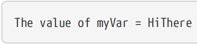

The message() command accepts an optional mode keyword which affects how the message is output and in some cases halts the build with an error. Recognized mode values are: 【译】message()命令接受一个可选的mode关键字，该关键字会影响消息的输出方式，在某些情况下会因错误而停止构建。公认的模式值包括：

\#\>\>\>\>\>\>\>\>\>\>\>\>\>\>\>\>\>\>\>\>\>\>\>\>\>\>\>\>\>\>\>\>\>\>\>\>\>\>\>\>\>\>\>\>\>\>\>\>\>\>\>\>\>

**\#(1)STATUS**

Incidental information. Messages will normally be preceded by two hyphens. 【译】附带信息。消息前面通常有两个连字符。

**\#(2)WARNING**

CMake warning, usually shown highlighted in red where supported (cmake command line console or the cmake-gui log area). Processing will continue.【译】CMake警告，通常在支持的地方以红色突出显示（CMake命令行控制台或cmake-gui日志区域）。处理将继续。

**\#(3)AUTHOR_WARNING**

Like WARNING, but only shown if developer warnings are enabled (requires the -Wdev option on the cmake command line). Projects do not often use this particular type of message. 【译】与警告类似，但仅在启用开发人员警告时显示（需要cmake命令行上的-Wdev选项）。项目不经常使用这种特定类型的消息。

**\#(4)SEND_ERROR**

Indicates an error message which will be shown highlighted in red, where supported. Processing will continue until the configure stage completes, but generation will not be performed. This is like an error that allows further processing to be attempted, but ultimately still indicates a failure.

【译】表示一条错误消息，在支持的情况下，该消息将以红色突出显示。处理将继续，直到配置阶段完成，但不会执行生成。这就像一个允许进一步处理的错误，但最终仍表示失败。

**\#(5)FATAL_ERROR**

Denotes a hard error. The message will be printed and processing will stop immediately. The log will also normally record the location of the fatal message() command. 【译】表示严重错误。消息将被打印，处理将立即停止。日志通常还会记录致命message()命令的位置。

**\#(6)DEPRECATION**

Special category used to log a deprecation message. If the CMAKE_ERROR_DEPRECATED variable is defined to a boolean true value, the message will be treated as an error. If CMAKE_WARN_DEPRECATED is defined to a boolean true, the message will be treated as a warning. If neither variable is defined, the message will not be shown. 【译】用于记录弃用消息的特殊类别。如果CMAKE_ERROR_DEPRECATED变量被定义为布尔真值，则该消息将被视为错误。如果CMAKE_WARN_DEPRECATED定义为布尔值true，则该消息将被视为警告。如果两个变量都没有定义，则不会显示消息。

\#\<\<\<\<\<\<\<\<\<\<\<\<\<\<\<\<\<\<\<\<\<\<\<\<\<\<\<\<\<\<\<\<\<\<\<\<\<\<\<\<\<\<\<\<\<\<\<\<

If no mode keyword is provided, then the message is considered to be important information and is logged without any modification. It should be noted, however, that logging with a STATUS mode is not the same as logging a message with no mode keyword at all. When using a STATUS mode, the message will be printed correctly ordered with other CMake messages and will be preceded by two hyphens, whereas without any mode keyword, no leading hyphens are prepended and it is not unusual for the message to appear out of order relative to other messages which did include a mode keyword. 【译】如果没有提供模式关键字，则该消息被视为重要信息，并在不进行任何修改的情况下记录下来。然而，应该注意的是，使用STATUS模式记录与完全不使用mode关键字记录消息不同。使用STATUS模式时，消息将与其他CMake消息按正确顺序打印，并在前面加上两个连字符，而如果没有任何mode关键字，则不会在前面加连字符，并且消息相对于包含mode关键字的其他消息出现乱序的情况并不罕见。

The other mechanism CMake provides for helping debug usage of variables is the variable_watch() command. This is intended for more complex projects where it may not be clear how a variable ended up with a particular value. When a variable is watched, all attempts to read or modify it are logged. 【译】CMake提供的另一种帮助调试变量使用的机制是variable_watch()命令。这适用于更复杂的项目，在这些项目中，可能不清楚变量是如何得到特定值的。当监视变量时，所有读取或修改它的尝试都会被记录下来。

\#\>\>\>\>\>\>\>\>\>\>\>\>\>\>\>\>\>\>\>\>\>\>\>\>\>\>

variable_watch(myVar \[command\])

\#\<\<\<\<\<\<\<\<\<\<\<\<\<\<\<\<\<\<\<\<\<\<\<\<\<\<

For the vast majority of cases, simply listing the variable to be watched without the optional command is sufficient, as it logs all accesses to the nominated variable. For ultimate control, however, a command can be given which will be executed every time the variable is read or modified. The command is expected to be the name of a CMake function or macro (see “Chapter 8, Functions And Macros”) and it will be passed the following arguments: variable name, type of access, the variable’s value, the name of the current list file and the list file stack (list files are discussed in “Chapter 7, Using Subdirectories”). Specifying a command with variable_watch() would be very uncommon though. 【译】对于绝大多数情况，只列出要监视的变量而不使用可选命令就足够了，因为它会记录对指定变量的所有访问。然而，对于最终控制，可以给出一个命令，每次读取或修改变量时都会执行该命令。该命令应为CMake函数或宏的名称（请参阅“第8章，函数和宏”），并将传递以下参数：变量名称、访问类型、变量值、当前列表文件的名称和列表文件堆栈（列表文件在“第7章，使用子目录”中讨论）。不过，使用variable_watch（）指定命令的情况并不常见。

## 5.6. String Handling

As project complexity grows, in many cases so too does the need to implement more involved logic for how variables are managed. A core tool CMake provides for this the string() command, which provides a wide range of useful string handling functionality. This command enables projects to perform find and replace operations, regular expression matching, upper/lower case transformations, strip whitespace and other common tasks. Some of the more frequently used functionality is presented below, but the CMake reference documentation should be considered the canonical source of all available operations and their behavior. 【译】随着项目复杂性的增加，在许多情况下，也需要为变量的管理实现更复杂的逻辑。核心工具CMake为此提供了string()命令，该命令提供了广泛的有用字符串处理功能。此命令使项目能够执行查找和替换操作、正则表达式匹配、大写/小写转换、带空格和其他常见任务。下面介绍了一些更常用的功能，但CMake参考文档应被视为所有可用操作及其行为的规范来源。

The first argument to string() defines the operation to be performed and subsequent arguments depend on the operation being requested. These arguments will generally require at least one input string and since CMake commands cannot return a value, an output variable for the result of the operation. In the material below, this output variable will generally be named outVar.

【译】String()的**第一个参数**定义了要执行的操作，后续参数取决于所请求的操作。这些参数通常需要至少一个输入字符串，由于**CMake命令不能返回值**，因此它是操作结果的输出变量。在下面的材料中，此输出变量通常命名为**outVar**。

### \#5.6.1 string(FIND)

\#\>\>\>\>\>\>\>\>\>\>\>\>\>\>\>\>\>\>\>\>\>\>\>\>

string(FIND inputString subString outVar \[REVERSE\])

\#\<\<\<\<\<\<\<\<\<\<\<\<\<\<\<\<\<\<\<\<\<\<\<\<

FIND searches for subString in inputString and stores the index of the found subString in outVar (the first character is index 0). The first occurrence is found unless REVERSE is specified, in which case the last occurrence will be found instead. If subString does not appear in inputString, then outVar will be given the value -1.

【译】FIND在inputString中搜索subString，并将找到的subString的索引存储在outVar中（第一个字符是索引0）。除非指定了REVERSE，否则将找到第一个匹配项，在这种情况下，将找到最后一个匹配项。如果inputString中没有出现subString，则outVar将被赋予值-1。

\#\>\>\>\>\>\>\>\>\>\>\>\>\>\>\>\>\>\>\>\>\>\>\>

set(longStr abcdefabcdef)

set(shortBit def)

string(FIND \${longStr} \${shortBit} fwdIndex)

string(FIND \${longStr} \${shortBit} revIndex REVERSE)

message("fwdIndex = \${fwdIndex}, revIndex = \${revIndex}")

\#\<\<\<\<\<\<\<\<\<\<\<\<\<\<\<\<\<\<\<\<\<\<\<\<

This results in the following output:【译】这将产生以下输出：

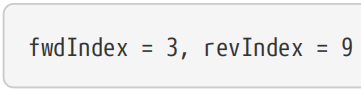

### \#5.6.2string(REPLACE

Replacing a simple substring follows a similar pattern: 【译】替换一个简单的子字符串遵循类似的模式：

\#\>\>\>\>\>\>\>\>\>\>\>\>\>\>\>\>\>\>\>\>\>\>\>\>\>\>

string(REPLACE matchString replaceWith outVar input \[input...\])

\#\<\<\<\<\<\<\<\<\<\<\<\<\<\<\<\<\<\<\<\<\<\<\<\<\<\<

The REPLACE operation will replace every occurrence of matchString in the input strings with replaceWith and store the result in outVar. When multiple input strings are given, they are joined together without any separator between each string before searching for substitutions. This can sometimes lead to unexpected matches and typically developers would provide just the one input string in most situations.

【译】REPLACE操作将用replaceWith替换输入字符串中每次出现的matchString，并将结果存储在outVar中。当给出多个输入字符串时，在搜索替换之前，它们会连接在一起，每个字符串之间没有任何分隔符。这有时会导致意外的匹配，在大多数情况下，开发人员通常只提供一个输入字符串。

### \#5.6.3string(REGEX)

Regular expressions are also well supported by the REGEX operation, with a few different variants available as determined by the second argument:

【译】正则表达式也得到了REGEX操作的很好支持，根据第二个参数的确定，有一些不同的变体可供选择：

\#\>\>\>\>\>\>\>\>\>\>\>\>\>\>\>\>\>\>\>\>\>\>\>\>\>\>\>

string(REGEX MATCH regex outVar input \[input...\])

string(REGEX MATCHALL regex outVar input \[input...\])

string(REGEX REPLACE regex replaceWith outVar input \[input...\])

\#\<\<\<\<\<\<\<\<\<\<\<\<\<\<\<\<\<\<\<\<\<\<\<\<\<\<\<\<

The regular expression to match, regex, can make use of typical basic regular expression syntax (see the CMake reference documentation for the full specification), although some common features such as negation are not supported. The input strings are concatenated before substitution. The MATCH operation finds just the first match and stores it in outVar. MATCHALL finds all matches and stores them in outVar as a list. REPLACE will return the entire input string with each match replaced by replaceWith. Matches can be referred to in replaceWith using the usual notation \1, \2, etc., but note that the backslashes themselves must be escaped in CMake. The following examples demonstrate the required syntax:

【译】要匹配的正则表达式regex可以使用典型的基本正则表达式语法（有关完整规范，请参阅CMake参考文档），尽管不支持一些常见功能，如否定。输入字符串在替换之前被连接起来。MATCH操作只查找第一个匹配项并将其存储在outVar中。MATCHALL查找所有匹配项并将其作为列表存储在outVar中。REPLACE将返回整个输入字符串，每个匹配项都替换为replaceWith。在replaceWith中可以使用常用的符号\1、\2等引用匹配项，但请注意，在CMake中必须转义反斜杠本身。以下示例演示了所需的语法：

\#\>\>\>\>\>\>\>\>\>\>\>\>\>\>\>\>\>\>\>\>\>\>\>\>\>\>\>\>\>\>\>\>\>\>\>\>\>\>

set(longStr abcdefabcdef)

string(REGEX MATCHALL "\[ace\]" matchVar \${longStr})

string(REGEX REPLACE "(\[de\])" "X\\1Y" replVar \${longStr})

message("matchVar = \${matchVar}")

message("replVar = \${replVar}")

\#\<\<\<\<\<\<\<\<\<\<\<\<\<\<\<\<\<\<\<\<\<\<\<\<\<\<\<\<\<\<\<\<\<\<\<\<\<\<\<\<

The resultant output of the above is: 【译】上述结果为：

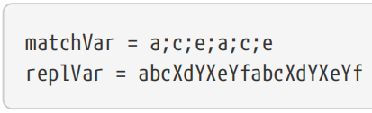

### \#5.6.4string(SUBSTRING)

Extracting a substring is also possible:【译】提取子字符串也是可能的：

\#\>\>\>\>\>\>\>\>\>\>\>\>\>\>\>\>\>

string(SUBSTRING input index length outVar)

\#\<\<\<\<\<\<\<\<\<\<\<\<\<\<\<\<\<\<\<

The index is an integer defining the start of the substring to extract from input. Up to length characters will be extracted, or if length is -1, the returned substring will contain all characters up to the end of the input string. Note that in CMake 3.1 and earlier, an error was reported if length pointed past the end of the string. 【译】索引是一个整数，定义了要从输入中提取的子字符串的开头。将提取最大长度的字符，或者如果长度为-1，则返回的子字符串将包含输入字符串末尾之前的所有字符。请注意，在CMake 3.1和更早版本中，如果长度指向字符串末尾，则会报告错误。

### \#5.6.5string(LENGTH)/string(TOLOWER)/string(STRIP)

String length can be trivially obtained and strings can easily be converted to upper or lower case. It is also straightforward to strip whitespace from the start and end of a string. The syntax for these operations all share the same form: 【译】字符串长度可以轻松获得，字符串可以很容易地转换为大写或小写。从字符串的开头和结尾去掉空格也很简单。这些操作的语法都有相同的形式：

\#\>\>\>\>\>\>\>\>\>\>\>\>\>\>\>\>\>\>\>

string(LENGTH input outVar)

string(TOLOWER input outVar)

string(TOUPPER input outVar)

string(STRIP input outVar)

\#\<\<\<\<\<\<\<\<\<\<\<\<\<\<\<\<\<\<\<\<

CMake provides other operations, such as string comparison, hashing, timestamps and more, but their use is less common in everyday CMake projects. The interested reader should consult the CMake reference documentation for the string() command for full details.

【译】CMake还提供其他操作，如字符串比较、哈希、时间戳等，但在日常CMake项目中使用它们并不常见。感兴趣的读者应该查阅CMake参考文档，了解string（）命令的完整细节。

## 5.7. Lists

Lists are used heavily in CMake. Ultimately, lists are just a single string with list items separated by semicolons, which can make it less convenient to manipulate individual list items. CMake provides the list() command to facilitate such tasks. Like for the string() command, list() expects the operation to perform as its first argument. The second argument is always the list to operate on and it must be a variable (i.e. passing a raw list like a;b;c is not permitted). 【译】CMake中大量使用列表。最终，列表只是一个字符串，列表项之间用分号分隔，这可能会降低操作单个列表项的便利性。CMake提供了list()命令来简化此类任务。与string()命令一样，list()期望该操作作为其第一个参数执行。第二个参数始终是要操作的列表，它必须是一个变量（即不允许传递像a；b；c这样的原始列表）。

### \#5.7.1 list(LENGTH)/list(GET)

The most basic list operations are counting the number of items and retrieving one or more items from the list: 【译】最基本的列表操作是计算项目数量并从列表中检索一个或多个项目：

\#\>\>\>\>\>\>\>\>\>\>\>\>\>\>\>\>\>\>\>\>\>\>\>\>\>\>\>\>\>\>\>\>\>\>\>\>\>\>\>

list(LENGTH listVar outVar)

list(GET listVar index \[index...\] outVar)

\#\<\<\<\<\<\<\<\<\<\<\<\<\<\<\<\<\<\<\<\<\<\<\<\<\<\<\<\<\<\<\<\<\<\<\<\<\<\<\<

示例：

\#\>\>\>\>\>\>\>\>\>\>\>\>\>\>\>\>\>\>\>\>\>\>\>\>\>\>\>\>\>\>\>\>\>\>\>\>\>\>\>

\# Example

set(myList a b c) \# Creates the list "a;b;c"

list(LENGTH myList len)

message("length = \${len}")

list(GET myList 2 1 letters)

message("letters = \${letters}")

\#\<\<\<\<\<\<\<\<\<\<\<\<\<\<\<\<\<\<\<\<\<\<\<\<\<\<\<\<\<\<\<\<\<\<\<\<\<\<\<

The output of the above example would be:【译】上述示例的输出将是：

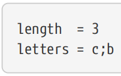

### \#5.7.2 list(APPEND)/list(INSERT)

Appending and inserting items is also a common task: 【译】添加和插入项目也是一项常见任务：

\#\>\>\>\>\>\>\>\>\>\>\>\>\>\>\>\>\>\>\>\>\>\>\>\>\>\>\>\>\>\>

list(APPEND listVar item \[item...\])

list(INSERT listVar index item \[item...\])

\#\<\<\<\<\<\<\<\<\<\<\<\<\<\<\<\<\<\<\<\<\<\<\<\<\<\<\<\<\<\<

Unlike the LENGTH and GET cases, APPEND and INSERT act directly on the listVar and modify it in-place, as demonstrated by the following example: 【译】与LENGTH和GET不同，APPEND和INSERT直接作用于listVar并对其进行修改，如下例所示：

\#\>\>\>\>\>\>\>\>\>\>\>\>\>\>\>\>\>\>\>\>\>\>\>\>\>\>\>\>\>\>\>\>

set(myList a b c)

list(APPEND myList d e f)

message("myList (first) = \${myList}")

list(INSERT myList 2 X Y Z)

message("myList (second) = \${myList}")

\#\<\<\<\<\<\<\<\<\<\<\<\<\<\<\<\<\<\<\<\<\<\<\<\<\<\<\<\<\<\<\<\<

Which gives the following output: 【译】这给出了以下输出：

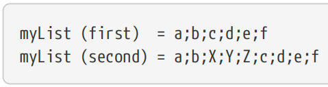

### \#5.7.3 list(FIND)

Finding a particular item in the list follows the expected pattern:【译】在列表中查找特定项目遵循预期的模式：

\`\`\`cmake

list(FIND myList value outVar)

\`\`\`

示例

\#\>\>\>\>\>\>\>\>\>\>\>\>\>\>\>\>\>\>\>\>\>\>\>\>\>\>

\# Example

set(myList a b c d e)

list(FIND myList d index)

message("index = \${index}")

\#\<\<\<\<\<\<\<\<\<\<\<\<\<\<\<\<\<\<\<\<\<\<\<\<\<\<

Expected output: 【译】期待的输出：

### \#5.7.4 list(REMOVE_XXX)

Three operations are provided for removing items, all of which modify the list directly: 【译】提供了三种删除项目的操作，所有这些操作都可以直接修改列表：

\#\>\>\>\>\>\>\>\>\>\>\>\>\>\>\>\>\>\>\>\>\>\>\>\>\>\>\>\>\>\>\>\>\>\>

list(REMOVE_ITEM myList value \[value...\])

list(REMOVE_AT myList index \[index...\])

list(REMOVE_DUPLICATES myList)

\#\<\<\<\<\<\<\<\<\<\<\<\<\<\<\<\<\<\<\<\<\<\<\<\<\<\<\<\<\<\<\<\<\<\<

The REMOVE_ITEM operation can be used to remove one or more items from a list. If the item is not in the list, it is not an error. REMOVE_AT on the other hand, specifies one or more indices to remove and CMake will halt with an error if any of the specified indices are past the end of the list. REMOVE_DUPLICATES will ensure the list contains only unique items. 【译】REMOVE_ITEM操作可用于从列表中删除一个或多个项目。如果该项不在列表中，则不是错误。另一方面，REMOVE_AT指定要删除的一个或多个索引，如果任何指定的索引超过列表末尾，CMake将停止并显示错误。REMOVE_DUPLICATES将确保列表只包含唯一的项目。

### \#5.7.5 list(REVERSE)/list(SORT)

List items can also be reordered with REVERSE or SORT operations (sorting is alphabetical): 【译】列表项也可以通过REVERSE或SORT操作重新排序（排序按字母顺序）：

\#\>\>\>\>\>\>\>\>\>\>\>\>\>\>\>\>\>\>\>\>\>\>\>\>\>\>

list(REVERSE myList)

list(SORT myList)

\#\<\<\<\<\<\<\<\<\<\<\<\<\<\<\<\<\<\<\<\<\<\<\<\<\<\<

For all list operations which take an index as input, the index can be negative to indicate counting starts from the end of the list instead of the start. When used this way, the last item in the list has index -1, the second last -2 and so on. 【译】对于所有以索引为输入的列表操作，索引可以为负，表示计数从列表的末尾而不是开始。当以这种方式使用时，列表中的最后一项具有索引-1，倒数第二个具有索引-2，以此类推。

The above describes most of the available list() subcommands. Those mentioned are all supported since at least CMake 3.0, so projects should generally be able to expect them to be available. For the full list of supported subcommands, including those added in later CMake versions, the reader should consult the CMake documentation. 【译】上面描述了大多数可用的list()子命令。至少从CMake 3.0开始，这些都得到了支持，因此项目通常应该能够期望它们可用。有关支持的子命令的完整列表，包括在以后的CMake版本中添加的子命令，读者应该参考CMake文档。

## 5.8. Math

One other common form of variable manipulation is math computation. CMake provides the math() command for performing basic mathematical evaluation: 【译】另一种常见的变量操作形式是数学计算。CMake提供了用于执行基本数学计算的math()命令：

\`\`\`cmake

math(EXPR outVar mathExpr)

\`\`\`

The first argument must by the keyword EXPR, while mathExpr defines the expression to be evaluated and the result will be stored in outVar. The expression may use any of the following operators which all have the same meaning as they would in C code: + - \* / % \| & ^ ~ \<\< \>\> \* / %. Parentheses are also supported and have their usual mathematical meaning. Variables can be referenced in the mathExpr with the usual \${myVar} notation. 【译】第一个参数必须是关键字EXPR，而mathExpr定义了要计算的表达式，结果将存储在outVar中。表达式可以使用以下任何运算符，这些运算符的含义与C代码中的含义相同：+-\*/%\|&^~\<\<\>\>\*/%。括号也得到了支持，并具有其通常的数学含义。变量可以在mathExpr中用常用的\${myVar}表示法引用。

\#\>\>\>\>\>\>\>\>\>\>\>\>\>\>\>\>\>\>\>\>\>\>

set(x 3)

set(y 7)

math(EXPR z "(\${x}+\${y}) / 2")

message("result = \${z}")

\#\<\<\<\<\<\<\<\<\<\<\<\<\<\<\<\<\<\<\<\<\<\<

Expected output: 【译】期待的输出：

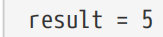

## 5.9. Recommended Practices

5.9. 推荐做法

Where the development environment allows it, the CMake GUI tool is a useful way to quickly and easily understand the build options for a project and to modify them as needed during development. A little bit of time spent getting familiar with it will simplify working with more complex projects later. It also gives developers a good base to work from should they need to experiment with things like compiler settings, since these are easily found and modified within the GUI environment. 【译】在开发环境允许的情况下，CMake GUI工具是一种有用的方法，可以快速轻松地理解项目的构建选项，并在开发过程中根据需要进行修改。花一点时间熟悉它将简化以后处理更复杂项目的工作。它还为开发人员提供了一个良好的工作基础，如果他们需要尝试编译器设置等东西，因为这些设置很容易在GUI环境中找到和修改。

Prefer to provide cache variables for controlling whether to enable optional parts of the build instead of encoding the logic in build scripts outside of CMake. This makes it trivial to turn them on and off in the CMake GUI and other tools which understand how to parse CMakeLists.txt files (a growing number of IDE environments are acquiring this capability). 【译】更倾向于提供缓存变量来控制是否启用构建的可选部分，而不是在CMake之外的构建脚本中编码逻辑。这使得在CMake GUI和其他了解如何解析CMakeLists.txt文件的工具中打开和关闭它们变得轻而易举（越来越多的IDE环境正在获得这种功能）。

Try to avoid relying on environment variables being defined, apart from perhaps the ubiquitous PATH or similar operating system level variables. The build should be predictable, reliable and easy to set up, but if it relies on environment variables being set for things to work correctly, this can be a point of frustration for new developers as they wrestle to get their build environment set up. Furthermore, the environment at the time CMake is run can change compared to when the build itself is invoked. Therefore, prefer to pass information directly to CMake through cache variables instead wherever possible. 【译】尽量避免依赖于定义的环境变量，除了无处不在的PATH或类似的操作系统级变量。构建应该是可预测的、可靠的和易于设置的，但如果它依赖于环境变量的设置才能正常工作，这可能会让新开发人员在努力设置构建环境时感到沮丧。此外，与调用构建本身时相比，运行CMake时的环境可能会发生变化。因此，尽可能通过缓存变量将信息直接传递给CMake。

Try to establish a variable naming convention early. For cache variables, consider grouping related variables under a common prefix followed by an underscore to take advantage of how CMake GUI groups variables based on the same prefix automatically. Also consider that the project may one day become a sub-part of some larger project, so a name beginning with the project name or something closely associated with the project may be desirable. 【译】尝试尽早建立变量命名约定。对于缓存变量，考虑将相关变量分组在一个公共前缀下，后跟一个下划线，以利用CMake GUI如何自动基于相同前缀对变量进行分组。还要考虑到，该项目可能有一天会成为某个更大项目的一个子部分，因此以项目名称开头的名称或与项目密切相关的名称可能是可取的。

Try to avoid defining non-cache variables in the project which have the same name as cache variables. The interaction between the two types of variables can be unexpected for developers new to CMake. Later chapters also highlight other common errors and misuses of regular variables that share the same name as cache variables. 【译】尽量避免在项目中定义与缓存变量同名的非缓存变量。对于CMake的新手开发人员来说，这两种变量之间的交互可能是出乎意料的。后面的章节还强调了与缓存变量同名的常规变量的其他常见错误和误用。

For log messages intended to remain as part of the build, aim to always specify a mode with the message() command. If the message is of a general informational nature, prefer to use STATUS rather than no mode keyword at all so that message output does not appear out of order in the build log. Temporary debugging messages frequently use no mode keyword for convenience, but if they are likely to remain part of the project for any length of time, it is better that they too specifying a mode (typically STATUS). 【译】对于打算作为构建的一部分保留的日志消息，目标是始终使用message（）命令指定一种模式。如果消息具有一般信息性质，则最好使用STATUS而不是根本不使用mode关键字，这样消息输出在构建日志中就不会出现顺序错误。为了方便起见，临时调试消息经常不使用mode关键字，但如果它们可能在任何时间内都是项目的一部分，最好也指定一个模式（通常是STATUS）。

CMake provides a large number of pre-defined variables that provide details about the system or influence certain aspects of CMake’s behavior. Some of these variables are heavily used by projects, such as those that are only defined when building for a particular platform (WIN32, APPLE, UNIX, etc.). It is therefore recommended for developers to occasionally make a quick scan through the CMake documentation page listing the pre-defined variables to help become familiar with what is available. 【译】CMake提供了大量预定义的变量，这些变量提供了有关系统的详细信息或影响CMake行为的某些方面。其中一些变量被项目大量使用，例如那些仅在为特定平台（WIN32、APPLE、UNIX等）构建时定义的变量。因此，建议开发人员偶尔快速浏览CMake文档页面，其中列出了预定义的变量，以帮助熟悉可用的内容。
