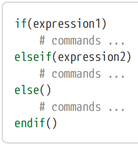
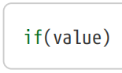
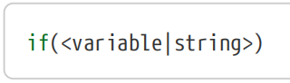
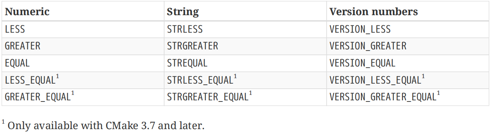
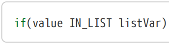
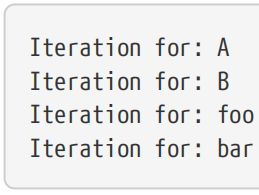
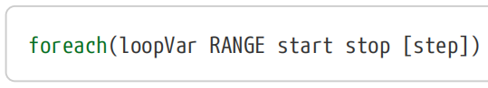
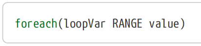
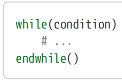
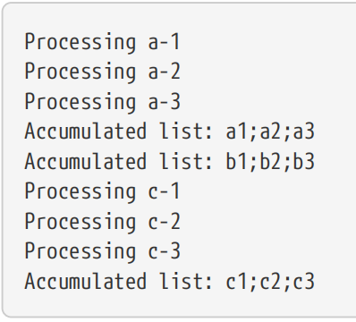

# Ch6. Flow Control

A common need for most CMake projects is to apply some steps only in certain circumstances. Projects may want to use certain compiler flags only with a particular compiler or when building for a particular platform, for example. In other cases, the project may need to iterate over a set of values or to keep repeating some set of steps until a certain condition is met. These examples of flow control are well supported by CMake in ways which should be familiar to most software developers. The ubiquitous if() command provides the expected if-then-else behavior and looping is provided through the foreach() and while() commands. All three commands provide the traditional behavior as implemented by most programming languages, but they also have added features specific to CMake. 【译】大多数CMake项目的一个常见需求是仅在特定情况下应用某些步骤。例如，项目可能希望仅在特定编译器或为特定平台构建时使用某些编译器标志。在其他情况下，项目可能需要迭代一组值或不断重复一些步骤，直到满足特定条件。CMake以大多数软件开发人员应该熟悉的方式很好地支持了这些流控制示例。无处不在的if（）命令提供了预期的if-then-else行为，循环是通过foreach（）和while（）命令来提供的。这三个命令都提供了大多数编程语言实现的传统行为，但它们也添加了特定于CMake的功能。

## 6.1. The if() Command

The modern form of the if() command is as follows (multiple elseif() clauses can be provided):

【译】if()命令的现代形式如下（可以提供多个elseif()子句）：

Very early versions of CMake required expression1 to be repeated as an argument to the else() and endif() clauses, but this has not been required since CMake 2.8.0. While it is still not unusual to encounter projects and example code using that older form, it is discouraged for new projects since it can be somewhat confusing to read. New projects should leave the else() and endif() arguments empty, as shown above. 【译】CMake的早期版本要求将expression1作为else()和endif()子句的参数重复，但自CMake 2.8.0以来就不再需要了。虽然遇到使用旧形式的项目和示例代码并不罕见，但对于新项目来说，这是不可取的，因为阅读起来可能会有点困惑。新项目应该将else()和endif()参数留空，如上所示。

The expressions in if() and elseif() commands can take a variety of different forms. CMake offers the traditional boolean logic as well as various other conditions such as file system tests, version comparison and testing for the existence of things. 【译】if()和elseif()命令中的表达式可以采用各种不同的形式。CMake提供了传统的布尔逻辑以及各种其他条件，如文件系统测试、版本比较和事物存在性测试。

### 6.1.1. Basic Expressions 

The most basic of all expressions is a single constant: 【译】所有表达式中最基本的是一个常量：

CMake’s logic for what it considers true and false is a little more involved than most programming languages. For a single unquoted constant, the rules are as follows: 【译】CMake对于真假的逻辑比大多数编程语言都要复杂一些。对于单个未加引号的常量，规则如下：

• If value is an unquoted constant with value 1, ON, YES, TRUE, Y or a non-zero number, it is treated as true. The test is case-insensitive. 【译】如果value是一个值为1、ON、YES、TRUE、Y或非零的无引号常量，则将其视为TRUE。该测试不区分大小写。

• If value is an unquoted constant with value 0, OFF, NO, FALSE, N, IGNORE, NOTFOUND, an empty string or a string that ends in -NOTFOUND, it is treated as false. Again, the test is case-insensitive. 【译】如果value是一个未加引号的常量，其值为0、OFF、NO、FALSE、N、IGNORE、NOTFOUND、空字符串或以-NOTFOUND结尾的字符串，则将其视为FALSE。同样，该测试不区分大小写。

• If neither of the above two cases apply, it will be treated as a variable name (or possibly as a string) and evaluated further as described below.【译】如果上述两种情况都不适用，则将其视为变量名（或可能视为字符串），并按如下所述进行进一步评估。

In the following examples, only the if(…) part of the command is shown for illustration purposes, the corresponding body and endif() is omitted: 【译】在以下示例中，为了便于说明，只显示了命令的if(…)部分，省略了相应的body和endif()：

\#\>\>\>\>\>\>\>\>\>\>\>\>\>\>\>\>\>\>\>\>\>\>\>\>\>\>\>\>\>\>\>\>\>\>\>\>\>\>\>\>\>\>\>\>\>\>\>

\# Examples of unquoted constants

if(YES)

if(0)

if(TRUE)

\# These are also treated as unquoted constants because the

\# variable evaluation occurs before if() sees the values

set(A YES)

set(B 0)

if(\${A}) \# Evaluates to true

if(\${B}) \# Evaluates to false

\# Does not match any of the true or false constants, so proceed

\# to testing as a variable name in the fallthrough case below

\# 与任何true或false常量都不匹配，因此请在下面的fall-through案例中

\# 作为变量名进行测试。

if(someLetters)

\# Quoted value, so bypass the true/false constant matching

\# and fall through to testing as a variable name or string

\# 引用值，因此绕过真/假常量匹配，作为变量名或字符串进行测试

if("someLetters")

\#\<\<\<\<\<\<\<\<\<\<\<\<\<\<\<\<\<\<\<\<\<\<\<\<\<\<\<\<\<\<\<\<\<\<\<\<\<\<\<\<\<\<

The CMake documentation refers to the fall-through case as the following form: 【译】CMake文档将贯穿案例称为以下形式：

What this means in practice is the if-expression is either:【译】这在实践中意味着if表达式为：

• An unquoted name of a (possibly undefined) variable.【译】变量（可能未定义）的未加引号的名称。

• A quoted string.【译】引用字符串。

When an unquoted variable name is used, the variable’s value is compared against the false constants. If none of those match the value, the result of the expression is true. An undefined variable will evaluate to an empty string, which matches one of the false constants and will therefore yield a result of false. 【译】当使用未加引号的变量名时，会将变量的值与假常量进行比较。如果这些值都不匹配，则表达式的结果为真。 一个未定义的变量 将计算为一个空字符串，该字符串与一个false常量匹配，因此将产生false的结果。

\#------------------------------------\>\>\>\>\>\>

\# Common pattern, often used with variables defined

\# by commands such as option(enableSomething "...")

\# 常见模式，通常与选项（enableSomething“…”）等命令定义的变量一起使用。

if(enableSomething)

\# ...

endif()

\#------------------------------------\<\<\<\<\<\<

When the if-expression is a quoted string, however, the behavior is more involved:【译】然而，当if表达式是带引号的字符串时，行为会更加复杂：

• A quoted string always evaluates to false in CMake 3.1 or later, regardless of the string’s value (but this can be overridden with a policy setting, see “Chapter 12, Policies”). 【译】在CMake 3.1或更高版本中，无论字符串的值如何，引用的字符串总是计算为false（但这可以用策略设置覆盖，请参阅“第12章，策略”）。

• Before CMake 3.1, if the value of the string matched the name of an existing variable, then the quoted string is effectively replaced by that variable name (unquoted) and the test is then repeated. 【译】在CMake 3.1之前，如果字符串的值与现有变量的名称匹配，则引用的字符串将被该变量名称（未引用）有效替换，然后重复测试。

Both of the above can be a surprise to developers, but at least the CMake 3.1 behavior is always predictable. The pre-3.1 behavior would occasionally lead to unexpected string substitutions when the string value happened to match a variable name, possibly one defined somewhere quite far from that part of the project. The potential confusion around quoted values means it is generally advisable to avoid using quoted arguments with the if(something) form. There are usually better comparison expressions that handle strings more robustly, which are covered in Section 6.1.3, “Comparison Tests” further below. 【译】上述两种情况都可能让开发人员感到惊讶，但至少CMake 3.1的行为总是可以预测的。当字符串值恰好与变量名匹配时，3.1之前的行为偶尔会导致意外的字符串替换，变量名可能是在项目中离该部分很远的地方定义的。围绕引用值的潜在混淆意味着通常建议避免使用if（something）形式的引用参数。通常有更好的比较表达式可以更稳健地处理字符串，详见下文第6.1.3节“比较测试”。

### 6.1.2. Logic Operators

CMake supports the usual AND, OR and NOT logical operators, as well as parentheses to control order of precedence.【译】CMake支持常用的AND、OR和NOT逻辑运算符，以及控制优先顺序的括号。

\#\>\>\>\>\>\>\>\>\>\>\>\>\>\>\>\>\>\>\>\>\>\>\>\>\>\>\>\>\>\>\>\>\>\>\>\>\>\>\>\>\>

\# Logical operators

if(NOT expression)

if(expression1 AND expression2)

if(expression1 OR expression2)

\# Example with parentheses

if(NOT (expression1 AND (expression2 OR expression3)))

\#\<\<\<\<\<\<\<\<\<\<\<\<\<\<\<\<\<\<\<\<\<\<\<\<\<\<\<\<\<\<\<\<\<\<\<\<\<\<\<\<

Following usual conventions, expressions inside parentheses are evaluated first, beginning with the innermost parentheses. 【译】按照通常的惯例，首先计算括号内的表达式，从最里面的括号开始。

### 6.1.3. Comparison Tests

CMake separates comparison tests into three distinct categories: *numeric*, *string* and *version numbers*, but the syntax forms all follow the same pattern: 【译】CMake将比较测试分为三个不同的类别：数字、字符串和版本号，但语法形式都遵循相同的模式：

\`\`\`cmake

if(value1 OPERATOR value2)

\`\`\`

The two operands, value1 and value2, can be either variable names or (possibly quoted) values. If a value is the same as the name of a defined variable, it will be treated as a variable. Otherwise, it is treated as a string or value directly. Once again though, quoted values have ambiguous behavior similar to that in basic unary expressions. Prior to CMake 3.1, a quoted string with a value that matched a variable name would be replaced by the value of that variable. The behavior of CMake 3.1 and later uses the quoted value without substitution, which is what developers intuitively expect. 【译】两个操作数value1和value2可以是变量名或（可能有引号）值。如果一个值与已定义变量的名称相同，则将其视为变量。否则，它将被直接视为字符串或值。不过，引述值再次具有类似于基本一元表达式中的模糊行为。在CMake 3.1之前，带有与变量名匹配的值的引号字符串将被该变量的值替换。CMake 3.1及更高版本的行为使用引号值而不进行替换，这是开发人员直观地期望的。

All three comparison categories support the same set of operations, but the OPERATOR names are different for each category. The following table summarizes the supported operators:

【译】所有三个比较类别都支持相同的操作集，但每个类别的操作员名称不同。下表总结了支持的运算符：

**\###(1)Numeric comparison**

Numeric comparison works as one would expect, comparing the value of the left against the right. Note, however, that CMake does not typically raise an error if either operand is not a number and its behavior does not fully conform to the official documentation when values contain more than just digits. Depending on the mix of digits and non-digits, the result of the expression may be true or false. 【译】数字比较的工作原理正如人们所期望的那样，将左侧的值与右侧的值进行比较。但是请注意，如果两个操作数中的任何一个不是数字，并且当值包含的不仅仅是数字时，其行为不完全符合官方文档，CMake通常不会引发错误。根据数字和非数字的混合，表达式的结果可能是真或假。

\#\>\>\>\>\>\>\>\>\>\>\>\>\>\>\>\>\>\>\>\>\>\>\>\>\>

\# Valid numeric expressions, all evaluating as true

if(2 GREATER 1)

if("23" EQUAL 23)

set(val 42)

if(\${val} EQUAL 42)

if("\${val}" EQUAL 42)

\# Invalid expression that evaluates as true with at

\# least some CMake versions. Do not rely on this behavior.

if("23a" EQUAL 23)

\##\<\<\<\<\<\<\<\<\<\<\<\<\<\<\<\<\<\<\<\<\<\<\<\<\<

**\###(2)Version number comparisons**

Version number comparisons are somewhat like an enhanced form of numerical comparisons. Version numbers are assumed to be in the form major\[.minor\[.patch\[.tweak\]\]\] where each component is expected to be a non-negative integer. When comparing two version numbers, the major part is compared first. Only if the major components are equal will the minor parts be compared (if present) and so on. A missing component is treated as zero. In all of the following examples, the expression evaluates to true: 【译】版本号比较有点像数字比较的增强形式。假设版本号的格式为major\[.minor\[.patch\[.tweak\]\]\]，其中每个组件都应该是非负整数。比较两个版本号时，首先比较主要部分。只有当主要成分相等时，才会比较次要成分（如果存在），以此类推。缺失的成分被视为零。在以下所有示例中，表达式的计算结果均为true：

\#----------------------------------------\>\>\>

if(1.2 VERSION_EQUAL 1.2.0)

if(1.2 VERSION_LESS 1.2.3)

if(1.2.3 VERSION_GREATER 1.2 )

if(2.0.1 VERSION_GREATER 1.9.7)

if(1.8.2 VERSION_LESS 2 )

\#----------------------------------------\<\<\<

The version number comparisons have the same robustness caveats as numeric comparisons. Each version component is expected to be an integer, but the comparison result is essentially undefined if this restriction does not hold. 【译】版本号比较与数字比较具有相同的鲁棒性警告。每个版本组件都应该是一个整数，但如果这个限制不成立，比较结果基本上是未定义的。

**\###(3)string comparisons**

For strings, values are compared lexicographically. No assumptions are made about the contents of the strings, but be mindful of the potential for the variable/string substitution situation described earlier. String comparisons are one of the most common situations where such unexpected substitutions occur. 【译】对于字符串，按字典顺序比较值。不对字符串的内容做出任何假设，但要注意前面描述的变量/字符串替换情况的可能性。字符串比较是发生此类意外替换的最常见情况之一。

**\###(4)regex**

CMake also supports testing a string against a regular expression:

【译】CMake还支持根据正则表达式测试字符串：

\`\`\`cmake

if(value MATCHES regex)

\`\`\`

The value again follows the variable-or-string rules defined above and is compared against the regex regular expression. If the value matches, the expression evaluates to true. While the CMake documentation doesn’t define the supported regular expression syntax for if() commands, it does define it elsewhere for other commands (e.g. see the string() command documentation). Essentially, CMake supports basic regular expression syntax only. 【译】该值再次遵循上面定义的变量或字符串规则，并与正则表达式进行比较。如果值匹配，则表达式的计算结果为true。虽然CMake文档没有定义if()命令支持的正则表达式语法，但它在其他地方为其他命令定义了它（例如，请参阅string()命令文档）。本质上，CMake只支持基本的正则表达式语法。

Parentheses can be used to capture parts of the matched value. The command will set variables with names of the form CMAKE_MATCH\_\<n\> where \<n\> is the group to match. The entire matched string is stored in group 0. 【译】括号可用于捕获匹配值的部分内容。该命令将设置名称格式为CMAKE_MATCH\_\<n\>的变量，其中\<n\>是要匹配的组。整个匹配的字符串存储在组0中。

\#------------------------------------\>\>\>

if("Hi from \${who}" MATCHES "Hi from (Fred\|Barney).\*")

message("\${CMAKE_MATCH_1} says hello")

endif()

\#------------------------------------\<\<\<

### 6.1.4. File System Tests

CMake also includes a set of tests which can be used to query the file system. The following expressions are supported: 【译】CMake还包括一组可用于查询文件系统的测试。支持以下表达式：

\#\>\>\>\>\>\>\>\>\>\>\>\>\>\>\>\>\>\>\>\>\>\>\>\>

if(EXISTS pathToFileOrDir)

if(IS_DIRECTORY pathToDir)

if(IS_SYMLINK fileName)

if(IS_ABSOLUTE path)

if(file1 IS_NEWER_THAN file2)

\#\<\<\<\<\<\<\<\<\<\<\<\<\<\<\<\<\<\<\<\<\<\<\<\<\<

The above should largely be self-explanatory, but there are some points to be aware of. In particular, the IS_NEWER_THAN operator returns true if either file is missing or if both files have the same timestamp (which includes if the same file is given for both file1 and file2). Thus, it would not be unusual to test for the existence of file1 and file2 before performing the actual IS_NEWER_THAN test, since the result of IS_NEWER_THAN where either file is missing will often not be what the developer intuitively expects. Full paths should also be given when using IS_NEWER_THAN, since the behavior for relative paths is not well defined. 【译】上述内容在很大程度上应该是不言自明的，但有一些要点需要注意。特别是，如果任一文件丢失或两个文件具有相同的时间戳（包括是否为文件1和文件2提供了相同的文件），IS_NEWER_THAN运算符将返回true。因此，在执行实际的IS_NEWER_THAN测试之前，测试文件1和文件2的存在并不罕见，因为缺少任何一个文件的IS_NNEWER_THAN的结果通常不是开发人员直观期望的。使用IS_NEWER_THAN时也应给出完整路径，因为相对路径的行为没有很好地定义。

The other point to note is that, unlike most other if expressions, none of the file system operators perform any variable/string substitution without \${}, regardless of any quoting. 【译】另一点需要注意的是，与大多数其他if表达式不同，无论是否有引号，没有\${}的文件系统运算符都不会执行任何变量/字符串替换。

### 6.1.5. Existence Tests

The last category of if expressions support testing whether or not various CMake entities exist. They can be particularly useful in larger, more complex projects where some parts might or might not be present or be enabled. 【译】最后一类if表达式支持测试是否存在各种CMake实体。它们在更大、更复杂的项目中特别有用，在这些项目中，某些部分可能存在也可能不存在或无法启用。

\#\>\>\>\>\>\>\>\>\>\>\>\>\>\>\>\>\>\>\>\>\>\>\>\>\>

if(DEFINED name)

if(COMMAND name)

if(POLICY name)

if(TARGET name)

if(TEST name) \# Available from CMake 3.4 onwards

\#\<\<\<\<\<\<\<\<\<\<\<\<\<\<\<\<\<\<\<\<\<\<\<\<\<

Each of the above will return true if an entity of the specified name exists at the point where the if command is issued. 【译】如果发出if命令时存在指定名称的实体，则上述每一项都将返回true。

**\#(1)DEFINED**

Returns true if a variable of the specified name exists. The value of the variable is irrelevant, only its existence is tested. This can also be used to check if a specific environment variable is defined:

【译】如果存在指定名称的变量，则返回true。变量的值无关紧要，只测试它的存在性。这也可用于检查是否定义了特定的环境变量：

\#\>\>\>\>\>\>\>\>\>\>\>\>\>\>\>\>\>\>

if(DEFINED SOMEVAR) \# Checks for a CMake variable

if(DEFINED ENV{SOMEVAR}) \# Checks for an environment variable

\#\<\<\<\<\<\<\<\<\<\<\<\<\<\<\<\<\<\<

**\#(2)COMMAND**

Tests whether a CMake command, function or macro with the specified name exists. This is most useful for checking whether something is defined before trying to use it. For CMake-provided commands, it would be better to test the CMake version, but for project-supplied functions and macros (see “Chapter 8, Functions And Macros”), testing for their existence with a COMMAND test may be useful.

【译】测试是否存在具有指定名称的CMake命令、函数或宏。这对于在尝试使用之前检查是否定义了某些内容非常有用。对于CMake提供的命令，最好测试CMake版本，但对于项目提供的函数和宏（见“第8章，函数和宏”），使用COMMAND测试测试它们的存在可能会很有用。

**\#(3)POLICY**

Tests whether a partiular policy is known to CMake. Policy names are usually of the form CMPxxxx, where the xxxx part is always a four digit number. See “**Chapter 12, Policies”** for details on this topic.

【译】测试CMake是否知道特定策略。策略名称通常采用CMPxxxx的形式，其中xxxx部分始终是一个四位数。有关此主题的详细信息，请参阅第12章“政策”。

**\#(4)TARGET**

Returns true if a CMake target of the specified name has been defined by one of the commands add_executable(), add_library() or add_custom_target(). The target could have been defined in any directory, as long as it is known at the point where the if test is performed. This test is particularly useful in complex project hierarchies that pull in other external projects and where those projects may share common dependent subprojects (i.e. this sort of if test can be used to check if a target is already defined before trying to create it). 【译】如果指定名称的CMake目标已由命令add_executable()、add_library()或add_custom_target()之一定义，则返回true。目标可以在任何目录中定义，只要在执行if测试时已知即可。此测试在引入其他外部项目的复杂项目层次结构中特别有用，这些项目可能共享共同的依赖子项目（即，这种if测试可用于在尝试创建目标之前检查是否已定义目标）。

**\#(5)TEST**

Returns true if a CMake test with the specified name has been previously defined by the add_test() command (covered in detail in “Chapter 24, Testing”). 【译】如果之前已通过add_test()命令定义了具有指定名称的CMake测试（详见“第24章，测试”），则返回true。

**\#(5)IN_LIST**

One last existence test is available in CMake 3.5 and later: 【译】CMake 3.5及更高版本中提供了最后一个存在测试：

This expression will return true if the variable listVar contains the specified value, where value follows the usual variable-or-string rules but listVar must be the name of a list variable. 【译】如果变量listVar包含指定值，则此表达式将返回true，其中值遵循通常的变量或字符串规则，但listVar必须是列表变量的名称。

### 6.1.6. Common Examples

A few uses of if() are so common, they deserve special mention. Many of these rely on predefined CMake variables for their logic, especially variables relating to the compiler and target platform. Unfortunately, it is common to see such expressions based on the wrong variables. For example, consider a project which has two C++ source files, one for building with Visual Studio compilers or those compatible with them (e.g. Intel) and another for building with all other compilers. Such logic is frequently implemented like so: 【译】if()的一些用法非常常见，值得特别提及。其中许多依赖于预定义的CMake变量来实现逻辑，特别是与编译器和目标平台相关的变量。不幸的是，通常会看到基于错误变量的此类表达式。例如，考虑一个有两个C++源文件的项目，一个用于使用Visual Studio编译器或与之兼容的编译器（如Intel）进行构建，另一个用于与所有其他编译器进行构建。这种逻辑通常是这样实现的：

\##-------------------------------\>\>\>

if(WIN32)

set(platformImpl source_win.cpp)

else()

set(platformImpl source_generic.cpp)

endif()

\##-------------------------------\<\<\<

While this will likely work for the majority of projects, it doesn’t actually express the right constraint. Consider, for example, a project built on Windows but using the MinGW compiler. For such cases, source_generic.cpp may be the more appropriate source file. The above could be more accurately implemented as follows: 【译】虽然这可能适用于大多数项目，但它实际上并没有表达正确的约束。例如，考虑一个在Windows上构建但使用MinGW编译器的项目。对于这种情况，source_generic.cpp可能是更合适的源文件。上述内容可以更准确地实施如下：

\#----------------------------------\>\>\>

if(MSVC)

set(platformImpl source_msvc.cpp)

else()

set(platformImpl source_generic.cpp)

endif()

\#----------------------------------\<\<\<

Another example involves conditional behavior based on the CMake generator being used. In particular, CMake offers additional features when building with the Xcode generator which no other generators support. Projects sometimes make the assumption that building for macOS means the Xcode generator will be used, but this doesn’t have to be the case (and often isn’t). The following incorrect logic is sometimes used:【译】另一个例子涉及基于所使用的CMake生成器的条件行为。特别是，CMake在使用Xcode生成器构建时提供了其他生成器不支持的额外功能。项目有时会假设为macOS构建意味着将使用Xcode生成器，但事实并非如此（通常也不是这样）。有时会使用以下不正确的逻辑：

\#-----------------------------------\>\>\>

if(APPLE)

\# Some Xcode-specific settings here...

else()

\# Things for other platforms here...

endif()

\#------------------------------------\<\<\<

Again, this may seem to do the right thing, but if a developer tries to use a different generator (e.g. Ninja or Unix Makefiles) on macOS, the logic fails. Testing the platform with the expression APPLE doesn’t express the right condition, the CMake generator should be tested instead: 【译】同样，这似乎是正确的，但如果开发人员试图在macOS上使用不同的生成器（例如Ninja或Unix Makefiles），逻辑就会失败。使用表达式APPLE测试平台并不能表达正确的条件，应该测试CMake生成器：

\#--------------------------------------------\>\>\>

if(CMAKE_GENERATOR STREQUAL "Xcode")

\# Some Xcode-specific settings here...

else()

\# Things for other CMake generators here...

endif()

\#----------------------------------------------\<\<\<

The above examples are both cases of testing the platform instead of the entity the constraint actually relates to. This is understandable, since the platform is one of the simplest things to understand and test, but using it instead of the more accurate constraint can unnecessarily limit the generator choices available to developers, or it may result in the wrong behavior entirely.

【译】上述示例都是测试平台而不是约束实际相关的实体的情况。这是可以理解的，因为平台是最容易理解和测试的东西之一，但使用它而不是更准确的约束可能会不必要地限制开发人员可用的生成器选择，或者可能会导致完全错误的行为。

Another common example, this time used appropriately, is the conditional inclusion of a target based on whether or not a particular CMake option has been set. 【译】另一个常见的例子，这次使用得当，是根据是否设置了特定的CMake选项来有条件地包含目标。

\##-----------------------------------\>\>\>

option(BUILD_MYLIB "Enable building the myLib target")

if(BUILD_MYLIB)

add_library(myLib src1.cpp src2.cpp)

endif()

\##-----------------------------------\<\<\<

More complex projects often use the above pattern to conditionally include subdirectories or perform a variety of other tasks based on a CMake option or cache variable. Developers can then turn that option on/off or set the variable to non-default values without having to edit the CMakeLists.txt file directly. This is especially useful for scripted builds driven by continuous integration systems, etc. which may want to enable or disable certain parts of the build.

【译】更复杂的项目通常使用上述模式来有条件地包含子目录，或基于CMake选项或缓存变量执行各种其他任务。然后，开发人员可以打开/关闭该选项或将变量设置为非默认值，而无需直接编辑CMakeLists.txt文件。这对于由持续集成系统等驱动的脚本化构建特别有用，这些系统可能希望启用或禁用构建的某些部分。

## 6.2. Looping

Another common need in many CMake projects is to perform some action on a list of items or for a range of values. Alternatively, some action may need to be performed repeatedly until a particular condition is met. These needs are well covered by CMake, offering the traditional behavior with some additions to make working with CMake features a little easier.

【译】许多CMake项目中的另一个常见需求是对项目列表或一系列值执行某些操作。或者，可能需要重复执行某些操作，直到满足特定条件。CMake很好地满足了这些需求，在传统行为的基础上增加了一些功能，使使用CMake功能变得更容易。

### 6.2.1. foreach() 

CMake provides the foreach() command to enable projects to iterate over a set of items or values. There are a few different forms of foreach(), the most basic of which is: 【译】CMake提供了foreach()命令，使项目能够迭代一组项或值。foreach()有几种不同的形式，其中最基本的是：

\##\>\>\>\>\>\>\>\>\>\>\>\>\>\>\>\>\>\>\>\>\>\>\>\>\>\>\>\>\>\>\>\>\>\>\>\>\>

foreach(loopVar arg1 arg2 ...)

\# ...

endforeach()

\##\<\<\<\<\<\<\<\<\<\<\<\<\<\<\<\<\<\<\<\<\<\<\<\<\<\<\<\<\<\<\<\<\<\<\<\<\<

In the above form, for each argN value, loopVar is set to that argument and the loop body is executed. No variable/string test is performed, the arguments are used exactly as the values are specified. Rather than listing out each item explicitly, the arguments can also be specified by one or more list variables using the more general form of the command:

【译】在上述形式中，对于每个argN值，将loopVar设置为该参数并执行循环体。不执行变量/字符串测试，参数的使用与指定的值完全相同。

除了显式列出每个项目外，还可以使用更通用的命令形式通过一个或多个列表变量指定参数：

\##\>\>\>\>\>\>\>\>\>\>\>\>\>\>\>\>\>\>\>\>\>\>\>\>\>\>\>\>\>\>\>\>\>\>\>\>\>

foreach(loopVar IN \[LISTS listVar1 ...\] \[ITEMS item1 ...\])

\# ...

endforeach()

\##\<\<\<\<\<\<\<\<\<\<\<\<\<\<\<\<\<\<\<\<\<\<\<\<\<\<\<\<\<\<\<\<\<\<\<\<\<

In this more general form, individual arguments can still be specified using the ITEMS keyword, but the LISTS keyword allows one or more list variables to be specified. One or both of ITEMS and/or LISTS must be provided when using this more general form. When both are provided, the ITEMS must appear after the LISTS. It is permitted for the listVarN list variables to hold an empty list. An example should help clarify this more general form’s usage. 【译】在这种更通用的形式中，仍然可以使用ITEMS关键字指定单个参数，但LISTS关键字允许指定一个或多个列表变量。使用此更通用的表格时，必须提供项目和/或列表中的一个或两个。如果同时提供这两个，项目必须出现在列表之后。允许listVarN列表变量包含空列表。一个例子应该有助于阐明这种更通用的形式的用法。

\##----------------------------------------\>\>\>

set(list1 A B)

set(list2)

set(foo WillNotBeShown)

foreach(loopVar IN LISTS list1 list2 ITEMS foo bar)

message("Iteration for: \${loopVar}")

endforeach()

\##----------------------------------------\<\<\<

The output from the above would be: 【译】上述输出将是：

The foreach() command also supports the more C-like iteration over a range of numerical values: 【译】foreach() 命令还支持在一系列数值上进行更类似C的迭代：

\##\>\>\>\>\>\>\>\>\>\>\>\>\>\>\>\>\>\>\>\>\>\>\>\>\>\>\>\>\>\>\>\>\>\>\>\>\>\>\>\>\>\>\>\>\>\>

foreach(loopVar RANGE start stop \[step\])

\##\<\<\<\<\<\<\<\<\<\<\<\<\<\<\<\<\<\<\<\<\<\<\<\<\<\<\<\<\<\<\<\<\<\<\<\<\<\<\<\<

When using the RANGE form of foreach(), the loop is executed with loopVar set to each value in the range start to stop (inclusive). If the step option is provided, then this value is added to the previous one after each iteration and the loop stops when the result of that is greater than stop.

【译】当使用foreach()的RANGE形式时，循环在loopVar设置为start-to-stop（包括首尾）范围内的每个值的情况下执行。如果提供了step选项，则在每次迭代后将此值添加到前一个值中，当结果大于stop时，循环停止。

The RANGE form also accepts just one argument like so: 【译】RANGE表单也只接受一个参数，如下所示：

This is equivalent to foreach(loopVar RANGE 0 value), which means the loop body will execute (value + 1) times. This is unfortunate, since the more intuitive expectation is probably that the loop body executes value times. For this reason, it is likely to be clearer to avoid using this second RANGE form and explicitly specify both the start and stop values instead. 【译】这相当于foreach(loopVar RANGE 0 value)，这意味着循环体将执行（value+1）次。这是不幸的，因为更直观的期望可能是循环体执行value 次。因此，避免使用第二个RANGE形式，而是明确指定开始值和停止值，可能会更清楚。

Similar to the situation for the if() and endif() commands, in very early versions of CMake (i.e. prior to 2.8.0), all forms of the foreach() command required that the loopVar also be specified as an argument to endforeach(). Again, this harms readability and offers little benefit, so specifying the loopVar with endforeach() is discouraged for new projects. 【译】与if()和endif()命令的情况类似，在CMake的早期版本（即2.8.0之前）中，所有形式的foreach()命令都要求将loopVar指定为endforeach()的参数。同样，这会损害可读性，也没有什么好处，因此不建议在新项目中使用endforeach()指定loopVar。

### 6.2.2. while()

The other looping command offered by CMake is while(): 【译】CMake提供的另一个循环命令是while()：

The condition is tested and if it evaluates to true (following the same rules as the expression in if() statements), then the loop body is executed. This is repeated until condition evaluates to false or the loop is exited early (see next section). Again, in CMake versions prior to 2.8.0, the condition had to be repeated in the endwhile() command, but this is no longer necessary and is actively discouraged for new projects.

【译】测试条件，如果它的计算结果为真（遵循与if()语句中的表达式相同的规则），则执行循环体。重复此操作，直到条件评估为false或循环提前退出（见下一节）。同样，在2.8.0之前的CMake版本中，必须在endwhile()命令中重复该条件，但这不再是必要的，并且对于新项目来说是不鼓励的。

### 6.2.3. Interrupting Loops

Both while() and foreach() loops support the ability to exit the loop early with break() or to skip to the start of the next iteration with continue(). These commands behave just like their similarly named C language counterparts and both operate only on the inner-most enclosing loop. The following example illustrates the behavior. 【译】while()和foreach()循环都支持使用break()提前退出循环，或使用continue()跳到下一次迭代的开始。这些命令的行为与同名的C语言对应命令一样，都只在最内部的封闭循环上运行。以下示例说明了该行为。

\##-------------------------------------------------\>\>\>

foreach(outerVar IN ITEMS a b c)

unset(s)

foreach(innerVar IN ITEMS 1 2 3)

\# Stop inner loop once string s gets long

list(APPEND s "\${outerVar}\${innerVar}")

string(LENGTH s length)

if(length GREATER 5)

break() ①

endif()

\# Do no more processing if outer var is "b"

if(outerVar STREQUAL "b")

continue() ②

endif()

message("Processing \${outerVar}-\${innerVar}")

endforeach()

message("Accumulated list: \${s}")

endforeach()

\##-------------------------------------------------\<\<\<

① Ends the innerVar for loop early.

② Ends the current innerVar iteration and moves on to the next innerVar item.

The output from the above example would be: 【译】上述示例的输出为：

## 6.3. Recommended Practices

6.3. 推荐做法

Minimize opportunities for strings to be unintentionally interpreted as variables in if(), foreach() and while() commands. Avoid unary expressions with quotes, prefer to use a string comparison operation instead. Strongly prefer to set a minimum CMake version of at least 3.1 to disable the old behavior that allowed implicit conversion of quoted string values to variable names.

【译】尽量减少字符串在if（）、foreach（）和while（）命令中无意中被解释为变量的机会。避免使用带引号的一元表达式，更喜欢使用字符串比较操作。强烈建议将CMake的最低版本设置为至少3.1，以禁用允许将引号字符串值隐式转换为变量名的旧行为。

When regular expression matching in if(xxx MATCHES regex) commands and the group capture variables are needed, it is generally advisable to store the CMAKE_MATCH\_\<n\> match results in ordinary variables as soon as possible. These variables will be overwritten by the next command that does any sort of regular expression operation. 【译】当需要if（xxx MATCHES regex）命令中的正则表达式匹配和组捕获变量时，通常建议尽快将CMAKE_MATCH\_\<n\>匹配结果存储在普通变量中。这些变量将被执行任何类型的正则表达式操作的下一个命令覆盖。

Prefer to use looping commands which avoid ambiguous or misleading code. If using the RANGE form of foreach(), always specify both the start and end values. If iterating over items, consider whether using the IN LISTS or IN ITEMS forms communicate more clearly what is being done rather than a bare foreach(loopVar item1 item2 …) form. 【译】更倾向于使用循环命令，以避免代码的歧义或误导。如果使用foreach()的RANGE形式，请始终指定开始值和结束值。如果迭代项目，请考虑使用IN LISTS或IN items表单是否比简单的foreach（loopVar item1 item2…）表单更清楚地传达正在做的事情。
