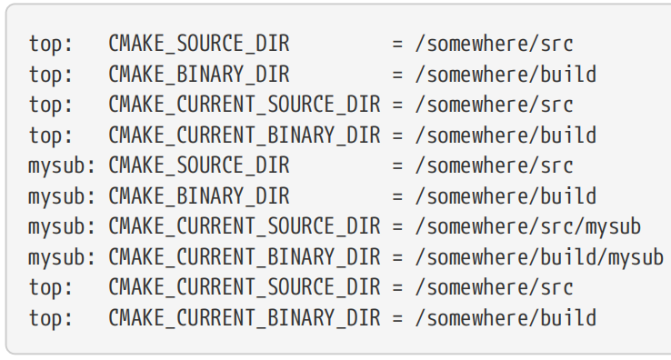
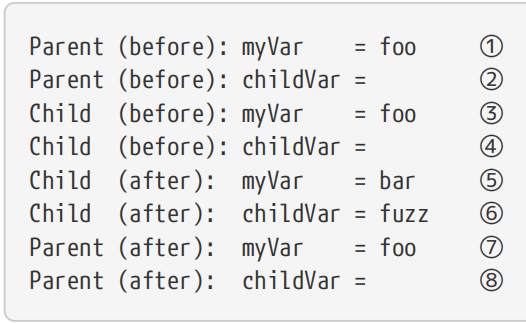
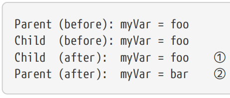
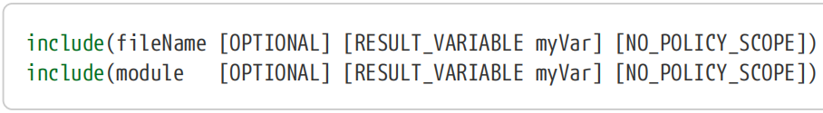
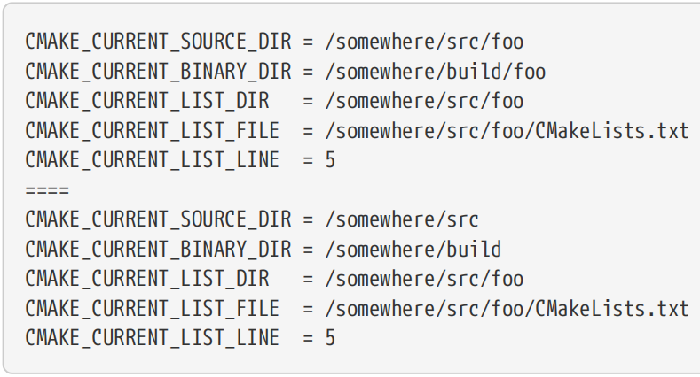
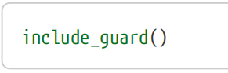

# Ch7. Using Subdirectories

For simple projects, keeping everything in one directory is fine, but most real world projects tend to split their files across multiple directories. It is common to find different file types or individual modules grouped under their own directories, or for files belonging to logical functional groupings to be in their own part of the project’s directory hierarchy. While the directory structure may be driven by how developers think of the project, the way the project is structured also impacts the build system. 【译】对于简单的项目，将所有内容保存在一个目录中是可以的，但大多数现实世界的项目倾向于将文件拆分到多个目录中。通常会发现不同的文件类型或单独的模块分组在自己的目录下，或者属于逻辑功能分组的文件位于项目目录层次结构的自己部分。虽然目录结构可能由开发人员对项目的看法决定，但项目的结构方式也会影响构建系统。

Two fundamental CMake commands in any multi-directory project are add_subdirectory() and include(). These commands bring content from another file or directory into the build, allowing the build logic to be distributed across the directory hierarchy rather than forcing everything to be defined at the top-most level. This offers a number of advantages: 【译】任何多目录项目中的两个基本CMake命令是add_subdirectory()和include()。这些命令将来自另一个文件或目录的内容带入构建中，允许构建逻辑在目录层次结构中分布，而不是强制在最顶层定义所有内容。这提供了许多优点：

• Build logic is localized, meaning that characteristics of the build can be defined in the directory where they have the most relevance. 【译】构建逻辑是本地化的，这意味着构建的特征可以在它们最相关的目录中定义。

• Builds can be composed of subcomponents which are defined independently from the top level project consuming them. This is especially important if a project makes use of things like git submodules or embeds third party source trees. 【译】构建可以由独立于使用它们的顶级项目定义的子组件组成。如果一个项目使用git子模块或嵌入第三方源代码树，这一点尤为重要。

• Because directories can be self-contained, it becomes relatively trivial to turn parts of the build on or off simply by choosing whether or not to add in that directory.【译】因为目录可以是自包含的，所以通过选择是否添加到该目录中来打开或关闭构建的部分内容变得相对简单。

add_subdirectory() and include() have quite different characteristics, so it is important to understand the strengths and weaknesses of both. 【译】add_subdirectory()和include()具有截然不同的特征，因此了解两者的优缺点非常重要。

## 7.1. add_subdirectory()

The add_subdirectory() command allows a project to bring another directory into the build. That directory must have its own CMakeLists.txt file which will be processed at the point where add_subdirectory() is called and a corresponding directory will be created for it in the project’s build tree. 【译】add_subdirectory() 命令允许项目将另一个目录带入构建中。该目录必须有自己的CMakeLists.txt文件，该文件将在调用add_subdirectory()时进行处理，并在项目的构建树中为其创建相应的目录。

\##-----------------------------------------\>\>\>

add_subdirectory(sourceDir \[ binaryDir \] \[ EXCLUDE_FROM_ALL \])

\##-----------------------------------------\<\<\<

The sourceDir does not have to be a subdirectory within the source tree, although it usually is. Any directory can be added, with sourceDir being specified as either an absolute or relative path, the latter being relative to the current source directory. Absolute paths are typically only needed when adding directories that are outside the main source tree. 【译】sourceDir不必是源树中的子目录，尽管它通常是。可以添加任何目录，将sourceDir指定为绝对或相对路径，后者相对于当前源目录。通常只有在添加主源代码树之外的目录时才需要绝对路径。

Normally, the binaryDir does not need to be specified. When omitted, CMake creates a directory in the build tree with the same name as the sourceDir. If sourceDir contains any path components, these will be mirrored in the binaryDir created by CMake. Alternatively, the binaryDir can be explicitly specified as either an absolute or relative path, with the latter being evaluated relative to the current binary directory (discussed in more detail shortly). If sourceDir is a path outside the source tree, CMake requires the binaryDir to be specified since a corresponding relative path can no longer be constructed automatically. 【译】通常，不需要指定binaryDir。\|\|\|\|如果省略，CMake会在构建树中创建一个与sourceDir同名的目录。如果sourceDir包含任何路径组件，这些组件将被镜像到CMake创建的binaryDir中。或者，binaryDir可以显式指定为绝对或相对路径，后者相对于当前二进制目录进行评估（稍后将更详细地讨论）。 \|\|\|\|如果sourceDir是源树之外的路径，CMake要求指定binaryDir，因为无法再自动构造相应的相对路径。

The optional EXCLUDE_FROM_ALL keyword is intended to control whether targets defined in the subdirectory being added should be included in the project’s ALL target by default. Unfortunately, for some CMake versions and project generators, it doesn’t always act as expected and can even result in broken builds. 【译】可选的EXCLUDE_FROM_ALL关键字用于控制默认情况下，添加的子目录中定义的目标是否应包含在项目的ALL目标中。不幸的是，对于某些CMake版本和项目生成器，它并不总是按预期运行，甚至可能导致构建失败。

### 7.1.1. Source And Binary Directory Variables

Sometimes a developer needs to know the location of the build directory corresponding to the current source directory, such as when copying files needed at run time or to perform a custom build task. With add_subdirectory(), both the source and the build trees’ directory structures can be arbitrarily complex. There could even be multiple build trees being used with the same source tree. The developer therefore needs some assistance from CMake to determine the directories of interest. To that end, CMake provides a number of variables which keep track of the source and binary directories for the CMakeLists.txt file currently being processed. The following read-only variables are updated automatically as each file is processed by CMake. They always contain absolute paths. 【译】有时，开发人员需要知道与当前源目录对应的构建目录的位置，例如在运行时复制所需的文件或执行自定义构建任务时。使用add_subdirectory()，源代码和构建树的目录结构都可以任意复杂。甚至可能有多个构建树与同一源树一起使用。因此，开发人员需要CMake的帮助来确定感兴趣的目录。为此，CMake提供了许多变量，用于跟踪当前正在处理的CMakeLists.txt文件的源代码和二进制目录。当CMake处理每个文件时，以下只读变量会自动更新。它们总是包含绝对路径。

**\#(1)CMAKE_SOURCE_DIR**

The top-most directory of the source tree (i.e. where the top-most CMakeLists.txt file resides).

This variable never changes its value. 【译】源代码树的最顶层目录（即最顶层的CMakeLists.txt文件所在的位置）。

这个变量永远不会改变它的值。

**\#(2)CMAKE_BINARY_DIR**

The top-most directory of the build tree. This variable never changes its value. 【译】构建树的最顶层目录。这个变量永远不会改变它的值。

**\#(3)CMAKE_CURRENT_SOURCE_DIR**

The directory of the CMakeLists.txt file currently being processed by CMake. It is updated each time a new file is processed as a result of an add_subdirectory() call and is restored back again when processing of that directory is complete. 【译】CMake当前正在处理的CMakeLists.txt文件的目录。每次由于add_subdirectory()调用而处理新文件时，它都会更新，并在处理完该目录后再次还原。

**\#(4)CMAKE_CURRENT_BINARY_DIR**

The build directory corresponding to the CMakeLists.txt file currently being processed by CMake. It changes for every call to add_subdirectory() and is restored again when add_subdirectory() returns. 【译】CMake当前正在处理的CMakeLists.txt文件对应的构建目录。每次调用add_subdirectory()时，它都会发生变化，并在add_subirectory()返回时再次恢复。

An example should help demonstrate the behavior:【译】一个例子应该有助于演示这种行为：

*\# Top level CMakeLists.txt*

\##--------------------------------------------------------------\>\>\>

cmake_minimum_required(VERSION 3.0)

project(MyApp)

message("top: CMAKE_SOURCE_DIR = \${CMAKE_SOURCE_DIR}")

message("top: CMAKE_BINARY_DIR = \${CMAKE_BINARY_DIR}")

message("top: CMAKE_CURRENT_SOURCE_DIR = \${CMAKE_CURRENT_SOURCE_DIR}")

message("top: CMAKE_CURRENT_BINARY_DIR = \${CMAKE_CURRENT_BINARY_DIR}")

add_subdirectory(mysub)

message("top: CMAKE_CURRENT_SOURCE_DIR = \${CMAKE_CURRENT_SOURCE_DIR}")

message("top: CMAKE_CURRENT_BINARY_DIR = \${CMAKE_CURRENT_BINARY_DIR}")

\##--------------------------------------------------------------\<\<\<

*\## mysub/CMakeLists.txt*

\##--------------------------------\>\>\>

message("mysub: CMAKE_SOURCE_DIR = \${CMAKE_SOURCE_DIR}")

message("mysub: CMAKE_BINARY_DIR = \${CMAKE_BINARY_DIR}")

message("mysub: CMAKE_CURRENT_SOURCE_DIR = \${CMAKE_CURRENT_SOURCE_DIR}")

message("mysub: CMAKE_CURRENT_BINARY_DIR = \${CMAKE_CURRENT_BINARY_DIR}")

\##--------------------------------\<\<\<

For the above example, if the top level CMakeLists.txt file was in the directory /somewhere/src and the build directory was /somewhere/build, the following output would be generated:

【译】对于上面的示例，如果顶级CMakeLists.txt文件位于目录/otherape/src中，构建目录为/otherape/build，则将生成以下输出：

### 7.1.2. Scope

In “Chapter 5, Variables”, the concept of scope was mentioned briefly. One of the effects of calling add_subdirectory() is that CMake creates a new scope for processing that directory’s CMakeLists.txt file. That new scope acts like a child of the calling scope and there are a number of effects:

【译】在“第5章，变量”中，简要提到了作用域的概念。调用add_subdirectory()的效果之一是CMake创建了一个新的作用域来处理该目录的CMakeLists.txt文件。这个新作用域就像调用作用域的子作用域，有很多影响：

• All variables defined in the calling scope will be visible to the child scope and the child scope can read their values like any other variable.

【译】调用作用域中定义的所有变量对子作用域都是可见的，子作用域可以像读取任何其他变量一样读取它们的值。

• Any new variable created in the child scope will not be visibile to the calling scope. 【译】在子作用域中创建的任何新变量都不会被调用作用域访问。

• Any change to a variable in the child scope is local to that child scope. Even if that variable existed in the calling scope, the calling scope’s variable is left unchanged. The variable modified in the child scope acts like a new variable that is discarded when processing leaves the child scope.【译】对子作用域中变量的任何更改都是该子作用域的局部更改。即使该变量存在于调用作用域中，调用作用域的变量也保持不变。在子作用域中修改的变量就像一个新变量，在处理离开子作用域时被丢弃。

Put another way, upon entry into the child scope, it receives a copy of all of the variables defined in the calling scope at that point in time. Any changes to variables in the child are performed on the child’s copy, leaving the caller’s variables unchanged. An example best illustrates the behavior:

【译】换句话说，在进入子作用域时，它会收到在该时间点调用作用域中定义的所有变量的副本。对子对象中变量的任何更改都会在子对象的副本上执行，而调用方的变量保持不变。一个例子最好地说明了这种行为：

*\#CMakeLists.txt*

\##--------------------------------------------\>\>\>

set(myVar foo)

message("Parent (before): myVar = \${myVar}")

message("Parent (before): childVar = \${childVar}")

add_subdirectory(subdir)

message("Parent (after): myVar = \${myVar}")

message("Parent (after): childVar = \${childVar}")

\##--------------------------------------------\<\<\<

*\#subdir/CMakeLists.txt*

\##--------------------------------------------\>\>\>

message("Child (before): myVar = \${myVar}")

message("Child (before): childVar = \${childVar}")

set(myVar bar)

set(childVar fuzz)

message("Child (after): myVar = \${myVar}")

message("Child (after): childVar = \${childVar}")

\##--------------------------------------------\<\<\<

This produces the following output: 【译】这将产生以下输出：

① myVar is defined at the parent level.

② childVar is not defined at the parent level, so it evaluates to an empty string.

③ myVar is still visible in the child scope.

④ childVar is still undefined in the child scope before it is set.

⑤ myVar is modified in the child scope.

⑥ childVar is has been set in the child scope.

⑦ When processing returns to the parent scope, myVar still has the value from before the call to add_subdirectory(). The modification to myVar in the child scope is not visible to the parent.

【译】当处理返回到父作用域时，myVar仍然具有调用add_subdirectory（）之前的值。子作用域中对myVar的修改对父作用域不可见。

⑧ childVar was defined in the child scope, so it is not visible to the parent and evaluates to an empty string. 【译】childVar是在子作用域中定义的，因此它对父作用域不可见，并且计算结果为空字符串。

The above behavior of scoping for variables highlights one of the important characteristics of add_subdirectory(). It allows the added directory to change whatever variables it wants without affecting variables in the calling scope. This helps keep the calling scope isolated from potentially unwanted changes.【译】上述变量作用域的行为突出了add_subdirectory()的一个重要特征。它允许添加的目录更改它想要的任何变量，而不会影响调用范围内的变量。这有助于将调用范围与可能不需要的更改隔离开来。

There are times, however, where it is desirable for a variable change made in an added directory to be visible to the caller. For example, the directory may be responsible for collecting a set of source file names and passing it back up to the parent as a list of files. This is the purpose of the PARENT_SCOPE keyword in the set() command. When PARENT_SCOPE is used, the variable being set is the one in the parent scope, not the one in the current scope. Importantly, it does *not* mean set the variable in both the parent *and* the current scope. Modifying the previous example slightly, the effect of PARENT_SCOPE becomes clear:

【译】然而，有时需要在添加的目录中进行的变量更改对调用者可见。例如，目录可能负责收集一组源文件名，并将其作为文件列表传递给父目录。这就是set()命令中PARENT_SCOPE关键字的目的。当使用PARENT_SCOPE时，所设置的变量是父作用域中的变量，而不是当前作用域中。重要的是，这并不意味着在父级和当前作用域中都设置变量。稍微修改一下前面的例子，PARENT_SCOPE的效果就变得很明显了：

*\#CMakeLists.txt*

*\##-----------------\>\>\>*

set(myVar foo)

message("Parent (before): myVar = \${myVar}")

add_subdirectory(subdir)

message("Parent (after): myVar = \${myVar}")

*\##-----------------\<\<\<*

\#*subdir/CMakeLists.txt*

*\##-----------------\>\>\>*

message("Child (before): myVar = \${myVar}")

set(myVar bar PARENT_SCOPE)

message("Child (after): myVar = \${myVar}")

*\##-----------------\<\<\<*

This produces the following output:【译】这将产生以下输出：

① The myVar in the child scope is not affected by the set() call because the PARENT_SCOPE keyword tells CMake to modify the parent’s myVar, not the local one. 【译】子作用域中的myVar不受set()调用的影响，因为PARENT_scope关键字告诉CMake修改父级的myVar，而不是本地的。

② The parent’s myVar has been modified by the set() call in the child scope. 【译】父级的myVar已被子级作用域中的set()调用修改。

Because the use of PARENT_SCOPE prevents any local variable of the same name from being modified by the command, it can be less misleading if the local scope does not reuse the same variable name as one from the parent. In the above example, a clearer set of commands would be:

【译】因为使用PARENT_SCOPE可以防止命令修改任何同名的局部变量，所以如果局部作用域不重用与父级相同的变量名，则误导性较小。在上面的例子中，一组更清晰的命令是：

\#*subdir/CMakeLists.txt*

\##----------------------\>\>\>

set(localVar bar)

set(myVar \${localVar} PARENT_SCOPE)

\##----------------------\<\<\<

Obviously the above is a trivial example, but for real world projects, there may be many commands which contribute to building up the value of localVar before finally setting the parent’s myVar variable.

【译】显然，上面是一个微不足道的例子，但对于现实世界的项目，在最终设置父级的myVar变量之前，可能有许多命令有助于建立localVar的值。

It’s not just variables that are affected by scope, policies and some properties also have similar behavior to variables in this regard. In the case of policies, each add_subdirectory() call creates a new scope in which policy changes can be made without affecting the policy settings of the parent. Similarly, there are directory properties which can be set in the child directory’s CMakeLists.txt file which will have no effect on the parent’s directory properties. Both of these are covered in more detail in their own respective chapters: “Chapter 12, Policies” and “Chapter 9, Properties”. 【译】受作用域影响的不仅仅是变量，**策略和一些属性**在这方面也与变量有相似的行为。在策略的情况下，每个add_subdirectory()调用都会创建一个新的作用域，在这个作用域中可以进行策略更改，而不会影响父级的策略设置。同样，可以在子目录的CMakeLists.txt文件中设置目录属性，这些属性对父目录的目录属性没有影响。这两个章节在各自的章节中有更详细的介绍：“第12章，政策”和“第9章，财产”。

## 7.2. include()

The other method CMake provides for pulling in content from other directories is the include() command, which has the following two forms:

【译】CMake提供的另一种从其他目录中提取内容的方法是include()命令，它有以下两种形式：

The first form is somewhat analogous to add_subdirectory(), but there are a number of important differences: 【译】第一种形式有点类似于add_subdirectory()，但有一些重要区别：

• include() expects the name of a file to read in, whereas add_subdirectory() expects a directory and will look for a CMakeLists.txt file within that directory. The file name passed to include() typically has the extension .cmake, but it can be anything. 【译】include()需要读取文件名，而add_subdirectory()需要一个目录，并在该目录中查找CMakeLists.txt文件。传递给include()的文件名通常具有.cmake扩展名，但它可以是任何名称。

• include() does not introduce a new variable scope, whereas add_subdirectory() does.

【译】Include()**不会引入新**的变量**作用域**，而add_subdirectory()会引入。

• Both commands introduce a new policy scope by default, but the include() command can be told not to do so with the NO_POLICY_SCOPE option (add_subdirectory() has no such option). See “Chapter 12, Policies” for further details on policy scope handling. 【译】默认情况下，这两个命令都会引入一个新的策略范围，但可以通过NO_POLICY_SCOPE选项告诉include()命令不要这样做（add_subdirectory()没有这样的选项）。有关政策范围处理的更多详细信息，请参阅“第12章，政策”。

• The value of the CMAKE_CURRENT_SOURCE_DIR and CMAKE_CURRENT_BINARY_DIR variables do not change when processing the file named by include(), whereas they do change for add_subdirectory(). This will be discussed in more detail shortly. 【译】处理include()命名的文件时，CMAKE_CURRENT_SOURCE_DIR和CMAKE_CURRENT_BINARY_DIR变量的值不会改变，而add_subdirectory()的值会改变。稍后将对此进行更详细的讨论。

The second form of the include() command serves an entirely different purpose. It is used to load the named module, a topic covered in depth in “Chapter 11, Modules”. All but the first of the above points also hold true for this second form. 【译】Include()命令的第二种形式具有完全不同的目的。它用于加载命名模块，这是“第11章，模块”中深入探讨的主题。除第一点外，上述所有点都适用于第二种形式。

Since the value of CMAKE_CURRENT_SOURCE_DIR does not change when include() is called, it may seem difficult for the included file to work out the directory in which it resides. CMAKE_CURRENT_SOURCE_DIR will contain the location of the file from where include() was called, not the directory containing the included file. Furthermore, unlike add_subdirectory() where the fileName will always be CMakeLists.txt, the name of the file can be anything when using include(), so it can be difficult for the included file to determine its own name. To address situations like these, CMake provides an additional set of variables: 【译】由于调用include()时CMAKE_CURRENT_SOURCE_DIR的值不会改变，因此包含的文件似乎很难确定它所在的目录。CMAKE_CURRENT_SOURCE_DIR将包含调用include()的文件的位置，而不是包含所包含文件的目录。此外，与add_subdirectory()不同，在add_subirectory()中，文件名始终为CMakeLists.txt，使用include()时，文件名可以是任何名称，因此包含的文件很难确定自己的名称。为了解决这些情况，CMake提供了一组额外的变量：

\#(1)CMAKE_CURRENT_LIST_DIR

Analogous to CMAKE_CURRENT_SOURCE_DIR except it will be updated when processing the included file. This is the variable to use where the directory of the current file being processed is required, no matter how it has been added to the build. It will always hold an absolute path.

【译】类似于CMAKE_CURRENT_SOURCE_DIR，但在处理包含的文件时会进行更新。这是在需要当前正在处理的文件的目录的地方使用的变量，无论它是如何添加到构建中的。它将永远保持一条绝对的道路。

**\#(2)CMAKE_CURRENT_LIST_FILE**

Always gives the name of the file currently being processed. It always holds an absolute path to the file, not just the file name. 【译】始终给出当前正在处理的文件的名称。它始终保存文件的绝对路径，而不仅仅是文件名。

**\#(3)CMAKE_CURRENT_LIST_LINE**

Holds the line number of the file currently being processed. This variable is rarely needed, but may prove useful in some debugging scenarios. 【译】保存当前正在处理的文件的行号。这个变量很少需要，但在某些调试场景中可能很有用。

It is important to note that the above three variables work for any file being processed by CMake, not just those pulled in by an include() command. They have the same values as described above even for a CMakeLists.txt file pulled in via add_subdirectory(), in which case CMAKE_CURRENT_LIST_DIR would have the same value as CMAKE_CURRENT_SOURCE_DIR. The following example demonstrates the behavior: 【译】值得注意的是，上述三个变量适用于CMake处理的任何文件，而不仅仅是那些由include()命令拉入的文件。即使对于通过add_subdirectory()拉入的CMakeLists.txt文件，它们也具有与上述相同的值，在这种情况下，CMAKE_CURRENT_LIST_DIR将具有与CMAKE_CURRENT_SOURCE_DIR相同的值。以下示例演示了行为：

\#*CMakeLists.txt*

\##-----------------------------\>\>\>

add_subdirectory(subdir)

message("====")

include(subdir/CMakeLists.txt)

\##-----------------------------\<\<\<

\#*subdir/CMakeLists.txt*

*\##---------------\>\>\>*

message("CMAKE_CURRENT_SOURCE_DIR = \${CMAKE_CURRENT_SOURCE_DIR}")

message("CMAKE_CURRENT_BINARY_DIR = \${CMAKE_CURRENT_BINARY_DIR}")

message("CMAKE_CURRENT_LIST_DIR = \${CMAKE_CURRENT_LIST_DIR}")

message("CMAKE_CURRENT_LIST_FILE = \${CMAKE_CURRENT_LIST_FILE}")

message("CMAKE_CURRENT_LIST_LINE = \${CMAKE_CURRENT_LIST_LINE}")

*\##---------------\<\<\<*

This produces output like the following:【译】*这将产生如下输出：*

The above example also highlights another interesting characteristic of the include() command. It can be used to include content from a file which has already been included in the build previously. If different subdirectories of a large, complex project both want to make use of CMake code in some file in a common area of the project, they may both include() that file independently.【译】上述示例还突出了include()命令的**另一个有趣特性**。它可用于包含先前已包含在构建中的文件中的内容。如果一个大型复杂项目的不同子目录都希望在项目公共区域的某个文件中使用CMake代码，则它们都可以独立地包含该文件。

There can be occasions where a project may want to stop processing the remainder of the current file and return control back to the caller. The return() command can be used for exactly this purpose, but note that it cannot return a value to the caller. It’s only effect is to end processing of the current scope. If not called from inside a function, return() ends processing of the current file regardless of whether it was brought in via include() or add_subdirectory(). The effect of calling return() inside a function is covered in Section 8.4, “Scope”, including special attention for a common mistake that can result in returning from the current file unintentionally.

【译】有时，项目可能希望停止处理当前文件的其余部分，并将控制权返回给调用者。Return()命令可用于此目的，但请注意，它不能向调用者返回值。它唯一的作用是结束当前作用域的处理。

如果不是从函数内部调用，return()将结束对当前文件的处理，而不管它是通过include()还是add_subdirectory()引入的。

在函数内调用return()的效果在第8.4节“作用域”中有所介绍，包括特别注意可能导致无意中从当前文件返回的常见错误。

As noted in the previous section, different parts of a project may include the same file from multiple places. It can sometimes be desirable to check for this and only include the file once, returning early for subsequent inclusions to prevent reprocessing the file multiple times. This is very similar to the situation for C/C++ headers and it is fairly common to see a similar form of include guard used: 【译】如前一节所述，**项目的不同部分可能包含来自多个位置的同一文件**。有时可能需要检查这一点，并且只包含一次文件，提前返回以进行后续包含，以防止多次重新处理文件。这与C/C++头文件的情况非常相似，并且经常看到使用类似形式的include-guard：

\##-----------------------------\>\>\>

if(DEFINED cool_stuff_include_guard)

return()

endif()

set(cool_stuff_include_guard 1)

\# ...

\##-----------------------------\<\<\<

With CMake 3.10 or later, this can be expressed more succinctly and robustly with a dedicated command whose behavior is analogous to the \#pragma once of C/C++: 【译】使用CMake 3.10或更高版本，可以用一个专用命令include_guard更简洁、更稳健地表达这一点，该命令的行为类似于C/C++中的#pragma once：

Compared to manually writing out the if-endif code, this is more robust because it handles the name of the guard variable internally. The command also accepts an optional keyword argument DIRECTORY or GLOBAL to specify a different scope within which to check for the file having been processed previously, but these keywords are unlikely to be needed in most situations. With neither argument specified, variable scope is assumed and the effect is exactly equivalent to the if-endif code above. GLOBAL ensures the command ends processing of the file if it has been processed before anywhere else in the project (i.e. variable scope is ignored). DIRECTORY checks for previous processing only within the current directory scope and below. 【译】与手动写出if-endif代码相比，这更稳健，因为它在内部处理保护变量的名称。该命令还接受一个可选的关键字参数**DIRECTORY或GLOBAL**，以指定一个不同的范围，在该范围内检查之前处理过的文件，但在大多数情况下不太可能需要这些关键字。在没有指定任何参数的情况下，假设变量作用域，其效果与上面的if-endif代码完全相同。GLOBAL确保如果文件在项目中的任何其他地方之前已被处理，则命令会结束对文件的处理（即忽略变量作用域）。DIRECTORY仅在当前目录范围内及以下检查以前的处理。

## 7.4. Recommended Practices

The best choice between using add_subdirectory() or include() to bring another directory into the build is not always obvious. On the one hand, add_subdirectory() is simpler and does a better job of keeping directories relatively self contained because it creates its own scope. On the other, some CMake commands have restrictions which only allow them to operate on things defined within the current file scope, so include() works better for those cases. Section 28.5.1, “Target Sources” discusses some aspects of this topic. 【译】使用add_subdirectory()或include()将另一个目录带入构建中的最佳选择并不总是显而易见的。一方面，add_subdirectory()更简单，在保持目录相对独立方面做得更好，因为它创建了自己的作用域。另一方面，一些CMake命令有限制，只允许它们对当前文件范围内定义的内容进行操作，因此include()更适合这些情况。第28.5.1节“目标来源”讨论了本主题的一些方面。

As a general guide, most simple projects are probably better off preferring to use add_subdirectory() over include(). It promotes cleaner definition of the project and allows the CMakeLists.txt for a given directory to focus more on just what that directory needs to define. As a project evolves, it may start to use include() for some directories where this makes sense. Following this strategy will promote better locality of information throughout the project and will also tend to introduce complexity only where it is needed and where it brings useful benefits. It’s not that include() itself is any more complicated than add_subdirectory(), but the use of include() tends to result in paths to files needing to be more explicitly spelled out, since what CMake considers the current source directory is not that of the included file. There are also efforts underway to remove some of the restrictions associated with calling some commands from different directories, so add_subdirectory() is likely to become more flexible and be the more preferred of the two methods. 【译】一般来说，大多数简单的项目可能更喜欢使用add_subdirectory()而不是include()。它促进了项目的更清晰定义，并允许给定目录的CMakeLists.txt更专注于该目录需要定义的内容。随着项目的发展，它可能会开始对一些有意义的目录使用include()。遵循这一策略将促进整个项目中信息的更好局部性，并且往往只在需要和带来有益利益的地方引入复杂性。这并不是说include()本身比add_subdirectory()更复杂，但使用include()往往会导致需要更明确地说明文件的路径，因为CMake认为当前的源目录不是包含文件的目录。也有人正在努力消除与从不同目录调用某些命令相关的一些限制，因此add_subdirectory()可能会变得更加灵活，并成为这两种方法中更受欢迎的方法。

Irrespective of whether using add_subdirectory(), include() or a combination of both, the CMAKE_CURRENT_LIST_DIR variable is generally going to be a better choice than CMAKE_CURRENT_SOURCE_DIR. By establishing the habit of using CMAKE_CURRENT_LIST_DIR early, it is much easier to switch between add_subdirectory() and include() as a project grows in complexity and to move entire directories to restructure a project. 【译】无论是使用add_subdirectory()、include()还是两者的组合，CMAKE_CURRENT_LIST_DIR变量通常都是比CMAKE_CURRENT_SOURCE_DIR更好的选择。通过尽早建立使用CMAKE_CURRENT_LIST_DIR的习惯，随着项目复杂性的增加，在add_subirectory()和include()之间切换要容易得多，并且可以移动整个目录来重构项目。

If the project requires CMake 3.10 or later, prefer to use the include_guard() command without arguments instead of an explicit if-endif block in cases where multiple inclusion of a file must be prevented. 【译】如果项目需要CMake 3.10或更高版本，在必须**防止文件多次包含**的情况下，最好使用不带参数的include_guard()命令，而不是显式的if-endif块。
